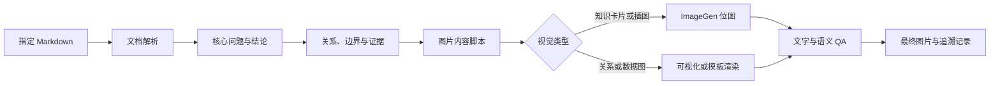

# Markdown 知识文档到知识图片：Skill 能力梳理

## 目标与范围

目标是建立一条可重复执行的处理链：读取用户指定的 Markdown 文档，提取其中的核心问题、关键结论、概念关系和边界，再将结构化结果转换为适合阅读和传播的知识图片。

这个目标包含四类不同工作：

1. 保证原始 Markdown 知识文档质量与结构稳定。
2. 对指定文档进行有损但可控的摘要与归纳。
3. 将摘要转化为图片所需的信息层级、视觉叙事和生成提示。
4. 生成、检查并迭代最终图片。

“标准化 Markdown”与“知识图片”不应混成一次不可见的生成。中间应保留一份可审查的图片内容摘要，否则无法判断知识遗漏、语义偏移究竟发生在摘要阶段还是画面生成阶段。

## 当前可用 Skills

以下结论仅基于当前会话中已公开的 skill 名称和描述。本次未加载或执行任何 skill，因此具体参数、强制步骤和输出约束需在用户授权使用后再确认。

### 核心能力

| Skill | 在目标中的作用 | 适合产物 | 不应承担的职责 |
| --- | --- | --- | --- |
| `personal-learn` | 生成或实质修订仓库内的 Markdown 学习文档，并按仓库规范组织内容、图表与验证 | 标准化知识文档、Mermaid 图表 | 不宜直接代替位图的视觉设计与图像生成 |
| `imagegen` | 根据内容说明生成全新位图，或编辑已有图片 | PNG 等位图知识卡片、插图、视觉海报 | 不应负责从长文中决定哪些结论最重要 |
| `visualize:visualize` | 在对话中创建可视化、图表、比较、可调整探索工具或 UI 原型 | 交互式图表、可视化原型、信息布局验证 | 它的核心是交互可视化，不等同于稳定输出一张最终位图 |
| `skill-creator` | 将反复执行的“Markdown 到知识图片”流程封装成专用 skill，并改进其触发描述、评估和质量 | 专用 workflow skill、参考模板、评估用例 | 不直接代替实际的文档归纳或图片生成 |

### 验证与辅助能力

| Skill | 可能用途 | 何时才有价值 |
| --- | --- | --- |
| `agent-browser` | 打开本地预览页、检查 Markdown/Mermaid 渲染、截图或进行视觉 QA | 知识图片由 HTML/CSS 模板渲染，或需检查实际页面效果时 |
| `browser:control-in-app-browser` | 在 Codex 内置浏览器中导航、截图和测试本地页面 | 需使用当前已登录的浏览器会话，或用户明确指定内置浏览器时 |
| `brainstorming` | 在创建专用 skill、图片模板或新的生成流程前澄清目标、要求与设计 | 用户决定开始实现新能力时 |
| `writing-skills` | 创建、编辑或验证专用 skill | 已确定要将流程工程化时 |
| `requesting-code-review` | 在完成生成脚本、模板或专用 skill 后进行复核 | 已有实际代码或重要实现变更时 |

`template-creator:template-creator` 面向从参考文档、幻灯片、表格或图片创建可复用的个人产物模板 skill。当目标不只是流程自动化，还需要从一张已有知识图片反推并固化视觉风格时，它才是补充选项。

## Find Skills 搜索结果

> 实施状态：`infographic` 和 `visual-explainer` 已安装到当前项目的 `.agents/skills/`，并在 `docs/knowledge-images/` 完成三篇文章的首轮试验。

2026-08-01 使用 `find-skills` 对 skills.sh 榜单和 CLI 搜索结果进行了一轮筛选。搜索词包括 `markdown infographic`、`knowledge visualization`、`article summary`、`visual explainer`、`canvas design` 和 `image generation`。筛选标准是任务匹配度、安装量、仓库信誉和 GitHub stars，而不是只看名称。

skills.sh 的安装量和 GitHub stars 会变化，下表是本次查询时的快照。

### 优先候选

| 优先级 | Skill | 查询快照 | 匹配判断 | 安装命令 |
| --- | --- | --- | --- | --- |
| 1 | [`markdown-viewer/skills@infographic`](https://skills.sh/markdown-viewer/skills/infographic) | 3.1K installs；仓库约 2.9K stars | 当前最贴近“Markdown 到结构化知识图”。提供 70+ YAML 信息图模板，覆盖时间线、路线图、SWOT、漏斗和组织树等。 | `npx skills add markdown-viewer/skills@infographic` |
| 2 | [`anthropics/skills@canvas-design`](https://skills.sh/anthropics/skills/canvas-design) | 约 91.5K installs；仓库约 164.6K stars | 适合生成精细的 PDF/PNG 视觉作品，但它倾向 90% 视觉、10% 文字，更适合封面、概念海报和低文字密度的知识图，不适合直接承载高密度摘要。 | `npx skills add anthropics/skills@canvas-design` |
| 3 | [`anthropics/knowledge-work-plugins@data-visualization`](https://skills.sh/anthropics/knowledge-work-plugins/data-visualization) | 约 10.3K installs；仓库约 23.1K stars | 包含图表选型、Python 可视化、设计和可访问性规则。当 Markdown 包含数据表、指标或统计关系时很有价值；不是概念型长文的通用解法。 | `npx skills add anthropics/knowledge-work-plugins@data-visualization` |
| 4 | [`nicobailon/visual-explainer@visual-explainer`](https://skills.sh/nicobailon/visual-explainer/visual-explainer) | 386 installs；仓库约 7.6K stars | 生成用于图解、架构概览、数据表和项目回顾的 HTML 页面或幻灯片。安装量较低，但仓库关注度较高；适合“先生成可审查视觉页，再导出图片”的路线。 | `npx skills add nicobailon/visual-explainer@visual-explainer` |

[`markdown-viewer/skills`](https://github.com/markdown-viewer/skills) 还包含 `infocard`、`canvas`、`mindmap`、`vega` 等相邻能力。其中 `infographic` 适合模板化信息图，`infocard` 适合知识摘要卡，`canvas` 适合概念图与知识图谱，`vega` 适合数据驱动图表。如果第一阶段试用 `infographic` 后发现用例分化，可再按需增加，不建议一次安装全部能力。

### 摘要端的搜索结论

`article summary` 的 CLI 搜索结果安装量普遍很低：最高的直接命中仅 64 installs，其余多为新闻、特定知识库或文章场景，没有达到值得推荐的质量信号。

Anthropic 的 knowledge-work 仓库中有 [`knowledge-synthesis`](https://skills.sh/anthropics/knowledge-work-plugins/knowledge-synthesis)，榜单显示约 5.2K installs，所在仓库约 23.1K stars。但本轮搜索没有获得足够的具体工作流说明，无法确认它是否保留来源定位、限定条件和文档层级。因此只将它列为待评估候选，不直接建议安装。

### 不纳入推荐的搜索命中

- `backnotprop/plannotator@plannotator-visual-explainer`：有约 5.2K installs，仓库约 5K stars，但主产品聚焦计划与代码 diff 审阅、标注和反馈，与知识文档到图片的主目标偏离。
- `skills-collective/skills@ai-image-generation`：搜索结果显示约 119.3K installs，但本轮未完成仓库和工作流的充分核验；而当前 Codex 已提供 `imagegen`，没有证据说明安装另一个通用图片生成 skill 能补足“Markdown 归纳”的核心缺口。
- 安装量低于 100 的摘要和信息图 skills：暂不建议用于项目的标准化主流程。

### 搜索后的安装建议

如果只安装一个新 skill，优先试用：

```bash
npx skills add markdown-viewer/skills@infographic
```

它补足的是当前流程中最明显的空缺：将已结构化的知识脚本稳定地映射到可维护的信息图模板。它不应代替 `personal-learn` 的文档质量规则，也不解决自动摘要的编辑决策。

暂不建议立即安装多个视觉 skill。先用 3–5 篇样本检验 `infographic` 的模板覆盖率、中文排版、导出格式和渲染器依赖，再决定是否增加 `canvas-design` 或 `visual-explainer`。

## 推荐组合

### 最小可行组合

`personal-learn` + `imagegen`

- `personal-learn` 负责原始 Markdown 的知识质量、归纳结构和文本图表。
- `imagegen` 负责将已确认的图片脚本转换成位图。

这个组合已能完成一次性任务，但还没有固化“如何从文档提取图片内容”的中间规则。

### 搜索后的低代码组合

`personal-learn` + `markdown-viewer/skills@infographic` + 现有 Mermaid 渲染

- 使用 `personal-learn` 管理原文的知识质量和文档规范。
- 先产出可审查的图片内容脚本。
- 对适合时间线、路线图、对比、分层或 KPI 卡片的内容，优先生成模板化 infographic。
- 对流程、组件关系、时序和状态转换，继续使用 Mermaid。
- 只有模板化图表无法表达的主题，再进入 `imagegen` 位图生成。

这条路线相比“所有内容都交给图像模型”更可审查、更易修改，也更适合对中文文字准确性有要求的知识图。

### 推荐的稳定组合

`personal-learn` + 专用的 `markdown-to-knowledge-image` skill + `imagegen`

专用 skill 应负责：

- 读取用户指定的 Markdown，不默认处理全仓库。
- 识别文档的核心问题、受众、重要结论和必要限定。
- 根据信息类型选择知识卡片、流程图、架构图、对比图或时间线。
- 生成可审查的“图片内容脚本”，而不是直接丢给图像模型一篇长文。
- 将脚本转为结构稳定的图像生成提示。
- 检查生成图片中的关键结论、文字、层级、阅读顺序和遗漏。
- 保存原文、内容脚本、生成提示和最终图片之间的可追溯关系。

`skill-creator` 或 `writing-skills` 可用于创建这个专用 skill；它们是开发阶段能力，不是每次图片生成都需要调用的运行时依赖。

## 建议的处理链



关键中间产物建议采用简单 Markdown：

```md
# 图片内容脚本

- 原文：`learn/.../source.md`
- 图片目标：让读者在 30 秒内理解……
- 目标读者：……
- 核心结论：……
- 阅读顺序：……
- 必须保留的限定：……
- 可删减的细节：……
- 视觉类型：知识卡片 / 流程图 / 对比图 / 时间线
- 画面比例：……
- 视觉风格：……
```

## 为什么不建议只使用 ImageGen

图像生成擅长处理已经转换为视觉语言的输入，但“从一篇知识文档中保留哪些内容”本质上是编辑决策。如果绕过中间脚本，容易出现：

- 正文中的限定条件被删掉，结论看起来更绝对。
- 概念层级被画面元素并列化，主次关系消失。
- 长文中频繁出现但并不重要的术语被错误强调。
- 图片文字过多，只是把 Markdown 换成了更难阅读的排版。
- 图片看起来完整，但无法追溯每个结论来自原文的何处。

## 当前缺口

当前可用 skills 可以组合完成一次性任务，但还没有一个已明确暴露的专用 skill 完整覆盖以下行为：

- 只读取用户指定的 Markdown。
- 依据文档语义选择合适的知识图片类型。
- 使用稳定、可复查的摘要格式。
- 管理中文长文到图片文案的压缩率和可读性。
- 检查图片文字、知识完整性和事实一致性。
- 管理输出路径、命名、版本和原文关联。

因此，如果该能力只偶尔使用，可按最小组合手动编排；如果会对多篇文档反复执行，建议创建专用 `markdown-to-knowledge-image` skill。

## 建议的实施顺序

1. 先选择 3–5 篇结构不同的 Markdown 作为样本，包含概念文、流程文、对比文和有较多限定条件的深度文章。
2. 人工为每篇样本编写理想的图片内容脚本，将它作为评估基准。
3. 先验证 `personal-learn` + `imagegen` 的手动组合，记录内容遗漏、文字错误和版式问题。
4. 根据实际失败案例设计专用 skill，不在没有基线的情况下先写大量抽象规则。
5. 将输出分成“内容脚本”和“最终图片”两个可单独验收的阶段。
6. 建立至少包含内容忠实度、文字准确性、层级清晰度、视觉可读性和源文档可追溯性的评估项。

## 调用授权

当前项目的 `AGENTS.md` 禁止隐式使用 skill、MCP、App/Connector 和插件能力。因此，执行本文建议的组合时，用户应在当前消息中明确点名要使用的能力，例如：

```text
使用 personal-learn 和 imagegen，将 learn/.../source.md 归纳为一张 16:9 的中文知识图片。
先输出图片内容脚本供我确认，不要直接生成图片。
```

如果只想获得建议而不执行 skill，应明确写“只分析，不调用 skill”。
