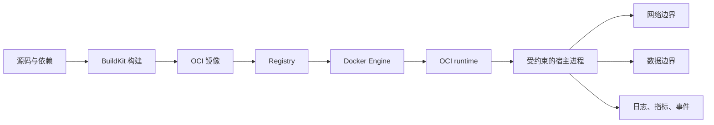

# Docker 系统学习指南：从容器使用到生产运行

> 版本基线：Docker Engine 29.x、Docker Compose v2、OCI Runtime Specification 1.3；查证日期：2026-08-01。Docker Desktop 与原生 Linux Engine 在文件系统、网络和资源路径上存在差异，文中会明确区分。

Docker 把应用及其运行依赖封装成可寻址、可分发的 OCI 镜像，再借助宿主内核启动受隔离和资源约束的进程。它真正重要的地方不在命令数量，而在于统一“构建—分发—运行”的制品边界，同时把数据、安全和可靠性责任暴露给工程团队。

这份指南以 Linux 容器为主线，覆盖日常 Docker 工作流、容器内核机制和生产边界；Kubernetes 只作为后续方向，不在这里展开。

## 1. 总览与概念地图

| 层级 | 需要掌握的概念 | 学完后的能力 |
| --- | --- | --- |
| 🟢 基础 | 1. 容器心智模型；2. 镜像与容器；3. CLI 与生命周期；4. Dockerfile；5. 端口与基础网络；6. volume 与 bind mount | 能独立构建、运行、观察和清理单容器应用 |
| 🔵 基础能力 | 7. BuildKit 与构建缓存；8. Compose；9. Registry、tag 与 digest；10. 环境配置与密钥；11. 健康检查、日志与信号；12. 资源限制与故障诊断 | 能维护多容器开发环境和可重复交付链路 |
| 🔴 高级 | 13. namespace、cgroup 与 OCI runtime；14. 镜像层与 snapshotter；15. 网络数据路径；16. 最小权限与 rootless；17. SBOM、provenance 与供应链；18. 生产可靠性与可观测性 | 能解释内部机制、评估风险并设计生产运行边界 |



## 2. 八周学习安排

默认投入为每周 5 天、每天 1–2 小时。每天至少一半时间应在终端里验证；只读资料不会形成可靠的运行模型。

### 第 1 周：对象模型与生命周期

目标是停止把容器理解成“小虚拟机”，并能解释镜像、容器和进程之间的关系。

- **Day 1**：安装并验证 Docker；运行 `hello-world`，记录 `docker version` 与 `docker info`。
- **Day 2**：运行 Nginx，练习 `run`、`ps`、`logs`、`exec`、`inspect`、`stop`、`rm`。
- **Day 3**：比较前台、后台、交互式和一次性容器；观察 PID 1 退出后的状态。
- **Day 4**：区分 image、container、volume、network；为每个对象写一句生命周期定义。
- **Day 5**：不看笔记完成“拉取—运行—观察—删除—重建”，解释哪些数据被保留。

### 第 2 周：Dockerfile 与镜像

目标是把一个真实小应用构建成镜像，并理解每条指令如何影响运行配置与层。

- **Day 1**：学习 `FROM`、`WORKDIR`、`COPY`、`RUN`、`CMD`、`ENTRYPOINT`。
- **Day 2**：为一个 Node.js 或 Python HTTP 服务写可运行 Dockerfile。
- **Day 3**：加入 `.dockerignore`，比较构建上下文、缓存命中和镜像内容。
- **Day 4**：改为非 root 用户；比较 shell form 与 exec form 的信号行为。
- **Day 5**：从空目录重建镜像，检查 `docker history` 和 `docker image inspect`。

### 第 3 周：网络与数据

目标是明确容器网络、宿主端口和持久数据是三条不同边界。

- **Day 1**：观察容器内监听端口与 `-p` 发布端口的区别。
- **Day 2**：创建用户自定义 bridge，让两个容器按服务名通信。
- **Day 3**：分别使用 writable layer、named volume、bind mount 和 tmpfs。
- **Day 4**：故意制造端口、权限和挂载路径错误并定位根因。
- **Day 5**：画出浏览器到容器进程、应用到 volume 的两条路径。

### 第 4 周：Compose 多容器工作流

目标是用声明文件复现一个应用、数据库和网络环境，而不是积累长命令。

- **Day 1**：编写包含应用、PostgreSQL、network 和 volume 的 `compose.yaml`。
- **Day 2**：练习 `up`、`down`、`logs`、`exec`、`config` 和 profile。
- **Day 3**：加入 healthcheck，验证启动顺序不等于应用就绪。
- **Day 4**：区分配置、密钥、镜像构建参数与运行环境变量。
- **Day 5**：删除并重建整个环境，验证数据库数据是否按预期保留。

### 第 5 周：BuildKit 与可重复构建

这一周较密集；如果缓存和多平台构建是新领域，可以增加 2–3 天。

- **Day 1**：把 Dockerfile 理解为依赖图，记录不同修改导致的缓存失效。
- **Day 2**：完成多阶段构建，分离 builder 和 runtime。
- **Day 3**：使用 cache mount、secret mount，证明密钥没有进入最终镜像。
- **Day 4**：使用 buildx 查看 builder 与目标平台；理解 emulation 和原生构建的差异。
- **Day 5**：锁定基础镜像 digest 和应用依赖，列出仍会导致非确定性的输入。

### 第 6 周：资源、安全与内部机制

目标是把 CLI 参数映射到 Linux 隔离和约束机制，并形成最小权限习惯。

- **Day 1**：学习 PID、mount、network、user namespace 的隔离对象。
- **Day 2**：设置 CPU、内存和 PIDs 限制，观察 throttling 与 OOM 行为。
- **Day 3**：理解 capability、seccomp、LSM、read-only root filesystem。
- **Day 4**：比较 root、`USER`、userns-remap 和 rootless；检查 Docker socket 风险。
- **Day 5**：审计一个 Compose 应用，删除不必要权限并记录兼容性代价。

### 第 7 周：供应链与交付

目标是从“我构建了一个 tag”升级到“我能证明部署了哪个内容”。

- **Day 1**：区分 tag、manifest digest、config digest 和 layer digest。
- **Day 2**：推送到测试 Registry，按 digest 拉取并运行。
- **Day 3**：生成 SBOM 与 provenance，检查它们实际声明了什么。
- **Day 4**：扫描镜像，区分漏洞存在、可达性与修复优先级。
- **Day 5**：设计“构建一次—测试—按 digest 晋级—回滚”的 CI/CD 流程。

### 第 8 周：生产诊断与毕业项目

目标是把制品、进程、资源、数据和网络信号串成一套排障方法。

- **Day 1**：练习 `inspect`、`events`、`stats`、`top`、`system df`。
- **Day 2**：制造退出码、OOM、DNS、端口和磁盘问题，按固定顺序排查。
- **Day 3**：设计日志、指标、trace、容器事件和实际 digest 的关联方式。
- **Day 4**：完成中型项目的安全与可靠性检查，演练升级和回滚。
- **Day 5**：闭卷解释 `docker run` 从 CLI 到 Linux 进程的路径，整理仍不确定的问题。

## 3. 本地开发环境

### 前置条件

- macOS 13+、Windows 11 + WSL 2，或主流 64 位 Linux；至少 4 核 CPU、8 GB 内存、20 GB 可用磁盘。
- 能使用 shell、Git，并理解进程、端口和文件权限。
- 本指南以 Docker Engine 29.x 和 Compose v2 为基线；先运行 `docker version` 确认实际版本。

### 安装

我建议 macOS/Windows 初学者使用 Docker Desktop，因为它把 Linux VM、Engine、Compose 和凭据集成在一起；Linux 学习者优先安装官方 Docker Engine，以便直接观察宿主 namespace、cgroup 和防火墙。

1. macOS 使用 Homebrew 安装 Docker Desktop：

   ```bash
   brew install --cask docker
   open -a Docker
   ```

2. Windows 在管理员 PowerShell 中确保 WSL 2 可用，再按 [Docker Desktop Windows 安装文档](https://docs.docker.com/desktop/setup/install/windows-install/) 安装：

   ```powershell
   wsl --install
   wsl --update
   ```

3. Linux 不要使用发行版中可能陈旧的 `docker.io` 包；按 [Docker Engine 官方安装页](https://docs.docker.com/engine/install/) 选择发行版仓库。安装后验证服务：

   ```bash
   sudo systemctl enable --now docker
   sudo docker version
   ```

   把用户加入 `docker` 组相当于授予接近宿主 root 的 daemon 控制权，不应把它当成纯便利设置；个人学习机可权衡使用，生产主机应明确授权模型。

### 验证环境

```bash
docker version
docker compose version
docker info
docker run --rm hello-world
docker run --rm alpine:3.22 uname -a
```

前四条确认客户端、daemon、Compose 和拉取路径；最后一条证明 Linux 容器共享的是承载它的 Linux 内核。在 macOS/Windows 上，这个内核属于 Docker Desktop VM，而不是宿主操作系统内核。

### 推荐编辑器与工具

- **VS Code + Container Tools 扩展**：Dockerfile、Compose、镜像和容器的日常入口。
- **Hadolint**：发现 Dockerfile 中高概率的可维护性和安全问题，但规则不是设计真理。
- **Dockle**：对镜像配置做静态安全检查；需要结合实际威胁模型解释结果。
- **Trivy 或 Docker Scout**：检查镜像包与漏洞；扫描结果不是可利用性证明。
- **Dive**：按层检查镜像内容，定位意外复制和空间浪费。

## 4. 概念深入与练习

## 🟢 基础

### 🟢 1. 容器心智模型

**它是什么**：容器首先是宿主机上的进程，只是进程看到的资源视图、可用资源和权限受到限制。Linux 容器通常共享宿主内核，不自带独立内核。

**为什么重要**：这个模型决定你如何理解性能、安全、信号、日志和故障；“轻量虚拟机”类比会隐藏关键边界。

**如何工作**：Docker 组合 namespace、cgroup、capability、seccomp 和文件系统 mount，建立容器进程的运行环境。

```text
Docker 配置 -> OCI runtime -> Linux 内核 -> 受约束的普通进程
```

**常见陷阱**：

- 把容器 root 当成天然安全边界。
- 认为容器包含自己的 Linux 内核。
- 把 Docker Desktop VM 的行为当成原生 Linux Engine。

#### ✏️ 练习

1. 在容器和宿主分别运行 `uname -a`，解释输出关系。
2. 用 `docker top` 和宿主 `ps` 找到同一个容器进程。
3. 画出 macOS Docker Desktop 中“宿主—Linux VM—容器进程”的三层关系。

### 🟢 2. 镜像与容器

**它是什么**：镜像是只读层与运行配置组成的可分发输入；容器是镜像的一次运行实例，并增加实例配置与可写层。

**为什么重要**：镜像、容器和数据的生命周期不同，混淆它们会导致更新漂移和数据丢失。

**如何工作**：

```bash
docker pull nginx:1.29-alpine
docker image inspect nginx:1.29-alpine
docker run --name web -d nginx:1.29-alpine
docker container inspect web
```

**常见陷阱**：

- 在运行中手工修改容器，再把实例当成可重复环境。
- 认为删除容器会删除镜像，或反过来。
- 使用 `latest` 猜测实际内容。

#### ✏️ 练习

1. 从同一镜像启动两个容器，比较 container ID 与 image ID。
2. 修改其中一个容器的文件，验证另一个容器不受影响。
3. 删除并重建修改过的容器，解释变化为何消失。

### 🟢 3. CLI 与容器生命周期

**它是什么**：Docker CLI 通过 API 请求 daemon 管理对象；`run`、`start`、`stop`、`kill`、`rm` 分别改变实例生命周期的不同阶段。

**为什么重要**：生产问题经常来自退出、信号和重启语义，而不是“容器没启动”。

**如何工作**：

```bash
docker run --name sleeper -d alpine:3.22 sleep 300
docker inspect -f '{{.State.Status}} {{.State.Pid}}' sleeper
docker stop --time 5 sleeper
docker inspect -f '{{.State.ExitCode}} {{.State.FinishedAt}}' sleeper
docker rm sleeper
```

**常见陷阱**：

- 用 `kill -9` 掩盖应用没有处理停止信号。
- 忘记 PID 1 的信号转发与子进程回收责任。
- 把 restart policy 当作根因修复。

#### ✏️ 练习

1. 比较前台和 `-d` 运行方式。
2. 比较 `docker stop` 与 `docker kill` 的退出状态。
3. 写一个能处理 SIGTERM 的小程序并验证优雅退出。

### 🟢 4. Dockerfile

**它是什么**：Dockerfile 是镜像构建定义；现代构建器将其转换为依赖图，而不只是机械执行 shell 脚本。

**为什么重要**：指令顺序决定缓存、攻击面、构建速度和运行行为。

**如何工作**：

```dockerfile
# syntax=docker/dockerfile:1
FROM node:22-bookworm-slim
WORKDIR /app
COPY package.json package-lock.json ./
RUN npm ci --omit=dev
COPY server.js ./
USER node
EXPOSE 3000
CMD ["node", "server.js"]
```

**常见陷阱**：

- 先 `COPY . .`，导致依赖缓存频繁失效。
- 用 shell form 启动主进程，造成信号路径变化。
- 把 token 写进 `ARG`、`ENV` 或镜像层。

#### ✏️ 练习

1. 构建上述镜像并运行 HTTP 服务。
2. 只改业务源码，观察哪些层命中缓存。
3. 改成多阶段构建并比较最终镜像内容。

### 🟢 5. 端口与基础网络

**它是什么**：容器有独立 network namespace；应用监听容器端口，`-p` 才把宿主地址映射到该端口。

**为什么重要**：`EXPOSE`、监听地址和端口发布是三个不同概念。

**如何工作**：

```bash
docker run --rm -d --name web -p 127.0.0.1:8080:80 nginx:1.29-alpine
curl http://127.0.0.1:8080
docker port web
```

**常见陷阱**：

- 应用只监听容器内 `127.0.0.1`，宿主映射无法访问。
- 用 `0.0.0.0` 发布管理端口，意外扩大暴露面。
- 认为 `EXPOSE` 会自动开放防火墙。

#### ✏️ 练习

1. 分别绑定宿主 `127.0.0.1` 和 `0.0.0.0`，检查差异。
2. 创建自定义 bridge，让两个容器按名称通信。
3. 故意让服务只监听 loopback，定位连接失败原因。

### 🟢 6. Volume 与 bind mount

**它是什么**：named volume 由 Docker 管理并独立于单个容器；bind mount 直接映射宿主路径；容器可写层随实例生命周期存在。

**为什么重要**：持久化不等于备份，路径映射也会改变权限和信任边界。

**如何工作**：

```bash
docker volume create demo-data
docker run --rm --mount type=volume,src=demo-data,dst=/data \
  alpine:3.22 sh -c 'date > /data/created-at'
docker run --rm --mount type=volume,src=demo-data,dst=/data \
  alpine:3.22 cat /data/created-at
```

**常见陷阱**：

- 把数据库活跃数据写在容器可写层。
- 把 `/` 或 Docker socket 作为 bind mount 暴露给应用。
- 未设计 UID/GID、备份和恢复流程。

#### ✏️ 练习

1. 删除容器后用新容器读取同一 volume。
2. 比较只读和可写 bind mount。
3. 为 volume 设计一次备份与恢复演练，并验证文件校验和。

## 🔵 基础能力

### 🔵 7. BuildKit 与构建缓存

**它是什么**：BuildKit 将 Dockerfile frontend 转成 LLB 构建图，用操作和输入内容计算缓存，并行执行独立节点。

**为什么重要**：理解缓存键后，才能稳定优化构建时间而不牺牲正确性。

**如何工作**：

```dockerfile
RUN --mount=type=cache,target=/root/.npm npm ci
RUN --mount=type=secret,id=npmrc,target=/root/.npmrc npm ci
```

```bash
docker build --secret id=npmrc,src="$PWD/.npmrc" -t app:dev .
```

**常见陷阱**：

- 认为“层越少越快”，忽略变化边界。
- 用 `--no-cache` 长期绕开错误的缓存设计。
- 把 secret 当成普通文件复制后再删除；旧层仍可能保留内容。

#### ✏️ 练习

1. 修改依赖清单和业务源码，记录缓存差异。
2. 使用 cache mount 比较冷构建与热构建。
3. 验证 secret 没有出现在 `docker history` 和最终文件系统中。

### 🔵 8. Docker Compose

**它是什么**：Compose 用 YAML 声明多容器应用的 service、network、volume、config 和依赖关系。

**为什么重要**：它让本地和单机环境可重复，但不是跨主机控制器。

**如何工作**：

```yaml
services:
  web:
    build: .
    ports: ["127.0.0.1:8080:3000"]
    depends_on:
      db:
        condition: service_healthy
  db:
    image: postgres:17-alpine
    environment:
      POSTGRES_PASSWORD: local-only
    volumes: ["db-data:/var/lib/postgresql/data"]
    healthcheck:
      test: ["CMD-SHELL", "pg_isready -U postgres"]
      interval: 5s
      timeout: 2s
      retries: 10
volumes:
  db-data:
```

**常见陷阱**：

- 把启动顺序当成依赖在整个运行期可用。
- 用 `docker compose down -v` 意外删除数据。
- 将开发用密码和 volume 策略直接搬进生产。

#### ✏️ 练习

1. 用 `docker compose config` 检查最终合并配置。
2. 停止数据库，观察应用恢复语义。
3. 为开发和测试添加 profile，并避免复制整份 Compose 文件。

### 🔵 9. Registry、tag 与 digest

**它是什么**：Registry 按 OCI Distribution API 保存和分发内容；tag 是可移动名称，digest 是内容身份。

**为什么重要**：按 tag 部署表达“选择哪个标签”，按 digest 部署才能固定实际内容。

**如何工作**：

```bash
docker pull alpine:3.22
docker image inspect --format '{{json .RepoDigests}}' alpine:3.22
docker run --rm alpine@sha256:REPLACE_WITH_REAL_DIGEST cat /etc/alpine-release
```

**常见陷阱**：

- 把 tag 当成不可变版本。
- 只记录 Dockerfile，不记录构建后的 digest。
- Registry 垃圾回收前未理解 manifest 与 layer 引用关系。

#### ✏️ 练习

1. 给同一 image ID 添加两个 tag。
2. 推送到本地 Registry，记录返回的 digest。
3. 设计 tag 用于人类选择、digest 用于部署身份的晋级规则。

### 🔵 10. 环境配置与密钥

**它是什么**：构建参数影响构建过程，环境变量进入镜像或运行配置，secret 应通过受控的临时通道提供。

**为什么重要**：错误通道会让凭据进入层、metadata、日志或进程环境。

**如何工作**：构建期使用 BuildKit secret；运行期使用平台的 secret store 或只读文件 mount，并让应用支持凭据轮换。

```bash
printf '%s' 'demo-value' > ./local-secret
docker run --rm --mount type=bind,src="$PWD/local-secret",dst=/run/secrets/demo,ro \
  alpine:3.22 sh -c 'wc -c </run/secrets/demo'
```

**常见陷阱**：

- 在 Dockerfile 中写 `ENV PASSWORD=...`。
- 把 `.env` 提交到 Git。
- 假设隐藏 CLI 输出就意味着密钥没有持久化。

#### ✏️ 练习

1. 检查镜像 config 中哪些环境变量可见。
2. 用 secret file 替代敏感环境变量。
3. 设计不重建镜像即可轮换数据库凭据的流程。

### 🔵 11. 健康检查、日志与信号

**它是什么**：healthcheck 提供实例局部健康信号；stdout/stderr 经 logging driver 保存或转发；PID 1 决定信号和退出行为。

**为什么重要**：进程存在、服务就绪和业务正确是三个不同状态。

**如何工作**：

```dockerfile
STOPSIGNAL SIGTERM
HEALTHCHECK --interval=10s --timeout=2s --retries=3 \
  CMD ["node", "healthcheck.js"]
CMD ["node", "server.js"]
```

**常见陷阱**：

- 健康检查依赖所有下游服务，放大级联故障。
- 日志无限增长，占满宿主磁盘。
- 主进程不处理 SIGTERM，滚动更新时强制中断请求。

#### ✏️ 练习

1. 让 healthcheck 故意失败并观察状态变化。
2. 为日志驱动设置轮转策略。
3. 在持续请求期间停止容器，验证是否完成在途请求。

### 🔵 12. 资源限制与故障诊断

**它是什么**：Docker 把 CPU、内存、PIDs 等限制映射到 cgroup；诊断需要把容器状态与宿主资源信号关联。

**为什么重要**：资源上限不是性能保证，重启也不会消除泄漏或无背压。

**如何工作**：

```bash
docker run --rm --memory=128m --cpus=0.5 --pids-limit=100 \
  alpine:3.22 sh -c 'cat /proc/self/cgroup; sleep 30'
docker stats --no-stream
```

**常见陷阱**：

- 不设置限制，让单个容器拖垮宿主。
- 只看 CPU 平均值，忽略 throttling。
- 容器被 OOM kill 后只查看应用日志。

#### ✏️ 练习

1. 设置低内存限制并观察 `OOMKilled`。
2. 设置 CPU quota，比较吞吐与延迟变化。
3. 按“制品—生命周期—进程—资源—数据—网络—应用”记录一次故障报告。

## 🔴 高级

### 🔴 13. Namespace、cgroup 与 OCI runtime

**它是什么**：namespace 改变进程能看到什么，cgroup 控制进程能使用多少资源，OCI Runtime Specification 定义 filesystem bundle 与运行配置如何变成容器进程。

**为什么重要**：这解释了 Docker 的隔离能力和共享内核风险，也把高级故障映射回 Linux 原语。

**如何工作**：

```text
docker CLI -> dockerd -> containerd -> shim -> OCI runtime -> clone/mount/cgroup -> PID 1
```

runtime 完成 namespace、mount、安全属性和进程创建后通常退出；shim 维持 I/O 与退出状态。具体组件和进程树随平台与版本变化。

**常见陷阱**：

- 认为 namespace 会自动限制资源或系统调用。
- 把 cgroup namespace 与 cgroup 资源控制器混为一谈。
- 把某个版本的内部调用链当成 OCI 标准本身。

#### ✏️ 练习

1. 使用 `lsns` 对照容器主进程的 namespace。
2. 在 cgroup v2 主机定位容器的 `memory.current` 和 `cpu.stat`。
3. 阅读一个容器的 OCI runtime config，指出 namespace、mount、capability 与 cgroup 配置。

### 🔴 14. 镜像层、联合文件系统与 Snapshotter

**它是什么**：OCI 镜像由 config、manifest 和有序 layer blob 组成。运行时将层解包并通过 snapshotter 或经典 storage driver 组合为 root filesystem，再增加容器可写层。

**为什么重要**：它决定镜像分发、磁盘占用、copy-up 成本、缓存和取证方式。

**如何工作**：

```text
tag -> manifest digest -> config digest + layer digest × N
                                      |
                                      v
                            snapshot + writable layer
```

Docker Engine 29.0 起，全新安装默认使用 containerd image store；从旧版本升级的 daemon 默认仍可能使用经典 `overlay2`，不能根据版本号单独推断实际后端。

**常见陷阱**：

- 用 tag 判断内容身份。
- 认为删除当前层中的文件会从历史层移除敏感内容。
- 切换存储后端后把“旧镜像暂时不可见”误判为数据被删除。

#### ✏️ 练习

1. 用 `docker history` 和 Dive 找出大文件来自哪一层。
2. 运行 `docker info` 确认实际 image store 或 storage driver。
3. 解释为什么在后一层删除密钥不能清除前一层中的 blob。

### 🔴 15. 网络数据路径

**它是什么**：典型 bridge 网络使用 network namespace、veth pair、Linux bridge、路由、DNS 和 Netfilter 规则连接容器与宿主。

**为什么重要**：连接故障和暴露面取决于数据包实际跨过的边界，而不是 Compose 文件看起来是否正确。

**如何工作**：

```text
客户端 -> 宿主监听地址/防火墙 -> NAT/转发 -> veth -> 容器网卡 -> 应用监听地址
```

Docker Desktop 还会经过 Linux VM 和平台转发层；Linux Engine 29 提供 nftables firewall backend 的实验支持，生产前必须核对目标版本与现有规则体系。

**常见陷阱**：

- 只在容器里 `curl localhost` 成功就判断外部链路正常。
- 忽略 Docker 规则与 ufw、firewalld 或 nftables 的交互。
- 用 host network 解决所有连接问题，同时失去端口隔离。

#### ✏️ 练习

1. 用 `docker network inspect` 画出 bridge 成员和地址。
2. 在 Linux 上观察 veth、路由和端口发布规则。
3. 分别制造 DNS、监听地址和宿主防火墙故障，记录不同证据。

### 🔴 16. 最小权限、User Namespace 与 Rootless

**它是什么**：容器安全由进程用户、capability、seccomp、LSM、设备、mount 和 daemon 权限共同决定。rootless mode 让 daemon 与容器都运行在非 root user namespace 中；userns-remap 主要映射容器身份，daemon 本身仍是 root。

**为什么重要**：Docker socket、`--privileged` 或过宽 mount 可以让其他隔离措施失去意义。

**如何工作**：

```bash
docker run --rm --read-only --cap-drop=ALL --security-opt=no-new-privileges \
  --tmpfs /tmp:rw,noexec,nosuid,size=64m \
  nginx:1.29-alpine nginx -t
```

**常见陷阱**：

- 把 Docker socket 挂给普通 Web 应用。
- 为解决单个权限错误直接使用 `--privileged`。
- 认为 `USER node` 等同于 rootless daemon 或 user namespace 映射。

#### ✏️ 练习

1. 从 `--cap-drop=ALL` 开始，只补回应用必需能力。
2. 为服务启用只读根文件系统，并列出必要可写路径。
3. 比较 root、非 root 用户、userns-remap 和 rootless 的信任边界。

### 🔴 17. SBOM、Provenance 与镜像供应链

**它是什么**：SBOM 描述镜像包含的软件成分；provenance 描述构建过程与输入；签名把身份与制品声明关联起来。

**为什么重要**：扫描只回答已知数据库中的匹配，不能证明来源可信、构建未被替换或漏洞可利用。

**如何工作**：

```bash
docker buildx build --platform linux/amd64,linux/arm64 \
  --sbom=true --provenance=mode=max \
  --push -t registry.example.com/app:1.0.0 .
```

OCI 1.1 的 artifact 与 referrers 能力允许 attestation 与目标 manifest 建立标准关联。Engine 29 已移除 CLI 内置 Docker Content Trust，因此旧 DCT 教程不应直接作为当前签名方案。

**常见陷阱**：

- 认为生成 SBOM 就完成风险治理。
- 只锁应用依赖，不锁基础镜像 digest。
- 在每个环境重新构建“同一版本”，导致实际制品不同。

#### ✏️ 练习

1. 为镜像生成 SBOM，抽查三个包是否与文件系统一致。
2. 阅读 provenance，指出 builder、输入和输出身份。
3. 设计策略：只允许受信 builder 产生、带签名 provenance 且按 digest 部署的镜像。

### 🔴 18. 生产可靠性与可观测性

**它是什么**：生产容器需要把应用日志、指标、trace、容器事件、cgroup 信号、宿主资源和实际 image digest 关联起来；可靠性还依赖背压、幂等、超时、数据恢复和发布策略。

**为什么重要**：容器化只标准化运行制品，不会自动让应用可恢复、可扩展或可观测。

**如何工作**：

```text
提交 -> 一次构建 -> digest + attestation -> 测试 -> 晋级同一 digest
                                                    |
                                                    v
日志 + 指标 + trace + events + cgroup + 宿主状态 <- 运行实例
```

**常见陷阱**：

- 只采集 stdout，忽略 OOM、throttling 和宿主磁盘。
- 让 restart policy 掩盖确定性崩溃，形成重启风暴。
- 有 volume 却没有一致性备份和恢复演练。

#### ✏️ 练习

1. 建立 dashboard，将请求错误率、容器重启和 OOM 事件关联。
2. 演练按 digest 回滚，确认数据 schema 与旧版本兼容。
3. 注入 CPU、内存、DNS、磁盘和依赖故障，验证告警与恢复手册。

## 5. 常用工具与生态

### 构建与运行

#### Docker Buildx / BuildKit

Docker 官方现代构建链，支持多平台、缓存导入导出、secret mount 和 attestation。单机学习也应从 BuildKit 开始，不需要回到 legacy builder。

```bash
docker buildx ls
docker buildx build --load -t example:dev .
```

#### Docker Compose

声明多容器开发、测试和单机运行环境。适合表达服务关系，但跨主机调度和控制循环应交给编排器。

```bash
docker compose config
docker compose up --build -d
```

#### Podman

兼容 OCI 的 daemonless 容器工具，常用于 rootless 或不希望暴露中心 daemon 的环境。CLI 习惯相近不代表网络、Compose 和 API 完全兼容，迁移必须验证。

```bash
podman run --rm docker.io/library/alpine:3.22 echo ok
```

#### containerd + nerdctl

containerd 是广泛使用的容器运行时，nerdctl 提供接近 Docker 的 CLI。适合平台团队理解 runtime 和 Kubernetes 节点环境，普通应用开发不必为了“更底层”而切换。

```bash
nerdctl run --rm alpine:3.22 echo ok
```

### 质量、安全与诊断

#### Hadolint

Dockerfile linter，用于快速发现指令、包安装和 shell 习惯问题。规则需要结合镜像目标判断，不应机械追求零告警。

```bash
docker run --rm -i hadolint/hadolint < Dockerfile
```

#### Dive

按 layer 检查镜像文件变化与空间利用率。适合定位意外复制、删除后仍占层空间等问题。

```bash
dive example:dev
```

#### Trivy

扫描镜像中的操作系统包、语言依赖、错误配置和 secret。适合 CI 初筛，修复优先级仍需结合可达性和运行权限。

```bash
trivy image --severity HIGH,CRITICAL example:dev
```

#### Cosign

Sigstore 生态中的制品签名和 attestation 验证工具。适合建立按 digest、身份和策略验证的供应链；密钥或 keyless 身份治理需要单独设计。

```bash
cosign verify registry.example.com/app@sha256:REPLACE_WITH_REAL_DIGEST
```

#### cAdvisor

从容器和 cgroup 收集资源指标，常与 Prometheus 配合。它补充 runtime 视角，不能替代应用级 RED/USE 指标和 trace。

```bash
docker run --rm -d --name cadvisor -p 127.0.0.1:8080:8080 \
  --volume=/:/rootfs:ro --volume=/var/run:/var/run:ro \
  --volume=/sys:/sys:ro --volume=/var/lib/docker:/var/lib/docker:ro \
  gcr.io/cadvisor/cadvisor:latest
```

## 6. 项目建议

### 1. [小型] 可重复的单服务开发环境（1–2 周）

把一个 Node.js HTTP API 容器化，目标不是功能复杂，而是证明任何人都能从源码重建并获得一致行为。

- 多阶段 Dockerfile、非 root 用户和 `.dockerignore`。
- 本地 bind mount 开发模式与不可变生产镜像模式。
- healthcheck、日志轮转和优雅退出。
- Makefile 或 npm scripts 封装构建、测试和清理。

**练习概念**：镜像与容器、Dockerfile、端口、信号、BuildKit 缓存。

**建议技术栈**：Node.js 22、Fastify、Hadolint、Dive。

### 2. [中型] 带数据库的 Compose 服务（3–5 周）

构建 API + PostgreSQL + 反向代理的多容器系统，并把数据恢复与故障注入作为完成标准。

- 用户自定义 network，数据库不发布宿主端口。
- named volume、schema migration、备份和恢复校验。
- BuildKit secret、多阶段构建和锁定基础镜像。
- healthcheck、资源限制、日志与基础指标。
- CI 构建、扫描，并按 digest 启动集成测试。

**练习概念**：Compose、网络、存储、配置、资源与故障诊断。

**建议技术栈**：Node.js/Fastify、PostgreSQL、Nginx、Trivy、GitHub Actions。

### 3. [挑战] 可验证的镜像晋级平台（开放周期）

设计从提交到测试 Registry、预发布和生产的制品晋级链；重点是身份、策略和恢复，而不是堆叠 CI 工具。

- 多平台构建，生成 SBOM 与 provenance。
- 镜像签名和部署前策略验证。
- 只晋级同一个 digest，并记录运行实例的真实 digest。
- 关联应用指标、容器事件、cgroup 与宿主指标。
- 演练脆弱基础镜像重建、失败部署回滚和 volume 恢复。

**练习概念**：OCI、BuildKit、Registry、供应链、最小权限、可观测性和灾难恢复。

**建议技术栈**：Buildx、OCI Registry、Cosign、Trivy、Prometheus、Grafana；是否引入 Kubernetes 留到项目后半程再决定。

## 7. 学完之后

完成这份指南，意味着你能解释 Docker 的运行模型、维护多容器环境，并对生产边界做出有证据的判断；它不意味着仅凭 Docker 就掌握了分布式系统。

### 相邻技术

- **Kubernetes**：学习期望状态、控制循环、调度和跨主机服务治理；先有容器基础再学会更清楚。
- **Linux 系统与 eBPF**：深入进程、namespace、cgroup、网络和运行时观测，这是高级容器排障的底座。
- **Terraform / OpenTofu**：把镜像之外的云资源、Registry、网络和权限纳入可审查的基础设施变更。

### 继续深入的 Docker/OCI 主题

- BuildKit LLB、自定义 frontend、远程缓存和可重复构建评估。
- containerd plugin、shim v2、OCI hooks 和沙箱 runtime。
- Registry garbage collection、跨区域复制、内容信任和策略引擎。

### 保持更新

- [Docker Community](https://www.docker.com/community/)：官方活动、社区项目和 Docker Captains 入口。
- [Open Container Initiative](https://opencontainers.org/)：跟踪 runtime、image 和 distribution 规范演进。

## 8. 精选资源

### 官方文档

- [Docker Get Started](https://docs.docker.com/get-started/)：适合第一周，提供官方可运行路径。
- [Docker Engine Manual](https://docs.docker.com/engine/)：运行、存储、网络、安全与 daemon 配置的事实源。
- [Docker Build](https://docs.docker.com/build/)：BuildKit、buildx、缓存、多平台和 attestation。
- [Compose Specification](https://compose-spec.io/)：比复制零散 YAML 示例更可靠的语义基线。
- [OCI Specifications](https://specs.opencontainers.org/)：理解 Docker 之外的镜像、分发与 runtime 标准。

### 书籍

- *Docker Deep Dive (2025 Edition)*，Nigel Poulton：覆盖基础到现代 Docker/OCI 机制，适合作为系统参考；版本敏感章节仍应回查官方文档。
- *Docker: Up & Running, 3rd Edition*，Sean P. Kane、Karl Matthias：偏工程运行与团队实践，适合学完基础后阅读。
- *Container Security*，Liz Rice：用 Linux 原语解释容器安全边界，适合第 6–7 周。

### 在线课程

- [Docker 官方入门路径](https://docs.docker.com/get-started/introduction/)：免费、短路径，适合零基础启动。
- [Play with Docker Classroom](https://training.play-with-docker.com/)：浏览器实验环境，适合暂时不方便本地安装的学习者。
- [Docker Mastery，Bret Fisher](https://www.bretfisher.com/docker-mastery)：系统视频课程，适合希望有人带着完成 CLI、Compose 和编排过渡的人。

### 博客与站点

- [Docker Blog](https://www.docker.com/blog/)：版本能力、BuildKit、Desktop 和工程案例；产品观点需与规范或 release notes 区分。
- [Iximiuz Labs](https://labs.iximiuz.com/)：容器、Linux 网络和 Kubernetes 的交互式系统实验。
- [Julia Evans](https://jvns.ca/)：用清晰图解讨论 Linux、网络、容器和调试，适合补足底层直觉。

### 视频

- [Docker YouTube](https://www.youtube.com/@DockerInc)：官方发布、DockerCon 分享和产品演示。
- [Bret Fisher Docker and DevOps](https://www.youtube.com/@BretFisherDockerandDevOps)：偏实战的容器、Compose 与云原生内容。
- [TechWorld with Nana](https://www.youtube.com/@TechWorldwithNana)：适合用视频建立 Docker 与 DevOps 全景，但关键版本行为应回查官方文档。

### 社区

- [Docker Community Forums](https://forums.docker.com/)：安装、Desktop、Engine 和 Compose 的公开讨论与排障线索。
- [Docker Community Slack](https://www.docker.com/community/)：实时社区交流入口。
- [Reddit r/docker](https://www.reddit.com/r/docker/)：发现实际问题和工具动态；观点与解决方案必须自行验证。

## 使用这份指南的方法

每周保留三类证据：可重建的 Git 提交、实际命令与输出、以及一页“我现在如何解释这个机制”。如果只能复述命令却无法预测删除容器、达到内存上限或改变端口绑定后的结果，就还没有真正掌握对应概念。

遇到版本相关结论，优先检查目标主机的 `docker version`、`docker info` 和 [Docker Engine release notes](https://docs.docker.com/engine/release-notes/)。本文列出的 tag 和版本用于形成可运行示例，不应自动成为生产环境的升级建议。
