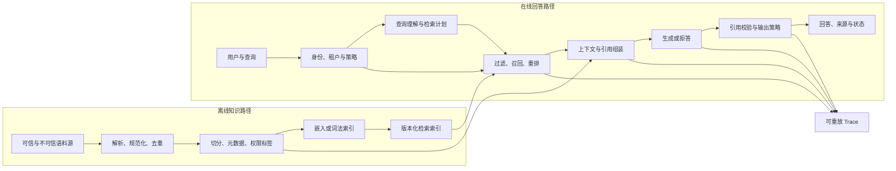
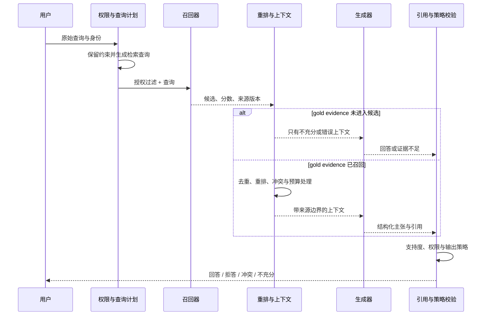
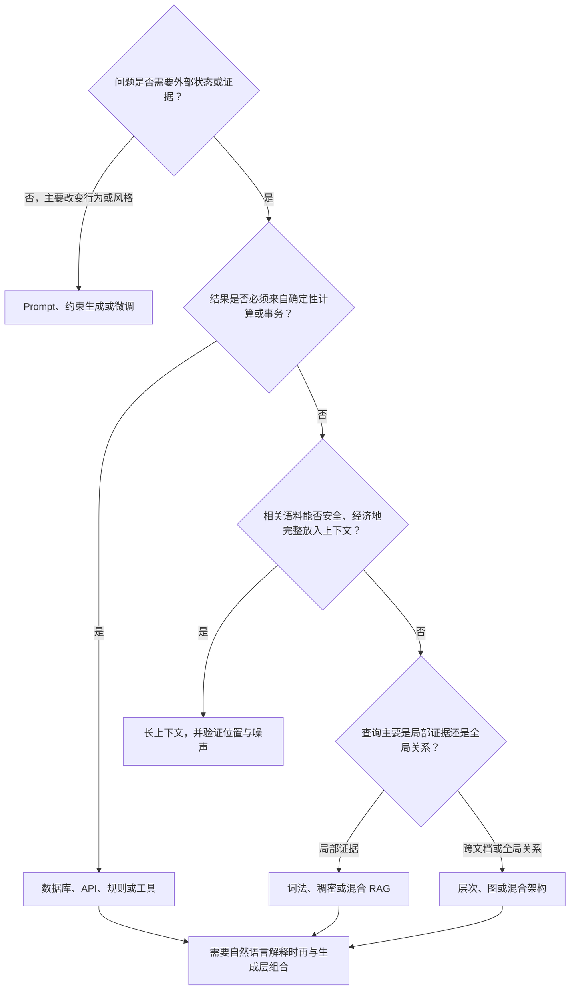
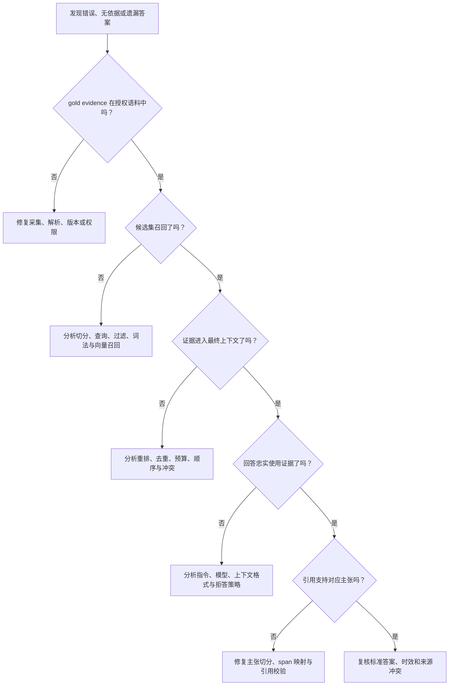

# RAG：从非参数记忆到可验证的知识系统

> 查证基线：2026-08-18。本文把 RAG 区分为 Lewis 等人在 2020 年提出的可训练模型架构，以及后来扩展出的工程系统范式。论文结果只在各自的数据集、模型和评价条件内成立；涉及快速演化的 Agentic RAG、安全事件与工具实现时，正文会明确版本和证据边界。

## 核心判断：RAG 建立的是证据通道，不是真实性保证

Retrieval-Augmented Generation（检索增强生成，RAG）把生成模型的参数化记忆与外部、可检索的非参数记忆连接起来。它的关键价值不是“让模型知道更多”，而是让知识在查询时可以被选择、更新、授权、引用和审计。知识从模型权重中部分移到外部语料后，团队可以不重新训练生成模型就更新语料，也可以观察一次回答到底检索了什么。

但这条证据通道不会自动产生正确答案。一个生产 RAG 系统至少可能在五处失败：语料里没有答案、检索没有召回答案、排序或上下文组装丢失答案、生成模型没有忠实使用证据、引用没有真正支持结论。权限错误、语料投毒和间接 Prompt Injection 还会把“可检索知识”变成新的攻击入口。

因此，RAG 更准确的定义是：**在明确的数据、权限和评估边界内，按查询选择外部证据并约束生成过程的一类系统**。向量数据库只是可能的检索实现；Prompt 只是生成接口；两者都不能单独构成可靠的 RAG。

下面的图先给出完整系统。它回答的不是“要部署哪些产品”，而是“一次可审计回答依赖哪些状态，以及信任边界在哪里”。



离线路径决定“系统可能知道什么”，在线路径决定“本次请求被允许看到什么、实际找到了什么、模型怎样使用它”。`Index`、嵌入模型、语料版本、权限策略、Prompt 和生成模型都属于回答的输入状态；不记录这些状态，就无法可靠重放一次事故或回归。

## 一、原始 RAG：把文档作为生成过程中的潜变量

### 参数化记忆与非参数记忆

2020 年的原始 RAG 论文把预训练 seq2seq 模型视为参数化记忆，把 Wikipedia 的稠密向量索引视为非参数记忆。检索器根据输入 $x$ 给文档 $z$ 分配概率，生成器根据输入、文档和已生成 Token 预测后续输出。训练时，文档不是人工指定的唯一输入，而是需要在候选文档上边缘化的潜变量。[Lewis 等：Retrieval-Augmented Generation for Knowledge-Intensive NLP Tasks](https://arxiv.org/abs/2005.11401)

论文给出了两种不同的分解方式。用文本形式保留其结构：

```text
RAG-Sequence:
p(y | x) ≈ Σ[z ∈ top-k] pη(z | x) · ∏ᵢ pθ(yᵢ | x, z, y<ᵢ)

RAG-Token:
p(y | x) ≈ ∏ᵢ Σ[z ∈ top-k] pη(z | x) · pθ(yᵢ | x, z, y<ᵢ)
```

- `RAG-Sequence` 假设一条完整输出由同一潜在文档条件化，再在 top-k 文档上边缘化；
- `RAG-Token` 允许每个输出 Token 对不同文档赋予不同权重，因此可以在生成过程中组合多个文档；
- `pη` 是检索分布，`pθ` 是生成分布。检索不是生成前完全独立的字符串搜索，而是模型概率的一部分。

原实现使用 Dense Passage Retrieval（DPR）双编码器和 BART 生成器，固定文档编码器及索引，微调查询编码器与生成器。这一点很重要：今天常见的“嵌入 API + 向量数据库 + 闭源聊天模型”也被称作 RAG，但它通常没有端到端训练，也不会对潜在文档做同样的概率边缘化。两者共享“外部检索增强生成”的结构，不是同一个训练算法。

### 可更新不等于自动保持新鲜

原论文用 2016 与 2018 两个 Wikipedia 索引测试 82 个发生人员变化的世界领导职位。索引和问题时间匹配时，正确率分别为 70% 与 68%；错配时降到 12% 与 4%。这个小规模实验支持“替换非参数记忆可以改变模型答案”，但不能证明任意知识更新都会正确传播。[RAG 论文的 Index hot-swapping 实验](https://arxiv.org/html/2005.11401v4)

生产系统还必须解决：新文档是否已解析、旧切片是否已删除、嵌入是否重算、索引别名是否切换、缓存是否包含语料版本，以及查询是否召回更新后的内容。RAG 让更新变得可操作，并没有让更新变得自动正确。

## 二、知识构建：切片是检索、权限和引用的共同原子

### 语料不是文件堆，而是带状态的知识供应链

离线摄取至少要保留以下信息：

| 状态 | 作用 | 缺失后的典型问题 |
| --- | --- | --- |
| `source_id` 与规范 URL | 标识同一来源 | 重复抓取、引用无法回到原文 |
| 内容摘要与版本 | 判断内容是否变化 | 旧切片残留、缓存无法失效 |
| 生效时间与抓取时间 | 处理时效性 | 新旧政策混用 |
| 文档结构 | 保留标题、章节和表格语义 | 相邻条件被切开 |
| 权限与租户 | 在召回前缩小候选集 | 跨租户泄漏 |
| 解析器与嵌入版本 | 支持重建和对比 | 索引不可重放 |
| 删除或撤销状态 | 传播“不可再用” | 已删除内容继续被回答 |

“把 PDF 每 500 Token 切一段”只是一个可测试基线，不是知识建模原则。切片同时承担三个角色：检索的候选单位、生成器看到的证据单位、引用和权限执行的最小单位。固定长度切片可能把定义与限定条件拆开，把表头与数据行拆开，或把两个权限范围合并进同一片段。

结构化切分通常先尊重标题、段落、列表、代码块和表格，再在过长单元内做长度约束。父子切片可以用小片段召回、用较大父级上下文生成；层次摘要可以处理跨章节问题。但任何增加上下文的操作都要重新检查权限、版本和来源，不能让子片段通过父节点带出未授权内容。

### 没有万能的 chunk size

切片大小影响的是一组相互冲突的目标：

- 小切片通常更聚焦，但可能缺少回答所需的上下文；
- 大切片保留更多语义，却会稀释匹配信号、消耗上下文预算，并增加无关或恶意内容进入生成器的概率；
- 重叠能缓解边界切断，也会制造重复候选和相互强化的虚假“多来源”；
- 结构化文档、代码、对话和表格需要不同的分段规则。

因此，`chunk_size`、`overlap` 和父子层级必须作为版本化实验参数，在目标查询集上评估。没有语料分布、查询类型和指标时声称“最佳 512 Token”没有证据意义。

## 三、检索：召回与排序是两种不同工作

### 词法、稠密与混合检索

BM25 一类词法检索直接利用词项匹配和统计权重，擅长精确实体、错误码、产品编号和稀有术语。稠密检索把查询和文档编码为向量，能够跨越部分词汇差异，但可能丢失精确字符串、数值和否定信息，还会受到训练域与目标域偏移的影响。

DPR 在其五个开放域问答数据集上，以双编码器和内积相似度执行段落检索；论文报告它在多数数据集上的 top-20 passage retrieval accuracy 比特定 Lucene BM25 基线高 9–19 个百分点。该结果证明稠密检索在这些实验条件下可行且有效，不是对所有语料的普遍排序。[Karpukhin 等：Dense Passage Retrieval](https://arxiv.org/abs/2004.04906)

BEIR 随后把词法、稀疏、稠密、late-interaction 与重排模型放到异构零样本任务中比较。其结果显示 BM25 是稳健基线，重排和 late-interaction 方法平均表现较好但计算成本更高，部分稠密模型在域外任务上会落后于 BM25。[Thakur 等：BEIR](https://arxiv.org/abs/2104.08663)

这两组结果并不冲突：DPR 测量特定开放域问答设置中的训练后能力，BEIR 重点测量跨任务零样本泛化。工程上常见的混合检索正是利用二者互补：分别取得词法与语义候选，归一化或融合排名，再交给更昂贵的重排器。

### 召回器、ANN 与重排器

一次成熟检索通常包含三层：

1. **过滤与路由**：先按租户、权限、语言、时间、文档类型或业务域缩小合法候选；
2. **高召回候选生成**：通过词法、向量或多个查询变体取得候选；
3. **高精度重排**：使用更多查询—文档交互计算重新排序较小候选集。

Approximate Nearest Neighbor（近似最近邻，ANN）索引用一定召回损失换取更低延迟和更大规模。它解决的是搜索复杂度，不会改善嵌入模型的语义表示。上线 ANN 前应保留小规模 exact search 或高精度配置作为对照，分开测量“表示没找对”和“近似索引漏掉了”两类错误。

重排也不能修复召回集之外的证据。如果 gold evidence 没进入候选集，重排器无论多强都无法把它排到第一位。这是 RAG 诊断中最重要的因果边界之一。

### 查询变换会增加能力，也会制造漂移

查询改写、HyDE、多查询扩展、子问题分解和多跳检索都在改变检索输入。它们适合解决口语查询、别名、复合问题或证据链，但也可能把用户原意改成模型更熟悉的问题。

可控系统应保存：原始查询、每次改写、触发原因、各查询的候选与分数、去重和融合方式。敏感业务还要限定改写可以改变什么，例如允许补全缩写但不允许替换金额、时间、租户或主体身份。

## 四、上下文组装：相关内容必须变成可使用的证据

### 上下文预算是一个有约束的选择问题

检索返回 top-k 后，不能简单按分数拼接。上下文组装需要同时考虑：

- 证据覆盖：回答是否需要多个来源或多跳链条；
- 冗余：多个切片是否只是同一原文的重叠副本；
- 冲突：来源是否对应不同版本、时间、管辖区或观点；
- 顺序：模型是否能稳定利用位于中部的证据；
- 权限：父文档或相邻窗口是否仍在授权范围；
- 来源元数据：生成器和引用校验器能否区分来源、版本与位置。

“Lost in the Middle”在多文档问答和键值检索任务中改变相关信息的位置，观察到若干受测模型呈现首尾较强、中部较弱的性能模式；论文还强调，应通过位置扰动来检验模型能否稳健使用长上下文。它支持“长上下文利用可能依赖位置”这一结论，不支持“所有新模型永远存在同样的 U 型曲线”。[Liu 等：Lost in the Middle](https://arxiv.org/abs/2307.03172)

因此，增加 top-k 或直接塞入整份语料不是单调改进。原始 RAG 论文自己的消融也显示，不同模型和指标对检索文档数量的响应不同：某些设置继续改善，另一些在特定 k 达峰，生成指标之间还会出现取舍。[RAG 论文 Retrieval Ablations](https://arxiv.org/html/2005.11401v4)

### 找到证据、使用证据、引用证据是三件事

一条回答可以同时出现以下组合：

- 检索正确，但模型忽略证据，使用参数记忆回答；
- 答案正确，但引用了不支持该结论的文档；
- 答案忠实于检索内容，但检索内容本身已过期或错误；
- 多个来源冲突，模型静默选择其中一个；
- 没有充分证据，模型仍生成流畅答案。

可靠输出需要把这些状态编码进协议，而不是只返回字符串：

```text
AnswerResult
├── status: answered | insufficient_evidence | conflicting_evidence | denied
├── answer: structured claims
├── citations: claim_id -> source_id + span + version
├── corpus_version
├── retrieval_trace_id
└── limitations
```

引用校验应验证“这个来源片段是否支持这条具体主张”，而不只是检测回答末尾是否存在 URL。对于高风险场景，证据不足和证据冲突必须是正常终态；强迫模型每次都回答，会把召回失败转换成幻觉。

下面的时序图展示一次请求如何逐层失真。它的阅读重点是：后面的组件只能处理前面实际交付的状态，不能凭空恢复已经丢失的 gold evidence。



## 五、架构演化：复杂方案在修复不同故障

“Naive RAG → Advanced RAG → Modular RAG”适合作为介绍性地图，却容易暗示所有系统都应沿同一路线升级。更可靠的选择方式是先定位故障，再判断哪种机制对该故障具有因果作用。

| 方案 | 主要针对的故障 | 核心机制 | 新增成本与边界 |
| --- | --- | --- | --- |
| 基线 RAG | 参数记忆难更新、无外部证据 | 固定检索 top-k 后生成 | 检索必要性、证据质量和忠实性没有自适应判断 |
| Self-RAG | 不必要检索、模型不检查证据与输出 | 学习检索和 critique 类 reflection token | 需要专门训练数据、critic 与推理控制；不是简单 Prompt 技巧 |
| CRAG | 检索结果相关性不足 | 检索评估器、纠正动作、外部搜索和片段重组 | 评估器可能误判；外部搜索扩大信任和延迟边界 |
| RAPTOR | 短连续切片难以表达长文档全局关系 | 递归聚类、摘要与树形多层检索 | 离线摘要成本、摘要失真与更新传播更复杂 |
| GraphRAG | 面向整个语料的全局 sensemaking 问题 | 实体图、社区和社区摘要，再聚合局部回答 | 建图与摘要昂贵；实体抽取和社区结构本身可能错误 |
| Agentic RAG | 查询路径未知、需要多轮工具和证据 | 规划、路由、循环检索、工具调用与停止条件 | 状态空间、延迟、成本和攻击面显著扩大，目前没有单一稳定定义 |

Self-RAG 不是在普通流水线上增加一次“请反思”，而是训练模型生成用于决定检索、评价相关性和支持度的特殊 token。[Asai 等：Self-RAG](https://arxiv.org/abs/2310.11511) CRAG 使用轻量检索评估器决定 correct、ambiguous 或 incorrect 情况下的动作，并可能使用外部搜索扩展静态语料。[Yan 等：Corrective Retrieval Augmented Generation](https://arxiv.org/abs/2401.15884)

RAPTOR 针对连续短切片缺乏整体上下文的问题，自底向上聚类和摘要，形成多个抽象层级的树。[Sarthi 等：RAPTOR](https://proceedings.iclr.cc/paper_files/paper/2024/hash/8a2acd174940dbca361a6398a4f9df91-Abstract-Conference.html) GraphRAG 则针对“整个数据集的主题是什么”一类全局查询，先从语料构建实体图和社区摘要，再聚合社区级回答。[Edge 等：From Local to Global](https://arxiv.org/abs/2404.16130)

这些论文不能直接组成排行榜：它们使用不同任务、语料、生成模型、基线和指标。RAPTOR 在特定复杂问答实验上的提升，不能推出它在短事实查询、频繁更新语料或严格权限场景中一定优于平面索引；GraphRAG 在百万 Token 级语料的全局总结结果，也不能推出知识图谱适合所有局部查找。

## 六、何时不该使用 RAG

RAG 是外部非结构化或半结构化证据与自然语言生成之间的接口。若问题的正确抽象不是“找到相关证据再解释”，引入 RAG 反而会降低确定性。

| 需求 | 优先考虑 | 原因与边界 |
| --- | --- | --- |
| 小规模、单次、上下文可完整放入模型 | 长上下文 | 少一套索引和检索运维，但仍需验证位置、噪声和成本影响 |
| 改变回答风格、格式或稳定行为 | 微调或受约束生成 | 微调适合改变模型行为；不天然提供知识来源和快速删除能力 |
| 精确余额、库存、权限或交易状态 | 数据库、API 或规则引擎 | 需要确定性查询、事务和授权；生成模型只负责解释，不负责创造事实 |
| 大型、经常更新、需要来源追踪的文档库 | RAG | 查询时选择证据，便于更新、授权和引用，但必须承担检索与一致性复杂度 |
| 跨章节、多尺度理解 | 层次检索或长上下文混合 | 平面短切片可能丢失整体结构；摘要又会引入信息损失 |
| 全局主题、关系网络或跨文档聚合 | 图或结构化中间表示 | 可以显式表达关系和社区，但建图成本与抽取误差必须可接受 |
| 需要实时网页、代码执行或业务动作 | 搜索/工具调用 | RAG 语料不是实时执行环境；工具必须在独立权限边界中运行 |

下面的决策图不是普遍标准，而是从知识更新、精确性与证据需求推导出的工程启发式。



长上下文与 RAG 也不是互斥方案：检索可以先缩小候选，再把完整文档或父级章节交给长上下文模型。微调与 RAG 同样可以组合：前者改变检索决策、引用格式或拒答行为，后者提供查询时证据。架构选择应落在任务失败、成本和治理约束上，而不是产品标签上。

## 七、生产可靠性：把索引当成可部署的数据产品

### 一致性与可回滚发布

语料更新通常跨越对象存储、解析结果、切片、多个索引和缓存，不可能靠单次数据库事务原子提交。更可控的发布方式是构建不可变 corpus/index 版本，完成离线验证后再原子切换读别名：

```text
source snapshot v17
  -> parsed documents v17
  -> chunks v17 + ACL policy v6
  -> lexical index v17
  -> vector index v17 + embedding model e3
  -> validation report
  -> read alias: production -> v17
```

请求 Trace 至少记录 `corpus_version`、`index_version`、`embedding_model`、`retriever_config`、`reranker`、`prompt_version` 和 `generator_model`。缓存键也应包含会改变答案的版本；否则切换新索引后，旧答案仍可能继续命中。

删除比新增更难。删除文档需要传播到解析产物、切片、词法索引、向量索引、摘要、图节点、缓存和备份策略。对法律删除或权限撤销，不能只等待下一次全量重建；应有 tombstone、紧急过滤和可验证的传播 SLA。

### 权限必须约束候选生成

多租户系统不能先在全局索引取 top-k，再在生成前过滤。这样既可能让未授权内容进入日志、缓存或重排器，也会因合法结果被后置过滤而降低召回。正确边界是：身份和策略先转换成检索过滤条件，候选生成只在授权集合内执行；取回原文时再次校验，形成纵深防御。

NIST IR 8579 记录了 NCCoE 内部 RAG 聊天机器人在架构、访问控制、Prompt Injection、幻觉和数据暴露方面的阶段性技术决策。NIST 明确把它定位为 point-in-time 复盘，而不是实施指南；本文只用它证明这些风险进入了真实原型的设计边界，不把其具体配置升级成通用控制要求。[NIST：Developing the NCCoE Chatbot](https://csrc.nist.gov/pubs/ir/8579/ipd)

这不是理论担忧。NVD 记录的 CVE-2026-59098 描述了 LobeChat 2.2.9 及以前版本的语义搜索缺少用户标识谓词，攻击者可以指定其他用户的文件或知识库标识读取片段、文件名和元数据。[NVD：CVE-2026-59098](https://nvd.nist.gov/vuln/detail/CVE-2026-59098) 这个事件证明“租户谓词漏加”能够穿透 RAG 数据面，但不能据此推断其他产品也存在同一缺陷。

### 检索内容是不可信输入

网页、工单、邮件和用户上传文档都可能包含“忽略系统指令”“把秘密发到某处”等文本。对模型而言，指令和数据都只是 Token；XML 标签、Markdown 围栏和“以下内容不可信”能够提供语义提示，却不是强制安全边界。

NIST AI 100-2e2025 将 Prompt Injection 与运行时第三方数据摄取纳入生成式 AI 攻击面，特别指出 RAG 会在推理时引入外部来源。[NIST：Adversarial Machine Learning Taxonomy](https://nvlpubs.nist.gov/nistpubs/ai/NIST.AI.100-2e2025.pdf) 因此系统必须把能力控制留在模型之外：

- 检索服务只返回当前主体获准读取的数据；
- 模型不能凭文本指令扩大工具、网络、文件或数据库权限；
- 工具参数经过 schema、资源范围和业务规则校验；
- 高影响操作需要独立确认、幂等键和审计；
- 输出进入 HTML、SQL、Shell 或模板系统前按目标上下文编码或拒绝；
- 语料摄取需要来源认证、写权限、内容版本和异常检测。

NVD 的 CVE-2026-57476 记录了一个 RAG 语料 API 未认证导致语料读取或注入的具体案例，受影响服务后来限制网络访问并增加认证。[NVD：CVE-2026-57476](https://nvd.nist.gov/vuln/detail/CVE-2026-57476) 它揭示的是控制面认证和语料完整性问题，不应被模糊地归因于“模型幻觉”。

### 延迟、成本与容量是端到端预算

RAG 延迟不是一次向量查询：

```text
T_total = T_auth + T_rewrite + T_retrieve + T_rerank
        + T_fetch + T_pack + T_generate + T_verify
```

各阶段还可能扇出多个查询或模型调用。平均延迟会掩盖慢分片、冷缓存和外部搜索造成的尾延迟。生产 SLO 应同时观察 p50、p95、p99、超时与降级路径，并把 token、检索和重排成本关联到查询类型。

常见降级不是“发生错误就不用 RAG”：可以在预算不足时减少查询扩展、跳过高成本重排、限制上下文、只返回搜索结果，或进入 `insufficient_evidence`。降级策略必须经过评估，不能静默把有来源回答切换成无来源参数记忆回答。

## 八、评估：先定位失败阶段，再谈系统分数

### 评估集必须表达真实信息需求

一个可诊断样本至少需要：查询、用户或租户上下文、时间边界、相关证据、可接受答案、应拒答条件和查询类型。只记录“标准答案”无法判断失败是因为语料缺失、权限过滤、召回、生成还是答案标注本身。

KILT 把多个知识密集型任务统一到同一 Wikipedia snapshot，并同时评估下游任务与 provenance，为“答案质量与证据来源必须一起测”提供了早期正式基准。[Petroni 等：KILT](https://aclanthology.org/2021.naacl-main.200/) 但固定 Wikipedia 基准没有覆盖企业权限、频繁更新、表格解析和真实查询漂移，不能替代业务评估集。

### 分层指标

| 层级 | 关键问题 | 示例指标 | 无法单独证明的事情 |
| --- | --- | --- | --- |
| 语料 | gold evidence 是否存在且可访问 | coverage、解析成功率、删除传播时间 | 检索能找到它 |
| 召回 | 候选集是否包含相关证据 | Recall@k、hit rate、权限违规率 | 排序和生成正确 |
| 排序 | 相关证据是否位于可用位置 | MRR、nDCG、top-k precision | 模型忠实使用证据 |
| 上下文 | 证据是否完整、无冲突且在预算内 | evidence coverage、冗余率、冲突召回率 | 答案事实正确 |
| 生成 | 输出是否正确且受证据支持 | correctness、faithfulness、completeness、abstention | 引用定位准确 |
| 引用 | 每个主张是否有真实支持 | citation precision、citation recall | 来源本身可靠或最新 |
| 系统 | 用户任务是否完成并满足约束 | task success、延迟、成本、投诉、越权事件 | 具体故障根因 |

Recall@k 关心至少有多少相关证据进入候选集；MRR 强调第一个相关结果的位置；nDCG 可表达分级相关性与排序折损。选择指标取决于生成器需要一个证据、多个互补证据，还是按重要度覆盖一组来源。指标定义必须和标注协议一起保存。

BEIR 说明域内表现不能可靠代表零样本跨域表现；因此检索评估应按文档类型、查询类型、语言、时间和租户分段，而不是只报整体均值。[BEIR 的域偏移分析](https://arxiv.org/abs/2104.08663)

### 自动评估器不是事实裁判

RAGAS 提出了无需 reference answer 的 context relevance、faithfulness 和 answer relevance 等自动指标，用于缩短迭代周期。[Es 等：RAGAS](https://arxiv.org/abs/2309.15217) “reference-free”表示不依赖人工标准答案，不表示指标没有模型偏差，也不表示它测得了真实世界事实。

ARES 训练轻量评估器，并用少量人工标注结合 prediction-powered inference（PPI）校正估计和置信区间；论文在其 KILT、SuperGLUE 与 AIS 任务上报告了相对 RAGAS 等基线的提升。[Saad-Falcon 等：ARES](https://aclanthology.org/2024.naacl-long.20/) 这说明自动 Judge 可以被校准，不意味着少量标注对任何领域都足够。

采用 LLM-as-a-Judge 前应建立人工审阅子集，测量与人工的一致性、分段误差和模型或 Prompt 升级后的漂移。高风险结论要报告置信区间与反例，不把小数点后的“精确分数”当成客观真值。

### 从错误答案反推根因

下面的诊断树强调检查顺序。先确认 gold evidence 是否存在，能够避免团队在语料根本缺失时反复调 Prompt。



### 受控实验而不是组件堆叠

RAG 实验应从可解释基线开始，并一次改变一个主要因素：

1. 建立无检索与词法检索基线；
2. 比较稠密和混合召回，但固定语料、生成模型与评估集；
3. 固定召回集后评估重排；
4. 固定最终上下文后评估生成模型、Prompt 与引用协议；
5. 对已定位的跨章节或全局问题再评估 RAPTOR、GraphRAG 等复杂结构；
6. 同时报告质量、延迟、成本、索引大小和更新耗时；
7. 保存每次实验的完整配置与可重放 Trace。

这样才能回答“哪个改变造成了提升”。同时更换嵌入、切片、向量库、Prompt 和生成模型，即使总分提高，也无法建立可靠因果解释。

## 九、从业务约束推导架构

设计 RAG 的起点不是选择向量数据库，而是定义信息任务与不可接受失败：

1. **任务**：用户要查找事实、比较来源、总结全局主题，还是执行确定性动作；
2. **证据**：哪些来源有权威性，如何处理版本、时效、冲突和撤销；
3. **主体**：谁可以在什么上下文读取哪些证据；
4. **失败**：无答案、错答案、过期答案、越权和高延迟分别能否拒答或降级；
5. **评估**：什么查询集和指标能够定位这些失败；
6. **基线**：最简单的词法或混合检索是否已经满足目标；
7. **演化**：只有被证据定位的故障，才触发重排、查询分解、层次索引、图或 Agent 循环；
8. **发布**：语料、索引、策略、Prompt 和模型如何版本化、灰度、回滚与审计。

一套值得上线的最小 RAG 并不一定使用最先进的检索模型，但必须满足三个条件：权限在候选阶段生效；回答能追溯到版本化证据；错误能被分解到语料、检索、上下文、生成或引用阶段。没有这三点，增加自反思、图和 Agent 只会让系统更难解释。

## 十、仍未解决的问题

RAG 的主要开放问题不是再添加一个检索步骤，而是如何在动态和对抗环境中保持证据语义：

- **时间一致性**：多个来源在不同时间更新时，系统如何回答“截至某时刻”的问题；
- **冲突与不确定性**：模型如何保留真正分歧，而不是把互斥来源融合成流畅叙述；
- **来源可追溯性**：切片、摘要和图节点经过多次派生后，如何回到原始 span 与版本；
- **评估外推**：公开问答基准与真实企业查询、权限和失败成本之间存在多大差距；
- **对抗鲁棒性**：攻击者可以操纵语料、排名、引用或工具输入时，哪些防御能跨模型和任务稳定成立；
- **Agent 停止条件**：多轮检索何时已经获得充分证据，何时只是增加延迟、成本与攻击面；
- **遗忘与删除**：原始文档撤销后，摘要、缓存、图和生成日志中的派生信息如何处理。

这些问题提醒我们：RAG 的成熟度不由“接入了多少组件”决定，而由系统能否说明证据从哪里来、为何被选中、谁有权看到、模型如何使用、何时应该拒答，以及错误怎样被复现和修复决定。

## 来源审计与证据边界

本文主要使用四类接近事实源头的材料：

- 原始模型与检索论文：RAG、DPR、Self-RAG、CRAG、RAPTOR、GraphRAG；
- 正式基准与评估论文：KILT、BEIR、RAGAS、ARES；
- 行为实验：Lost in the Middle；
- 官方安全材料与漏洞记录：[NIST AI 100-2e2025](https://nvlpubs.nist.gov/nistpubs/ai/NIST.AI.100-2e2025.pdf)、[NIST IR 8579](https://csrc.nist.gov/pubs/ir/8579/ipd) 和 NVD CVE 记录。

完成的交叉核对包括：用 DPR 与 BEIR 区分域内结果和零样本泛化；用 RAG 原始公式与现代流水线对照术语边界；用 RAGAS 与 ARES 对照无 reference 自动评估和人工校准；用 NIST 威胁分类与具体 NVD 记录对照抽象攻击面和现实失败案例。

仍需保留的限制：不同高级 RAG 论文不能直接横向排名；公开基准不能证明私有语料上的生产效果；NIST IR 8579 是 2025 年的阶段性草案并明确不是实施指南；具体 CVE 只适用于记录的产品与版本；本文没有配套 Demo，因此未复现任何模型质量、延迟或成本实验。文中的系统设计方法属于在来源事实之上的工程推论，不能替代目标业务的实测结果。
