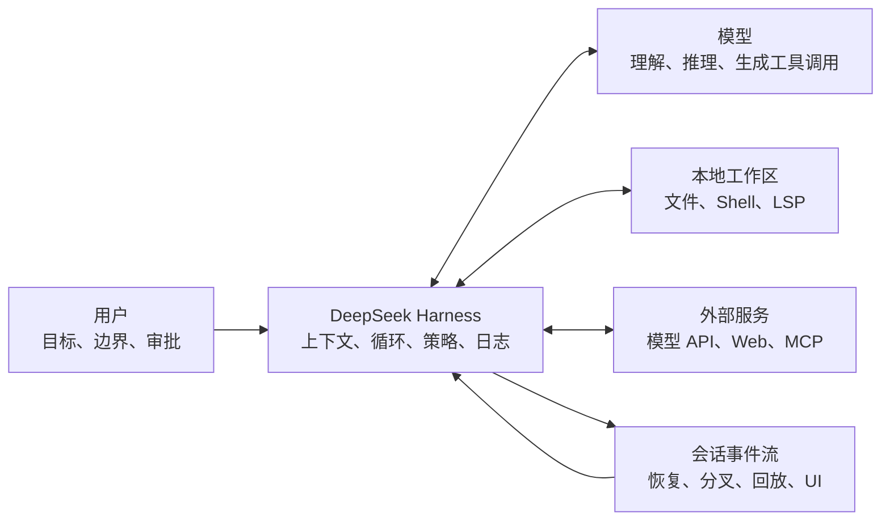
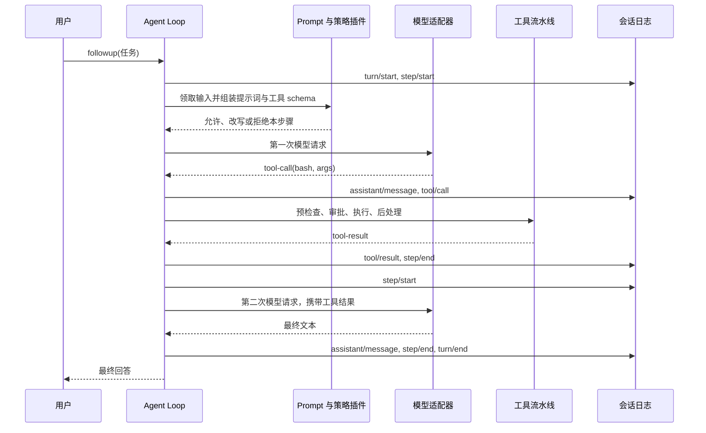
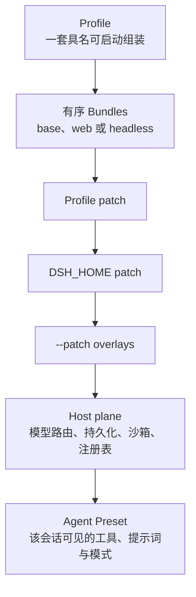
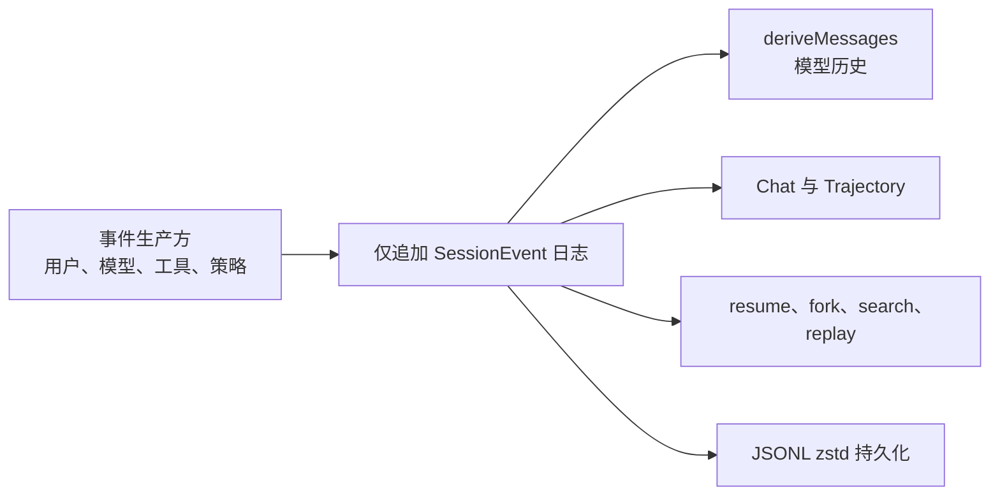
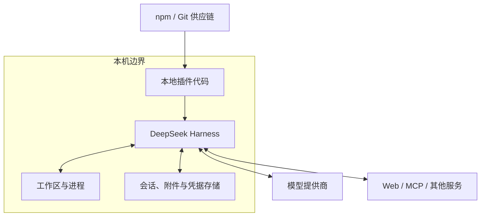

# DeepSeek Harness：把模型变成可执行 Agent 的插件化运行时

> 查证基线：2026-08-20。本文针对 DeepSeek 官方项目，源码基线为 `141eb6f`，npm `latest` 为 `0.1.0-rc.7`、`next` 为 `0.1.0-rc.8`。项目仍处于开发者预览阶段，官方明确提醒会出现破坏兼容性的变化。[官方仓库与版本声明](https://github.com/deepseek-ai/deepseek-harness/tree/141eb6fef83422698aef7a981029e843e8161534) [npm：@deepseek-ai/dsh 0.1.0-rc.7](https://www.npmjs.com/package/@deepseek-ai/dsh/v/0.1.0-rc.7)

## 核心判断

DeepSeek Harness（命令名 `dsh`）不是一个新模型，也不只是 DeepSeek API 的客户端封装。它是一个**本地优先、可扩展的 Coding Agent 与 Agent 开发/运行环境**：负责把模型接入工作区、工具、会话、权限、沙箱、任务循环和界面，让“生成下一段文本”变成“持续观察环境并完成任务”。官方用 `Agent = Model + Harness` 表达这个分工。[DeepSeek Harness 官方介绍](https://deepseek.com/harness/en/) [官方 Safe Use Policy](https://deepseek.com/harness/en/privacy/)

下面这张图回答的是：模型周围到底增加了什么，才形成一个能工作的 Agent？



阅读时要抓住三条边界：

- **模型负责提出下一步**，例如返回文本或请求调用 `bash`；它不会因为输出了一段 JSON 就自动获得操作系统权限。
- **Harness 负责把意图变成受控动作**，包括工具 schema、参数校验、审批、执行、结果回传、错误恢复和会话记录。
- **环境承担真实副作用**。文件写入、进程启动和网络请求发生在本地或外部服务中，不发生在模型权重里。

因此，同一个模型放进不同 Harness，能使用的工具、上下文、权限、任务持续时间和失败恢复都可能不同；同一个 Harness 换模型，则主要改变理解与决策质量。两层共同决定最终 Agent 的行为。

## 一、为什么模型还需要 Harness

一次普通模型请求可以抽象为：给定消息，生成后续 token。真实编码任务却是闭环：读取仓库、提出修改、执行命令、检查失败、修正，再向用户报告。这里至少多出五类问题：

1. 模型应当看见哪些文件、规则、历史和工具？
2. 模型输出的工具调用如何校验、调度和执行？
3. 哪些操作允许直接执行，哪些必须拒绝或询问？
4. 上下文过长、请求失败、进程未退出时如何恢复？
5. 任务过程如何持久化，以便恢复、分叉、审计和渲染？

这些都是 Harness 问题，而不是模型预训练直接解决的问题。

| 层 | 主要职责 | 不应混淆的边界 |
| --- | --- | --- |
| 模型 | 理解输入、推理、生成文本或结构化工具调用 | 不直接执行 Shell，不天然知道本地实时状态 |
| Harness | 组装上下文、驱动循环、注册工具、执行策略、记录事件 | 不等于模型能力，也不能保证模型决策正确 |
| 工具与提供方 | 读写文件、运行命令、搜索、访问服务 | 真实权限与故障来自所在执行环境 |
| 用户或部署方 | 选择模型、插件、权限和验收标准 | 审批不能替代代码审查与系统隔离 |

这也解释了它与几个相邻类别的区别：

- **模型 API SDK**关注怎样发 HTTP 请求、流式读取响应和处理鉴权；Harness 在其上维持多步骤任务和工具世界。
- **推理框架**关注怎样加载权重并高效产生 token；Harness 可以连接远程 API，也可以通过适配器连接其他提供方。
- **聊天界面**主要展示消息；Harness 的核心还包括工具执行、权限、会话事件和运行循环。
- **完整 Coding Agent 产品**通常已经固定了一套 Harness。DeepSeek Harness 的特别之处是把大部分能力公开成可替换插件，并把“开发 Harness”本身作为产品目标。

## 二、一次任务在内部怎样运行

官方把一次用户任务称为一个 **turn（轮次）**。一个 turn 可以包含多个 **step（步骤）**；每个 step 是一次模型请求，以及该请求产生的工具调用。只要工具结果意味着模型还欠一个最终判断，Agent Loop 就会开启下一个 step。[官方架构：轮次流程](https://github.com/deepseek-ai/deepseek-harness/blob/141eb6fef83422698aef7a981029e843e8161534/docs/architecture.zh.md#%E8%BD%AE%E6%AC%A1%E6%B5%81%E7%A8%8B) [官方生命周期时序](https://github.com/deepseek-ai/deepseek-harness/blob/141eb6fef83422698aef7a981029e843e8161534/docs/agent-lifecycle.zh.md)



这条链路有几个重要细节：

- `agent/pre-step` 可以改变模型将看见的消息，甚至拒绝本步骤；这让上下文压缩、策略注入和其他控制逻辑不必硬编码进循环。
- 工具不是由 Agent Loop 直接 `switch` 分发。工具注册表和 `tools/*` 事件构成独立流水线，前置策略、执行器与后处理插件可以组合。
- 工具调用结束不一定结束 turn。工具结果先进入会话，再由下一次模型请求解释，这就是编码 Agent 常见的“看—做—再看”。
- 标题生成、压缩等辅助模型请求也可能存在，但不等于主任务增加了一个 step。配套实验中出现了一次独立标题请求，它不携带工具 schema，也没有进入主任务的两个 step。

在本文的[无密钥实验脚本](./deepseek-harness-demo/run-demo.mjs)中，模拟模型第一次请求 `bash` 执行 `printf DSH_TOOL_ROUND_TRIP`，真实 Harness 执行后把结果送入第二次模型请求。成功会话记录了 36 个事件，主链路严格呈现 `tool/call → tool/result → 第二个 step`；这说明工具执行与循环是 Harness 的真实行为，不是模型模拟出来的一段叙述。

## 三、“一切皆插件”不是一句营销口号

DeepSeek Harness 底层使用 Cordis。Cordis 把运行中的应用组织为一棵插件树：插件向共享 Context 提供服务、注册类型化事件和副作用；依赖消失时，相关插件可以卸载，注册也随生命周期撤销。模型适配器、工具注册表、会话、沙箱、UI 和 Agent Loop 都由插件贡献，而不是被藏在不可替换的单体内核里。[官方架构：Cordis](https://github.com/deepseek-ai/deepseek-harness/blob/141eb6fef83422698aef7a981029e843e8161534/docs/architecture.zh.md#cordis) [Cordis 入门](https://github.com/deepseek-ai/deepseek-harness/blob/141eb6fef83422698aef7a981029e843e8161534/docs/cordis-primer.zh.md)

### 1. Context、依赖和生命周期

插件通过稳定的 `ctx.<key>` 找服务，而不是直接依赖某个具体实现，例如 `ctx.llm`、`ctx.tools`、`ctx.sessions`：

- `inject` 声明“我需要哪些服务”；Cordis 等待依赖就绪后才执行插件。
- `ctx.on()` 注册事件监听器，`ctx.effect()` 注册需要在卸载时撤销的资源。
- 服务提供方被替换或消失时，依赖它的插件会卸载；服务恢复后再重新加载。
- Waterfall 事件类似可短路的环绕中间件，可用于改写请求、工具策略和审批结果。

这种设计换来热替换与可组合性，但也增加了理解成本：一个行为可能来自配置树中多个插件和事件监听器，而不是一个显眼的控制器函数。排障时必须同时看生效配置、服务依赖、事件顺序和作用域。

### 2. Profile、Bundle、Patch 与 Preset

下面这张图回答的是：启动一个 Agent 时，配置从哪里来？



- **Profile**回答“启动哪一套产品组合”，如 `web` 或 `headless`。
- **Bundle**是可分发的配置层；`base` 提供模型、工具、持久化、沙箱和设置等基础能力，表层 Bundle 再增加 Web 或一次性 runner。
- **Patch**按顺序覆盖或插入配置项；用户可以不改上游源码就替换某项能力。
- **Agent Preset**决定某个 Agent 会话拥有的提示词、工具和局部服务组合，也就是界面中的标准、PTC、极简和创造模式。

当前真实配置可以用 `dsh --profile web --dump-config` 查看。它比只读 README 更重要，因为最后生效的内容还可能被用户设置、环境变量和后应用的 patch 改写。[官方 Profile 与 Bundle 说明](https://github.com/deepseek-ai/deepseek-harness/blob/141eb6fef83422698aef7a981029e843e8161534/docs/architecture.zh.md#profile-%E4%B8%8E%E7%BB%84%E5%90%88%E5%8C%85) [官方插件打包教程](https://github.com/deepseek-ai/deepseek-harness/blob/141eb6fef83422698aef7a981029e843e8161534/docs/user/develop/basic/publish.zh.md)

### 3. 一项能力为什么拆成三种角色

官方用 **Service Definition、Service Provider、Consumer** 描述一条可替换能力 seam。以 Bash 为例：

- Definition 定义请求、结果和 `ctx.shell` 服务约定；
- Provider 决定在本地、容器、microVM 或远端怎样执行；
- Consumer 把该服务呈现成模型能调用的 `bash` 工具。

因此替换执行环境时，工具 schema 和调用它的模型不一定需要变化；调整模型看到的工具描述时，也不必改底层执行器。这是 Harness 可组合性的核心，而不只是“支持写插件”。简单能力不必机械拆成三个包，只有角色确实需要独立演进时才值得分离。[官方能力角色教程](https://github.com/deepseek-ai/deepseek-harness/blob/141eb6fef83422698aef7a981029e843e8161534/docs/user/develop/practice/index.zh.md)

## 四、会话日志为什么是架构主干

DeepSeek Harness 将会话组织为仅追加的 `SessionEvent` 日志。模型历史、聊天 UI、Trajectory、恢复、分叉和持久化都从同一事件流投影，而不是各自维护一份容易漂移的状态。官方还把“模型可见即已记录”设为运行时不变量：任何进入模型请求的内容，都应能从日志重建。[官方架构：会话日志](https://github.com/deepseek-ai/deepseek-harness/blob/141eb6fef83422698aef7a981029e843e8161534/docs/architecture.zh.md#%E4%BC%9A%E8%AF%9D%E6%97%A5%E5%BF%97) [持久事件目录](https://github.com/deepseek-ai/deepseek-harness/blob/141eb6fef83422698aef7a981029e843e8161534/docs/persistence-catalog.zh.md)



“可追踪”不等于“完全确定性复现”：

- 日志可以重建模型看见的消息、工具调用和 Harness 决策；
- 远端模型可能因为采样、版本或服务端实现变化而返回不同内容；
- Web 搜索、文件系统和外部 API 的状态也会随时间变化；
- 如果插件只记录结果而没有记录足够环境事实，回放不能还原外部世界。

正确理解是：事件流提供了统一、可审计的**因果记录**，显著降低状态漂移；它不是把所有非确定性都消除。

## 五、四种模式改变的是 Harness，不是模型权重

截至查证基线，发行版提供四个 Agent Preset。名称和能力来自当前官方产品页及 `apps/cli/config/agent-presets/` 配置，而不是社区对同名模式的解释。[官方模式介绍](https://deepseek.com/harness/en/) [当前 Preset 配置](https://github.com/deepseek-ai/deepseek-harness/tree/141eb6fef83422698aef7a981029e843e8161534/apps/cli/config/agent-presets)

| 模式 | 工具与运行方式 | 适合解决的问题 | 主要代价 |
| --- | --- | --- | --- |
| 标准模式（Standard） | 完整编码工具面：文件、Shell、检索、Skills、计划、目标、子代理和工作流 | 日常仓库任务与完整 Coding Agent 体验 | 工具 schema 和上下文更大，行为面更复杂 |
| PTC 模式（Code Mode） | 保留标准能力，但通过 Code Mode SDK 呈现工具，让模型用一个 TypeScript 程序组合多步操作 | 大量相关工具操作，希望减少模型—工具往返 | 生成程序本身可能失败；调试需要同时理解程序与子调用轨迹 |
| 极简模式（Minimal） | POSIX 上主要是持久 Bash 与 `str_replace_editor`；Windows 使用对应 PowerShell 路径 | 模型评测、受控对比、验证最小工具环境下的能力 | 缺少搜索、规划、Skill、压缩等完整辅助能力 |
| 创造模式（Creator） | 标准能力，加上运行时检查、内存插件实验和 Preset 创作指导 | 开发或调试 Harness 插件与自定义模式 | 面向框架开发者，学习和安全负担最高 |

PTC 模式的价值不是“TypeScript 一定更快”。它把若干工具回合压成一个模型生成的程序，可能降低往返与重复上下文，但会把一部分编排正确性转移到生成代码。适合稳定、可组合的操作链；对于需要每一步人工判断或副作用风险很高的任务，逐步调用仍可能更清楚。

极简模式也不是“低配聊天”。它刻意移除大量 Harness 辅助，以便观察模型在少量原语下能否完成编码任务。评测结果因此必须注明模式：同一个模型在标准与极简配置中的差异，不能全部归因于模型本身。

## 六、本地优先不等于零数据外发，也不等于绝对安全

官方数据声明称，用户输入、模型输出、会话上下文、工具记录、附件、文件路径、执行结果、运行日志、模型地址与 API Key 默认在用户设备本地处理和存储，未经同意不上传；同时，产品可能报告匿名化配置和项目列表，用户可以禁用或修改报告地址。用户主动配置的外部模型、Web 工具、MCP 或插件则可能上传数据，处理规则由相应服务提供商决定。[官方 Data Processing Statement](https://deepseek.com/harness/en/data-processing/)

所以“local-first”应理解为默认数据与控制面的部署倾向，而不是“所有字节永远不离开本机”。一旦使用远端模型，至少模型请求所需的上下文会离开本地；一旦把 Web、MCP 或第三方插件接入，信任边界还会继续扩大。



### 1. 沙箱与审批是两条独立轴

当前 `SandboxMode` 包含：

- `read-only`：拒绝文件写入，只保留运行所需的有限接收器；
- `workspace-write`：允许在工作区根目录和后端承诺的临时区域写入；
- `danger-full-access`：绕过该文件效果隔离。

官方特别限定：这套词汇主要描述**文件系统效果**，网络与进程可见性不在其保证范围内。受限后端还可能报告 `full` 或 `partial` 强制程度；旧 Landlock ABI 和 Windows ACL 边界就是官方列出的部分强制场景。要求绝对边界的调用方不能把 `partial` 当作 `full`。[官方进程沙箱文档](https://github.com/deepseek-ai/deepseek-harness/blob/141eb6fef83422698aef7a981029e843e8161534/docs/subsystems/sandbox.zh.md)

审批策略控制遇到需要确认的动作时怎样决策；沙箱控制动作真正执行时的文件效果。权限 Preset 只是把两个旋钮组合成一个用户选项，本身不执行隔离。把审批关闭不等于授予权限，把某次操作批准也不代表沙箱自动扩大。[官方 Approval 文档](https://github.com/deepseek-ai/deepseek-harness/blob/141eb6fef83422698aef7a981029e843e8161534/docs/subsystems/approval.zh.md) [权限 Preset 文档](https://github.com/deepseek-ai/deepseek-harness/blob/141eb6fef83422698aef7a981029e843e8161534/docs/subsystems/permission-presets.zh.md)

### 2. Prompt Injection 与供应链仍然存在

模型读取仓库、网页或工具结果时，可能把其中的恶意文字误当成指令。沙箱可以限制部分副作用，却不能判断一项业务操作是否符合用户真正意图。官方建议使用低权限虚拟机或容器、审查代码与测试、避免提供敏感信息、让重大操作保持人工审批，并只安装经过审查的插件、MCP、Skills、Hooks 及其依赖。[官方 Safe Use Policy](https://deepseek.com/harness/en/privacy/)

插件安装还有一个容易忽略的边界：从 Git 安装带 `prepare` 的包时，构建代码在 Agent 运行沙箱之外执行。固定 commit、审查源码和优先使用已构建的可信产物，是供应链控制，不是运行时审批能够补救的事情。[官方插件安装教程](https://github.com/deepseek-ai/deepseek-harness/blob/141eb6fef83422698aef7a981029e843e8161534/docs/user/develop/basic/publish.zh.md#%E4%BB%8E-github-%E5%AE%89%E8%A3%85%E6%9E%84%E5%BB%BA%E8%84%9A%E6%9C%AC%E8%BF%99%E9%81%93%E5%9D%8E)

## 七、谁更值得使用它

| 需求 | 适合程度 | 原因 |
| --- | --- | --- |
| 想直接用 DeepSeek 完成仓库任务 | 可以尝试 | 标准模式已提供完整 Coding Agent 工具面，但要接受开发者预览的不稳定性 |
| 正在开发 Agent 平台或专用工作流 | 很适合研究 | 模型、工具、存储、沙箱、循环和 UI 都有明确扩展 seam |
| 需要比较模型本身的编码能力 | 极简模式有价值 | 可以缩小 Harness 辅助变量，但仍须报告提示词、工具和环境 |
| 只想发送一次聊天请求 | 通常过重 | 普通 API SDK 已足够，不需要会话事件、工具和插件生命周期 |
| 需要长期稳定的生产 API | 目前应谨慎 | RC 与开发者预览意味着配置、插件 API 和事件格式仍可能变化 |
| 处理高敏感生产系统 | 需要额外隔离与治理 | 本地优先、沙箱与审批不是完整的企业安全边界 |

对于普通开发者，最直观的价值是：用标准模式获得可执行、可追踪的 DeepSeek 编码工作流。对于基础设施开发者，更深的价值是：它把“Coding Agent 周围那层通常封闭的工程系统”公开成了可组合源码。

它不自动意味着比其他 Coding Agent 更强。模型质量、提示词、工具设计、上下文选择、延迟、权限和恢复机制共同影响结果；缺少同一任务、同一模型、同一预算和同一环境的实验时，不应做笼统性能排名。

## 八、当前必须保留的限制

1. **兼容性仍不稳定**：官方明确标注开发者预览；RC 之间的包、配置和插件接口可能变化。
2. **事件格式尚未承诺长期兼容**：当前持久化格式适合本版本恢复与投影，不应未经迁移设计就当成永久公共协议。
3. **跨平台隔离能力不同**：Linux、macOS、Windows 使用不同后端；`partial` 强制不能宣传成统一的绝对边界。
4. **可追踪不消除外部非确定性**：模型、网络、仓库和第三方服务随时间变化。
5. **插件化把能力也变成供应链**：可替换性提高了扩展能力，也扩大了需要审查的代码面。
6. **Harness 会影响评测结果**：模式、工具 schema、上下文压缩和循环策略不同，不能只报告模型名称。

## 九、配套实验：把分工变成可观察事实

配套的[DeepSeek Harness 工具往返实验脚本](./deepseek-harness-demo/run-demo.mjs)使用官方 `@deepseek-ai/dsh@0.1.0-rc.7` headless profile。它与官方仓库自己的无密钥 smoke test 使用同一验证思路：模拟模型适配器或端点，但让真实 Loader、Agent Loop、工具和持久化工作。[官方 keyless smoke test](https://github.com/deepseek-ai/deepseek-harness/blob/141eb6fef83422698aef7a981029e843e8161534/examples/headless-agent/tests/keyless-smoke.e2e.ts)

运行：

```sh
node learn/ai/tools/deepseek-harness-demo/verify.mjs
```

本仓库实际验证环境与结果：

| 项目 | 结果 |
| --- | --- |
| 环境 | macOS，Node.js 22.16.0，pnpm 10.33.0 |
| Harness | `@deepseek-ai/dsh@0.1.0-rc.7`，官方 headless profile |
| 模型端 | 本机 `127.0.0.1` SSE 模拟服务，无真实 API Key |
| 成功路径 | 退出码 0，真实 Bash 返回 `DSH_TOOL_ROUND_TRIP` |
| 主模型请求 | 第一次产生工具调用，第二次读取工具结果并生成最终文本 |
| 辅助请求 | 一次无工具 schema 的会话标题请求 |
| 会话日志 | 36 个事件，包含两个 step、`tool/call`、`tool/result` 和 `turn/end` |
| 失败路径 | 本地端点返回 HTTP 400，进程以 `INVALID_REQUEST` 退出，18 个事件仍被持久化，无 `tool/call` |

这里真正验证的是 Harness 的闭环、工具执行和日志；模型回复是确定性模拟，不能据此评价 DeepSeek V4 的推理质量、公网 API 稳定性或 token 成本。完整观察与修改任务见[配套练习](./deepseek-harness-exercises.md)。

## 十、如何选择下一步

- 只想知道它是否适合日常编码：先用标准模式完成一个低风险仓库任务，重点看 Trajectory、权限和失败恢复，而不是只看最终答案。
- 想比较模型裸能力：使用极简模式，并固定提示词、工具、样本和预算。
- 想减少多工具往返：选择一个无重大副作用的重复流程对比标准与 PTC 模式，测量请求次数、token、延迟和失败率。
- 想开发自己的 Agent：先理解 Context、Service、事件与生命周期，再写最小工具插件；不要一开始就改 Agent Loop。
- 想用于生产：先冻结版本和配置，建立插件来源、密钥、遥测、沙箱强制程度、审批、日志留存和回滚策略。

真正值得关注的不是“DeepSeek 又做了一个聊天客户端”，而是它把模型外部的 Agent 工程层——上下文、工具、状态、策略和可观测性——作为可编程基础设施公开了出来。这一层不会替代模型能力，却决定模型能否在现实环境里持续、受控并可解释地工作。

## 来源与验证审计

- **产品与发布状态**：DeepSeek 官方产品页、官方仓库、npm 包元数据与 MIT License；查证日期为 2026-08-20。
- **架构与行为**：当前提交中的架构、生命周期、Cordis、持久化、沙箱、审批、Preset 配置和官方测试；关键工具闭环由本仓库 Demo 复现。
- **数据与安全**：官方 Safe Use Policy 与 Data Processing Statement；跨平台沙箱只完成源码与官方文档审计。
- **实际复现**：成功/失败 headless 路径、真实 Bash、两步 Agent Loop、追加式压缩会话日志。
- **未验证**：真实 DeepSeek V4 推理、公网 API、Web UI、Linux/Windows 沙箱实机效果、不同模式的性能优劣和第三方插件质量。
- **排除材料**：同名第三方 `deepseek-harness` 项目、社区传闻和未提供原始证据的产品解读没有用于支撑正文结论。
