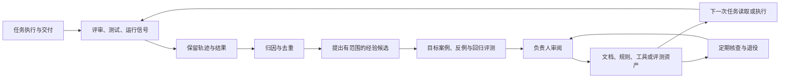
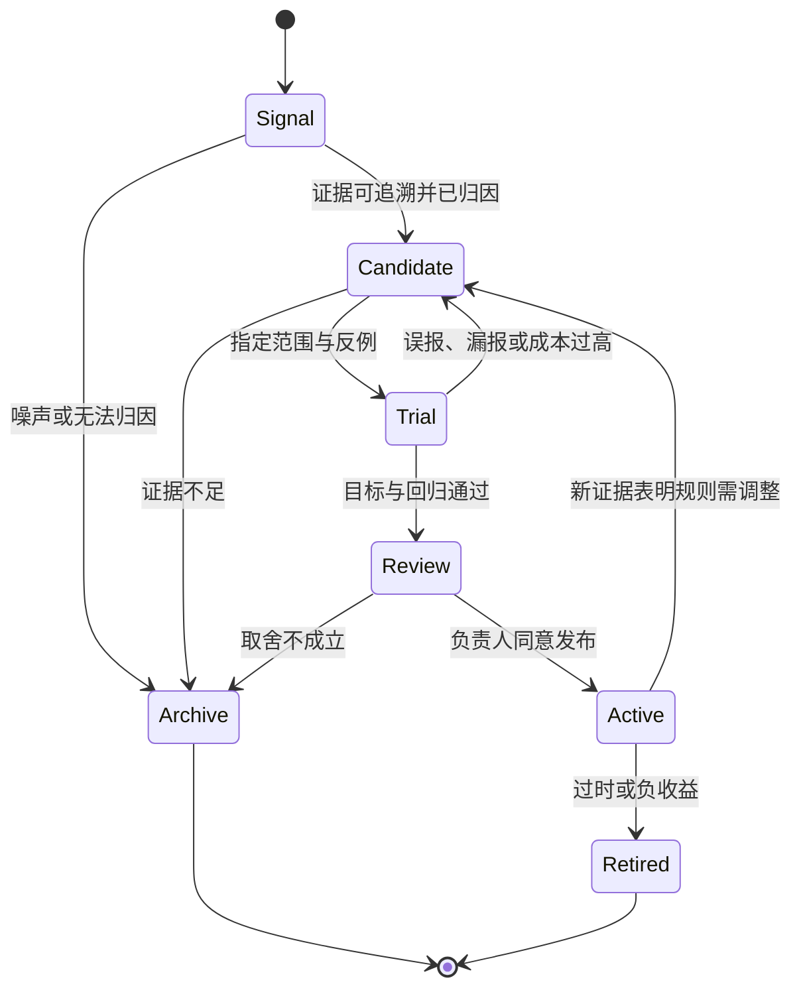

# 研发交付 Harness 的自我演化：从任务证据到可验证的项目能力

> 查证日期：2026-09-20。本文讨论项目内包围 Coding Agent 的研发交付工作流，包括任务说明、仓库知识、工具、审查、测试、评测与发布反馈。文中的“自我演化”指这些**外部工作流资产**经过证据支持的修订，不指模型权重自动训练，也不承诺无人审批的自我修改。案例主要来自参与团队的一手复盘，通用方案是本文的设计推论。

## 核心判断：经验只有进入下一次决策，才算沉淀

“每次任务都写一段总结”仍可能让项目原地踏步：总结可能无法被检索、没有适用范围，或从未改变下一次任务的检查方式。一个有用的自我演化闭环至少要回答六个问题：**什么信号表明旧流程失效，怎样保留原始证据，谁判断它是否可推广，把结论放到哪种项目资产，如何证明改动有效，以及什么时候撤销它。**

这与单次任务内“运行测试、修好错误”的循环有关，但时间尺度不同。Birgitta Böckeler 把项目侧 Harness 分为事前引导和事后反馈：说明文档与工具帮助 Agent 第一次做对，测试、审查和运行信号使它在做错后纠正。两者同时存在，才可能把当前修复转化为后续任务的能力。[Böckeler：Harness engineering for coding agent users](https://martinfowler.com/articles/harness-engineering.html)

下面这张图回答：一次交付的发现怎样成为下一次交付可复用的能力？图中虚线回路由本文归纳，并不表示任何案例已经自动实现了所有步骤。



最容易漏掉的是 `Trial` 和 `Audit`：未经反例测试的经验容易变成过宽规则；不维护的规则会随着代码、产品与模型变化而过时。

### 四个不同的时间尺度

| 时间尺度 | 保存什么 | 解决什么问题 | 不能替代什么 |
| --- | --- | --- | --- |
| 同一次任务 | 工具结果、测试、审查意见 | 当场修正当前改动 | 不会自动改进未来任务 |
| 跨上下文或会话 | 进度记录、计划、Git 状态 | 中断后恢复工作 | 不保证经验适用于其他任务 |
| 跨任务 | 归因案例、项目规则、检查器、评测集 | 减少同类错误再次发生 | 需要验证规则的适用范围 |
| 上线之后 | 用户纠正、故障、遥测与业务结果 | 发现离线评测遗漏的真实问题 | 不能把每一次用户动作直接当作正确标签 |

Anthropic 的长任务实验用功能清单、进度文件和 Git 状态缓解跨会话失忆；它也发现仅有上下文压缩不够，Agent 会过早宣布完成或遗漏端到端验证。这证明了**持久任务状态**的价值，但并未证明跨任务规则已经改善。[Anthropic：Effective harnesses for long-running agents](https://www.anthropic.com/engineering/effective-harnesses-for-long-running-agents)

## 业界怎样连接“交付”与“学习”

这些案例的共同点是把经验从聊天记录移进可检查的工作环境；实现位置和自动化程度不同。

| 一手案例 | 公开描述的做法 | 本文采用的证据边界 |
| --- | --- | --- |
| Every 的 Compound Engineering | 在计划、实施、评审之后加入 `Compound`：整理解决方案、使其可检索，并检查下一次是否能自动发现同类问题。[Every：Compound Engineering](https://every.to/guides/compound-engineering) | 这是实践者的方法论和自身产品经验，不是跨团队对照实验；其建议的时间分配不能当作行业基准。 |
| OpenAI 的 Agent 优先仓库 | 用简短 `AGENTS.md` 做目录，详细知识和计划保存在版本化文档中；CI 检查结构、链接和新旧状态，周期性任务提出文档清理与重构 PR。[OpenAI：Harness engineering](https://openai.com/index/harness-engineering/) | 一支高度投入的团队与特定仓库。文章明确说其自主交付能力依赖仓库结构与工具投入，不能直接泛化。 |
| Anthropic 的 Harness 实验 | 读取评测者轨迹，找出判断偏差，再修改评测提示；随后逐项去掉 Harness 组件，检验哪些仍有价值。[Anthropic：Harness design for long-running application development](https://www.anthropic.com/engineering/harness-design-long-running-apps) | 是受控实验与参与者报告，说明该实验中的取舍；不证明“评测 Agent”始终值得其成本。 |
| OpenAI 的 Tax AI | 将专业人员纠正、来源证据和生产轨迹合并，经人工归因后形成发现、针对性评测和有界工程任务，再跑回归并审阅候选改动。[OpenAI：Building self-improving tax agents with Codex](https://openai.com/index/building-self-improving-tax-agents-with-codex/) | 高度专业化且拥有结构化生产反馈的领域；本文只迁移其证据链设计，不迁移税务准确率或自动化承诺。 |

这些实践并没有形成一个统一的“自我演化标准”。可迁移的是因果链：**当前工作产生的反馈须先成为可核实的证据，再经过归因、实验与治理，才有资格改变未来工作流。**

## 第一关：从信号到有边界的失败类型

一次评审说“这次声称 UI 已验证，却只有构建日志”，尚不足以写成“每个任务必须跑浏览器”的全局规则。它可能是报告措辞错误、验收标准缺失、浏览器环境不可用，或具体任务确实漏测。OpenAI Tax AI 的参与者指出，专业人员更改一个值也可能来自抽取错误、映射问题、产品不支持、工作流噪声或专业判断。因此系统保留来源材料、预测、修改和最终结果，之后才把重复差异归为可行动发现。[OpenAI：生产纠正与轨迹](https://openai.com/index/building-self-improving-tax-agents-with-codex/)

本文建议把原始反馈与“经验候选”分开保存。候选至少记录：

```text
失败类型与影响范围
原任务和可追溯证据
重复发生的独立任务数
当时的环境、版本与验收条件
可能原因与尚未排除的替代解释
拟改变的行为及其反例
负责人、审阅日期与退役条件
```

这是**建议的数据契约**，不是要求所有团队新增一套平台。已有 issue、PR、事故记录和测试结果可以承载它；关键是能追溯、能区分事实与归因、能在未来被定位。重复次数本身也不是充分条件：两条由同一个坏配置引起的失败并不构成两个独立证据。

## 第二关：把经验放在合适的资产层

OpenAI 的仓库实践曾尝试把大量信息放进单个 `AGENTS.md`，后来改为短入口和分层知识库，因为长指令挤占任务上下文、容易陈旧且难以机械检查。仓库中的计划、设计说明和质量记录可被索引和验证，而不是藏在聊天中。[OpenAI：仓库知识作为事实源](https://openai.com/index/harness-engineering/)

“写进提示词”也不是唯一晋升方式。按问题性质选择最便宜且最可验证的资产：

| 经验类型 | 合适的载体 | 核心检查 |
| --- | --- | --- |
| 某任务的当前状态 | 计划、进度记录、Git 与结果报告 | 新会话能否重建真实状态 |
| 有条件的项目知识 | 架构文档、ADR、案例库与简短入口索引 | 能否找到，范围和日期是否明确 |
| 经常重复的操作方法 | 有示例和停止条件的工作流说明或 Skill | 干净会话是否会触发，触发后是否遵循 |
| 可确定的结构约束 | Lint、类型检查、脚本、测试、CI | 错误能否被机器稳定检出 |
| 语义或跨步骤质量 | 场景评测、审查准则与人工抽检 | 结果、轨迹和反例是否一并检查 |
| 权限与副作用限制 | 宿主权限、沙箱、工具实现 | 越界动作是否真实被拒绝 |

最后一行尤其重要：本仓库已有的 [Superpowers 源码剖析](./superpowers-source-analysis.md)区分了 Skill 中的文字流程、脚本门禁与宿主权限。把“必须先审批”写进文档只能影响 Agent 的行为倾向，不能替代真正阻止写入或发布的系统边界。项目工作流的演化应优先把**可机器判定的高频错误**转成机器约束，把仍需语义判断的部分留给可审计的评测和人。[Superpowers 源码剖析](./superpowers-source-analysis.md)

## 第三关：验证一次“学习”是否有净收益

经验晋升应当像一项小型工程变更，而不是把失败总结直接追加到规则末尾。Anthropic 把 Agent 评测中的任务、试验、评分器、执行轨迹和环境最终状态分开；它提醒团队检查评分器是否惩罚了有效解，并用正反案例防止规则只会朝一个方向优化。[Anthropic：Demystifying evals for AI agents](https://www.anthropic.com/engineering/demystifying-evals-for-ai-agents/)

本文建议采用以下晋升门禁：

1. **重放基线**：旧工作流在原失败案例上确实重现问题；若环境无法重建，明确降级为静态分析。
2. **限定候选**：写清新规则针对的任务类型、触发条件和预期动作；不要从局部案例推出全局义务。
3. **同时测反例**：除目标失败外，加入不应触发的相邻任务和未用于制定规则的留出案例。
4. **回归与成本**：检查原有成功任务、误报、额外工具调用、时长与人工复核负担。
5. **负责人批准**：人审查因果解释、取舍和真实副作用；通过离线评测只表示可进入受控发布。
6. **发布后复核**：观察相同失败是否减少，以及是否产生新的绕过或误报；不达预期则修改或退役。



状态图表达的是治理协议，并非现成产品接口。`Trial` 要看环境最终结果，而不只看 Agent 宣称“已完成”；测试环境须尽量隔离。Anthropic 报告过历史状态泄漏和共享环境资源导致评测失真，也建议对模型评分器进行人工校准、审读失败轨迹，并长期维护评测集。[Anthropic：评测环境、评分与维护](https://www.anthropic.com/engineering/demystifying-evals-for-ai-agents/)

当模型升级或任务边界变化，旧 Harness 组件也可能由帮助变成开销。Anthropic 在长任务实验中尝试移除阶段划分，并逐项观察规划者和评测者的边际价值；它发现评测者是否值得运行，取决于任务是否仍处于模型独立完成能力的边缘。因而应定期做**消融与成本复核**，而不是只增不减。[Anthropic：Harness 组件迭代](https://www.anthropic.com/engineering/harness-design-long-running-apps)

## 第四关：防止经验系统自身退化

至少有五种反向演化：

1. **错误归因被固化**：把一次失败的相关因素当成原因，规则阻碍正常任务。处理方式是保留原轨迹、替代解释和反例。
2. **提示词堆积**：每次补一条全局命令，入口变长、冲突增多，Agent 看不到真正重要的上下文。入口宜做索引，细节按需读取。[OpenAI：短入口与分层文档](https://openai.com/index/harness-engineering/)
3. **评测过拟合**：规则只对已知失败有效，或评分器奖励某种表面路径。保留留出案例、审读轨迹，检查环境最终状态；不要让试验之间共享会泄漏答案的状态。[Anthropic：评测集设计](https://www.anthropic.com/engineering/demystifying-evals-for-ai-agents/)
4. **反馈被误当权威**：用户纠正、审查意见、生产轨迹都可能不完整或带有敏感信息。只有经授权且完成归因的部分才能晋升；外部内容不能直接改写项目规则。这是基于证据链和信任边界的设计推论。
5. **过时规则反复传播**：Agent 倾向复用仓库已有模式，包括不佳模式。OpenAI 的案例用定期扫描、质量分级和小范围清理 PR 抑制漂移，也明确表示长期架构一致性仍是开放问题。[OpenAI：Entropy and garbage collection](https://openai.com/index/harness-engineering/)

维护时至少给规范性资产标明**负责人、适用范围、最后核实日期、对应失败案例与退役触发条件**。这不是为了增加表单，而是让下一位维护者能回答“此规则为什么存在、现在还成立吗”。知识资产与评测资产也应分开审核：文档陈述可能过时，评测标准也可能错误，两者互相引用并不自动证明正确。

## 一个最小可采用的项目协议

下面是综合上述来源提出的**通用起点**，不是任何一家团队已验证的固定模板：

1. 每次交付留下一份短结果：目标、实际改动、运行过的验证、未验证范围、人工纠正和来源链接。
2. 每周或每若干任务只挑选高影响、重复出现的失败做归因；一次性异常保留为案例，不立刻升级成全局规则。
3. 每条候选经验指定责任人和适用范围，先重放原失败，再加入反例与回归。
4. 根据可判定性选择载体：文档用于解释，工具与 CI 用于确定性约束，评测用于不易完全形式化的行为，宿主权限用于副作用边界。
5. 通过后以可审阅变更进入仓库；发布后追踪复发率、误报率、人工复核时间和工作流成本，定期删除负收益规则。

这套协议追求的是**有证据的净改善**，不是规则数量、自动化步骤或 PR 数量最大化。不同项目需要按风险与交付频率调整评测和人工关口。尤其在数据敏感或无法稳定重放的项目，研究、记录和人工审查可以先行，自动晋升必须更谨慎。

## 用一个小实验检查晋升逻辑

[配套 Demo](./engineering-harness-self-evolution-demo/run-demo.mjs)模拟一个常见失败：交付报告声称“浏览器行为已验证”，证据却只有构建或单元测试。它给出两个独立评审记录、一个目标案例、一个未参与规则编写的留出案例和两个反例；比较“无规则”“只要有构建却没有浏览器证据就报错”的宽规则，以及只检查**声称浏览器已验证但缺少浏览器证据**的窄规则。

用以下命令运行完整检查，再读[配套专家练习](./engineering-harness-self-evolution-exercises.md)：

```sh
node learn/ai/tools/engineering-harness-self-evolution-demo/verify.mjs
```

Demo 用固定样本和确定性函数展示**范围、反例、留出案例与人工审批**的关系；`--approve` 只是模拟审批输入，不执行外部发布。它不调用模型，不证明某条自然语言指令会被真实 Agent 遵循，也不测量生产中的收益。要证明实际效果，仍须把项目真实轨迹、宿主权限、任务分布和运行结果接入评测。源码与练习围绕这个边界设计。

## 来源审计与未解决问题

本文于 2026-09-20 回查了 OpenAI、Anthropic、Every 的一手实践材料及 Thoughtworks 工程师的署名分析，并将案例中观察到的做法与本文设计建议分开。OpenAI 的 Tax AI 案例提供了从生产纠正到评测任务的较完整证据链；Anthropic 的评测文章提供了反例、隔离和评分维护的独立方法支持。本文没有取得这些团队的原始内部数据，也没有跨组织的对照实验，因此不宣称一种组织结构、规则阈值或节省比例具有普遍最优性。

仍需在真实项目中回答：哪些失败信号值得长期保存；经验何时应晋升为机器约束；规则减少了多少复发与人工负担；模型升级后哪些 Harness 组件应撤销；以及在保护隐私与权限边界的同时，能开放多少生产证据供工作流学习。这里给出的 Demo 只验证一个最小决策模型，不能替这些问题作答。
