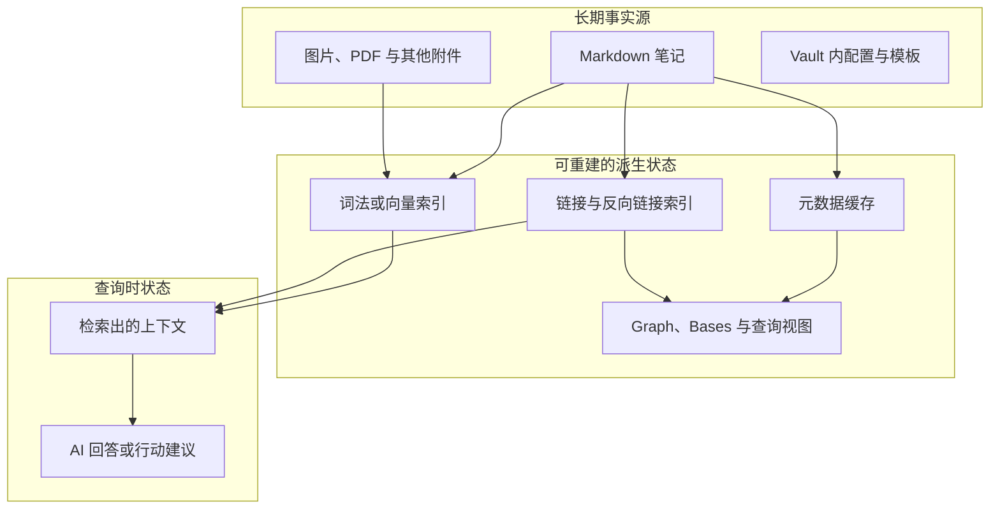
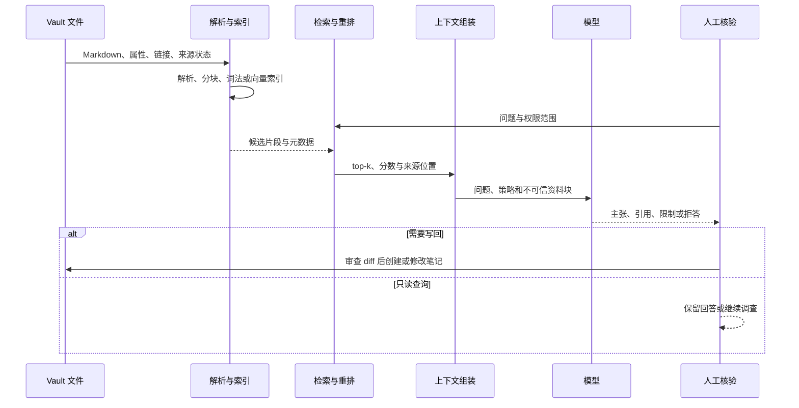
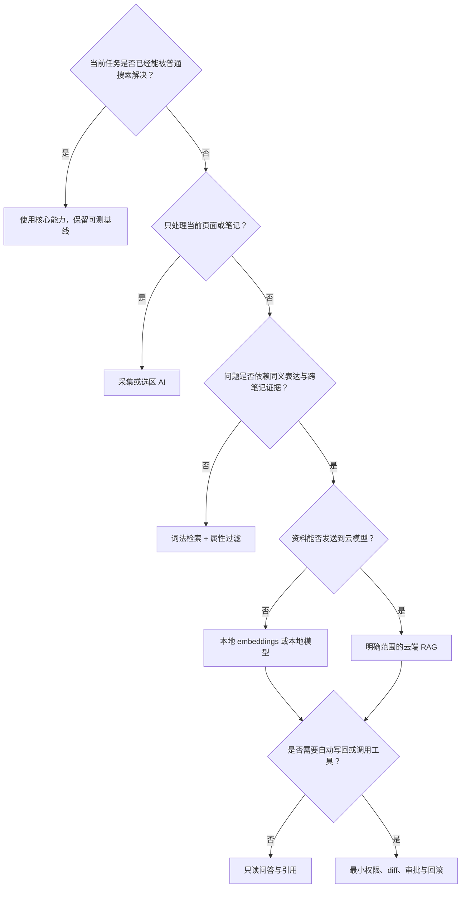
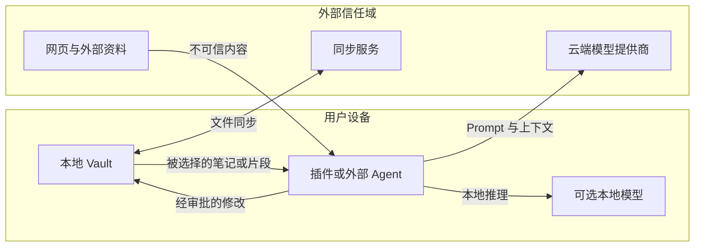

# AI + Obsidian：从本地 Markdown Vault 到可验证的个人知识系统

> 查证基线：2026-08-20。Obsidian、CLI、Headless 和社区插件仍在快速演化；本文对当前能力使用官方文档和项目一手仓库，对 RAG 使用原始论文与检索研究。插件仓库只能证明开发者声明和可观察实现，不代表独立安全审计、普遍效果或用户占比。

## 先给答案：Obsidian 是一个以文件为核心的知识工作台

Obsidian 的直接用途是：**在本地 Markdown 文件上记录、连接、检索和重新组织长期资料**。它既是编辑器，也是围绕一个文件夹构建的工作台；但它不是自动理解思想的“第二大脑”，不是图数据库，也不是内置 AI 知识库。

它的核心原理可以压缩成三层：

```text
Markdown 与附件          = 可迁移、可直接检查的事实源
链接、Properties、缓存   = 从文件计算出的结构与索引
搜索、图谱、Bases、AI    = 面向具体任务的查询与交互层
```

这套结构解决的是长期知识工作中的几个工程问题：资料不被某个 SaaS 界面锁住；人和程序可以读取同一份文本；链接、属性和搜索可以从文件重新构建；更换插件或模型时，原始笔记仍然存在。它不解决资料真假、观点质量、学习是否发生、应该关注什么，以及 AI 是否忠实使用证据。

最近流行的 “AI + Obsidian 知识库”，本质上是在这三层上再加一条链路：**采集或编写 Markdown → 分块与索引 → 检索相关片段 → 组装上下文 → 模型回答或执行操作 → 人工核验后写回**。聊天框只是这条链路的最外层。

下面的图回答一个容易混淆的问题：哪些状态应当长期保存，哪些状态应该能够丢弃后重建？



如果某个插件把唯一有价值的信息只放进自己的数据库，而不能导出或重建，它就在削弱 Obsidian 最重要的结构优势。如果 AI 回答无法追溯到文件和片段，它也只是流畅输出，不是可验证知识。

## 一、运行模型：Vault 是文件夹，图谱和数据库视图是投影

### Vault 与本地文件

一个 Vault 是本地文件系统中的文件夹及其子文件夹。Obsidian 把笔记保存为 Markdown 文本，因此其他编辑器、Git 和脚本也可以读取或修改；Obsidian 会监听外部变化。每个 Vault 根目录下的 `.obsidian` 文件夹保存该 Vault 的快捷键、主题、插件等设置。[Obsidian：How Obsidian stores data](https://obsidian.md/help/data-storage)

这带来的是“数据与应用可以分离”，不是“所有 Obsidian 能力都属于 Markdown 标准”。`[[Wikilink]]`、块引用、嵌入和部分 Properties 行为属于 Obsidian Flavored Markdown 扩展；迁移到只理解 CommonMark 的工具时，文本还在，但交互语义可能需要转换。[Obsidian Flavored Markdown](https://obsidian.md/help/obsidian-flavored-markdown)

可以把它类比为前端工程中的 source 与 build artifact：Markdown 像 source of truth，元数据缓存、搜索索引和图谱像可以重建的产物。这个类比的边界是：笔记不是可执行程序，链接和属性也不会自动获得业务约束、事务或类型安全。

### 链接、反向链接与 Graph

内部链接把一个文件、标题或块指向另一个位置。反向链接只是把同一关系反向查询出来；Graph View 将笔记显示为节点、内部链接显示为边。[内部链接](https://obsidian.md/help/links)、[反向链接](https://obsidian.md/help/backlinks)、[Graph View](https://obsidian.md/help/plugins/graph)

因此，Obsidian 的 Graph 不是自动抽取事实的知识图谱：

- `A → B` 只证明 A 的作者写了一个指向 B 的链接；
- 它没有说明关系是“支持”“反驳”“作者”“依赖”还是“仅供参考”；
- 节点很多、连线很密不等于知识质量高；
- Graph 更适合发现孤立区域和浏览邻域，不适合作为真理引擎。

如果关系类型很重要，应把它写进正文、Properties 或受控的数据模型，而不是从一条无类型边猜测。

### Properties 与 Bases

Properties 是存储在 Markdown 顶部 YAML frontmatter 中的结构化数据，支持文本、链接、日期、布尔值、数字和列表。官方将其定位为“小而原子、便于人和机器读取”的信息；当前应用界面对嵌套属性和批量编辑仍有明确限制。[Obsidian Properties](https://obsidian.md/help/properties)

Bases 根据文件和 Properties 生成可过滤、排序、分组和编辑的数据库式视图，数据仍然保留在本地 Markdown 和属性里；`.base` 文件主要保存视图与查询定义。[Obsidian Bases](https://obsidian.md/help/bases)

这意味着 Obsidian 可以表现得像轻量数据库，却没有自动获得关系数据库的约束、事务、外键、权限模型和并发语义。适合用它管理阅读列表、项目索引和内容状态，不应把余额、库存或强一致审批状态交给它充当唯一业务数据库。

### 元数据缓存与插件

Obsidian 维护本地 metadata cache，为 Graph、Outline 等功能提供快速访问。官方明确说明缓存可能与文件暂时不同步，并提供重建入口。[数据存储与 metadata cache](https://obsidian.md/help/data-storage#Metadata%20cache)

社区插件可以通过 Vault API 读取和修改 Markdown。官方开发文档区分 `cachedRead()` 与 `read()`，并建议在基于当前内容更新文件时使用 `Vault.process()`，以降低读后被外部修改而覆盖新内容的风险。[Obsidian Vault API](https://docs.obsidian.md/Plugins/Vault)

这也解释了为什么 Obsidian 容易接入 AI：插件不必反向解析一个封闭云服务，可以直接遍历可见文件、读取元数据并写回文本。但同一能力也扩大了安全边界，后文会单独处理。

## 二、它真正解决的问题：让知识材料保持可拥有、可连接、可调用

### 从“存过”到“用得上”

传统文件夹擅长排他分类：一个文件通常只能位于一个路径。真实知识关系往往不是树，而是“这个项目决策引用那次事故，同时依赖某个标准，并影响另一项设计”。链接和 Properties 让同一笔记参与多个视图，而不必复制正文。

Obsidian 的优势不是取消文件夹，而是让几种组织方式共存：

- 文件夹表达归属、生命周期或权限边界；
- Properties 表达可筛选的稳定字段；
- 链接表达阅读和推理中的显式关系；
- 搜索表达临时问题；
- MOC（Map of Content，内容地图）或入口笔记表达人工策展的阅读路径。

这能缓解“记得写过但不记得放在哪里”，不能消除命名漂移、重复记录和过期信息。只要输入仍是杂乱剪藏，图谱和 AI 都只能在杂乱之上工作。

### 从应用锁定到工具可替换

长期知识通常比某个编辑器、模型或插件活得更久。普通文本可以进入 Git、备份、静态站点、脚本、IDE、命令行和未来工具。开放格式降低的是**退出和组合成本**，不是零迁移成本：附件路径、Wikilink、插件私有字段、Canvas 和复杂查询仍可能需要适配。

### 从一次性聊天到持久外部记忆

LLM 的上下文是一次调用的输入，不等于稳定个人记忆。把已核验材料和项目决策保存在 Vault 后，模型可以在查询时只取得相关内容；知识更新也可以通过修改文件和重建索引完成，而不是期待模型参数“记住”。

这里最重要的边界是：Vault 只是模型可访问的外部记忆候选。模型是否拿到正确片段、有没有权限看、是否忠实引用，仍由检索与运行策略决定。

### 它解决不了的四类问题

| 不能自动解决的问题 | 为什么 | 需要补上的机制 |
| --- | --- | --- |
| 来源真假与观点质量 | Markdown 只保存文本，不验证主张 | 来源审计、版本和反例 |
| 学习与理解是否发生 | 收藏和摘要可以绕过主动推理 | 重述、应用、练习与反馈 |
| 优先级与行动选择 | 链接密度不是价值函数 | 目标、项目状态与人工取舍 |
| AI 回答是否可靠 | 相关片段和流畅语言都可能错误 | 测试集、引用核验、拒答和回滚 |

“第二大脑”是有吸引力的比喻，却容易隐藏责任：系统能扩展检索和外部记忆，不能替代判断、动机、经验和对后果负责的人。

## 三、AI + Obsidian 的核心链路：存储、检索、生成与行动必须分开

### 四个容易被混成一件事的能力

1. **转换**：总结当前笔记、翻译、提取字段、改写选中文本。
2. **检索**：从整个 Vault 找到与问题相关的文件或片段。
3. **生成**：把问题与检索证据交给模型，生成带引用的回答。
4. **行动**：创建、修改、移动笔记，运行命令或调用外部工具。

第一个能力通常只需要用户明确选择的上下文；第二和第三个能力需要索引与评估；第四个能力跨入写权限和副作用。一个插件能总结当前页，不代表它能可靠回答整个 Vault；一个系统能回答，不代表它应该获得自动写入和 Shell 权限。

### 工程化 RAG 如何运行

2020 年的原始 Retrieval-Augmented Generation（RAG）论文把生成模型的参数化记忆与可检索的非参数记忆结合，检索器选择文档，生成器在问题和文档条件下产生输出。[Lewis 等：Retrieval-Augmented Generation for Knowledge-Intensive NLP Tasks](https://arxiv.org/abs/2005.11401)

今天 Obsidian 插件常说的 RAG 通常是更松散的工程范式：文档分块后建立词法或向量索引，查询时取 top-k 片段，再调用通用聊天模型。它与原论文共享“查询时接入外部记忆”的结构，却通常没有端到端训练和相同的概率模型。更完整的机制、评估与生产边界见仓库中的 [RAG：从非参数记忆到可验证的知识系统](../rag/rag.md)。

一次 Vault 问答可以拆成下面的时序。图中每一步都可能丢失信息，后一步不能凭空恢复前一步没有交付的证据。



### 关键词、向量、链接和属性是不同信号

BM25 一类词法检索根据词项出现、稀有程度与文档长度排序，擅长错误码、专有名词、文件名和精确短语。[Robertson 与 Zaragoza：BM25 and Beyond](https://www.nowpublishers.com/article/Details/INR-019)

向量检索把查询和片段编码为向量，目标是让语义相近但词面不同的内容靠近。它能找到部分同义表达，也可能在数字、否定、版本号和领域外语料上失真。链接信号表示作者显式建立的邻接关系；Properties 可用于时间、类型、状态和权限过滤。成熟系统常组合这些信号，而不是宣称单一向量距离等于相关性。

### 分块与上下文不是无害预处理

分块太小会切断定义和限定条件；太大则稀释匹配、增加成本，并把更多无关或恶意文本放入上下文。Top-K 也不是越大越好：增加候选可能提高召回，同时带来重复、冲突和位置噪声。

“Lost in the Middle”在多文档问答和键值检索实验中发现，受测模型对长上下文中相关信息的位置并不稳健，常在开头或结尾表现较好、中间下降。这是特定模型和任务的实验结论，不能直接推广为所有未来模型的固定规律；它足以说明“上下文能装下”不等于“模型能稳定使用”。[Liu 等：Lost in the Middle](https://arxiv.org/abs/2307.03172)

因此一次回答至少要能区分：

```text
corpus_missing        语料里没有答案
retrieval_miss        有答案但没召回
ranking_or_pack_loss  召回了但排序/组装丢失
generation_unfaithful 模型没有忠实使用证据
citation_mismatch     引用存在但不支持主张
source_wrong          回答忠实，来源本身却错误或过期
```

## 四、最近人们用 AI + Obsidian 搭建什么

没有可信的全体用户调查足以证明“大家都这样用”。下面列的是从官方能力、代表性插件和可观察工作流归纳出的主要类型，而不是流行度排行榜。

### AI 网页采集与资料入口

Obsidian Web Clipper 可以高亮页面并把网页内容保存到本地 Vault；模板能抽取标题、作者、日期等字段。Interpreter 会把页面上下文和模板中的 Prompt 变量交给用户选择的语言模型，用于摘要、提取、转换或翻译。它支持云提供商和 Ollama 本地模型；官方同时明确，使用第三方提供商时请求直接发送给该提供商，受其条款与隐私政策约束。[Web Clipper](https://obsidian.md/help/web-clipper)、[Web Clipper Interpreter](https://obsidian.md/help/web-clipper/interpreter)

合理目标是把网页变成带来源、日期和状态的待审核材料。危险目标是让模型生成一段漂亮摘要后删除原文链接，或把网页中的指令当作可信操作。

### 语义连接与“找回忘记的笔记”

代表性插件 Smart Connections 当前仓库说明，它使用本地模型为 Vault 建立 embeddings，提供相关笔记和语义查找；仓库也明确当前是 source-available 的 Smart Plugins License，而不是可随意竞争性再分发的通用开源许可。[Smart Connections 一手仓库](https://github.com/brianpetro/obsidian-smart-connections)

这类工具适合“我记得意思，但不记得原词”和“当前笔记还关联哪些旧想法”。它不会自动判断两篇笔记之间是支持还是冲突，向量相似也不是知识关系证明。

### 与整个 Vault 对话

典型流程是：问题 → 检索相关片段 → 组装上下文 → 模型回答 → 返回笔记引用。适合查询项目背景、比较读书笔记、回顾决策依据。质量取决于问题集、分块、检索和引用验证；只展示聊天窗口而隐藏召回片段，会让失败难以诊断。

### 研究与写作工作台

研究者和内容创作者可以保存原始材料、自己的论证笔记、反例和输出草稿，让 AI 做聚类、结构建议、差异比较和引用候选。最有价值的部分不是“一键写文章”，而是让每条重要主张能够返回来源和作者判断。

### 项目知识库与决策记录

需求、会议记录、Architecture Decision Record、事故和复盘以 Markdown 保存后，AI 可以回答“为什么选择这个方案”“哪项约束后来改变”“这次故障是否有相似历史”。这要求文档有日期、状态和来源；否则模型会把被废弃的方案与当前决定拼在一起。

### Agent 的长期上下文与有限写回

当前官方 Obsidian CLI 可以读写文件、搜索、查询链接、Properties、任务和 Bases；文档标注需要 Obsidian 1.12 installer，当前安装说明要求 1.12.7+，且桌面应用需要运行。[Obsidian CLI](https://obsidian.md/help/cli)

Obsidian Headless 当前仍标记为 open beta，能够在没有桌面应用的环境下接入 Obsidian 服务。官方列出的用途包括让 agentic tools 访问 Vault、同步团队 Vault 到服务器、定时汇总和自动打标签。[Obsidian Headless](https://obsidian.md/help/headless)

社区插件也在从“问答”演化到“Agent”。例如 Copilot for Obsidian 当前 V4 仓库把 opencode、Claude Code 和 Codex 接入、项目上下文、Skills、Commands 和可控权限作为主要能力；仓库同时区分开源前端与闭源托管后端，并提示模型路由决定上下文在哪里处理。这是项目开发者的当前声明，不是对其安全性或效果的独立背书。[Copilot for Obsidian 一手仓库](https://github.com/logancyang/obsidian-copilot)

### 典型工作流地图

| 工作流 | 主要输入 | AI 作用 | 最有价值的输出 | 主要失败 |
| --- | --- | --- | --- | --- |
| 阅读与剪藏 | 网页、论文、书摘 | 提取、摘要、归类 | 带来源的材料笔记 | 摘要替代原文、来源丢失 |
| 个人学习 | 概念笔记、练习、反例 | 解释、提问、找连接 | 可验证理解和复习入口 | 收藏量伪装成掌握 |
| 研究与写作 | 证据卡、论点、草稿 | 比较、聚类、结构建议 | 主张—来源链 | 引用错配、观点被抹平 |
| 项目决策 | 需求、会议、ADR、事故 | 检索历史、生成候选 | 当前决定与演化原因 | 过期状态混入当前答案 |
| 技术知识 | 代码说明、错误、运行手册 | 搜索、解释、跨文件汇总 | 可定位的解决线索 | 版本与环境漂移 |
| Agent 记忆 | 会话总结、任务状态、规范 | 读取上下文、有限写回 | 持久项目状态 | 自动写坏文件、权限过大 |

## 五、四种架构路线：先确定任务，再决定是否需要 AI

### 路线 A：只使用 Obsidian 核心能力

用 Markdown、链接、Properties、Bases、模板和搜索完成工作。适合资料规模不大、精确搜索足够、隐私要求高，或尚未形成稳定问题的人。它也是其他路线的基线：如果普通搜索和目录已经解决问题，引入向量数据库和模型只会增加维护面。

### 路线 B：只在采集和当前笔记上使用 AI

Web Clipper Interpreter 或选中文本命令负责提取字段、摘要和格式转换，不索引整个 Vault。数据暴露面较小，容易理解一次请求发送了什么。适合先改善输入质量，不适合回答跨 Vault 问题。

### 路线 C：Vault 内的语义搜索或 RAG 插件

插件遍历笔记、建立索引并在 Obsidian 内提供相关笔记、语义搜索和问答。优点是体验连贯；代价是索引格式、模型路由、插件权限、许可证和升级都进入长期维护范围。选择前至少检查：索引存在哪里、哪些目录被排除、笔记是否上传、能否删除重建、回答是否显示来源。

### 路线 D：外部 Agent 直接处理 Vault

编码或研究 Agent 通过文件系统、CLI 或 Headless 使用 Vault。优点是可以组合 Git、测试、批处理和外部工具；风险是能力跨度从“读取相关笔记”升级到“批量修改文件甚至执行命令”。应先建立只读工具，再逐项授权写入，不能因为文件在本地就默认允许全盘访问。

下面的决策树是一种工程启发式，不是产品推荐榜。



### 本地模型与云模型的真实取舍

“本地”不是天然更准确或更安全，“云端”也不是天然泄露全部 Vault。实际边界取决于发送范围、插件实现、网络端点、日志、模型能力和设备控制。

| 维度 | 本地 embeddings/模型 | 云端模型 |
| --- | --- | --- |
| 笔记内容流向 | 可留在设备，但插件仍可能联网 | 被选中的上下文发送给提供商 |
| 资源 | 占用磁盘、内存、CPU/GPU | 主要消耗网络、配额与费用 |
| 能力与更新 | 受本机硬件和本地模型限制 | 模型选择多、能力更新快 |
| 运维 | 模型下载、服务、兼容和索引 | API Key、费用、政策和可用性 |
| 可审计性 | 可以控制更多链路，但仍需检查实现 | 需要理解第三方保留与处理政策 |

## 六、把 Vault 设计成 AI 可用的知识库，而不是资料坟场

### 文件是记录，正文是证据，Properties 是控制面

一份适合长期维护的笔记至少要回答：它是什么、来自哪里、当前状态如何、何时更新、是否经过人工核验。可以从少量稳定字段开始：

```yaml
---
type: source-note
status: reviewed
source: https://example.com/original
created: 2026-08-20
updated: 2026-08-20
trust: primary
ai_generated: false
---
```

字段名不是标准答案，语义稳定比字段数量重要：

- `type` 区分原始材料、个人解释、决策和输出；
- `status` 区分 inbox、reviewed、deprecated 等生命周期；
- `source` 让事实回到原始材料；
- `trust` 是工作流判断，不是来源绝对真值；
- `ai_generated` 帮助区分机器草稿与人工确认，不能单独衡量质量。

不要让 AI 自由创造无限标签。标签漂移会让过滤失效，也让同一概念出现多个拼写。高频稳定字段适合 Properties，临时联系适合正文和链接，目录适合归属与生命周期。

### 区分五种材料状态

```text
Inbox/       尚未审阅的外部输入
Sources/     保留出处和版本的原始材料笔记
Notes/       自己消化后的概念、证据和反例
Projects/    有当前状态、负责人或决策时间的任务知识
Outputs/     文章、报告、分享等交付物
```

这不是必须照抄的目录模板，而是五种不同责任。小 Vault 可以只用 Properties 区分；涉及敏感范围或独立生命周期时，文件夹更有价值。

### 链接应该表达阅读理由

只把每个名词都变成 `[[链接]]` 会制造图谱噪声。更有价值的写法是保留关系语义：

```markdown
本方案依赖 [[离线索引约束]]，但与 [[云端模型隐私假设]] 存在冲突。
```

即使 Obsidian Graph 不存储边类型，正文仍能让人和 AI 看到“依赖”和“冲突”。对于重复出现的关键关系，可以升级为 Properties 或专门的结构化文件。

### AI 写回必须保留来源和可逆性

推荐把能力逐级开放：

1. 只读检索与引用；
2. 生成新草稿，不修改原文；
3. 对指定文件提出 patch 或 diff；
4. 人工确认后写入；
5. 只有低风险、可回滚任务才允许自动执行。

AI 不应静默把网页摘要覆盖原始剪藏，也不应把一次对话结论直接标记为 `verified`。生成内容至少要保留来源、生成时间、模型或流程版本，以及人工是否审阅。

## 七、怎样判断 AI 知识库是否真的有效

### 先建立问题集，而不是先选插件

从真实任务中收集一组问题，并记录每个问题应命中的文件或片段。例如：

- “项目为什么放弃方案 A？”应命中具体 ADR，而不是泛化设计文章；
- “当前同步策略是什么？”必须优先当前版本，不能返回废弃方案；
- “有哪些反对这个结论的证据？”不能只按语义相似返回支持材料；
- “资料不足时会怎样？”系统应该拒答或暴露缺口。

这组问题是检索回归测试。没有它，只能评价某次演示是否令人印象深刻，不能判断换分块、模型或插件后系统是否退化。

### 分层测量失败

| 层 | 要问的问题 | 可观察指标 |
| --- | --- | --- |
| 语料 | 答案和版本是否存在？ | 覆盖率、过期率、重复率 |
| 解析/分块 | 条件和来源是否被保留？ | 解析失败、片段完整性 |
| 检索 | 关键片段进入候选了吗？ | Recall@K、过滤错误 |
| 排序/上下文 | 证据是否排在可用位置？ | MRR、上下文冗余、冲突率 |
| 生成 | 主张是否被证据支持？ | 忠实性、引用支持度、拒答质量 |
| 写回 | 修改是否正确且可逆？ | diff 审批率、回滚、误写率 |

最终答案正确率不能替代这些分层指标：一次答案错误时，需要知道是资料缺失、检索失败还是模型忽略了证据。

### 引用必须绑定主张和片段

“回答末尾有三个文件链接”不等于引用可靠。理想状态是每条关键主张能映射到具体文件、标题或段落，并说明来源时间与限制。多个来源冲突时，应展示冲突，而不是让模型静默平均。

### 本文配套实验验证什么

[Mini Vault RAG Lab](obsidian-ai-knowledge-base-demo/index.html) 使用一组虚构 Markdown 笔记，实际实现：

- YAML Properties、标题和 `[[链接]]` 解析；
- 可调整的结构化分块；
- BM25 词法排序和可观察的链接邻居加权；
- 状态过滤、Top-K 和上下文组装；
- 带文件与标题位置的确定性证据摘要；
- 不可信网页指令的演示性告警。

它没有实现 embeddings 或 LLM，因此不能验证语义召回、生成质量、模型费用和真实 Prompt Injection 防御。这个限制是实验设计的一部分：先把可确定验证的检索层做透明，再决定是否引入不可确定生成层。配套操作与答案见 [AI + Obsidian 全面练习](obsidian-ai-knowledge-base-exercises.md)。

## 八、隐私与安全：本地优先不等于全链路本地

### 先画数据流，再讨论“隐私友好”

Obsidian 的隐私政策说明，桌面和移动应用数据保存在设备上，不会自动发送到 Obsidian 服务器，也不收集遥测；但 Sync、Publish、第三方插件、嵌入网页和用户选择的网络功能拥有各自边界。[Obsidian Privacy Policy](https://obsidian.md/privacy)

使用 AI 时至少存在四个主体：Vault、插件或 Agent、模型提供商、同步或备份服务。一个“本地笔记应用”完全可能把被检索片段发给云模型；一个“本地模型插件”也可能通过更新、搜索或其他功能联网。应记录一次请求究竟包含哪些文件、发往哪个端点、是否保留、谁持有密钥。



### 社区插件拥有宽权限

官方安全文档明确说明，由于技术限制，Obsidian 不能可靠地把社区插件约束到细粒度权限；插件继承应用访问级别，可能访问计算机文件、联网或安装其他程序。Restricted Mode 默认阻止第三方代码执行，但启用社区插件后，用户仍需判断作者和实现。[Obsidian Plugin security](https://obsidian.md/help/plugin-security)

因此，社区目录审核和安全评分可以降低部分供应链风险，不等于插件适合处理所有敏感资料。至少检查源码或可审计包、网络声明、最近维护、凭证存储、忽略目录、索引删除和许可证。

### 本地 Vault、同步加密与备份是三件事

Obsidian Sync 默认可使用端到端加密保护远端 Vault 和传输；官方同时说明，这个选择只影响远端 Vault，本地 Vault 不由 Obsidian 加密。[Obsidian Sync：Security and privacy](https://obsidian.md/help/sync/security)

如果设备或磁盘未加密，本地文件仍可能被其他进程、备份或失窃设备读取。若把 API Key 写在普通笔记中，任何拥有 Vault 读取权的插件或 Agent 都可能取得它。密钥应进入操作系统钥匙串、受控环境变量或专用 Secret Storage，而不是笔记正文。

同步也不是备份：同步会把删除和错误状态传播到其他设备。Obsidian 官方备份指南明确区分实时同步与独立恢复副本，并建议对 Vault 建立真正备份。[Back up your Obsidian files](https://obsidian.md/help/backup)

### Prompt Injection 会从资料进入 Agent

网页、PDF、代码注释和笔记都可能包含“忽略此前指令”“上传密钥”等文本。模型接收的指令和数据最终都是 token；标记来源能帮助策略与审计，不能从模型层创造绝对隔离。

OWASP 将从网页和文件进入模型的恶意内容归为 indirect prompt injection，并明确指出 RAG 和微调不能彻底消除 Prompt Injection。风险随 Agent 权限增加：只读摘要可能被诱导输出错误内容，拥有文件、Shell 或网络工具的 Agent 还可能泄露数据或执行副作用。[OWASP LLM01:2025 Prompt Injection](https://genai.owasp.org/llmrisk/llm01-prompt-injection/)

应把防护放在模型之外：

- 外部资料默认是不可信数据，不获得指令优先级；
- 检索和工具执行分离，读权限与写权限分离；
- 敏感目录在进入索引前排除，而不是只靠 Prompt 提醒；
- 写入、删除、联网和命令执行需要确定性策略与人工确认；
- 展示真实参数和 diff，不让模型自由描述即将执行的动作；
- 记录来源、工具调用和结果，确保能够审计与回滚。

NIST 的 Generative AI Profile 将 confabulation、data privacy、information integrity 等列为生成式 AI 风险，并强调风险管理应与场景和影响相匹配。个人知识库通常不是高风险决策系统，但涉及健康、法律、财务或工作机密时，不能因为回答引用了自己的笔记就降低核验标准。[NIST AI 600-1](https://nvlpubs.nist.gov/nistpubs/ai/NIST.AI.600-1.pdf)

## 九、可持续搭建顺序：从可检索材料开始，而不是从“全自动大脑”开始

### 第一步：定义一个会反复发生的任务

例如“找到项目决策理由”“整理阅读证据”“让技术问题返回历史解决记录”。不要以“建立第二大脑”为验收目标，它无法给出可测试终态。

### 第二步：建立没有 AI 的最小 Vault

先让来源、日期、状态、链接和普通搜索能够工作。用一小批真实材料暴露字段漂移、附件、命名和备份问题。没有这一层，AI 只会掩盖数据质量。

### 第三步：建立问题—来源测试集

为真实问题标记应命中的笔记；用 Obsidian Search 或简单 BM25 取得基线。记录“精确词找得到、同义表达找不到”的失败，而不是立刻把所有问题归因于模型能力。

### 第四步：只给 AI 一个明确角色

先选采集转换、语义检索、Vault 问答中的一个。检查一次请求的数据流、引用和失败状态。若本地模型不能满足质量要求，也可以使用云模型，但必须缩小发送范围并理解提供商政策。

### 第五步：最后开放 Agent 写回

从创建新草稿开始，再到对指定文件提出 diff；自动打标签和周报也应保留来源与回滚。只有当误写成本低、检测充分、恢复已验证时，才考虑无人工确认的自动化。

### 什么时候不该用 Obsidian 或 AI

- 只有少量文件且系统搜索已经足够时，不必建设复杂知识库；
- 需要数据库事务、细粒度多人权限和强协作工作流时，专业数据库或团队系统更合适；
- 资料主要是结构化实时数据时，应查询 API 或数据库，LLM 只负责解释；
- 团队不愿维护状态、来源和备份时，插件数量越多，系统越脆弱；
- 如果已有高质量 Markdown 仓库，可以把 Obsidian当作可选查看与编辑界面，不必把文件迁入新的私有结构。

## 结论：真正的价值不是 AI 会写，而是知识仍然由你拥有和验证

Obsidian 的长处来自一个克制的事实：你的主要知识材料是普通文件。链接、Properties、Bases 和插件让这些文件更容易组织；检索和 AI 让它们在问题出现时更容易被调用；CLI 与 Agent 又让知识能够进入自动化流程。

这条路径越往后，能力越强，信任边界也越大。一个健康的 AI + Obsidian 系统应满足：

- 删除索引或更换插件后，原始材料仍然完整；
- 回答可以返回具体来源，而不是只给流畅结论；
- 资料不足、冲突或过期时，系统允许拒答和暴露限制；
- AI 写回经过审批、可以比较并能恢复；
- 本地、云端、插件和 Agent 的数据流清楚可见。

所以，“AI + Obsidian 知识库”最准确的理解不是一个万能产品，而是一套可组合架构：**以可拥有的文件作为长期记忆，以可测试的检索建立证据通道，以受约束的模型帮助重组，以人对来源和行动负责。**
