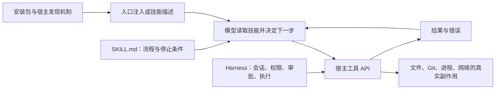
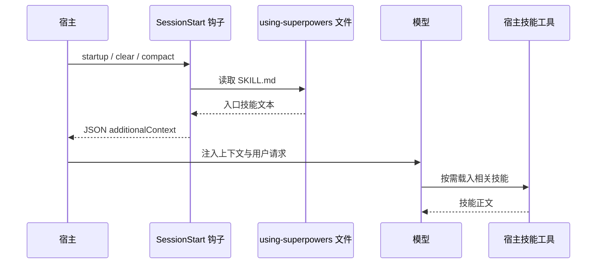
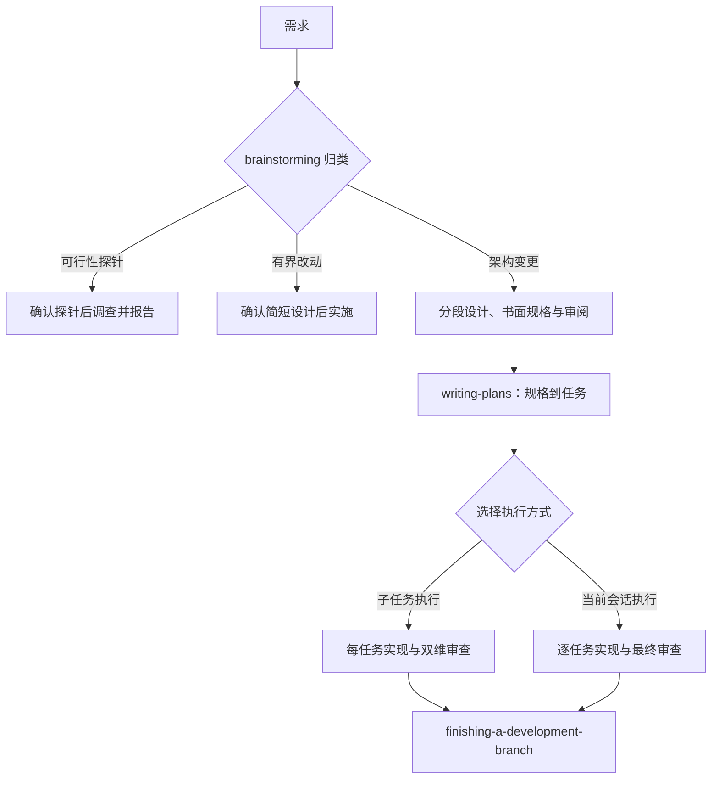

# Superpowers 源码剖析：Skill 如何接入 Harness 并约束开发流程

> 查证基线：2026-09-20。分析对象是 `obra/superpowers` 的 [`5bf4e78011075bcfc0dc295f0724994cd123ee71`](https://github.com/obra/superpowers/commit/5bf4e78011075bcfc0dc295f0724994cd123ee71)，仓库清单版本 `6.4.1`，提交日期 2026-09-18。下文的“当前”仅指这个固定提交。源码包见[文末](#源码包与阅读路线)。

## 核心判断：它是工作流协议，不是 Agent 运行时

Superpowers 的主体是 15 个 `skills/*/SKILL.md`：它们规定**何时进入某种流程、交付什么、何时停下、怎样验证**。少量 Bash、JavaScript 和 TypeScript 负责把入口技能送进不同宿主的上下文、注册技能、准备任务材料和检查部分机器可判定的条件。模型选择下一步，宿主 Harness 提供会话、工具、权限与实际副作用。仅有技能文件，不会自己运行模型、调用工具或强制审批。[技能目录](https://github.com/obra/superpowers/tree/5bf4e78011075bcfc0dc295f0724994cd123ee71/skills) · [移植指南的三层划分](https://github.com/obra/superpowers/blob/5bf4e78011075bcfc0dc295f0724994cd123ee71/docs/porting-to-a-new-harness.md#part-1--how-superpowers-works-across-harnesses)

下面这张图回答：一条 `SKILL.md` 指令怎样变成可观察的工作，而真正的权限在哪里？



阅读顺序是“发现 → 注入 → 模型决策 → 宿主工具 → 环境反馈”。图中的流程约束首先是**提示词层的规范**；真正能阻止一次文件写入或网络请求的，是宿主权限与工具实现。文中谈“门禁”时会注明它是文字门禁、脚本门禁，还是宿主门禁。

## 一、入口怎样抵达模型：发现与注入是两个问题

`using-superpowers/SKILL.md` 的 frontmatter 只给出名称和触发描述，正文则要求模型在行动前检查相关技能、先用流程技能、再用实现技能，并声明用户指令优先。这些是写给模型的指令，源码没有一个计算“1% 相关概率”的分类器。是否看见技能描述、能否按需载入全文，以及是否照做，都取决于宿主和模型。[入口技能](https://github.com/obra/superpowers/blob/5bf4e78011075bcfc0dc295f0724994cd123ee71/skills/using-superpowers/SKILL.md)

上游的移植指南把接入拆成三个契约：`skills/` 提供流程内容；每个宿主把“调用技能、读文件、派发子任务”等动作映射为自己的工具；启动机制使入口技能在会话早期可见。**注册技能**与**注入入口**必须分别核验：前者使技能可用，后者影响模型是否主动使用。[移植指南：三组件与接入形态](https://github.com/obra/superpowers/blob/5bf4e78011075bcfc0dc295f0724994cd123ee71/docs/porting-to-a-new-harness.md#part-4--choose-your-integration-shape)

这张时序图取 Claude Code 的钩子为例，说明入口如何进入会话；其他宿主并不全走这条路。



`hooks/hooks.json` 把 `startup|clear|compact` 接到 `hooks/run-hook.cmd session-start`；`hooks/session-start` 读取完整入口文件，转义 JSON，再按 Claude Code、Cursor、Copilot CLI、Muse 等环境输出不同字段。格式差异是实打实的接口约束：字段错了，宿主可能根本不读上下文；Claude Code 同时输出两种字段还可能重复注入。[钩子声明](https://github.com/obra/superpowers/blob/5bf4e78011075bcfc0dc295f0724994cd123ee71/hooks/hooks.json) · [钩子实现](https://github.com/obra/superpowers/blob/5bf4e78011075bcfc0dc295f0724994cd123ee71/hooks/session-start) · [钩子测试](https://github.com/obra/superpowers/blob/5bf4e78011075bcfc0dc295f0724994cd123ee71/tests/hooks/test-session-start.sh)

**Codex 是重要的反例。** 此提交的 `.codex-plugin/plugin.json` 声明 `skills: "./skills/"`，同时显式设置空 `hooks`；上游移植指南也写明 Codex 使用原生技能发现，不运行该 `SessionStart` 钩子。因此不能把 Claude Code 的“全文启动注入”直接当作 Codex 的已验证行为。这里能从源码确认的是**技能交付与钩子禁用**；某个 Codex 会话是否主动触发目标技能，仍需在该宿主中观察。[Codex 清单](https://github.com/obra/superpowers/blob/5bf4e78011075bcfc0dc295f0724994cd123ee71/.codex-plugin/plugin.json) · [移植指南：Codex 边界](https://github.com/obra/superpowers/blob/5bf4e78011075bcfc0dc295f0724994cd123ee71/docs/porting-to-a-new-harness.md#part-4--choose-your-integration-shape)

### 两种进程内适配，暴露了更细的实现取舍

OpenCode 插件兼容 V1/V2。V1 向配置加入技能目录，并在 `experimental.chat.messages.transform` 中将入口放入首个用户消息；V2 把每个技能注册为原生 `Skill.Info`，再用 `session.hook("context")` 注入。代码按宿主版本使用不同工具映射，缓存入口文本，避免每个 agent step 重读文件。V2 注册逐技能捕获错误，防止一个技能格式错误拖垮整个插件。它还通过 `parentID` 识别子会话，让工作子任务保留技能可用性，却不重新注入控制器入口；会话查询失败时选择继续注入并不缓存该判断，这是明确的 **fail-open** 取舍。[OpenCode 插件](https://github.com/obra/superpowers/blob/5bf4e78011075bcfc0dc295f0724994cd123ee71/.opencode/plugins/superpowers.js) · [子会话与缓存测试](https://github.com/obra/superpowers/blob/5bf4e78011075bcfc0dc295f0724994cd123ee71/tests/opencode/test-session-bootstrap.mjs)

Pi 扩展用 `resources_discover` 暴露技能路径，在 `session_start` 和 `session_compact` 后允许重新注入；`context` 回调用标记去重，将入口作为临时用户消息插到压缩摘要之后。这说明“会话启动时注入一次”还不够：压缩、重放和继续执行会改变模型实际可见的上下文。[Pi 扩展](https://github.com/obra/superpowers/blob/5bf4e78011075bcfc0dc295f0724994cd123ee71/.pi/extensions/superpowers.ts) · [Pi 测试](https://github.com/obra/superpowers/blob/5bf4e78011075bcfc0dc295f0724994cd123ee71/tests/pi/test-pi-extension.mjs)

## 二、技能之间如何交接：状态机主要写在文本里

README 给出一条典型开发链：`brainstorming → using-git-worktrees → writing-plans → subagent-driven-development / executing-plans → test-driven-development → requesting-code-review → finishing-a-development-branch`。这不是一个集中实现的硬编码调度器；大部分转移由技能正文描述，由模型解释并调用宿主工具。[README：基本流程](https://github.com/obra/superpowers/blob/5bf4e78011075bcfc0dc295f0724994cd123ee71/README.md#the-basic-workflow)

下面的图展示的是**规范性流程**，不是宿主强制执行的状态机。



`brainstorming` 在此版本区分 spike、bounded、architectural 三条路径，每条都有不同批准物。架构路径先审书面规格，再写实施计划；计划必须从规格推导，并经用户审阅后才选执行方式。`using-git-worktrees` 优先识别宿主已提供的隔离工作区，避免重复创建。[构思技能](https://github.com/obra/superpowers/blob/5bf4e78011075bcfc0dc295f0724994cd123ee71/skills/brainstorming/SKILL.md) · [计划技能](https://github.com/obra/superpowers/blob/5bf4e78011075bcfc0dc295f0724994cd123ee71/skills/writing-plans/SKILL.md) · [工作区技能](https://github.com/obra/superpowers/blob/5bf4e78011075bcfc0dc295f0724994cd123ee71/skills/using-git-worktrees/SKILL.md)

**最有实现价值的设计不是“多叫几个 Agent”，而是把交接状态落到文件。** 子任务路径为每个计划建立 `.superpowers/sdd/<plan>/` 工作区、`progress.md` ledger、独立 task brief、实施报告和 review package。`sdd-workspace` 用计划路径标记处理同名计划碰撞；`task-brief` 从计划抽出单个任务；`review-package` 用执行前记录的 `BASE..HEAD` 生成完整审查范围，避免 `HEAD~1` 漏掉多提交任务。压缩后控制器可对照 ledger 与 Git 历史恢复进度。[SDD 技能](https://github.com/obra/superpowers/blob/5bf4e78011075bcfc0dc295f0724994cd123ee71/skills/subagent-driven-development/SKILL.md) · [工作区脚本](https://github.com/obra/superpowers/blob/5bf4e78011075bcfc0dc295f0724994cd123ee71/skills/subagent-driven-development/scripts/sdd-workspace) · [审查包脚本](https://github.com/obra/superpowers/blob/5bf4e78011075bcfc0dc295f0724994cd123ee71/skills/subagent-driven-development/scripts/review-package)

执行方式的代价不同。SDD 每任务派实现者并做规格符合性、代码质量两类审查，修复循环上限五轮；当前会话执行复用一个上下文，只在最后做整分支审查。两条路径共享计划工作区和 ledger。源码给出这些流程与恢复规则，但没有全局事务：模型漏写 ledger、审查遗漏或外部 Git 状态变化，仍可能让“流程文本”与真实进度分叉。[SDD 任务与修复循环](https://github.com/obra/superpowers/blob/5bf4e78011075bcfc0dc295f0724994cd123ee71/skills/subagent-driven-development/SKILL.md#the-task-loop) · [当前会话执行](https://github.com/obra/superpowers/blob/5bf4e78011075bcfc0dc295f0724994cd123ee71/skills/executing-plans/SKILL.md)

### 哪些门禁确实由代码执行？

| 约束 | 所在层 | 能证明什么 |
| --- | --- | --- |
| “行动前调用相关技能”、批准设计、TDD 红绿循环、审查后继续 | 技能正文 | 说明预期行为；不能单靠文本证明模型照做。 |
| `review-package` 检查提交祖先关系与非空范围 | Bash 脚本 | 拒绝一部分错误的审查包范围；不能判断审查质量。 |
| `task-done` 运行给定测试命令，失败时不写完成记录 | Bash 脚本 | 证明这一次命令的退出状态控制 ledger 写入；不能证明测试覆盖需求。 |
| 文件、Shell、网络调用的许可和拒绝 | 宿主 Harness | 由宿主能力与策略决定；Skill 本身不能越过或替代这层。 |

后两项脚本约束可分别在[审查包脚本](https://github.com/obra/superpowers/blob/5bf4e78011075bcfc0dc295f0724994cd123ee71/skills/subagent-driven-development/scripts/review-package)和[任务完成脚本](https://github.com/obra/superpowers/blob/5bf4e78011075bcfc0dc295f0724994cd123ee71/skills/executing-plans/scripts/task-done)中定位。源码中的 `git commit`、推送、删除工作区等指令也只是该项目的流程建议；在具体仓库中仍需服从用户授权、宿主权限和更高层规则。

## 三、可靠性：测试覆盖接入代码，行为还需另证

上游把验证分成两类：仓库内 `tests/` 检查非模型代码与插件接线；行为评测在单独的 `superpowers-evals` 项目中运行真实 Agent 会话。`evals/` 不在此提交的跟踪文件里，因此本研究和源码 ZIP 都不包含那套外部场景。[上游测试说明](https://github.com/obra/superpowers/blob/5bf4e78011075bcfc0dc295f0724994cd123ee71/docs/testing.md)

本次在固定提交上实际运行：`tests/hooks/test-session-start.sh` 通过；`tests/opencode/run-tests.sh` 的 4 组非集成测试通过；Pi 扩展测试 6/6 通过；Codex 清单检查通过。这些结果覆盖钩子 JSON 形状、OpenCode 注册与缓存及子会话处理、Pi 生命周期等实现。**未运行**需要实际 OpenCode/Claude Code/Codex 会话的集成测试，也未运行外部行为评测，不能据此声称“技能会在所有宿主自动触发”或“开发质量必然提高”。[钩子测试](https://github.com/obra/superpowers/blob/5bf4e78011075bcfc0dc295f0724994cd123ee71/tests/hooks/test-session-start.sh) · [OpenCode 测试入口](https://github.com/obra/superpowers/blob/5bf4e78011075bcfc0dc295f0724994cd123ee71/tests/opencode/run-tests.sh) · [Pi 测试](https://github.com/obra/superpowers/blob/5bf4e78011075bcfc0dc295f0724994cd123ee71/tests/pi/test-pi-extension.mjs)

有三类失败值得在自建 Harness 中专门测：

1. **入口未到达或到达两次**：宿主字段不匹配、安装器遗漏钩子、压缩后未重新注入、去重标记过宽，都可能使技能触发率或上下文开销偏离预期。用唯一标记、干净会话与压缩后会话分别验证，而非只看安装成功。[移植指南：验收测试](https://github.com/obra/superpowers/blob/5bf4e78011075bcfc0dc295f0724994cd123ee71/docs/porting-to-a-new-harness.md#part-3--definition-of-done)
2. **提示词门禁被跳过**：静态测试能证明文本存在，不能证明模型在压力、长对话或冲突指令下遵守。需要按场景记录“是否先澄清、是否先批准、是否验证、是否越权调用”，再用会话轨迹判断。[测试边界](https://github.com/obra/superpowers/blob/5bf4e78011075bcfc0dc295f0724994cd123ee71/docs/testing.md)
3. **持久状态与真实环境漂移**：ledger 可抗上下文压缩，但其记录和 Git、测试、工作树未构成原子事务。恢复时应重验 `BASE`、提交、文件和测试状态；不能只相信模型摘要或 ledger 一行。[SDD 恢复规则](https://github.com/obra/superpowers/blob/5bf4e78011075bcfc0dc295f0724994cd123ee71/skills/subagent-driven-development/SKILL.md#setup)

## 四、对照自建 Harness：检查接口，而非照搬措辞

你尚未提供自己 Harness 的源码，所以以下是从 Superpowers 固定版本提炼的**对照框架**，不是对你实现的判定。移植指南把“自动在会话开始抵达模型”视为核心要求；但当前 Codex 接入只展示了原生发现路径。这一处正适合作为对照实验：在你的 Harness 中分别测量“可发现”“可加载”“会主动调用”“调用后遵循”的比例。[移植指南](https://github.com/obra/superpowers/blob/5bf4e78011075bcfc0dc295f0724994cd123ee71/docs/porting-to-a-new-harness.md) · [Codex 清单](https://github.com/obra/superpowers/blob/5bf4e78011075bcfc0dc295f0724994cd123ee71/.codex-plugin/plugin.json)

| Harness 接口 | Superpowers 的要求或做法 | 对照时要观察的事实 |
| --- | --- | --- |
| 发现与加载 | 技能目录、frontmatter 描述、按需读取全文 | 干净会话里模型看见什么；技能正文何时进入上下文。 |
| 会话生命周期 | 启动、清空、压缩、继续执行时维持入口可见 | 注入次数、顺序、token 成本和去重是否正确。 |
| 工具与权限 | 技能用动作词，宿主映射具体工具并控制副作用 | 是否存在不可执行的虚构工具；拒绝或审批能否由宿主强制。 |
| 任务状态 | 计划、brief、报告、ledger、Git 范围 | 压缩或中断后能否从外部状态复原；是否会重复任务。 |
| 委派与审查 | 子任务隔离、双维审查、修复上限、最终审查 | 工作者是否继承了不该继承的控制器上下文；审查范围是否完整。 |
| 可验证性 | 非模型接线测试与真实 Agent 行为评测分开 | 触发率、误触发、门禁遵循率及真实副作用各用什么证据证明。 |

由此得到的设计判断是：**Skill 适合编码经验与流程契约，Harness 必须拥有可执行的权限边界、可恢复状态和可观察事件。** 如果把审批、测试结果或任务完成仅写在提示词中，系统得到的是行为倾向，不是强约束。这是基于源码结构与工具边界的推论，不是上游测试直接证明的性能结论。

## 源码包与阅读路线

[下载固定版本的完整源码 ZIP](./source-archives/obra-superpowers-6.4.1-5bf4e780.zip)。它用 `git archive` 从上述提交生成，包含该提交全部 **231 个跟踪文件**及 `LICENSE`；不包含 `.git` 历史、未跟踪文件或单独维护的 `superpowers-evals`。压缩包约 768 KB，已通过 ZIP 完整性检查，并逐文件比对了包内文件与固定提交检出的字节。

```text
SHA-256  e4667eb8763dbaa0fd189eff9404cbd6a76505f60ef815f6ceff34d6868d237a
```

建议按这条路径读，先验证“怎么进入模型”，再看“进入后要求模型做什么”：

1. `skills/using-superpowers/SKILL.md` → 入口语义与优先级声明。
2. `hooks/hooks.json`、`hooks/session-start`、`.codex-plugin/plugin.json` → 两种不同的接入边界。
3. `.opencode/plugins/superpowers.js`、`.pi/extensions/superpowers.ts` → 注册、注入、压缩与子会话的代码路径。
4. `skills/brainstorming`、`writing-plans`、`subagent-driven-development`、`executing-plans` → 流程交接与执行成本。
5. `skills/subagent-driven-development/scripts/`、`skills/executing-plans/scripts/` → 真正由脚本检查的条件。
6. `docs/porting-to-a-new-harness.md`、`docs/testing.md`、`tests/` → 接入契约与证据边界。

阅读 ZIP 中的 `SKILL.md` 是源码研究，不等于授权执行其中的工作流。尤其是自动调用、提交、推送、删除等指令，只有在具体任务得到授权且宿主允许时才可能实施。
