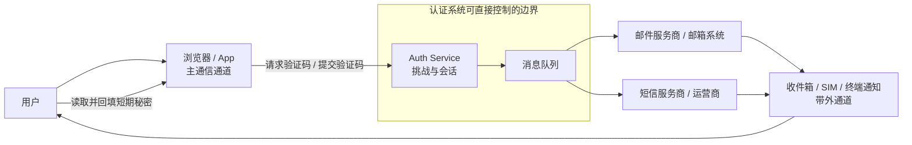
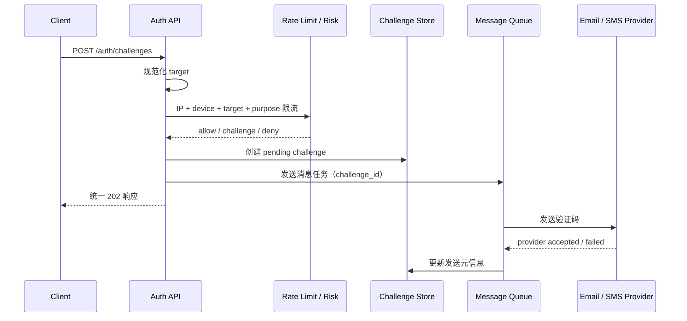
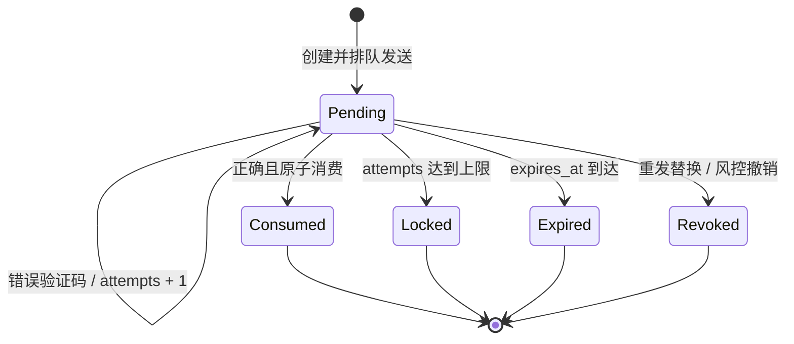
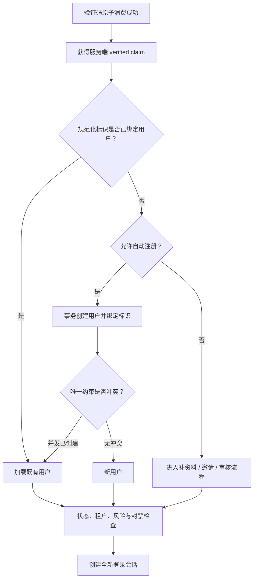
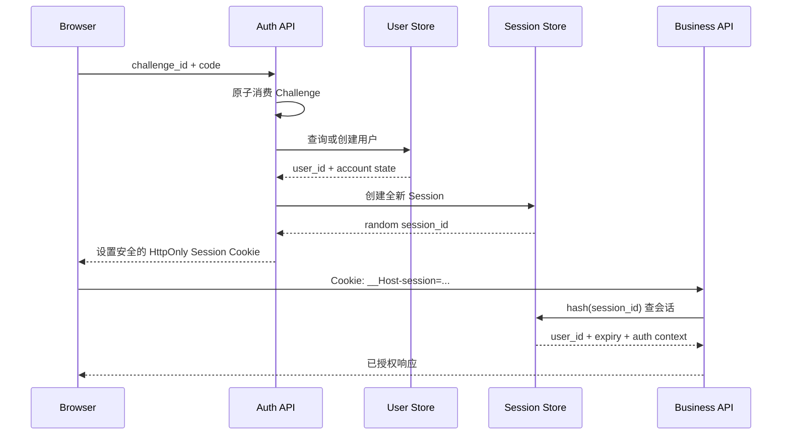
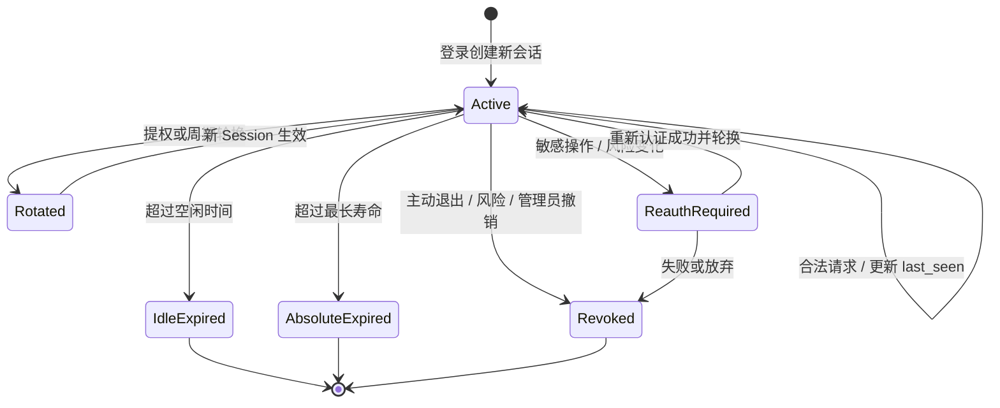
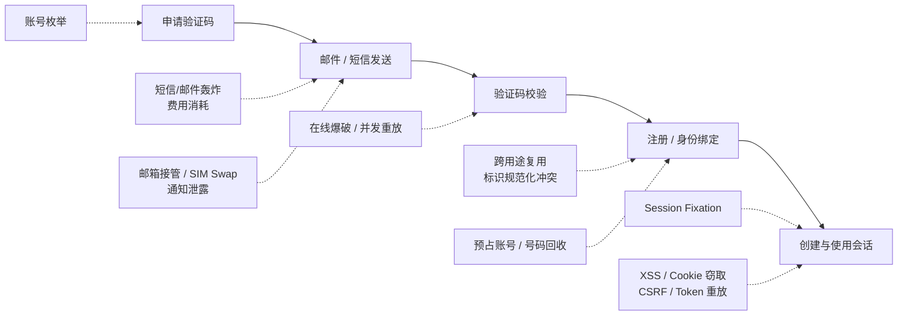
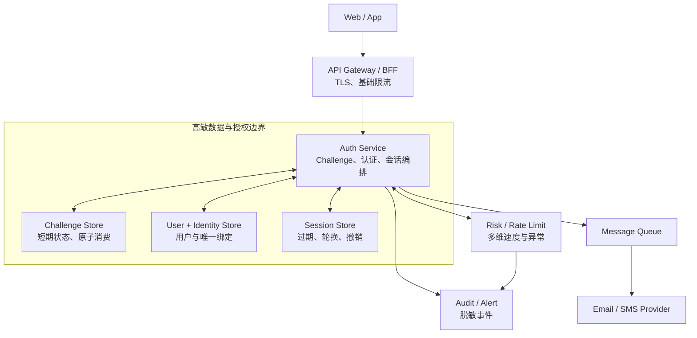

# 邮箱与手机号验证码认证：从一次性挑战到可撤销登录态

> 查证基线：2026-08-01。本文讨论面向普通 Web 与移动应用的邮箱/短信验证码注册和无密码登录。NIST SP 800-63B 的要求面向特定数字身份保证等级，不能机械等同于所有消费产品合规要求，但它为判断认证通道强度提供了清晰基线。

## 核心判断：验证码完成一次认证，Session 才维持登录态

邮箱或短信验证码流程包含两个不能混为一谈的状态机：

1. **一次性挑战（challenge）**回答“当前请求者是否在有限时间内控制这个邮箱或手机号”；
2. **登录会话（session）**回答“后续每个请求应以哪个用户身份执行，以及这份授权是否仍然有效”。

验证码校验成功不会让 HTTP 自动变成“已登录”。服务端还必须创建一个可过期、可轮换、可撤销的会话，并通过安全 Cookie 或客户端 Token 将后续请求关联到该会话。反过来，验证码也不是用户的永久身份：邮箱可能被接管，手机号可能发生 SIM Swap 或被运营商回收，通知内容还可能暴露在锁屏界面。

更重要的是，“验证联系方式”和“使用联系方式认证”具有不同安全语义。OWASP 建议先验证邮箱所有权再启用账号，同时将邮箱视为较弱的认证因素；NIST SP 800-63B 明确不接受邮箱作为带外认证通道，并对公共电话网络承载的短信/语音验证施加额外限制。[OWASP：Email Validation and Verification](https://cheatsheetseries.owasp.org/cheatsheets/Email_Validation_and_Verification_Cheat_Sheet.html) [NIST SP 800-63B：Out-of-Band Authenticators](https://pages.nist.gov/800-63-4/sp800-63b.html#out-of-band-authenticators)

因此，消费应用可以将邮箱或短信验证码作为便利的无密码登录方式，但不应把它描述为抗钓鱼的强认证。涉及支付、修改主认证器、导出敏感数据等高风险操作时，应结合风险信号重新认证，并优先引入 Passkey/WebAuthn 等抗钓鱼认证器。

## 一、先画清信任边界：验证码证明的是通道控制权

下面的图回答“服务端实际上信任了谁”。它是依据 NIST、OWASP 和通信系统常见边界重建的分析图，不是官方架构原图。



服务端直接控制的通常只有挑战生成、存储、校验和发送请求。邮件路由、运营商网络、用户邮箱安全、SIM 卡控制权、终端通知和恶意软件都在外部边界。验证码成功能够支持的最强结论通常是：**某个请求者在挑战有效期内获得了发往该目标地址的短期秘密**。

这并不证明：

- 请求者是现实世界中的特定自然人；
- 当前控制者长期拥有该邮箱或手机号；
- 设备没有被远程控制；
- 邮箱和短信构成独立于主设备的第二因素；
- 此次认证足以授权任何高风险操作。

认证系统应把这些限制编码进 `authentication_method`、`authentication_time` 和风险策略，而不是只保存一个模糊的 `is_logged_in = true`。

## 二、请求验证码：创建的是 Challenge，不是验证码字符串

一个稳健的接口不应只有 `target -> code` 映射。服务端应创建有明确用途、生命周期和消费语义的 Challenge：

```text
POST /auth/challenges
{
  "channel": "email | sms",
  "target": "user@example.com | +8613800000000",
  "purpose": "sign_in",
  "client_request_id": "幂等键"
}

202 Accepted
{
  "challenge_id": "公开随机标识",
  "expires_in": 300,
  "resend_after": 60
}
```

`purpose` 是安全边界，不是分析字段。注册/登录验证码不得被拿去修改手机号、找回账号或确认支付。Challenge 至少需要以下状态：

| 字段 | 作用 | 设计要点 |
| --- | --- | --- |
| `id` | 客户端后续提交的挑战标识 | 使用不可猜测随机值，不能暴露连续数据库 ID |
| `channel` / `purpose` | 约束通道和业务用途 | 校验时必须同时匹配，防止跨用途复用 |
| `target_key` | 查找、唯一性和限流 | 由规范化目标计算受密钥保护的稳定摘要 |
| `target_ciphertext` | 实际发送地址 | 需要时加密存储并限制读取权限 |
| `code_mac` | 校验短验证码 | 使用服务端密钥计算 MAC，不存明文 |
| `expires_at` | 截止时间 | 服务端时间是唯一判断依据 |
| `attempts` / `max_attempts` | 抗在线爆破 | 失败计数必须跨请求、跨会话保存 |
| `status` | `pending/consumed/locked/revoked` | 状态转换必须原子化 |
| `provider_message_id` | 发送追踪 | 发送成功不等于用户实际收到 |
| `created_context` | 风险与审计 | 只保存必要且脱敏的 IP、设备与客户端信息 |

短数字验证码的搜索空间很小。仅使用无密钥哈希并不能防止数据库读取者离线枚举全部可能值；一种工程实现是保存 `HMAC(server_secret, challenge_id || purpose || code)`，把离线猜测的成本绑定到服务端秘密。这里的 HMAC 方案是基于短秘密威胁模型的工程推导，并非 RFC 4226 对短信验证码存储格式的直接规定。服务端秘密应由密钥管理系统托管和轮换。

### 标识规范化先于唯一性判断

邮箱和手机号都不能在业务代码中随手 `lowercase` 或拼接国家码：

- 邮箱域名部分不区分大小写；本地部分的比较策略必须由系统明确规定，不能擅自应用 Gmail 去点、去 `+tag` 等提供商专属规则；
- 原始邮箱用于展示和投递，规范化值用于本系统的一致比较；
- 国际化域名需要统一转换和同形字符风险评估；
- 手机号应由成熟号码库结合明确的地区上下文解析为统一格式；仅靠正则无法判断国家码、有效号段或号码归属；
- 数据库唯一约束必须作用于与登录、注册、找回和账号绑定完全相同的规范化策略。

OWASP 特别强调：不一致的邮箱规范化会导致身份混淆和账号接管；应保存原始值，并定义一套贯穿注册、登录、找回和绑定的比较策略。[OWASP：Email Canonicalization](https://cheatsheetseries.owasp.org/cheatsheets/Email_Validation_and_Verification_Cheat_Sheet.html#email-canonicalization)

### 发送链路应异步，但安全决策必须同步落库



先把 Challenge 写入可信存储，再提交消息任务。队列消费者只通过 `challenge_id` 获取受限数据，日志禁止记录验证码、完整邮箱/手机号或完整验证链接。Provider 返回 “accepted” 只表示接收了发送请求，不能作为邮箱/手机号已验证的证据。

### 防刷不是单个 IP 限流器

RFC 4226 指出短 OTP 天然可被暴力猜测，验证端应保存失败状态并实施节流或锁定，而且限制必须跨登录会话生效。[RFC 4226：HOTP Validation and Throttling](https://www.rfc-editor.org/rfc/rfc4226.html#section-7.3) 对邮件/短信验证码还要限制“发送”本身，否则攻击者可以制造短信费用、骚扰受害者或耗尽供应商额度。

生产系统通常同时观察：

- 单 IP、IP 网段和网络信誉；
- 单设备或浏览器实例；
- 单目标地址与目标所属账号；
- 单 `purpose` 和接口；
- 同一目标被多少来源请求、同一来源请求多少目标；
- 租户、地区、供应商和系统全局预算。

限流结果不只有允许/拒绝，还可以是延迟、要求额外挑战、降低发送频率或进入人工风控。不要在固定次数后永久锁死账号：攻击者可以借此对已知用户实施拒绝服务。[OWASP：Authentication Throttling](https://cheatsheetseries.owasp.org/cheatsheets/Authentication_Cheat_Sheet.html#login-throttling)

### 响应一致只能降低枚举信号，不能消灭侧信道

无论目标是否已注册，都应返回语义接近的响应，例如“如果该地址可用于登录，我们会发送验证码”。但仅统一文案不够：状态码、响应结构、处理时长、重发倒计时和后续页面都可能暴露账号存在性。OWASP 要求认证和找回流程使用通用响应，并避免明显的处理时差。[OWASP：Authentication Responses](https://cheatsheetseries.owasp.org/cheatsheets/Authentication_Cheat_Sheet.html#authentication-responses)

“完全恒定时间”在含外部 Provider 的分布式系统中不现实；更可行的目标是统一公开响应路径、异步发送、避免按账号存在性走显著不同的同步工作，并监控批量枚举行为。

## 三、校验验证码：成功必须是一次原子消费

```text
POST /auth/challenges/{challenge_id}/verify
{
  "code": "123456"
}
```

服务端不能只执行 `code == stored_code`。校验条件至少包括：

- Challenge 存在且属于预期 `purpose`；
- `status == pending`；
- 当前时间未超过 `expires_at`；
- `attempts < max_attempts`；
- 目标和当前业务上下文没有被替换；
- `code_mac` 匹配；
- 成功消费与后续认证授权不可被并发重复执行。

Challenge 的核心状态机如下：



关键不是代码比较，而是 `Pending -> Consumed` 只能成功一次。可以通过带条件的数据库更新、行锁事务或支持 compare-and-set 的存储完成：

```sql
UPDATE auth_challenge
SET status = 'consumed', consumed_at = CURRENT_TIMESTAMP
WHERE id = :id
  AND purpose = 'sign_in'
  AND status = 'pending'
  AND expires_at > CURRENT_TIMESTAMP
  AND attempts < max_attempts
  AND code_mac = :submitted_code_mac;
```

只有影响行数为 1，调用方才获得一次性验证结果。失败计数也需要原子增加；实际实现可能先在事务中锁定记录，再验证 MAC 并更新状态，避免“比较成功”和“标记消费”之间出现竞态。

### 重发验证码有两种合理策略

1. **新码使旧码立即失效**：安全模型简单，但短信/邮件乱序可能导致用户输入刚收到的旧码却失败；
2. **短时间允许多个独立 Challenge**：用户体验更好，但扩大了有效猜测窗口和状态复杂度。

不论采用哪种策略，客户端必须提交 `challenge_id`，服务端必须限制同一目标的活动 Challenge 数量。不要只按手机号查找“最后一个验证码”，这会让并发请求、消息乱序和重放难以定义。

### Challenge 消费后不要直接信任客户端字段

校验成功后，服务端应产生内部的“已验证声明”，包含规范化目标、通道、用途、认证时间和 Challenge ID。它可以在同一数据库事务内直接进入用户决策；如果认证与用户服务跨越不同存储，则可签发极短期、单次使用的 verification grant，并在下游再次原子消费。客户端提交的 `email`、`phone` 或 `user_id` 不能覆盖这个服务端声明。

## 四、注册和登录应该共享一条身份决策链

验证码校验完成后才判断这是注册还是登录，可以避免在请求阶段暴露账号是否存在：



### 两种产品语义

- **自动注册并登录**：一个验证码入口同时服务新老用户。转换路径短，但用户可能在不清楚的情况下创建账号，还要处理预占账号、条款同意和必填资料；
- **先验证再完成注册**：验证码通过后得到短期注册授权，补充条款、用户名或组织信息后才创建用户。状态更多，但账号创建语义清晰。

两种方案的底层身份约束相同：

- `identity(channel, normalized_target)` 必须有数据库唯一约束；
- 创建用户与绑定标识应在同一事务，或采用可恢复的工作流；
- 并发注册发生唯一键冲突时，重新查询既有身份，而不是返回第二个用户；
- API 的幂等键用于重试，不能代替数据库唯一约束；
- 已绑定联系方式的变更是高风险操作，不能复用普通登录验证码流程。

### 手机号不是永久主键

手机号会被运营商回收。长期系统不能把“手机号字符串”当作不可变的人：应保存独立 `user_id`，手机号只是可绑定、可撤销的认证标识。长期未登录、号码变更、运营商风险或敏感操作可以触发额外验证。邮箱也可能更名、被回收或受组织管理员控制，同样不应成为业务表之间的永久外键。

## 五、登录态如何建立：浏览器优先采用不透明 Session Cookie

验证码通过后的典型 Web 登录时序如下：



这里 Cookie 只保存一个高熵、不透明、无业务含义的随机 Session ID；用户身份、权限、认证方式、过期和撤销状态保存在服务端。RFC 10025 定义了 Cookie 的当前状态管理语义及 `Secure`、`HttpOnly`、`SameSite` 和 Cookie name prefix 等机制。[IETF RFC 10025：Cookies](https://www.rfc-editor.org/rfc/rfc10025.html)

推荐的会话记录至少包含：

```text
session_id_hash
user_id
created_at
last_seen_at
idle_expires_at
absolute_expires_at
authentication_time
authentication_method = email_otp | sms_otp | passkey | ...
auth_strength / risk_state
device_label（可选、用户可见）
revoked_at / revoke_reason
```

浏览器拿到原始 Session ID，服务端存其单向摘要，数据库泄露时减少直接重放风险。Session ID 必须由密码学安全随机数生成器产生；不要使用用户 ID、时间戳或可解码业务字段。

### Cookie 属性解决不同问题

```http
Set-Cookie: __Host-session=<opaque-random-id>; Path=/; Secure; HttpOnly; SameSite=Lax
```

- `Secure`：只在安全连接中发送；
- `HttpOnly`：阻止前端脚本通过 `document.cookie` 读取，但不能阻止 XSS 以用户身份发起请求；
- `SameSite`：限制跨站请求携带 Cookie，是 CSRF 的纵深防御；
- `Path=/` 且不设置 `Domain`：配合 `__Host-` 前缀，将 Cookie 收窄到当前主机；
- `Max-Age/Expires`：决定浏览器是否跨重启保留 Cookie，不替代服务端过期检查。

`SameSite=Lax` 通常兼顾从外部链接进入后的登录体验和部分 CSRF 防护；高风险或封闭系统可以评估 `Strict`。跨站前端必须使用 `SameSite=None; Secure` 时，CSRF Token、Origin/Referer 校验和严格 CORS 更重要。OWASP 明确指出 SameSite 通常只是纵深防御，不能在一般部署中替代正规的 CSRF 防护。[OWASP：CSRF Prevention](https://cheatsheetseries.owasp.org/cheatsheets/Cross-Site_Request_Forgery_Prevention_Cheat_Sheet.html#samesite-cookie-attribute)

### 登录成功必须创建或轮换 Session ID

如果匿名访问阶段已经有 Session，验证码认证后不能继续沿用原 ID。攻击者可能预先把自己知道的 Session ID 植入受害者浏览器，等待受害者完成登录，这就是 Session Fixation。认证成功或权限等级改变时应创建新 Session ID，并废弃旧 ID。[OWASP：Renew the Session ID After Privilege Change](https://cheatsheetseries.owasp.org/cheatsheets/Session_Management_Cheat_Sheet.html#renew-the-session-id-after-any-privilege-level-change)

## 六、Session、Access Token 与 Refresh Token 不是同一层的替代品

| 方案 | 客户端持有什么 | 服务端主要状态 | 优势 | 主要代价 |
| --- | --- | --- | --- | --- |
| 服务端 Session | 不透明 Session ID Cookie | 完整会话记录 | 撤销和风险控制直接，适合同源 Web/BFF | 需要共享 Session Store 与容量治理 |
| 短期 Access Token | 有限期 Bearer Token | 密钥、授权与撤销相关状态 | API 边界清晰，适合多资源服务 | 泄露后在有效期内可重放，权限收回不即时 |
| Access + Refresh Token | 短期访问凭证 + 长期续期凭证 | Refresh Token 家族与轮换状态 | 适合移动端、授权服务器和多客户端 | 轮换、重放检测、吊销与安全存储复杂 |
| 自包含 JWT 登录态 | 包含 claims 的签名 Token | 密钥与必要撤销状态 | 资源端可本地校验 | 不是天然无状态；失效、权限变化和密钥轮换更难 |

对同源浏览器应用，服务端 Session + `HttpOnly` Cookie 通常是更简单的默认值：浏览器不需要让 JavaScript 持有长期 Bearer Token，服务端可以立即撤销。BFF 可以在服务端替浏览器持有下游 Access Token，对浏览器仍只暴露 Session Cookie。

当系统确实采用 OAuth Refresh Token 时，RFC 9700 要求公共客户端通过发送者约束或 Refresh Token 轮换来检测重放；新 Token 签发后旧 Token 失效，旧 Token 再次出现意味着同一 Token 家族可能已泄露。[IETF RFC 9700：Refresh Token Protection](https://www.rfc-editor.org/rfc/rfc9700.html#section-4.14)

“JWT 无需数据库”是危险的简化：生产系统仍要处理账号冻结、权限变更、设备退出、Token 撤销、密钥轮换和重放。是否本地验证 claims 是部署决策，不等于不存在登录态生命周期。

## 七、登录态是可撤销的租约，不是永久布尔值



三个超时解决不同问题：

- **空闲超时**限制无人使用但仍存活的会话；
- **绝对超时**限制会话无论是否活跃的最长寿命；
- **轮换周期**减少同一 Session ID 长期暴露，但轮换必须处理并发请求和短暂宽限。

所有过期判断必须由服务端执行。客户端倒计时只改善体验，不能决定授权。OWASP 建议应用同时实现空闲和绝对超时，并提供明确退出；高风险事件后需要重新认证和 Session 轮换。[OWASP：Session Expiration](https://cheatsheetseries.owasp.org/cheatsheets/Session_Management_Cheat_Sheet.html#session-expiration)

需要撤销会话的典型事件包括：

- 用户主动退出或选择“退出其他设备”；
- 主邮箱、手机号、密码或强认证器发生变化；
- 账号冻结、删除、租户移除或高风险权限变更；
- Refresh Token 重放、Session 异常使用或凭证泄露；
- 管理员或风控系统明确撤销。

“修改手机号后旧登录态是否全部失效”不是技术常量，而是风险政策。但系统必须具备按 Session、用户、设备或 Token 家族撤销的能力，才能实施任何政策。

## 八、攻击面贯穿申请、发送、校验和会话



| 风险 | 失败模式 | 主要控制 |
| --- | --- | --- |
| 账号枚举 | 文案、状态码、时间或倒计时暴露账号存在 | 统一响应、异步路径、风控监控 |
| 验证码爆破 | 6 位码可在线枚举 | 尝试上限、递增延迟、跨会话限流、短有效期 |
| 重放 | 同一验证码被并发使用多次 | Challenge ID、原子消费、单用途绑定 |
| 发送轰炸 | 骚扰用户、耗尽费用或供应商额度 | 多维速率与预算、异常检测、必要时额外挑战 |
| 邮箱接管 / SIM Swap | 攻击者控制带外通道 | 认证强度分级、风险再认证、强认证器 |
| 号码回收 | 新号码持有人进入旧账号 | 独立用户 ID、长期未用风险、额外恢复策略 |
| 预占账号 | 攻击者先用受害者标识创建不完整账号 | 验证后创建/激活、绑定唯一约束、账号合并政策 |
| Session Fixation | 登录后沿用攻击者已知 Session | 认证和提权后轮换 Session ID |
| CSRF | 浏览器自动附带 Cookie 执行跨站请求 | SameSite、CSRF Token、Origin 检查、无副作用 GET |
| XSS | 恶意脚本以当前用户权限操作 | 输出编码、CSP、依赖治理；HttpOnly 只降低直接窃取 |
| 日志泄露 | 验证码、Token、PII 写入日志 | 结构化脱敏、字段拒绝列表、最小访问权限 |

验证码认证不应成为修改认证标识或恢复账号的循环依赖：如果用户只凭发往“新手机号”的验证码就能替换旧手机号，那么任何能申请绑定的人都可能接管账号。敏感变更需要验证当前会话、旧认证器或另一个独立恢复通道，并向旧联系方式发送通知。

## 九、推荐的生产边界：把认证做成可审计状态机

下面是本文基于前述规范重建的参考架构，不代表某个官方产品的模块划分：



### 数据所有权

- **Challenge Store**只负责短期挑战及其原子状态，不是用户数据库；
- **User/Identity Store**保存稳定 `user_id` 与可变认证标识的绑定；
- **Session Store**保存持续授权，不能依赖验证码记录判断后续登录；
- **Risk Service**给出风险信号和速率决策，不直接篡改身份事实；
- **Queue/Provider**负责投递，不拥有“验证成功”这一安全状态；
- **Audit**记录谁在何时进行了哪类状态转换，但不记录验证码、Token 或完整 PII。

### 故障语义

- Provider 超时：Challenge 仍可保持 `pending` 或标记发送失败，但不能假装已送达；
- 消息重复：发送任务用 Challenge ID 幂等，重复发送不能创建新的安全状态；
- Auth 服务重试：创建 Challenge、创建用户和创建 Session 分别使用明确幂等键；
- Session Store 不可用：宁可暂时拒绝授权，也不能绕过会话检查；
- 风控服务不可用：根据业务风险选择 fail-closed、降级额度或只允许低风险路径，并记录降级事件；
- 跨区域复制延迟：不能让已消费 Challenge 在另一地区再次成功，安全关键写入需要单主、强一致或可证明的全局原子方案。

## 十、实现检查清单

### Challenge

- [ ] 邮箱和手机号使用统一且有文档的规范化策略。
- [ ] Challenge 绑定 `channel + target + purpose`。
- [ ] 验证码不以明文或可离线枚举的无密钥哈希存储。
- [ ] 有效期、尝试次数和发送次数均由服务端限制。
- [ ] 成功校验是原子、单次消费。
- [ ] 重发、乱序和并发请求的语义明确。
- [ ] 请求响应不会轻易暴露账号是否存在。

### 身份与注册

- [ ] 用户使用独立不可变 `user_id`，邮箱/手机号只是绑定标识。
- [ ] 规范化标识有数据库唯一约束。
- [ ] 用户创建与身份绑定具备事务或可恢复工作流。
- [ ] 自动注册、补资料和条款同意的产品语义明确。
- [ ] 修改标识、账号恢复和普通登录使用不同用途与更强策略。

### 登录态

- [ ] 登录和提权后创建或轮换 Session ID。
- [ ] Session ID 高熵、无业务含义，服务端保存其摘要。
- [ ] Cookie 至少考虑 `Secure`、`HttpOnly`、`SameSite`、`Path` 和 `__Host-`。
- [ ] Cookie 登录配套 CSRF 防护，不能只依赖 SameSite。
- [ ] 服务端执行空闲、绝对和撤销检查。
- [ ] 用户可以查看并终止其他设备会话。
- [ ] 风险事件可触发重新认证或批量撤销。

### 运营与验证

- [ ] 限流覆盖 IP、设备、目标、账号、用途和全局预算。
- [ ] 验证码、Token、完整验证链接和完整 PII 不进入日志。
- [ ] 发送、验证、注册、会话创建与撤销都有脱敏审计事件。
- [ ] Provider 故障、队列重复和跨区域竞态经过演练。
- [ ] 高风险操作不只依赖邮箱或短信验证码。

## 来源审计与适用边界

本文主要使用 NIST 数字身份指南、IETF RFC 和 OWASP Cheat Sheet：

- NIST 用于判断邮箱和 PSTN 带外认证的安全强度及认证器生命周期；
- RFC 4226 用于短 OTP 的在线猜测、失败状态与节流原则；
- RFC 10025 用于 Cookie、SameSite 与 Cookie prefix 的当前协议语义；
- RFC 9700 用于 Refresh Token 轮换与重放检测；
- OWASP 用于邮箱规范化、统一认证响应、Session 生命周期与 CSRF 工程控制。

核心流程和状态机是对这些来源的工程归纳，并非某一规范规定的唯一数据库模型。验证码长度、有效期、重试次数、Session 超时和限流阈值必须根据业务风险、用户群体、供应商延迟和攻击数据确定，本文不提供脱离环境的“安全常数”。本文未实现可运行 Demo，因此 SQL 原子更新、跨服务 verification grant 和跨区域一致性仅完成静态设计审查，没有完成并发或故障注入验证。

主要来源：

- [NIST SP 800-63B：Authentication and Authenticator Management](https://pages.nist.gov/800-63-4/sp800-63b.html)
- [IETF RFC 4226：HOTP](https://www.rfc-editor.org/rfc/rfc4226.html)
- [IETF RFC 10025：Cookies](https://www.rfc-editor.org/rfc/rfc10025.html)
- [IETF RFC 9700：OAuth 2.0 Security Best Current Practice](https://www.rfc-editor.org/rfc/rfc9700.html)
- [OWASP：Authentication Cheat Sheet](https://cheatsheetseries.owasp.org/cheatsheets/Authentication_Cheat_Sheet.html)
- [OWASP：Session Management Cheat Sheet](https://cheatsheetseries.owasp.org/cheatsheets/Session_Management_Cheat_Sheet.html)
- [OWASP：Email Validation and Verification Cheat Sheet](https://cheatsheetseries.owasp.org/cheatsheets/Email_Validation_and_Verification_Cheat_Sheet.html)
- [OWASP：Cross-Site Request Forgery Prevention Cheat Sheet](https://cheatsheetseries.owasp.org/cheatsheets/Cross-Site_Request_Forgery_Prevention_Cheat_Sheet.html)
