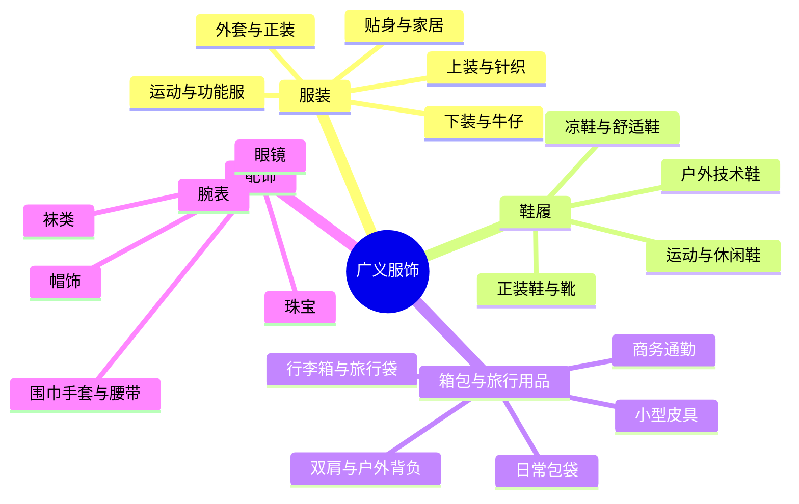

# 广义服饰品类与品牌地图：从服装、鞋履到箱包与配饰

如果只按“男装、女装”逛商场，很容易把性别误当成服饰最重要的分类。换一个角度看，服饰首先是在解决四类任务：覆盖身体、保护和支撑双脚、携带物品，以及装饰或补充整体穿着。由此可以得到一张不依赖性别的地图：**服装、鞋履、箱包与旅行用品、配饰**。

本文采用消费者容易使用的产品分类，而不是宣称存在唯一的行业标准。品牌清单是帮助建立认知坐标的代表性样本，不是完整名录、销量排名或购买推荐。品牌及产品线查证日期为 **2026-09-13**；不同地区官网的在售范围可能不同。

## 先分清三个容易混在一起的维度

一件产品经常同时有三种身份：

1. **产品形态**：它是什么，例如衬衫、夹克、运动鞋、双肩包。
2. **功能与场景**：它解决什么问题，例如保暖、跑步、登山、通勤或正式活动。
3. **风格与市场定位**：它以什么设计语言和商业方式出售，例如基础款、街头、设计师、高端或奢侈。

例如，一件防水硬壳首先是“服装 → 外套”，同时也是户外功能服；一双复古跑鞋首先是鞋履，也可能从运动产品进入日常生活方式市场。本文以**产品形态为主轴**，在需要时补充功能，避免把不同维度硬塞进同一层级。

## 为什么“服饰”没有唯一边界

不同体系是为不同任务设计的，分类结果自然不同：

- [WIPO《尼斯分类》第 25 类（2026 版）](https://nclpub.wipo.int/esen/pdf-download.pdf?classNumber=25&dateInForce=20260101&lang=en&tab=&viewMode=flat)把服装、鞋履和帽饰放在一起，但箱包通常属于[第 18 类](https://nclpub.wipo.int/enfr/pdf-download.pdf?classNumber=18&dateInForce=20260101&lang=en&tab=&viewMode=flat)，珠宝与腕表属于[第 14 类](https://nclpub.wipo.int/esen/pdf-download.pdf?classNumber=14&dateInForce=20260101&lang=en&tab=&viewMode=flat)，眼镜属于[第 9 类](https://nclpub.wipo.int/esen/pdf-download.pdf?classNumber=9&dateInForce=20260101&lang=en&tab=&viewMode=flat)。
- [世界海关组织 HS 2022](https://www.wcoomd.org/en/topics/nomenclature/instrument-and-tools/hs-nomenclature-2022-edition/hs-nomenclature-2022-edition.aspx?p=1)服务于贸易归类：针织服装、非针织服装、皮具箱包和鞋履分别落在第 61、62、42、64 章。它关心材料与报关边界，不是为了教消费者搭配或购物。
- 品牌与零售商的目录又会根据经营方式组织商品。例如帽子既可以与服装并列，也可以放进配饰；钱包既可以算小型皮具，也可以算随身配饰。

因此，本文把“广义服饰”定义为：**人穿着或随身携带、共同构成外观与日常使用系统的服装、鞋履、箱包和配饰**。香水、美妆、家纺、专业防护设备和纯电子设备不纳入主地图；具有装饰属性的眼镜与腕表则纳入配饰。

## 全景地图

阅读这张图时要记住：树形结构只是主归属，不是互斥集合。RIMOWA 以旅行箱建立认知，却也销售包袋和配饰；Cartier 同时横跨珠宝、腕表、眼镜、皮具等类别。跨界本身就是理解品牌的重要信息。

## 服装：直接覆盖身体的穿着产品

服装既可以按廓形分，也可以按材料、工艺和使用场景分。下面优先采用消费者能够观察到的产品形态；“运动”“户外”和“工装”作为功能层补充。

| 子类 | 常见产品 | 代表品牌 | 认识重点 |
| --- | --- | --- | --- |
| 基础上装与衬衫 | T 恤、衬衫、Polo、背心、卫衣 | [UNIQLO](https://www.uniqlo.com/)、[MUJI](https://www.muji.com/)、[Gap](https://www.gap.com/)、[Hanes](https://www.hanes.com/) | 综合基础服装品牌通常依靠稳定版型、颜色和补货构成产品系统，而不是只靠某一件标志性单品。 |
| 针织服装 | 毛衣、开衫、针织背心、高领衫 | [John Smedley](https://www.johnsmedley.com/)、[ERDOS](https://en.erdos.cn/)、[Loro Piana](https://us.loropiana.com/en/)、UNIQLO | “针织”是制造结构；羊毛、羊绒、棉是材料。品牌可能因某种材料建立认知，但两者不能混为一谈。 |
| 下装与牛仔 | 长裤、牛仔裤、短裤、半身裙 | [Levi's](https://www.levistrauss.com/who-we-are/brands/levis/)、[Lee](https://www.lee.com/)、[Wrangler](https://www.wrangler.com/)、[G-Star RAW](https://www.g-star.com/) | Levi's、Lee、Wrangler 可帮助认识以牛仔为核心的品牌；综合服装品牌也普遍销售牛仔和普通下装。 |
| 外套与保暖服 | 风衣、大衣、夹克、羽绒服、棉服 | [Burberry](https://www.burberry.com/)、[Max Mara](https://www.maxmara.com/)、[Bosideng](https://www.bosideng.com/en/)、[The North Face](https://www.thenorthface.com/) | 同为外套，风衣、大衣、羽绒和技术外壳优化的气候、结构和品牌能力不同。Bosideng 官网与品牌材料明确把羽绒服作为核心。 |
| 剪裁与正式服装 | 西装、单西、正装长裤、礼服、正装衬衫 | [ZEGNA](https://www.zegna.com/)、[Brioni](https://www.brioni.com/)、[Canali](https://www.canali.com/)、[Ralph Lauren](https://www.ralphlauren.com/) | 核心不是“属于某个性别”，而是结构化剪裁、面料、场合规范，以及成衣、半定制和定制的差异。 |
| 套装与连体服 | 成套上下装、连衣裙、连体裤、工装连体服 | [Zara](https://www.zara.com/)、[COS](https://www.cos.com/)、Max Mara、Ralph Lauren | 这些产品按结构归类，不按传统性别标签归类；同一种形态可以出现在大众、设计师或奢侈市场。 |
| 内衣与贴身服装 | 内裤、文胸、打底衣、塑形衣、保暖内衣 | [Calvin Klein Underwear](https://www.calvinklein.us/en/underwear)、[Triumph](https://www.triumph.com/)、[NEIWAI 内外](https://neiwai.life/pages/our-story)、Hanes | 这一类更强调贴身材料、支撑、尺寸与舒适。NEIWAI 官方资料显示其从贴身衣物扩展到家居和休闲服。 |
| 睡衣与家居服 | 睡衣、睡袍、家居套装、居家针织 | MUJI、UNIQLO、NEIWAI、[Oysho](https://www.oysho.com/) | 家居服以室内舒适为主要任务；“可以外穿”的设计趋势不会改变它的核心使用场景。 |
| 运动与训练服 | 跑步、球类、训练、瑜伽服装 | [Nike](https://www.nike.com/)、[adidas](https://www.adidas.com/)、[lululemon](https://shop.lululemon.com/)、[ANTA](https://www.anta.com.cn/)、[LI-NING](https://ir.lining.com/en/global/index.php) | 运动品牌往往同时经营鞋履、服装和配饰。ANTA 与 LI-NING 的公司材料都明确覆盖专业及休闲用途的鞋、服装和配件。 |
| 户外技术服装 | 硬壳、软壳、抓绒、保暖层、速干服 | [Patagonia](https://www.patagonia.com/shop/clothing-gear)、[Arc'teryx](https://arcteryx.com/)、The North Face、[Columbia](https://www.columbia.com/) | “户外”是功能系统，不是一种单独廓形。同一件产品仍应继续识别为外套、上装或下装。 |
| 泳装 | 竞速泳衣、训练泳衣、沙滩泳装、防晒衣 | [Speedo](https://us.speedo.com/)、[arena](https://www.arenasport.com/)、[TYR](https://www.tyr.com/) | 竞速、训练与度假泳装的材料、剪裁和认证需求不同，不宜只用外观判断。 |
| 工装与工作服 | 工作夹克、耐磨裤、工装背带裤、制服 | [Carhartt](https://www.carhartt.com/)、[Dickies](https://www.dickies.com/) | 工装原本按劳动保护和耐用性设计；进入日常穿着后形成的“工装风”是风格层，不等于专业工作防护。 |

这里的品牌不是“同一水平的竞品”。例如 UNIQLO 是综合基础服装体系，Levi's 以牛仔建立核心认知，Bosideng 聚焦羽绒服，Patagonia 面向户外服装与装备。把它们放进同一张表，是为了展示**品牌与品类的关系类型**，不是进行质量排名。

## 鞋履：脚部支撑、保护与运动表现

鞋履最容易出现“技术用途”和“生活方式”重叠。同一品牌甚至同一系列，可能既有为运动设计的版本，也有主要用于日常穿着的版本。

| 子类 | 常见产品 | 代表品牌 | 认识重点 |
| --- | --- | --- | --- |
| 专业运动鞋 | 跑鞋、篮球鞋、足球鞋、训练鞋 | Nike、adidas、[ASICS](https://assets.asics.com/system/libraries/4038/ASICS%20Integrated%20report%202024.pdf)、[New Balance](https://www.newbalance.com/)、ANTA、LI-NING | 应继续按运动项目、场地和训练目标细分。“运动品牌”不表示旗下所有鞋都为竞技表现设计。 |
| 生活方式与板鞋 | 复古运动鞋、帆布鞋、滑板鞋、日常球鞋 | [Converse](https://www.converse.com/)、[Vans](https://www.vans.com/)、[Onitsuka Tiger](https://www.onitsukatiger.com/)、New Balance | 许多鞋型源于运动，后来成为日常服饰；分类时应看当前产品目的，而不只看历史来源。 |
| 正装与传统皮鞋 | Oxford、Derby、Loafer、Monk Strap | [Church's](https://www.church-footwear.com/)、[John Lobb](https://www.johnlobb.com/)、[Crockett & Jones](https://www.crockettandjones.com/)、[Clarks](https://www.clarks.com/) | 鞋型、楦型、结构和场合比性别标签更有解释力；Clarks 同时也覆盖大量休闲鞋。 |
| 靴类 | 工装靴、切尔西靴、沙漠靴、户外靴 | [Dr. Martens](https://www.drmartens.com/)、[Timberland](https://www.timberland.com/)、[Red Wing](https://www.redwingshoes.com/)、[Blundstone](https://www.blundstone.com/) | “靴”描述鞋帮高度和结构，工装、户外、正式、时装则是用途或风格。 |
| 凉鞋、拖鞋与舒适鞋 | 凉鞋、洞洞鞋、夹脚拖、软木鞋床鞋 | [BIRKENSTOCK](https://www.birkenstock.com/)、[Teva](https://www.teva.com/)、[Crocs](https://www.crocs.com/)、[Havaianas](https://havaianas.com/) | 这一类从功能凉鞋到生活方式产品跨度很大；BIRKENSTOCK 的官方材料以鞋床系统作为品牌核心。 |
| 户外与技术鞋履 | 越野跑鞋、徒步鞋、登山靴、接近鞋 | [Salomon](https://www.salomon.com/)、[La Sportiva](https://www.lasportiva.com/)、[SCARPA](https://us.scarpa.com/)、[Merrell](https://www.merrell.com/) | 户外技术鞋应根据地形、负重、抓地、支撑和气候选择；它与“户外风格鞋”不是一回事。 |

[ASICS 2024 综合报告](https://assets.asics.com/system/libraries/4038/ASICS%20Integrated%20report%202024.pdf)把 Performance Running、Core Performance Sports、SportStyle、服装与装备分开披露，正好说明“专业运动”和“生活方式”可以存在于同一品牌体系内。

## 箱包与旅行用品：围绕携带方式分类

箱包不必先问“谁背”，而应先问“装什么、怎么背、移动多远”。容量、开口、背负、保护和移动方式比性别更适合作为第一层判断。

| 子类 | 常见产品 | 代表品牌 | 认识重点 |
| --- | --- | --- | --- |
| 日常手提与肩背包 | Tote、手提包、肩背包、斜挎包、水桶包 | [Louis Vuitton](https://en.louisvuitton.com/eng-nl/women/handbags/mini-bags/_/N-td07tlp-bl1qa1wuc)、[Gucci](https://www.gucci.com/)、[Coach](https://www.coach.com/)、[Longchamp](https://www.longchamp.com/)、[Songmont](https://songmontofficial.com/blogs/our-community/a-journey-from-startup-to-now) | 这里按携带结构分，不按传统“男包/女包”分；时装屋、皮具品牌和当代设计品牌都可能覆盖这些形态。 |
| 日用双肩与校园包 | Daypack、电脑双肩包、通勤背包 | [Fjällräven](https://www.fjallraven.com/us/en-us/bags-gear/kanken/kanken-bags/)、[Eastpak](https://www.eastpak.com/)、[Herschel](https://herschel.com/)、[Osprey](https://www.osprey.com/) | 双肩包是背负方式；城市通勤、校园和户外徒步对结构的要求并不相同。 |
| 户外背负系统 | 徒步包、登山包、越野背包、重装包 | Osprey、[Gregory](https://www.gregory.com/)、[Deuter](https://www.deuter.com/)、Arc'teryx | 需要继续看背长、负重、框架、腰带和活动类型，不能只按容量判断。 |
| 商务与通勤携带 | 公文包、电脑包、工作托特、商务双肩包 | [TUMI](https://www.tumi.com/c/bags/)、[Samsonite](https://shop.samsonite.com/)、[Montblanc](https://www.montblanc.com/)、[Bellroy](https://bellroy.com/) | “商务”是任务层；同一任务可以由公文包、托特或双肩结构完成。 |
| 行李箱与旅行袋 | 登机箱、托运行李箱、Trunk、Duffle、衣物袋 | [RIMOWA](https://www.rimowa.com/ww/en/all-products/)、Samsonite、TUMI、[American Tourister](https://shop.americantourister.com/) | 轮组、拉杆、箱体、尺寸规则和售后网络通常比造型分类更重要。RIMOWA 当前目录也已从旅行箱扩展到包袋和配饰。 |
| 小型皮具 | 钱包、卡包、钥匙包、护照夹、小收纳包 | Louis Vuitton、Coach、[Hermès](https://www.hermes.com/)、Bellroy | 小型皮具既能归入箱包体系，也能被视作配饰；本文在箱包下设主归属，在配饰地图中保留交叉关系。 |

[Samsonite 官网](https://shop.samsonite.com/)与[TUMI 当前目录](https://www.tumi.com/c/bags/)同时覆盖行李、商务包、双肩包和旅行袋；[Fjällräven Kånken 目录](https://www.fjallraven.com/us/en-us/bags-gear/kanken/kanken-bags/)则从一个背包家族延伸出电脑包、斜挎包、托特和腰包。由此可见，**品牌系列和产品类别不是一一对应关系**。

## 配饰：补充穿着、身份表达或实用功能

配饰是边界最松的一组。本文纳入与穿着和随身搭配关系密切的类别；如果产品的主要任务变成医疗防护、专业光学或独立电子设备，就应转入其他领域。

| 子类 | 常见产品 | 代表品牌 | 认识重点 |
| --- | --- | --- | --- |
| 帽饰 | 棒球帽、针织帽、贝雷帽、礼帽、遮阳帽 | [New Era](https://www.neweracap.com/)、[Kangol](https://kangol.com/)、[Borsalino](https://www.borsalino.com/)、[Lock & Co.](https://www.lockhatters.com/) | New Era 以运动授权帽款和帽型体系建立认知；传统制帽品牌则更强调毡帽、草帽和正式帽型。 |
| 围巾、披肩与手套 | 丝巾、羊毛围巾、披肩、皮手套、滑雪手套 | Hermès、Burberry、[Hestra](https://www.hestragloves.com/)、[Acne Studios](https://www.acnestudios.com/) | 同一外形可承担装饰、保暖或运动防护；材料与任务决定更细的分类。 |
| 腰带与正装小配件 | 腰带、领带、领结、口袋巾、袖扣 | Hermès、Gucci、[Drake's](https://www.drakes.com/)、[Charvet](https://www.charvet.com/) | 腰带属于穿着固定与装饰，领带和口袋巾属于正装语言；它们不需要按性别建立主目录。 |
| 袜类与腿部服饰 | 日常袜、运动袜、长袜、连裤袜、压缩袜 | [FALKE](https://www.falke.com/)、[Wolford](https://www.wolford.com/)、[Happy Socks](https://www.happysocks.com/)、[Bombas](https://bombas.com/) | 日常、造型、运动和医疗压缩袜应区分；医疗用途超出本文范围。[FALKE 的企业资料](https://www.falke.com/assets/download/31/FALKE-sustainability-statement-EN-3631.pdf)同时覆盖袜类、内衣与服装。 |
| 眼镜 | 太阳镜、光学镜架、运动眼镜、时装眼镜 | [Ray-Ban](https://india.ray-ban.com/sunglasses-clp)、[Oakley](https://www.oakley.com/)、[Gentle Monster](https://www.gentlemonster.com/)、[LINDBERG](https://lindberg.com/) | 镜架可作为服饰配件，但视力矫正、防护等级和镜片参数属于光学与健康问题，不能只按造型选择。 |
| 珠宝与时尚首饰 | 戒指、项链、耳饰、手镯、胸针 | [Cartier](https://www.cartier.com/en-us/home)、[Tiffany & Co.](https://www.tiffany.com/)、[Bulgari](https://www.bulgari.com/)、[Van Cleef & Arpels](https://www.vancleefarpels.com/)、[周大福](https://www.ctfjewellerygroup.com/tc/Media/publications) | 贵重珠宝、商业珠宝和时尚首饰在材料、工艺、稀缺性与渠道上差异很大；本文只标示品类位置，不评价保值。 |
| 腕表 | 机械表、石英表、数字表、运动表、珠宝表 | [Rolex](https://www.rolex.com/)、[Omega](https://www.omegawatches.com/)、[Seiko](https://www.seikowatches.com/)、[Casio](https://www.casio.com/watches/)、[Swatch](https://www.swatch.com/)、[FIYTA 飞亚达](https://store.fiyta.com/collections/all-watches) | 腕表同时具有计时、工程、珠宝和身份表达属性。智能手表以电子平台为核心，本文不把它展开为独立服饰品牌类别。 |

[Cartier 当前官网](https://www.cartier.com/en-us/home)同时列出珠宝、腕表、包袋、眼镜与其他配饰，是综合奢侈品牌跨品类的典型；[New Era 当前官网](https://www.neweracap.com/)则仍以帽饰和具体帽型为目录核心，是专业品类品牌的典型。

## 品牌不是一个维度：用“核心品类”和“覆盖宽度”理解

记住品牌名字之前，先判断它与品类的关系：

| 品牌关系 | 判断方法 | 例子 | 容易产生的误解 |
| --- | --- | --- | --- |
| 核心品类型 | 品牌历史、产品结构和消费者认知长期围绕一类产品 | Levi's—牛仔；Bosideng—羽绒服；New Era—帽饰；Ray-Ban—眼镜 | “以某类为核心”不等于只销售这一类。 |
| 相邻扩展型 | 从一个核心能力扩展到相邻用途或形态 | BIRKENSTOCK 从鞋床与凉鞋扩展到封闭鞋；Fjällräven 从户外背包扩展到服装与装备；RIMOWA 从旅行箱扩展到包袋和配饰 | 新品类存在，不代表已经成为品牌最强认知。 |
| 运动系统型 | 围绕多项运动同时经营鞋履、服装和配件 | Nike、adidas、ANTA、LI-NING | 品牌整体的“专业运动”定位，不能证明每一款产品都是专业比赛装备。 |
| 综合时装型 | 用统一设计语言覆盖成衣、鞋、包与配饰 | Louis Vuitton、Gucci、Burberry、Ralph Lauren | 不能因为品牌覆盖广，就忽略它的历史核心和不同品类的能力差异。 |
| 珠宝与制表型 | 珠宝、腕表和贵重配饰之间形成相邻能力 | Cartier、Bulgari、Van Cleef & Arpels | 腕表的装饰属性与制表技术是两套评价维度。 |

另一个常见误区是把**集团**当成单一产品品牌。LVMH、Kering、ANTA Sports、Samsonite International 都管理多个品牌或业务线；消费者实际购买的是 Louis Vuitton、Gucci、ANTA、TUMI 等具体品牌及其产品。集团资料适合确认品牌组合和业务边界，不能代替具体产品判断。[LVMH Fashion & Leather Goods](https://www.lvmh.com/en/our-maisons/fashion-leather-good)、[Kering 2025 财务文件](https://www.kering.com/api/download-file/?path=Kering_2025_Results_Financial_Document_975124ec5f.pdf)、[ANTA Sports 2025 年报](https://www.hkexnews.hk/listedco/listconews/sehk/2026/0325/2026032500245.pdf)和[Samsonite 公司资料](https://corporate.samsonite.com/)可以用于核对这些集团关系。

## 如何使用这张地图

面对一件陌生产品，可以依次问五个问题：

1. **它的主任务是什么？** 覆盖身体、支撑脚部、携带物品，还是作为搭配补充？
2. **它的产品形态是什么？** 例如硬壳外套、越野跑鞋、商务双肩包或太阳镜。
3. **是否有功能层？** 例如防水、保暖、比赛、登山、正式活动或长途旅行。
4. **品牌与这个品类是什么关系？** 是核心专长、相邻延伸，还是综合品牌目录中的普通一项？
5. **购买时还要单独核对什么？** 尺寸、楦型、材料、维护、耐用性、保修、当地价格和售后都不能由品牌分类代替。

这套顺序比先问“什么品牌最好”更有效，因为“最好”必须依赖具体任务。跑步鞋、礼服鞋和徒步靴没有共享的单一最优标准；通勤背包和托运行李箱也不能用同一套指标比较。

## 边界与未覆盖内容

- **不是穷举目录**：全球、地区和小众品牌数量巨大，本文只选择能解释品类结构的样本。
- **不是质量或销量排名**：官方网页能证明品牌自我定位和当前产品线，不能独立证明质量、市场份额、环保表现或性价比。
- **没有用价格硬分层**：同一品牌内部、不同地区与不同时间的价格跨度很大；“大众、高端、奢侈”只能作为粗略商业语境。
- **不按性别组织**：表中品牌可能在官网使用男、女、儿童导航，但本文不把它们当作产品类别主轴。
- **不展开风格史**：极简、街头、学院、工装、复古、山系等属于另一张“风格地图”，不是本文的产品分类。
- **不替代专业判断**：运动防护、视力矫正、医用压缩与专业劳动防护需要相应标准和专业建议。

如果继续扩展，最有价值的下一步不是再堆更多名字，而是分别建立“服饰风格与亚文化”“材料与工艺”“品牌市场层级”“中国服饰品牌”和“按具体任务选择产品”的专题地图。

## 来源审计

本文使用的证据分为三层：

1. WIPO 尼斯分类和世界海关组织 HS 用于说明正式分类边界；它们不是消费者分类标准。
2. 品牌官网及产品目录用于确认品牌在查证日确实覆盖相应品类；这类来源带有营销立场，不用于证明产品质量或市场领先。
3. 上市公司年报、港交所披露和集团品牌组合用于交叉确认核心业务、品牌组合与跨品类范围。

已完成交叉核验的关键结论包括：服装、鞋履、箱包、珠宝腕表与眼镜在正式体系中分属不同边界；运动品牌可以同时拥有专业运动和生活方式产品；箱包品牌能够横跨行李、商务包和日用包；综合奢侈品牌与专业品类品牌的覆盖宽度不同。

仍然保留的证据限制是：“代表性”没有全球统一指标，本文没有引入市场份额或销量排名；部分品牌官网按地区展示不同目录；品牌产品线会在查证日后变化。因此，品牌样本应被理解为认知入口，而不是永久、完整的行业名录。
