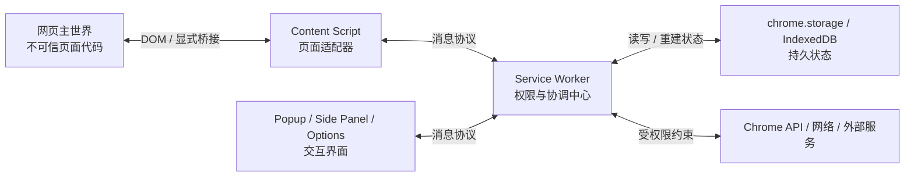
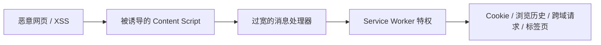

# Chrome Extension：运行时模型、权限边界与架构取舍

> 查证基线：Manifest V3，资料核对于 2026-07-26。Chrome Extension API 持续演进，涉及最低版本的能力应以发布时的官方文档为准。

## 核心判断

Chrome 插件不是“获得了更多 API 的网页”，而是一个部署在浏览器内部的、由多个执行上下文组成的事件驱动系统：

- content script 靠近页面，但处于低信任区；
- service worker 持有主要权限，但生命周期短暂；
- popup、side panel、options、DevTools page 等 UI 各有独立生命周期；
- 各上下文不能依赖共享内存，只能通过消息和持久化状态协作；
- manifest 同时定义能力、攻击面、用户授权和商店审核边界。

因此，真正决定插件质量的通常不是 UI 框架，而是四个设计：**权限是否最小化、消息是否协议化、状态是否可恢复、特权是否被隔离**。

Manifest V3 把长期存活的 background page 改为按需唤醒的 service worker，并禁止执行远程托管代码。官方给出的目标是改善隐私、安全、性能以及用户对插件能力的控制。这不是简单的 API 升级，而是平台把扩展从“常驻且可动态改变的程序”推向“可审查、事件驱动、资源受约束的程序”。[Chrome：Manifest V3](https://developer.chrome.com/docs/extensions/develop/migrate/what-is-mv3)

## 一、先建立正确的运行时模型

一个典型插件跨越页面、浏览器扩展进程和网络栈：



这张图中最重要的不是组件名称，而是边界：

1. 网页不是你的进程，它可以随时导航、刷新、重写 DOM，也可能是恶意的。
2. content script 能操作页面 DOM，但不应成为特权中心。
3. service worker 有较高权限，却不能被视为常驻服务器。
4. UI 页面关闭后其内存状态会消失；side panel 虽可跨标签导航保持，但仍不应成为唯一真相来源。
5. 状态跨上下文传播，本质上是分布式状态同步，而不是普通的模块调用。

### 执行上下文不是代码目录，而是能力边界

| 上下文 | 适合承担的职责 | 关键约束 | 常见误用 |
| --- | --- | --- | --- |
| Service worker | 事件协调、特权 API、跨标签状态、网络访问 | 无 DOM、会被终止、全局变量不可靠 | 当作常驻 Node 服务 |
| Content script | 读取和修改 DOM、监听页面交互、提取页面语义 | 页面不可信、Chrome API 有限、随页面销毁 | 直接持有密钥或开放任意特权调用 |
| Popup | 短时命令面板和即时反馈 | 失焦即关闭，生命周期极短 | 承载长任务或唯一业务状态 |
| Side panel | 与浏览过程并行的持续工作区 | 需要独立状态同步，打开行为受用户动作约束 | 复制一套与后台分叉的状态 |
| Options page | 低频配置和授权说明 | 不是运行时控制中心 | 把动态工作流塞进设置页 |
| DevTools page/panel | 调试器、审计器、面向开发者的工具 | 只在 DevTools 打开时存在 | 假设普通页面场景中可用 |
| Offscreen document | service worker 必须使用的 DOM 能力 | 隐藏、能力受限，主要靠 `runtime` 消息协作 | 伪装成永不关闭的 background page |

content script 默认运行在 isolated world：它能看到并修改页面 DOM，但 JavaScript 全局变量与页面及其他插件隔离。它能直接使用的扩展 API 也有限，更高权限操作通常要通过消息交给其他上下文。[Chrome：Content scripts](https://developer.chrome.com/docs/extensions/develop/concepts/content-scripts)

这个隔离模型提供的是**命名空间与执行环境隔离**，不是完整的业务安全保证。content script 仍然读取攻击者控制的 DOM，也可能处于已被攻陷的渲染进程。因此从它发出的消息必须被当作外部输入，而不是“我方代码发来的可信函数参数”。

## 二、Service Worker 改变了架构的时间观

MV3 的 service worker 通常会在空闲 30 秒后被终止；单次请求处理超过 5 分钟，或 `fetch()` 响应等待超过 30 秒，也可能触发生命周期限制。事件或扩展 API 调用可以重置部分计时器，但官方仍要求系统能承受意外终止。[Chrome：Extension service worker lifecycle](https://developer.chrome.com/docs/extensions/develop/concepts/service-workers/lifecycle)

这意味着：

```text
错误模型：启动一次 → 初始化全局状态 → 永久处理请求

正确模型：事件到达 → 从持久状态重建最小上下文
        → 执行可重试操作 → 原子地记录结果 → 允许进程消失
```

### 把后台逻辑设计成可恢复状态机

service worker 中适合保留缓存，但不能只保留真相。可靠设计至少包含：

- **持久状态**：用户配置、业务实体、任务阶段放入 `chrome.storage` 或 IndexedDB；
- **幂等事件**：同一事件重复到达，不产生重复副作用；
- **显式任务阶段**：长流程记录 `pending/running/succeeded/failed`，而不是依赖闭包中的 Promise 链；
- **可重建索引**：内存 Map 是加速层，可由持久数据重新生成；
- **超时与重试语义**：调用方知道请求是否超时、是否可以安全重发；
- **迁移机制**：`runtime.onInstalled` 处理版本升级，但迁移本身也要可重入。

官方明确说明 service worker 关闭后全局变量会丢失，且 Web Storage API 在其中不可用；可选存储包括 `chrome.storage`、IndexedDB 和 CacheStorage。[Chrome：Extension service worker lifecycle](https://developer.chrome.com/docs/extensions/develop/concepts/service-workers/lifecycle)

这与后端无状态服务有相似之处，但不能机械类比：插件只有一个本地浏览器配置文件，不一定需要远程数据库；真正需要借鉴的是“进程不是状态所有者”，而不是把本地插件过度设计成微服务。

## 三、消息不是函数调用，而是内部协议

Chrome 提供一次性消息和长连接两类机制，连接范围覆盖 service worker、extension pages 与 content scripts。[Chrome：Message passing](https://developer.chrome.com/docs/extensions/develop/concepts/messaging)

把下面这种代码散布在各处：

```js
chrome.runtime.sendMessage({ action: "doSomething", data });
```

短期很快，长期会出现与后端 RPC 相同的问题：字段漂移、无版本、错误不可区分、请求与响应无法关联、权限检查遗漏。更稳妥的协议至少包含：

```ts
type Request =
  | {
      version: 1;
      id: string;
      type: "page.extract-selection";
      payload: { tabId: number };
    }
  | {
      version: 1;
      id: string;
      type: "settings.update";
      payload: { theme: "light" | "dark" };
    };

type Response<T> =
  | { id: string; ok: true; data: T }
  | {
      id: string;
      ok: false;
      error: { code: string; message: string; retryable: boolean };
    };
```

协议设计的重点不是 TypeScript 类型本身，而是运行时约束：

1. 在接收端验证消息结构，静态类型不会验证跨上下文数据。
2. 根据 `sender.id`、`sender.url`、`sender.tab` 和 frame 信息判断来源。
3. 将消息类型映射到固定能力，禁止传入任意 URL、任意脚本或任意 Chrome API 参数。
4. 对高风险动作再次检查授权和当前标签上下文。
5. 为长任务返回任务 ID，不让消息通道承担任务生命周期。
6. 记录结构化错误，而不是只依赖 `runtime.lastError` 或字符串。

Chrome 官方安全指南明确要求把 content script 视为较低信任来源：验证和清理输入、假设返回给它的数据可能泄露给页面，并限制它能触发的特权操作范围。[Chrome：Message passing — Security considerations](https://developer.chrome.com/docs/extensions/develop/concepts/messaging#security-considerations)

## 四、Manifest 是能力声明，也是威胁模型

权限不只是安装时的一段配置，它同时影响：

- 插件能访问哪些浏览器能力和网站；
- 用户会看到哪些授权警告；
- 账号或插件被攻陷后的最大损害；
- Chrome Web Store 的审核与更新体验；
- 架构能否把高风险能力延迟到真正需要时再申请。

Chrome 将权限分成 API 权限、可选 API 权限、content script 匹配范围、host permissions 和 optional host permissions。host permission 可影响跨域请求、敏感 tab 属性、脚本注入以及网络请求控制等能力。[Chrome：Declare permissions](https://developer.chrome.com/docs/extensions/develop/concepts/declare-permissions)

### 权限设计应从用户动作反推

不要先写 `<all_urls>` 再想产品功能，而应从能力链路倒推：

```text
用户动作
  → 需要访问的页面/数据
  → 最小 Chrome API
  → 最小 host 范围与持续时间
  → 是否可使用 activeTab 或 optional permission
```

例如，一个只在用户点击按钮后增强当前页的插件，通常更适合 `activeTab + scripting`，而不是永久获得所有站点权限。`activeTab` 能为当前用户动作授予临时 host 访问；程序化注入则需要 `scripting` 加 host permission 或 `activeTab`。[Chrome：Scripting API](https://developer.chrome.com/docs/extensions/reference/api/scripting)

最小权限不是形式主义。Chrome 的安全建议指出，权限越少，插件被攻陷后可利用的能力也越少；`externally_connectable`、web-accessible resources 和内容安全策略同样应按最小范围声明。[Chrome：Stay secure](https://developer.chrome.com/docs/extensions/develop/security-privacy/stay-secure)

### 把插件视作浏览器中的“高价值代理”

典型攻击链不是只攻击 DOM：



所以安全审查应围绕“非特权输入能否组合成特权行为”展开：

- 是否能让后台请求任意 URL；
- 是否能让后台向任意 tab 注入代码；
- 是否把令牌、历史记录或跨域响应回传给 content script；
- 是否用 `innerHTML`、`eval` 或字符串拼接解释不可信数据；
- 是否把 web-accessible resources 暴露得过宽；
- 是否保护发布账号和更新链路。

MV3 禁止远程托管代码，是在缩小“商店审核后的代码仍可远程改变”这一供应链缺口，但它并不替代依赖审计、构建可复现性和发布账号保护。[Chrome：Manifest V3](https://developer.chrome.com/docs/extensions/develop/migrate/what-is-mv3)

## 五、声明式 API 体现的是控制权转移

Manifest V2 时代，扩展可以在请求关键路径中运行任意逻辑。MV3 更强调 `declarativeNetRequest`：扩展提交规则，由浏览器在网络栈中执行，不必把请求内容暴露给扩展进程。官方明确将其隐私优势描述为“无需拦截并查看请求内容即可修改请求”。[Chrome：declarativeNetRequest](https://developer.chrome.com/docs/extensions/reference/api/declarativeNetRequest)

这是一种通用系统设计取舍：

| 模型 | 优势 | 代价 |
| --- | --- | --- |
| 命令式拦截 | 表达力强，可运行任意上下文逻辑 | 难审计、可能阻塞关键路径、扩大数据可见范围 |
| 声明式规则 | 浏览器可预验证、优化、限制权限和资源 | 表达能力受规则模型与配额约束 |

`declarativeNetRequest` 支持静态、动态和 session 规则：静态规则随包发布，动态规则跨浏览器会话和扩展升级持久化，session 规则会在浏览器关闭或扩展升级时清除。[Chrome：Rules and rulesets](https://developer.chrome.com/docs/extensions/reference/api/declarativeNetRequest#rules-and-rulesets)

不要把声明式模型理解成“阉割后的 API”。它是在安全敏感、性能敏感的共享基础设施上，把任意代码转换成受限数据结构。浏览器、操作系统策略、数据库查询规划和云 IAM 中都能看到类似思想：**牺牲局部表达力，换取全局可分析性和可治理性**。

## 六、UI 形态应服从任务持续时间

插件 UI 不是越多越完整。选择依据应是任务与浏览上下文的关系：

- **Action popup**：几秒内完成的命令、状态查看、一次性触发。不要放会因失焦中断的编辑任务。
- **Side panel**：阅读助手、知识整理、跨页面参考等需要与网页并行且持续存在的工作区。side panel 可配置为跨标签导航保持，并作为 extension page 使用 Chrome API。[Chrome：Side Panel API](https://developer.chrome.com/docs/extensions/reference/api/sidePanel)
- **页面内 UI**：必须与 DOM 元素空间绑定的增强功能。应处理 SPA 导航、DOM 重建、样式隔离和页面 CSP。
- **Options page**：低频设置、账号连接、权限解释。
- **DevTools panel**：网络、性能、组件树、审计等开发者工作流；它的生命周期依附于 DevTools。
- **Offscreen document**：后台确实需要 DOM 能力时的受限执行上下文，不是隐形 UI。service worker 无 DOM，而 offscreen document 只有 `runtime` 扩展 API 可直接使用，协作主要依靠消息。[Chrome：Offscreen API](https://developer.chrome.com/docs/extensions/reference/api/offscreen)

一个简单判断：**任务需要和页面并排多久，用户是否需要看到状态，任务能否在 UI 消失后继续？** 这三个问题比“React 应该挂在哪里”更早决定架构。

## 七、四种常见架构

### 1. 页面增强器

适用：标注、翻译、表单辅助、无障碍增强。

```text
content script = DOM 适配层
service worker = 授权、跨域访问、全局配置
页面内 UI = 与目标元素绑定的局部视图
```

难点是页面变化而不是 API 调用：SPA 路由、虚拟列表、Shadow DOM、iframe、页面自身样式和 CSP 都会破坏天真的选择器方案。应把站点适配器与通用业务核心分开，并把 DOM 观察限制在最小子树。

### 2. 浏览伴侣

适用：阅读研究、AI 助手、书签与知识整理。

```text
side panel = 长时交互与工作集
content script = 当前页面语义采集
service worker = 权限、任务调度、跨标签协调
storage = 会话恢复与本地索引
```

难点是“当前页面”“当前标签”“用户工作集”三种状态不能混为一谈。标签变化是事件，工作集是持久业务状态，side panel 只是其投影。

### 3. DevTools 扩展

适用：框架调试器、网络诊断、性能审计。

DevTools page 负责注册 panel 并连接被检查页面；service worker 处理扩展级能力。不要假设 DevTools 的上下文与普通 extension page 相同，也不要把调试连接当成永久通道。

### 4. 网络策略扩展

适用：拦截、重定向、隐私过滤、请求头策略。

优先判断规则能否表达为 `declarativeNetRequest`。若业务依赖完整响应体、任意异步决策或精确的跨请求状态机，就要承认平台边界，而不是通过隐藏页面或保活技巧模拟旧架构。

## 八、生产故障通常发生在哪里

### 生命周期错觉

症状：开发模式正常，空闲一段时间后状态丢失或监听失效。

根因：初始化逻辑依赖全局变量，或事件监听器不是顶层同步注册。修复方向是持久化、可重入初始化和事件级事务。

### 消息协议漂移

症状：某个 UI 更新后与旧 content script 不兼容，Promise 永不结束，错误只出现在用户浏览器。

根因：把消息当内部函数调用，没有版本、超时、错误码和兼容策略。

### 权限与产品价值不匹配

症状：安装转化低、更新触发新警告、审核变慢。

根因：权限按开发便利性声明，而非按用户可理解的动作申请。

### 页面集成脆弱

症状：目标站小改版即失效，MutationObserver 造成高 CPU，样式污染页面。

根因：业务逻辑与 DOM 结构耦合，没有适配层、观察边界和降级策略。

### 跨上下文状态竞争

症状：popup、side panel 和页面显示不同状态，快速切换标签时响应串线。

根因：多个 UI 都自认为是真相来源，请求没有 tab/frame/版本标识，也没有“最后写入者”之外的冲突语义。

### 本地正常、发布失败

症状：打包后动态导入、Wasm、source map、CSP 或远程代码行为变化。

根因：开发服务器与扩展包的执行约束不同。发布构建必须在 unpacked extension 和接近商店包的条件下测试。

## 九、架构评审清单

在选框架和写页面前，先回答：

1. 哪些输入来自网页或外部来源？它们进入特权区前如何验证？
2. 每项权限对应哪个用户可理解的功能？能否改成 `activeTab` 或可选权限？
3. service worker 在任意 `await` 后被终止，系统能否恢复？
4. 哪些状态是持久真相，哪些只是可丢弃缓存？
5. 消息是否有 schema、版本、关联 ID、超时和结构化错误？
6. 页面导航、iframe、多个 tab 和多个 frame 如何标识？
7. UI 关闭后任务是否继续？结果如何重新订阅？
8. 远程服务不可用、限流或返回恶意数据时，权限边界是否仍成立？
9. 插件更新时，存储、规则和 content script 的版本如何迁移？
10. 是否能解释“如果发布账号或某个依赖被攻陷，最大损害是什么”？

## 十、真正值得掌握的精髓

Chrome 插件开发把几类高级工程问题压缩到了一个小型应用中：

- **操作系统式能力安全**：manifest 和 permissions 类似 capability system，不应退化为全局管理员权限。
- **分布式系统式状态管理**：多个生命周期不一致的上下文通过消息协作，必须考虑重试、乱序、版本和恢复。
- **事件溯源式后台设计**：service worker 的短生命周期迫使业务从“常驻对象”转向“事件 + 持久状态”。
- **声明式治理**：平台把部分任意代码收敛成可审查、可限额、可优化的规则。
- **零信任式边界**：content script 是接近攻击面的适配器，不是可信内网。

掌握这些模型后，换 UI 框架、构建工具或某个 Chrome API 只是局部变化。反过来，如果仍把插件理解为“popup + background.js + content.js 三个文件”，功能越复杂，生命周期、安全和状态问题越会以偶发故障的方式回来。

## 延伸阅读

- [Chrome Extensions 开发文档](https://developer.chrome.com/docs/extensions/develop)
- [Manifest V3 的目标与变化](https://developer.chrome.com/docs/extensions/develop/migrate/what-is-mv3)
- [Extension service worker 生命周期](https://developer.chrome.com/docs/extensions/develop/concepts/service-workers/lifecycle)
- [Content scripts 与 isolated world](https://developer.chrome.com/docs/extensions/develop/concepts/content-scripts)
- [消息通信及其安全边界](https://developer.chrome.com/docs/extensions/develop/concepts/messaging)
- [权限声明模型](https://developer.chrome.com/docs/extensions/develop/concepts/declare-permissions)
- [Chrome Extension 安全建议](https://developer.chrome.com/docs/extensions/develop/security-privacy/stay-secure)
- [Declarative Net Request API](https://developer.chrome.com/docs/extensions/reference/api/declarativeNetRequest)
