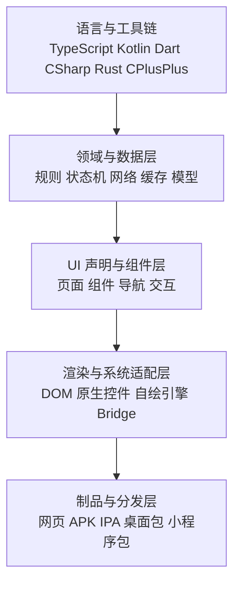
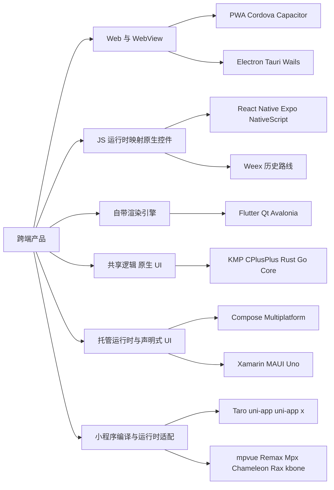
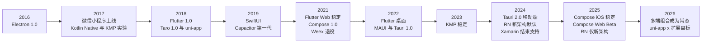
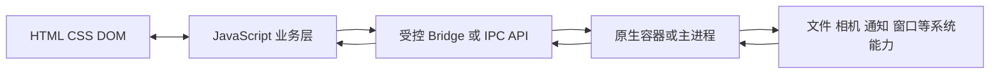
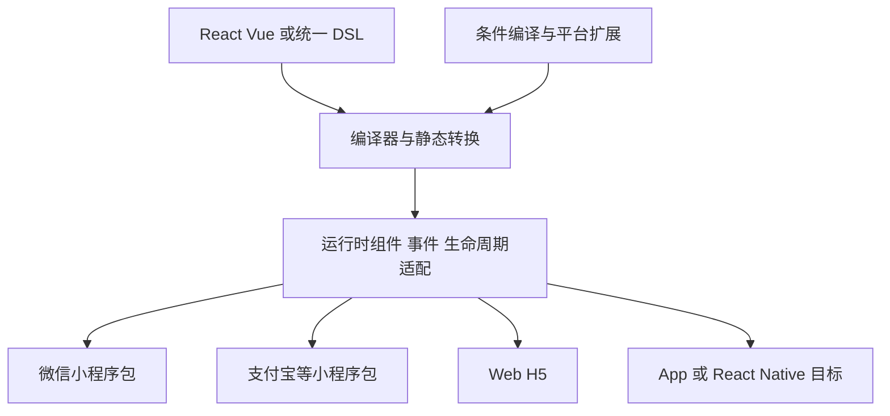
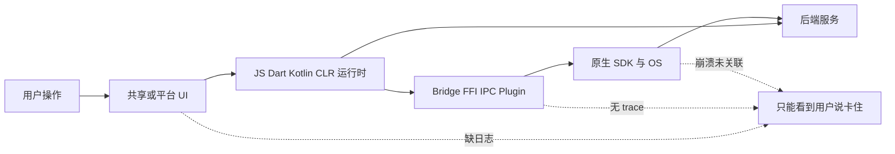
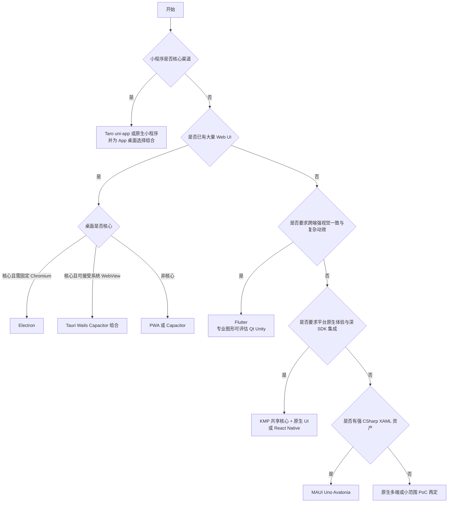

# 跨端应用开发：Android、iOS、PC 与小程序的十年演进与工程取舍

“一套代码运行所有端”是跨端领域最耐用、也最容易误导人的口号。Android、iOS、Web、Windows、macOS、Linux 和各家小程序并不是七个尺寸不同的屏幕，而是多组彼此独立的运行时、UI 体系、系统能力、分发规则和生命周期。真正可持续的跨端架构，很少复用所有东西；它会有意识地选择复用业务规则、数据协议、状态机、设计语言或部分 UI，并为无法抹平的平台差异保留出口。

本文覆盖约 2016—2026 年形成或重塑行业格局的主要路线。PC 同时指浏览器中的 Web/PWA 与 Windows、macOS、Linux 桌面程序；“小程序”主要指微信小程序及同类宿主平台。文中也纳入 React Native for Web、Electron 包装 Web、Taro 转 React Native 等组合路线，因为真实项目的覆盖面通常来自技术组合，而不是单一框架。

先给出结论：

- 没有一种技术在 Android、iOS、Web、三大桌面系统和多家小程序上都提供同等级、同语义、同成熟度的官方支持。
- **最广的名义覆盖**不等于最低的总成本。平台差异只是从业务仓库转移到了框架适配层、插件、条件编译、发布流水线和测试矩阵。
- WebView 路线优先复用 Web 资产；React Native 一类路线优先复用声明式 UI 与业务代码；Flutter 一类自绘路线优先复用像素和交互实现；Kotlin Multiplatform（KMP）优先复用业务内核。它们优化的不是同一个目标。
- 小程序不是“小号浏览器”。它有宿主定义的组件、API、包结构和审核分发机制。Web、App、桌面即使已经统一，小程序通常仍需编译器适配或独立表现层。
- 对大型长期产品，最稳健的目标通常是“共享内核 + 分层 UI + 平台适配器 + 契约测试”，而不是追求一个仓库里不存在任何平台分支。

本文把官方定义、历史事实与工程推论分开。支持状态查证日期为 **2026-09-13**；“官方稳定”“Beta”“社区维护”等词只描述来源中的支持承诺，不自动证明某个业务在真实设备上的性能和质量。

## 先拆开“跨端”：到底复用了什么

跨端讨论经常把“同一种语言”“同一套 UI”和“同一个安装包”混为一谈。至少应区分五层：



### 五层复用具有不同价值

| 层级 | 可复用内容 | 常见收益 | 容易被忽略的代价 |
| --- | --- | --- | --- |
| 语言与工具链 | 语言、包管理、Lint、构建脚本 | 降低认知切换和基础设施数量 | 同语言不代表库、线程模型、调试器和 ABI 相同 |
| 领域与数据层 | 模型、验证、同步、权限规则、状态机 | 保证业务语义一致，通常最耐久 | 存储、网络、加密和生命周期仍需平台端口 |
| UI 声明与组件层 | 页面树、组件、导航、表单 | 直接减少界面重复实现 | 平台交互规范、无障碍、输入和窗口模型开始分叉 |
| 渲染与系统适配层 | DOM、原生控件映射、Skia/Impeller 等引擎、Bridge | 决定视觉一致性与能力边界 | 性能、安全、插件和框架升级风险集中于此 |
| 制品与分发层 | 签名、打包、更新、商店元数据 | 统一发布流程 | 最难真正统一；每个平台仍有独立规则和证书 |

因此，下面四句话含义完全不同：

1. “Android 和 iOS 都用 Kotlin”只证明语言可共享。
2. “Android 和 iOS 共享网络与状态机”证明业务逻辑可共享。
3. “Android、iOS、Web 共用组件源码”证明 UI 声明部分可共享。
4. “所有端长得一样”描述视觉结果，不能反推出运行时或代码复用方式。

评价方案时应记录每一层的复用比例和例外，而不是只报一个模糊的“代码复用率”。自动生成的绑定、测试夹具和平台适配代码也可能抬高行数，却没有相同的维护价值。

## 六大技术家族：差异首先发生在渲染边界



### 家族一：Web/PWA 与 WebView 容器

代表技术包括：

- 浏览器与可安装的 Progressive Web App（PWA）；
- Apache Cordova、Ionic、Capacitor 等移动端 WebView 容器；
- Electron、NW.js、Tauri、Wails、Neutralinojs 等桌面容器；
- 原生应用中的局部 WebView、微前端页或服务端驱动页面。

共同点是 UI 主要由 HTML、CSS、DOM 和浏览器排版绘制。容器负责窗口、生命周期和系统能力，特权调用通过 JavaScript Bridge、进程间通信（IPC）或插件进入原生侧。PWA 的安装条件和体验受浏览器与操作系统影响；它不是一个完全等价的原生包格式。[web.dev 的 PWA 安装说明](https://web.dev/learn/pwa/installation)

### 家族二：JavaScript 运行时映射原生控件

代表技术包括 React Native、Expo、NativeScript，以及历史上的 Weex。JavaScript/TypeScript 负责组件状态和声明，框架把组件树提交给平台视图、原生模块或新架构中的 C++ 核心。React Native 的 Fabric 渲染器仍然操作宿主平台视图，并不是把 React DOM 塞进 WebView。[React Native Fabric 官方说明](https://reactnative.dev/architecture/fabric-renderer)

这条路线的核心价值是共享 React/JS 工程模型，同时保留较强的平台 UI 接入能力；代价是框架组件语义、原生实现和 JavaScript 生态之间存在三方版本矩阵。

### 家族三：自带渲染引擎或跨平台控件体系

代表技术包括 Flutter、Qt Quick、Avalonia；Unity 也属于自带引擎，但更适合游戏、3D 和强视觉互动，不应被当作一般信息应用的默认选择。

Flutter 将框架、渲染和平台嵌入层组织成分层体系，UI 大部分由自身渲染管线绘制，而不是把每个 Widget 映射为 UIKit 或 Android View。[Flutter 架构概览](https://docs.flutter.dev/resources/architectural-overview) Qt Quick 和 Avalonia 的具体实现不同，但同样强调跨平台控件或自有渲染抽象。它们更容易得到一致像素和动画，也必须自己承担文本、输入、无障碍、平台观感与引擎升级成本。

### 家族四：共享业务内核，保留原生 UI

代表技术是 Kotlin Multiplatform，也包括 C++、Rust 或 Go 编写的跨平台核心，通过 Objective-C/Swift、JNI/JVM、C ABI、WebAssembly 等边界暴露给各端。

KMP 的核心技术并不要求共享 UI：可以共享模型、网络、数据库和领域规则，同时在 iOS 使用 SwiftUI、Android 使用 Jetpack Compose，在 Web 和桌面采用各自表现层。[Kotlin Multiplatform 官方说明](https://kotlinlang.org/multiplatform/) 这条路线牺牲一部分 UI 复用，换取平台体验、渐进迁移和组织解耦。

### 家族五：托管运行时与跨平台声明式 UI

代表技术包括 Compose Multiplatform、Xamarin.Forms → .NET MAUI、Uno Platform。它们在语言、运行时、UI 抽象和原生绑定之间形成完整工具链：

- Compose Multiplatform 建立在 KMP 之上，可选择共享 UI；截至查证日，Android、iOS、Desktop UI 为 Stable，Web/Wasm UI 为 Beta。[Kotlin 官方平台稳定性表](https://kotlinlang.org/docs/multiplatform/supported-platforms.html)
- .NET MAUI 用 C#/.NET 共享 Android、iOS、macOS（Mac Catalyst）和 Windows 应用；Linux 与浏览器不是同等级的 MAUI 官方目标。[.NET MAUI 官方概览](https://learn.microsoft.com/en-us/dotnet/maui/what-is-maui?view=net-maui-10.0)
- Uno Platform 以 WinUI 风格 API 覆盖移动、桌面与 WebAssembly，但要区分 Uno 自身支持与微软 WinUI 的原生支持范围。[Uno Platform 官方介绍](https://platform.uno/docs/articles/intro.html)

### 家族六：小程序编译器与宿主运行时适配

代表技术包括 Taro、uni-app、uni-app x，以及不同阶段出现的 mpvue、Remax、Mpx、Chameleon、Rax、kbone 等。它们通常把 Vue/React/自定义 DSL 转换为各家小程序模板、样式、脚本和配置，再以运行时适配组件、事件、生命周期和 API。

这条路线不是把浏览器装进小程序，而是把一套上层编程模型投影到多个宿主协议。W3C MiniApp 材料把小程序描述为依托宿主、包含视图层与逻辑层、具有独立生命周期和包结构的应用形态；相关工作后来以 Community Group Note 保留，不应误称为获得 W3C 标准背书。[W3C MiniApp White Paper](https://www.w3.org/TR/mini-app-white-paper/)

## 2016—2026：从“包一层 Web”到主动选择共享边界

跨端并非线性地由旧框架升级到新框架。十年变化可以概括为三条并行趋势：

1. Web 容器从“任意插件都能桥接”的便利，转向更显式的权限、IPC 和安全边界。
2. 原生映射与自绘框架从桥接性能竞争，转向新渲染架构、声明式 UI、桌面/Web 扩张和工程稳定性。
3. 团队从“共享全部 UI”回到“按层共享”，KMP、Rust 核心和服务契约成为第二条主线。



### 2015—2016：背景切换与 Electron 成熟

React Native 在 2015 年公开，延续了 React 声明式 UI，但把宿主从 DOM 换成移动平台视图；它为随后十年的“共享编程模型，不必共享渲染器”奠定了典型范式。[Meta 工程博客的 React Native Android 发布说明](https://engineering.fb.com/2015/09/14/android/react-native-for-android-how-we-built-the-first-cross-platform-react-native-app/)

2016 年 Electron 1.0 发布，把 Chromium 与 Node.js 一同分发的桌面路线推入稳定阶段。[Electron 1.0 发布公告](https://www.electronjs.org/blog/electron-1-0) 它解决了桌面端浏览器版本碎片和系统能力接入，也把运行时体积、内存和主进程安全变成应用自己的责任。

### 2017：小程序成为新终端，Kotlin 开始跨出 JVM

微信小程序于 2017 年初正式上线，随后多家超级应用形成各自的小程序协议。它让“跨端”不再只是 Android/iOS 与 Web，而增加了宿主组件、包体、审核和 API 兼容层。[腾讯对小程序 2017 年推出的回顾](https://www.tencent.com/zh-cn/wechat-mini-programs-showcases-new-capabilities-to-celebrate-its-third-anniversary/)

同年 Kotlin/Native 发布技术预览，Kotlin 1.2 Beta 开始展示跨平台项目模型；当时应称实验性探索，而不是把 2023 年后的稳定性倒推到 2017 年。[Kotlin/Native 技术预览](https://blog.jetbrains.com/kotlin/2017/04/kotlinnative-tech-preview-kotlin-without-a-vm/)、[Kotlin 1.2 Beta 多平台说明](https://blog.jetbrains.com/kotlin/2017/09/kotlin-1-2-beta-is-out/)

### 2018：Flutter、Taro、uni-app 建立两种新主线

Flutter 1.0 于 2018 年 12 月发布，Dart + Widget + 自有渲染管线成为移动端 UI 高复用的代表。[Flutter 1.0 发布回顾](https://flutter.dev/blog/flutter-1-0-launch-wrap-up)

同年 Taro 1.0 发布，强调以 React 语法生成多端代码；uni-app 也在 2018 年进入公开发布阶段，以 Vue 语法和统一 API 覆盖 App、H5 与小程序。[Taro 1.0 发布说明](https://docs.taro.zone/en/blog/2018-09-18-taro-1-0-0)、[DCloud 的 uni-app 早期发布说明](https://ask.dcloud.net.cn/article/13527) 这一阶段的核心矛盾是：编译期转换可以减少运行时，但上层语法越动态，静态转换越难完整保持语义。

### 2019—2020：原生声明式 UI 兴起，混合容器重整

Apple 在 2019 年发布 SwiftUI，Android 的 Jetpack Compose 随后发展。原生平台自己转向声明式 UI，削弱了“只有跨端框架才有声明式开发体验”的差异，也让共享逻辑 + 原生声明式 UI 变得更有吸引力。[Apple SwiftUI 2019 发布信息](https://developer.apple.com/news/?id=06032019b)

Capacitor 在 2019 年发布第一代，Ionic 将其定位为更现代的原生运行时和 Cordova 后继路线；它保留 Web UI，又把插件、项目结构和原生工程作为一等公民。[Ionic 对 Capacitor 演进的说明](https://ionic.io/resources/articles/building-cross-platform-apps-with-capacitor) 这不是 WebView 性能问题的自动消失，而是工程集成模型的重构。

### 2021：Web 与声明式 UI 扩张，Weex 进入历史阶段

Flutter Web 于 2021 年 3 月进入 stable channel，说明 Flutter 从移动框架转向多平台 UI 工具包。[Flutter Web 稳定版公告](https://flutter.dev/blog/flutter-web-support-hits-the-stable-milestone) Jetpack Compose 1.0 同年发布，Android 原生声明式 UI 进入稳定阶段。[AndroidX Compose Compiler 发布记录](https://developer.android.com/jetpack/androidx/releases/compose-compiler)

Apache Weex 孵化项目在 2021 年退役。它曾代表 Vue/JS 驱动原生渲染的路线，但项目退役说明“技术曾可用”与“生态可持续”是两项独立指标。[Apache Incubator Weex 项目状态](https://incubator.apache.org/projects/weex.html)

### 2022：桌面与轻量容器成为竞争中心

Flutter 3 在 2022 年补齐 macOS 与 Linux 稳定支持，加上已有 Windows，形成移动、Web、桌面的官方多平台版图。[Flutter 发布档案](https://docs.flutter.dev/release/archive-whats-new)

.NET MAUI 于 2022 年正式可用，作为 Xamarin.Forms 的演进，统一项目结构并覆盖 Android、iOS、macOS 与 Windows。[.NET MAUI 正式发布公告](https://devblogs.microsoft.com/dotnet/introducing-dotnet-maui-one-codebase-many-platforms/) Tauri 1.0 同年发布，使用系统 WebView + Rust 后端，形成区别于“捆绑 Chromium + Node.js”的桌面容器取舍。[Tauri 1.0 发布公告](https://v2.tauri.app/blog/tauri-1-0/)

### 2023：Kotlin Multiplatform 从实验路线进入 Stable

JetBrains 在 2023 年 11 月宣布 Kotlin Multiplatform Stable。稳定的是核心多平台技术与兼容承诺，不等于当时所有 UI 目标、库和工具链都同时稳定。[Kotlin Multiplatform Stable 公告](https://blog.jetbrains.com/kotlin/2023/11/kotlin-multiplatform-stable/)

这一区分非常重要：共享业务逻辑的成熟度、Compose Multiplatform 的各目标成熟度、具体数据库/网络库的支持度，必须分别核对。

### 2024：移动与桌面框架都重做边界

Tauri 2.0 于 2024 年 10 月稳定发布，把 Android 与 iOS 纳入官方目标，并引入更细的 capabilities 权限模型。[Tauri 2.0 发布公告](https://v2.tauri.app/zh-cn/blog/tauri-20/)

React Native 0.76 在同月默认启用 New Architecture。新架构以 JSI、Fabric、TurboModules 和 Codegen 重塑 JavaScript 与宿主之间的接口，目标包括同步访问、类型化接口和并发 React 能力；它并不让所有旧原生模块自动兼容。[React Native 0.76 公告](https://reactnative.dev/blog/2024/10/23/release-0.76-new-architecture)、[New Architecture 说明](https://reactnative.dev/blog/2024/10/23/the-new-architecture-is-here)

Xamarin 官方支持于 2024 年 5 月结束，现有项目需要评估迁移 .NET MAUI，而不是把 Xamarin 当作新的选型。[微软 Xamarin → MAUI 迁移说明](https://learn.microsoft.com/en-us/dotnet/maui/migration/)

### 2025—2026：稳定性不再是框架级标签，而是平台级矩阵

Compose Multiplatform 1.8.0 在 2025 年宣布 iOS 目标 Stable，1.9.0 又把 Web/Wasm 推进到 Beta。[Compose Multiplatform iOS Stable 公告](https://blog.jetbrains.com/kotlin/2025/05/compose-multiplatform-1-8-0-released-compose-multiplatform-for-ios-is-stable-and-production-ready/)、[Compose Multiplatform Web Beta 公告](https://blog.jetbrains.com/kotlin/2025/09/compose-multiplatform-1-9-0-compose-for-web-beta/) React Native 0.82 在 2025 年成为只运行 New Architecture 的版本，旧架构开关不再生效。[React Native 0.82 公告](https://reactnative.dev/blog/2025/10/08/react-native-0.82)

到 2026 年，uni-app x 官方兼容矩阵列出 Web、微信小程序、Android、iOS 与 HarmonyOS，并在页面与 API 级别记录版本差异；“框架支持某平台”不能替代逐组件、逐 API 检查。[uni-app x 兼容性表格导读](https://doc.dcloud.net.cn/uni-app-x/tutorial/compatibility.html) 官方材料同时包含厂商性能主张，本文不把这些主张当作独立基准结论。

十年的真正转向不是终于出现“万能框架”，而是支持声明越来越细：从框架名，细化到平台、架构代际、渲染模式、组件、API、插件和目标操作系统版本。

## Web、PWA、WebView：最大化已有 Web 资产

### 一条请求实际经过哪些边界



Bridge 不应是一个允许前端任意执行原生代码的后门，而应是一组版本化、最小权限、可验证的消息接口。例如 `pickFile()` 可以返回受限的文件句柄或复制后的临时文件，不应默认暴露任意路径读写。

### PWA

PWA 最接近“一份 Web 直接覆盖手机与 PC 浏览器”：响应式 UI、Web App Manifest、Service Worker、离线缓存和浏览器能力 API 可以提供可安装体验。它的优势是 URL 分发、即时更新、搜索与链接能力，以及无需维护多个 UI 运行时。

它的边界也最明确：

- 能力、安装入口、后台执行、通知、文件和窗口集成取决于浏览器与操作系统组合；
- App Store/企业分发、深层系统集成和长时间后台任务不一定满足产品要求；
- 小程序宿主不会因为页面是 PWA 就自动获得小程序包、组件和 API；
- 离线能力来自明确的缓存与同步设计，不是加一个 Service Worker 就自动成立。

适合内容、表单、协作、管理后台、轻量工具和以链接到达为核心的产品。若关键价值依赖蓝牙后台扫描、持续定位、复杂音视频管线或系统级扩展，应先用目标浏览器能力矩阵验证。

### Cordova、Ionic 与 Capacitor

这类容器将 Web 应用放入 Android/iOS 原生壳，使用插件访问相机、文件、通知等能力。Ionic 更偏 UI 组件与开发体验，Cordova/Capacitor 更接近运行时与插件边界，不能把三者当作互斥的同层产品。

优势：

- 对成熟 Web 团队和已有 Web 产品迁移最快；
- DOM、CSS、前端测试、包生态和页面代码可高比例复用；
- 常规表单、内容、交易流程通常足够自然；
- 原生工程仍可加入自定义插件或原生页面。

缺点：

- 大列表、复杂手势、重动画、视频合成等场景容易触及 WebView 和主线程边界；
- 插件不只是“有没有”，还涉及目标版本、隐私声明、线程、权限和维护者活跃度；
- Web 页面生命周期与移动 App 前后台、进程回收、权限回调并不一致；
- Web 调试通过不能证明原生容器、系统 WebView 版本和真实设备通过。

Capacitor 把 iOS/Android 工程视为可维护资产，适合需要偶尔下沉原生的团队；已有 Cordova 项目则应以插件可迁移性和真实行为为单位评估，不应仅因技术代际名称而整体重写。[Capacitor 官方文档](https://capacitorjs.com/docs)

### Electron、Tauri、Wails 与轻量桌面壳

Electron 捆绑 Chromium 和 Node.js，渲染版本一致、Web 兼容性可控、Node 生态丰富。每个窗口有 renderer，单一 main process 管理窗口与生命周期，preload + `contextBridge` 应作为受控能力面。[Electron 进程模型](https://www.electronjs.org/docs/latest/tutorial/process-model)

它的主要优势是：

- 复杂 Web 应用可以较低成本获得 Windows/macOS/Linux 桌面包；
- Chromium 行为一致，调试与前端生态成熟；
- 托盘、菜单、自动更新、协议唤起、多窗口等桌面能力有成熟方案。

主要缺点是：

- 每个应用携带浏览器运行时，安装体积和内存基线通常高于系统 WebView 容器；
- main process、renderer、preload 和 IPC 组成新的安全边界；
- Node 集成、远程内容、宽泛 IPC 和不同步的依赖更新会放大攻击面；
- “页面流畅”不代表主进程未阻塞；同步 I/O 或同步 IPC 可以冻结整个应用。[Electron 性能指南](https://www.electronjs.org/docs/latest/tutorial/performance)

Tauri 2 使用系统 WebView 渲染前端，以 Rust 核心和 commands/plugins 访问系统能力，并覆盖桌面与移动。它常带来更小的分发基线，但必须接受不同 OS WebView 版本、Rust/前端双栈、插件覆盖度与平台调试差异。不能把“系统 WebView”简单推导成所有应用都比 Electron 更快或更省内存；页面内容、进程模型和测量方式仍决定结果。

Wails 用 Go 后端配合系统 WebView，Neutralinojs 追求更轻量的宿主；它们适合团队语言和能力模型匹配的工具型应用，但生态、插件、更新和边缘平台支持需要逐项核验。桌面框架选择的关键不是安装包排行榜，而是：是否需要固定浏览器内核、是否能承受系统 WebView 差异、原生能力由谁维护，以及安全更新能否及时进入发布流程。

## React Native、Expo 与 NativeScript：共享声明式模型，接入宿主 UI

### React Native 的“Native”究竟指什么

React Native 组件不是 HTML 元素；`View`、`Text`、`ScrollView` 等由宿主平台实现。JavaScript 线程负责 React 逻辑，原生模块处理系统能力；New Architecture 通过 JSI、Fabric、TurboModules 和 Codegen 减少旧异步 Bridge 的限制并提供更明确的接口。[React Native 架构概览](https://reactnative.dev/architecture/landing-page)

这并不保证：

- 同一个组件在 Android 与 iOS 上像素完全一致；
- 任意 npm Web 包能直接运行；
- 所有原生库已经兼容当前 React Native 和 New Architecture；
- JavaScript 逻辑繁忙时 UI 和交互不受影响。

### Expo 解决的是产品化工具链，不是另一套渲染器

Expo 建立在 React Native 上，提供模块、开发客户端、路由、构建与更新服务等更完整的工作流。它显著降低原生配置和交付门槛；需要特殊原生 SDK 时，可以使用 development build/config plugin 或进入原生工程，而不是把 Expo 简化为“不能写原生”。

Expo 可配合 React Native for Web 共享 Web 入口；React Native Windows 和 React Native macOS 则由微软等生态维护，支持等级与核心 Android/iOS 不同。[Expo Web 工作流](https://docs.expo.dev/workflow/web/)、[React Native for Web](https://necolas.github.io/react-native-web/docs/multi-platform/)、[React Native Windows](https://microsoft.github.io/react-native-windows/)、[React Native macOS](https://microsoft.github.io/react-native-macos/docs/intro)

### NativeScript 与 Weex 的位置

NativeScript 允许 JavaScript/TypeScript 直接访问原生 API 并渲染原生 UI，适合希望保持 JS 技能同时深入平台能力的移动项目。[NativeScript 原生 API 指南](https://docs.nativescript.org/guide/adding-native-code) 它的生态规模和组件兼容性应独立于 React Native 评估。

Weex 是重要历史案例：路线成立并不保证治理与生态长期成立。新项目选择任何跨端框架时，都应检查治理主体、发布频率、升级窗口、关键插件所有权和退出成本，而不只看第一版开发速度。

### 这条路线最适合与最不适合什么

适合：

- Android/iOS 是核心，团队熟悉 React/TypeScript；
- 需要原生导航、系统控件和大量原生 SDK；
- Web 允许响应式组件分叉，桌面可接受社区扩展或独立壳；
- 组织能维护少量 Swift/Kotlin/C++ 原生模块。

不适合直接承诺：

- 小程序零改造输出；
- 三大桌面系统与移动端完全同等的核心支持；
- 高度定制的像素级一致 UI 无需平台调优；
- 旧原生模块不经验证即可跨过架构大版本。

## Flutter、Qt、Avalonia：用统一渲染换取一致性

### Flutter

Flutter 把 Widget、布局、绘制、语义和平台嵌入层纳入自己的框架，官方目标覆盖 Android、iOS、Web、Windows、macOS 与 Linux。它是当前最接近“移动 + Web + 三大桌面均有官方路线”的通用 UI 方案，但小程序不在官方目标中。

优势：

- UI 结构、动画和视觉组件复用度高；
- 自有渲染减少原生控件差异，适合强品牌和复杂动效；
- Dart 工具链、热重载和统一组件模型带来较完整的开发体验；
- 可以通过 platform channels、FFI 和 platform views 接入原生能力。

缺点：

- 统一像素不自动等于符合每个平台交互习惯；
- 文本输入、无障碍、IME、原生视图混合、地图/视频等边界需要重点验证；
- Web 输出的首屏体积、SEO、DOM 语义和与现有 Web 生态融合方式不同于传统 DOM 应用；
- 桌面端还要补齐窗口、菜单、快捷键、多实例、自动更新和安装器工程；
- Dart 与 Flutter 组件生态成为新增技术栈和供应链。

Flutter Web 的 CanvasKit/Skia 或 Wasm 模式会随版本演进，性能结论必须注明渲染器、浏览器、构建模式与测量场景。[Flutter Web Wasm 文档](https://docs.flutter.dev/platform-integration/web/wasm)

### Qt

Qt 的跨平台历史远早于本文时间窗。Qt 6 继续覆盖 Windows、macOS、Linux、Android、iOS 与 WebAssembly，适合工业、嵌入式、桌面工具、图形密集应用和已有 C++ 资产的组织。[Qt 应用目标概览](https://doc.qt.io/qt-6/solutions-for-application-development.html)

优势在于成熟的 C++/QML 工具链、广泛平台和底层能力；缺点包括 C++/QML 学习与内存安全负担、移动端产品生态相对主流移动框架更窄、WebAssembly 模块/浏览器沙箱限制，以及开源/商业许可需要法务按使用方式核验。Qt 官方也明确 WebAssembly 仅支持部分模块，并受浏览器能力约束。[Qt for WebAssembly 文档](https://doc.qt.io/qt-6/wasm.html)

### Avalonia 与 Unity

Avalonia 是 .NET 跨平台 UI 框架，使用自己的渲染路径，覆盖 Windows、macOS、Linux，并扩展到移动和浏览器目标。[Avalonia 官方文档](https://docs.avaloniaui.net/docs/welcome) 它适合 .NET 团队和桌面优先产品；移动、浏览器、第三方控件和各目标的具体成熟度仍需按版本核查。

Unity 的 GameObject、场景、渲染和资产管线非常适合游戏、3D、数字孪生与沉浸交互。用它做普通表单/列表应用会承担包体、原生控件、无障碍、文本输入和业务 UI 工具链的不必要成本。垂直引擎也是跨端方案，但“覆盖平台”不能替代“匹配产品形态”。

## KMP 与跨语言核心：把最稳定的业务语义共享出去

### KMP 的渐进式模型

KMP 可以从一个很小的共享模块开始：

```text
shared-domain/
  commonMain/       领域模型、规则、状态机、接口
  androidMain/      Android 存储、加密、系统适配
  iosMain/          iOS 存储、Keychain、系统适配
androidApp/         Jetpack Compose 或 Android Views
iosApp/             SwiftUI 或 UIKit
webApp/             DOM/React/Compose Web 等独立选择
desktopApp/         Compose Desktop 或其他桌面 UI
```

`expect/actual`、接口注入和平台 source sets 都是在表达差异，而不是消灭差异。推荐先共享纯业务规则，再扩展到网络、序列化和数据库；是否共享 ViewModel、导航和 UI，应由生命周期与产品一致性决定。[KMP 推荐项目结构](https://kotlinlang.org/docs/multiplatform/multiplatform-project-recommended-structure.html)

优势：

- 保留 SwiftUI/UIKit 与 Compose 的原生体验、工具和人才路径；
- 可渐进接入已有应用，退出成本低于整体替换 UI；
- 领域规则只实现一次，适合金融计算、同步、权限、格式解析等高一致性逻辑；
- Android 团队已有 Kotlin 资产时迁移自然。

缺点：

- UI 仍可能维护两到四套，不能用“共享核心”包装成“少一半团队”；
- Kotlin/Native、Swift/Objective-C 互操作、协程、异常、泛型和内存模型需要边界设计；
- iOS 构建仍依赖 macOS/Xcode，调试跨语言调用链更复杂；
- Web 的 Kotlin/JS、Kotlin/Wasm 与 Compose Web 是不同层，稳定等级不能混用。

截至 2026-09-13，KMP 核心的 Android、iOS、Desktop/JVM、Web/JS 为 Stable，Web/Wasm 为 Beta；Compose UI 的 Android、iOS、Desktop 为 Stable，Web/Wasm 为 Beta。[Kotlin 官方稳定性表](https://kotlinlang.org/docs/multiplatform/supported-platforms.html)

### C++、Rust、Go 核心

如果共享的是密码学、媒体编解码、搜索、数据库、同步算法或计算引擎，C ABI/FFI 往往比共享 UI 更合适：

- C++ 生态和平台覆盖最广，但内存安全、构建系统、ABI 与工具链复杂；
- Rust 提供内存安全与现代包管理，适合新核心模块，但绑定生成、异步运行时和人才储备是成本；
- Go 可用于网络/业务核心并通过移动绑定或 C 接口导出，但二进制、GC、类型映射和 UI 集成限制更明显。

这类共享的最佳边界通常是粗粒度、可序列化、少回调的 API。把每个属性访问都跨 FFI 调用，会把语言互操作变成新的高频 Bridge。

## .NET 路线：Xamarin、MAUI、Uno 与 Blazor Hybrid

### Xamarin → .NET MAUI

.NET MAUI 将 Android、iOS、macOS 和 Windows 的项目整合为共享项目模型，UI 控件通过 handler 映射到平台实现。它适合已有 C#、XAML、Microsoft 工具链和企业应用资产的团队。

优势：

- C#/.NET 业务、依赖注入、网络和测试资产可直接复用；
- 官方覆盖四个主要 App/桌面目标；
- 可下沉平台 API 和自定义 handler；
- 单项目模型降低多目标资源与构建配置的重复。

缺点：

- Linux 桌面、普通浏览器和小程序不是同等级 MAUI 官方目标；
- handler/控件在不同平台上的行为差异仍需处理；
- iOS/macOS 构建与签名仍依赖 Apple 工具链；
- Xamarin 迁移涉及命名空间、项目结构、依赖与自定义 renderer，不是简单改目标框架。

### Uno 与 Blazor Hybrid

Uno Platform 更偏向将 WinUI 风格应用带到更多平台，适合 Windows/WinUI 资产占主导的团队。Blazor Hybrid 则把 Razor 组件运行在原生应用中的 WebView 内，可与 .NET 原生能力交互；它本质上又回到“Web UI + 原生宿主”的家族，不应因为都使用 .NET 就与 MAUI 原生控件映射混为一谈。

选择 .NET 路线时，应先问“现有资产是 C# 领域层、XAML/WinUI UI，还是 Web/Razor 组件”，再决定 MAUI、Uno、Blazor Hybrid 或组合，而不是只问是否会 C#。

## 小程序跨端：编译器只能统一公共子集

### 为什么小程序不是普通 Web

典型小程序包含模板/视图、逻辑脚本、样式、配置和宿主 API，并受到包体、生命周期、线程/上下文、域名、权限和审核约束。即使语法接近 HTML/JavaScript，也不能假设 DOM、BOM、CSS、npm 包和网络能力完整存在。



跨小程序的最小公分母很小：基础视图、事件、路由和网络可以抽象；登录、支付、隐私授权、分享、订阅消息、广告、地图和分包策略通常必须显式分端。

### Taro：从纯编译期转换到编译 + 运行时

Taro 1/2 时代强调把 React 语法静态转换为小程序代码。复杂 JavaScript、动态 JSX 和 React 语义使纯静态推导存在上限。Taro 3 转向重运行时架构：把 React/Vue 等框架运行时接到小程序渲染层，以适配性换取一定运行时开销。[Taro 3 架构演进说明](https://docs.taro.zone/docs/3.x/version)

当前 Taro 文档列出的目标包括多家小程序、H5 和 React Native 等；具体支持仍应查看平台插件、版本与组件/API 文档。[Taro 官方介绍](https://docs.taro.zone/docs/) Taro 官方性能指南也明确讨论运行时额外开销和长列表等优化，不应把“支持 React”理解为没有适配成本。[Taro 性能优化文档](https://docs.taro.zone/docs/optimized)

优势：React/Vue 团队容易进入、微信等小程序覆盖强、可与 H5/RN 形成共享；缺点：上层框架升级与 Taro 适配存在时差，第三方 Web 组件未必可用，复杂组件树和事件路径要测量，平台专属能力仍需插件或条件编译。

### uni-app 与 uni-app x

uni-app 以 Vue 语法、统一组件和 `uni.*` API 覆盖 Web、小程序和 App；其 App 端可能包含 WebView、原生渲染页面和插件等不同路径，不能用一个“WebView 框架”标签概括所有模式。[uni-app 官方教程](https://uniapp.dcloud.net.cn/tutorial/)

uni-app x 是下一代路线，使用 Vue、JS/TS/UTS、CSS 与原生渲染，官方当前列出 Android、iOS、HarmonyOS、Web、微信和支付宝小程序目标。[uni-app x 官方介绍](https://doc.dcloud.net.cn/uni-app-x/) UTS 可编译/映射到 Kotlin、Swift 等平台代码，但每个平台、渲染模式、组件和 API 的引入版本不同，选型必须以兼容表为依据。厂商页面中的性能倍数来自特定测试，不宜外推到真实产品。

优势：中文生态、Vue 迁移、国内平台 API 和插件市场完整；缺点：工具链与平台服务绑定更强、条件编译容易蔓延、插件质量不一、不同渲染模式的能力并不相同。

### 其他方案的历史与边界

| 方案 | 主要定位 | 今天评估时的关键问题 |
| --- | --- | --- |
| mpvue | Vue 2 到微信小程序的早期方案 | 项目活跃度、Vue 版本和迁移路径；新项目不应只因历史案例采用 |
| Remax | React 驱动多小程序 | 维护状态、目标宿主范围、React 版本与组件兼容 |
| Mpx | 增强型小程序框架与多端转换 | 团队对其编译模型、插件和目标平台的掌控能力 |
| Chameleon | 多端统一 DSL/运行时探索 | 治理、生态和长期维护性 |
| Rax | 阿里系多端 UI/DSL 历史路线 | 当前维护与目标平台，不把旧文档当现状 |
| kbone | 微信侧 Web 开发方式适配小程序 | 更偏特定宿主兼容，不是通用多小程序总方案 |
| 原生小程序 | 每家宿主的官方语法与 API | 重复代码更多，但能力到达最快、问题定位最直接 |

对历史框架最重要的不是做一张流行度榜，而是决定存量项目如何退出：锁定可构建工具链、隔离宿主 API、补契约测试、逐页迁移，避免一次性重写业务和分发系统。

## 覆盖矩阵：必须把“能跑”拆成支持等级

符号定义：`●` 表示该方案的官方主要/稳定目标；`β` 表示官方预稳定、实验或明显受限目标；`◇` 表示社区或合作方维护；`△` 表示可复用源码/技术组合，但不是该方案直接产物；`—` 表示没有常规直接路线。该表只描述 2026-09-13 查证到的总体入口，具体版本、组件和 API 仍需再次核对。

| 方案 | Android | iOS | Web/PWA | Windows | macOS | Linux | 小程序 | 复用中心 |
| --- | --- | --- | --- | --- | --- | --- | --- | --- |
| 响应式 Web/PWA | ● 浏览器 | ● 浏览器 | ● | ● 浏览器 | ● 浏览器 | ● 浏览器 | — | DOM UI 与业务 |
| Cordova/Capacitor | ● | ● | ●/△ | △ 配 Electron 等 | △ | △ | — | Web UI |
| Electron | — | — | △ 前端源码 | ● | ● | ● | — | Web UI + 桌面宿主 |
| Tauri 2 | ● | ● | △ 前端源码 | ● | ● | ● | — | Web UI + Rust 宿主 |
| React Native 核心 | ● | ● | ◇ RN Web/Expo | ◇ RN Windows | ◇ RN macOS | —/社区 | — | React 模型 + 原生 UI |
| NativeScript | ● | ● | — | — | — | — | — | JS/TS + 原生 UI |
| Flutter | ● | ● | ● | ● | ● | ● | —/第三方 | Widget 与自绘 UI |
| Qt | ● | ● | ●/受 Wasm 限制 | ● | ● | ● | — | C++/QML UI 与核心 |
| Avalonia | ● | ● | ●/Wasm | ● | ● | ● | — | .NET UI |
| KMP 核心 | ● | ● | ● JS；β Wasm | ● JVM/Native | ● | ● | — | 业务逻辑；UI 可选 |
| Compose Multiplatform UI | ● | ● | β Wasm | ● | ● | ● | — | Kotlin + Compose UI |
| .NET MAUI | ● | ● | △ Blazor Hybrid 非普通 Web | ● | ● Mac Catalyst | — | — | C# + 跨平台控件 |
| Uno Platform | ● | ● | ● Wasm | ● | ● | ●/按版本核验 | — | C#/WinUI 模型 |
| Taro | ● RN 组合 | ● RN 组合 | ● H5 | △ Web/容器 | △ | △ | ● | React/Vue 与小程序适配 |
| uni-app | ● App | ● App | ● | △ Web/容器 | △ | △ | ● | Vue + 统一 API |
| uni-app x | ● | ● | ● | △ Web | △ Web | △ Web | ● 部分宿主按版本 | Vue/UTS + 多渲染目标 |
| 原生多端 | ● Kotlin/Compose | ● Swift/SwiftUI | ● Web 栈 | ● 原生栈 | ● 原生栈 | ● 原生栈 | ● 各宿主原生 | 仅协议、设计与生成代码 |

几个容易误读的地方：

- Flutter 覆盖 Web 不代表其 Web 页面天然适合 SEO、无障碍、现有 DOM 组件和首屏指标。
- KMP 覆盖 Web 不代表 SwiftUI/Compose 移动 UI 自动变成 DOM；Kotlin/JS 核心与 Compose Web UI 是不同承诺。
- React Native Windows/macOS 的存在不等于它们与核心 Android/iOS 具有相同治理、组件和发布时间。
- Taro/uni-app 覆盖 Web 与小程序，不代表任何第三方 Vue/React DOM 组件都可直接跨入小程序。
- 桌面端“显示一个 Web 页面”与具备窗口、快捷键、文件关联、自动更新、签名、公证和企业部署是两种完成度。

## 优势与代价：不做失真的总分排名

| 路线 | 最大优势 | 核心代价 | 最适合 | 需要谨慎 |
| --- | --- | --- | --- | --- |
| PWA | 分发和 Web 复用极强 | 能力/安装受浏览器与 OS 影响 | 内容、协作、表单、轻工具 | 深后台、硬件、商店强依赖 |
| WebView 容器 | 现有 Web 迁移最快 | Bridge、插件、生命周期与体验上限 | Web 团队、业务型 App | 重动画、超长列表、复杂原生 SDK |
| Electron | 桌面 Web 兼容和生态最好控制 | 运行时资源、安全和更新负担 | 复杂桌面 Web 产品、开发工具 | 极小体积、低内存终端 |
| Tauri/Wails | 系统 WebView、较轻宿主、强后端语言 | WebView 差异、双栈与生态 | 工具型桌面 App、有 Rust/Go 能力 | 依赖固定 Chromium 行为的大型 Web App |
| React Native | 原生移动生态与 React 模型结合 | 原生模块/架构/版本矩阵 | Android/iOS 核心产品 | 小程序、Linux、完全像素一致 |
| Flutter | UI 和动效复用、一致渲染、官方平台广 | 引擎边界、Dart 栈、Web/原生嵌入细节 | 强品牌、多平台客户端 | DOM/SEO 优先 Web、重原生控件混合 |
| Qt/Avalonia | 桌面与专业应用能力、跨平台控件 | 学习、许可/生态、移动 Web 细节 | 桌面/工业/.NET 工具 | 消费移动生态与小程序 |
| KMP/共享核心 | 原生体验、渐进迁移、业务一致 | UI 重复、跨语言和构建复杂 | 长期双端、已有原生团队 | 目标是短期一套 UI 的小团队 |
| MAUI/Uno | .NET 资产复用、企业工具链 | 目标平台不对称、控件差异 | C#/WinUI/XAML 团队 | 小程序、纯 Web、Linux 要求不匹配时 |
| Taro/uni-app | 国内小程序覆盖与 Web 技能复用 | 公共子集、运行时、条件编译 | 小程序核心、多宿主活动/业务 | 深原生体验、插件强依赖、长期分叉失控 |
| 各端原生 | 能力、体验、诊断与平台节奏最佳 | 多套 UI 和更高组织成本 | 高体验、高合规、平台能力密集 | 预算很小且页面同质的早期产品 |

这张表故意不提供“性能 9 分、生态 8 分”之类总分。性能取决于负载和实现；生态要看你依赖的具体插件；团队效率取决于已有技能与组织结构。把不可公度的维度相加，会制造精确但不可验证的答案。

## 生产环境最常见的失败，不发生在 Hello World

### 1. Bridge 或 FFI 粒度过细

每帧传递大量 JSON、逐行同步列表数据、跨语言频繁回调，会让序列化、线程切换和排队成为瓶颈。解决方式是批量、粗粒度、可取消、带背压的接口，并把高频计算放在数据所在一侧。

### 2. 把插件存在误认为能力完成

一个插件可能只支持 Android，或尚未适配新架构、隐私清单、目标 SDK、新 iOS 权限模型。插件评估至少要包含维护者、最近版本、平台实现、原生依赖、许可证、故障降级和自维护能力。

### 3. 生命周期模型错位

Web 的页面可见/隐藏、移动 App 的前后台与进程回收、小程序的页面/应用生命周期、桌面的窗口关闭/进程常驻彼此不同。若把 `componentDidMount` 或页面加载等同于“应用启动一次”，登录、同步、支付回调和草稿恢复都会出错。

### 4. 条件编译侵入领域层

```text
if (wechat) ...
else if (ios) ...
else if (windows) ...
```

若散落在页面和业务规则里，新增平台会产生组合爆炸。平台分支应收敛到 ports/adapters、能力查询与差异化 UI 层，领域层消费稳定接口。

### 5. 追求像素一致，牺牲平台语义

桌面需要键盘、右键、窗口、多选和菜单；移动需要触摸、返回手势、安全区和系统权限；Web 需要 URL、焦点、可访问语义和浏览器导航；小程序需要宿主登录、分享与分包。统一 Design Token 是好事，把交互也强行做成同一形状则可能降低每端质量。

### 6. 安全边界过宽

WebView/Electron/Tauri 的前端不应默认拥有任意文件、Shell、数据库或系统调用。远程内容、XSS 或供应链包一旦到达高权限 Bridge，影响从网页漏洞升级为本机漏洞。能力接口应使用 allowlist、参数校验、最小权限、来源校验和审计日志。Electron 官方说明 renderer sandbox 自 Electron 20 起默认启用，但开启 Node integration 会改变这一边界。[Electron sandbox 文档](https://www.electronjs.org/docs/latest/tutorial/sandbox)

### 7. 把构建成功当成跨端验收

类型检查不能证明 Swift/Kotlin 绑定正确；Web 单测不能证明 WebView 权限回调；模拟器不能证明低端机性能；小程序开发者工具不能完全代表真机宿主；桌面开发包不能证明签名、公证和自动更新。每种产物都需要自己的真实运行证据。

### 8. 升级节奏失配

操作系统、商店目标 SDK、框架、语言、构建插件、原生库和 JS/Dart/.NET 包会独立升级。跨端框架减少页面仓库，却增加版本协调。应设固定升级窗口、兼容性看板、依赖所有者和回滚制品，不要多年冻结后一次跨多个架构代际。

### 9. 可观测性只留在一个运行时

前端错误、原生崩溃、Bridge 超时、网络请求、小程序宿主错误和桌面主进程异常若使用不同 trace id，就无法还原链路。跨端架构需要统一事件命名、版本/平台标签、相关 ID、隐私脱敏与分层采样。



## 一种可持续的全端架构：共享稳定知识，不共享偶然差异

对于同时覆盖 Android、iOS、Web/PC、桌面和小程序的长期产品，一个现实的参考结构是：

```text
contracts/            OpenAPI/JSON Schema/Protobuf、事件与错误码
domain-core/          纯规则、状态机、权限判断、同步策略
design-system/        Token、图标源、内容规范、组件行为契约
web/                  DOM Web/PWA
mobile/               RN/Flutter/原生/Compose 等选定表现层
desktop/              Electron/Tauri/Flutter/原生等宿主
miniapp/              Taro/uni-app 或原生小程序表现层
platform-adapters/    登录、支付、存储、通知、文件、分享
observability/        跨运行时 trace、事件 schema、版本标签
release/              各端独立签名、渠道、灰度和回滚流水线
```

这里的 `domain-core` 不一定是一种可执行语言代码。跨语言团队可以共享规范、测试向量和生成模型，让每端实现少量核心；若一致性要求高且边界稳定，再采用 KMP/Rust/C++ 等真正共享的二进制或源码模块。

### 能力接口优于平台判断

不要让业务层问“是不是微信”后决定能否分享；让它查询能力并处理降级：

```ts
type ShareCapability =
  | { kind: 'native-sheet' }
  | { kind: 'mini-program'; supportsTimeline: boolean }
  | { kind: 'clipboard-only' }
  | { kind: 'unavailable'; reason: string };

interface PlatformCapabilities {
  getShareCapability(): Promise<ShareCapability>;
}
```

平台适配器可以根据宿主、版本、权限和运行环境返回真实能力。这样新增平台不会迫使领域层认识每个框架名称。

### 共享 UI 应允许三种逃生口

1. **平台组件槽位**：支付、地图、相机、编辑器、系统设置等用平台实现替换。
2. **响应式布局分型**：同一语义在手机、桌面和小程序可以有不同信息架构，不只是宽度变化。
3. **能力降级协议**：不可用时明确隐藏、只读、跳转 Web 或引导安装，而不是运行到一半报错。

## 选型方法：先锁定约束，再选共享边界



这棵树给出候选集，不是自动决策器。最终评审建议按以下顺序：

1. **目标平台与最低版本**：写成可测试矩阵，区分手机浏览器与 App、Web 与桌面包、不同小程序宿主。
2. **不可妥协能力**：后台、蓝牙、音视频、支付、地图、文件、窗口、离线、无障碍、SEO、商店分发。
3. **共享优先级**：业务一致、开发速度、视觉一致、原生体验、包体、低端性能，最多选两项第一优先。
4. **现有资产与团队**：Web/React、Kotlin/Swift、Dart、C#、C++/Rust、CI 和发布经验。
5. **治理与退出成本**：框架主体、关键插件所有权、升级频率、许可证、停更后的迁移边界。
6. **代表性垂直切片**：不要只做登录页；选择包含列表、表单、媒体/地图、离线、深链、推送和一个原生插件的真实流程。
7. **真实端证据**：在最低档设备、目标 OS、真实小程序宿主、签名桌面包和生产近似网络中采集启动、交互、内存、崩溃和可访问性证据。

### 三种常见组合，而非一个万能框架

#### 组合 A：Web/PWA + Capacitor + Electron/Tauri + Taro

适合 Web 资产很重、业务 UI 为主、小程序是渠道的团队。共享 TypeScript 领域层、API client、Design Token 和部分无 DOM 组件逻辑；Web/移动壳可共享 DOM UI，小程序通过 Taro 或独立页面适配。

风险是同时维护 WebView、桌面 IPC 与小程序运行时三种边界。不要为了目录看似统一，把只能在 DOM 使用的组件伪装成通用组件。

#### 组合 B：Flutter 全客户端 + 独立小程序

适合移动和桌面需要统一品牌、动画与离线能力的产品。Flutter 覆盖 Android/iOS/Web/桌面，小程序使用 Taro/uni-app/原生，双方共享 API schema、设计 Token、文案和测试向量。

风险是 Dart 与小程序 JS/TS 双栈，以及 Flutter Web 是否符合公开站点的 DOM/SEO/首屏要求。可以让公开 Web 使用传统 Web，登录后的复杂工具使用 Flutter Web，而不是强行一条路线。

#### 组合 C：KMP 共享核心 + 原生移动 UI + Web/桌面/小程序各自表现层

适合平台体验、合规和长期演进高于短期 UI 复用的组织。KMP 共享移动核心；Web、小程序通过服务契约和测试向量保持业务一致；桌面按产品形态选择 Web 壳或 Compose Desktop。

风险是表面代码复用率最低、团队数量较多，但平台迭代和退出路径通常最清晰。它优化的是长期语义一致与局部可替换性。

## 验证矩阵：不同证据回答不同问题

| 验证层 | 应检查什么 | 不能证明什么 |
| --- | --- | --- |
| 静态/类型检查 | 共享 API、条件编译、生成绑定、组件契约 | 真实运行时、系统权限和渲染正确 |
| 单元测试 | 领域规则、状态机、序列化、降级逻辑 | Bridge、插件、原生生命周期 |
| 宿主集成测试 | IPC/FFI、权限、回调、进程恢复、原生 SDK | 低端机和生产网络性能 |
| 视觉与交互测试 | 布局、输入、键盘、手势、窗口、安全区 | 后台任务、签名、更新和商店流程 |
| 真机/真宿主 | OS/WebView/小程序差异、内存、崩溃 | 所有版本与地区都正确 |
| 签名制品测试 | 安装、升级、回滚、深链、文件关联、公证 | 商店审核一定通过、线上服务正确 |
| 生产观测 | 崩溃率、启动、关键流程、平台分布 | 未埋点的可访问性和主观体验 |

最小测试矩阵应按“平台 × OS 版本 × 设备档位 × 宿主/内核 × 发布渠道”抽样，而不是每个框架只跑一台最新模拟器。小程序还要区分开发者工具与真机宿主；桌面要区分开发模式与签名安装包；iOS 需要关注真实签名、后台和权限行为。

## 2026 年的判断与仍然开放的问题

### 可以确定的方向

- **跨端已经从框架问题变成架构与组织问题。** 框架解决渲染和绑定，产品仍要解决能力、发布、观测、合规和平台体验。
- **声明式 UI 成为共同语言，但不是共同运行时。** React、SwiftUI、Compose、Flutter 和 .NET XAML/handlers 都可声明 UI，底层渲染与生命周期仍不同。
- **共享逻辑与共享 UI 可以独立选择。** KMP/FFI 核心和原生 UI 是成熟路线；Flutter/Compose Multiplatform 则可以继续向 UI 共享扩张。
- **WebView 没有被淘汰。** 系统 WebView、Electron、Tauri、Capacitor、Blazor Hybrid 都说明 Web UI + 宿主仍是重要组合，只是安全和能力边界更显式。
- **小程序仍是独立生态。** 编译器能够扩大公共子集，支付、登录、分享、审核和宿主能力依然要求分端工程。

### 仍需按项目回答的问题

1. Compose Web/Wasm、Flutter Web、Qt Wasm 等非传统 DOM UI 能否满足目标站点的加载、语义、无障碍和生态集成？
2. Tauri 移动、uni-app x 新渲染模式和各类新架构插件在你的关键能力上是否达到生产成熟度？
3. Apple/Google/各小程序平台的分发与动态更新规则如何影响脚本、插件和热更新设计？这属于持续变化的政策问题，发布前必须查询当期官方规则。
4. AI 辅助代码生成会降低多套 UI 的实现成本，但能否降低跨端测试、平台知识和发布责任？目前不能据此推导“一套代码”的风险消失。
5. Web 标准和 WebAssembly 会继续扩大浏览器能力，但浏览器安全沙箱决定它不会自然等同于任意原生宿主。

## 最终决策原则

1. 先画出五层复用边界，再讨论框架。
2. 把 Android、iOS、Web、三大桌面和每种小程序写成独立目标，不用“全平台”代替矩阵。
3. 优先共享稳定、纯粹、可测试的业务知识；对高变化的平台 UI 保留适配层。
4. Web 资产重就从 PWA/WebView/桌面壳出发，移动原生体验重就评估 RN 或 KMP，视觉一致和多端 UI 重就评估 Flutter/Qt/Compose，.NET 资产重再进入 MAUI/Uno/Avalonia。
5. 小程序是核心渠道时，从第一天就把它作为独立运行时设计；不要在 App 完成后才期待自动转换。
6. 使用能力接口和平台组件槽位控制差异，不让条件编译进入领域规则。
7. 评估关键插件和退出成本，而不是只评估框架首页展示的目标平台。
8. 用代表性垂直切片和真实签名制品选型；Demo 帧率、构建成功和厂商 benchmark 都不是生产验收。
9. 允许组合技术。两套边界清晰的表现层，往往比一套充满条件分支的“统一 UI”更便宜。
10. 每半年复核平台稳定性与分发规则；本文的 2026 状态不能替代未来版本审计。

## 主要来源与证据边界

### 历史里程碑

- [Electron 1.0](https://www.electronjs.org/blog/electron-1-0)：2016 年稳定里程碑。
- [腾讯小程序三周年回顾](https://www.tencent.com/zh-cn/wechat-mini-programs-showcases-new-capabilities-to-celebrate-its-third-anniversary/)：微信小程序于 2017 年推出的官方回顾。
- [Kotlin/Native 技术预览](https://blog.jetbrains.com/kotlin/2017/04/kotlinnative-tech-preview-kotlin-without-a-vm/)与[Kotlin 1.2 Beta](https://blog.jetbrains.com/kotlin/2017/09/kotlin-1-2-beta-is-out/)：2017 年多平台探索状态。
- [Flutter 1.0](https://flutter.dev/blog/flutter-1-0-launch-wrap-up)、[Flutter Web Stable](https://flutter.dev/blog/flutter-web-support-hits-the-stable-milestone)、[Flutter 发布档案](https://docs.flutter.dev/release/archive-whats-new)：移动、Web 与桌面里程碑。
- [Taro 1.0](https://docs.taro.zone/en/blog/2018-09-18-taro-1-0-0)与[Taro 历史文章归档](https://docs.taro.zone/blog/archive)：Taro 的发布与演进材料。
- [Kotlin Multiplatform Stable](https://blog.jetbrains.com/kotlin/2023/11/kotlin-multiplatform-stable/)：2023 年核心技术稳定声明。
- [Tauri 1.0](https://v2.tauri.app/blog/tauri-1-0/)与[Tauri 2.0](https://v2.tauri.app/zh-cn/blog/tauri-20/)：桌面稳定与移动目标扩展。
- [.NET MAUI 正式发布](https://devblogs.microsoft.com/dotnet/introducing-dotnet-maui-one-codebase-many-platforms/)与[Xamarin 迁移说明](https://learn.microsoft.com/en-us/dotnet/maui/migration/)：MAUI 接棒与 Xamarin 支持终止。
- [React Native 0.76](https://reactnative.dev/blog/2024/10/23/release-0.76-new-architecture)与[React Native 0.82](https://reactnative.dev/blog/2025/10/08/react-native-0.82)：新架构从默认到唯一架构。
- [Apache Weex 状态](https://incubator.apache.org/projects/weex.html)：项目于 2021 年退役的官方记录。

### 当前架构与支持范围

- [Electron 进程模型](https://www.electronjs.org/docs/latest/tutorial/process-model)：main、renderer、preload 和 IPC 边界。
- [Flutter 架构概览](https://docs.flutter.dev/resources/architectural-overview)：框架、引擎、嵌入层与平台接入。
- [React Native 架构](https://reactnative.dev/architecture/landing-page)：Fabric、TurboModules、JSI 与 Codegen。
- [Kotlin Multiplatform 平台稳定性](https://kotlinlang.org/docs/multiplatform/supported-platforms.html)：KMP 核心与 Compose UI 必须分开读取的当前等级。
- [.NET MAUI 概览](https://learn.microsoft.com/en-us/dotnet/maui/what-is-maui?view=net-maui-10.0)、[Uno Platform 介绍](https://platform.uno/docs/articles/intro.html)、[Avalonia 文档](https://docs.avaloniaui.net/docs/welcome)：.NET 各路线的官方定位。
- [Qt 应用目标](https://doc.qt.io/qt-6/solutions-for-application-development.html)与[Qt for WebAssembly](https://doc.qt.io/qt-6/wasm.html)：Qt 平台覆盖和 Web 沙箱/模块限制。
- [Taro 当前文档](https://docs.taro.zone/docs/)、[uni-app 教程](https://uniapp.dcloud.net.cn/tutorial/)、[uni-app x 文档](https://doc.dcloud.net.cn/uni-app-x/)：小程序/Web/App 编译与运行时路线。
- [W3C MiniApp White Paper](https://www.w3.org/TR/mini-app-white-paper/)、[MiniApp Lifecycle](https://www.w3.org/TR/miniapp-lifecycle/)与[MiniApp Packaging](https://www.w3.org/TR/miniapp-packaging/)：用于理解宿主、生命周期和包模型；这些材料为 Community Group Note/Report，不代表 W3C 标准背书。

### 证据限制

官方文档能够证明项目自述的架构、支持目标、稳定等级和发布时间，不能独立证明所有真实业务的性能、生态质量或长期维护结果。本文没有采用厂商“数倍于原生”等营销 benchmark 作为结论，也没有根据 GitHub 星数推断生产成熟度。

本文未创建 Demo，也未执行 Android、iOS、Windows、macOS、Linux、浏览器或小程序真机/真宿主构建。因此文中的优缺点是基于架构机制、官方支持范围和工程风险推导的选型框架，不是对某个具体应用的实测排名。正式选型仍需以目标版本的代表性垂直切片、签名制品和真实设备矩阵补全证据。
