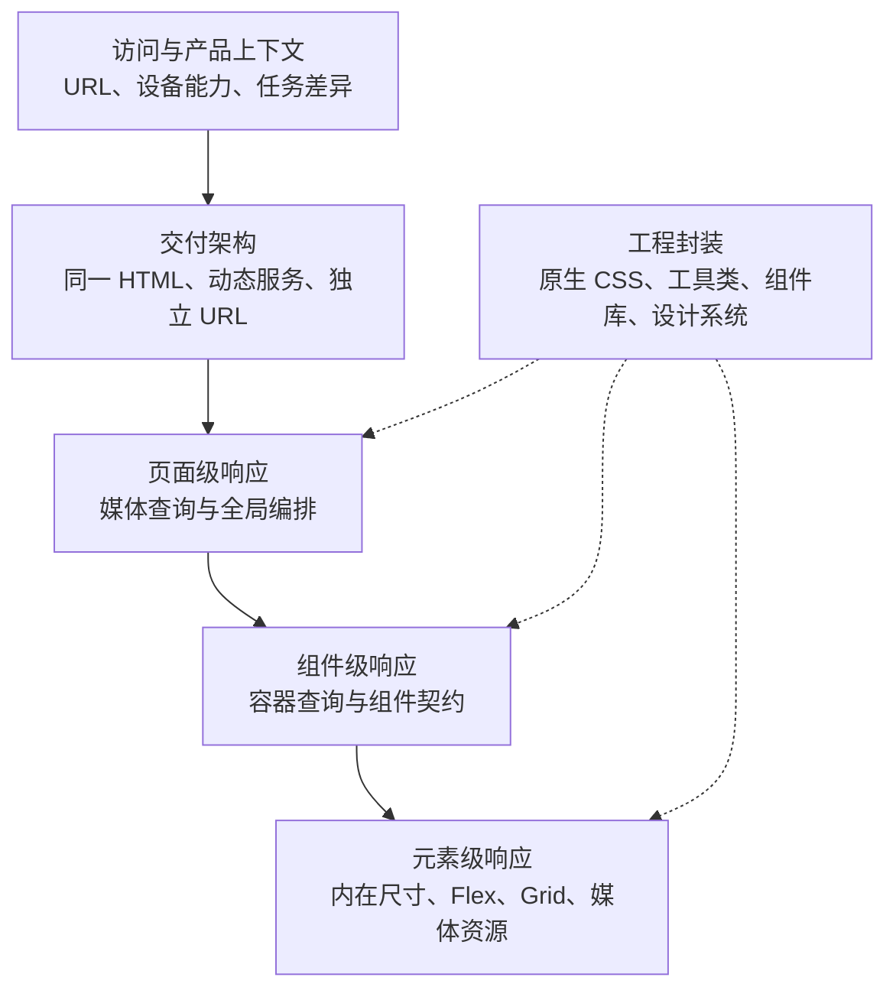
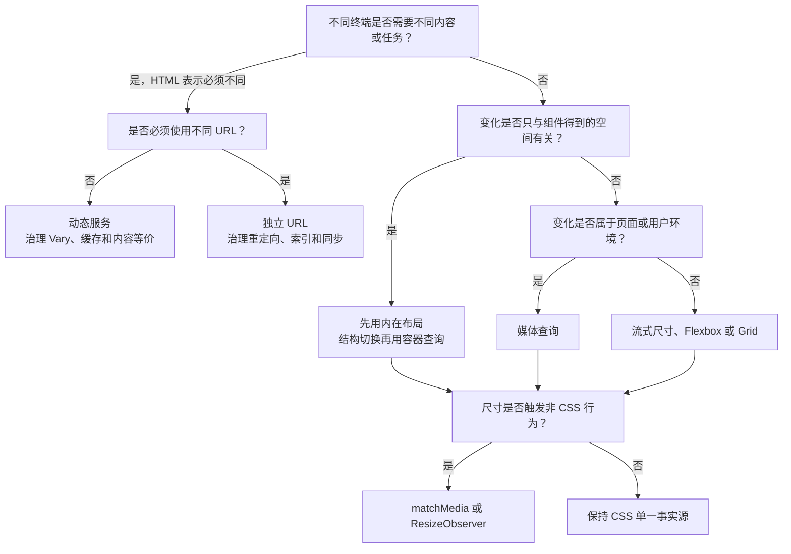

# 响应式布局：交付架构、布局机制与工程取舍

> 查证基线：2026-08-18。CSS 规范和浏览器实现持续演进；本文区分规范定义、已经形成互操作性的能力，以及仍需渐进增强的新特性。

## 核心判断

响应式布局不是“给手机写几个媒体查询”，而是把**交付环境、可用空间、内容约束、输入能力和用户偏好**映射为合适的内容表示。一个完整方案至少包含五层决策：



这张图的关键边界是：

- 交付架构决定浏览器收到哪个 URL、HTML 和数据；CSS 不能弥补内容模型本身的差异。
- 媒体查询观察页面或用户代理环境，适合全局编排；它不知道组件实际被分配了多少空间。
- 容器查询观察祖先容器，适合可复用组件；它不替代 Grid、Flexbox 和内在尺寸算法。
- Bootstrap、Tailwind CSS、CSS-in-JS 等工具最终仍生成或控制浏览器已有机制，不是新的布局引擎。
- JavaScript 应处理布局引发的行为或非 DOM 渲染，不宜复制一套 CSS 断点状态。

默认的现代 Web 基线通常是：**同一 URL 与语义内容 → 普通流和内在尺寸优先 → Grid/Flexbox 解决空间分配 → 媒体查询处理页面级变化 → 容器查询处理组件级变化 → JavaScript 只处理行为**。只有任务、内容或交付约束真的不同，才上升到动态服务或独立站点。

## 一、先把容易混淆的概念拆开

Ethan Marcotte 在 2010 年提出 Responsive Web Design 时，把流式网格、弹性图片和媒体查询组合为一种接受 Web 可变画布的设计方法。[A List Apart：Responsive Web Design](https://alistapart.com/article/responsive-web-design/)

十多年后，“响应式”已经扩展到容器查询、内在尺寸、用户偏好和响应式资源选择。原始定义仍有历史价值，但不应被误解为“响应式等于断点”。

| 术语 | 本文采用的操作性定义 | 主要变化 | 容易误解之处 |
| --- | --- | --- | --- |
| 响应式 Web 设计（RWD） | 同一核心内容和页面表示根据环境连续或离散重排 | 布局、排版、资源和交互呈现 | 不等于只支持手机，也不要求所有值连续变化 |
| 流式布局 | 尺寸随可用空间连续变化 | 宽度、间距、字号、轨道 | 只有百分比并不能自动保证内容可用 |
| 自适应布局 | 在若干条件下切换离散布局状态 | 列数、导航形态、信息密度 | “AWD”没有唯一标准定义，可能指 CSS 断点，也可能指服务端变体 |
| 内在设计 | 让内容贡献和布局算法决定何时换行或重排 | `min-content`、`auto-fit`、`minmax()` | 不是“零媒体查询”的教条 |
| 组件响应式 | 组件根据宿主容器而非整个视口变化 | 组件内部结构和密度 | 不能用页面断点可靠推导组件空间 |
| 移动优先 | 从最少约束的基础样式开始，按能力和空间增强 | 级联顺序与增强路径 | 不等于先针对某个手机型号设计 |

“响应式”和“自适应”不是严格互斥的产品类型。成熟界面通常在一个区间内流式变化，在内容无法维持时切换离散结构；真正需要区分的是：**谁触发变化、什么发生变化、是否改变交付表示**。

## 二、多端交付架构：CSS 之前的决策

Google 将移动 Web 的交付配置区分为响应式设计、动态服务和独立 URL：响应式设计在同一 URL 返回相同 HTML，动态服务在同一 URL 根据客户端返回不同 HTML，独立 URL 则维护不同地址的表示。[Google Search Central：移动优先索引最佳实践](https://developers.google.com/search/docs/crawling-indexing/mobile/mobile-sites-mobile-first-indexing)

| 方案 | URL / HTML | 优势 | 主要代价 | 更合适的场景 |
| --- | --- | --- | --- | --- |
| 单一响应式页面 | 同一 URL、同一核心 HTML | 内容一致、缓存和分析简单、分享与索引统一、维护面较小 | 极端多端差异可能把大量无用结构送到客户端 | 内容与任务基本一致的内容站、SaaS、商店和后台 |
| 动态服务 | 同一 URL、服务端选择不同 HTML | 可减少特定终端的结构或数据，允许显著不同的首屏 | UA/能力判断、缓存键、内容一致性和测试矩阵复杂 | 终端能力或任务确实决定不同表示，且团队能治理缓存与等价内容 |
| 独立移动 URL | 不同 URL、不同 HTML | 可隔离遗留技术栈或完全不同的移动产品 | 重定向、canonical、hreflang、内容同步、分析和迁移负担最高 | 既有 m 站迁移期、法规或组织边界强制隔离、产品任务根本不同 |
| 混合架构 | 核心内容共享，局部在服务端或客户端增强 | 可在一致性和端侧成本之间取平衡 | 边界不清时会同时承担两套系统的复杂度 | 大型应用按路由或能力逐步迁移，少数组件需要专用表示 |

动态服务不仅是模板选择问题。RFC 9110 规定，`Vary` 描述哪些请求字段影响了表示选择，并扩展缓存复用时必须匹配的键。[RFC 9110：Vary](https://www.rfc-editor.org/rfc/rfc9110.html#name-vary) 如果服务器根据 `User-Agent` 返回不同 HTML，却没有让缓存和爬虫知道这种差异，就可能把错误表示复用给其他客户端。

因此选择顺序应是：

1. 内容和任务相同：优先同一表示，通过 CSS 适配。
2. 结构不同但语义等价：先判断能否通过渐进增强或按需加载解决。
3. 必须服务端变体：把识别规则、`Vary`、缓存、内容等价和回退列为架构契约。
4. URL 也必须不同：明确迁移、索引、国际化和跨站分析成本，不把它当作普通布局方案。

Google 推荐 RWD 的理由主要是实现和维护更简单；这不是“RWD 在任何场景都更快”的性能结论。性能取决于实际传输资源、渲染路径和运行时代码，需要测量而不是从架构名称推断。

## 三、CSS 有三种响应机制，不只有断点

浏览器布局本质上是约束求解：它把包含块尺寸、内容的最小/最大贡献、首选尺寸、最小/最大限制和布局算法组合为最终使用尺寸。

### 1. 连续响应：让值随空间变化

```css
.page {
  inline-size: min(100% - 2rem, 75rem);
  margin-inline: auto;
}

.title {
  font-size: clamp(1.75rem, 1.2rem + 2.2vi, 3.5rem);
}
```

百分比、`fr`、`rem`、视口单位、容器单位以及 `min()`、`max()`、`clamp()` 表达连续约束。CSS Values Level 4 将 `clamp(MIN, VAL, MAX)` 定义为在上下限之间选择中心计算值，可用于对流式排版设置安全边界。[W3C：CSS Values and Units Level 4](https://www.w3.org/TR/css-values-4/#comp-func)

连续响应的优势是减少人为状态和边界跳变；局限是它只能改变数值，无法表达“导航从横排变抽屉”这种语义结构切换。

### 2. 算法响应：让内容和可用空间决定布局

```css
.cards {
  display: grid;
  grid-template-columns: repeat(
    auto-fit,
    minmax(min(100%, 18rem), 1fr)
  );
  gap: 1rem;
}
```

这段 Grid 没有查询视口，却能在容不下下一列时自然换行。`min-content` 表示在利用所有软换行机会后通常仍不应更小的尺寸，`max-content` 通常表示不采用软换行时的理想尺寸，`fit-content` 则把结果夹在内容约束和可用空间之间。[W3C：CSS Box Sizing Level 3](https://www.w3.org/TR/css-sizing-3/#intrinsic-sizes)

Flexbox 与 Grid 的差异不是“一维只能做导航、二维只能做页面”这么简单：

- Flexbox 逐行分配主轴空间，适合项目数量和内容长度主导的单轴关系。
- Grid 先建立显式或隐式轨道，再按轨道算法计算尺寸，适合行列对齐和区域关系。
- 两者都会受到内容最小贡献影响。Flex 项目默认不会收缩到其最小内容尺寸以下，Grid 的 `1fr` 轨道也可能被内容撑开。[W3C：Flexbox 自动最小尺寸](https://www.w3.org/TR/css-flexbox-1/#min-size-auto) [W3C：Grid 轨道尺寸](https://www.w3.org/TR/css-grid/#algo-track-sizing)

这就是两个常见修复的来源，而不是需要背诵的魔法：

```css
.flex-child,
.grid-track-child {
  min-inline-size: 0;
}

.grid {
  grid-template-columns: minmax(0, 1fr) 20rem;
}
```

`min-inline-size: 0` 允许项目低于自动最小尺寸；`minmax(0, 1fr)` 把轨道下限从隐含的内容约束改为零。内容仍需要通过换行、截断、滚动或重排获得明确处理，不能只把溢出隐藏。

### 3. 条件响应：在阈值处切换规则

媒体查询和容器查询适合离散变化，例如列数、导航模式、信息密度和组件内部结构。它们的区别不在语法相似性，而在**被查询的上下文**。

| 机制 | 观察对象 | 变化粒度 | 最大优势 | 典型风险 |
| --- | --- | --- | --- | --- |
| 流式值 | 当前属性可解析的参考尺寸 | 连续数值 | 状态少、过渡自然 | 缺少可读性上下限 |
| 内在布局 | 内容贡献与可用空间 | 自动换行和轨道分配 | 少写设备断点，适应未知内容 | 不理解最小内容尺寸时会溢出 |
| 媒体查询 | 视口、输出设备、输入能力、用户偏好 | 页面级离散状态 | 统一控制全局编排 | 组件与视口耦合 |
| 容器查询 | 合格祖先容器的尺寸或样式 | 组件级离散状态 | 组件可在未知宿主中自治 | 容器选择、嵌套和特性成熟度增加复杂度 |
| JavaScript 观察 | 媒体状态或元素尺寸事件 | 行为和非 CSS 渲染 | 可重绘 Canvas、虚拟化或加载数据 | 产生双重状态、循环和布局抖动 |

## 四、媒体查询：页面上下文，而不是设备目录

Media Queries 允许查询用户代理或显示环境，与文档中某个组件得到的空间无关。[W3C：Media Queries Level 5](https://www.w3.org/TR/mediaqueries-5/)

```css
/* 基础状态适用于约束更多的环境 */
.workspace {
  display: block;
}

/* 内容需要且空间足够时增强为两栏 */
@media (width >= 64rem) {
  .workspace {
    display: grid;
    grid-template-columns: minmax(0, 1fr) 20rem;
  }
}

@media (prefers-reduced-motion: reduce) {
  *, *::before, *::after {
    scroll-behavior: auto;
    transition-duration: 0.01ms;
  }
}
```

### 断点应由内容失败点产生

设备型号不是稳定抽象。浏览器窗口可以分屏，桌面页面可以被放大，平板可以外接显示器，组件还可能嵌入 iframe 或侧栏。更可靠的方法是：

1. 从语义正确的单列或最少约束状态开始。
2. 缓慢扩大可用空间。
3. 在行长、控件密度、信息层级或操作效率出现明确变化时记录阈值。
4. 把相邻阈值合并为少量产品断点，并用真实内容验证边界两侧。

框架默认断点可以作为一致的团队刻度，不能替代上述内容分析。

### 不要用宽度推断能力

宽屏设备可能使用触摸，窄窗口也可能有精确指针。输入相关设计应查询 `hover`、`pointer` 或 `any-pointer`，并保留键盘和触摸可达路径。颜色主题、减少动态效果和对比度偏好同样是响应式系统的一部分，不应被简化成“暗色模式附加项”。

Media Queries Level 5 是工作草案，包含的特性成熟度和浏览器支持并不一致。生产代码需要按单个 feature 检查实现与回退，不能用“浏览器支持媒体查询”推导所有 Level 5 能力都可用。

## 五、容器查询：把组件从页面断点中解耦

考虑同一张数据卡片：在 1440px 宽页面里，主内容区可能得到 700px，侧栏只得到 280px。如果卡片只使用 `@media (width >= 64rem)`，两处卡片会同时进入“宽布局”，因为它们看到的是同一个视口。

尺寸容器查询改为询问宿主：

```css
.card-host {
  container: card / inline-size;
}

.card {
  display: grid;
  grid-template-columns: 1fr;
}

@container card (inline-size >= 34rem) {
  .card {
    grid-template-columns: 12rem minmax(0, 1fr);
  }
}
```

CSS Containment Level 3 定义：尺寸查询从元素的合格祖先查询容器中选择上下文，`container-type: inline-size` 建立内联轴尺寸查询容器，`@container` 中的规则作用于该容器的后代。[W3C：CSS Containment Level 3](https://www.w3.org/TR/css-contain-3/#container-queries)

关键边界包括：

- 元素不能通过查询自己的结果再改变自己的被查询尺寸；查询对象是祖先容器，避免直接自指循环。
- 没有合格祖先时，查询结果不是“宽度为零”，而是无法匹配。
- 容器单位 `cqi`、`cqb`、`cqw` 等提供相对容器尺寸的连续值；它们适合局部排版，但仍需要上下限。
- 多层嵌套时应命名真正代表组件契约的容器，避免无意匹配最近的任意容器。
- `container-type` 会引入相应 containment 语义；不应为“可能以后会查”而给所有节点建立尺寸容器。

### 内在布局与容器查询如何分工

先让 Grid、Flexbox、换行和内容尺寸解决连续空间分配；只有当组件需要改变**结构或语义密度**时再添加容器查询。例如，卡片从单列变为图文双列是离散结构变化，而卡片列表能放几列通常可以交给 `auto-fit + minmax()`。

### 样式查询要按成熟度渐进增强

样式查询可以根据祖先上的自定义属性等计算样式切换后代规则，适合把主题或状态作为组件上下文。它已经在部分浏览器中发布，但仍是 Interop 2026 的跨引擎一致性重点。[WebKit：Interop 2026 的 Container style queries](https://webkit.org/blog/17818/announcing-interop-2026/)

因此当前生产策略应是：核心可用性不依赖尚未满足目标浏览器矩阵的查询类型；新能力放入 `@supports` 或自然忽略后仍成立的增强层，并按发布时的官方实现记录和 Web Platform Tests 重新核验。

## 六、内容、媒体与无障碍也是布局输入

### 响应式图片解决的是资源与构图，不只是 CSS 宽度

```html
<picture>
  <source media="(width >= 64rem)" srcset="hero-wide.avif">
  = 64rem) 50vw, 100vw"
    alt="团队在白板前讨论布局约束"
  >
</picture>
```

- `srcset` 的宽度描述符与 `sizes` 帮助浏览器选择足够清晰但不过大的候选资源。
- `<picture>` 和 `source media` 用于艺术指导，即在不同条件下改变裁切或构图。
- CSS `object-fit` 只改变已选资源在盒子中的呈现，不能替代网络候选选择。

HTML Living Standard 定义了候选源、source size 和艺术指导的选择模型。[WHATWG HTML：Responsive images](https://html.spec.whatwg.org/multipage/images.html#responsive-images)

### 真实内容会暴露设计稿没有的约束

至少应覆盖：长标题、不可断开的标识符、空状态、极大数字、多语言膨胀、RTL、用户自定义字体、图片缺失和动态插入。`overflow: hidden` 可以让截图变整齐，却可能丢失用户完成任务所需的信息。

### 回流是可访问性契约

WCAG 2.2 的 Reflow 成功准则要求大多数纵向阅读内容在相当于 320 CSS px 宽时无需双向滚动，并对确实需要二维布局的内容保留例外。[W3C WAI：Understanding Reflow](https://www.w3.org/WAI/WCAG22/Understanding/reflow.html)

这带来几个工程结论：

- 页面宽度正常不代表 400% 缩放可用；缩放会把有效 CSS 视口压窄。
- 表格、时间线和画布可以保留局部横向滚动，但不应迫使整页左右往返。
- Flexbox/Grid 的视觉重排不能改变 DOM、键盘和朗读语义。Flexbox 规范明确限制 `order` 只能用于视觉顺序，而不能修复逻辑顺序。[W3C：Flexbox Reordering and Accessibility](https://www.w3.org/TR/css-flexbox-1/#order-accessibility)
- 隐藏次要信息前要判断它是否真的可丢弃；“移动端更简洁”不是删除关键内容的证据。

## 七、CSS 与 JavaScript 的职责边界

CSS 能表达的呈现变化应留在 CSS 中。JavaScript 只有在尺寸变化需要触发**行为或非 CSS 渲染**时才介入：

| 需求 | 首选机制 | 原因 |
| --- | --- | --- |
| 页面布局、显隐和视觉密度 | 媒体查询 | 由浏览器维护状态和级联 |
| 组件内部布局 | 容器查询或内在布局 | 直接使用组件实际空间 |
| 与媒体条件同步的数据或行为 | `matchMedia()` | 与 CSS 使用同一媒体查询语义 |
| Canvas/WebGL 图表重绘 | `ResizeObserver` | CSS 无法重绘像素内容 |
| 虚拟列表重新估算、第三方布局适配 | `ResizeObserver` | 需要执行行为逻辑 |
| 仅为了加 `.is-mobile` 类 | 不使用 JS | 复制断点状态，容易闪烁和漂移 |

`matchMedia()` 返回与文档关联的 `MediaQueryList`；它适合行为同步，不应通过一次读取后永久缓存结果。[CSSOM View：matchMedia](https://drafts.csswg.org/cssom-view/#dom-window-matchmedia)

Resize Observer 是元素尺寸变化的行为接口，并定义了观察深度和 resize loop error 的处理模型。[W3C：Resize Observer](https://www.w3.org/TR/resize-observer/) 回调中同步写入会再次改变被观察尺寸时，可能形成反馈循环。更稳妥的做法是：

- 观察尽可能少的节点和正确的 box；
- 在回调中比较新旧尺寸，避免无意义更新；
- 分离读取与写入，必要时把写入安排到下一帧；
- 不用它重新实现 CSS 已能完成的列切换；
- 在组件销毁时 `unobserve()` 或 `disconnect()`。

## 八、工程工具只是约束的编码方式

| 工程方案 | 优势 | 局限 | 适用场景 |
| --- | --- | --- | --- |
| 原生 CSS + Custom Properties + Cascade Layers | 直接使用平台能力、依赖少、可做精确渐进增强 | 需要团队自己建立命名、令牌、测试和治理 | 长生命周期产品、设计系统底层、现代浏览器目标 |
| Bootstrap | 栅格、组件和断点约定成熟，上手与原型速度快 | 默认视觉与六级断点形成强约定，深度定制需理解 Sass 和底层 Flexbox/Grid | 管理后台、传统内容站、需要成熟组件基线的团队 |
| Tailwind CSS | 响应式变体贴近使用点，媒体和容器变体组合直接，令牌可集中配置 | 类名密度高；任意值无治理时会把断点碎片化 | 组件化应用、重视快速组合且有设计令牌约束的团队 |
| CSS Modules / Shadow DOM / Scoped CSS | 降低选择器碰撞，使组件样式边界更明确 | 作用域不自动产生响应式契约；跨边界主题与覆盖需要设计 | 大型组件树、微前端、Web Components |
| CSS-in-JS / 运行时样式 | 可把组件 props 和样式生成结合，适合高度动态主题 | SSR、缓存、运行时和调试成本因方案而异；仍不能绕过 CSS 布局算法 | 已采用相应运行时、动态值确实超过静态 CSS 表达的应用 |
| 设计系统响应契约 | 把断点、容器名、密度和内容限制变成跨团队协议 | 前期治理成本高，错误抽象会固化到所有产品 | 多产品、多团队、组件跨宿主复用 |

Bootstrap 5.3 的默认栅格基于 Flexbox，并提供六级移动优先断点；官方也说明这些断点代表一组常见尺寸，而不是每种设备。[Bootstrap 5.3：Breakpoints](https://getbootstrap.com/docs/5.3/layout/breakpoints/) Tailwind CSS 当前文档同时提供媒体断点、范围变体、命名容器和容器查询变体。[Tailwind CSS：Responsive design](https://tailwindcss.com/docs/responsive-design)

框架默认值的真正价值是**一致性和速度**，不是比产品内容更了解断点。采用工具后仍应回答：断点由什么失败点产生、组件是否会进入未知宿主、任意值如何治理、无框架回退是否仍有正确语义。

## 九、按问题选择方案，而不是按流行度



| 场景 | 推荐组合 | 为什么 |
| --- | --- | --- |
| 内容站、营销页 | 同一 HTML + 流式排版 + Grid + 少量媒体查询 + 响应式图片 | 内容一致，页面级编排为主，资源选择影响性能 |
| SaaS 工作台 | 页面媒体查询 + 面板容器查询 + Grid/Flexbox + 局部 ResizeObserver | 面板可拖动、嵌套且与视口宽度不等价 |
| 组件库、微前端、嵌入式组件 | 基础语义 + 内在布局 + 命名容器 + 设计令牌 | 组件无法预知宿主页面和列宽 |
| 电商列表 | 内在 Grid + 容器响应卡片 + `srcset/sizes` + 内容压力测试 | 商品卡复用多，图片和标题是主要约束 |
| 数据表格、时间线 | 页面回流 + 局部二维滚动 + 列优先级或替代视图 | 数据关系可能确实需要二维空间，但整页仍应可回流 |
| 遗留桌面站迁移 | 先统一内容与 DOM，再逐段引入流式尺寸和移动优先规则 | 避免一次重写，也避免长期维持两套内容 |
| 终端任务根本不同 | 动态服务或独立产品，CSS 只负责各表示内部布局 | 问题已经超出同一页面的视觉重排 |

## 十、最常见的生产失败

### 1. 用设备名代替约束

`tablet`、`desktop` 很快会失真。断点名称可以保留为设计令牌，但其值应来自内容与布局失败点，并通过中间宽度验证。

### 2. 页面断点控制可复用组件

宽视口中的窄侧栏、弹窗或分屏会暴露这种耦合。组件优先使用内在布局和容器查询，页面只负责给它空间。

### 3. 把溢出当作视觉瑕疵隐藏

先定位是自动最小尺寸、不可换行内容、固定轨道还是资源固有尺寸，再选择换行、滚动、截断或结构变化。对关键数据使用省略号时必须提供完整值的可访问方式。

### 4. 让 CSS、JS 和框架各有一套断点

三处常量会在边界值、SSR 首屏和监听更新上漂移。把布局状态留给 CSS；必须由 JS 同步时，共享查询字符串或设计令牌，并测试边界两侧。

### 5. 视觉重排破坏语义顺序

不要用 `order`、Grid areas 或绝对定位把错误 DOM 伪装成正确阅读顺序。先写符合任务和朗读顺序的 DOM，再做视觉布局。

### 6. 宣称“容器查询更慢”或“框架更快”

这类结论离不开组件数量、查询嵌套、样式失效范围、资源体积和交互模式。规范可以解释依赖关系，不能替代项目基准。生产判断应使用真实页面的 Performance、Rendering 和网络数据，并记录设备、浏览器、预热和样本。

## 十一、验证契约

响应式验收不应只截取三个设备预设。最低测试矩阵应覆盖：

| 维度 | 应检查的边界 |
| --- | --- |
| 视口 | 断点前后、极窄宽度、矮视口、横竖切换、分屏 |
| 容器 | 同一组件位于主栏、侧栏、弹窗、可拖动面板 |
| 内容 | 空、短、长、不可断标识符、大数字、图片缺失 |
| 语言 | 文本膨胀、RTL、逻辑属性和不同换行规则 |
| 用户设置 | 400% 缩放、字体放大、减少动态效果、颜色与对比偏好 |
| 输入与导航 | 键盘焦点、触摸、精确指针、hover 不可用 |
| 资源 | `srcset` 候选、艺术指导、布局偏移、慢网络 |
| 渐进增强 | 查询不支持、脚本失败、CSS 加载延迟、SSR 首屏 |

自动化可以覆盖 DOM 尺寸、溢出、布局列数、截图差异和控制台错误；人工检查仍需要判断内容优先级、焦点顺序、屏幕阅读器体验和触摸可用性。两者不能互相冒充。

## 十二、可执行的默认方案

对绝大多数新 Web 项目，可以从以下组合开始：

1. 保持同一 URL、核心 HTML 和内容语义。
2. 使用普通流、逻辑属性和明确的内容顺序建立无查询基线。
3. 用 `max-inline-size`、`clamp()`、Flexbox 和 Grid 表达连续约束。
4. 用 `auto-fit/minmax()` 等内在布局减少人为断点。
5. 只在页面结构或用户环境改变时使用媒体查询。
6. 只在组件结构取决于宿主空间时使用容器查询。
7. 用响应式图片处理网络候选和艺术指导。
8. 只在尺寸变化需要行为或非 CSS 重绘时引入 JavaScript 观察。
9. 让框架和设计系统编码这些决策，而不是替代这些决策。
10. 用视口、容器、内容、语言、偏好和输入的组合矩阵验证。

当这套基线仍无法表达真实的内容或任务差异时，再考虑动态服务或独立产品。这条升级路径把复杂度放在能够证明它必要的地方。

## 配套实践

- [运行响应式上下文实验](./responsive-layout-demo/index.html)：在同一宽视口内改变组件宿主宽度，对比媒体查询、内在 Grid 与容器查询。
- [完成专家练习与核对答案](./responsive-layout-exercises.md)：沿“运行 → 观察 → 推理 → 修改 → 验证”闭环分析上下文耦合、最小内容尺寸和架构选择。

## 来源与验证审计

- 历史定义使用 RWD 原始文章；交付架构使用 Google 官方说明与 HTTP 语义 RFC。
- 布局、尺寸、媒体查询、容器查询、DOM 顺序和观察 API 使用 W3C/CSSWG/WHATWG 规范。
- 无障碍回流使用 WCAG 2.2 官方解释材料。
- Bootstrap 与 Tailwind CSS 只依据各自当前官方文档描述能力，不给出未经同环境测量的性能排名。
- 容器样式查询等演进能力按 2026-08-18 的规范和互操作项目状态标注；未来采用时应重新核验目标浏览器。
- 配套 Demo 只复现当前本地 Chromium 的实际行为；其他引擎的结论来自标准、官方实现记录和互操作测试，不宣称已经在本机逐一运行。
