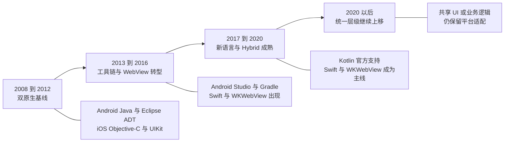
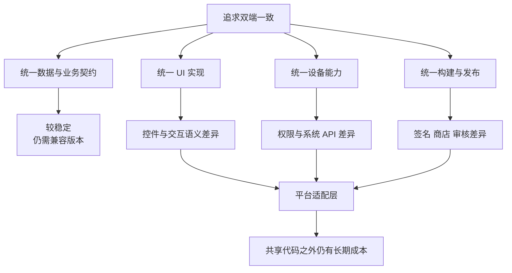
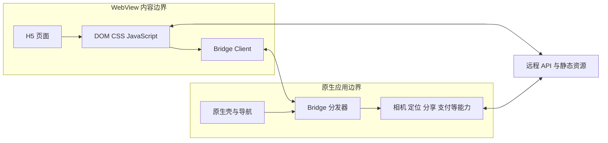
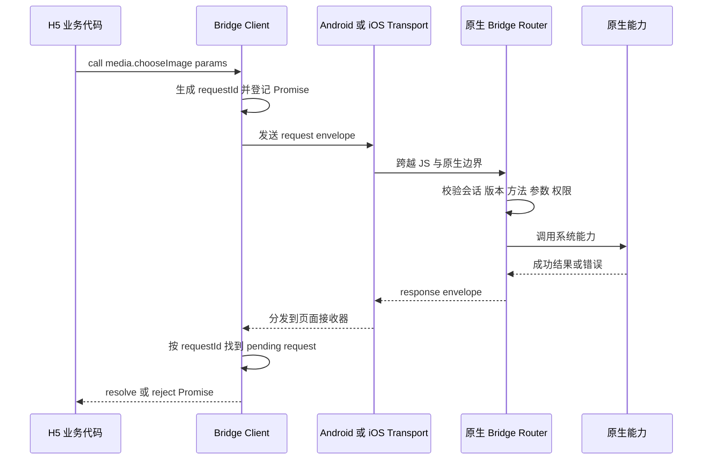
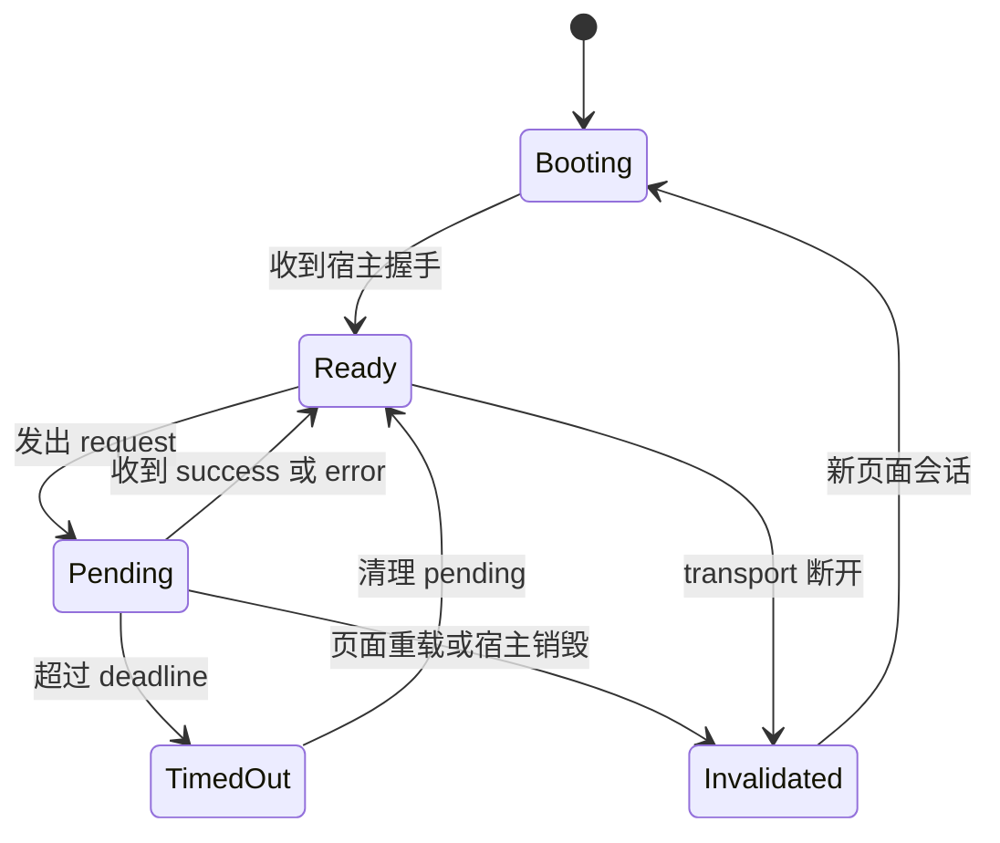
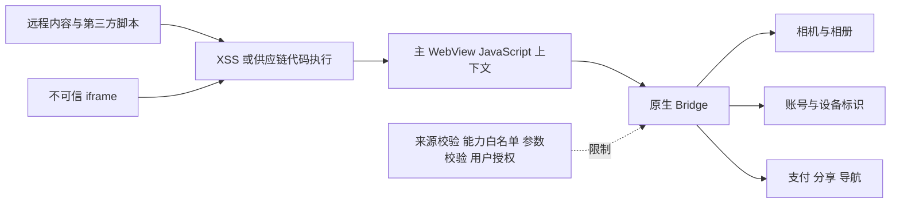
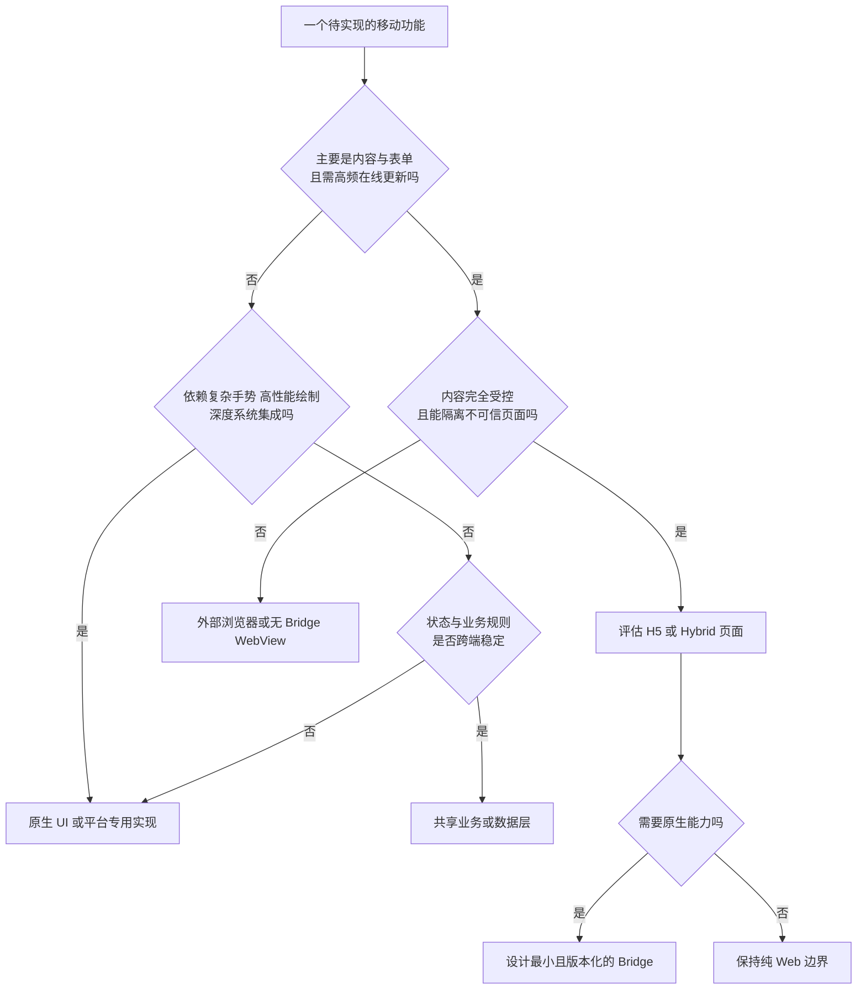

# Android、iOS 双原生与 WebView Bridge：从两条技术栈到混合架构边界

在移动互联网早期到跨平台框架成熟之前，一项业务通常由 Android 与 iOS 两套客户端分别实现。表面上只是 Java 对 Objective-C、Android Studio 对 Xcode，实际分开的却是语言与运行时、UI 体系、生命周期、线程约束、设备 API、构建签名和应用商店交付整条链路。

H5（HTML5、CSS、JavaScript 页面）进入 WebView 后，团队可以共享一部分界面和业务流程，但并没有消除平台边界。它把问题从“两套页面代码”改成了“Web 内容怎样安全、可靠地调用宿主能力”。JSBridge 因此不是一个挂在 `window` 上的万能对象，而是一套跨运行时、异步、需要版本治理的能力协议。

先记住五个结论：

- “双原生”意味着两套可独立构建、运行和发布的客户端，不只是同一份需求翻译成两种语言。
- 可以较稳定地统一数据契约、业务规则和设计语义；很难无损统一平台生命周期、原生 UI 语义、系统能力和发布约束。
- WebView 是受原生宿主管理的 Web 运行环境。它能复用 Web 技术，却同时引入页面、Web 进程、原生进程和远程服务之间的新边界。
- JSBridge 应被设计成异步 RPC 加事件协议：请求标识、错误模型、超时、页面会话、能力发现和版本协商都不是可选装饰。
- 架构目标不是追求最高代码复用率，而是把变化频繁、能稳定抽象的部分共享，把平台差异留在明确、可测试的适配层。

配套材料：

- [可运行的双宿主 Bridge 实验室](./android-ios-native-and-webview-bridge-demo/)
- [全面练习与参考答案](./android-ios-native-and-webview-bridge-exercises.md)

本文以 2008—2020 年前后的代表性工程形态为主，并在最后用现代方案说明“统一层级”如何继续变化。“常用技术栈”不是严格市场份额排名；开源库和架构模式会因公司、年份、地区和产品类型而不同。查证日期为 2026-09-13。

## 一、先把历史切成阶段

如果把十余年的技术混在同一张清单里，会得到不存在于任何真实年份的组合。例如，早期 Android 项目不可能同时以 Eclipse ADT、Kotlin 和 Jetpack Compose 为主；早期 iOS 项目也不会以 Objective-C、SwiftUI 和 Swift Package Manager 组成一条典型链路。

下面的阶段只用于建立坐标，不表示所有团队在同一年完成迁移。



### 双原生基线

Android 侧的代表性组合是 Java、Android SDK、Eclipse ADT、Ant、XML 布局、`Activity`/`Fragment`、`View`/`ViewGroup`、SQLite 与 `SharedPreferences`。Google 在 2015 年宣布停止 Eclipse ADT 和 Android Ant 构建系统的官方开发支持，这也反向确认了它们在 Android Studio 迁移前的历史位置。[Android Developers Blog：停止 Eclipse ADT 支持](https://android-developers.googleblog.com/2015/06/an-update-on-eclipse-android-developer.html)

iOS 侧的代表性组合是 Objective-C、Clang/LLVM、Cocoa Touch、UIKit、Xcode、XIB/Nib 或 Storyboard、`UIViewController`、Foundation、Core Data、`NSUserDefaults` 与 Keychain。Apple 的归档材料把 Objective-C 描述为当时开发 iOS 和 OS X 软件的主要语言，并明确 Xcode 同时承担编码、界面设计、测试和调试职责。[Apple 归档：Programming with Objective-C](https://developer.apple.com/library/archive/documentation/Cocoa/Conceptual/ProgrammingWithObjectiveC/)

### 工具链与 WebView 转型

Google 在 2013 年发布 Android Studio 预览，并把基于 Gradle 的构建系统作为核心能力。Gradle 不只是替换一条编译命令；它引入模块、依赖解析、构建变体以及 IDE/命令行/持续集成之间更一致的构建入口。[Android Studio 2013 发布说明](https://android-developers.googleblog.com/2013/05/android-studio-ide-built-for-android.html)

Android 4.4 开始使用基于 Chromium 的新 WebView。[Android 4.4 平台说明](https://developer.android.com/about/versions/kitkat)记录了这次实现切换。现代 Android WebView 可以作为独立 APK 更新；它与 Chrome 共享大量引擎代码，但不共享浏览数据，也不具备 Chrome 的全部产品能力。[Chrome for Developers：WebView 概览](https://developer.chrome.com/docs/webview)

Apple 在 2014 年推出 Swift 1.0；Swift 官方语言文档的修订历史保留了 2014 年 8 月的 Swift 1.0 记录。[Swift 语言文档修订历史](https://docs.swift.org/swift-book/documentation/the-swift-programming-language/revisionhistory/) 同期出现的 `WKWebView` 在 iOS 8 中引入。Apple 在 WWDC 2018 正式说明 UIWebView 被弃用，并强调 WKWebView 将 Web 内容放在独立进程中。[WWDC 2018：What’s New in Safari and WebKit](https://developer.apple.com/videos/play/wwdc2018/234/)

### 新语言与 Hybrid 成熟

Google 在 2017 年宣布 Android 官方支持 Kotlin，并将插件集成到 Android Studio 3.0；这不是 Java 项目立即消失，而是形成 Java/Kotlin 长期互操作与渐进迁移。[Android Developers Blog：Android 支持 Kotlin](https://android-developers.googleblog.com/2017/05/android-announces-support-for-kotlin.html)

Swift 也经历了源码兼容、运行时打包和 ABI 稳定等迁移成本。Swift 5 在 2019 年达到 Apple 平台 ABI 稳定，运行时随操作系统交付，从而减少应用自带 Swift 运行库的需要。[Swift.org：ABI Stability](https://www.swift.org/blog/abi-stability-and-apple/)

这段时期的真实项目常是混合状态：旧模块仍用 Java 或 Objective-C，新模块开始使用 Kotlin 或 Swift；旧 WebView、旧依赖管理和新 API 并存。所谓“当年的技术栈”更像一条迁移路径，而不是一次整齐切换。

## 二、两条开发线路分别包含什么

### 不是语言表，而是交付栈

| 层次 | Android 代表性技术 | iOS 代表性技术 | 难以直接统一的原因 |
| --- | --- | --- | --- |
| 语言与运行时 | Java、后来 Kotlin；Dalvik/ART；必要时 JNI/NDK | Objective-C、后来 Swift；Objective-C runtime、Swift runtime；必要时 C/C++ | 对象模型、内存管理、ABI、异常和并发语义不同 |
| IDE 与 SDK | Eclipse ADT，后来 Android Studio；Android SDK、ADB、Emulator | Xcode、iOS SDK、Simulator、Instruments | 工具链、调试协议和平台 SDK 由不同厂商控制 |
| UI | XML 布局、`View`/`ViewGroup`、`Activity`/`Fragment`；后来 Compose | XIB/Nib、Storyboard 或代码布局；UIKit、`UIViewController`；后来 SwiftUI | 控件语义、导航、手势、字体、无障碍和窗口模型不同 |
| 构建 | Ant 时代，后来 Gradle + Android Gradle Plugin；APK/AAB | Xcode Build System、target、scheme、build setting；App bundle/IPA | 依赖图、资源编译、产物结构和构建配置模型不同 |
| 依赖 | JAR/AAR、Maven 仓库、Gradle；历史项目还可能有手工源码 | 手工集成、CocoaPods、Carthage，后来 Swift Package Manager | 包格式、二进制兼容、链接方式和平台最低版本不同 |
| 网络与序列化 | `HttpURLConnection`，以及 OkHttp、Retrofit、Gson 等生态 | `NSURLSession`/`URLSession`，以及历史上的 AFNetworking、后来的 Alamofire 等 | HTTP 契约可统一，但缓存、TLS、后台传输和回调模型依赖平台 |
| 本地数据 | SQLite、`SharedPreferences`、文件、Keystore | SQLite/Core Data、`NSUserDefaults`、文件、Keychain | 数据模型可以相同，事务、迁移、加密与生命周期接口不同 |
| 并发 | 主线程/Looper/Handler、线程池，后来协程 | 主线程/RunLoop/GCD/Operation，后来 Swift Concurrency | UI 线程规则、取消、调度和生命周期所有权不同 |
| 测试 | JUnit、Instrumentation、Espresso 等 | XCTest、XCUITest 等 | 测试进程、模拟器/设备、UI 自动化和系统权限环境不同 |
| 发布 | Manifest、keystore、签名、渠道/商店包 | Info.plist、证书、provisioning profile、entitlement、App Store | 身份、签名、审核和灰度发布能力由平台分别定义 |

Android Studio 的当前工程仍把 manifest、Kotlin/Java 源码、资源和 Gradle 构建文件作为不同层次；Android Gradle Plugin 在 Gradle 上增加 Android 专用任务和模型。[Android Studio 工程结构](https://developer.android.com/studio/intro)、[Android Gradle Plugin 概览](https://developer.android.com/build/releases/about-agp)

UIKit 项目则由 Xcode 编译源码并把代码、图片、Storyboard、字符串和元数据组成 app bundle；UIKit 的视图、控制器和系统交互仍受主线程约束。[Apple：About app development with UIKit](https://developer.apple.com/documentation/uikit/about_app_development_with_uikit)、[Apple：UIKit](https://developer.apple.com/documentation/uikit)

### “常用库”必须放回年代

平台 SDK 不覆盖所有工程需求，于是两端形成各自生态。下面只列在遗留项目中具有代表性的组合，不等于每家公司都采用，更不构成今天的新项目推荐。

| 需求 | Android 遗留项目中常见的代表 | iOS 遗留项目中常见的代表 | 可统一的部分 |
| --- | --- | --- | --- |
| HTTP 客户端 | OkHttp、Retrofit | `NSURLSession`、AFNetworking、Alamofire | URL、方法、Header、请求/响应 Schema、错误语义 |
| JSON | Gson、Moshi、Jackson | `NSJSONSerialization`、Codable、Mantle/ObjectMapper 等 | JSON Schema、字段含义、兼容策略 |
| 图片加载 | Picasso、Glide、Fresco | SDWebImage、Kingfisher | 图片 URL、尺寸契约、缓存策略目标；实现仍分端 |
| 响应式/异步 | RxJava、后来协程与 Flow | ReactiveCocoa/RxSwift、GCD，后来 Combine/Swift Concurrency | 业务状态机；调度、生命周期和取消需要适配 |
| 依赖注入 | Dagger 等 | 工厂、容器或手写注入；生态更分散 | 接口和组装原则；具体生成器与生命周期不同 |
| 依赖管理 | Gradle + Maven 仓库 | CocoaPods/Carthage，后来 SwiftPM | 版本治理原则；包格式与链接方式不同 |

例如 OkHttp 的官方仓库保留了 Android/JVM 支持和版本历史，Retrofit 的变更记录可看到 2013 年后的多个主要版本；AFNetworking 官方仓库则明确它已在 2023 年弃用，并建议现代 Swift 项目迁移到 Alamofire。它们适合说明生态演化，不适合证明某一年精确的市场份额。[OkHttp 官方仓库](https://github.com/square/okhttp)、[Retrofit 变更记录](https://github.com/square/retrofit/blob/trunk/CHANGELOG.md)、[AFNetworking 官方仓库](https://github.com/AFNetworking/AFNetworking)、[Alamofire 官方仓库](https://github.com/Alamofire/Alamofire)

### MVC、MVP、MVVM 不是平台技术栈的硬边界

早期项目经常把大量逻辑堆进 Android `Activity` 或 iOS `UIViewController`，随后引入 MVC、MVP、MVVM、VIPER、Clean Architecture、单向数据流等模式。它们解决的是依赖方向、状态所有权和可测试性，不会抹平两个操作系统的运行差异。

两端可以约定同一分层语言：

```text
Presentation -> Use Case -> Domain Model -> Repository -> Data Source
```

但每层的具体类型依然不同。统一命名能改善沟通；把两个平台强行塞进完全相同的类图，通常只会隐藏适配代码。

## 三、统一为什么困难

### 先区分四种“统一”

| 目标 | 真正含义 | 可行程度 | 容易出现的误判 |
| --- | --- | --- | --- |
| 需求统一 | 用户目标和业务规则一致 | 高 | 同一张需求单被误认为实现成本相同 |
| 契约统一 | API、Schema、错误码、埋点和 Design Token 一致 | 较高 | 忽略平台权限、缓存和展示时机 |
| 行为统一 | 相同输入产生可接受的一致结果 | 中 | 把返回键、导航手势和生命周期差异当成 bug |
| 实现统一 | 同一份代码在两端执行 | 取决于层次 | 以代码行复用率替代交付质量 |

最稳定的共享通常位于平台边界之上：业务术语、服务端协议、状态机、验证规则、设计 Token、埋点事件。越接近屏幕、设备和操作系统，差异越有业务意义。



### UI 一致不等于体验一致

Android 的系统返回、任务栈、Intent 与 Activity/Fragment 导航，与 iOS 的导航控制器、返回手势、scene 和 view-controller presentation 不同。把按钮尺寸和颜色做成一样，不能自动统一：

- 返回动作到底回 Web 历史、原生导航栈，还是退出当前容器；
- 模态页面能否下拉关闭，关闭时怎样通知 H5；
- 状态栏、安全区、键盘和输入法如何改变可用空间；
- 系统字体、动态字号、VoiceOver/TalkBack 和触控反馈如何工作；
- 前后台、旋转、多窗口和内存回收时，谁保存页面状态。

因此合理目标通常是“业务语义一致、平台行为自然”，不是“每一个像素和手势都相同”。

### 生命周期不会因共享代码而消失

Android `Activity` 会经过 `onCreate`、`onStart`、`onResume`、`onPause`、`onStop` 和 `onDestroy`，系统还可能在后台回收整个进程。[Android Activity 生命周期](https://developer.android.com/guide/components/activities/activity-lifecycle)

iOS 早期主要通过 `UIApplicationDelegate` 接收应用级事件；iOS 13 以后 scene 生命周期把一个进程和多个 UI 实例进一步分开。[Apple：Managing your app’s life cycle](https://developer.apple.com/documentation/uikit/managing-your-app-s-life-cycle)

H5 的 `DOMContentLoaded`、`pageshow`、`pagehide`、`visibilitychange` 并不与这些原生回调一一对应。Cordova 的历史文档也明确说明 Web 事件只能粗略映射到 Android Activity 生命周期。[Cordova Android 平台生命周期](https://cordova.apache.org/archive/docs/en/9.x/guide/platforms/android/)

这会直接影响 Bridge：原生能力开始执行时页面可能存在，结果返回时 WebView 已经被替换、重载或销毁。

### 组织结构也会制造差异

双端不一致不全是技术问题。两个团队可能存在不同的：

- 版本节奏与最低系统版本；
- 组件库存和历史债务；
- API 容错策略；
- 测试设备和自动化覆盖；
- 发布审核延迟；
- 对平台规范与产品视觉的优先级。

因此“抽一套公共接口”只解决代码边界；要实现行为一致，还需要同一份协议、验收用例、版本矩阵、观测指标和异常语义。

## 四、H5 进入 WebView 后，系统变成什么

### 四个运行边界



阅读这张图时要分清两条网络路径：H5 可以直接用 `fetch`/XHR 请求服务，也可以让原生网络层代请求。前者复用 Web 代码并遵循 Web 的 Cookie/CORS/缓存模型；后者能复用原生鉴权、证书和后台传输能力，却把每个请求都变成 Bridge 契约，并扩大原生权限面。没有一条路径在所有场景中都更好。

### 常见装配方式

1. **整应用 Web 包装器**：大部分 UI 是 H5，原生壳负责启动、发布和设备插件。Cordova 是代表。官方架构把 WebView、Web App 和 Plugin 分成三个核心部分。[Cordova 架构概览](https://cordova.apache.org/archive/docs/en/9.x/guide/overview/)
2. **页面级 Hybrid**：原生负责首页、导航和关键流程，活动页、帮助页或变化频繁的业务页面使用 WebView。
3. **局部 WebView**：原生页面中嵌入一块 Web 内容，例如富文本、图表或营销组件。此时尺寸、滚动和手势竞争尤其重要。
4. **离线包**：HTML、CSS 和 JS 随应用或由受控更新系统下发，首屏与离线更可控，但要解决资源签名、回滚和版本配套。
5. **远程页面**：服务端即时更新，发布快，却把网络、认证、跨域、版本漂移和供应链风险带入主流程。
6. **应用内浏览器**：只展示外部站点，通常不应获得业务 Bridge。Android 对受控内容推荐 WebView，对普通浏览体验提供 Custom Tabs 作为另一种边界；Apple 也区分 WKWebView 与 Safari View Controller 的用途。[Android：Use web content within your app](https://developer.android.com/develop/ui/views/layout/webapps)、[WWDC 2015：Introducing Safari View Controller](https://developer.apple.com/videos/play/wwdc2015/504/)

### WebView 不是普通浏览器标签页

它拥有 Web 渲染能力，但宿主决定：

- 创建、复用和销毁时机；
- 初始 URL、本地资源和导航策略；
- JavaScript、文件访问、混合内容等设置；
- Cookie、缓存、用户代理和进程池；
- 哪些原生对象或消息处理器暴露给页面；
- 返回键、下载、权限、弹窗和新窗口如何处理；
- 调试是否开放，以及内容进程崩溃后是否恢复。

Android WebView 与 Chrome 基于相近的 Chromium 引擎，但并不共享 Chrome 数据或所有功能。WKWebView 也只提供 Web 内容视图；宿主仍需实现导航 UI 和策略。把它们当“嵌入式 Chrome/Safari”会高估浏览器产品层能力，低估宿主责任。

## 五、H5 与原生怎样双向通信

### 先看一次完整调用



“双向通信”并不意味着两端可以像同一进程中的同步函数一样互调。跨边界时至少发生了序列化、调度和生命周期竞争，返回值应默认异步。

### Android：注入对象与执行 JavaScript

传统 Android 方式是把一个 Java/Kotlin 对象注入页面：

```kotlin
class NativeBridge {
    @JavascriptInterface
    fun postMessage(serialized: String) {
        // 解析、校验并分发消息；不要直接反射任意方法。
    }
}

webView.settings.javaScriptEnabled = true
webView.addJavascriptInterface(NativeBridge(), "NativeBridge")
webView.loadUrl(trustedUrl)
```

H5 调用：

```javascript
window.NativeBridge.postMessage(JSON.stringify(request));
```

原生返回 H5：

```kotlin
val script = "window.__bridgeReceive($safeJson)"
webView.evaluateJavascript(script, null)
```

这里有四个重要事实：

1. `addJavascriptInterface` 把对象暴露给 WebView 的所有 frame，包括 iframe；传统接口没有可靠的调用 frame 来源鉴别机制。
2. 以 API 17 及以上为目标时，只有标注 `@JavascriptInterface` 的公开方法会暴露；更旧目标和旧设备存在严重反射攻击面。
3. 注入对象要到下一次页面加载后才出现在 JavaScript 中。
4. 注入对象的方法在 WebView 的另一个线程执行，而 `evaluateJavascript` 必须在创建 WebView 的线程——通常是 UI 线程——调用。

这些约束均来自 Android WebView API 与安全文档。[Android WebView API](https://developer.android.com/reference/android/webkit/WebView)、[Android WebView H5 集成指南](https://developer.android.com/develop/ui/views/layout/webapps/webview)、[Android WebView Bridge 安全指南](https://developer.android.com/privacy-and-security/risks/insecure-webview-native-bridges)

因此 Bridge 方法不能直接操作 UI，也不应在注入线程执行重任务。合理路径是：解析和快速校验后，把任务投递到明确的业务执行器；需要操作 UI 或回调 WebView 时再切回主线程。

较新的 AndroidX WebKit 还能使用 Web Message 相关 API，但消息通道仍必须设置和验证明确来源；把 target origin 写成 `*` 并不会自动获得安全性。

### iOS：脚本消息处理器与执行 JavaScript

WKWebView 的常见入口是 `WKScriptMessageHandler`：

```swift
final class BridgeHandler: NSObject, WKScriptMessageHandler {
    func userContentController(
        _ userContentController: WKUserContentController,
        didReceive message: WKScriptMessage
    ) {
        // 检查 message.frameInfo、消息结构、能力与授权，再分发。
    }
}

let controller = WKUserContentController()
controller.add(BridgeHandler(), name: "bridge")

let configuration = WKWebViewConfiguration()
configuration.userContentController = controller
let webView = WKWebView(frame: .zero, configuration: configuration)
```

H5 调用：

```javascript
window.webkit.messageHandlers.bridge.postMessage(request);
```

原生返回 H5：

```swift
webView.evaluateJavaScript("window.__bridgeReceive(\(safeJSON))") { _, error in
    // 记录脚本执行错误；页面可能已经变化。
}
```

Apple 文档明确把 `WKScriptMessageHandler` 定义为接收页面 JavaScript 消息的接口；需要直接回复时还有 `WKScriptMessageHandlerWithReply`。`evaluateJavaScript` 的 completion handler 会在主线程运行。[Apple：WKScriptMessageHandler](https://developer.apple.com/documentation/webkit/wkscriptmessagehandler)、[Apple：WKWebView.evaluateJavaScript](https://developer.apple.com/documentation/webkit/wkwebview/evaluatejavascript%28_%3Acompletionhandler%3A%29)

WKWebView 还允许用 `WKNavigationDelegate` 接受或拒绝导航、跟踪加载阶段、处理认证挑战和内容进程终止。[Apple：WKNavigationDelegate](https://developer.apple.com/documentation/webkit/wknavigationdelegate)

### 更早的 iOS Bridge 为什么像“拦截导航”

UIWebView 时代缺少今天这套脚本消息接口，一种代表性做法是：

1. JavaScript 把命令放入队列；
2. 触发自定义 URL 或隐藏 iframe 导航；
3. UIWebView delegate 拦截 URL，阻止真实跳转；
4. 原生从队列取出命令并执行；
5. 原生拼接 JavaScript 字符串写回页面，触发 success/error callback。

Cordova 2.1 的 iOS 插件文档直接描述了 UIWebView 拦截 URL 变化中的命令，并把结果写成 JavaScript 回调页面。[Cordova 2.1：iOS Plugin Development](https://cordova.apache.org/archive/docs/en/2.1.0/guide/plugin-development/ios/index.html)

这种方式能工作，却容易遇到 URL 长度与编码、重复导航、命令排队、回调字符串转义、页面切换和 delegate 竞争。后来 WKWebView 的消息处理器把“消息”从“导航副作用”中分离出来，但请求关联、错误、超时和版本问题仍要由应用协议解决。

## 六、从平台 API 设计出可靠的 Bridge 协议

### 消息必须有明确类型

请求：

```json
{
  "protocol": "app.bridge",
  "version": 2,
  "kind": "request",
  "sessionId": "page-8f2c",
  "id": "req-1042",
  "method": "media.chooseImage",
  "params": {
    "maxCount": 1,
    "source": ["camera", "library"]
  }
}
```

成功响应：

```json
{
  "protocol": "app.bridge",
  "version": 2,
  "kind": "response",
  "sessionId": "page-8f2c",
  "id": "req-1042",
  "ok": true,
  "result": {
    "assetId": "local-27",
    "width": 1280,
    "height": 960
  }
}
```

失败响应：

```json
{
  "protocol": "app.bridge",
  "version": 2,
  "kind": "response",
  "sessionId": "page-8f2c",
  "id": "req-1042",
  "ok": false,
  "error": {
    "code": "PERMISSION_DENIED",
    "message": "Camera access was denied",
    "retryable": false
  }
}
```

事件：

```json
{
  "protocol": "app.bridge",
  "version": 2,
  "kind": "event",
  "sessionId": "page-8f2c",
  "name": "app.lifecycle",
  "data": {
    "phase": "background"
  }
}
```

### 每个字段都在防止一种失败

| 字段或机制 | 解决的问题 | 缺失后的典型故障 |
| --- | --- | --- |
| `kind` | 区分请求、响应和事件 | 把广播事件误当成某次调用结果 |
| `id` | 关联异步请求与响应 | 并发请求乱序时串结果 |
| `sessionId` | 标识当前页面实例 | 旧页面的晚到结果污染新页面 |
| `method` | 进入固定能力注册表 | 通过反射或动态选择器暴露任意原生方法 |
| `version` | 判断协议兼容 | H5 已更新但旧客户端静默误解字段 |
| `ok` 与结构化错误 | 统一成功/失败语义 | 字符串错误无法区分权限、取消、超时与系统失败 |
| timeout | 为永不返回提供确定结局 | Promise 永久 pending，页面状态无法恢复 |
| capability discovery | 运行时查询支持能力 | 只按 UA 或 App 版本猜测能力 |

### Bridge Client 的核心状态机



这里最容易漏掉的是 `Invalidated`。页面刷新不是普通 UI 更新，而是旧 JavaScript realm 结束。原生仍在执行的相机、定位或支付操作必须携带旧 `sessionId`；回调时发现会话已失效就应丢弃或转入宿主自己的恢复流程，不能注入到新页面。

### Promise 只是表层 API，pending map 才是核心

```javascript
const pending = new Map();

function call(method, params, { timeoutMs = 5000 } = {}) {
  const id = crypto.randomUUID();

  return new Promise((resolve, reject) => {
    const timer = setTimeout(() => {
      pending.delete(id);
      reject(new BridgeError("BRIDGE_TIMEOUT", method));
    }, timeoutMs);

    pending.set(id, { resolve, reject, timer, method });
    transport.send({ kind: "request", id, method, params });
  });
}
```

生产实现还要补上：

- 发送失败时立即清理；
- 响应结构与 `sessionId` 校验；
- 重复响应、未知 ID 和晚到响应的观测；
- 页面销毁时批量 reject；
- 单次请求和事件订阅分别管理；
- 日志脱敏，不能记录 Token、身份证件和完整图片数据；
- 背压或调用频率限制，避免 H5 把 Bridge 当高频渲染通道。

### 版本协商要描述能力，不只比较 App 版本号

仅写 `if (appVersion >= 6.2.0)` 会把发布渠道、灰度、热更新和平台差异混在一起。更稳健的是握手：

```json
{
  "protocolVersion": 2,
  "platform": "ios",
  "capabilities": {
    "media.chooseImage": 3,
    "navigation.openNative": 1,
    "share.openSheet": 2
  }
}
```

H5 根据“某能力及其版本是否存在”降级，而不是猜测整个客户端拥有什么。破坏性变化应新建能力版本或协议版本；新增可选字段通常可以保持向后兼容。

### Cordova `exec` 证明了抽象形状，但不是唯一实现

Cordova 插件用 `exec(success, fail, service, action, args)` 从 WebView 调到平台原生代码。JavaScript API 与 Android/iOS 具体实现分离，正是“统一能力接口、保留平台适配”的例子。[Cordova：Create a Plugin](https://cordova.apache.org/docs/en/latest/guide/hybrid/plugins/)

自研 Bridge 可以用 Promise、消息通道或代码生成，但仍要回答 Cordova 早已回答的基本问题：服务如何定位、参数如何传递、结果如何关联、错误如何返回、插件如何注册、各平台实现如何保持契约一致。

## 七、真正难的是通信之外的交互

### 导航需要一个最终所有者

一个 Hybrid 页面可能同时存在三套栈：

```text
原生导航栈
  └─ WebView 容器
       └─ Web History / SPA Router
            └─ H5 Modal 或 Drawer
```

用户触发返回时，常见优先级是：

1. 关闭 H5 的临时浮层；
2. 若 Web 页面有可返回历史，由 Web Router 消费；
3. 否则关闭原生 WebView 容器；
4. 再由操作系统处理 App 级返回或退出。

这不是唯一正确策略，但必须由一层做仲裁。否则 H5 与原生都响应同一次手势，会发生跳两级、动画冲突或状态丢失。Android WebView 指南也要求宿主明确处理返回键与 WebView 历史，而不是期待 WebView 自动拥有完整浏览器导航。[Chrome for Developers：WebView 应用入门](https://developer.chrome.com/docs/webview/get-started)

### 登录态不是“把 Token 塞进 window”

常见方案有三种：

| 方案 | 优点 | 主要风险与约束 |
| --- | --- | --- |
| WebView 自己登录并使用 Cookie | 符合 Web 模型，H5 可直接请求 | Cookie 域、SameSite、第三方 Cookie、登出同步和数据存储隔离需治理 |
| 原生建立会话，再为 WebView 注入受限 Cookie | 复用原生登录流程 | 写入时机、域/path、过期、跳转和多进程一致性复杂 |
| H5 每次通过 Bridge 请求原生代发网络 | 原生统一凭证与证书策略 | Bridge 变成网络代理，接口面巨大；缓存、取消、流式数据和调试更难 |

长期 Token 不应作为普通字符串注入全局 JavaScript。任何在主 WebView 中执行的脚本，包括被 XSS 注入的脚本，都可能读取它并调用 Bridge。更安全的目标是缩短凭证暴露、限制能力范围，并让原生在执行敏感操作时再次判断用户、页面、会话和授权，而不是信任“调用来自我们的 H5”。

### 原生能力调用是一段业务流程

以选择图片为例，JSBridge 方法背后可能包含：

1. 判断能力版本；
2. 检查或请求系统权限；
3. 展示原生选择器；
4. App 进入非活跃或后台状态；
5. 用户取消、拒绝或选择资源；
6. 图片压缩、临时文件和上传；
7. 页面仍存在时返回稳定标识；
8. 页面已失效时清理临时资源。

因此 `chooseImage()` 的错误至少要区分 `USER_CANCELLED`、`PERMISSION_DENIED`、`CAPABILITY_UNAVAILABLE`、`HOST_INVALIDATED` 和真正的系统错误。把所有情况变成 `false` 会迫使 H5 猜测下一步。

### 生命周期事件只能作为提示，不能代替状态恢复

H5 可以接收 `app.lifecycle` 事件，但事件可能因进程终止、页面加载或 Bridge 未就绪而丢失。恢复到前台时，页面应重新查询关键状态，而不是假设自己完整收到过每个 background/foreground 事件。

WKWebView 的内容进程可能独立终止，`WKNavigationDelegate` 提供 `webViewWebContentProcessDidTerminate` 通知。[Apple：Web 内容进程终止回调](https://developer.apple.com/documentation/webkit/wknavigationdelegate/webviewwebcontentprocessdidterminate%28_%3A%29) Android WebView 的进程和内存模型也随系统版本、设备内存而变化；这正说明恢复逻辑不能只依赖理想事件序列。

### H5 快速发布会制造版本矩阵

远程 H5 可能今天上线，而用户手机里的客户端是数月前版本。系统实际运行的不是一个版本，而是组合：

```text
H5 版本 × Android App 版本 × Android WebView 版本 × 系统版本
H5 版本 × iOS App 版本 × WKWebView/系统版本
```

版本治理至少包括：

- 服务端按 Bridge capability 下发兼容页面或功能开关；
- H5 在使用能力前完成握手；
- 新参数有默认语义，旧客户端能安全忽略；
- 关键流程保留服务器或纯 Web 降级；
- 监控中同时记录 H5、App、平台、WebView 和协议版本；
- 离线包升级具备签名、原子切换和回滚。

## 八、安全、性能与可靠性边界

### Bridge 会把 Web 漏洞放大成原生权限



在纯网页里，XSS 已经很严重；若页面还能调用高权限 Bridge，同一个漏洞可能进一步操作相机、读取原生状态、发起支付或打开内部页面。进程隔离不能抵消主动暴露的能力通道。

Android 明确警告：`addJavascriptInterface` 注入到所有 frame，宿主无法从传统接口可靠判断调用 frame 的 origin；旧 API 还存在反射攻击面。官方建议只加载严格限定的可信内容，在不可信内容加载前移除接口，并校验协议与域名。[Android WebView Bridge 安全指南](https://developer.android.com/privacy-and-security/risks/insecure-webview-native-bridges)

Cordova 也说明：主 WebView 中执行的任何代码都可能调用已安装插件，因此不应把第三方广告、不可信 iframe 或未净化内容放入拥有插件权限的上下文。[Cordova App Security](https://cordova.apache.org/docs/en/latest/guide/appdev/security/)

最低防线包括：

- **内容边界**：Bridge 只在受控页面启用；外部站点进入系统浏览器、Custom Tabs、Safari View Controller 或无 Bridge 的隔离 WebView。
- **精确导航策略**：校验 scheme、host、port 和必要路径；处理每次 redirect，不以字符串前缀代替 URL 解析。
- **最小能力面**：注册固定方法表，不允许页面传类名、selector 或任意脚本让原生反射执行。
- **参数校验**：原生端按 Schema 验证类型、长度、枚举和 URL；H5 校验不能替代原生校验。
- **授权而非来源崇拜**：敏感能力再次检查用户会话、页面会话、前台状态、系统权限和必要的用户确认。
- **Web 防护**：CSP、依赖完整性策略、输出编码和可信脚本治理；导航白名单不能阻止页面内部的 XSS。
- **消息来源**：使用 `postMessage`/MessageChannel 时指定精确 target origin，并在接收端校验 origin 与 source。
- **日志脱敏**：记录 request ID、方法、耗时和错误码，不记录访问令牌、验证码、完整个人信息或文件内容。

### 性能问题不只有 JavaScript 执行速度

| 路径 | 成本 | 常见改进 |
| --- | --- | --- |
| WebView 冷启动 | 引擎初始化、页面资源、JS 解析执行、首屏网络 | 延迟或预热需基于测量；控制资源体积；本地骨架；缓存与离线包 |
| Bridge 调用 | 序列化、跨线程/跨进程调度、能力执行、再注入 | 粗粒度能力；批量传输；避免每帧和滚动事件走 Bridge |
| Native/H5 混合滚动 | 两套手势与滚动容器竞争 | 单一滚动所有者；明确嵌套规则；真机测试边界手势 |
| 大 JSON/二进制 | 内存复制、主线程解析、字符串膨胀 | 传文件句柄/受控 URL/资源 ID；分块；限制大小 |
| 多 WebView | JS heap、DOM、纹理、原生包装与渲染进程占用 | 限制实例数；明确复用与销毁；按设备测内存 |
| 原生网络代理 | 每个 HTTP 请求再穿过 Bridge | 只代理真正需要原生能力的请求；保持取消与流式语义 |

不能只说“WebView 慢”或“原生一定快”。性能取决于页面复杂度、设备、WebView 版本、缓存、网络、主线程工作、Bridge 粒度和交互目标。结论必须来自目标设备上的启动、帧率、交互延迟、内存和失败率测量。

### 可靠性需要设计失败路径

| 故障 | 观察到的现象 | 协议级处理 |
| --- | --- | --- |
| Bridge 尚未注入 | 首屏调用 `undefined` | ready 握手；调用排队有上限；超时后给出可恢复错误 |
| 响应乱序 | A 请求得到 B 的结果 | 每次请求使用唯一 `id`，不得按数组顺序匹配 |
| 页面重载 | 老操作回调新页面 | `sessionId` 隔离；旧 pending 全部 reject；宿主丢弃旧会话响应 |
| 用户取消系统 UI | Promise 永不结束 | 把取消建模成稳定错误或结果，而不是静默 |
| H5 新、客户端旧 | 方法不存在或参数误解 | capability discovery；版本协商；兼容默认值和降级 |
| Web 内容进程终止 | 页面空白、所有 JS 状态消失 | 宿主收到终止信号；重建页面；关键状态由持久层恢复 |
| 跳转到不可信页面 | 外部脚本获得 Bridge | 导航前校验；隔离容器；不可信页面无 Bridge |
| Native handler 卡死 | H5 一直等待 | deadline、取消、熔断和耗时监控；重任务离开 UI 线程 |

## 九、后来方案统一的是哪一层

跨平台框架不是按“新旧”排成一条替代链。它们选择了不同的共享边界。

| 方案 | 主要共享层 | UI 运行方式 | 仍需平台代码的地方 | 新增复杂度 |
| --- | --- | --- | --- | --- |
| 双原生 | 契约、设计语义、测试用例 | Android/iOS 原生 UI 分别实现 | 几乎所有客户端层 | 双团队与功能对齐 |
| WebView Hybrid / Cordova | H5 UI 与大部分 Web 逻辑 | 系统 WebView | 插件、导航、权限、发布壳 | Bridge、WebView 兼容、安全、版本矩阵 |
| React Native | React 组件、状态与跨平台渲染核心 | 由 React Native 映射或挂载平台视图 | 特殊原生组件、SDK、构建发布 | JS/原生互操作、框架升级、平台扩展 |
| Flutter | Dart UI 与业务逻辑 | Flutter 自有 Widget/渲染层，经平台 embedder 接入系统 | 平台服务、插件、宿主集成 | 引擎体积、平台 channel、原生控件混合 |
| Kotlin Multiplatform | 可选择共享业务、数据，或进一步共享 UI | 可保留两端原生 UI，也可使用 Compose Multiplatform | iOS/Android UI 与平台 API 取决于选定边界 | Kotlin/Native 互操作、双构建链和库兼容 |

React Native 官方资料说明 JavaScript/React 组件最终由运行时创建对应 Android/iOS 视图；新架构又把更多渲染核心移到跨平台 C++ 实现，但挂载平台视图和处理平台事件仍存在边界。[React Native 核心与原生组件](https://reactnative.dev/docs/intro-react-native-components)、[React Native 跨平台渲染实现](https://reactnative.dev/architecture/xplat-implementation)

Flutter 则使用 Dart framework、Flutter engine 和平台 embedder 形成自有渲染链，并通过 platform channel 或 FFI 接入其他代码；它统一了更多 UI，但没有取消平台服务与宿主集成。[Flutter 架构概览](https://docs.flutter.dev/resources/architectural-overview)

Kotlin Multiplatform 明确允许只共享业务逻辑、保留原生 UI，并通过平台 source set 或 `expect`/`actual` 访问平台能力。这说明“共享多少”本身就是架构参数，不必是全有或全无。[Kotlin Multiplatform：共享代码](https://kotlinlang.org/docs/multiplatform-share-on-platforms.html)

这些方案都没有消灭差异，而是把差异移动到插件、平台组件、embedder、source set 或构建配置中。

## 十、怎样选择共享边界

### 从变化与约束出发



决策时依次问：

1. 这部分变化频率是否真的显高于客户端商店发布节奏？
2. UI 是否依赖平台特有控件、返回手势、复杂动画或高频图形？
3. H5 内容是否完全可信，能否禁止第三方脚本和任意导航？
4. 离线、弱网、首屏和内存目标是什么，是否做过真机预算？
5. 哪些业务规则在两个平台确实相同，哪些差异本身就是正确行为？
6. H5、Android App、iOS App 和 Bridge 版本不一致时怎样降级？
7. 谁拥有 Bridge Schema、平台实现、兼容测试和安全审计？
8. 当 Hybrid 页面以后需要迁回原生，协议和数据层能否继续复用？

### 一个可持续的责任分配

```text
共享：业务术语、API Schema、错误分类、状态机、Design Token、验收场景
  ↓
可选共享：领域模型、校验规则、缓存策略、H5 页面或跨平台 UI
  ↓
平台适配：导航、生命周期、权限、设备 SDK、无障碍、系统 UI
  ↓
平台交付：构建、签名、商店、灰度、崩溃与性能监控
```

最重要的不是把适配层压到零，而是让它足够薄、职责明确、能独立测试。如果一个“统一层”不断增加 `if (android)`、`if (ios)`、App 版本判断和页面特例，它已经不再是稳定抽象，应重新检查边界。

## 十一、把全文压缩成一个心智模型

双原生时代的核心问题是：同一业务必须穿过两个不同的客户端运行系统。Hybrid 的核心变化是：把部分 UI 和逻辑放入共同的 Web 运行时，再用 Bridge 恢复被 Web 沙箱隔开的原生能力。

这带来三次边界移动：

1. **双原生**：差异直接存在于两套应用代码中。
2. **Hybrid**：共享页面增加，但差异集中到 WebView 宿主与 Bridge 插件。
3. **现代跨平台**：框架继续共享渲染或业务层，差异移动到平台组件、channel、embedder 或 source set。

无论采用哪种框架，最终都要面对同一组系统问题：谁拥有状态，谁执行高权限能力，异步结果怎样关联，生命周期结束后如何清理，版本不一致怎样降级，平台差异在哪里显式存在。

JSBridge 的本质可以概括为：

```text
受控 Web 内容
  + 最小能力注册表
  + 异步消息协议
  + 页面会话与版本治理
  + 原生侧授权与参数校验
  + 生命周期恢复和可观测性
```

少了其中任何一项，它都可能在 Demo 中“能调通”，却无法成为长期可靠的客户端基础设施。

## 来源审计与验证范围

本文优先使用 Android Developers、Android Developers Blog、Apple Developer、Swift.org、Apache Cordova 官方归档及框架官方架构文档；使用项目官方仓库说明第三方库的历史和维护状态。查证日期为 2026-09-13。

- Android WebView 注入范围、线程、API Level、安全风险和 `evaluateJavascript` 行为由 Android 官方 API 与安全文档交叉核验。
- WKWebView 的消息入口、脚本执行、导航控制和独立内容进程由 Apple API 文档与 WWDC 材料交叉核验。
- UIWebView 时代的 URL 拦截式 Bridge 使用 Cordova 2.1 官方归档作为可追溯实例，不把它扩张成所有 iOS 项目的唯一做法。
- “常用库”只作为具有版本历史的生态实例；本文没有可靠数据证明其在某一年、某地区的精确占有率。
- 配套 Demo 实际验证统一 Bridge Client、Android/iOS 形态的 transport 适配、请求关联、乱序、超时、权限错误、会话失效、版本不兼容和来源拒绝。它不运行 Android 或 iOS 原生代码，不能证明真机线程、系统权限、WebView 版本差异、性能或商店审核行为。
