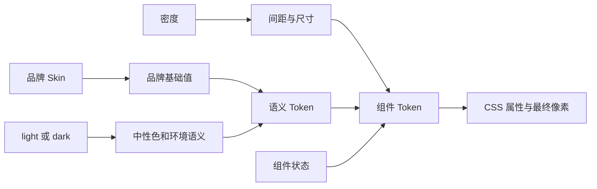
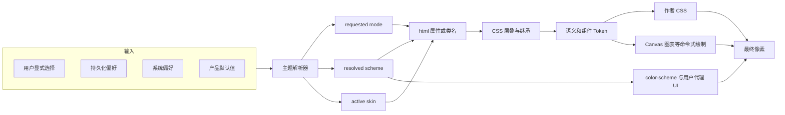
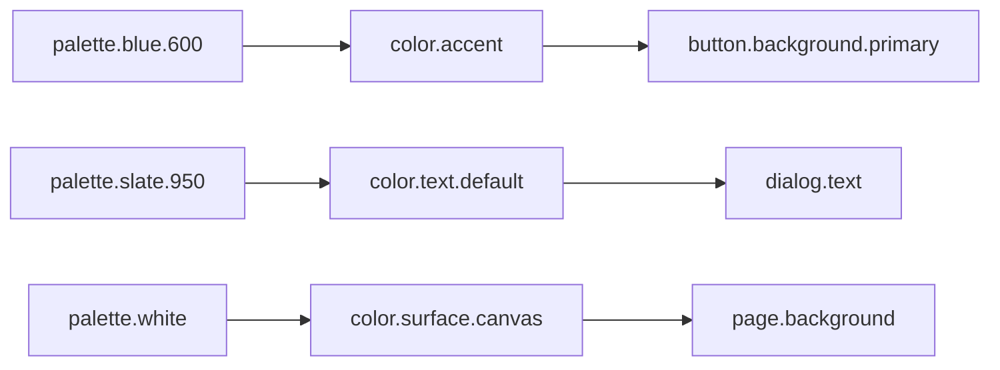
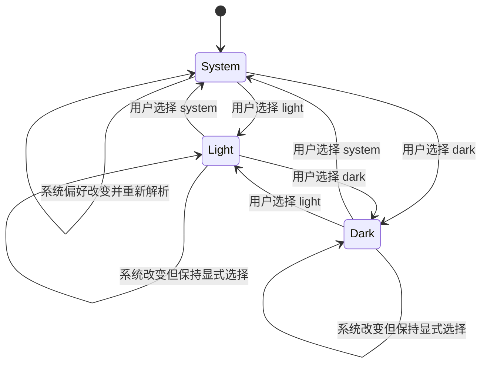
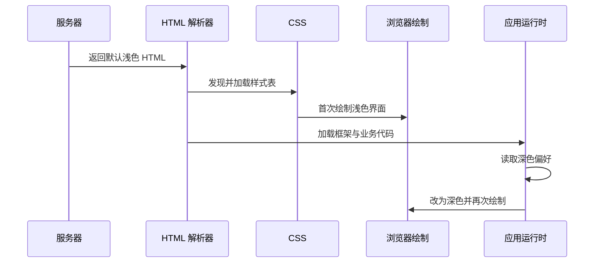
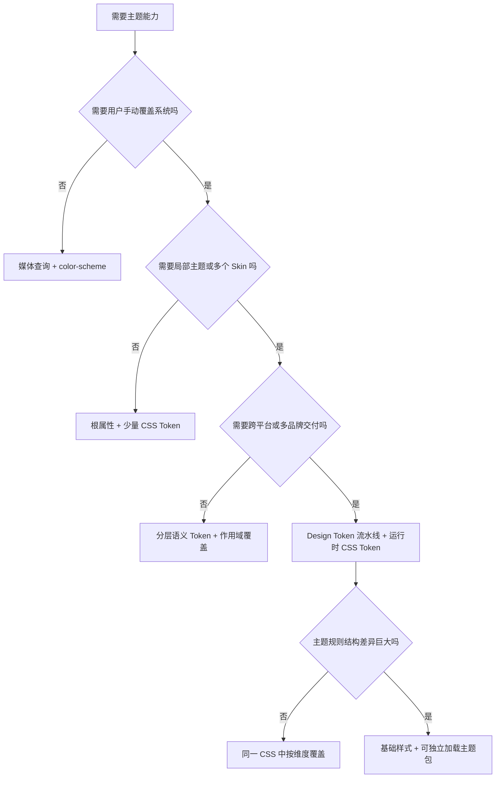

# 前端主题系统：从换肤、深浅模式到 Design Token 架构

前端“换肤”与深浅模式表面上是在替换颜色，真正需要解决的却是一个状态到渲染的映射问题：偏好来自哪里，哪一层拥有最终决定权，主题值如何进入组件，浏览器原生控件和 Canvas 等非 CSS 内容怎样同步，以及首屏、服务端渲染、跨标签页和辅助功能模式下能否保持一致。

最值得先记住的结论是：

- **换肤**通常是在替换一套视觉身份，例如品牌色、圆角、阴影或插图；**深浅模式**是在不同环境亮度下选择合适的颜色方案。两者可以组合，不应天然绑成两套重复样式。
- 类名、`data-*` 属性、媒体查询、动态样式表和 Theme Provider 的共同本质，都是改变“哪些样式声明或主题值在当前上下文中生效”。
- CSS 自定义属性适合做运行时主题载体，不是因为它只是“变量”，而是因为它进入 CSS 层叠、继承和 computed value 求值过程。
- `prefers-color-scheme`、`color-scheme` 与 `light-dark()` 分工不同：分别处理偏好检测、页面支持声明与用户代理绘制、按最终颜色方案选择值。
- `system` 是应用层的请求模式，不是第三种颜色方案。它最终仍需解析成 `light` 或 `dark`。
- Design Token 描述和组织主题数据，但不会自动完成状态解析、首屏初始化、跨边界传播或组件切换。

本文把可核验事实、工程推论和环境相关结论分开。标准行为主要依据 CSSWG、WHATWG、W3C 和 Design Tokens Community Group 的材料；浏览器兼容性查证日期为 2026-09-08。

## 主题不是一个布尔开关

工程中常把 `isDark` 当作主题状态。只要需求扩展到多个品牌、局部主题或系统跟随，这个模型就会失真。至少需要区分四个概念：

- **主题（theme）**：一组影响界面表现的规则和设计决策，可以包含颜色、字体、间距、形状、阴影和素材。
- **皮肤（skin）**：本文用它表示品牌或视觉风格维度，例如 Ocean 与 Orchid。它是工程工作定义，不是 Web 平台中的规范术语。
- **颜色方案（color scheme）**：浏览器和 CSS 规范中的概念，最常见的是 light 与 dark。它会影响作者颜色选择，也会影响浏览器绘制的默认画布、表单控件和滚动条等内容。[CSS Color Adjustment 对 color scheme 的定义](https://drafts.csswg.org/css-color-adjust-1/#color-scheme)
- **Design Token**：带名称的设计决策数据及其关系，例如 `color.text.default` 指向某个具体颜色。它可以被转换为 CSS 变量、JavaScript 常量或原生端资源，但它本身不是切换器。[Design Tokens Format Module 2025.10 Draft](https://www.designtokens.org/tr/drafts/format/)

一个产品可能具有如下维度：

```text
品牌皮肤：Ocean | Orchid | Partner-A
颜色模式：light | dark
密度：comfortable | compact
组件状态：default | hover | active | disabled | danger
作用域：全局 | 页面 | 局部容器 | 单组件
```

如果把每个维度做成完整主题包，三种品牌、两种明暗和两种密度就会产生 `3 × 2 × 2 = 12` 套组合，还未计入组件状态。更稳健的设计是让各维度只提供自己负责的数据，再在语义 Token 层组合。



这张图的重点不是要求每个项目都建五层文件，而是明确所有权：品牌不应重新定义布局，深浅模式不应复制组件结构，组件状态也不应直接读取全局的 `isDark`。

## 从偏好到像素：主题系统的核心运行链

主题切换可以还原为一条因果链：



任一种实现方案都必须回答链上的问题，只是把职责放在不同层：

- 纯媒体查询把系统偏好直接交给 CSS，解析器非常薄，但无法单独表达用户覆盖。
- 根节点属性加 CSS 自定义属性把解析交给 JavaScript，把值传播交给 CSS。
- 独立样式表把主题选择转化为资源选择。
- CSS-in-JS Theme Provider 把主题状态放入框架上下文，再生成或选择样式。
- Token 构建流水线负责生产主题值，却仍需要运行时决定加载或激活哪一组值。

### CSS 自定义属性为何成为主流载体

[CSS Custom Properties Level 1](https://www.w3.org/TR/css-variables-1/) 定义的自定义属性会参与层叠，可以继承，并在 `var()` 使用位置参与 computed value 求值。它与 Sass 变量有一个根本差别：Sass 变量在构建时被替换，浏览器看不到；CSS 自定义属性存在于运行时的样式树中。

```css
:root {
  --color-surface: #fff;
  --color-text: #17212b;
}

:root[data-scheme="dark"] {
  --color-surface: #101820;
  --color-text: #f3f7fa;
}

.card {
  color: var(--color-text);
  background: var(--color-surface);
}
```

当根节点属性改变时，组件规则本身没有换掉；变化的是 `var()` 解析得到的值。浏览器会重新进行受影响的样式计算，并根据最终改变的 CSS 属性决定后续布局、绘制与合成工作。不能由此推出“CSS 变量切换永远只重绘”或“永远比替换样式表快”：如果变量进入尺寸、字体或布局属性，仍可能触发布局。

自定义属性也有容易被忽略的失败路径：

- `var(--missing, fallback)` 只在引用的自定义属性缺失或无效时使用 fallback，不会替你验证某个业务颜色是否满足对比度。
- 自定义属性循环依赖会使相关值在 computed-value time 无效。
- 拼写正确但语义错误的值仍然合法，例如把边框色 Token 错接到背景色。
- 未注册的自定义属性默认继承；局部覆盖可能穿过比预期更大的 DOM 子树。
- 高 specificity 的组件选择器不会阻止变量继承，但可能阻止直接属性声明覆盖，因此应区分“覆盖 Token”和“覆盖组件 CSS”。

### `prefers-color-scheme` 只提供偏好输入

[Media Queries Level 5](https://drafts.csswg.org/mediaqueries-5/#prefers-color-scheme) 定义 `prefers-color-scheme`，用于检测用户对 light 或 dark 颜色方案的偏好。MDN 在查证日将其标记为广泛可用，但标准定义和兼容性数据承担不同责任：[MDN prefers-color-scheme](https://developer.mozilla.org/en-US/docs/Web/CSS/@media/prefers-color-scheme)。

```css
:root {
  --color-canvas: #fff;
  --color-text: #18232d;
}

@media (prefers-color-scheme: dark) {
  :root {
    --color-canvas: #101820;
    --color-text: #f2f7fa;
  }
}
```

这是一条优秀的无 JavaScript 基线：首次绘制可以直接使用系统偏好。然而它不能单独表示“用户在深色系统中明确选择浅色”。一旦产品支持显式覆盖，就要增加状态解析，并确保显式属性的层叠顺序能覆盖媒体查询。

### `color-scheme` 协调作者页面与浏览器绘制

`color-scheme` 声明元素支持哪些颜色方案。[CSS Color Adjustment Level 1](https://drafts.csswg.org/css-color-adjust-1/#color-scheme-prop) 说明最终使用的颜色方案会影响画布背景、默认文本、表单控件、滚动条等用户代理绘制内容。它不会自动把作者写死的 `background: white` 改成深色。

```css
:root {
  color-scheme: light dark;
}

:root[data-scheme="light"] {
  color-scheme: light;
}

:root[data-scheme="dark"] {
  color-scheme: dark;
}
```

第一条表示页面能支持两种模式，让浏览器结合用户偏好选择；后两条适合已有应用级解析器的场景，把最终结果明确传给用户代理。若只切作者颜色而漏掉 `color-scheme`，常见结果是页面已经变暗，但输入框、下拉框或滚动条仍像浅色界面。

HTML 还允许使用 `<meta name="color-scheme" content="light dark">` 提前提供页面支持信息。它是加载早期提示，不能替代组件级样式或应用状态。

### `light-dark()` 消除部分重复值，不替代主题架构

[CSS Color Level 5](https://drafts.csswg.org/css-color-5/#light-dark) 定义 `light-dark(lightValue, darkValue)`：它根据元素最终采用的 color scheme 选择值，而不是直接读取 `prefers-color-scheme`。在查证日，CSS Color Level 5 仍是编辑草案；MDN 将该函数标记为自 2024 年 5 月起进入 Baseline Newly available，因此面向较旧浏览器时仍需回退：[MDN light-dark()](https://developer.mozilla.org/en-US/docs/Web/CSS/color_value/light-dark)。

```css
:root {
  color-scheme: light dark;
}

.card {
  background: #fff;
}

[data-scheme="dark"] .card {
  background: #17242d;
}

@supports (background: light-dark(#fff, #17242d)) {
  [data-scheme] .card {
    background: light-dark(#fff, #17242d);
  }
}
```

它适合表达一对明暗值，但不能处理：

- 用户请求、持久化与系统偏好的优先级；
- 多品牌 Skin；
- Canvas 或图表库的重绘；
- 服务端首屏与 hydration；
- Token 命名、审查与跨平台分发。

所以 `light-dark()` 是值层的能力，不是完整主题系统。

## 常见实现方式：选择的是责任分配，不是语法偏好

下表比较的是架构性质。具体性能和体积取决于规则规模、主题数量、缓存、切换频率和框架实现，不做无条件排名。

| 方案 | 切换时机 | 运行时覆盖 | 局部主题 | 首屏特征 | 主要代价 | 适合场景 |
| --- | --- | --- | --- | --- | --- | --- |
| 主题选择器下重复完整规则 | 运行时层叠 | 支持 | 支持，但重复多 | 可由属性或媒体查询提前决定 | 组件 CSS 成倍增长，容易漂移 | 小型旧项目、迁移过渡 |
| 根属性/类名 + CSS 自定义属性 | 运行时求值 | 强 | 强 | 需提前设置根属性，或以媒体查询为基线 | Token 边界、命名和 fallback 需要治理 | 大多数 Web 应用 |
| 纯 `prefers-color-scheme` | CSS 媒体查询 | 不支持显式覆盖，除非再加机制 | 可通过局部规则补充 | 无 JS 也能首屏正确 | 只能表达系统偏好 | 内容站、无手动切换需求 |
| 独立 `<link>` 样式表 | 资源激活/替换 | 支持 | 较弱 | 可服务端输出正确 link；客户端换包可能闪烁 | 网络、缓存、切换原子性和重复规则 | 大型完全独立皮肤、白标产品 |
| Sass/Less/PostCSS 构建多套主题 | 构建期 | 需配合样式表或属性选择 | 取决于产物 | 由产物加载策略决定 | 构建组合爆炸，运行时没有源变量 | 必须兼容旧环境或生成多端资产 |
| CSS-in-JS / Theme Provider | 运行时框架上下文 | 强 | 强 | 依赖框架 SSR、样式注入与 hydration 策略 | 运行时成本、框架耦合、服务端一致性 | 已采用相应样式体系的组件应用 |
| Design Token 编译流水线 | 构建期生产数据 | 单独看不提供 | 取决于目标产物 | 取决于 CSS/JS/原生端消费方式 | 转换规则、版本和别名治理 | 跨 Web、iOS、Android 和设计工具 |
| Token 编译 + CSS 变量 | 构建期治理，运行时切换 | 强 | 强 | 可用早期属性或服务端输出 | 系统复杂度高于单一 CSS 文件 | 多品牌、多端、长期演进产品 |

### 重复完整主题规则

```css
.theme-light .button {
  color: #17212b;
  background: #fff;
}

.theme-dark .button {
  color: #f5f7fa;
  background: #17212b;
}
```

它的优点是直观，且能在没有 CSS 自定义属性的遗留环境中工作。问题不在于类名，而在于每个组件的结构、状态和主题值被复制在一起。新增 `hover`、`disabled` 或第三套皮肤时，各分支很容易出现行为漂移。

迁移时可以保留根选择器，只把重复值抽为 Token：

```css
.theme-light {
  --button-text: #17212b;
  --button-bg: #fff;
}

.theme-dark {
  --button-text: #f5f7fa;
  --button-bg: #17212b;
}

.button {
  color: var(--button-text);
  background: var(--button-bg);
}
```

### 根类名与 `data-*` 属性

二者对 CSS 层叠没有本质优劣：

```css
.theme-dark { /* ... */ }
[data-scheme="dark"] { /* ... */ }
```

类名更短，`data-*` 更容易表达多个命名维度：

```html
<html data-theme="system" data-scheme="dark" data-skin="ocean">
```

这里：

- `data-theme` 保存用户请求，可以是 `system`；
- `data-scheme` 保存解析后的 `light | dark`；
- `data-skin` 保存品牌维度。

不要只写 `data-theme="system"` 然后要求所有组件自行调用媒体查询。那会把同一个解析责任分散到 CSS、JavaScript、图表和第三方组件中。

### 独立样式表

独立样式表适合规则结构本身差异很大的主题，或需要按客户拆分白标资源的产品：

```html
<link rel="stylesheet" href="base.css">
<link id="active-theme" rel="stylesheet" href="themes/ocean-dark.css">
```

需要注意：切换 `disabled`、修改 `href`、使用 `rel="alternate stylesheet"` 或动态插入 `<link>` 的下载和激活行为并不完全相同。“禁用”不等于“浏览器一定没有下载”。若首屏才发起新主题请求，还要处理旧主题到新主题之间的空窗、失败回退和缓存。

### 构建期预处理器

Sass 变量可以减少源码重复，却不会自动提供运行时切换：

```scss
$surface: #fff;

.card {
  background: $surface;
}
```

构建完成后浏览器只看到 `background: #fff`。要运行时切换，仍需生成多套选择器、多个样式表，或让构建产物包含 CSS 自定义属性。预处理器解决的是作者阶段复用，不是浏览器运行时状态传播。

### CSS-in-JS 与 Theme Provider

Theme Provider 通常把主题对象放进框架上下文，组件读取后生成类名、内联变量或样式规则。它的价值在于：

- 与组件 props、类型系统和包级 Token API 集成；
- 能在组件树中建立局部 Provider；
- 适合已有 CSS-in-JS 基础设施的代码库。

但它不会自动解决首屏。如果服务器生成浅色样式，而客户端 Provider 首次运行后选择深色，仍可能闪烁或 hydration 不一致。还应检查主题切换是只修改少量根变量，还是为大量组件重新生成规则；不同库不能混为一个性能结论。

## Token 架构：让组件依赖语义，而不是色板

### 三层依赖模型



- **基础值 Token**描述可复用的原始值，例如色板或尺寸刻度。它回答“值是什么”。
- **语义 Token**描述用途，例如主文本、画布、强调色、危险状态。它回答“为什么使用”。
- **组件 Token**描述组件契约，例如主要按钮背景。它允许少数组件偏离全局语义，但不应成为每个属性的机械镜像。

如果按钮直接依赖 `palette.blue.600`，品牌皮肤切到紫色时必须改组件；如果依赖 `color.action.primary`，只需改变语义映射。反过来，也不要把每个 CSS 属性都包装成 Token，否则依赖图会比原始 CSS 更难理解。

### 多轴组合

下面的写法让 Skin 只负责品牌基础值，让 Scheme 负责环境语义：

```css
@layer tokens, components;

@layer tokens {
  :root[data-skin="ocean"] {
    --brand-accent-light: #0569a8;
    --brand-accent-dark: #65c6ff;
  }

  :root[data-skin="orchid"] {
    --brand-accent-light: #8a3ffc;
    --brand-accent-dark: #d5b8ff;
  }

  :root[data-scheme="light"] {
    --color-accent: var(--brand-accent-light);
    --color-surface: #fff;
    --color-text: #152635;
  }

  :root[data-scheme="dark"] {
    --color-accent: var(--brand-accent-dark);
    --color-surface: #101f29;
    --color-text: #eef7fc;
  }
}

@layer components {
  .button {
    color: var(--color-surface);
    background: var(--color-accent);
  }
}
```

[CSS Cascade Level 5](https://www.w3.org/TR/css-cascade-5/) 中的 cascade layers 可以明确 Token、组件和覆盖层之间的顺序，但它不能替代良好的命名和所有权。过度使用 `!important` 会使用户样式、强制颜色模式和局部覆盖更难工作。

### Design Token 文件不是运行时

Design Tokens Community Group 的 Format Module 描述交换格式、类型、分组和别名等概念。其价值在于让设计工具、构建工具和多端产物共享一个可审计的数据源。典型链路是：

```text
tokens.json
  ├─> Web CSS custom properties
  ├─> TypeScript token names
  ├─> iOS color assets
  └─> Android resources
```

仍需由项目自己定义：

- 哪些 Token 可以在运行时覆盖；
- 如何表达 brand 与 scheme 两个维度；
- 别名循环、缺失值和类型错误如何使构建失败；
- Token 删除与重命名如何版本化；
- CSS 产物是一个文件、多文件还是分层规则；
- 用户选择如何解析并持久化。

截至查证日，Format Module 2025.10 页面仍明确标为 Draft，因此应把它作为正在形成的互操作格式，而不是浏览器原生标准。

### 局部作用域、Shadow DOM 与 Portal

局部主题可以在任意容器覆盖语义 Token：

```css
.dark-preview {
  color-scheme: dark;
  --color-surface: #101820;
  --color-text: #f5f7fa;
}
```

普通后代会通过继承获得这些值。Shadow DOM 是独立的样式封装树，外部普通选择器不能直接匹配内部节点；但宿主上的可继承自定义属性可以成为组件显式支持的主题契约。[DOM Standard：shadow trees](https://dom.spec.whatwg.org/#shadow-trees)

这不意味着所有 Web Component 都会自动换肤：内部 CSS 必须消费这些 Token，并且组件作者要定义公共 Token 的稳定性。

Portal 或全局弹层常被挂到 `body`，它不再是原组件容器的 DOM 后代，因此可能丢失局部 Token。解决方式包括：把主题属性复制到 Portal 根、由 Provider 显式传递主题，或把弹层挂到保留主题作用域的容器。这里的关键不是 React 或 Vue API，而是 DOM 所有权和继承路径已经改变。

## 状态模型：请求模式与最终模式必须分离

### 三态请求、两态解析

一个可靠的深浅模式通常是：

```text
requested mode = system | light | dark
system scheme  = light | dark
resolved scheme = requested === system ? system scheme : requested
```

状态转换可以表示为：



`system` 不应该被映射成第三套 Token。它是一项策略：当前解析结果跟随系统，并在系统偏好变化时重新解析。

### 输入优先级

常见优先级是：

```text
当前用户操作
  > 已持久化的用户请求
  > 系统偏好
  > 产品默认值
```

真正重要的是把优先级写成一个纯解析函数，而不是散落在组件生命周期中：

```js
function resolveScheme(requestedMode, systemScheme) {
  return requestedMode === "system" ? systemScheme : requestedMode;
}
```

应用 Store 可以保存 `requestedMode`，DOM 保存或暴露 `resolvedScheme`，但二者不能各自独立修改对方。若 CSS 读取 `data-scheme`，图表读取 Store 中另一个 `isDark`，两处迟早会不同步。

### 监听系统变化

[CSSOM View 的 `matchMedia()`](https://drafts.csswg.org/cssom-view/#dom-window-matchmedia) 返回 `MediaQueryList`，应用可以监听 `change`：

```js
const systemQuery = matchMedia("(prefers-color-scheme: dark)");

systemQuery.addEventListener("change", () => {
  if (requestedMode === "system") {
    applyResolvedScheme(systemQuery.matches ? "dark" : "light");
  }
});
```

显式 light/dark 模式下仍可更新调试面板里的 system scheme，但不应覆盖用户请求。切回 `system` 时必须立即根据当前查询结果重新解析，不能依赖下一次 `change` 事件。

### 持久化与跨标签页

[WHATWG Web Storage](https://html.spec.whatwg.org/multipage/webstorage.html) 定义 `localStorage` 与 `storage` 事件。工程上需要处理三个边界：

1. `localStorage` getter 或写入可能因 origin 或策略决定而抛出 `SecurityError`，主题初始化不能因此阻止页面启动。
2. `storage` 事件发送给共享相应存储区域的其他文档，不在执行写入的同一窗口上重复发送。
3. `file:` URL 下的 `localStorage` 行为不应被当作稳定契约，所以配套 Demo 使用本地 HTTP 服务。

```js
function readRequestedMode() {
  try {
    const value = localStorage.getItem("theme.mode");
    return ["system", "light", "dark"].includes(value) ? value : "system";
  } catch {
    return "system";
  }
}
```

存储值也必须校验。旧版本、手工修改或其他代码都可能写入未知字符串；失败时回退到 `system`，不要把未知值直接拼进选择器。

若服务器需要在首次响应时知道主题，Cookie 比 `localStorage` 更直接，因为浏览器会随请求发送 Cookie。代价是：需要明确隐私、缓存键、过期和服务端默认策略；不能为了消除闪烁就无条件把客户端偏好扩张成服务端跟踪数据。

## 第一帧：为什么最终正确仍然会闪一下

假设 HTML 默认是浅色，应用在 hydration 或 `DOMContentLoaded` 之后才读取深色偏好：



这不是“切换动画不好看”，而是第一帧使用了错误状态。主要策略如下。

### 策略一：纯 CSS 系统跟随

如果没有手动覆盖，只使用 `prefers-color-scheme`，CSS 在首次绘制前就能选中相应规则。它最简单，也天然支持无 JavaScript 场景。

边界是无法表达“系统深色但网站固定浅色”。

### 策略二：样式表之前执行最小解析脚本

```html
<script>
  try {
    const requested = localStorage.getItem("theme.mode") || "system";
    const system = matchMedia("(prefers-color-scheme: dark)").matches ? "dark" : "light";
    const resolved = requested === "system" ? system : requested;
    document.documentElement.dataset.scheme = resolved;
    document.documentElement.style.colorScheme = resolved;
  } catch {
    document.documentElement.dataset.scheme = "light";
  }
</script>
<link rel="stylesheet" href="app.css">
```

脚本要小、同步、无依赖，并位于可能产生首次绘制的样式发现之前。代价包括：

- 初始化逻辑容易与应用内解析器重复，必须共享常量或通过 DOM 状态交接；
- 内联脚本受 Content Security Policy 约束，需要合适的 nonce 或 hash，而不是放宽为不安全的通配策略。[Content Security Policy Level 3：script-src](https://www.w3.org/TR/CSP3/#directive-script-src)
- 存储访问必须失败可恢复；
- 脚本越大，越会阻塞 HTML 解析。

配套 Demo 把早期脚本的解析结果放到 `window.__THEME_BOOT__`，应用启动时以它为初始状态，再根据当前媒体查询校正，避免建立两个长期真相源。

### 策略三：服务端输出正确属性

服务器读取 Cookie 后直接输出：

```html
<html data-theme="dark" data-scheme="dark">
```

它能让 HTML、CSS 和框架初始状态一致，但需要考虑：

- 缓存是否按 Cookie 或主题分片；
- 未登录用户和首次访问没有 Cookie 时的默认值；
- `system` 请求在服务端通常不知道当前设备的即时偏好；
- 流式渲染开始后再决定主题可能已经太晚；
- 客户端 Store 必须从服务器输出的同一状态开始 hydration。

“服务端一定优于早期脚本”并不成立。内容站、账户型应用、边缘缓存和严格 CSP 环境的约束不同。

### 首屏方案对比

| 方案 | 显式用户覆盖 | 无 JS | 服务端可知 | CSP 压力 | 主要风险 |
| --- | --- | --- | --- | --- | --- |
| 纯媒体查询 | 否 | 是 | 不需要 | 低 | 无法覆盖系统偏好 |
| 早期内联解析 | 是 | 回退为 CSS 默认 | 否 | 高 | 脚本重复、阻塞、nonce/hash 管理 |
| 外部同步初始化脚本 | 是 | 回退为 CSS 默认 | 否 | 较低 | 新增请求或缓存依赖，仍阻塞解析 |
| Cookie + SSR | 是 | 是 | 是 | 低 | 缓存、隐私和 system 模式解析 |
| SSR 默认 + 客户端 effect | 是 | 是 | 部分 | 低 | 最容易出现错误主题闪烁 |

## 主题传播到 CSS 之外时会在哪里中断

### 浏览器原生控件

`color-scheme` 是协调作者主题和用户代理 UI 的关键。应检查 input、select、textarea、checkbox、滚动条、默认焦点样式和自动填充，而不只是应用卡片背景。[MDN color-scheme](https://developer.mozilla.org/en-US/docs/Web/CSS/color-scheme)

不要为了视觉一致性完全重画所有原生控件而丢失可访问性、平台行为和输入状态。若必须定制，主题测试矩阵应覆盖每个状态。

### SVG 和图标

内联 SVG 可以使用 `currentColor`，它会把 CSS `color` 属性的当前值用于填充或描边：[CSS Color Level 4：currentColor](https://www.w3.org/TR/css-color-4/#currentcolor-color)。

```html
<svg viewBox="0 0 24 24" aria-hidden="true">
  <path fill="currentColor" d="...">
</svg>
```

外链 SVG、`` 和跨文档内容不会像普通后代一样继承父页面 CSS 自定义属性。`prefers-color-scheme` 在嵌入 SVG 和 iframe 中存在规范定义的颜色方案传播行为，但这不等于任意父页面 Token 会跨文档继承。[MDN：embedded elements 的颜色方案](https://developer.mozilla.org/en-US/docs/Web/CSS/@media/prefers-color-scheme#embedded_elements)

### 图片与 `<picture>`

```html
<picture>
  <source media="(prefers-color-scheme: dark)" srcset="hero-dark.webp">
  
</picture>
```

这个写法跟随系统媒体查询，不会自动识别应用的 `data-scheme="dark"` 显式覆盖。若产品允许手动切换，可以：

- 让两张图片进入 DOM，由根属性控制显示；
- 在切换时更新 `src`/`srcset`；
- 使用支持 CSS Token 的 SVG 或 CSS 背景；
- 选择在两种背景上都成立的中性素材。

这里还要权衡预加载和切换延迟：隐藏两张图可能增加下载，动态换 `src` 可能首次切换才请求资源。

### 浏览器外壳颜色

`<meta name="theme-color">` 可以向支持的浏览器建议页面周围 UI 的颜色。[HTML Standard：theme-color](https://html.spec.whatwg.org/multipage/semantics.html#meta-theme-color) 支持通过 `media` 提供不同候选，但媒体查询同样只认识环境条件，不认识应用的根属性。支持显式覆盖时，可由 JavaScript根据当前语义 Token 更新 meta 内容，并把这项行为纳入移动端验证，而不是由桌面截图推断。

### Canvas、WebGL 与图表库

Canvas 2D 是命令式位图绘制。调用 `fill()` 或 `stroke()` 后，已有像素不会保留对 CSS 变量的引用。[HTML Canvas 2D](https://html.spec.whatwg.org/multipage/canvas.html#the-canvas-element) 因此主题切换必须：

1. 从 computed style 或主题对象读取新颜色；
2. 清空画布；
3. 以新颜色重绘；
4. 处理 DPR、尺寸变化和动画中的旧帧。

图表库、代码编辑器和地图通常有自己的 Theme API。稳健适配是建立一个适配层，把产品语义 Token 转成第三方库的主题对象，而不是让业务组件维护第二套独立色板。

### iframe、微前端和跨源边界

iframe 是独立文档。父页面 CSS 变量不会像 DOM 后代属性一样进入 iframe：

- 同源 iframe 可以通过约定的 DOM 属性、共享模块或消息同步；
- 跨源 iframe 需要显式协议，例如经过 origin 校验的 `postMessage`；
- 子应用必须声明支持哪些主题版本以及未知 Token 如何回退；
- 父应用不能把可用的 `postMessage` 当成授权，跨源消息仍需校验来源和数据结构。

`prefers-color-scheme` 的嵌入行为只能解决颜色方案输入，不能承担任意品牌 Token 协议。

## 可访问性：每套主题都是一个独立待验收界面

### 对比度和非颜色线索

[WCAG 2.2 的 Contrast (Minimum)](https://www.w3.org/TR/WCAG22/#contrast-minimum) 要求普通文本至少 4.5:1，较大文本至少 3:1，并列出相应例外；[Non-text Contrast](https://www.w3.org/TR/WCAG22/#non-text-contrast) 对理解组件与图形所需的视觉信息提出 3:1 要求。[Use of Color](https://www.w3.org/TR/WCAG22/#use-of-color) 则要求颜色不是传递信息、操作或状态的唯一视觉手段。

这意味着不能只验证默认浅色页面：

- 文本、链接、占位符和禁用态分别测试；
- focus ring 要同时区别于背景和控件边界；
- 错误状态除红色外还需要文字或图标；
- 图表系列不能只靠颜色区分；
- 半透明叠加要根据实际合成后的颜色计算，而不是只比较 Token 字面值。

自动对比度计算适合发现问题，但不能证明所有视觉状态和背景组合都符合要求。

### 强制颜色模式

`forced-colors` 表示用户代理正在强制使用有限颜色调色板。[CSS Color Adjustment：forced-colors](https://drafts.csswg.org/css-color-adjust-1/#forced-colors-media-feature) 和 [MDN forced-colors](https://developer.mozilla.org/en-US/docs/Web/CSS/@media/forced-colors) 都强调这不是普通深色主题。

```css
@media (forced-colors: active) {
  .card {
    border-color: CanvasText;
    box-shadow: none;
  }

  .selected-indicator {
    color: HighlightText;
    background: Highlight;
  }
}
```

不要在大范围容器上设置 `forced-color-adjust: none` 来对抗用户选择。它只应在确实需要保留颜色含义、且提供了可访问替代的局部元素上谨慎使用。

### 动效偏好

主题切换时给 `*` 添加 `transition: all` 会让大量属性参与动画，既可能昂贵，也可能让用户经历明显闪烁。只为必要的颜色、边框和阴影添加过渡，并尊重 [Media Queries Level 5 的 `prefers-reduced-motion`](https://drafts.csswg.org/mediaqueries-5/#prefers-reduced-motion)：

```css
@media (prefers-reduced-motion: reduce) {
  .theme-transition {
    transition: none;
  }
}
```

首次启动时也不应从默认主题动画到真实主题。可以等首个正确状态应用后再添加允许过渡的 `data-ready` 标记。

## 性能、可靠性与安全取舍

### 不要问“哪种方案最快”，先问改变了什么

主题切换可能产生不同成本：

- 改根自定义属性：受影响后代重新计算样式，后续成本取决于变量进入哪些属性。
- 切完整主题类：匹配规则和属性都可能变化。
- 替换样式表：可能产生网络、解析和整表规则变化；缓存命中与否影响很大。
- CSS-in-JS：可能只改根变量，也可能重新生成组件样式，取决于库和写法。
- 切图片、字体和图表：可能触发资源加载、布局或命令式重绘。

可靠的 benchmark 要记录浏览器版本、设备、DOM 规模、规则数量、预热、切换次数和统计方法。没有这些前提，本文不提供“一定更快”的排名。

### 可靠性检查

- 解析函数对未知模式和未知 Skin 有确定回退。
- 存储读写使用 `try/catch`，失败时页面仍可用。
- system 模式监听系统变化，显式模式忽略系统覆盖。
- 根属性、应用 Store、浏览器 `color-scheme` 与图表适配层使用同一个解析结果。
- 主题资源加载失败时保留可读的基础主题。
- 跨标签页同步不会形成“收到 storage 事件后再次写入”的循环。
- 组件卸载时清理监听器；长期单页应用避免重复注册。

### 安全边界

- 不把未经校验的持久化字符串拼成样式表 URL，避免任意资源请求。
- 不把用户可控 Token 直接拼成 `<style>` 或 CSS 文本；若产品允许自定义颜色，使用受约束的数据模型和 CSSOM 属性赋值。
- 跨源 iframe 的主题消息校验 `origin`、消息类型与允许值。
- 早期内联脚本遵守 CSP nonce/hash 策略，不通过 `unsafe-inline` 省略设计。
- 主题偏好通常不敏感，但若写入 Cookie 并发送到服务端，仍应控制作用域、寿命和不必要的传播。

## 如何选择方案



这是起点，不是自动答案：

- **只有系统深浅模式的内容站**：优先媒体查询、`color-scheme` 和少量 `light-dark()`，保持无 JS。
- **有手动切换的单品牌应用**：根属性 + 语义 CSS Token + 三态解析器通常足够。
- **需要局部预览、编辑器或嵌入组件**：增加作用域 Token 契约，明确 Portal 与 Shadow DOM 边界。
- **多品牌白标产品**：先分离品牌轴和明暗轴，再决定是同包覆盖还是独立主题资源。
- **跨 Web 与原生端设计系统**：让 Design Token 源承担数据交换和审查，Web 端仍使用适合浏览器的运行时载体。
- **遗留浏览器或结构差异极大的皮肤**：构建多套 CSS 仍可能合理，不必为了“现代”强行共享所有规则。

## 生产失败模式及定位顺序

### 首屏闪烁

定位顺序：服务器输出的初始属性 → 早期脚本顺序 → CSS 默认规则 → 应用初始化 → hydration。不要先通过延迟显示整个页面掩盖状态不一致。

### 原生控件颜色错误

检查最终 `color-scheme`，再检查作者是否完全重置了控件外观。只改背景 Token 不会通知用户代理。

### system 模式不随系统变化

检查是否把 `system` 在初始化时永久转换为 `dark`，从而丢失“继续跟随”的请求语义；然后检查媒体查询监听器是否重复注册或已清理。

### 局部主题在弹层中失效

检查弹层实际挂载位置。若 Portal 在 `body` 下，它不再继承局部容器的 Token，需要显式传递主题作用域。

### 图表仍是旧颜色

检查主题事件是否到达图表适配层、是否读取了更新后的 computed style、是否清空旧像素，以及图表实例是否缓存了旧配置。

### 深色模式“对比度看起来更高”但仍不可读

检查半透明前景与实际背景的合成值、disabled/placeholder/focus 等状态，以及高对比度或强制颜色模式。视觉印象不能替代状态矩阵。

### 多标签页互相覆盖

确认 `storage` 处理器只更新本地状态，不把收到的值立即无条件写回。对每个存储键独立校验，删除键时使用确定默认值。

## 验收矩阵

| 维度 | 最小检查 | 不能由它证明的范围 |
| --- | --- | --- |
| 请求模式 | system/light/dark 均可选择，非法值回退 | 操作系统偏好切换是否真实工作 |
| 系统变化 | system 跟随，显式模式保持 | 所有浏览器和 OS 行为一致 |
| 首屏 | 冷启动、刷新、缓存命中时属性在首绘前正确 | 真实 SSR、CDN、流式传输和生产 CSP |
| 持久化 | 刷新保留、清除恢复、存储异常可用 | 隐私模式和组织策略下的全部行为 |
| 跨标签页 | 其他标签接收变化且不循环写入 | 跨 origin、跨设备同步 |
| CSS 组件 | 文本、背景、边框、hover、focus、disabled | Canvas、图片、iframe 自动同步 |
| 渲染边界 | 原生控件、SVG、Canvas、第三方库分别检查 | 一个边界通过可替代其他边界 |
| 可访问性 | 每套主题的对比度、非颜色线索、键盘焦点 | 自动扫描等于人工辅助技术验收 |
| 响应式 | 窄、宽视口下控件和内容可用 | 真实移动设备浏览器外壳 |
| 兼容性 | 目标浏览器矩阵中的真实运行 | 构建成功等于浏览器支持 |

建议把主题解析器提取为纯函数做单元测试，把 Token 与关键选择器做静态契约检查，再用真实浏览器覆盖系统媒体模拟、交互、持久化、跨标签页、首屏和控制台。三类验证回答不同问题，不能互相冒充。

## 配套 Demo：沿链路观察主题变化

Demo 位于 [`theme-systems-demo/`](./theme-systems-demo/)，使用原生 HTML、CSS 和 JavaScript，不依赖框架或第三方包。它同时提供：

- system/light/dark 请求模式；
- Ocean/Orchid 两套品牌 Skin；
- requested、system、resolved 三种状态显示；
- 基础值、语义 Token 和组件消费层；
- `color-scheme`、带回退的 `light-dark()`、原生表单；
- 局部主题作用域；
- 继承 `currentColor` 的 SVG；
- 在主题变化时显式重绘的 Canvas；
- `localStorage`、非法值回退和跨标签页 `storage` 同步；
- `prefers-reduced-motion` 与 `forced-colors` 基础处理；
- 样式表发现前执行的最小主题初始化。

从仓库根目录运行静态与 HTTP 契约检查：

```bash
node learn/frontend/theming/theme-systems-demo/verify.mjs
```

运行本机 Chrome/Chromium 交互验证：

```bash
node learn/frontend/theming/theme-systems-demo/browser-verify.mjs
```

本次在 2026-09-08 使用 Node.js 22.16.0 与 Google Chrome 152.0.7977.76 完成实际验证：

- 静态检查验证了启动脚本位于样式表之前、Token/媒体查询契约、JavaScript 语法、本地 HTTP 响应与关键颜色组合的对比度；
- Chrome 验证覆盖系统深浅模式模拟、显式模式优先级、`light-dark()` 支持、`forced-colors` 模拟、持久化、非法存储值回退、双标签页 `storage` 同步、局部 `color-scheme`、Canvas 重绘和控制台错误；
- 通过设备指标模拟检查了 390px 与 1440px 视口，没有出现文档级水平溢出；
- 这些结果不外推为 Safari、Firefox、移动设备、真实操作系统高对比度模式、生产 SSR/CDN 或 CSP 验收。

脚本会使用系统中的 Chrome；找不到时可显式提供路径：

```bash
THEME_DEMO_CHROME="/path/to/chrome" \
  node learn/frontend/theming/theme-systems-demo/browser-verify.mjs
```

启动可交互页面：

```bash
node learn/frontend/theming/theme-systems-demo/serve.mjs
```

然后访问 `http://127.0.0.1:4173`。使用 HTTP 而不是直接双击 `file:` URL，是为了避免把各浏览器对 file origin 存储的未定义行为误当作 Web Storage 契约。

完整练习见[《前端主题系统全面练习》](./theme-systems-exercises.md)。练习按“运行 → 观察 → 推理 → 修改 → 验证”组织，不把阅读代码当作运行验证。

## 从机制推导出的设计原则

1. 先定义状态和所有权，再选类名、框架或 Token 工具。
2. 把用户请求与最终 Scheme 分开；`system` 是策略，不是配色。
3. 让组件依赖语义 Token，让品牌和明暗维度在上游组合。
4. 同时设置作者颜色与 `color-scheme`，不要遗忘用户代理 UI。
5. 把首屏当成主题状态机的第一步，不要等组件挂载后补救。
6. 对 Shadow DOM、Portal、iframe、图片、Canvas 和第三方库建立显式主题协议。
7. 每套主题和每种辅助功能环境都独立验收。
8. 用状态解析测试、静态 Token 检查和真实浏览器测试形成证据链。
9. 不脱离页面规模与实现细节宣称某种方案绝对更快。
10. 标准草案、浏览器实现和工具生态分开描述，并记录查证日期。

## 主要来源与证据边界

- [CSS Custom Properties for Cascading Variables Module Level 1](https://www.w3.org/TR/css-variables-1/)：自定义属性、继承、`var()` 与无效值行为。
- [CSS Cascading and Inheritance Level 5](https://www.w3.org/TR/css-cascade-5/)：层叠顺序与 cascade layers。
- [Media Queries Level 5](https://drafts.csswg.org/mediaqueries-5/)：`prefers-color-scheme`、`prefers-reduced-motion` 等媒体特性。该链接是持续更新的编辑草案。
- [CSS Color Adjustment Module Level 1](https://drafts.csswg.org/css-color-adjust-1/)：`color-scheme`、用户代理绘制与强制颜色模式。该链接是编辑草案。
- [CSS Color Module Level 5](https://drafts.csswg.org/css-color-5/)：`light-dark()`。该模块仍为编辑草案；兼容性另以 MDN 和实际浏览器验证补充。
- [Design Tokens Format Module 2025.10](https://www.designtokens.org/tr/drafts/format/)：Token、分组、别名与交换格式；查证时仍标为 Draft。
- [CSSOM View Module](https://drafts.csswg.org/cssom-view/)：`matchMedia()` 和 `MediaQueryList`。
- [WHATWG HTML：Web Storage](https://html.spec.whatwg.org/multipage/webstorage.html)：本地存储、异常与 storage event。
- [WHATWG HTML：Canvas](https://html.spec.whatwg.org/multipage/canvas.html)：Canvas 命令式绘制模型。
- [Content Security Policy Level 3](https://www.w3.org/TR/CSP3/)：早期主题脚本的 CSP 约束。
- [Web Content Accessibility Guidelines 2.2](https://www.w3.org/TR/WCAG22/)：颜色、文本与非文本对比度要求。
- MDN 的 `prefers-color-scheme`、`color-scheme`、`light-dark()` 和 `forced-colors` 页面：用于补充当前浏览器兼容性，不替代标准定义。

本文没有把配套 Demo 的结果扩张为真实 SSR/CDN、跨源 iframe、Safari、Firefox、移动设备或生产 CSP 验收。最终实际验证环境和失败边界应以仓库检查记录为准。
