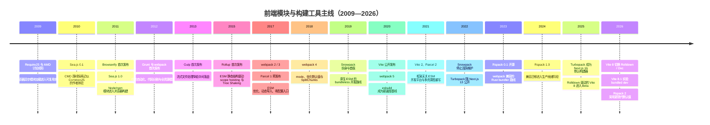
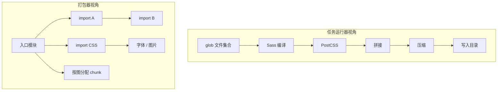
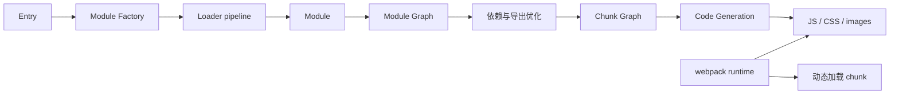
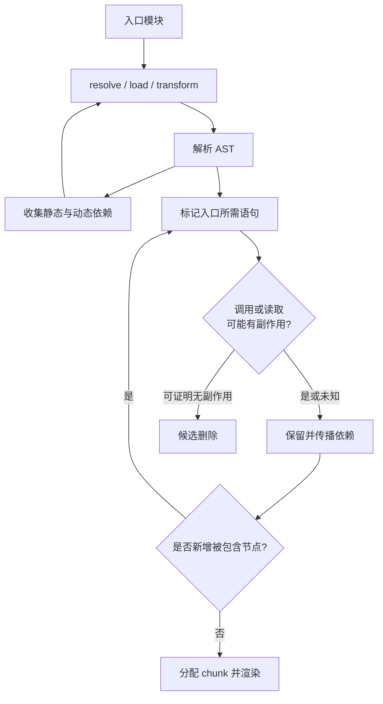
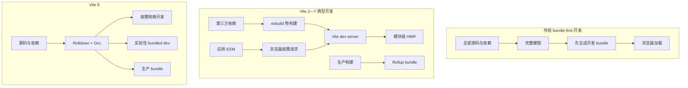
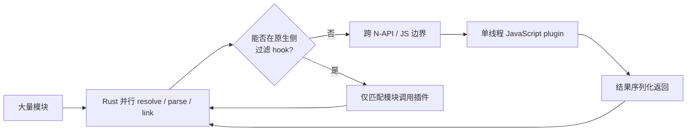

# 前端构建工具演进：从模块加载器到 Rust 工具链

> 本文面向有多年工程经验的前端开发者。重点不是记住工具清单，而是理解：每一代工具把哪一种复杂性从哪里搬到了哪里，又为下一代留下了什么约束。

## 1. 先给结论：这不是一条“新工具淘汰旧工具”的直线

前端工具史经常被压缩成“RequireJS → webpack → Rollup → Vite → Rust”。这个箭头把不同层的工具错误地放进了同一场替代赛：RequireJS 和 Sea.js 主要在浏览器运行时加载模块；Grunt 和 Gulp 编排任务；webpack、Rollup、Parcel 与 Rolldown 构建模块图并生成产物；Babel、SWC 和 Oxc 处理语法；Vite 则把开发服务器、转换管线和生产构建组织成产品。

更准确的主线是六次矛盾转移：

1. **脚本顺序与全局变量**变成显式模块依赖；
2. **浏览器运行时加载成本**被搬到构建阶段；
3. **JavaScript 依赖图**扩张成 CSS、图片、字体与 WebAssembly 等全资源图；
4. **能力缺失**变成配置、插件和缓存失效的复杂性；
5. **开发前全量打包**变成浏览器按需请求与服务端即时转换；
6. **JavaScript 工具自身的启动、内存和并行瓶颈**推动 Go/Rust 原生内核与增量计算架构。

这条历史还给出五个工程判断：

- “快”至少包含冷启动、热启动、生产构建、增量重建、HMR、内存和输出运行性能，不能压成一个数字。
- Tree Shaking 不是“使用 ESM 就自动删除无用代码”，而是建立在静态可分析性、副作用模型和打包器保守假设之上的程序分析。
- 原生 ESM 降低了开发阶段必须预打包整个应用的必要性，却没有消除生产阶段的请求瀑布、分块、缓存、语法降级和压缩问题。
- Rust 或 Go 是实现语言，不是构建工具类别。它们为共享内存、多核并行和紧凑数据结构创造条件，但不会自动解决缓存正确性、插件兼容或输出语义。
- 存量系统的迁移价值由瓶颈、兼容面和验证成本共同决定；“新项目默认选什么”和“旧项目是否值得迁”是两个问题。

本文的版本与项目状态查证到 **2026-09-13**。历史日期优先使用项目历史页、发布说明和 npm 发布元数据；当前状态会继续变化，不应把本文当作永久兼容矩阵。

## 2. 先分层：哪些东西才是同一类工具

### 2.1 七个责任层

| 层 | 解决的问题 | 代表 | 不自动负责 |
| --- | --- | --- | --- |
| 模块语法或协议 | 模块怎样声明依赖、导出和执行 | CommonJS、AMD、CMD、ESM | 如何生成最优生产资源 |
| 运行时模块加载 | 浏览器怎样定位、下载并按依赖顺序执行模块 | RequireJS、Sea.js、SystemJS | 全程序优化、长期缓存策略 |
| 任务编排 | 怎样串并行运行编译、复制、压缩、测试等任务 | Grunt、Gulp、npm scripts | 理解模块语义和 chunk 图 |
| 编译与转换 | 怎样解析、降级或压缩 JS/TS/JSX/CSS | Babel、SWC、Oxc、Terser、Lightning CSS | 完整应用分块与运行时加载 |
| 打包 | 怎样从入口建立图、优化、分块并输出资产 | Browserify、webpack、Rollup、Parcel、esbuild、Rspack、Rolldown、Turbopack | 框架路由、SSR 协议、业务运行时 |
| 构建产品 | 怎样组合开发服务器、HMR、插件、生产构建和配置 | Vite、Rsbuild | 取代底层 bundler/compiler 的所有职责 |
| 框架工具链 | 怎样把路由、客户端、服务端和部署目标组织成应用协议 | Vue CLI、Next.js、Nuxt、Angular CLI | 成为通用低层工具 |

同一个项目可以跨越多层。esbuild 同时提供 transform、minify 和 bundle；Parcel 内建多种编译器；webpack 通过 loader 承载转换；Vite 8 同时组织 Rolldown 和 Oxc。分层的目的不是贴唯一标签，而是回答：问题出现在哪一层，替换某个组件究竟影响哪些责任。

### 2.2 现代构建流水线

**问题：从入口源码到浏览器资源，中间到底发生了什么？**


这张图揭示了两个常见误区。第一，**transpile 不等于 bundle**：SWC 把 TypeScript 或新语法转为 JavaScript，并不必然决定多个模块如何分块。第二，**bundle 不等于完整构建产品**：Rollup 能生成高质量 chunk，但开发服务器、HTML 处理、框架 HMR 和 SSR 加载通常由上层工具组织。

## 3. 时间线：每个节点新增了哪一种能力



时间线的“首次发布”口径主要指首次公开版本，而不是流行高峰。Sea.js 官方历史记录了 2010-12-29 的 0.1.0 和 2011-07-22 的 1.0.0；npm 元数据则记录 Browserify、Grunt、Gulp、webpack、Rollup、Parcel 1、Snowpack 与 Vite 的首个公开包分别出现在 2011、2012、2013、2012、2015、2017、2019 与 2020。[Sea.js 官方历史](https://seajs.github.io/seajs/docs/en.html)、[Browserify 官方仓库](https://github.com/browserify/browserify)、[webpack 官方仓库](https://github.com/webpack/webpack)、[Rollup 0.x Changelog](https://github.com/rollup/rollup/blob/master/CHANGELOG-0.md)

时间邻近不表示直接继承。Rollup 不是 webpack 2 的升级版，Vite 也不是单纯把 webpack 改写成 ESM；它们选择了不同的开发/生产边界和兼容策略。

## 4. 2009—2012：模块加载器先解决“代码如何组织”

### 4.1 没有模块时，依赖存在但系统看不见

早期浏览器应用通常依赖多个 `<script>`：

```html
<script src="jquery.js"></script>
<script src="cart.js"></script>
<script src="checkout.js"></script>
```

这里的依赖只存在于人的知识里。交换顺序可能得到 `ReferenceError`；两个库写入同名全局变量会互相覆盖；按页面手工维护列表无法回答循环依赖、多版本共存和按需加载问题。IIFE 与命名空间能减少全局污染，却仍没有一个机器可遍历的依赖图。

模块加载器的第一项贡献不是压缩，而是让依赖成为数据：模块 ID、依赖列表、工厂函数和导出值共同构成运行时图。

### 4.2 RequireJS 与 AMD：下载顺序可以异步，执行顺序必须正确

典型 AMD 模块把依赖前置到数组：

```javascript
define(["./cart", "./inventory"], function (cart, inventory) {
  return {
    checkout() {
      inventory.reserve(cart.items);
    }
  };
});
```

RequireJS 可以并发插入 `<script>` 下载依赖，再按照依赖关系调用工厂函数。它解决了全局变量、手写顺序和运行时按需加载；模块 ID 与路径映射也使部署位置可以与源代码引用解耦。官方 API 明确区分“网络完成顺序”和“模块工厂执行顺序”。[RequireJS API 与加载机制](https://requirejs.org/docs/api.html)

但“AMD 就是依赖前置”并不完整。RequireJS 也支持 `define(function (require) {})` 的 simplified CommonJS wrapper，并通过函数源码发现字面量 `require()`。这说明 AMD/CMD 的真实差异涉及推荐写法、依赖发现、执行时机和 API 约定，不能仅靠两句口号描述。

### 4.3 Sea.js 与 CMD：接近 CommonJS 的作者体验

Sea.js 模块常写成：

```javascript
define(function (require, exports, module) {
  const cart = require("./cart");
  exports.checkout = function () {
    return cart.submit();
  };
});
```

它追求依赖就近和接近 Node/CommonJS 的写法，并由 loader 处理模块标识、下载与执行。官方文档把 Sea.js 定义为遵循 CMD 的 Web 模块加载器，同时明确建议生产前拼接、压缩源代码。[Sea.js 官方文档](https://seajs.github.io/seajs/docs/en.html)、[CMD 模块定义草案](https://github.com/cmdjs/specification/blob/master/draft/module.md)

因此，常见的“AMD 提前执行、CMD 延迟执行”最多是某些典型写法的结果，不是足以覆盖所有版本和配置的定律：

- RequireJS 的依赖数组会让 loader 在工厂执行前准备依赖；simplified wrapper 又会预扫描 `require()`。
- Sea.js 可以从工厂源码提取依赖并下载，`require.async()` 则显式开启异步边界。
- **下载、定义、执行**是三个阶段；把它们合并成一个“加载”词会制造伪差异。

### 4.4 为什么 runtime loader 最后仍需要 optimizer

一文件一请求便于开发，却会在生产中产生请求开销、深层依赖瀑布和更多解析执行边界。RequireJS 官方要求一个模块定义对应一个源文件，但允许 optimizer 在产物里为模块烧入名字并合并多个模块；Sea.js 也配套 spm/Grunt 构建。这是第一个关键转折：**模块语义保留在运行时，模块组合开始前移到构建时。**

## 5. 2011—2015：Browserify 和任务运行器把工作搬到构建阶段

### 5.1 Browserify：浏览器端使用 Node 风格模块

Browserify 从入口文件出发，静态查找字符串字面量形式的 `require()`，递归解析文件，最后把每个模块包在函数中，并注入一个小型 `require` runtime。它让 npm 包、本地模块和 Node 风格目录解析进入浏览器开发，而不要求浏览器逐个理解 CommonJS。[Browserify Handbook](https://github.com/browserify/browserify-handbook)

```javascript
// 源码
const unique = require("uniq");
console.log(unique([3, 1, 3]));
```

```text
入口
  -> 静态发现 require("uniq")
  -> Node 风格解析到文件
  -> 递归收集依赖
  -> 每个模块包装成函数
  -> 输出 bundle + 浏览器 require runtime
```

核心优势是开发和生产共享同一种模块写法，依赖在发布前固定下来。边界同样来自静态分析：`require(variable)` 无法可靠解析；Node 内建模块需要 shim；多入口共享、按需 chunk 和非 JS 资源需要额外插件或旁路管线。

### 5.2 Grunt/Gulp 不是 bundler

Grunt 把压缩、编译、复制、lint 和测试等重复操作配置成任务；Gulp 用 Node stream 和代码式组合表达文件转换。两者解决的是**自动化和编排**，不是模块执行语义。[Grunt 官方定位](https://gruntjs.com/)、[Gulp 官方说明](https://github.com/gulpjs/gulp/blob/master/README.md)



任务流水线的优势是直接、可组合、可处理任何命令；代价是不同任务可能重复读写和解析文件，依赖关系隐藏在任务顺序与 glob 中，缓存系统难以知道“哪个配置影响哪个产物”。webpack 后来的关键突破，正是用统一依赖图替代一部分松散文件流水线。

## 6. 2012—至今：webpack 把整个应用变成图

### 6.1 webpack 1 的核心不是配置，而是两个目标

webpack 1.x 文档把诞生动机写得很清楚：既有 bundler 不适合大型单页应用，尤其缺少自动代码分割，以及让静态资源无缝参与模块化的能力。[webpack 1.x 文档](https://github.com/webpack/docs/wiki/what-is-webpack)

这形成了 webpack 的核心模型：

- 任意资源经过 loader 后都可以成为 module；
- module 之间的依赖形成 Module Graph；
- module 按入口、动态边界和共享关系组成 Chunk Graph；
- chunk 输出为 asset；
- webpack runtime 在浏览器中完成模块初始化和异步 chunk 加载。



模块图和 chunk 图必须分开理解：模块图表达语义依赖；chunk 图表达交付策略。同一个 module 可出现在多个运行时/入口的关系中，共享 chunk 的提取又会改变缓存和请求顺序。

### 6.2 loader 与 plugin 为什么是两种扩展机制

loader 主要把某类资源转换为 webpack 可以继续分析的 module，例如 `sass -> css`、`ts -> js`。多个 loader 形成有顺序的管线，顺序或配置变化会改变结果。

plugin 则通过 hooks 参与 compiler/compilation 生命周期，可以增加模块、改 chunk、处理 asset、注入 runtime 或改变统计信息。plugin 能力更强，也更容易：

- 读取未声明的环境或文件，使持久化缓存缺少依赖；
- 修改共享对象，形成顺序敏感行为；
- 在 JavaScript hook 上执行大量串行工作；
- 与 webpack 内部对象模型或特定大版本耦合。

webpack 的“什么都能接入”建立了极强生态，也使配置成为一段带副作用的程序，而不是纯声明数据。

### 6.3 webpack 1—5：每个大版本在修哪一种结构性问题

| 阶段 | 时间 | 核心变化 | 主要解决的问题 | 新增代价或边界 |
| --- | --- | --- | --- | --- |
| webpack 0.x/1 | 2012—2016 | CommonJS/AMD、loader/plugin、异步 chunk、非 JS 资源模块化 | 大型 SPA 的代码分割与统一资源图 | 配置、loader 顺序和模块 wrapper 成本 |
| webpack 2 | 2017-01 | 原生解析 ESM、Tree Shaking、`import()` 路线、新配置结构 | 利用静态 import/export 做跨模块优化 | CJS/ESM 互操作与包入口语义更复杂 |
| webpack 3 | 2017-06 | `ModuleConcatenationPlugin`、动态导入 magic comments、较短发布周期 | 减少模块函数 wrapper，补强异步 chunk 控制 | Scope Hoisting 存在大量 bailout 条件 |
| webpack 4 | 2018-02 | `mode`、生产/开发默认值、`optimization.*`、SplitChunks、新 hook 体系 | 降低最小配置，统一优化入口和共享 chunk 策略 | 默认策略仍需结合应用图验证 |
| webpack 5 | 2020-10 至今 | 文件系统持久化缓存、确定性 ID、真实 content hash、Asset Modules、Module Federation、inner graph、移除默认 Node polyfill | 大仓库重启、长期缓存、嵌套导出优化、多构建协作与 Web 平台对齐 | 缓存依赖声明、联邦运行时契约和迁移兼容面扩大 |

webpack 2 的正式周期从 2015 年讨论延续到 2017 年稳定版；webpack 3 官方发布把 Scope Hoisting 定义为旗舰能力，并说明它依赖 ESM 且会因模块类型、chunk 边界和 HMR 等条件回退。[webpack 2.2 RC 说明](https://medium.com/webpack/webpack-2-2-the-release-candidate-2e614d05d75f)、[webpack 3 发布说明](https://medium.com/webpack/webpack-3-official-release-15fd2dd8f07b)

webpack 4 把 `mode` 与一组开发/生产默认值引入核心，并以 `optimization.splitChunks` 替代旧的 CommonsChunk 配置思路；webpack 5 又以一次破坏性升级清理 v4 无法修改的内部结构。[webpack 4 设计反馈](https://github.com/webpack/webpack/issues/6064)、[webpack 4 迁移指南](https://webpack.js.org/migrate/4/)、[webpack 5 发布说明](https://webpack.js.org/blog/2020-10-10-webpack-5-release/)

### 6.4 Tree Shaking 在 webpack 中为什么常常“没有生效”

webpack 需要同时回答：某个 export 是否被引用，以及包含它的 module 是否可安全移除。以下情况会迫使分析保守：

- CommonJS 导出可被动态修改；
- 包或文件存在顶层副作用；
- Babel 等前置转换过早把 ESM 改成 CommonJS；
- `eval()`、动态属性访问或不透明插件破坏静态信息；
- `package.json` 的 `sideEffects` 声明错误；
- CSS import 本身就是期望保留的副作用。

```javascript
// index.js
import "./register-global-listener.js";
export { Button } from "./button.js";
export { Modal } from "./modal.js";
```

即使消费者只导入 `Button`，打包器也不能仅凭“Modal 没用”删除整个入口模块，因为注册全局监听可能改变程序行为。`sideEffects: false` 是库作者向打包器提供的信任声明，不是打包器证明出来的数学事实。

### 6.5 webpack 5 的缓存为什么既快又危险

持久化缓存把 parser、loader、module 和 code generation 等结果跨进程复用。命中成立的前提是 cache key 覆盖所有输入：源码、loader/plugin 版本与选项、配置文件、环境变量、额外读取的文件和目标环境。

典型失败是自定义 loader 读取 `schema.json` 却没有把它登记为依赖。schema 变化后，缓存仍可能返回旧产物。解决办法不是“缓存不可靠”，而是让扩展明确声明构建依赖，并在升级工具链或修改隐式输入时主动验证冷构建。

### 6.6 为什么 webpack 仍然活跃

webpack 5 没有因为 Vite 或 Rust 工具出现而停止演进。2026 年的 5.x 版本仍在增加原生 CSS/HTML/TypeScript 相关能力并优化缓存、内存、SplitChunks 和 CommonJS 分析。[webpack Changelog](https://github.com/webpack/webpack/blob/main/CHANGELOG.md)

它的长期优势是成熟的 loader/plugin 生态、复杂应用分块、多 target 与存量框架集成。它的主要成本是：大量历史兼容、可变 JavaScript 对象图、扩展点调用和配置产品化层共同增加了性能优化与升级推理难度。

## 7. 2015—至今：Rollup 用 ESM 静态结构换取跨模块优化

### 7.1 为什么 webpack 之后还需要 Rollup

早期 webpack/Browserify 通常把每个模块包装成函数，再由运行时 `require` 执行。Rollup 利用 ESM 的静态 import/export 与 live binding，把可以安全组合的模块提升到较少的作用域中，并只渲染最终被纳入的语句。

Rollup 0.1 于 2015 年发布。创始人 Rich Harris 后来将两者的原始差异概括为：webpack 首先面向复杂 SPA、代码分割和多类静态资源；Rollup 首先面向使用 ESM 编写、需要平坦分发产物的库。这是历史动机，不是今天不可打破的使用规则。[Rollup 0.x Changelog](https://github.com/rollup/rollup/blob/master/CHANGELOG-0.md)、[Rich Harris：webpack 与 Rollup](https://medium.com/webpack/webpack-and-rollup-the-same-but-different-a41ad427058c)

### 7.2 Tree Shaking 不是一次简单的可达性遍历

Rollup 当前架构大致分为 build 与 generate：build 阶段递归加载、转换并解析完整模块图，多轮标记需要包含的语句；generate 阶段分配 chunk、追踪导出、重命名冲突变量、渲染目标格式并计算 hash。[Rollup 架构文档](https://github.com/rollup/rollup/blob/master/ARCHITECTURE.md)



“多轮”很重要：保留某个函数可能使它引用的变量变得必要，进而让其他语句进入产物。对 getter、未知全局函数、try/catch 或动态调用的判断太激进会改变语义，太保守则产生更大 bundle。Rollup 因此暴露多项 treeshake 假设；“更小”来自对特定程序作出的证明与假设，不是工具名称本身。[Rollup Tree-shaking 配置](https://github.com/rollup/rollup/blob/master/docs/configuration-options/index.md#treeshake)

### 7.3 “webpack 做应用、Rollup 做库”只是启发式

| 维度 | webpack 的传统强项 | Rollup 的传统强项 |
| --- | --- | --- |
| 初始动机 | 复杂 Web 应用、异步 chunk、全资源图 | ESM 库、平坦输出、跨模块优化 |
| 模块生态 | CJS、AMD、ESM 和大量 loader 兼容 | 以 ESM 为核心，CJS 依赖插件互操作 |
| 输出 | 应用 runtime、动态加载与丰富 target | ESM、CJS、UMD、SystemJS 等库格式 |
| 扩展 | Compiler/Compilation hooks，能力广 | 较小且清晰的 resolve/load/transform/output hooks |
| 现代边界 | 也能构建库并做 scope hoisting | 也支持多入口、动态 import 和代码分割 |

今天 Vite 的生产构建、许多库工具和 Rolldown 都继承了 Rollup 的插件概念。Rollup 的更深影响不是某个命令，而是把“静态模块语义 + 可组合插件 API”变成上层工具的公共基础。[Rollup 官方能力说明](https://rollupjs.org/)

## 8. 2017—至今：Parcel 把复杂性放进默认策略和图模型

Parcel 1 从 HTML 等入口自动发现 JS、CSS、图片和字体依赖，内建开发服务器、转换、代码分割和缓存。它针对的是另一种 webpack 痛点：多数项目不应先理解一整套低层配置才能获得合理产物。

零配置并不表示没有配置，而表示：

- 工具根据文件类型、入口和 `package.json` 推断默认行为；
- 约定替代大量显式 glue code；
- 当推断不符合项目时，用户需要理解隐藏的 target、transformer 和缓存键。

Parcel 2 于 2021-10-13 稳定发布，是一次从插件系统到并行和缓存架构的重写。它引入类型化插件管线、默认 Tree Shaking、自动差异化构建、共享 bundle、懒开发模式，以及基于 SWC 的 Rust JavaScript 编译器。[Parcel 2 发布说明](https://parceljs.org/blog/v2/)

```text
入口 HTML
  -> Asset Graph：HTML、JS、CSS、SVG、图片、字体之间的语义依赖
  -> Bundle Graph：目标环境、动态边界、共享资产与打包组
  -> Packager / Optimizer：生成和优化具体产物
```

Parcel 的核心优势不是“配置文件更短”，而是把多资源应用、缓存失效和并行调度当作一等模型。代价是复杂项目出现异常时，必须穿透默认规则与多级插件管线；“自动”只是把日常决策集中到工具维护者，并未消除规则。

## 9. 2019—2026：原生 ESM 改写开发反馈路径

### 9.1 Snowpack 证明“开发不必先打完整 bundle”

当现代浏览器支持 `<script type="module">` 后，开发服务器可以让浏览器自己遍历应用 ESM：请求到哪个源码模块，服务器就转换哪个。Snowpack 把第三方依赖预处理为浏览器可用 ESM，同时让应用源码保持按文件服务。这显著缩短了小中型项目的冷启动路径。

Snowpack 仓库在 2022-04-20 明确标注不再活跃维护，并推荐新项目使用 Vite。这不等于它的方向失败；Vite 延续了“依赖预构建 + 源码按需转换”，同时提供了更一致的插件模型、框架集成和生产构建入口。[Snowpack 官方仓库说明](https://github.com/FredKSchott/snowpack)

### 9.2 Vite 解决的是反馈路径，不只是 bundling 速度

传统 bundle-first 开发在服务启动前需要遍历应用图并生成 bundle；项目越大，冷启动需要处理的源码通常越多。Vite 早期把依赖与源码区别处理：依赖由 esbuild 预构建以完成 CJS 转 ESM、合并大量内部模块和稳定缓存；应用源码通过原生 ESM 按请求转换；HMR 再沿服务端模块图传播失效边界。[Vite 设计动机](https://vite.dev/guide/why.html)



### 9.3 为什么生产仍通常需要 bundle

原生 ESM 和 HTTP/2 没有让请求数量变成零成本：浏览器仍需发现深层 import 后才能发起下一层请求；每个请求仍有 header、TLS、调度和服务端开销；大量小模块还增加解析、编译与模块实例化边界。生产构建还负责：

- 把模块聚合为适合缓存与并行下载的 chunk；
- 删除不可达且可证明无副作用的代码；
- 压缩并统一生成 source map；
- 为旧目标降级语法；
- 重写资源 URL、加入 content hash 和 preload 信息；
- 为 SSR、worker、浏览器等环境生成不同产物。

因此，“开发不打包”与“生产不构建”不是同一个结论。Rolldown 团队也把生产 bundling 的价值归纳为减少请求与瀑布、减少字节和降低浏览器解析执行成本。[Rolldown：为什么仍需 bundler](https://www.rolldown.rs/in-depth/why-bundlers)

### 9.4 Vite 8 为什么又统一回 bundler

Vite 2—7 的双工具结构是一项务实取舍：esbuild 提供快速依赖预构建和 TS/JSX 转换，Rollup 提供成熟生产分块与插件生态。但开发和生产的 parser、转换配置和插件行为可能不一致，Vite 需要维护 glue code。

Vite 8 于 2026-03-12 稳定切换到 Rolldown 作为统一 Rust bundler，并由 Oxc 提供解析、转换和压缩基础。这里的“统一”指主要 JS/TS bundling 基础设施，不代表 HTML、CSS、框架编译和不同运行环境从此没有差异。[Vite 8 发布说明](https://vite.dev/blog/announcing-vite8)

Vite 8.1 又加入实验性 bundled dev。官方给出的动因是：超大模块图下，浏览器处理大量独立模块请求会拖慢启动和整页刷新。这不是回到旧式全量预构建，而是在足够快的增量 bundler 出现后重新选择开发交付粒度。[Vite 8.1 发布说明](https://vite.dev/blog/announcing-vite8-1)

## 10. Go/Rust 原生工具：语言只是性能方程的一项

### 10.1 性能来自一组相乘的因素

JavaScript 构建工具启动时，Node 既要解析用户代码，也要解析工具和插件本身。worker 拥有独立 isolate/heap，跨 worker 传输复杂 AST 或模块对象会产生序列化成本。Go/Rust 原生程序可以更直接地使用共享内存和多线程，但真正性能还来自：

1. 是否为并行设计数据结构和算法；
2. 是否减少 parse → string → parse 的重复往返；
3. AST 与符号数据是否紧凑并保持缓存局部性；
4. 增量缓存粒度与失效传播是否正确；
5. plugin 是否频繁跨 Rust/JavaScript 边界；
6. 冷启动优化是否牺牲输出质量、内存或功能；
7. benchmark 是否包含 source map、minify、type check 和等价输出。

所以，“Rust 工具”不是选型项；应该问它替换了哪一段流水线、是否保留现有插件、缓存是否可信、输出是否等价。

### 10.2 esbuild：用 Go 重做 parser、linker 与 codegen

esbuild 由 Go 编写，将 parse、link 和 code generation 设计为尽量并行，使用共享内存，并减少整棵 AST 的遍历与多种中间表示转换。作者明确把速度归因于原生启动、并行、自有实现、紧凑内存和较少 passes 的组合，而不是单独归因于 Go。[esbuild：为什么快](https://esbuild.github.io/faq/#why-is-esbuild-fast)、[esbuild 架构](https://github.com/evanw/esbuild/blob/main/docs/architecture.md)

它的范围也被刻意限制：不在核心中承担 TypeScript 类型检查、HMR、Module Federation、任意 AST 操作和所有框架语言。这解释了为什么 esbuild 常作为 Vite、测试工具、CLI 或框架的快速底层，而不必成为所有项目的最终构建产品。

### 10.3 SWC 与 Oxc：编译基础设施，不是自动替代整条工具链

SWC 是 Rust 编写的 Web 编译平台，支持 JS/TS 转换、压缩、Wasm 插件，以及在 webpack/Rspack/Jest 等系统中作为组件使用。[SWC 官方说明](https://swc.rs/)

Oxc 同样提供 parser、transformer、minifier、resolver、linter 等共享组件；其价值是多个工具可以复用语义和数据结构，减少重复解析与行为漂移。[Oxc 官方架构定位](https://oxc.rs/docs/guide/what-is-oxc)

二者都不能让“编译成功”自动等于：

- TypeScript 类型正确；
- chunk 策略适合网络与缓存；
- SSR 与浏览器条件导出一致；
- CSS、图片和 HTML 已正确处理；
- 插件转换与生产运行语义相同。

### 10.4 Parcel、Rspack、Turbopack、Rolldown 代表四种重构策略

| 工具 | 首要策略 | 核心优势 | 必须保留的边界 |
| --- | --- | --- | --- |
| Parcel 2 | 多资源图与合理默认值，热点编译器用 Rust | HTML 起点、多目标、缓存、并行和资源处理一体化 | 自动策略需要理解 target 与插件管线 |
| Rspack | Rust 内核兼容 webpack API、loader 和插件生态 | 存量 webpack 大应用可渐进迁移，减少重写配置 | “兼容”不是所有 hook/插件行为逐字节相同 |
| Turbopack | 面向 Next.js 的统一多环境图与细粒度增量计算 | 按函数/值依赖追踪失效，优化大型 Next.js 反馈路径 | 与 Next.js 深度集成，不是通用 webpack drop-in |
| Rolldown | Rollup/Vite 插件兼容 + esbuild 级内建能力 | 统一 Vite 开发和生产主干，兼顾吞吐与生态迁移 | JS plugin 跨语言调用仍可能序列化并行路径 |

Rspack 0.1 于 2023-03-06 对外发布，1.0 于 2024-08-28 将主要 webpack API 覆盖和生产就绪作为里程碑；2.0 于 2026-04-22 在保留 webpack 生态兼容目标的同时转向更现代的默认值和 ESM 输出。[Rspack 0.1 公告](https://rspack.rs/blog/announcing-0-1)、[Rspack 1.0 公告](https://rspack.rs/blog/announcing-1-0)、[Rspack 2.0 公告](https://rspack.rs/blog/announcing-2-0)

Turbopack 在 2022 年随 Next.js 13 以 Alpha 公开；Next.js 16 在 2025 年宣布开发和生产构建稳定并默认使用 Turbopack。它的关键不是“Rust 版 webpack”，而是 demand-driven、细粒度值单元和自动依赖追踪的增量计算；这提高了热路径复用，也增加缓存图、内存与正确性复杂度。[Next.js 13 公告](https://nextjs.org/blog/next-13)、[Next.js 16 公告](https://nextjs.org/blog/next-16)、[Turbopack 增量架构](https://nextjs.org/blog/turbopack-incremental-computation)

Rolldown 的目标是同时继承 Rollup/Vite 的 plugin API 与 esbuild 风格的内建 transform、平台预设和模块互操作，并作为 Vite 8 的 bundler。它不是把 Rollup 源码机械翻译成 Rust，而是以兼容接口保护上层生态。[Rolldown 设计定位](https://rolldown.rs/guide/introduction)

### 10.5 JavaScript 插件是原生内核的现实边界



如果每个模块都跨边界调用每个 JavaScript plugin，原生核心的并行能力会在 hook 处收敛成串行瓶颈。Rolldown 因此提供在 Rust 侧执行的 plugin hook filter；这类优化说明生态兼容与原生性能并非可以免费同时获得。[Rolldown Plugin Hook Filters](https://rolldown.rs/in-depth/why-plugin-hook-filter)

## 11. 真正困难的不是“把文件拼起来”

### 11.1 模块解析是一组带环境的规则

`import "pkg"` 不是简单查找 `node_modules/pkg/index.js`。现代 resolver 还要处理：

- `package.json` 的 `exports`、`imports`、`main`、`module` 与 `browser`；
- `import`/`require`、browser/node、development/production 等条件；
- 扩展名、alias、symlink、monorepo、PnP 与虚拟模块；
- browser、SSR、worker 和 edge 对内建模块的不同能力；
- ESM URL 语义与 CommonJS 路径语义。

同一个包在 dev、test、SSR 和 build 中解析到不同文件，是“本地没问题、生产出错”的常见根因。共享一份 alias 配置不等于共享同一个 condition set 和运行时。

### 11.2 Module Graph 不等于 Chunk Graph

模块图回答“谁依赖谁”；chunk 图回答“哪些模块一起交付”。chunk 策略需要在多组目标之间折中：

- 初次访问少下载；
- 后续路由复用共享依赖；
- 更新一个业务模块不让 vendor hash 大面积失效；
- 避免几十个微小 chunk 重新制造请求和解析开销；
- 保持 ESM 执行顺序、循环依赖和 CSS cascade 正确。

因此，`manualChunks`、SplitChunks 或框架路由分块并不是“越细越好”。合理结果与路由热度、缓存周期、部署频率、CDN 和真实网络共同相关。

### 11.3 HMR 是一个分布式一致性问题

HMR 至少涉及：文件监听器、服务端模块图、转换缓存、WebSocket 协议、浏览器模块实例和框架状态。文件变化后，系统必须找到可接受更新的边界；找不到则整页刷新。若边界接受了本应重建的状态，则可能得到“开发态看似正常、完整刷新后错误”的假象。

框架 Fast Refresh 还要判断组件导出是否稳定、hook 顺序是否改变、模块是否混合导出非组件值。HMR 快不只取决于编译器吞吐，也取决于失效传播是否足够精确且语义保守。

### 11.4 Source Map、压缩和错误定位不能分开验收

源码可能经过 SFC/JSX/TS、Babel/SWC、bundler、minifier 多级转换。每一层都要消费前一层的 map 并生成新 map；任一插件丢失或错误拼接映射，生产堆栈就会指向不存在的位置。关闭 source map 得到的 benchmark 不能代表需要生产调试能力的构建。

### 11.5 缓存正确性先于命中率

一个构建节点的缓存键应覆盖：显式输入、隐式文件、环境、目标、插件版本、配置和上游语义。缓存粒度越细，潜在命中越多，但依赖追踪、内存占用、序列化和失效传播越复杂。Turbopack 的细粒度值单元、Parcel 的全管线缓存、webpack/Rspack 的持久化缓存代表不同位置的权衡；不能只比较“第二次构建用了几秒”。

## 12. 怎样读性能数字

### 12.1 “构建快”至少要给出这些坐标

| 指标 | 必须同时说明 |
| --- | --- |
| 冷启动 | 是否清空磁盘缓存、依赖是否预构建、请求了几个路由 |
| 热启动 | 缓存是否来自同一 commit、是否包含远程缓存恢复时间 |
| 增量重建 | 修改类型、失效模块数、是否生成完整产物 |
| HMR | 服务端完成、消息到达、浏览器应用、框架重渲染分别耗时多少 |
| 生产构建 | sourcemap、minify、type check、压缩、目标浏览器是否等价 |
| 输出质量 | JS/CSS 字节、chunk 数、请求瀑布、重复依赖和运行时开销 |
| 资源成本 | CPU 核数、内存峰值、文件系统、CI 容器与并发任务 |

esbuild、Rspack、Turbopack、Rolldown 和 Parcel 的官方数据都能证明各自特定测试中的进展，却不能相互拼成一张普遍排名：测试项目、缓存、硬件和功能集合不同。尤其要检查一个工具是否只做 transpile，而另一个同时执行 bundling、minification 和 source map。

### 12.2 原生语言的性能收益可能被上层吃掉

如果构建总耗时为：

```text
总耗时 = 文件扫描 + 解析/转换 + 插件 + 类型检查 + bundling + minify + I/O
```

把“解析/转换”加速十倍，并不保证总耗时十倍改善。若类型检查或某个串行插件占 70%，Amdahl 定律决定最终收益有限。迁移前应该用 trace/profile 找瓶颈，而不是先从工具宣传页选语言。

## 13. 2026 年的工具选择：按问题而不是按年代

| 场景 | 优先考察 | 核心理由 | 不应忽略 |
| --- | --- | --- | --- |
| 新建通用框架应用 | Vite 及框架官方集成 | 成熟开发服务器、插件生态、生产构建与 SSR 基础 | 框架插件、环境 API 和生产部署仍需验证 |
| ESM/CJS 库、多格式输出 | Rollup、Rolldown 或上层库工具 | 导出控制、external、Tree Shaking 与多格式输出 | 类型声明、条件导出和 CJS 互操作 |
| 高度定制的存量 webpack 大应用 | 继续 webpack，或评估 Rspack | 保留 loader/plugin、分块和框架集成资产 | 先测插件兼容、产物、缓存和 HMR，不做盲迁 |
| Next.js 应用 | 框架默认 Turbopack | 与 client/server/RSC 图和路由深度集成 | webpack 配置、loader 和边缘语义迁移差异 |
| HTML/多资源入口、偏好强默认 | Parcel | 全资源图、多目标、缓存与自动优化 | 默认规则不合适时的调试与插件成本 |
| 嵌入脚本、CLI、测试或上层工具 | esbuild、SWC、Oxc | 高吞吐的解析、转换、压缩或轻量 bundling | 它们不自动提供完整应用工作流 |
| webpack 兼容的新工具平台 | Rspack + Rsbuild | Rust bundler 与开箱构建产品分层 | `Rspack !== Rsbuild`，低层与产品层不要混淆 |
| 小型无框架页面、受控依赖 | 原生 ESM、import maps、简单任务 | 减少工具和维护面 | 依赖分发、缓存、压缩和兼容责任转移给应用 |

### 13.1 迁移顺序

1. **先定义瓶颈**：冷启动、HMR、CI、bundle、配置维护还是安全更新？
2. **冻结行为基线**：入口、public path、chunk、CSS 顺序、环境变量、SSR、worker、source map。
3. **列出专有能力**：webpack loader/plugin、magic comments、Module Federation、框架 adapter。
4. **拆分替换层次**：可以先用 `swc-loader` 加速 transform，再决定是否换 bundler；也可以先迁框架版本而保留 webpack。
5. **双跑并比较产物**：比较的不只是构建成功，还包括路由加载、缓存 header、chunk hash、错误栈和真实浏览器行为。
6. **保留回滚**：大型构建迁移应能在一段时间内切回旧管线，避免把业务回归与工具语义差异混在一起。

“升级为 Vite”通常同时改变 dev server、环境变量、HTML 入口、插件 API、生产 bundler 和 SSR module loading；“webpack 换 Rspack”虽然兼容目标更强，也会改变内部优化、CSS 顺序、source map 和缓存行为。迁移单位是构建契约，不是 `package.json` 中的一个包名。

## 14. 其他工具应该放在哪里

主时间线没有逐一展开所有项目，但可以用责任层定位：

- **Babel、Terser、PostCSS、Sass、Lightning CSS**：编译、压缩或资源转换，不是完整 bundler。
- **SystemJS、JSPM**：运行时模块加载、映射与包工作流，延续 loader 路线的另一支。
- **Closure Compiler**：更早的优化编译器，强调全程序分析，不应被写成 webpack 同类产品的简单前身。
- **Brunch、FuseBox、WMR、Snowpack**：在约定、速度或 ESM 开发路径上提供过重要探索。
- **Farm、Mako 等 Rust bundler**：代表原生工具仍在扩张，但选型要看独特架构、兼容目标和生产证据，而不是只看实现语言。
- **tsup、unbuild、Rslib**：面向库作者的上层产品，通常组合底层 bundler/compiler 并提供默认约定。
- **Nx、Turborepo、Bazel**：仓库级任务图与远程缓存系统；它们可以调用 Vite/webpack/Rollup，却不替代应用 bundler。
- **Bun、Deno 的构建能力**：运行时附带的工具链，价值在安装、执行和构建整合，仍需按输出与生态兼容判断。

这个补充地图避免两种极端：把所有能处理源码的工具都叫 bundler，或只讨论 webpack/Vite 而忽略编译器、任务图和框架构建产品的真实边界。

## 15. 从这段历史能推导出的系统规律

### 15.1 复杂性不会消失，只会转移所有权

RequireJS 把顺序复杂性转给 runtime loader；Browserify/webpack 把它转给构建图；Parcel/Vite 把常用配置转给工具默认值；框架把多个环境的构建协议收进上层产品。每次“更简单”都意味着另一个组件承担了更多知识。

### 15.2 静态知识越多，优化空间越大，自由度越小

ESM 的静态 import/export 支持 Tree Shaking、scope hoisting 和预加载分析；CommonJS 的动态执行更灵活，但迫使 bundler 保守。`sideEffects`、pure annotation 和条件导出继续沿这条路线：作者提供更多可验证契约，工具才能做更激进优化。

### 15.3 兼容和重写是两种长期战略

Rspack 尽量保护 webpack API/生态，降低存量迁移成本；Turbopack 为细粒度增量和多环境图重建架构；Rolldown 选择 Rollup/Vite 插件兼容并替换底层实现。兼容路线继承历史限制，重写路线承担功能追平与语义差异；没有免费选项。

### 15.4 开发与生产会在“分离—统一”之间摆动

Vite 先把开发按需转换与生产 Rollup bundling 分离，获得极快启动；Vite 8 又用 Rolldown/Oxc 统一底层，减少双管线漂移；Vite 8.1 再为超大图探索 bundled dev。这不是回到原点，而是硬件、浏览器和 bundler 吞吐变化后，旧取舍的最优点发生移动。

### 15.5 下一轮竞争不只是“谁打包更快”

下面是基于已确认架构的作者推论，而不是项目方已共同宣布的路线：当 parser、transform 和基础 bundling 逐渐原生化后，差异会更多出现在多环境一致性、增量失效正确性、插件跨语言边界、缓存可解释性、产物可观测性和迁移工具上。Vite、Rspack、Turbopack、Parcel 已分别在这些方向投入，但目前没有一种架构同时最大化兼容、可扩展、吞吐、内存和输出质量。

## 16. 来源审计与验证边界

### 16.1 主要证据类型

- **历史与版本**：RequireJS/Sea.js 历史页、项目发布公告、Git tag/changelog 和 npm 发布元数据。
- **设计动机**：webpack、Rollup、Vite、esbuild、Parcel、Rspack、Turbopack、Rolldown 核心作者或维护团队的一手说明。
- **机制**：官方架构文档、配置文档、源码结构与官方测试描述。
- **当前状态**：截至 2026-09-13 的正式发布页与当前文档。

### 16.2 已交叉核实的核心结论

- RequireJS/Sea.js 同时包含运行时模块加载与生产优化路径，不能简单归类为现代 bundle 工具。
- Browserify 的核心是从字面量 `require()` 静态构图，并注入浏览器 runtime。
- webpack 的原始差异化目标是代码分割和让静态资源进入统一模块图；v2—v5 的关键能力使用发布/迁移材料复核。
- Rollup 的 Tree Shaking 是多轮语句 inclusion 与副作用分析，不是单次删除未引用 export。
- Vite 2—7 的 esbuild/Rollup 双管线及 Vite 8 的 Rolldown/Oxc 切换由官方说明直接支持。
- esbuild、Rspack、Turbopack 和 Rolldown 的性能动因分别核对了其架构说明，而非只采用宣传数字。

### 16.3 没有验证或不能泛化的部分

- 本任务未选择配套实践，因此**没有运行跨工具 benchmark，也没有生成等价示例项目比较产物**。
- 历史项目的“首次出现”采用公开包或官方历史口径，不代表第一次内部原型或第一次被大规模采用。
- 项目方 benchmark 只证明声明中的样本、参数和硬件；本文未把它们转换为普遍排名。
- Sea.js/CMD 的部分原始材料已归档，本文只保留能由官方文档和规范直接支持的语义，不采用流传博客中的绝对化结论。
- 当前版本与稳定状态会继续变化；涉及迁移时仍需重新核对项目 release、Node 基线、插件兼容和框架集成。

## 17. 关键原始资料

- [RequireJS History](https://requirejs.org/docs/history.html)
- [RequireJS API](https://requirejs.org/docs/api.html)
- [Sea.js 官方文档与版本历史](https://seajs.github.io/seajs/docs/en.html)
- [CMD 模块定义草案](https://github.com/cmdjs/specification/blob/master/draft/module.md)
- [Browserify Handbook](https://github.com/browserify/browserify-handbook)
- [webpack 1.x 设计目标](https://github.com/webpack/docs/wiki/what-is-webpack)
- [webpack 3 发布说明](https://medium.com/webpack/webpack-3-official-release-15fd2dd8f07b)
- [webpack 5 发布说明](https://webpack.js.org/blog/2020-10-10-webpack-5-release/)
- [Rollup 架构文档](https://github.com/rollup/rollup/blob/master/ARCHITECTURE.md)
- [Rich Harris：webpack 与 Rollup](https://medium.com/webpack/webpack-and-rollup-the-same-but-different-a41ad427058c)
- [Parcel 2 发布说明](https://parceljs.org/blog/v2/)
- [Snowpack 官方仓库与维护状态](https://github.com/FredKSchott/snowpack)
- [Vite 设计动机](https://vite.dev/guide/why.html)
- [Vite 8 发布说明](https://vite.dev/blog/announcing-vite8)
- [esbuild 架构](https://github.com/evanw/esbuild/blob/main/docs/architecture.md)
- [SWC 官方说明](https://swc.rs/)
- [Oxc 官方架构定位](https://oxc.rs/docs/guide/what-is-oxc)
- [Rspack 设计定位](https://rspack.rs/guide/start/introduction)
- [Turbopack 增量计算架构](https://nextjs.org/blog/turbopack-incremental-computation)
- [Rolldown 设计定位](https://rolldown.rs/guide/introduction)

前端构建工具的发展并不是从“不能构建”走向“能构建”，而是不断重新选择三个边界：多少工作在浏览器请求之前完成，多少项目知识进入静态图，多少扩展自由度可以在不破坏性能与正确性的前提下保留。掌握这三个边界，比记住下一款工具的名字更能解释过去，也更能应对下一次工具迁移。
