# Vue 全生态发展史：从渐进式框架到编译、构建、测试与服务端渲染体系

> 本文面向有多年工程经验的前端开发者，讨论的不是 API 清单，而是 Vue 生态为何在特定阶段做出特定选择：旧问题是什么，新机制怎样工作，又带来了什么新边界。

## 1. 阅读边界与核心结论

本文所说的“Vue 全生态”包含五层：

1. **框架内核**：响应式、组件模型、渲染器、编译器、单文件组件（SFC）。
2. **官方应用层**：Vue Router、Vuex / Pinia、Devtools、Vetur / Volar。
3. **工程工具链**：vueify、vue-loader、Vue CLI、Vite、Vitest、Vue Test Utils。
4. **服务端与内容框架**：`vue-server-renderer`、`@vue/server-renderer`、Nuxt、Nitro、VuePress、VitePress。
5. **代表性社区扩展**：UI 框架、跨端运行时、微前端编排。

“全”指覆盖这些关键层及其主干演化，不表示穷举 npm 上所有 Vue 包。社区部分只选择能够解释架构边界的代表项目。

截至 **2026-09-13**，主线可以压缩为五个判断：

- Vue 从“小而易嵌入的数据绑定库”成长为“编译器与运行时协同优化、但仍允许渐进接入的应用框架”。
- Vue 2 的核心贡献是把组件、虚拟 DOM、SFC、路由、状态管理和 SSR 组织成可大规模采用的体系；它的历史限制主要来自 `Object.defineProperty`、全局 API、类型系统和遗留浏览器兼容包袱。
- Vue 3 不是一次语法翻新，而是对**响应式、渲染器、编译器、类型、全局隔离和逻辑复用**的系统重写。Options API 与 Composition API 是两种组织方式，不是两个运行时。
- Vite 与 Vitest 把“应用源码如何解析和转换”变成开发服务器、构建、SSR 和测试共享的基础设施；它们属于 Vue 发起但已框架无关的生态层。
- Nuxt 把 Vue 的 SSR 原语提升为包含路由、数据获取、服务端接口、缓存与部署适配的应用运行时。SSR 本身只是渲染技术，不等于完整的服务端应用框架。

### 1.1 如何阅读本文的证据

文中区分三种陈述：

- **已确认事实**：官方公告、文档、RFC、仓库变更日志或 npm 发布元数据可以直接支持。
- **维护者解释**：官方给出的设计动机，例如 Composition API 的逻辑复用与类型推导目标。
- **本文分析**：由多个事实归纳出的工程含义，例如“Vue 3 的真正迁移单位是应用与插件依赖图”。这类结论会明确写成“可以据此理解”或“工程上意味着”。

版本快照只代表 2026-09-13：Vue 稳定版为 3.5.x，Vue 3.6 仍处于候选发布阶段；Nuxt 4、Vite 8、Vitest 5 已进入稳定主线。版本会继续变化，不能把本文的快照当成永久兼容矩阵。

## 2. 先建立生态模型

**问题：Vue 生态中的编译器、运行时、应用框架和社区方案分别处在哪一层？**

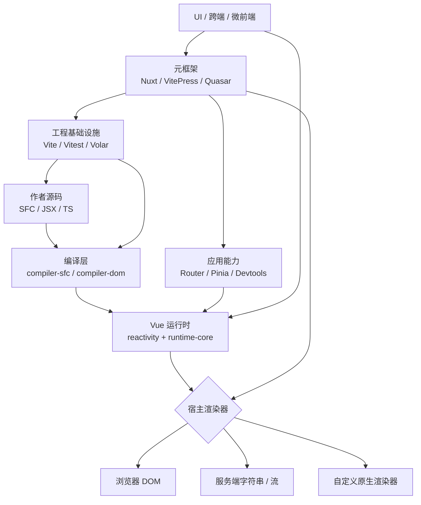

这张图有两个重要边界。第一，Vite 不负责 Vue 响应式或模板语义，`@vitejs/plugin-vue` 才把 SFC 交给 Vue 编译器。第二，Nuxt 不是另一套 Vue，而是把路由、构建、SSR、服务端接口和部署约定组合成更高层的系统。很多迁移事故来自把这些层误认为一个版本号可以整体代表。

## 3. 主时间线：每轮迭代在解决什么

**问题：从 2013 年原型到 2026 年生态，关键转折点如何相互连接？**

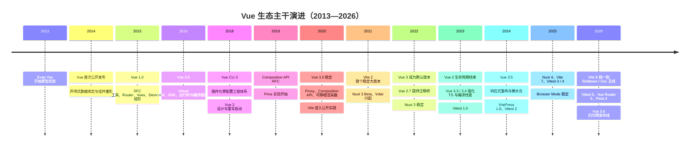

时间线不是“新版本替代旧版本”的直线。Vue 2.7、Nuxt Bridge、Vue 3 migration build 等都说明，生态维护者在关键断层处引入了兼容桥；而 Vite、Vitest、Volar 又从 Vue 的局部需求出发，逐渐成为可供其他框架使用的独立基础设施。

## 4. 2013—2014：从 Angular 启发到可渐进接入的 Vue 0.x

Evan You 在 Google 使用 Angular 后，希望保留声明式数据绑定中高价值的部分，同时构建一个更轻、更灵活的方案。Vue 在 2014 年 2 月首次公开发布。最早期价值不是“完整 SPA 框架”，而是用普通 JavaScript 对象驱动 DOM，并允许开发者只在页面局部采用它。[首次发布回顾](https://blog.evanyou.me/2014/02/11/first-week-of-launching-an-oss-project/)和后来的[官方 FAQ](https://vuejs.org/about/faq)都给出了这条起源线索。

当时要解决的问题是：

- 手工 DOM 更新会让状态与界面形成两套事实来源；
- 大型框架的完整约束对局部增强页面过重；
- 模板、状态和可复用视图单元之间缺少足够小的组合模型。

Vue 0.x 的回答是声明式模板、自动依赖更新和组件化雏形。它尚未提供后来成熟的虚拟 DOM、SFC 工具链和官方应用架构，因此更接近“可组合的视图层”。这也奠定了“渐进式”的第一层含义：可以先替代一个局部 DOM 控制器，再决定是否扩大到整个应用。

## 5. 2015：Vue 1.0 与生态第一次闭环

Vue 1.0 在 2015 年进入稳定阶段。更重要的变化不是某个单独 API，而是核心与周边开始形成闭环：

- `vueify` 与 `vue-loader` 让 `.vue` 单文件组件进入 Browserify / webpack 工程；
- Vue Router 把组件系统扩展到 URL 驱动的应用；
- Vuex 把共享状态与可追踪变更带入大型应用；
- Vue Devtools 提供组件树和状态观察；
- 官方开始把 Vue 描述为按需求逐层采用的“渐进式框架”。

这些项目在[2015 年官方回顾](https://blog.evanyou.me/2015/12/20/vuejs-2015-in-review/)中已经同时出现；[Vue 的重新介绍](https://blog.evanyou.me/2015/10/25/vuejs-re-introduction/)也明确展示了普通对象响应式、组件、SFC 与周边库的组合方式。

这一阶段解决了“库能更新视图，但如何交付真实应用”的问题。代价则是构建系统开始成为必要知识：SFC 不是浏览器原生模块，必须依赖转换器；不同脚手架、loader 和测试转换配置容易产生不一致。后来的 Vue CLI 与 Vite，实际上都在继续处理这一工程化问题。

## 6. 2016—2019：Vue 2 把框架推向生产主流

Vue 2 的预览版在 2016 年 4 月公布，稳定版在 2016 年 9 月发布。它引入基于虚拟 DOM 的渲染架构、服务端渲染、运行时与编译器拆分，并保留模板和响应式数据模型。[Vue 2.0 预览公告](https://v2.vuejs.org/2016/04/27/announcing-2.0/)把目标描述为更轻、更快，并支持流式 SSR；[Vue 2 变更日志](https://github.com/vuejs/vue/blob/main/CHANGELOG.md)记录了稳定版本线。

### 6.1 Vue 2 的响应式与渲染不是一回事

**问题：一次 Vue 2 状态写入，怎样变成最小范围的 DOM 更新？**

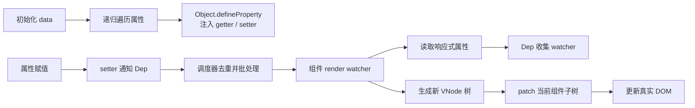

响应式系统负责回答“哪个组件需要重新执行渲染”，虚拟 DOM 负责回答“该组件新旧输出的差异如何落到宿主 DOM”。把二者混为一谈，会错误地认为 Vue 2 每次变更都 diff 整个应用。

Vue 2 初始化实例时递归遍历 `data`，用 `Object.defineProperty` 把属性转换为 getter / setter；渲染 watcher 在读取时收集依赖，setter 在写入时通知并进入异步更新队列。[Vue 2 响应式原理文档](https://v2.vuejs.org/v2/guide/reactivity.html)也解释了由此产生的限制：后来新增或删除的对象属性无法被自动侦测，部分数组索引写入也需要专门 API。

### 6.2 Virtual DOM 解决了跨平台与组件渲染抽象

Vue 1 更依赖细粒度 DOM 绑定；Vue 2 转向 VNode 与 patch。其收益不只是 diff：

- render 函数成为模板编译器与运行时之间的稳定协议；
- 客户端渲染和服务端渲染可以共享组件语义；
- 平台操作可以与组件系统分离，为 Weex 等自定义渲染目标留下空间；
- 编译器可以在模板阶段发现静态内容，再为运行时减少工作。

代价是运行时必须维护 VNode、组件边界和 patch 算法；对高度静态或极细粒度更新的界面，通用 VDOM 仍可能做超出必要范围的工作。这条成本线后来促成 Vue 3 的编译器提示、block tree，以及 Vue 3.6 预发布中的 Vapor 探索。

### 6.3 SFC 成为编译边界

`.vue` 文件把 template、script、style 组织成一个组件，但它不是把关注点简单按文件类型拆开，而是按**组件职责**内聚。`vue-loader` 负责把各 block 交给相应 loader，再把结果拼成组件模块。

SFC 解决了全局模板、样式和逻辑难以共同演化的问题，同时引入三项工程约束：

- 编译器版本必须与运行时语义匹配；
- scoped CSS 是编译期属性重写，不是 Shadow DOM 隔离；
- 模板错误、TypeScript 类型检查和浏览器执行分别发生在不同阶段，不能用一次构建通过概括全部正确性。

### 6.4 SSR 从能力验证走向正式子系统

Vue 2 提供 `vue-server-renderer`，可把组件树渲染为 HTML 字符串或流，再由客户端接管。这解决了纯客户端 SPA 首屏需要先下载和执行 JavaScript 才出现内容的问题，也为搜索抓取和社交分享提供完整 HTML。

但底层 renderer 只提供原语。应用还必须解决：每请求实例隔离、路由匹配、异步数据、状态序列化、资源清单、缓存、错误处理和部署。Nuxt 的价值正来自把这些分散责任提升为框架约定。

### 6.5 Vue 2 的全局可变性为何成为后续负担

Vue 2 的 `Vue.use`、`Vue.mixin`、`Vue.component` 和原型扩展都修改共享构造器。单页单实例应用里很方便，但在 SSR、多应用挂载和测试隔离中会造成：

- 一个请求或测试安装的插件可能影响另一个实例；
- 多个应用难以拥有不同全局配置；
- tree-shaking 难以确认全局 API 的副作用；
- TypeScript 很难准确表达被动态扩展的实例形状。

这不是“Options API 本身有问题”，而是全局状态、对象侦测限制、逻辑复用模式和类型边界共同构成了 Vue 3 重写的压力。

## 7. 2018—2020：为什么 Vue 3 必须重写

Vue 3 的目标不能简化为“把 `Object.defineProperty` 换成 Proxy”。完整重写同时处理六类问题：

| 问题 | Vue 3 的核心回应 | 新代价或边界 |
|---|---|---|
| 属性新增、删除和集合类型难侦测 | 对对象使用 `Proxy`，为 `Map` / `Set` 等提供响应式处理 | 不支持 IE11；代理对象与原对象身份不同 |
| 横切逻辑被 mixin、HOC、scoped slot 打散 | Composition API 与 composable | 需要管理响应式解构、生命周期上下文和 effect 清理 |
| Vue 2 核心难以可靠类型化 | 内核以 TypeScript 重写，公开 API 重设 | 类型宏仍受编译器静态分析边界约束 |
| 全局 API 污染实例与请求 | `createApp()` 产生应用级上下文 | 插件需迁移安装接口，旧全局假设会失效 |
| 平台渲染逻辑耦合 | `runtime-core` + host renderer operations | 自定义 renderer 仍需承担宿主生命周期语义 |
| 通用 VDOM 缺少模板静态信息 | patch flags、静态提升、block tree | 手写 render / 动态结构能获得的优化较少 |

Composition API RFC 明确把复杂组件的逻辑组织、跨组件逻辑复用和 TypeScript 推导列为主要动机，而且把它设计成对 Options API 的增量补充，而不是废弃后者。[Composition API RFC](https://github.com/vuejs/rfcs/blob/master/active-rfcs/0013-composition-api.md)与[全局 API 变更 RFC](https://github.com/vuejs/rfcs/blob/master/active-rfcs/0009-global-api-change.md)共同反映了这次重构的范围。

### 7.1 Vue 3 的响应式图

**问题：Vue 3 如何把属性访问、effect 与组件渲染连接起来？**

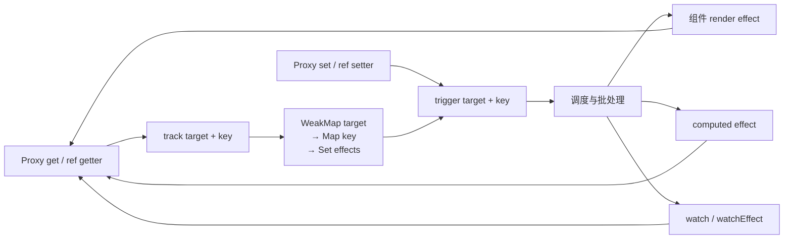

Vue 3 对普通对象使用 Proxy，对 `ref` 的 `.value` 使用 getter / setter，并以 `WeakMap<target, Map<key, Set<effect>>>` 为概念模型记录依赖。[响应式深入指南](https://vuejs.org/guide/extras/reactivity-in-depth.html)给出了 `track` / `trigger` 的简化实现。

几个常见误区需要单独澄清：

- `reactive` 返回的是代理；直接解构一个原始属性会失去对该属性的访问拦截，除非使用 `toRefs` 或编译器支持的 props 解构语义。
- `ref` 不是 Proxy 的临时补丁，而是为原始值、显式容器和组合函数返回值提供稳定引用语义。
- effect 依赖是在执行时收集的，因此分支改变后需要清理旧依赖；调度器还要处理去重、执行顺序与递归更新。
- Options API 的 `data`、`computed`、`watch` 和生命周期最终仍建立在同一响应式与组件运行时之上。

### 7.2 编译器与运行时协同

**问题：Vue 3 为什么仍使用 VDOM，却能避免许多通用 VDOM 工作？**

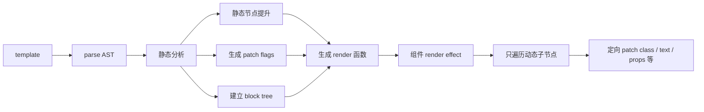

Vue 3 的模板编译器会标记动态绑定类型、提升静态节点，并把动态后代收集进 block。运行时更新时可以跳过大块静态树，而不是盲目遍历全部 VNode。[渲染机制指南](https://vuejs.org/guide/extras/rendering-mechanism.html)将其称为 compiler-informed Virtual DOM。

这解释了 Vue 的独特位置：它既保留 VDOM 带来的声明式组件和跨平台能力，又利用模板不是任意 JavaScript 这一事实做静态优化。JSX 或手写 render 更自由，但编译器通常能推断的信息更少。

### 7.3 `runtime-core`、平台 renderer 与 SSR compiler

Vue 3 仓库把响应式、平台无关组件运行时、DOM renderer、服务端 renderer、SFC compiler 和不同模板 compiler 拆成包。[核心仓库贡献指南](https://github.com/vuejs/core/blob/main/.github/contributing.md)列出了这些边界。

工程上可以据此理解：

- `@vue/runtime-core` 定义组件、VNode、调度和 renderer 协议；
- `@vue/runtime-dom` 提供 DOM 节点创建、属性 patch 与事件等宿主操作；
- `@vue/server-renderer` 走服务端输出路径，不是在服务器里模拟 DOM；
- `@vue/compiler-sfc` 拆解 SFC，再调用 DOM 或 SSR compiler；
- NativeScript-Vue 等方案可以接入自定义宿主，而 Ionic Vue 仍主要运行在 Web DOM / WebView 模型中。

## 8. 2020—2026：Vue 3.x 不只是“3.0 发布后维护”

Vue 3.0 于 2020-09-18 稳定发布。[官方发布说明](https://blog.vuejs.org/posts/vue-3-one-piece)之后，3.x 的重心从“新内核可用”逐步转向 SFC 编译体验、TypeScript、响应式效率、SSR 水合与下一代无 VDOM 编译模式。

| 版本 | 时间 | 核心内容 | 主要解决的问题 |
|---|---:|---|---|
| 3.0 | 2020-09 | Proxy 响应式、Composition API、Fragments、Teleport、Suspense、应用实例 API、新 renderer 架构 | Vue 2 的侦测限制、全局污染、逻辑复用和类型化困难 |
| 3.1 | 2021 | 迁移构建、运行时编译兼容改进 | 为大型 Vue 2 应用提供逐步定位破坏性变化的桥梁 |
| 3.2 | 2021-08 | `<script setup>`、CSS `v-bind`、effect scope 等稳定 | 降低 Composition API 的样板代码，统一 SFC 编译语义 |
| 3.3 | 2023-05 | 外部 / 复杂 TS 类型支持、泛型组件、typed slots；`defineModel` 与响应式 props 解构处于实验阶段 | 改善库作者和大型 TS 项目的 SFC 类型表达 |
| 3.4 | 2023-12 | parser 重写、响应式改进、`defineModel` 稳定、移除 Reactivity Transform | 降低编译成本并收敛长期 API；避免隐式响应式语义扩张 |
| 3.5 | 2024-09 | 响应式系统重构、响应式 props 解构稳定、懒水合、`useId`、水合不匹配控制、watcher cleanup | 优化内存与更新，补齐 SSR / 可访问性 / effect 生命周期能力 |
| 3.6 | 预发布 | Vapor Mode、进一步响应式与编译运行时演进 | 探索把可静态确定的模板编译为更细粒度更新，绕开 VDOM 成本 |

对应证据可见 [Vue 3.2](https://blog.vuejs.org/posts/vue-3-2)、[Vue 3.3](https://blog.vuejs.org/posts/vue-3-3)、[Vue 3.4](https://blog.vuejs.org/posts/vue-3-4)、[Vue 3.5](https://blog.vuejs.org/posts/vue-3-5)公告以及[核心仓库发布页](https://github.com/vuejs/core/releases)。这里必须保留两个状态边界：

1. Reactivity Transform 曾试图让局部变量自动保留响应式，但最终被移出核心；这表明“少写 `.value`”不足以抵消语言语义变得隐式的成本。
2. 截至本文日期，Vue 3.6 仍为 RC 线，Vapor 不能按稳定生产能力描述。它代表方向，不代表所有现有 VDOM 组件与生态插件已经无成本兼容。

### 8.1 `<script setup>` 是编译协议，不是新组件运行时

`<script setup>` 中的 `defineProps`、`defineEmits`、`defineModel` 等是编译器宏，不需要也不应该在运行时调用。它们让模板可以直接访问顶层绑定，并让编译器同时生成组件选项与类型信息。[`<script setup>` 官方 API](https://vuejs.org/api/sfc-script-setup.html)给出了宏的具体边界。

这解决了 Options API 与普通 `setup()` 中重复暴露变量、props / emits 声明分散的问题。代价是宏必须在编译阶段理解源码；部分类型到运行时校验的推导采用 AST 分析，而不是启动完整 TypeScript 类型检查器。因此“TypeScript 能表达”不必然等于“宏可以把它完整转换为运行时选项”。

### 8.2 Vue 2.7 是桥，不是 Vue 3 的完整回移植

Vue 2.7 于 2022 年发布，把 Composition API、`<script setup>`、CSS `v-bind` 等能力回移植到 Vue 2，目的是让旧应用先迁移逻辑组织和工具链，再迁核心运行时。[Vue 2.7 公告](https://blog.vuejs.org/posts/vue-2-7-naruto)同时列出了与 Vue 3 的差异，例如它仍基于 getter / setter 响应式，并受 Vue 2 运行时约束。

Vue 3 在 2022 年成为 npm 与官方文档的默认版本；Vue 2 在 2023-12-31 结束生命周期。[Vue 3 成为默认版本的公告](https://blog.vuejs.org/posts/vue-3-as-the-new-default)与[官方 FAQ](https://vuejs.org/about/faq)给出了这两个迁移节点。EOL 的含义是官方不再提供常规修复，并不表示存量应用在日期到来时自动停止运行；真正风险是浏览器、安全、依赖与人才成本继续变化，而核心不再随之演进。

## 9. 构建工具链：从 loader 堆栈到 Vite 8

Vue 的构建史可以分为四代：

1. **vueify / vue-loader 时代**：解决 SFC 如何进入 Browserify / webpack，但项目结构和配置仍由团队自行拼装。
2. **Vue CLI 时代**：从早期模板生成器发展为 Vue CLI 3 的插件化服务，用统一命令封装 webpack、Babel、lint、测试与现代模式构建。
3. **Vite 1—7 时代**：开发阶段以原生 ESM 和按需转换降低启动成本，生产阶段继续 bundle；核心逐渐框架无关，并发展出 SSR 与 Environment API。
4. **Vite 8 时代**：以 Rolldown 和 Oxc 为主线，减少此前 esbuild 与 Rollup 两套管线之间的语义和性能裂缝。

### 9.1 Vue CLI 解决的是配置产品化

早期 `vue-cli` 主要下载预设模板。Vue CLI 3 在 2018 年转为 `@vue/cli-service` + 插件体系：核心提供 webpack 配置与命令，插件按需注入 Babel、TypeScript、PWA、测试等能力，并允许 UI 或 preset 复现配置。

它解决了团队反复复制 webpack 配置、模板很快过时、升级难回流的问题，却也形成新的中心化成本：

- 用户配置最终被转换为庞大的 webpack 配置，调试需要穿透抽象层；
- 启动与热更新随应用模块图扩大而变慢；
- Vue CLI 插件必须跟随 CLI 的生命周期；
- CJS 配置和 webpack 专属 loader / plugin 加深工具锁定。

Vue CLI 现已进入维护模式，官方对新项目推荐 `create-vue` + Vite。[Vue CLI 首页](https://cli.vuejs.org/)与[Vue 工具链指南](https://vuejs.org/guide/scaling-up/tooling)都明确标注了这一方向。维护模式不意味着必须立即重写仍稳定工作的 CLI 应用；它意味着新能力和生态投资已经移向 Vite。

### 9.2 Vite 为什么快，以及为什么生产仍需 bundle

**问题：Vite 各阶段怎样改变“源码到浏览器”的路径？**

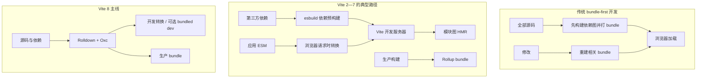

传统工具通常在服务器启动前构建整个应用 bundle。Vite 开发服务器利用浏览器原生 ESM，让浏览器通过 import 图按需请求模块；服务端只转换被访问的文件。第三方依赖则预构建，以处理 CommonJS、合并大量内部模块请求并稳定依赖边界。HMR 利用模块图只传播受影响边界。[Vite 的设计动机](https://vite.dev/guide/why.html)对这一路径及其来源有完整说明。

生产仍需要 bundle，因为深层 import 瀑布、网络往返、缓存切分和代码分割不能简单交给未经优化的源码模块图。Vite 早期因此形成“开发由 esbuild 辅助，生产由 Rollup 构建”的双管线：速度与成熟生态兼得，但插件行为、转换细节和边缘语义可能不一致。

### 9.3 Vite 不是“Vue 的新 CLI”这么简单

[Vite 2 公告](https://vite.dev/blog/announcing-vite2)将核心重构为框架无关，并提供与 Rollup 风格一致的插件 API。Vue SFC 支持位于 `@vitejs/plugin-vue`；React、Svelte 等框架可以使用自己的插件。Vite 逐渐成为：

- 浏览器开发服务器与 HMR 引擎；
- 模块解析、转换和插件容器；
- 生产构建入口；
- SSR 模块加载基础；
- Vitest 等工具共享的源码处理管线。

这解决了“开发、测试、SSR 各维护一套 alias / TS / 插件转换配置”的重复劳动，但不会自动消除环境差异。浏览器、Node、edge runtime 对内建模块、条件导出、全局对象和网络 API 的支持仍然不同。

### 9.4 Vite 主要大版本演化

| 版本 | 发布时间 | 核心内容 | 解决的问题 |
|---|---:|---|---|
| Vite 1 | 2020 | 验证原生 ESM 开发服务器与 Vue SFC HMR；未形成正式稳定大版本 | 探索 bundle-first 开发之外的路径 |
| Vite 2 | 2021-02 | 首个稳定大版本；框架无关核心、通用插件 API、SSR 基础 | 从 Vue 专用实验演化为可扩展工具平台 |
| Vite 3 | 2022-07 | ESM SSR 默认、依赖优化和生态 CI 改进 | 减少 SSR 双格式负担并降低生态升级风险 |
| Vite 4 | 2022-12 | Rollup 3；框架插件移出核心仓库 | 缩小核心职责、加快独立演进 |
| Vite 5 | 2023-11 | Rollup 4、API 清理、Node CJS API 废弃 | 清理历史兼容层，为 ESM 工具链收敛 |
| Vite 6 | 2024-11 | 实验性 Environment API | 抽象 client、SSR、RSC 等不同运行环境的构建与运行管线 |
| Vite 7 | 2025-06 | ESM-only、提高 Node 基线、Rolldown 预览、新浏览器目标基线 | 减少旧 Node / CJS 兼容成本，准备统一工具链 |
| Vite 8 | 2026-03 | 稳定切换到 Rolldown / Oxc 主线 | 统一长期存在的 esbuild + Rollup 双管线并提升大项目吞吐 |
| Vite 8.1 | 2026-06 | 实验性 bundled dev | 应对超大模块图中浏览器请求与转换瀑布成为瓶颈的场景 |

官方公告分别见 [Vite 3](https://vite.dev/blog/announcing-vite3)、[Vite 4](https://vite.dev/blog/announcing-vite4)、[Vite 5](https://vite.dev/blog/announcing-vite5)、[Vite 6](https://vite.dev/blog/announcing-vite6)、[Vite 7](https://vite.dev/blog/announcing-vite7)、[Vite 8](https://vite.dev/blog/announcing-vite8)与[Vite 8.1](https://vite.dev/blog/announcing-vite8-1)。

Vite 8 的“统一”要准确理解：主要 JavaScript / TypeScript 转换与 bundling 基础设施收敛到 Rolldown / Oxc，不表示 HTML、CSS、框架编译、插件副作用和所有运行环境都变成一个没有差异的阶段。升级仍应检查插件 hook、输出 chunk、CommonJS 互操作、SSR externalization 和浏览器目标。

## 10. 测试工具链：从转译适配到 Vite-native 的 Vitest

Vue 应用测试早期常用 Karma + Mocha：真实浏览器提供运行环境，但启动和反馈较慢。随后 Jest 因断言、mock、快照、覆盖率和 worker 体验成为主流；Vue SFC 则需要 `vue-jest` 等 transformer，把 Jest 的模块处理链与 Vue 编译器接起来。

问题在于应用由 webpack / Vite 解析，而测试由 Jest 自己解析。alias、虚拟模块、CSS、资源、ESM、TypeScript 和 SFC 插件可能在两条管线上产生不同结果。Vitest 的核心目标不是“复制 Jest 的名字”，而是让测试复用 Vite 的配置、解析、转换和插件图，同时提供兼容度较高的 Jest 风格 API。[Vitest 设计说明](https://vitest.dev/guide/why.html)明确列出了这些目标。

### 10.1 Vitest 的执行边界

**问题：复用 Vite 配置后，测试在哪些层仍然可能与生产不同？**

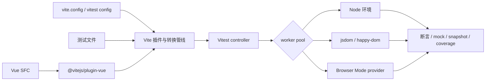

“同一转换管线”只保证模块如何被找到和编译更接近应用，不保证运行环境相同：

- Node 环境速度快，但没有真实 DOM、布局、导航和浏览器安全模型；
- jsdom / happy-dom 模拟 DOM API，不会完整实现渲染、CSS 布局和所有 Web API；
- Browser Mode 在真实浏览器执行，仍需选择 Playwright、WebdriverIO 等 provider，并承担浏览器启动、隔离和可重复性成本；
- SSR 测试还需验证服务端输出与客户端 hydration，而不是只 mount 一次组件。

[Browser Mode 的动机说明](https://vitest.dev/guide/browser/why.html)解释了模拟 DOM 的边界。Vitest 4 将 Browser Mode 标为稳定并加入可视化回归与 trace 能力，但“稳定 runner”仍不等于每个项目已经拥有足够的跨浏览器覆盖。[Vitest 4 公告](https://vitest.dev/blog/vitest-4)。

### 10.2 Vitest 0.x—5 的演进

| 阶段 | 时间 | 核心演进 | 解决的问题 |
|---|---:|---|---|
| 0.x | 2021—2023 | 验证 Vite-native runner、watch、worker、Jest 风格 API | 消除应用与测试的转换配置分叉 |
| 1.0 | 2023-12 | 首个稳定大版本 | 为插件、项目配置和公共 API 建立稳定基线 |
| 2.x | 2024 | 扩展 Browser Mode、workspace / project 与执行池能力 | 支持多项目和更接近浏览器的测试拓扑 |
| 3.x | 2025-01 | reporter API、内联 workspace、多浏览器与缓存演进 | 改善大型仓库编排、报告器和反馈速度 |
| 4.x | 2025-10 | Browser Mode 稳定、视觉回归、trace、provider 能力 | 把组件测试从模拟 DOM 推近真实浏览器诊断 |
| 5.x | 2026-09 | 共享 Vite server、稳定文件模块缓存、worker 与 Trace View 改进 | 降低大型套件重复转换和调度成本 |

3—5 的具体变化见 [Vitest 3 公告](https://vitest.dev/blog/vitest-3)、[Vitest 4 公告](https://vitest.dev/blog/vitest-4)和[Vitest 5 公告](https://vitest.dev/blog/vitest-5)。Vitest 5 提高了 Node 与 Vite 的版本基线；升级时应把 runner、coverage provider、browser provider、假定时器和 mock hoisting 作为一组兼容面验证。

### 10.3 测试生态中的职责分工

- **Vue Test Utils**：提供 mount、wrapper 和 Vue 组件交互语义，不负责选择真实浏览器还是模拟 DOM。
- **Vitest**：负责测试发现、转换、执行、断言、mock、覆盖率和报告。
- **Testing Library**：强调从用户可观察行为查询和交互，可与 Vitest / Vue Test Utils 组合。
- **Cypress / Playwright**：负责浏览器级组件或端到端流程；它们验证的边界比 Node 单元测试更接近实际产品，但成本更高。

工程上不应争论“只用哪一个”。较稳健的分层是：纯函数和 composable 用 Node 单测；依赖 DOM 的组件用真实 Browser Mode 或浏览器组件测试；路由、网络、SSR hydration 和跨页流程用端到端测试。测试金字塔的具体比例取决于失败成本，而不是框架默认。

## 11. 官方应用层：Router、Vuex / Pinia、Devtools 与 Volar

### 11.1 Vue Router：从路由插件到类型化路由基础设施

Vue Router 早期解决 SPA 中 URL、组件视图、history 与导航守卫的同步。Vue Router 4 为 Vue 3 重写，把构造器形式改为 `createRouter()`，显式选择 web、hash 或 memory history；`currentRoute` 变成 ref，核心也更利于 tree-shaking。SSR 中 memory history 不读取浏览器全局，可由每个请求显式驱动。[v3 到 v4 迁移指南](https://router.vuejs.org/guide/migration/)记录了这些变化。

Vue Router 5 在 2026 年把原 `unplugin-vue-router` 的文件路由与类型能力合入核心发行体系，同时尽量保持非文件路由用户无破坏升级。[Vue Router 变更日志](https://github.com/vuejs/router/blob/main/packages/router/CHANGELOG.md)是该版本状态的直接依据。

Router 解决的是导航状态，不自动解决以下问题：

- 页面数据何时获取、失败后如何呈现；
- SSR 首次导航与客户端接管如何共享结果；
- 权限是界面可见性还是服务端授权；
- 微前端中谁拥有顶层 URL、base path 和回退页面。

Nuxt 等元框架之所以继续封装 Router，是因为这些应用级问题需要文件约定、数据协议和服务端共同参与。

### 11.2 Vuex 到 Pinia：从事件式单树到组合式 Store

Vuex 在 Vue 1 时代出现，借鉴 Flux 思路，用单一状态树、mutation、action 与 devtools 记录，为大型应用提供可预测的共享状态。Vuex 3 对应 Vue 2；Vuex 4 适配 Vue 3，但保留 Vuex 3 风格 API。

Pinia 从 2019 年的 Composition API store 实验发展而来，后来承接 Vuex 5 的设计方向并成为官方默认推荐。它以多个 `defineStore` store 取代嵌套 module，以普通函数和直接类型推导减少 mutation type、namespace 和 wrapper 类型的样板。[Pinia 介绍](https://pinia.vuejs.org/introduction)说明了这条历史；[Vuex 迁移指南](https://pinia.vuejs.org/cookbook/migration-vuex.html)展示了 module 到 store 的对应关系。

Pinia 不是“取消状态纪律”。它把纪律从框架强制的 mutation 层移动到 store action、订阅、插件和团队约定。直接写 state 更短，但跨 store 事务、异步竞态、持久化、撤销和服务端请求隔离仍需显式设计。关于二者的进一步对照，可参阅本仓库的[《Vue 状态管理演进：从 Vuex 到 Pinia》](./vuex-pinia.md)；其中具体实现细节仍应以当前 Pinia / Vuex 文档为准。

Pinia 4 于 2026 年进入当前主线，进一步收敛到现代 ESM 与新版 devtools API。[Pinia 发布记录](https://github.com/vuejs/pinia/releases)可用于核对具体升级项。

### 11.3 Devtools：可观察性是框架能力的一部分

Vue Devtools 从早期浏览器扩展发展到支持组件树、props、事件、Pinia / Vuex、性能时间线和插件检查器。其意义不是“方便看变量”，而是让框架内部的组件实例、响应式更新和状态变更拥有可观察协议。

当前 Devtools 主线面向 Vue 3；Vue 2 需要 legacy 版本，Nuxt 还提供集成更深的 Nuxt DevTools。[安装文档](https://devtools.vuejs.org/getting-started/installation)明确区分了这些入口。生产环境是否启用、是否暴露敏感状态以及插件采集成本，需要单独评估。

### 11.4 Vetur 到 Volar：编辑器插件变成语言核心

Vetur 为 VS Code 提供早期 Vue SFC 语法、补全与诊断，但 Vue 3 的 Composition API、`<script setup>` 和复杂 TypeScript 推导要求更精确地把 template 映射成 TypeScript 可理解的虚拟代码。Volar 因此采用语言核心 + 编辑器适配结构，后来成为官方 Vue Language Tools 的基础，并把核心抽象扩展到其他嵌入式语言场景。[Volar 1.0 公告](https://blog.vuejs.org/posts/volar-1.0)和[项目演化说明](https://blog.vuejs.org/posts/volar-a-new-beginning)解释了这一变化。

它解决的是“编辑器怎样理解跨 template / script / style 的同一个组件”。这与 `vue-tsc` 的命令行类型检查相连，但编辑器无红线不等于构建、运行和 SSR 正确；反过来，Vite 能转译 TypeScript 也不代表已经执行类型检查。

## 12. 服务端渲染：从 renderer 到 Nuxt / Nitro 多运行时

### 12.1 先区分六种输出策略

| 策略 | HTML 生成时机 | 客户端 JavaScript | 适合的问题 | 主要代价 |
|---|---|---|---|---|
| CSR | 浏览器运行时 | 通常完整加载 | 高交互后台、登录后应用 | 初始内容依赖 JS；首屏和抓取需额外治理 |
| 请求时 SSR | 每次请求 | 通常 hydration | 个性化且需首屏 HTML 的页面 | TTFB、服务器容量、缓存和每请求隔离 |
| Streaming SSR | 请求中分块输出 | hydration | 降低等待完整 HTML 的时间 | 错误边界、数据顺序和代理缓冲更复杂 |
| SSG / prerender | 构建时 | 可有可无 | 内容稳定、路由可枚举 | 构建规模与内容新鲜度 |
| ISR / 增量再生 | 首次或过期后 | 通常 hydration | 大量内容页兼顾缓存与更新 | 失效、一致性和平台绑定 |
| Islands / 部分水合 | 构建或请求时 | 仅交互岛 | 内容为主、少量交互 | 跨岛状态、框架约束与调试模型变化 |

Vue 核心直接提供客户端渲染、服务端渲染与 hydration 原语。SSG、ISR、route rules、边缘部署和 islands 往往由 Nuxt、VitePress 或其他上层框架组织。不能把这些全部写成“Vue SSR 自带”。

### 12.2 SSR 与 hydration 的真实序列

**问题：一次 Vue SSR 请求经过哪些状态边界，哪里最容易产生错配或泄漏？**

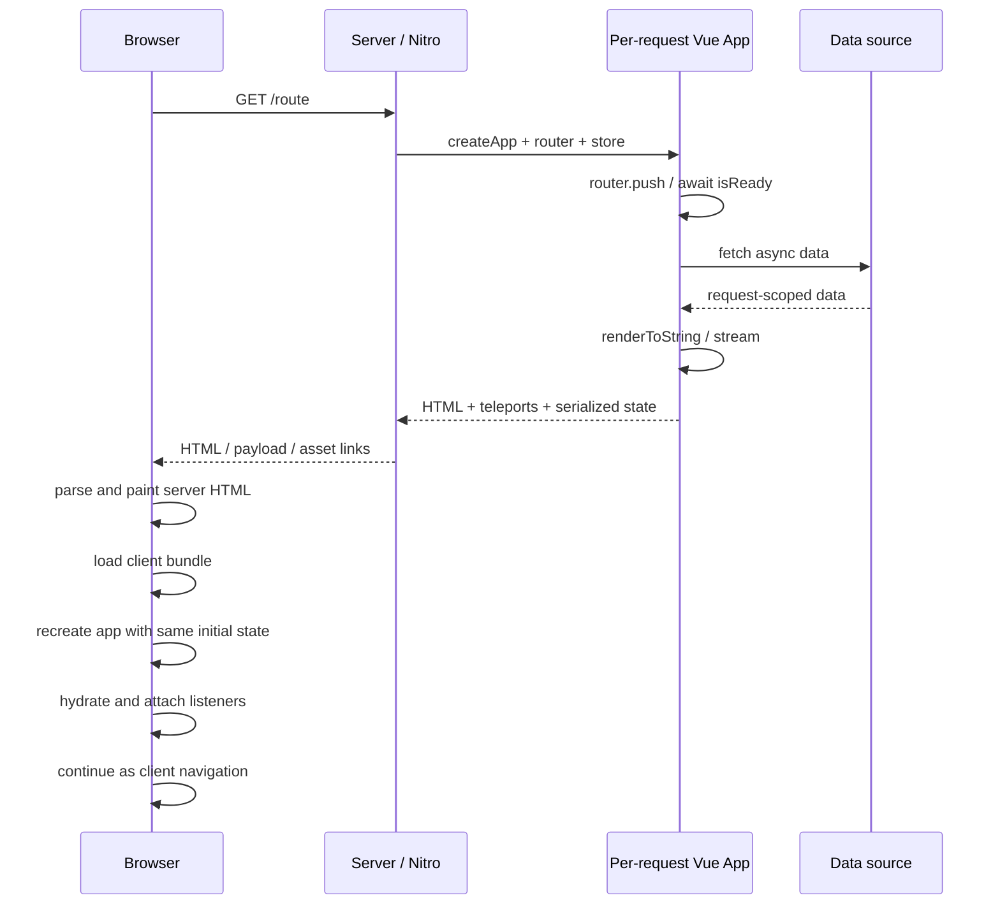

服务端必须为每个请求创建 app、router 和 store。若把可变单例放在模块顶层，一个用户状态可能进入另一个请求，这就是 cross-request state pollution。[Vue SSR 指南](https://vuejs.org/guide/scaling-up/ssr)还列出 hydration mismatch 的常见来源：无效 HTML 被浏览器纠正、随机数、时区差异以及只在某一端存在的数据。

hydration 不是“把 HTML 再渲染一次”，而是客户端运行同一组件树，把 VNode 与现有 DOM 对齐并附加事件。两端输出不一致时，框架可能修复 DOM，但会增加成本，也可能掩盖用户已经看到的错误内容。Vue 3.5 的 lazy hydration 与 `data-allow-mismatch` 提供更精细的控制，却不能替代确定性数据和合法 HTML。

状态序列化还必须防止脚本注入；服务端副作用需要在请求结束时清理；访问 `window` / `document` 的库要推迟到客户端；平台 API 应通过适配层隔离。SSR 的复杂性主要来自**同一业务逻辑在两个运行时执行**，不是 `renderToString` 这个函数本身。

### 12.3 Vue 2 SSR 到 Vue 3 server renderer

Vue 2 的 `vue-server-renderer` 与 Vue 2 runtime 版本需要严格匹配，围绕 bundle renderer、server/client manifest 与 webpack 集成形成典型方案。Vue 3 则以 `@vue/server-renderer` 配合新的 runtime-core / compiler-ssr，并让 Vite 的 SSR module loading 成为开发和框架基础。

Vue 3 改善了组件与 renderer 的平台边界，也引入 Teleport、Suspense 和异步组件的新 SSR 语义。应用仍需决定：

- 等待哪些数据后再输出，哪些边界允许流式推进；
- head、状态与 payload 怎样安全序列化；
- 缓存按页面、组件、数据还是 CDN 响应建立；
- 服务端与客户端使用相同代码还是显式 `.client` / `.server` 分离；
- 出错后返回完整错误页、局部 fallback 还是客户端重试。

因此，核心 renderer 更适合框架作者或高度定制平台；一般业务使用 Nuxt 可以减少重复实现这些协议。

### 12.4 Nuxt 1 / 2：把 Vue SSR 产品化

Nuxt 在 2016 年出现，Nuxt 1 于 2018 年稳定，Nuxt 2 随后成为长期主线。其关键贡献是用文件系统路由、页面与 layout、数据获取、middleware、模块、head 管理、client/server 插件和统一构建命令，把 Vue 2 SSR 从底层能力变成应用框架。

它主要解决：

- 每个项目重复编写 server entry、client entry 和路由预取；
- SSR 与 SPA 两种构建配置分叉；
- 页面代码分割、资源注入和错误页缺少统一约定；
- 部署到 Node server 或静态生成需要不同手工管线。

Nuxt 2 的长期成功也积累了 webpack、Vue 2、CommonJS、模块容器和旧 hooks 的兼容负担。这使 Nuxt 3 最终选择重写，而不是只升级 Vue 依赖。

### 12.5 Nuxt 3：Vue 3 + Vite + Nitro 的体系重写

Nuxt 3 于 2021-10 进入 Beta，2022-11 稳定。它采用 Vue 3、TypeScript、ESM、Composition API、Vite，以及独立的 Nitro server engine。[Nuxt 3 Beta 公告](https://nuxt.com/blog/nuxt3-beta)和[稳定发布讨论](https://github.com/nuxt/nuxt/discussions/15984)记录了这次重写。

Nitro 把“Vue 页面 SSR”与“服务器如何打包和部署”解耦：同一应用可以产生 Node、serverless、edge 等 preset，提供 server routes、存储、缓存、资源与 route rules。Nuxt 因而不再只是 Vue SSR 脚手架，而是一个多运行时全栈构建系统。

**问题：Nuxt 如何在同一应用中组合静态、缓存与请求时渲染？**

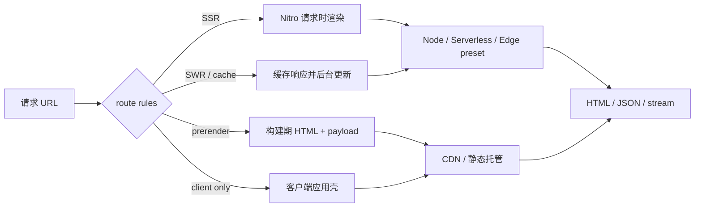

[Nuxt server 文档](https://nuxt.com/docs/4.x/getting-started/server)与[预渲染文档](https://nuxt.com/docs/4.x/getting-started/prerendering)说明了 Nitro route rules 和 payload extraction 等能力。图中是职责模型，不保证每个部署 provider 支持完全相同的缓存与 streaming 语义；平台适配仍需真实部署验证。

### 12.6 Bridge、Nuxt 4 与 Nuxt 5 边界

Nuxt Bridge 把 Nuxt 3 的部分能力带入 Nuxt 2，让项目逐步采用 Composition API、Nitro、Vite 或新模块兼容层，但它不是完整 Nuxt 3。[Bridge 文档](https://nuxt.com/docs/4.x/bridge/overview)列出了其能力与限制。

Nuxt 4 于 2025-07 稳定，重点是应用目录结构、数据获取与类型隔离、兼容性和开发体验，而非再次替换 Vue 内核。[Nuxt 4 公告](https://nuxt.com/blog/v4)和[官方路线图](https://nuxt.com/docs/4.x/community/roadmap)显示：Nuxt 4 是当前活跃主线，Nuxt 3 已在 2026-07 结束支持。

Nuxt 5 截至本文日期仍是未来开发线。官方升级文档允许通过 compatibility version 提前验证部分行为，但这不是稳定发布声明。[Nuxt 升级指南](https://nuxt.com/docs/4.x/getting-started/upgrade)应作为后续状态核对入口。

### 12.7 VuePress、VitePress 与内容型渲染

VuePress 把 Vue + webpack + Markdown 用于文档静态生成：构建时生成 HTML，每个页面又可作为 Vue SPA 增强。VitePress 则基于 Vue 3 和 Vite，成为 VuePress 1 的精神继任者；它对静态内容采用更积极的 payload 与 hydration 优化。[VitePress 定位说明](https://vitepress.dev/guide/what-is-vitepress)同时指出 VuePress 1 已弃用，VuePress 2 已交由社区团队维护。

VitePress 1.0 于 2024-03 稳定。[发布公告](https://blog.vuejs.org/posts/vitepress-1-0)将其定位于快速、以内容为中心的站点。它解决的不是任意全栈业务 SSR，而是 Markdown 路由、主题、代码高亮、搜索、静态生成与客户端增强这组文档场景。

选择边界可以概括为：

- 内容主要来自 Markdown、路由构建时可知：优先考虑 VitePress；
- 需要请求时数据、服务端 API、认证、混合缓存与多部署目标：优先考虑 Nuxt；
- 仅少量页面需要 SEO，不要默认全站 SSR；预渲染或独立营销站可能更简单；
- 内部后台若首屏与抓取不重要，CSR 往往拥有更低的运行和调试成本。

## 13. 社区生态：UI、跨端与微前端各自解决不同层的问题

### 13.1 UI 组件库的演进是运行时迁移的放大镜

Element UI、Vuetify、Quasar 等在 Vue 2 时代把组件、主题、表单、弹层和布局规范产品化。Vue 3 到来后，Element Plus 等分支需要重写内部依赖：VNode API、`v-model` 协议、Teleport、CSS 变量、TypeScript、构建输出与按需导入都可能改变。[Element Plus 迁移指南](https://element-plus.org/zh-CN/guide/migration.html)体现了组件库升级不只是改 peer dependency。

社区库主要解决“重复实现通用交互和设计系统”的问题，但带来四类约束：

- 框架主版本与组件库大版本绑定；
- 主题 token、全局样式和弹层容器进入应用基础设施；
- SSR 中需处理样式收集、随机 ID、Teleport 与 hydration；
- 无障碍、国际化和输入设备覆盖不能只从外观判断。

Quasar 进一步把 UI、CLI 与 SPA / SSR / PWA / Cordova / Capacitor / Electron / 浏览器扩展模式组合在同一框架中。[Quasar 介绍](https://quasar.dev/introduction-to-quasar/)展示了这种“多目标应用框架”定位。它减少配置分叉，也意味着团队更深地采用其构建与组件约定。

### 13.2 “Vue 跨端”至少包含三种运行模型

**问题：同样使用 Vue 语法，跨端方案最终渲染的到底是什么？**

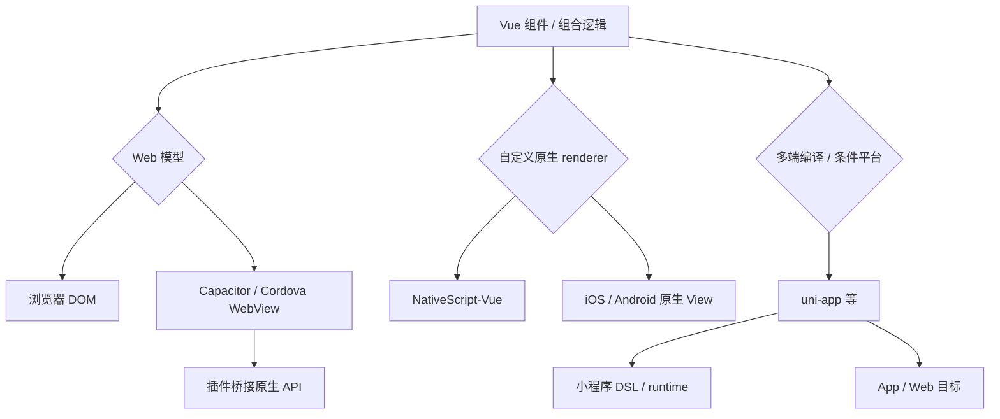

三种模型共享的通常是 Vue 的组件作者体验，而不是同一个宿主：

- Ionic Vue / Quasar + Capacitor 通常仍渲染 DOM，再通过 WebView 容器和插件访问原生能力；
- NativeScript-Vue 把 Vue renderer 接到 NativeScript 的原生视图树，并非 WebView。[NativeScript-Vue 文档](https://nativescript-vue.org/)给出了这一运行时模型；
- uni-app 等把源码编译或适配到 Web、小程序和 App，不同目标仍有组件、CSS、生命周期与能力差异。

Weex 曾以 Vue / Web 风格语法驱动原生移动 UI，是 Vue 2 跨端愿景的重要历史尝试；Apache Weex 孵化项目于 2021 年因活跃度不足退役。[Apache 项目记录](https://incubator.apache.org/projects/weex.html)说明了其生命周期。它留下的教训是：自定义 renderer 能复用组件模型，但平台控件语义、生态维护、调试与原生扩展决定方案能否长期成立。

跨端运行时、桥接、性能和选型已在本仓库的[《跨端应用开发：Android、iOS、PC 与小程序的十年演进与工程取舍》](../cross-platform/cross-platform-application-development.md)中展开，本文不重复其平台细节。

### 13.3 微前端不是 Vue 核心能力

single-spa、qiankun 与 Module Federation 解决的是多个应用的装载、路由归属、独立交付和远程模块共享，不是 Vue 响应式或组件渲染问题。Vue 只作为其中一个子应用运行时。

**问题：把多个 Vue 应用放在一个页面，新增了哪些所有权边界？**

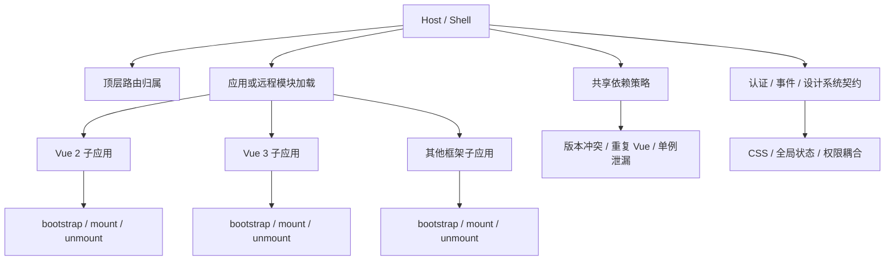

`single-spa-vue` 为 Vue 2 / 3 适配 bootstrap、mount、unmount 生命周期；single-spa 文档也要求应用在卸载时清理资源。[Vue 适配文档](https://single-spa.js.org/docs/ecosystem-vue/)与[应用生命周期](https://single-spa.js.org/docs/5.x/building-applications/)可作为协议依据。

Vite 环境还要处理开发时原生 ESM、生产模块格式、import map 或 federation runtime 之间的注册表差异。[single-spa 的 Vite 说明](https://single-spa.js.org/docs/ecosystem-vite/)警告了重复依赖等边界；[Module Federation 的 Vite 集成](https://module-federation.io/integrations/build-tool/vite)则提供 expose / consume / shared 模块能力。

工程上，微前端只有在团队、部署节奏和故障域确实需要独立时才抵消复杂度。若只是代码目录很大，monorepo、包边界和模块化路由通常更便宜。最危险的状态是表面独立部署，实则共享全局 CSS、顶层 router、未经版本化的事件和同一个可变 store。

## 14. 迁移史：真正的迁移单位是依赖图

Vue 2 到 Vue 3 的迁移经常失败在“只升级 `vue` 包”。应用实际包含 compiler、SFC loader、router、store、UI 库、测试 transformer、编辑器语言服务、SSR 框架与自研插件。它们各自依赖不同的内部或公开协议。

**问题：不同起点应经过哪些桥接层，而不是直接跳到哪个版本号？**

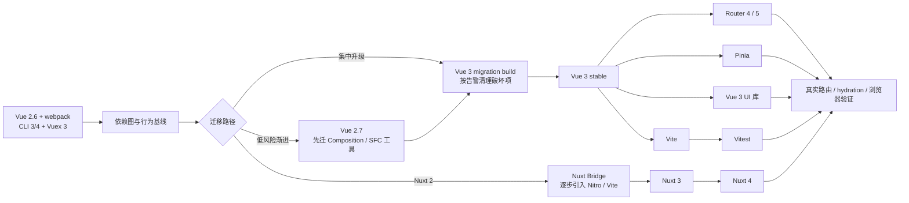

图中的路径不是强制顺序。例如 Vue 3 可以继续使用 webpack，迁 Vue 3 与迁 Vite 可以拆开；Vuex 4 可在 Vue 3 上作为过渡，Pinia 不必和核心同时切换。拆分的价值是缩小一次变更的因果面，代价是临时兼容状态持续更久。

### 14.1 建议按能力而不是文件数量拆迁移

1. **先建行为基线**：关键页面、路由守卫、表单、弹层、状态恢复、SSR 输出和 hydration 是否有自动化或人工证据。
2. **列依赖矩阵**：每个 Vue 插件是否读取 Vue 2 私有实例字段，是否支持 Vue 3，是否有替代分支。
3. **清理破坏性语义**：filters、事件 API、`v-model`、slot、functional component、render function、全局 API等，参照[Vue 3 迁移指南](https://v3-migration.vuejs.org/)。
4. **隔离核心升级与工具升级**：可以先在 webpack 上运行 Vue 3，再迁 Vite；否则 loader、runtime 与业务回归混在一起。
5. **迁移 SSR 请求边界**：禁止模块级可变单例，核对序列化、client-only 副作用、随机值和时区。
6. **再替换 Router / Store / UI 库**：这些改变业务调用面，适合在 Vue 核心稳定后独立验证。
7. **最后收敛测试和 CI**：Vitest 能复用 Vite，但 Jest mock、fake timers、snapshot 和 coverage 结果不可假设完全等价。

### 14.2 Vue 3 的兼容工具分别解决什么

| 工具或阶段 | 能解决 | 不能保证 |
|---|---|---|
| Vue 2.7 | 提前采用 Composition API、`<script setup>` 和部分现代工具 | Proxy 语义、Vue 3 renderer、全部第三方 Vue 3 插件 |
| `@vue/compat` migration build | 在 Vue 3 runtime 上暂时兼容一批 Vue 2 行为并产生告警 | 所有私有 API、过时插件、无告警即行为完全等价 |
| Nuxt Bridge | 在 Nuxt 2 应用中逐步采用 Nuxt 3 的部分基础设施 | 等同于 Nuxt 3 / 4 的目录、模块与运行时 |
| Vuex 4 | 让 Vuex 风格 store 进入 Vue 3 | 自动获得 Pinia 的类型和模块模型 |
| webpack + Vue 3 | 把框架迁移与构建工具迁移拆开 | 获得 Vite 的开发服务器和插件生态 |

### 14.3 迁移验证要覆盖失败机制

- **响应式**：动态属性、数组、Map / Set、解构、watch flush 时机与副作用清理。
- **渲染**：fragment、attrs 透传、slot、Teleport、transition 与自定义 directive。
- **表单**：`v-model` 参数、修饰符、IME、受控值和 UI 库 wrapper。
- **路由**：history base、重复导航、scroll behavior、异步守卫、404 与 SSR 首次路由。
- **状态**：持久化、HMR、store 间依赖、请求隔离、退出登录清理。
- **SSR**：HTML 合法性、payload 安全、hydration mismatch、随机 ID、时区和第三方 DOM 库。
- **构建**：环境变量、动态 import、worker、assets、CJS / ESM、chunk 命名和旧浏览器目标。
- **测试**：mock 提升、假时钟、DOM 环境、coverage、真实浏览器与 CI 并发。

构建通过只证明当前构建图可产出，不证明真实浏览器交互、SSR 部署、缓存策略或第三方服务正确。

## 15. 2026-09-13 生态状态与选型矩阵

下表的“当前版本”来自本文日期执行的 npm `latest` 元数据核对；它是时间快照。生命周期结论则以各项目官方公告和路线图为准。

| 层 | 当前主线快照 | 生命周期判断 | 新项目通常选择 | 存量项目的关键判断 |
|---|---|---|---|---|
| Vue | 3.5.42；3.6 为 RC | Vue 3 活跃；Vue 2 EOL | Vue 3 stable | Vue 2 先评估 2.7 / compat 与依赖图，不把 RC 当默认 |
| 构建 | Vite 8.3.0 | Vite 活跃；Vue CLI 5 维护模式 | `create-vue` + Vite | CLI 项目可把 Vue 与构建迁移拆开 |
| 单测 | Vitest 5.0.0 | 活跃 | Vitest；浏览器层按风险补充 | Jest 不必仅为统一而迁，先核对 mock / coverage 差异 |
| 路由 | Vue Router 5.3.1 | 活跃，兼容 Vue 3 主线 | Router 5 | 从 Router 3 迁移需先经过 v4 API 心智模型 |
| 状态 | Pinia 4.0.3；Vuex 4.1.0 | Pinia 为当前推荐 | Pinia | Vuex 4 可作为 Vue 3 过渡，不必与核心同批重写 |
| SSR / 全栈 | Nuxt 4.5.2 | Nuxt 4 活跃；Nuxt 3 已结束支持 | Nuxt 4 | Nuxt 2 / 3 先核对模块、部署 preset 与数据语义 |
| 文档 SSG | VitePress 1.6.4 | VitePress 活跃；VuePress 1 弃用 | VitePress | VuePress 站点按主题、插件和 Markdown 扩展成本决定 |
| 编辑器 | Vue - Official / Volar | 活跃 | Volar language tools | Vetur 只适合旧 Vue 2 工作区，避免两者同时接管 |
| UI | Element Plus、Vuetify、Quasar 等各自演进 | 社区项目，生命周期独立 | 按设计系统与无障碍需求选 | 不用下载量代替 SSR、主题、可访问性和升级验证 |

对应 npm 包入口：[Vue](https://www.npmjs.com/package/vue)、[Vite](https://www.npmjs.com/package/vite)、[Vitest](https://www.npmjs.com/package/vitest)、[Vue Router](https://www.npmjs.com/package/vue-router)、[Pinia](https://www.npmjs.com/package/pinia)、[Nuxt](https://www.npmjs.com/package/nuxt)与[VitePress](https://www.npmjs.com/package/vitepress)。

### 15.1 场景化决策

| 场景 | 建议起点 | 原因 | 首要风险 |
|---|---|---|---|
| 新的传统 SPA | Vue 3 + Vite + Router + Pinia + Vitest | 官方主线清晰、工具共享转换管线 | 不要把模拟 DOM 测试当浏览器验收 |
| 内容与营销站 | VitePress 或 Nuxt prerender | 输出静态 HTML，运行成本低 | 内容规模、动态预览与构建时长 |
| 个性化、认证、混合缓存站点 | Nuxt 4 + Nitro | 路由、数据、服务端接口与部署集成 | provider 差异、缓存失效、请求隔离 |
| Vue 2 业务系统 | 先审计，再选 2.7 / compat / 局部重写 | 迁移风险主要在插件与行为依赖图 | EOL、安全修复与关键 UI 库支持 |
| 多团队独立交付 | 先验证 monorepo 边界，不足时再微前端 | 微前端只在组织故障域真实存在时有收益 | 路由、CSS、共享 Vue 和契约版本化 |
| 移动端需要 Web 复用 | Ionic Vue / Quasar + Capacitor | DOM 技能与 Web 资产复用高 | WebView 性能、原生插件和平台体验 |
| 移动端需要原生 View | NativeScript-Vue 等自定义 renderer | 避免 WebView，复用 Vue 组件模型 | 生态规模、平台控件差异和调试成本 |

## 16. 贯穿整个历史的五条规律

### 16.1 “渐进式”从接入方式扩展为架构分层

2014 年的渐进式主要指局部接入页面；Vue 1 / 2 时代扩展为按需加入 Router、Vuex 和构建；Vue 3 时代又包含 Options / Composition 共存、runtime-only / compiler build、自定义 renderer 和 SSR 框架选择。渐进式不是“项目永远简单”，而是复杂性可以按问题进入。

### 16.2 编译器知道得越多，运行时可以做得越少

从 SFC 到 patch flags、静态提升、响应式 props 解构，再到 Vapor 探索，Vue 的长期路线是利用模板静态信息减少运行时通用工作。但编译越聪明，源码映射、宏类型边界、构建插件与 IDE 语言服务就越重要。

### 16.3 工具链逐渐从框架附属品变成共享平台

vue-loader 服务于 webpack 中的 Vue SFC；Vue CLI 服务于完整 Vue 项目；Vite、Vitest 与 Volar 则把模块转换、测试执行和嵌入式语言理解抽象成可跨框架的基础设施。这让 Vue 生态获得更广反馈，也要求项目区分“Vue 问题”和“工具平台问题”。

### 16.4 SSR 的演进是运行时数量增加，不是模板搬到服务器

CSR 只有浏览器主运行时；SSR 至少增加 server 与 hydration 两次执行；Nuxt / Nitro 又引入构建时、Node、serverless、edge 和缓存层。每增加一个运行时，平台 API、状态生命周期、错误处理和可观察性都要重新定义。

### 16.5 兼容层降低一次迁移风险，但会增加过渡态成本

Vue 2.7、migration build、Nuxt Bridge、Vuex 4 都允许拆分迁移。它们的价值是可控回归，不是让旧架构永久停留在半迁状态。每个兼容层都应有退出条件、负责团队和验证指标。

## 17. 最终心智模型

**问题：面对一个 Vue 技术决策，应该按什么顺序定位问题？**

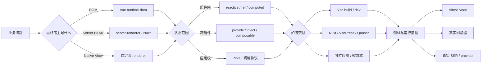

这张图的顺序比“先选流行库”更稳健：先确认宿主与渲染方式，再确认状态生命周期，然后选择交付框架，最后定义与风险匹配的验证环境。Vue 的历史反复说明，很多看似框架 API 的问题，根因实际位于构建、运行时或部署边界。

## 18. 尚未完全收敛的问题

- Vue 3.6 / Vapor 能在多大范围与现有 VDOM 组件、SSR、Devtools 和第三方库平滑组合，仍需以稳定发布和迁移文档为准。
- Vite 8 的统一 bundler 与 bundled dev 会怎样影响大型仓库的插件兼容、缓存和调试，需要真实项目数据，而不是只引用基准。
- Browser Mode 趋于成熟后，组件测试与 Playwright / Cypress 组件测试的职责是否进一步合并，取决于 provider 与 CI 生态。
- edge SSR 的标准 API 看似统一，但 CPU、流、缓存、文件系统、连接复用和观测能力仍由平台决定。
- Vue 生态继续增强编译期能力时，需要维持“普通 JavaScript 心智模型”与宏便利性的平衡；Reactivity Transform 的退出是一个重要先例。

## 19. 官方资料索引

以下索引用于继续核对时间线和当前状态；正文中的关键断言已尽量在对应段落就近引用。

### Vue 核心

- [Vue FAQ：历史、版本与 Vue 2 EOL](https://vuejs.org/about/faq)
- [Vue 3 核心发布记录](https://github.com/vuejs/core/releases)
- [Vue 2 变更日志](https://github.com/vuejs/vue/blob/main/CHANGELOG.md)
- [Vue 3 迁移指南](https://v3-migration.vuejs.org/)
- [Composition API FAQ](https://vuejs.org/guide/extras/composition-api-faq.html)
- [响应式深入](https://vuejs.org/guide/extras/reactivity-in-depth.html)
- [渲染机制](https://vuejs.org/guide/extras/rendering-mechanism.html)

### 构建与测试

- [Vite 设计动机](https://vite.dev/guide/why.html)
- [Vite 发布博客](https://vite.dev/blog/)
- [Vitest 设计动机](https://vitest.dev/guide/why.html)
- [Vitest 发布博客](https://vitest.dev/blog/)
- [Vue 工具链指南](https://vuejs.org/guide/scaling-up/tooling)

### 路由、状态与服务端

- [Vue Router 文档](https://router.vuejs.org/)
- [Pinia 文档](https://pinia.vuejs.org/)
- [Vue SSR 指南](https://vuejs.org/guide/scaling-up/ssr)
- [Nuxt 4 文档](https://nuxt.com/docs/4.x/getting-started/introduction)
- [VitePress 文档](https://vitepress.dev/)

## 20. 一句话收束

Vue 生态的发展史，不是从“简单框架”变成“复杂框架”，而是不断把不可避免的复杂性放到更合适的层：响应式负责依赖，renderer 负责宿主，编译器负责静态知识，Vite 负责模块管线，Vitest 负责可重复执行，Nuxt 负责多运行时应用协议；工程判断的关键，是不让任何一层替另一层做它无法证明的承诺。
