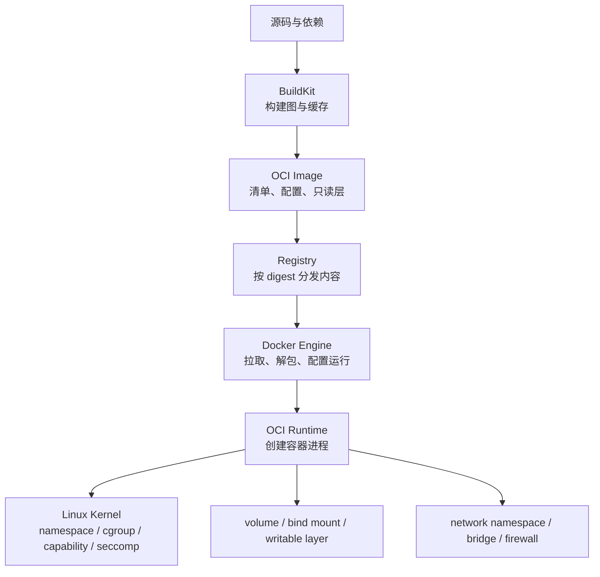
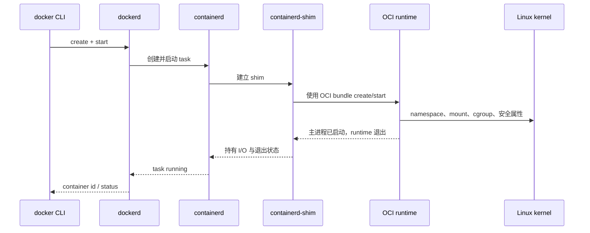
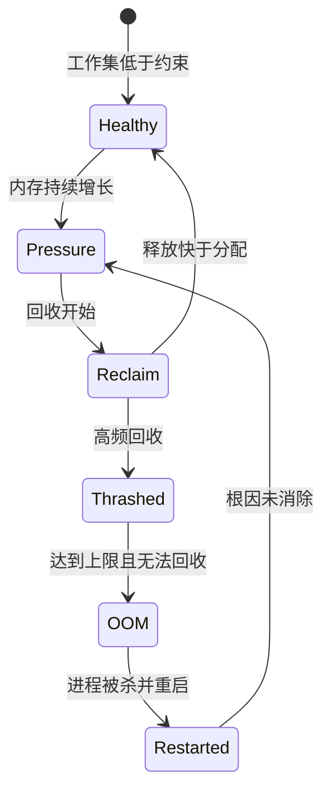
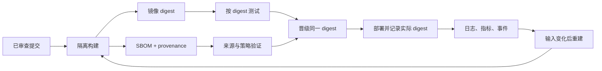

# Docker：容器运行模型、镜像供应链与生产边界

> 查证基线：2026-08-01。本文讨论 Docker Engine、BuildKit、OCI 镜像与 Linux 容器的稳定模型；涉及默认存储后端、Docker Desktop 和网络实现的细节会随版本与宿主平台变化。

## 核心判断：Docker 交付的是受约束的进程，不是轻量虚拟机

Docker 最重要的价值不是“把应用放进一个盒子”，而是把应用运行所需的文件系统、启动参数和依赖声明为可寻址、可分发、可重复实例化的制品，再通过宿主内核为进程建立隔离视图和资源边界。

容器仍然是宿主机上的进程：它通常共享宿主内核，不自带独立内核，也不会天然获得虚拟机级别的安全边界。Linux namespace 改变进程能看到什么，cgroup 控制进程能使用多少资源，capability、seccomp 和 LSM 等机制限制进程能做什么。Docker 把这些内核能力、镜像分发、网络、存储和生命周期管理组合成统一工作流。[Docker Engine security](https://docs.docker.com/engine/security/)

因此，理解 Docker 应围绕四个问题：

1. 镜像如何成为可验证、可复用的运行输入；
2. 容器如何由普通进程获得隔离视图和资源约束；
3. 数据、网络与身份如何跨越容器边界；
4. 哪些可靠性和安全责任仍然属于宿主机与运维系统。



这条路径里，镜像是不可变输入，容器是一次运行实例，volume 是独立于实例生命周期的数据，Registry 是内容分发系统。把它们混成“Docker 包”会导致备份、升级和安全边界全部失真。

### 用一条最短路径建立对象关系

下面不是需要背诵的命令清单，而是同一个对象模型的连续变换：

```bash
docker build -t example-api:dev .
docker run --name example-api -d -p 127.0.0.1:8080:3000 example-api:dev
docker ps
docker logs example-api
docker inspect example-api
docker stop example-api
docker rm example-api
docker image inspect example-api:dev
```

`docker run` 可以理解成 `docker create` 加 `docker start`。镜像描述可重复实例化的输入；容器记录某次实例的运行配置和可写层；`-p` 修改宿主到容器的网络路径；mount 把数据生命周期从容器实例中分离。遇到新命令时，先判断它操作的是哪类对象，而不是继续记忆参数。

## 一、从 CLI 到容器进程：控制面与数据面

Docker 采用客户端—服务端架构。`docker` CLI 通过 REST API 与 `dockerd` 通信；daemon 管理镜像、容器、网络和 volume，也可调用 containerd 与低层 OCI runtime 完成镜像管理和进程创建。[Docker architecture](https://docs.docker.com/get-started/docker-overview/)

```text
docker CLI / Compose
        │ Docker API
        ▼
     dockerd ───── registry
        │
        ├── BuildKit：构建
        ├── containerd：镜像内容、snapshot 与容器生命周期
        ├── containerd-shim：维持进程、I/O 与退出状态
        └── OCI runtime：创建 namespace、cgroup 并启动进程
```

这一区分解释了几个常见误解：

- CLI 不是运行时。删除 CLI 不会停止 daemon 中的容器。
- Docker socket 不是普通本地接口。能控制高权限 daemon 的主体，通常能够挂载宿主目录、启动特权容器，进而获得接近宿主 root 的能力。
- 容器的主进程具有特殊生命周期意义。PID 1 退出，容器便结束；PID 1 还需要正确转发信号并回收僵尸进程。
- Docker Desktop 在 macOS 和 Windows 上需要 Linux VM 承载 Linux 容器，因此文件系统、网络和资源表现不能机械等同于原生 Linux Engine。



低层 runtime 通常不作为容器的长期父进程常驻；shim 承接进程监控和 I/O，使 containerd 重启时容器进程不必随之退出。具体进程树会随平台、runtime 与 Engine 版本变化，排障时应以目标主机的 `docker info`、`docker inspect` 和宿主进程树为准。

容器创建可以概括为：准备 root filesystem 和运行配置，创建所需 namespace，将进程加入 cgroup，应用 capability、seccomp 等限制，挂载文件系统，最后执行入口进程。OCI Runtime Specification 标准化的是“filesystem bundle 如何运行”，OCI Image Specification 和 Distribution Specification 分别标准化镜像内容与分发协议。[Open Container Initiative](https://opencontainers.org/)

## 二、隔离不是单一开关

### Namespace：改变可见世界

不同 namespace 隔离不同类型的全局资源：

| Namespace | 隔离对象 | 仍需警惕的边界 |
| --- | --- | --- |
| PID | 进程编号与进程树视图 | 共享同一宿主内核；PID 1 有信号和回收职责 |
| Mount | 挂载点与文件系统视图 | bind mount 可直接暴露宿主数据 |
| Network | 网卡、路由、端口和防火墙视图 | 端口发布和 host 网络会主动打通边界 |
| UTS | hostname 与 domain name | 不构成网络身份或访问控制 |
| IPC | System V IPC、POSIX message queue 等 | 配置共享 IPC 会削弱隔离 |
| User | 容器 UID/GID 到宿主 UID/GID 的映射 | 未启用映射时，容器 root 仍是宿主意义上的高风险身份 |
| Cgroup | cgroup 层级视图 | 视图隔离不等于资源限制本身 |

namespace 解决“看见谁”，不解决“能占用多少”或“允许调用什么”。多个隔离机制必须组合，任何一个过宽配置都可能穿透整体边界。

### Cgroup：分配与核算资源

cgroup 将进程组织成层级并通过控制器分配资源。cgroup v2 使用统一层级，可管理 CPU、内存、I/O、进程数等资源；它强调按系统逻辑组织工作负载，然后通过控制器调整资源，而不是频繁移动运行中的进程。[Linux cgroup v2](https://www.kernel.org/doc/html/latest/admin-guide/cgroup-v2.html)

| Docker 约束意图 | cgroup v2 关键接口 | 不能由它单独保证的事情 |
| --- | --- | --- |
| 限制 CPU 时间 | `cpu.max`、`cpu.weight` | 请求延迟、线程公平性、无抖动 |
| 限制内存 | `memory.max`、`memory.high` | 应用主动降级、缓存命中率、无 OOM |
| 限制进程数量 | `pids.max` | 线程池合理、死锁恢复 |
| 控制块 I/O | `io.max`、`io.weight` | 数据库事务延迟、存储设备可靠性 |



restart policy 可能制造循环，而不是修复泄漏、错误容量模型或无背压的流量入口。Docker 默认也不会自动为容器设置资源约束；未设置限制的容器可以按照宿主调度器允许的范围竞争资源。[Docker resource constraints](https://docs.docker.com/engine/containers/resource_constraints/)

资源限制不是性能保证：

- CPU quota 限制可消耗的时间，过紧会产生周期性 throttling；
- memory limit 到达后可能触发回收或 OOM kill，并不等于应用获得稳定延迟；
- 容器内看到的 CPU、内存和负载信息是否反映 cgroup 边界，取决于内核、运行时和工具版本；
- 不设置限制意味着容器可以与宿主其他进程竞争资源。

生产容量设计还需配合应用并发模型、队列长度、超时和降级策略。cgroup 只能约束资源，不能让不具备背压能力的服务自动可靠。

## 三、镜像是内容寻址的文件系统变更序列

OCI 镜像不是一个完整磁盘文件，而是配置、manifest 与有序 layer 的组合。layer 表示 root filesystem 的变更；镜像配置还描述入口、环境变量和工作目录等执行参数。[OCI Image Configuration](https://specs.opencontainers.org/image-spec/config/)

tag 是可移动的人类标签，digest 是内容身份：

```text
repository:tag  ──可重新指向──> manifest digest
                                  │
                                  ├── config digest
                                  └── layer digest × N
```

部署使用 `latest` 或普通 tag 只能表达选择意图，不能证明实际内容没有变化。要求可重复部署和审计时，应记录或锁定 digest；更新策略再决定何时接受新 digest。

镜像层通过联合文件系统或 snapshotter 组合为容器可见的 root filesystem。容器再获得一个可写层；首次修改下层文件可能发生 copy-up，因此可写层不适合高写入量或需要独立生命周期的数据。Docker 官方也建议将写密集数据放入 volume，而不是容器 writable layer。[Docker storage drivers](https://docs.docker.com/engine/storage/drivers/)

需要区分稳定概念和当前实现：Docker Engine 29.0 起，全新安装默认使用 containerd image store 与 snapshotter；经典 `overlay2` storage driver 已不是所有新安装的默认后端，但分层、copy-on-write 和 writable layer 的心智模型仍成立。[Select a storage driver](https://docs.docker.com/engine/storage/drivers/select-storage-driver/)

## 四、构建本质上是依赖图求值

现代 Docker 构建由 BuildKit 执行。它将 Dockerfile frontend 转换为低层构建定义（LLB），依据操作和挂载内容的校验和管理缓存，可以跳过未使用阶段、并行执行独立阶段并只传输变化的上下文。[BuildKit](https://docs.docker.com/build/buildkit/)

一个可维护的 Dockerfile 应让变化频率与缓存边界一致：先复制依赖清单并安装依赖，再复制高频变化的业务源码。顺序的价值不在“层数越少越好”，而在减少无关变化导致的缓存失效。

```dockerfile
# syntax=docker/dockerfile:1
FROM node:22-bookworm-slim AS dependencies
WORKDIR /app
COPY package.json package-lock.json ./
RUN --mount=type=cache,target=/root/.npm npm ci

FROM dependencies AS build
COPY . .
RUN npm run build

FROM node:22-bookworm-slim AS runtime
ENV NODE_ENV=production
WORKDIR /app
COPY --from=build /app/dist ./dist
USER node
CMD ["node", "dist/server.js"]
```

多阶段构建把编译工具和最终运行环境分离，减少运行镜像中的无关文件与攻击面。BuildKit 只构建目标阶段依赖的阶段。[Docker multi-stage builds](https://docs.docker.com/build/building/multi-stage/)

构建参数和环境变量不适合传递密钥，因为它们可能持久化进镜像元数据或层。BuildKit secret mount 和 SSH mount 只在目标 `RUN` 指令期间提供凭据，避免把凭据复制进最终镜像。[Docker build secrets](https://docs.docker.com/build/building/secrets/)

可重复构建仍有边界：基础镜像 tag、包仓库索引、时间戳、非确定性编译和远程下载都会改变结果。锁定 digest、固定依赖、生成 SBOM 与 provenance 能提高可追溯性，但“同一 Dockerfile”本身不保证字节级相同镜像。

`.dockerignore` 不只是缩短上下文传输时间：它也减少无关文件进入缓存键或被误复制到镜像的机会。把整个仓库先 `COPY . .` 再安装依赖，会让任何源码变化都使依赖层失效。缓存优化的核心不是压缩层数，而是让依赖边界与变化边界一致。

## 五、数据生命周期必须与容器生命周期解耦

| 机制 | 生命周期与所有权 | 适合场景 | 主要风险 |
| --- | --- | --- | --- |
| Writable layer | 随容器实例存在 | 临时文件、小量短期写入 | 重建即丢失、copy-up 成本、难备份 |
| Named volume | 由 Docker 管理，独立于单个容器 | 数据库、持久应用数据 | 仍需明确备份、权限和迁移策略 |
| Bind mount | 直接映射宿主路径 | 本地开发、明确的宿主文件集成 | 宿主耦合、路径权限、越权读写 |
| tmpfs | 仅在内存中，停止后消失 | 临时敏感数据或高速临时状态 | 占用宿主内存，不提供持久性 |

volume 只是持久化机制，不是备份。可靠的数据方案还要回答：谁执行一致性快照、如何恢复、版本升级怎样迁移、容器 UID/GID 如何映射、存储故障如何暴露给应用。

不要把数据库的活跃数据目录随意放在容器 writable layer；也不要因为 bind mount 使用方便，就把 `/`、Docker socket 或宽泛宿主目录暴露给应用容器。

## 六、网络隔离与端口发布是两件事

Docker 网络是可插拔的。`bridge` 适合同一宿主上的容器通信，`host` 移除容器与宿主之间的网络隔离，`overlay` 连接多个 daemon 主机，`ipvlan` 和 `macvlan` 则提供更接近底层网络的集成方式。[Docker network drivers](https://docs.docker.com/engine/network/drivers/)

用户自定义 bridge 通常比默认 bridge 更适合应用：它提供基于容器名的 DNS 发现，并允许用网络成员关系表达服务边界。应用应连接数据库的容器端口，而不是依赖发布到宿主的端口。

```text
容器监听 0.0.0.0:3000
        │ 容器 network namespace 内
        ▼
bridge / veth ── host firewall 与 NAT ── 宿主 127.0.0.1:8080 或 0.0.0.0:8080
```

`EXPOSE 3000` 主要是镜像元数据和文档，不会自动发布端口。`-p 8080:3000` 才创建宿主到容器的映射；绑定 `0.0.0.0` 可能向所有宿主接口开放，绑定 `127.0.0.1` 则限制为本机访问。

在 Linux bridge 网络中，Docker 会创建 iptables 或 nftables 规则实现隔离、端口发布和 masquerading。关闭 Docker 的规则管理通常会破坏网络，且 Docker 的 NAT 路径可能绕过某些基于 `ufw` 的直觉配置。[Docker packet filtering and firewalls](https://docs.docker.com/engine/network/packet-filtering-firewalls/)

## 七、安全边界：减少权限，而不是相信容器

容器安全要同时处理四层：镜像供应链、daemon 控制面、容器配置和宿主内核。

### Daemon 与运行配置

- 不把 Docker socket 挂载给普通应用；这通常等价于授予宿主级控制权。
- 避免 `--privileged`；它会显著扩大设备、capability 和内核接口访问。
- 默认删除不需要的 capability，只按能力补回；容器内使用非 root 用户。
- 保留默认 seccomp 配置。Docker 默认策略会限制一组高风险系统调用，并在兼容性和最小权限之间取折中。[Docker seccomp](https://docs.docker.com/engine/security/seccomp/)
- 将 root filesystem 设为只读，并为确实需要写入的位置单独挂载可写存储。
- 限制 CPU、内存和进程数，避免单个容器拖垮宿主。

Rootless mode 把 daemon 和容器都运行在非 root 用户的 user namespace 中，可降低 daemon 或 runtime 漏洞的影响；它不同于只对容器启用 `userns-remap`，后者的 daemon 仍以 root 运行。Rootless 也有网络、cgroup、端口和存储方面的环境要求，不能只当作无代价开关。[Docker rootless mode](https://docs.docker.com/engine/security/rootless/)

### 供应链

镜像安全不是“扫描一次 CVE”：

```text
来源可信
  -> 依赖与基础镜像锁定
  -> 可重复、无密钥构建
  -> SBOM / provenance / 签名
  -> Registry 权限与不可变策略
  -> 部署按 digest
  -> 持续发现新漏洞并重建
```

扫描结果受漏洞数据库、发行版回补策略和依赖可见性影响。没有已知 CVE 不代表没有漏洞；发现 CVE 也不等于该漏洞在当前运行路径中可利用。风险判断应结合可达性、权限、暴露面和修复版本。

BuildKit 可以在构建时生成 SBOM 与 provenance attestation，并把它们作为与镜像关联的元数据发布。[Docker build attestations](https://docs.docker.com/build/metadata/attestations/) OCI Image 与 Distribution Specification 1.1 引入标准化的 artifact 关联和 referrers 能力，使这类元数据不必伪装成普通镜像 tag。[OCI Image and Distribution 1.1](https://opencontainers.org/posts/blog/2024-03-13-image-and-distribution-1-1/) 但“有 SBOM”只证明生成了一份成分描述，“有 provenance”只提供构建声明；是否信任仍取决于构建身份、签名验证、策略和输入锁定。

截至查证基线，Docker Engine 29.0 已移除 CLI 内置的 Docker Content Trust；旧的 `DOCKER_CONTENT_TRUST=1` 教程不再代表当前默认签名路径。[Docker Engine 29 release notes](https://docs.docker.com/engine/release-notes/29/) 生产策略应明确采用的签名与验证工具，而不是模糊写成“开启 DCT”。

## 八、Compose、编排与 Docker 的责任边界

Compose 用声明文件描述多容器应用的服务、网络、volume 和依赖关系，适合本地开发、集成环境和单机部署。它改善可重复启动，但不会自动提供跨主机调度、控制器式自愈、滚动发布、全局服务发现或复杂密钥治理。

```yaml
services:
  api:
    image: registry.example.com/api@sha256:REPLACE_WITH_REAL_DIGEST
    ports:
      - "127.0.0.1:8080:3000"
    read_only: true
    tmpfs:
      - /tmp
    volumes:
      - app-data:/var/lib/example
    healthcheck:
      test: ["CMD", "node", "healthcheck.js"]
      interval: 10s
      timeout: 2s
      retries: 3
    restart: on-failure:3

volumes:
  app-data:
```

这里的 digest 是部署身份，healthcheck 是容器局部信号，restart policy 是失败后的单机动作，volume 是数据所有权声明。四者组合起来仍然没有定义数据库迁移、请求排空、跨主机调度或业务幂等。

健康检查、restart policy 和 `depends_on` 也不能代替应用级就绪协议：

- 进程存活不等于服务能够正确处理请求；
- 启动顺序不等于依赖在整个运行期持续可用；
- 自动重启可能掩盖确定性崩溃并形成重启风暴；
- 数据库迁移、消息重复和外部副作用仍需应用设计幂等与恢复语义。

当需求扩大到跨主机调度、声明式收敛、服务身份、策略与弹性时，需要 Swarm、Kubernetes 或其他编排系统。编排器不是 Docker 的“高级命令集合”，而是持续比较期望状态与实际状态并执行协调的控制系统。

## 九、生产运行：可观测性必须覆盖边界

容器日志通常来自主进程的 stdout/stderr，logging driver 决定日志如何在宿主保存或转发。仅有应用日志不足以解释资源与运行时问题；生产观测至少需要连接五类信号：

| 信号 | 回答的问题 | 常见盲区 |
| --- | --- | --- |
| 应用日志与 trace | 哪个请求、任务或依赖失败 | OOM kill 时可能没有应用日志 |
| 应用指标 | 延迟、吞吐、错误和队列是否异常 | 不自动解释宿主争用 |
| `docker events` 与容器状态 | 谁创建、停止、杀死或重启实例 | 默认不是长期审计存储 |
| cgroup 与宿主指标 | CPU throttling、内存压力、I/O 是否受限 | 平均值会隐藏尾延迟和突发压力 |
| 镜像 digest 与运行配置 | 实际运行的制品和权限是什么 | tag 不能证明内容身份 |

健康检查不应执行昂贵业务，也不应只判断进程存在。它应检测实例是否具备承担目标流量的最低条件，同时避免把短暂依赖抖动放大成重启风暴。优雅停止要求 PID 1 正确处理停止信号、停止接收新工作、完成或转移在途任务，并在超时前退出；否则滚动替换只是受控地中断请求。

制品晋级应坚持“构建一次，按 digest 流转”，避免测试环境和生产环境分别重建同一源码：



## 十、生产故障通常来自被忽略的边界

| 现象 | 常见根因 | 应检查的模型 |
| --- | --- | --- |
| 容器反复重启 | PID 1 退出、错误信号处理、确定性配置错误 | 进程生命周期与 restart policy |
| 构建缓存总失效 | Dockerfile 顺序、上下文过大、非确定性下载 | BuildKit 依赖图 |
| 镜像很小但启动慢 | 远程依赖、初始化、解压或运行期编译 | 镜像大小不等于启动路径成本 |
| 数据在升级后丢失 | 写入 writable layer、volume 指向错误 | 数据与实例生命周期 |
| 本机可访问，外部不可访问 | 应用只监听 loopback、端口绑定或防火墙问题 | 两层 network namespace 与发布路径 |
| 宿主防火墙规则失效 | Docker NAT 链改变了数据包路径 | Docker 与宿主 firewall 集成 |
| 容器 OOM 或延迟抖动 | memory limit、CPU throttling、无背压 | cgroup 与应用资源模型 |
| 镜像更新但实例没变化 | tag 缓存、未拉取新 digest | tag 与内容身份 |
| “容器内 root”突破边界 | socket 挂载、privileged、过宽 capability、内核漏洞 | daemon 与共享内核攻击面 |

排障时先确认容器实际运行的 image digest、配置、mount、network、资源限制和退出原因，再进入应用日志。只盯 Dockerfile 或只盯应用代码都会错过另一半事实。

稳定的排障顺序是先固定事实，再提出假设：

```text
1. 制品：实际 image ID / repo digest 是否是预期版本？
2. 生命周期：状态、退出码、OOMKilled、重启次数和事件是什么？
3. 进程：PID 1、信号、子进程与监听地址是否正确？
4. 资源：CPU throttling、内存压力、PIDs、磁盘与 inode 是否耗尽？
5. 数据：实际 mount 类型、源路径、权限和剩余空间是什么？
6. 网络：容器内监听、DNS、路由、端口发布和宿主防火墙分别如何？
7. 应用：前六层事实稳定后，再解释业务日志、依赖与代码路径。
```

常用观察入口包括 `docker inspect`、`docker events`、`docker logs`、`docker stats`、`docker top`、`docker network inspect` 和 `docker system df`。它们提供的是不同切面，而不是一个命令给出根因；关键字段仍需与宿主内核、日志后端和应用指标关联。

## 十一、如何判断是否应该使用 Docker

Docker 适合需要统一制品格式、隔离依赖、提高环境一致性、在 CI 与部署间复用同一镜像的系统。它尤其适合无状态服务、批处理任务、标准化开发环境和需要 OCI 生态互操作的交付链路。

以下情况需要谨慎：

- 单机上极简单、已有成熟系统包和 systemd 管理的服务，容器层可能只增加间接性；
- 强依赖特殊内核模块、硬件、低延迟网络或复杂设备访问的工作负载，需要额外验证隔离和性能；
- 状态系统若没有独立的数据、备份和恢复设计，容器化不会自动提高可靠性；
- 把 Docker 当作安全沙箱运行不可信代码时，共享内核边界通常不足，应评估 microVM、沙箱 runtime 或更强隔离方案；
- 团队尚未管理镜像生命周期、Registry 权限和漏洞修复时，容器会把“环境漂移”转化为“供应链漂移”，而不是消除问题。

| 方案 | 主要抽象 | 隔离边界 | 适合的主问题 |
| --- | --- | --- | --- |
| systemd + 系统包 | 宿主服务与发行版包 | 进程、用户及宿主策略 | 单机、依赖简单、操作模型成熟 |
| Docker / Podman | OCI 镜像与容器 | 共享内核下的受约束进程 | 统一制品、依赖隔离和交付一致性 |
| containerd + nerdctl | 更直接的 runtime 工作流 | 共享内核 | 平台团队或不需要 Docker daemon API 的环境 |
| 虚拟机 | 虚拟硬件与独立内核 | hypervisor | 强租户边界、不同内核或完整操作系统 |
| 沙箱 runtime / microVM | 加强隔离的容器执行环境 | 用户态内核或轻量 VM | 不可信、多租户或高风险工作负载 |
| Kubernetes 等编排器 | 期望状态与控制循环 | 取决于底层 runtime | 跨主机调度、服务治理和持续收敛 |

Podman 与 Docker 可以共享 OCI 制品和许多 CLI 习惯，但 daemon 模型、rootless 行为、网络及 Compose 兼容性并非完全相同。Kubernetes 也不“运行 Docker 命令”：它通过 Container Runtime Interface 管理兼容 runtime。比较方案时，应以控制面、隔离边界和运维责任为单位，而不是按命令相似度判断可替换性。

真正值得掌握的不是命令数量，而是以下不变量：容器是进程，镜像是内容寻址的输入，数据必须独立于实例，网络发布会穿越隔离边界，daemon 权限接近宿主控制权，资源限制不等于可靠性，构建可重复性需要主动设计。

## 延伸阅读

- [Docker architecture](https://docs.docker.com/get-started/docker-overview/)
- [Docker Engine security](https://docs.docker.com/engine/security/)
- [BuildKit](https://docs.docker.com/build/buildkit/)
- [Docker network drivers](https://docs.docker.com/engine/network/drivers/)
- [Docker storage drivers](https://docs.docker.com/engine/storage/drivers/)
- [Open Container Initiative](https://opencontainers.org/)
- [Linux cgroup v2](https://www.kernel.org/doc/html/latest/admin-guide/cgroup-v2.html)
- [Docker Engine 29 release notes](https://docs.docker.com/engine/release-notes/29/)
- [Docker resource constraints](https://docs.docker.com/engine/containers/resource_constraints/)
- [Docker runtime metrics](https://docs.docker.com/engine/containers/runmetrics/)
- [Docker containerd image store](https://docs.docker.com/engine/storage/containerd/)
- [Docker build attestations](https://docs.docker.com/build/metadata/attestations/)
- [OCI Image and Distribution 1.1](https://opencontainers.org/posts/blog/2024-03-13-image-and-distribution-1-1/)
