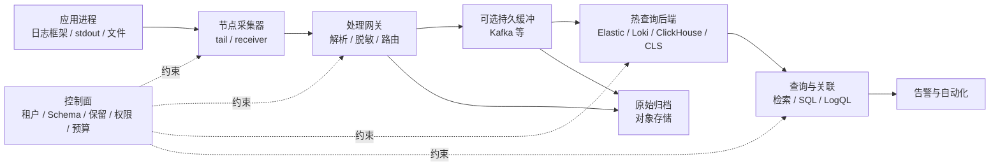
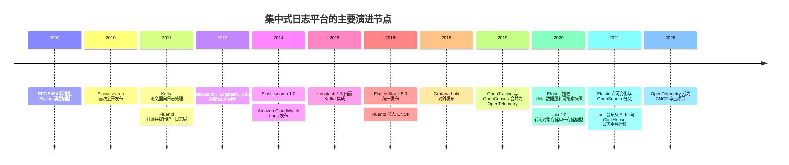
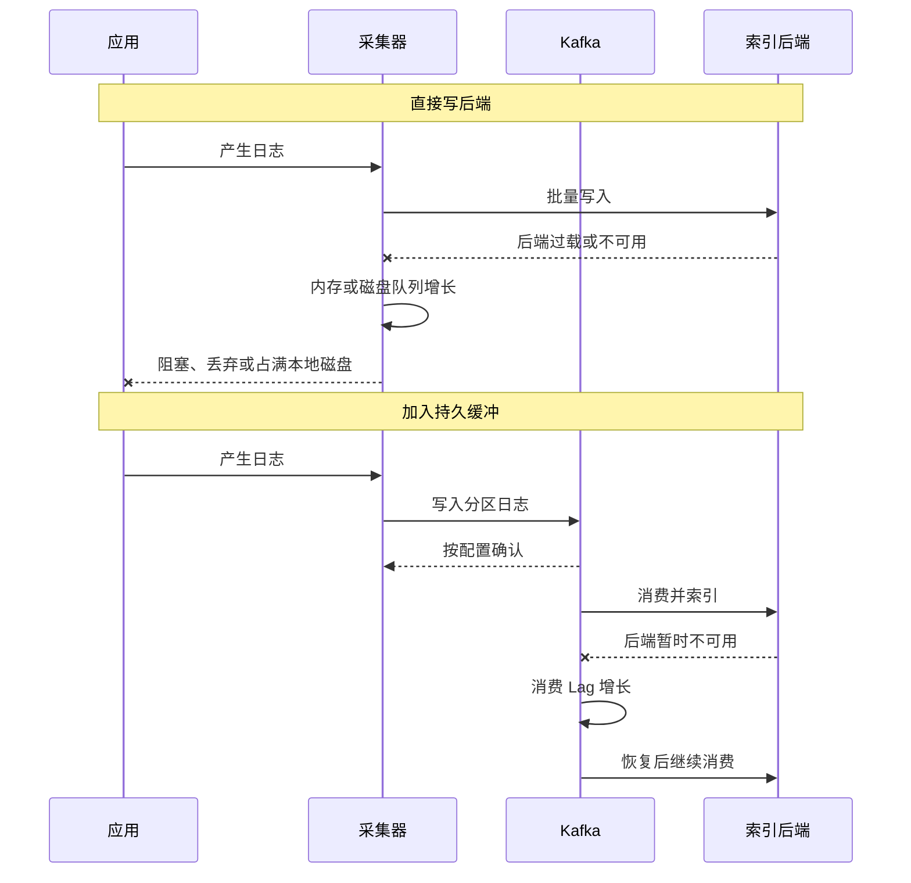
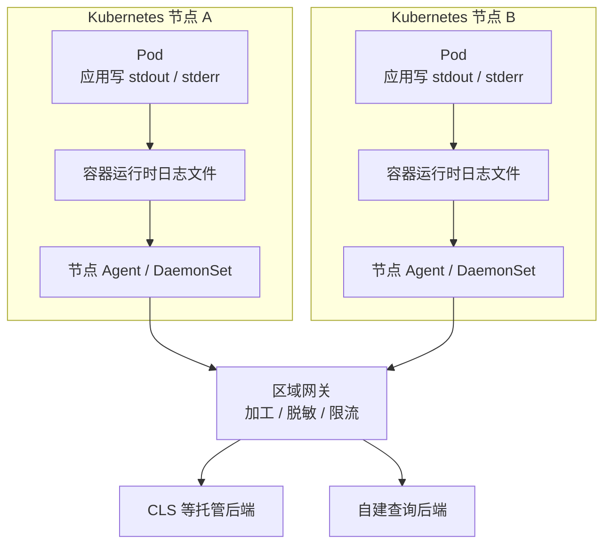
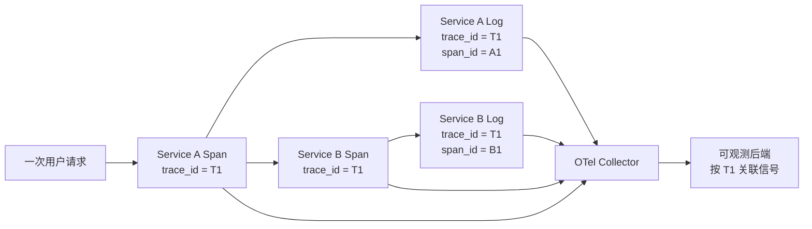
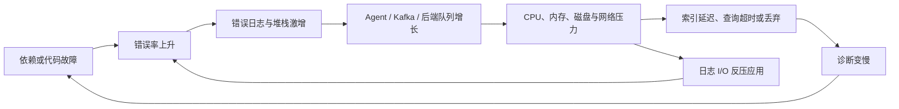
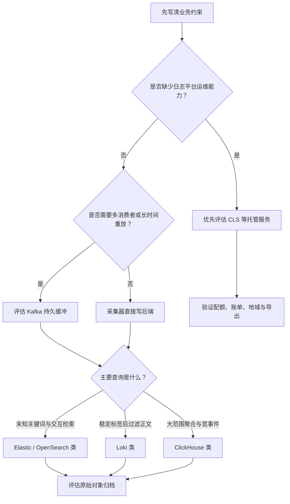

# 集中式日志平台十五年演进：从 ELK、Kafka 到云日志与 OpenTelemetry

> 查证基线：2026-09-13。本文讨论 2011—2026 年分布式应用的运维日志采集、集中检索、故障定位、告警与留存治理。产品功能、成熟度、限额和计费会持续变化；历史发布日期来自当时的一手材料，当前行为以查证日的官方文档为准。

## 核心判断：十五年里被替换的不是一个产品，而是一组瓶颈

集中式日志平台最容易被讲成一串产品名：先有 ELK，规模大了加 Kafka，上云后改用 CLS，后来又出现 Loki、ClickHouse 和 OpenTelemetry。这种叙述把不同层级的东西放进同一张“替代关系”表，因而解释不了真实架构：

- Kafka 是持久事件流，主要承担缓冲、解耦、分发和重放；它不是给值班工程师使用的全文检索后端。
- Elasticsearch、OpenSearch、Loki 和 ClickHouse 是不同存储与查询模型的代表，但它们也不都提供完整的采集、告警和治理体验。
- 腾讯云日志服务（Cloud Log Service，CLS）是一体化托管服务，覆盖采集、存储、检索、分析、告警和投递等环节。
- OpenTelemetry 提供遥测数据模型、协议、SDK 与 Collector；它可以统一采集管道，却不负责长期存储，也不统一各后端的查询语言、计费和可用性。

十五年的主线其实是五次责任重组：

1. **集中化**：把散落在主机文件中的日志变成中央可搜索数据。
2. **解耦**：用持久缓冲隔开高峰写入与较慢的解析、索引和多路消费。
3. **托管化与云原生化**：把集群容量、升级和部分高可用责任交给平台，同时适应容器的短生命周期。
4. **存储模型分叉**：不再默认“每个字段都预先建索引”，而是在写入成本、查询延迟和对象存储之间重新分配工作。
5. **信号标准化**：统一日志、指标和链路的资源身份、关联字段及传输管道，但保留后端差异。

旧方案没有按年份整齐退出。2026 年仍有人直接搜索文件，也有人自建 Elastic/OpenSearch、用 Kafka 接多套后端、把日志写入 Loki 或 ClickHouse，或者全部交给 CLS 一类服务。正确问题不是“最新方案是谁”，而是**当前瓶颈在哪一层，以及团队愿意承担哪部分责任**。

## 一、先把日志平台画对：它是一条有损证据链

本文的业务场景是线上应用和微服务的运维日志：工程师需要在故障中回答“哪次请求、哪个版本、哪台实例、哪个依赖在什么时间发生了什么”。业务事件、财务账本、安全审计可以复用部分管道，但它们对完整性、不可抵赖、保留和访问审批有不同要求，不能因为都长得像 JSON 就与调试日志混为一谈。

一条日志从代码走到搜索结果，至少穿过下面这些边界：



这张图有三个容易被忽略的结论。

第一，**每个队列都是有限的**。应用内存、采集器磁盘、Kafka 保留、后端写入队列最终都会满；“有缓冲”只把可承受的下游中断变成一个可以计算的时间窗口。

第二，**收到、保存、索引成功和查得到是四件事**。后端可能已经保存原始记录，但解析失败的字段不可查询；索引可能完成，跨租户权限又阻止查询；一条告警执行成功也不能证明对应时间窗没有迟到日志。

第三，**日志平台是一条证据链，但通常不是无损账本**。异步日志框架可能在进程崩溃前来不及刷新，采集器可能在轮转时漏读，网络重试可能产生重复，后端可能为保护自身而拒绝写入。任何“绝不丢日志”的结论都必须说明确认点、容量、故障集合和保留窗口。

### 用六个指标定义“平台可用”

只监控搜索页面是否能打开远远不够。至少要分别定义：

| 指标 | 回答的问题 | 常见误判 |
| --- | --- | --- |
| 接收完整率 | 生产端生成的记录有多少进入采集边界 | 用后端写入成功数当分母，天然看不见采集前丢失 |
| 端到端新鲜度 | 事件发生后多久可被目标查询命中 | 只看 Kafka lag，忽略解析和索引延迟 |
| 查询可用性 | 给定租户、时间窗与查询类型是否返回完整结果 | HTTP 200 可能仍是部分分片结果 |
| 可恢复窗口 | 下游中断多久仍能无损追平 | 把磁盘总容量当可用容量，忽略峰值和复制 |
| 隔离性 | 一个租户的洪峰或重查询是否拖垮其他租户 | 只有写入限流，没有查询并发和扫描量限制 |
| 单位有效证据成本 | 保留并可查询一份有用日志需要多少资源 | 只看压缩后存储，忽略索引、查询、出网和人力 |

这些指标贯穿后面的历史：每一代方案都优化了其中几项，同时把代价移动到了别处。

## 二、从 2009 年基线到 2026 年：演进浪潮相互重叠

下面的时间线只标记可核实的发布或组织里程碑；“行业普及”受公司规模、云迁移和组织能力影响，不可能由一个年份统一切断。



这个分期是本文的解释框架，不是某个厂商给出的官方历史。关键不是背年份，而是看每次变化背后的压力：主机数量、日志量、服务生命周期、查询类型、保留成本、供应商责任和跨信号关联。

## 三、第一阶段：文件与 Syslog 解决“先收上来”，没有解决“如何证明完整”

在少量稳定主机上，应用写文件、操作系统轮转、管理员用 `tail` 和 `grep` 排障，至今仍是低成本且透明的方案。它的问题在分布式环境中才集中暴露：一次请求跨过多台机器；实例可能在调查前被销毁；不同服务使用不同时间、级别和字段；工程师不知道应该登录哪台主机，更无法可靠地执行跨节点聚合。

2009 年的 RFC 5424 已把 Syslog 分成应用层与传输层，并描述 Originator、Relay、Collector 等角色；但规范明确不绑定单一传输协议，传统 UDP 映射只是其中一种。换言之，标准化消息格式和路由角色不等于可靠交付，传输错误防护也不能凭消息格式自动获得。[RFC 5424](https://www.rfc-editor.org/rfc/rfc5424)

这一时期的核心优势是简单：

- 应用和运维工具都能直接读文本；
- 文件是容易备份、复制和离线处理的最低共同格式；
- 失败位置直观，不需要维护复杂集群。

问题同样直接：

- 本地磁盘和应用实例共享故障与生命周期；
- UDP Syslog 可以丢包，TCP/TLS 也仍需要处理阻塞、重连和接收端确认；
- 多行堆栈、编码和轮转可能打破一条事件的边界；
- 中央 Syslog 服务器只是把磁盘瓶颈集中到另一台机器；
- 文本有保真价值，却缺少稳定字段，跨服务查询依赖脆弱的正则表达式。

因此第一代集中化只回答“日志送去哪里”，没有完整回答“如何快速找到它”和“如何知道有没有漏”。

## 四、2011—2016：ELK 与 Fluentd 把文本变成可交互的数据产品

Elasticsearch 在 2010 年首次公开发布；Elastic 的项目回顾将 2013 年列为 Elasticsearch、Logstash 与 Kibana 形成 ELK Stack 的节点。Fluentd 则在 2011 年创建并于同年开源，目标是建立统一采集与消费的日志层。[Elastic 项目历史](https://www.elastic.co/search-labs/blog/elasticsearch-history-15-years)；[Fluentd 项目历史](https://www.fluentd.org/architecture/)

这套架构完成了一个关键转换：

```text
分散文本文件
  -> 采集器持续读取
  -> 解析、补充主机与服务字段
  -> 以文档写入分布式索引
  -> 用全文、字段和时间范围交互查询
  -> 保存搜索、图表和告警
```

### 为什么倒排索引改变了排障体验

对日志正文和字符串字段建立倒排索引，相当于预先维护“词项到文档”的映射。事故发生后搜索 `timeout`、订单 ID 或异常类名，不必从头扫描所有原始文件；字段映射又让 `service=checkout AND level=ERROR` 之类的过滤和聚合成为常规操作。

Elasticsearch 把索引拆成分片分布到多个节点，副本承担可用性和读扩展；Lucene 索引由多个 Segment 组成，新数据先形成新 Segment，再由后台合并。这样的写路径用 CPU、内存和写放大换取查询速度。分片太多会增加元数据和调度开销，分片过大又延长恢复时间；Elastic 当前仍把两者都列为稳定性风险。[Elastic 分片规划](https://www.elastic.co/docs/deploy-manage/production-guidance/optimize-performance/size-shards)；[Apache Lucene Segment 格式](https://lucene.apache.org/core/3_6_2/fileformats.html)

### 这一代的核心优势

- **查询从批处理变成交互式**：工程师可以在秒到分钟级调查新日志，而不必等待离线 ETL。
- **采集与展示形成生态**：Logstash/Fluentd 的插件连接文件、Syslog、消息系统和多种存储；Kibana 把搜索转成团队共享的仪表板。
- **半结构化数据可逐步治理**：团队可以先保留原文，再为重要字段建立类型和索引。
- **横向扩展成为可能**：分片和副本让单机磁盘不再是绝对上限。

2015 年 Logstash 1.5 把 Kafka input/output 纳入内置插件，2016 年 Elastic Stack 5.0 将 Elasticsearch、Kibana、Logstash 和 Beats 对齐为统一发布节奏，说明“几个可组合工具”已经向完整数据平台演进。[Logstash 1.5 发布说明](https://www.elastic.co/blog/logstash-1-5-0-ga-released)；[Elastic Stack 5.0 发布说明](https://www.elastic.co/about/press/elastic-releases-5-0-the-integrated-open-source-stack-to-build-highly-scalable-real-time-data-applications)

### 成功的代价：写入时决定得越多，写路径越脆弱

动态映射很适合快速开始，却可能把同名字段的不同类型变成冲突，或者让任意键扩张成海量字段。Elastic 将字段总量过高导致的主节点、数据节点、搜索和 Kibana 性能问题称为 mapping explosion，并建议限制动态映射、使用 `flattened` 等方式控制字段增长。[Elastic：Mapping explosion](https://www.elastic.co/guide/en/elasticsearch/reference/current/mapping-explosion.html)

Uber 2021 年公布的迁移案例给出了一个具体而非普遍的边界：其 ELK 日志平台在大规模、半结构化 Schema 和聚合查询下，需要每地域维护二十多个 Elasticsearch 集群与五十多个 Logstash 管道；类型冲突、mapping explosion 和重查询会扩大运维压力。Uber 最终以 ClickHouse 和自建查询层替换核心存储，并保留对原有查询接口的兼容。[Uber：Schema-agnostic 日志平台](https://www.uber.com/es/en/blog/logging/)

这不能证明“ClickHouse 普遍优于 Elasticsearch”。它证明的是：

1. 当字段集合由大量团队无协调地演化时，严格的写时 Schema 可能成为可用性风险；
2. 当多数查询是大范围聚合而非关键词命中时，全字段索引的成本可能与查询分布不匹配；
3. 一套成功的存储内核仍需要租户、Schema、查询翻译、资源隔离和自动化管理层。

Elastic 后续通过数据流、生命周期管理、Hot/Warm/Cold/Frozen 数据层与可搜索快照降低时间序列数据的维护和长期保留成本。这说明 ELK 路线不是静止不变，而是在吸收日志场景暴露出的生命周期问题。[Elastic 数据层](https://www.elastic.co/docs/manage-data/lifecycle/data-tiers)

## 五、2014—2017：Kafka 进入中间层，买到的是时间与解耦

Kafka 的早期论文标题就是《Kafka: a Distributed Messaging System for Log Processing》。它把事件追加到分区日志中，用 Offset 表示位置，让不同消费者按自己的进度读取。当前 Kafka 官方定义仍包含发布/订阅、持久存储和实时或回溯处理三项能力。[Kafka 2011 论文](https://cwiki.apache.org/confluence/download/attachments/27822226/Kafka-netdb-06-2011.pdf)；[Apache Kafka 官方介绍](https://kafka.apache.org/documentation/)

### 不加 Kafka 时，后端故障会沿调用链向前传播



有 Kafka 后，采集端只需要在 Kafka 的接收能力内快速完成写入；解析、索引、归档和实时计算可以成为独立消费者。下游停机不再立即阻塞生产者，而是转化为 Consumer Lag。新增归档或安全分析消费者也不必改动应用。

这带来四个核心优势：

- **削峰**：短时日志洪峰先进入顺序追加的持久日志，下游按稳定速率处理。
- **故障隔离**：索引集群维护或重启时，采集可以继续到一个容量边界。
- **多路分发**：热查询、对象存储、流计算和审计消费者各自维护 Offset。
- **重放**：解析规则或目标索引修复后，可以从保留范围内重新消费。

### Kafka 的保证必须拆到配置和边界

Kafka 只保证同一 Topic Partition 内的记录顺序，不提供跨分区全局顺序。Key 决定相关日志能否落到同一分区，也可能制造热点；一个 Consumer Group 内可并行工作的活跃消费者数还受分区数约束。

生产确认同样不是一个布尔开关。以当前 Kafka 4.0 文档为例，`acks=0` 不等待 Broker 确认，`acks=1` 在 Leader 本地写入后即可返回，`acks=all` 等待同步副本集合；幂等生产者可以避免单个生产会话内由 Broker 重试造成的重复，但应用层重发、消费者副作用和外部存储写入仍不在这个保证内。[Kafka Producer 配置](https://kafka.apache.org/40/configuration/producer-configs/)；[Kafka 设计：交付语义](https://kafka.apache.org/40/design/design/)

因此，日志管道常见的是**端到端至少一次**：消费者在目标后端成功写入后再提交 Offset，崩溃发生在两者之间时会重放并产生重复。日志记录若需要精确计数，应携带稳定事件 ID 或在聚合层定义去重窗口；不能把“肉眼看日志容忍重复”扩张为所有告警和报表都容忍重复。

### 缓冲不是无限保险，而是可计算的中断预算

设峰值写入速率为 `R_peak` 字节/秒，可接受的下游中断为 `T_outage` 秒，Kafka 副本因子为 `F_replica`，预留安全系数为 `F_safety`，则仅用于吸收中断的数据容量下界近似为：

```text
Buffer_min ≈ R_peak × T_outage × F_replica × F_safety
```

实际还要加入 Segment、索引、未清理数据、再均衡和磁盘水位。若消费长期慢于生产，Lag 只会持续增长，最终触发保留过期或磁盘耗尽。重放本身也可能形成第二次洪峰，压垮刚恢复的后端。

Cloudflare 公开案例把这个边界说得很清楚：其 Kafka 集群按当时容量可以容忍消费者总计约八小时中断，“绝大多数”事故可以在窗口内恢复，但更大的事故仍可能越界；同时，用主机与服务名作分区键保住局部顺序，也会造成分区不均衡。[Cloudflare 日志管道](https://blog.cloudflare.com/an-overview-of-cloudflares-logging-pipeline/)

Uber 则构建 Chaperone，在多层 Kafka 管道的每个阶段计算消息数量，用来发现和量化丢失、延迟与重复。这说明即使 Kafka 被用于高吞吐管道，操作者仍不能从 Broker 健康直接推出端到端完整性。[Uber Chaperone](https://www.uber.com/us/en/blog/chaperone-audit-kafka-messages/)

### 什么时候不需要 Kafka

以下条件同时成立时，采集器直接写托管后端往往更合理：

- 后端本身能吸收预期峰值并提供明确重试契约；
- 只有一个主要消费者；
- 可接受的小量丢失窗口已经由本地磁盘队列覆盖；
- 团队没有持续运营 Kafka 的能力；
- 重放不是硬需求，或原始日志已同步归档到其他地方。

为了“架构看起来完整”而加入 Kafka，会增加 Broker、分区、权限、升级、再均衡、监控和容量规划，却没有创造新的业务保证。

## 六、2014—2019：托管日志与容器把责任重新分配

Amazon 在 2014 年 7 月发布 CloudWatch Logs，提供 Agent、近实时监控、模式匹配和托管存储。这是一个清晰的历史节点：日志能力开始作为云平台原生服务交付，而不只是用户自行搭建的软件栈。[AWS：Introducing Amazon CloudWatch Logs](https://aws.amazon.com/about-aws/whats-new/2014/07/10/introducing-amazon-cloudwatch-logs/)

今天的腾讯云 CLS 是这一路线的代表：它把日志和指标的采集、ETL、存储、检索分析、可视化与告警组合为 SaaS，并支持 LogListener、API、SDK、Kafka 协议、OpenTelemetry 协议以及云产品接入。[腾讯云 CLS 简介](https://cloud.tencent.com/document/product/614/56479)；[CLS 采集概述](https://cloud.tencent.com/document/product/614/33494)

### 容器让本地文件失去稳定身份

容器化进一步推动节点级采集。Kubernetes 推荐容器写 stdout/stderr，由容器运行时在节点保存，节点 Agent 再转发到集群级后端；Sidecar 可以转换特殊文件格式或提供独立日志流。Kubernetes 本身不提供集群级日志存储，日志需要拥有独立于 Pod、容器和节点的生命周期。[Kubernetes 日志架构](https://kubernetes.io/docs/concepts/cluster-administration/logging/)



这里的价值不是 stdout 比文件“高级”，而是职责变清晰：应用只产生日志流，运行环境管理短期节点文件，平台负责采集和独立保留。代价是应用 `kubectl logs` 能看到的内容、节点文件仍保留的内容和中央后端可查询的内容可能不一致；轮转、节点驱逐、Agent 调度失败和网络隔离都可能形成缺口。

### 托管服务解决了什么

| 责任 | 自建 Elastic/Loki/ClickHouse | CLS 一类托管服务 |
| --- | --- | --- |
| 节点与集群升级 | 用户规划、执行和回滚 | 平台承担内部实现，用户验证外部兼容 |
| 容量与分片 | 用户持续估算和扩容 | 平台提供配额与扩缩容接口，用户仍管理预算与限额 |
| 数据接入 | 用户选择并运行 Agent/Gateway | 平台提供 Agent、SDK 和协议，端侧部署仍属用户责任 |
| 查询与告警 | 用户组合 UI、规则和通知 | 通常提供集成体验 |
| 灾难恢复 | 用户设计副本、快照与跨区方案 | 平台按 SLA 承诺服务，用户仍需评估地域和导出策略 |
| 权限与合规 | 用户实现租户、RBAC 和审计 | 平台提供能力，用户配置主体、范围、保留与数据位置 |
| 成本 | 机器、对象存储、流量和人力 | 按写入、索引、存储、处理、请求或出网等维度计费 |

托管化减少的是**实现和运行责任**，不是应用端的数据质量、采集前丢失、错误权限和敏感字段责任。SLA 也只覆盖定义中的服务端可用性，不能证明从应用代码到告警通知的整条链路完整。

### CLS 展示了索引能力与成本如何绑定

截至查证日，CLS 只有开启索引后才能检索分析；全文索引和键值索引决定分词与字段查询方式，索引规则修改只影响之后写入的数据。解析或索引异常时，CLS 可把原始内容放入 `__RAWLOG__` 作为兜底，但这部分的键值检索和统计能力会受限。[CLS 索引配置](https://cloud.tencent.com/document/product/614/50922)

CLS 的按功能计费把写流量、索引流量、日志与索引存储、数据加工、分区和请求等拆成不同维度。这是一个重要架构提示：**“存下日志”和“让每个字段都可快速检索”是两份不同成本**。具体价格会变，文章不记录短期单价，只保留计费结构和查证日期。[CLS 计费概述](https://cloud.tencent.com/document/product/614/45802)

## 七、2018—2022：存储路线分叉，工作在写入时还是查询时完成

日志量持续增长后，“把所有字段预先建成高性能索引”不再是唯一答案。不同方案开始把工作分配到写入、对象存储、查询扫描或应用层 Schema 中。

### 路线 A：Elasticsearch / OpenSearch——为未知关键词和字段查询预付索引成本

倒排索引适合事故中不可预知的关键词检索，也能对已映射字段做过滤和聚合。数据流把连续写入映射到多个后备索引，生命周期策略负责滚动、保留和迁移；Hot/Warm/Cold/Frozen 数据层让旧数据逐步使用更低成本、也更慢的介质。

优势是查询体验成熟、全文能力强、生态完整；问题是字段映射、分片、Segment 合并、堆内存、集群状态和重查询隔离需要持续治理。对象存储与可搜索快照降低本地磁盘需求，但冷数据查询仍会用延迟和恢复时间换成本。

2021 年，Elastic 将 Elasticsearch 与 Kibana 的 Apache 2.0 源码部分切换为 Elastic License 与 SSPL 双许可；AWS 随后发布基于 Elasticsearch 7.10.2 与 Kibana 7.10.2 的 OpenSearch 分叉。技术方案因此还多了一类长期成本：许可证、发行版兼容、插件生态和供应商治理。[Elastic 许可说明](https://www.elastic.co/blog/license-change-clarification/)；[AWS：Introducing OpenSearch](https://aws.amazon.com/blogs/opensource/introducing-opensearch/)

### 路线 B：Loki——只预索引低基数标签，把正文放入对象存储

Grafana 在 2018 年 12 月发布 Loki。其核心思路受 Prometheus 启发：用标签集合定义日志流，只索引标签元数据，日志正文压缩为 Chunk，保存在对象存储或文件系统中；查询先选流，再对其中的正文解析和过滤。[Grafana：Loki 发布背景](https://grafana.com/blog/loki-prometheus-inspired-open-source-logging-for-cloud-natives/)；[Loki 当前架构](https://grafana.com/docs/loki/latest/)

它的优势是索引较小、对象存储友好，并且服务、环境、集群等标签可以与 Prometheus/Grafana 的工作流对齐。代价是写入时省下的全文索引工作会部分移到查询时：若时间窗或候选流很大，过滤正文需要读取更多 Chunk。

Loki 不是“无索引”。标签组合越多，流越多；把 Pod ID、请求 ID、用户 ID、Trace ID 等高基数值都设成标签，会产生巨大的索引和大量小 Chunk，反而破坏摄取与查询性能。当前文档建议这类值放入 Structured Metadata 或查询时解析。[Loki 标签模型](https://grafana.com/docs/loki/latest/get-started/labels/)

### 路线 C：ClickHouse——以列式存储和排序键服务聚合与宽事件

ClickHouse 2012 年首先用于 Web 分析，2016 年以 Apache 2.0 开源；它不是为日志专门诞生，却因列式压缩、MergeTree、排序数据、稀疏主索引和向量化分析能力逐渐成为日志与可观测数据后端。[ClickHouse 项目历史](https://clickhouse.com/company/our-story)

MergeTree 的写入形成不可变 Part，后台把小 Part 合并成更大的有序 Part；稀疏索引按 Granule 记录标记，查询依赖 `ORDER BY` 和数据跳过来缩小扫描范围。只读取需要的列、同类型数据压缩和批量向量化计算，适合大范围聚合及字段较多的宽事件。[ClickHouse 列式存储机制](https://clickhouse.com/resources/engineering/what-is-columnar-storage)

代价在于：

- 排序键与分区设计必须贴合主要过滤条件；
- 频繁小批写入会制造过多 Part，摄取层通常需要批量；
- 任意子串全文检索不是传统稀疏主索引天然擅长的路径；
- 半结构化字段需要稳定 Schema、JSON 处理或额外查询抽象层；
- 数据库本身不自动提供成熟的日志 UI、告警、租户和治理产品。

Uber 的案例把这条路线做成了完整平台：Kafka 承担缓冲，ClickHouse 承担存储与聚合，自建 QueryBridge 兼容已有 Kibana 查询，管理服务承担多区域、租户和集群自动化。这再次说明“换数据库”只是平台迁移的一部分。[Uber 日志平台](https://www.uber.com/es/en/blog/logging/)

### 路线 D：对象存储——保住原始证据，接受更高恢复和查询延迟

对象存储适合长期、不可变、低单价的原始归档，也能通过 Parquet、Iceberg 及查询引擎进行离线分析。它不应被误写成热日志后端：从大量对象中发现文件、读取元数据、扫描数据和恢复索引都有延迟，告警与交互排障通常仍需要热层。

实用的混合设计往往是：短期热数据进入 Elastic、Loki、ClickHouse 或 CLS，原始记录同步归档；热层只保留高价值窗口，超期调查从对象存储回灌或直接查询。这样同时保留调查速度和长期证据，但引入了双写一致性、Catalog、删除同步与回灌带宽问题。

### 四类存储不是单轴排名

| 路线 | 写入时主要工作 | 擅长查询 | 高基数处理 | 冷数据策略 | 主要风险 |
| --- | --- | --- | --- | --- | --- |
| Elastic / OpenSearch | 分词、映射、倒排/列式辅助结构、分片写入 | 未知关键词、字段过滤、交互调查 | 可查但索引和映射成本高 | 数据层、快照、对象存储 | Mapping、分片、合并和重查询影响集群 |
| Loki | 建低基数标签索引、压缩 Chunk | 先按来源标签缩小范围，再过滤正文 | 不应作为标签；使用元数据或查询时解析 | 对象存储是核心路径 | 标签基数爆炸、大窗口扫描成本 |
| ClickHouse | 批量列式写入、排序、生成 Part | SQL 聚合、宽事件、已知过滤模式 | 可作为列保存，但性能取决于排序与跳过能力 | TTL、分层存储或外部对象存储 | Schema、排序键、小 Part 和查询隔离 |
| CLS 等托管平台 | 由产品按配置完成解析、索引与存储 | 产品支持的全文、键值、SQL 与告警 | 受产品字段、索引和配额模型约束 | 标准/低频层、投递或归档 | 计费、配额、数据位置、锁定与黑盒边界 |

“更便宜”只有在日志结构、压缩、复制、保留期、索引范围、查询分布、峰值、SLA 和人员成本都给定后才有意义。单一厂商 Benchmark 无法替代目标工作负载验证。

## 八、2019—2026：OpenTelemetry 统一采集语言，没有统一后端经济学

OpenTracing 与 OpenCensus 在 2019 年合并为 OpenTelemetry，目标是减少埋点 API、数据格式和后端导出的碎片化。2026 年 5 月，OpenTelemetry 成为 CNCF 毕业项目；这是项目治理和生态成熟度的里程碑，不表示所有组件、语言和语义约定同时达到同一稳定状态。[OpenTelemetry 项目历史](https://opentelemetry.io/docs/what-is-opentelemetry/)；[OpenTelemetry 毕业公告](https://opentelemetry.io/blog/2026/otel-graduates/)

### 日志与 Trace 终于共享可移植的关联字段

OpenTelemetry 日志数据模型当前标记为 Stable，定义了 `Timestamp`、`ObservedTimestamp`、`TraceId`、`SpanId`、严重度、Body、Resource、InstrumentationScope 和 Attributes 等字段。事件发生时间与采集系统观察时间被明确区分，日志也能携带当前 Trace 和 Span 身份。[OpenTelemetry Logs Data Model](https://opentelemetry.io/docs/specs/otel/logs/data-model/)



这比用时间戳、线程名和消息文本猜测同一请求可靠得多，但前提是 Context 正确传播、日志框架桥接保留字段、Collector 转换不丢属性、后端完成映射，并且权限允许跨信号查询。任一环节断开，标准字段只是在记录里留了一个空位。

### Collector 把日志管道抽象成可组合组件

OpenTelemetry Collector 使用 Receiver → Processor → Exporter 管道接收、变换和导出 Logs、Metrics 与 Traces。它可以作为每节点 Agent，也可以作为集中 Gateway；同一数据还可扇出到多个后端。[Collector 架构](https://opentelemetry.io/docs/collector/architecture/)

这带来三类价值：

- 应用面向 OTLP 或已有日志框架，后端替换时减少应用改动；
- 脱敏、属性规范化、批处理和路由可以集中治理；
- 日志、指标和 Trace 能共享资源身份与传输运维。

同时，Collector 不是魔法缓冲层。官方架构指出，同一 Receiver 同步扇出到多条管道时，一条管道的 Processor 阻塞可能阻塞其他管道和 Receiver。官方可靠性文档也明确：内存 Sending Queue 会在满载或超出重试时间后丢数据；磁盘 WAL 可抵御进程重启，却仍受磁盘故障、容量和重试边界约束；更强的跨层持久缓冲可以加入 Kafka，但会增加运维复杂度。[Collector 可靠性](https://opentelemetry.io/docs/collector/resiliency/)

### 标准稳定不等于实现齐平

截至查证日，OpenTelemetry Logs 规范、协议及核心数据模型已进入稳定状态，但各语言日志 API/SDK 的成熟度不同，Collector 组件也具有各自状态。官方状态页明确要求按具体语言、信号和组件检查，而不能用“OpenTelemetry Stable”概括全部实现。[OpenTelemetry 状态页](https://opentelemetry.io/status/)

更重要的是，OpenTelemetry 主要提升**采集与传输可移植性**：

- LogQL、Lucene Query、SQL 和 CLS 查询语法没有因此统一；
- 后端对 Resource/Attributes 的索引映射不同；
- 告警、Dashboard、保留策略和权限模型仍然绑定平台；
- 同一 OTLP 数据进入不同存储后，成本与查询延迟可能完全不同。

所以合理目标是减少生产端锁定，而不是承诺零成本迁移整个可观测平台。

## 九、跨越所有年代的生产问题

技术栈会变，下面这些故障结构一直存在。

### 日志风暴会在最需要证据时摧毁证据系统



这是一条正反馈回路。常规流量下的平均吞吐测试无法证明事故期间可用，因为事故会同时改变日志量、消息大小、字段基数和查询并发。需要同时限制生产端速率、异常堆栈重复、租户摄取、查询扫描量与告警数量；对于必须丢弃的情况，应按 Debug/Info/Error 或业务优先级定义策略，并为“丢了多少”留下独立计数。

### 确认点决定“成功”的含义

| 确认点 | 能证明什么 | 仍不能证明什么 |
| --- | --- | --- |
| 日志 API 返回 | 框架接受了调用 | 异步缓冲已刷新、进程崩溃前已离开内存 |
| Agent 更新读取位置 | Agent 认为已读取源数据 | 下游已保存；轮转和多行边界完全正确 |
| Kafka Producer 成功 | 按当前 `acks`、ISR 和超时配置完成写入 | 消费、外部存储和告警没有重复或丢失 |
| 后端写入 API 成功 | 后端接受了批次 | 所有字段解析成功、索引已可见、查询权限正确 |
| 搜索命中 | 某条数据在当前查询可见 | 同时间窗的数据完整，没有迟到或部分分片失败 |
| 原始归档校验成功 | 对象已保存并通过完整性检查 | 能在故障时快速恢复和查询 |

“端到端不丢”必须从应用生成量或独立审计序列开始，在每个确认点比较计数、序列或校验值。Uber 的 Chaperone 正是因为单看 Kafka 内部指标不够，才在每层记录审计信息。

### 时间不是一个字段

至少要区分：

- **事件时间**：业务或错误真正发生的时间；依赖源主机时钟。
- **观察时间**：采集器第一次看到记录的时间；OpenTelemetry 对应 `ObservedTimestamp`。
- **摄取时间**：后端接受或索引记录的时间。
- **查询时间**：规则运行和用户调查的时间。

网络中断后批量补传会让事件时间远早于摄取时间。只按摄取时间告警会迟到，只按事件时间又可能被错误时钟和未来时间污染。告警窗口需要允许迟到并明确回看策略；跨服务排序应优先依赖 Trace 因果关系、单调序列或局部顺序，而不是假设墙上时钟完全一致。

### 结构化日志解决可解析性，也制造 Schema 治理

结构化日志的正确目标不是“所有消息都 JSON 化”，而是让稳定语义拥有稳定字段，并保留人类可读 Body。最低可用集合通常包括：

- 服务名、版本、环境、区域和实例；
- 事件名、严重度、事件时间与观察时间；
- Trace ID、Span ID 或其他交互 ID；
- 错误类型、结果与重试状态；
- Schema 版本；
- 不含秘密的业务定位键。

字段名、类型和含义需要所有者与演进规则。同一个 `status` 一会儿是 HTTP 数字、一会儿是业务字符串，既会触发严格映射冲突，也会让宽松存储中的查询产生歧义。保存原始记录有助于重新解析，但不能替代 Schema 治理。

### 多行、轮转与截断仍然发生在最靠近源的位置

异常堆栈可能跨越数十行。若采集器把每行当独立事件，后端再强大也无法可靠恢复原边界；若使用正则拼接，错误配置又会把多个事件粘在一起并扩大内存。文件轮转中重命名、截断、复制再截断具有不同语义，读取位置必须绑定文件身份而不是只绑定路径。容器运行时和 Agent 还可能分别执行大小限制与轮转。

因此，最好在生产端直接生成单事件结构化记录；无法控制源格式时，在节点 Agent 完成多行组装，并对超长事件设置截断标记、原始字节数和丢弃计数。

### 安全问题应在采集前解决，而不是寄希望于事后删除

日志通常集中保存身份、请求参数、错误堆栈和内部拓扑，因而既是排障资产，也是高价值攻击目标。OWASP 建议不要直接记录访问令牌、密码、连接串、密钥和敏感个人数据；来自其他信任区的日志字段也必须视为不可信输入，处理 CR/LF 等日志注入字符，并限制、审计日志读取权限。[OWASP Logging Cheat Sheet](https://cheatsheetseries.owasp.org/cheatsheets/Logging_Cheat_Sheet.html)

生产设计至少需要：

- 在应用或最靠近源的可信处理器中阻止秘密进入日志；
- 对用户标识使用最小化、掩码、令牌化或受控哈希，而不是随意复制原值；
- 传输加密、静态加密、租户与字段级访问控制；
- 记录谁执行过查询、导出和保留策略修改；
- 让热存储、对象归档、缓存、快照和导出副本共享删除与保留规则；
- 防止用户控制的换行或分隔符伪造日志结构。

“采集后再脱敏”已经让原文穿过 Agent、网络和缓冲；“从热索引删除”也不等于对象归档、备份和下游消费者全部删除。

### 多租户不只是给日志加 `tenant_id`

写入限流只能防止一个租户占满摄取。还需要隔离：

- 每租户存储与保留预算；
- 查询并发、扫描字节、CPU、内存和超时；
- Dashboard 与告警规则数量；
- 字段和标签基数；
- 导出与跨租户查询权限；
- 高优先级系统日志的保底容量。

Cloudflare 把多租户资源可见性列为其日志平台的后续工作；Uber 的 ClickHouse 平台则同时限制每租户写入速率和在途查询数。这些是一手案例中的设计选择，不是所有系统的默认能力。

### 日志平台必须观察自己，但不能只依赖自己

至少应从独立通道保存以下 Meta-telemetry：

- 每个采集点的接收、发送、丢弃和重试数；
- 队列容量、Kafka Lag、最老未处理事件年龄；
- 解析失败、未知字段、截断与索引拒绝数；
- 后端写入延迟、查询延迟、部分结果和超时；
- 对象归档与热索引的数量/校验差异；
- 每租户日增量、索引比、压缩比和费用变化。

如果这些指标只写回正在故障的同一日志后端，事故时会同时失明。最小健康指标应进入独立 Metrics/告警路径，关键完整性审计还应有独立计数或校验存储。

## 十、从约束反推方案，而不是从产品名开始

### 先计算四个量

设平均原始速率为 `R_avg`，峰值倍率为 `P`，热保留天数为 `D_hot`，原始长期保留天数为 `D_archive`：

```text
每日原始量      D_raw     = R_avg × 86400
峰值速率        R_peak    = R_avg × P
热层原始基数    V_hot     = D_raw × D_hot
归档原始基数    V_archive = D_raw × D_archive
```

再分别乘以压缩、复制、索引和安全系数。不要用一个“平均压缩比”同时估算原文、倒排索引、列式数据和对象存储；它们的数据结构不同。还要给事故查询预留读 I/O 与 CPU，因为写入最忙时通常也是查询最忙时。

### 五种常见组合

| 场景 | 合理起点 | 为什么 | 需要特别验证 |
| --- | --- | --- | --- |
| 小团队、单云、日志量可控 | Agent/SDK → CLS 等托管后端 | 最少平台维护，快速获得检索和告警 | 配额、账单、端侧缓冲、导出和数据位置 |
| Kubernetes、多后端但峰值中等 | 节点 Agent 或 OTel Collector → 托管/自建后端 | 统一资源属性、处理和后端协议 | Agent 轮转、多行、WAL、Gateway 阻塞与升级 |
| 大规模、多消费者、必须重放 | Agent/Gateway → Kafka → 热查询 + 归档 | 解耦写入与多路消费，扩大恢复窗口 | Kafka 自身容量、Lag、重复、热点和回放限速 |
| 来源标签稳定、成本和对象存储优先 | Agent → Loki → 对象存储 | 小型标签索引，适合按服务/集群先缩小范围 | 标签基数、大窗口查询、正文扫描和租户隔离 |
| 聚合与宽事件占主导 | Kafka/OTel → ClickHouse + 查询层 | 列式压缩和 SQL 分析适合大范围聚合 | Schema、排序键、批量、全文体验和平台工程成本 |

多数成熟系统最终是混合架构：一份短期热索引支撑事故响应，一份原始归档支撑长期调查；Kafka 是否存在取决于恢复窗口和消费者数量；OpenTelemetry 是否存在取决于采集标准化与信号关联需要。



### 选型时必须回答的问题

1. 每日原始量、峰均比和最大单事件多大？
2. 从事件发生到可查询的 P95/P99 目标是什么？
3. 最长允许丢失窗口是多少，哪个确认点算成功？
4. 下游中断多久必须仍可恢复？追平时允许多大额外负载？
5. 80% 查询是未知关键词、已知字段过滤，还是时间窗聚合？
6. 哪些字段高基数，哪些必须全文搜索，哪些只需保留原文？
7. 热数据和归档分别保留多久？删除需要覆盖哪些副本？
8. 是否需要多云、多区域、数据驻留或第三方导出？
9. 团队能否 7×24 维护 Kafka 与分布式存储？
10. 写入、索引、查询、存储、出网和人员成本分别如何设预算？

如果这些问题没有答案，品牌比较和单节点 Benchmark 都不会产生可靠架构。

## 十一、十五年演进留下的六条稳定结论

1. **Kafka 与 CLS 不在同一层。** Kafka 买到持久缓冲与消费解耦；CLS 买到端到端托管能力。两者既可能组合，也可能互相都不需要。
2. **索引是对未来查询的下注。** Elasticsearch 预先为灵活检索付成本；Loki 只为低基数标签下注；ClickHouse 依赖排序、稀疏索引和列扫描；托管服务把这些选择封装为产品配置和账单。
3. **所有缓冲都只是有限的时间预算。** 真正指标是峰值下能撑多久、越界时丢什么、恢复后如何限速追平。
4. **OpenTelemetry 标准化入口，不标准化终点。** 它改善数据模型、关联和管道可移植性，却不消除后端 Schema、查询、告警和成本差异。
5. **事故负载与日常负载不是同一种分布。** 日志风暴、长堆栈、高基数字段和并发调查会同时出现，平台必须按故障峰值设计降级。
6. **日志价值来自可验证的证据链。** 如果不知道哪一步丢了多少、重复了多少、何时可见，再高级的搜索页面也只能提供不完整的信心。

过去十五年没有得到“最终日志数据库”。得到的是更清晰的分层、更丰富的责任选择，以及一个反复被证明的原则：先定义故障、完整性、查询和成本边界，再选择每一层的技术。

## 主要来源与证据边界

### 标准与当前官方资料

- [RFC 5424：The Syslog Protocol](https://www.rfc-editor.org/rfc/rfc5424)
- [Apache Kafka 官方文档](https://kafka.apache.org/documentation/)
- [Kubernetes Logging Architecture](https://kubernetes.io/docs/concepts/cluster-administration/logging/)
- [OpenTelemetry Logs Data Model](https://opentelemetry.io/docs/specs/otel/logs/data-model/)
- [OpenTelemetry Collector Architecture](https://opentelemetry.io/docs/collector/architecture/)
- [OpenTelemetry Collector Resiliency](https://opentelemetry.io/docs/collector/resiliency/)
- [Elastic：Mapping explosion](https://www.elastic.co/guide/en/elasticsearch/reference/current/mapping-explosion.html)
- [Elastic：Data tiers](https://www.elastic.co/docs/manage-data/lifecycle/data-tiers)
- [Grafana Loki 文档](https://grafana.com/docs/loki/latest/)
- [ClickHouse：How columnar storage works](https://clickhouse.com/resources/engineering/what-is-columnar-storage)
- [腾讯云 CLS 简介](https://cloud.tencent.com/document/product/614/56479)
- [腾讯云 CLS 索引配置](https://cloud.tencent.com/document/product/614/50922)
- [OWASP Logging Cheat Sheet](https://cheatsheetseries.owasp.org/cheatsheets/Logging_Cheat_Sheet.html)

### 历史一手材料

- [Kafka 2011 论文](https://cwiki.apache.org/confluence/download/attachments/27822226/Kafka-netdb-06-2011.pdf)
- [Fluentd 项目历史](https://www.fluentd.org/architecture/)
- [Amazon CloudWatch Logs 2014 发布公告](https://aws.amazon.com/about-aws/whats-new/2014/07/10/introducing-amazon-cloudwatch-logs/)
- [Elastic Stack 5.0 发布说明](https://www.elastic.co/about/press/elastic-releases-5-0-the-integrated-open-source-stack-to-build-highly-scalable-real-time-data-applications)
- [Grafana Loki 2018 发布背景](https://grafana.com/blog/loki-prometheus-inspired-open-source-logging-for-cloud-natives/)
- [Elastic 2021 许可说明](https://www.elastic.co/blog/license-change-clarification/)
- [AWS 2021 OpenSearch 公告](https://aws.amazon.com/blogs/opensource/introducing-opensearch/)
- [OpenTelemetry 2026 CNCF 毕业公告](https://opentelemetry.io/blog/2026/otel-graduates/)

### 生产案例

- [Uber：Kafka 端到端审计 Chaperone](https://www.uber.com/us/en/blog/chaperone-audit-kafka-messages/)
- [Uber：Schema-agnostic ClickHouse 日志平台](https://www.uber.com/es/en/blog/logging/)
- [Cloudflare：日志采集、Kafka、ELK 与 ClickHouse 管道](https://blog.cloudflare.com/an-overview-of-cloudflares-logging-pipeline/)

上述生产数据只证明对应公司在当时规模、版本、查询分布和组织条件下观察到的结果。本文没有运行真实 Kafka、Kubernetes、Elastic、Loki、ClickHouse 或 CLS 环境，也没有进行跨产品 Benchmark；机制结论来自官方规范和实现资料，生产失败结论由多个直接参与者案例交叉检查。CLS 的内部存储与索引实现并未完全公开，因此只描述其公开接口、索引行为、计费结构与责任边界。
