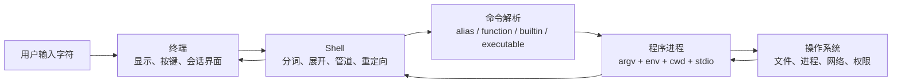
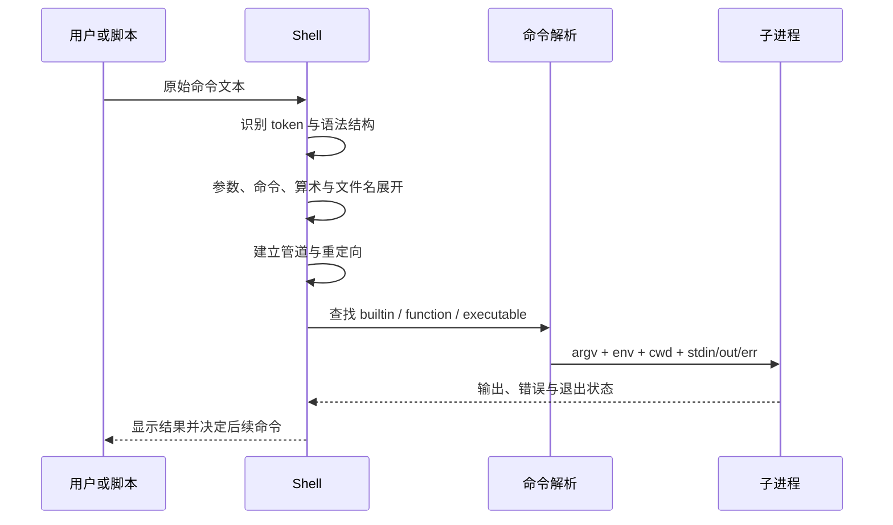
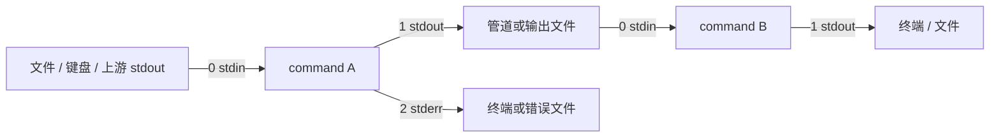
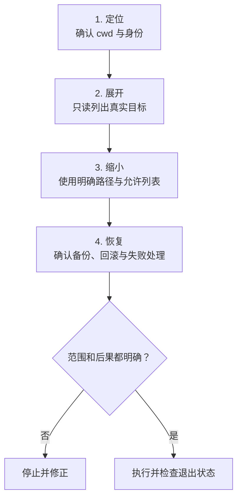
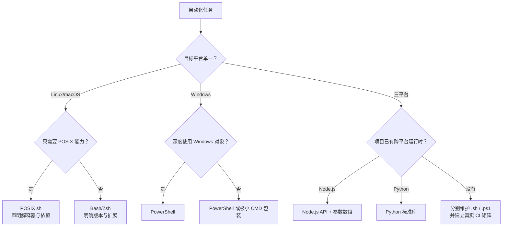

# Linux、Windows 与 macOS 命令行：从命令结构到跨平台对照

> 查证基线：2026-09-07。规范与文档基线包括 POSIX.1-2024、GNU Coreutils 9.11、GNU Grep 3.12、Zsh 5.9.2 和 Microsoft PowerShell 7.x 文档。本地实验环境为 macOS 14.6、Zsh 5.9、Bash 3.2.57、Node.js 22.16.0；没有原生 Linux、CMD、Windows PowerShell 5.1 或 PowerShell 7 运行环境，因此相应示例只完成官方资料核对和静态审查，不视为真实平台验收。

配套产物：

- [跨平台命令行实验 Demo](./cross-platform-command-line-demo/run-demo.mjs)
- [跨平台命令行全面练习](./cross-platform-command-line-exercises.md)

## 核心判断：先认 Shell，再谈“哪个系统的命令”

“Linux 命令”“Mac 命令”“Windows 命令”是方便交流的简称，却容易掩盖真正的运行模型。用户输入的一行文字要经过终端、Shell、具体命令实现和操作系统四层，任何一层变化都可能改变结果。



这张图回答“谁负责什么”：

- **终端（Terminal）** 是交互界面，不决定 Bash 或 PowerShell 的语言规则。
- **Shell** 是命令语言解释器，负责识别引号、变量、操作符和重定向。
- **命令** 可能是 Shell 内建能力、别名、函数、Cmdlet，也可能是磁盘上的程序。
- **操作系统** 提供进程、文件系统、网络和权限等底层能力。

[POSIX.1-2024](https://pubs.opengroup.org/onlinepubs/9799919799/utilities/V3_chap02.html)把 Shell 定义为命令语言解释器，并规定 `sh` 语言的 token、展开、重定向和执行语义。Windows 官方则明确区分 Command shell 与 PowerShell；PowerShell 不是“新版 CMD”，而是另一套命令语言和对象自动化环境。[Microsoft：Windows Commands](https://learn.microsoft.com/windows-server/administration/windows-commands/windows-commands)

因此，学习顺序应该是：

```text
认出当前 Shell
  → 理解路径和参数边界
  → 掌握标准流与退出状态
  → 按任务学习常用命令
  → 最后处理平台扩展和兼容差异
```

## 一、操作系统、终端、Shell 与命令的关系

### 常见平台组合

| 平台 | 常见 Shell | 说明 |
| --- | --- | --- |
| Linux | Bash、Dash、Zsh、Fish | 发行版与用户配置决定默认 Shell；`/bin/sh` 也不保证就是 Bash |
| macOS | Zsh、Bash、其他 Unix Shell | Apple 当前 Terminal 指南说明默认 Shell 是 Zsh，但用户和管理员可以修改 [Apple Terminal User Guide](https://support.apple.com/guide/terminal/change-the-default-shell-trml113/mac) |
| Windows | PowerShell、CMD | 两者的变量、引号、管道和脚本语法不同 |
| Windows + WSL | WSL 发行版中的 Linux Shell | 运行 Linux 用户空间；路径、权限与 Windows 文件系统互操作仍有边界 |
| Windows + Git Bash | Bash 风格兼容环境 | 提供 Git 和一部分 Unix 工具，不等于完整 Linux 发行版 |

Zsh 与 Bash 有大量相似交互语法，但 Zsh 默认模式并不完全兼容 POSIX。Zsh 官方手册明确说明它能够模拟 POSIX Shell，默认模式却不是 POSIX 模式。[Zsh 5.9.2 Manual](https://zsh.sourceforge.io/Doc/Release/)

### 从提示符判断环境

| 常见提示符 | 可能的环境 | 是否需要输入提示符本身 |
| --- | --- | --- |
| `$` | Bash/Zsh 等普通用户 | 教程代码里的 `$` 通常只是提示符，不输入 |
| `#` | Unix root 提示符，或脚本注释 | 必须根据上下文判断 |
| `C:\Users\me>` | CMD | 不输入路径和 `>` |
| `PS C:\Users\me>` | PowerShell | 不输入 `PS ...>` |

主动确认比猜测可靠：

```bash
printf '%s\n' "$SHELL"
ps -p $$ -o command=
```

```powershell
$PSVersionTable.PSVersion
Get-Process -Id $PID
```

```bat
ver
echo %COMSPEC%
```

`$SHELL` 通常表示用户偏好的登录 Shell，不保证它就是执行当前脚本的解释器；容器、编辑器任务和 CI 经常显式启动另一个 Shell。排障时还要结合当前进程和脚本 shebang。

### 高频终端按键

| 按键 | Bash/Zsh 中的常见作用 | 边界 |
| --- | --- | --- |
| `Tab` | 补全命令或路径 | 具体补全能力由 Shell 和插件决定 |
| `↑` / `↓` | 浏览历史命令 | 修改旧命令比重新输入长命令更可靠 |
| `Ctrl+C` | 请求中断前台任务 | 通常发送中断信号，不保证程序立即退出 |
| `Ctrl+D` | 在空输入处发送 EOF | 可能退出 Shell；不是删除快捷键 |
| `Ctrl+L` | 清理当前显示 | 类似 `clear`，不会删除历史 |
| `Ctrl+R` | 反向搜索历史 | 行编辑模式和配置可能改变按键 |
| `Ctrl+A` / `Ctrl+E` | 移到行首 / 行尾 | A 可记作 ahead，E 可记作 end |

PowerShell 安装并启用 PSReadLine 时也提供补全、历史和行编辑能力，但键位受配置影响。命令行里的 `Ctrl+C` 首先是中断操作；复制粘贴通常由终端程序提供，例如 macOS 终端常用 `Command+C` / `Command+V`，Windows Terminal 常用 `Ctrl+Shift+C` / `Ctrl+Shift+V`。

### 内建命令为什么存在

`cd` 必须改变当前 Shell 自己的工作目录。如果把它只实现成普通子进程，子进程退出后，父 Shell 的目录不会改变。因此 `cd` 通常是 Shell builtin。类似地，变量赋值、作业控制和 `exit` 也需要改变当前 Shell 状态。

`ls`、`git`、`node` 等通常是外部程序。Shell 找到程序后，为它建立参数、环境、当前目录和标准流，再启动进程。两类命令外观相似，生命周期却不同。

## 二、一行命令如何变成一个进程

下面是 POSIX 风格 Shell 的简化路径。真实规则包含 alias、保留字、不同展开顺序和 Shell 扩展，不能把图当作所有 Shell 的逐字规范。



例如：

```bash
grep -n -- "timeout error" app.log
```

程序最终关心的不是原始空格，而是类似下面的参数数组：

```json
["grep", "-n", "--", "timeout error", "app.log"]
```

双引号帮助 Shell 把 `timeout error` 保留成一个参数；通常不会作为普通字符出现在最终 `argv` 中。`--` 告诉支持该约定的程序停止解析选项，后面的连字符开头文本也作为操作对象。[GNU Coreutils Common options](https://www.gnu.org/software/coreutils/manual/coreutils.html#Common-options)

### 直接启动程序和交给 Shell 的区别

应用代码通常有两种启动方式：

```javascript
spawn(command, [argumentOne, argumentTwo])
spawn(`${command} ${argumentOne} ${argumentTwo}`, { shell: true })
```

第一种已经把参数边界表达为数组；第二种重新构造 Shell 程序，变量、引号、`|`、`>`、`;`、`&` 等可能获得语法含义。Node.js 文档说明 `spawn()` 默认不使用 Shell；`shell: true` 在 Unix 使用 `/bin/sh`，在 Windows 使用 `ComSpec`，而且行为依赖平台。[Node.js 22：child_process](https://nodejs.org/docs/latest-v22.x/api/child_process.html)

需要管道、重定向、glob 或 Shell builtin 时，Shell 有合理用途；只需要向程序传参数时，数组通常更清晰，也减少命令注入和跨 Shell 转义问题。

### 命令最终解析成了什么

Bash/Zsh 中一个名字可能是 alias、function、builtin 或外部程序：

```bash
type -a cd
type -a ls
command -v node
```

PowerShell 的常见解析优先级是 alias、function、Cmdlet、外部可执行文件；显式路径优先指定目标。官方还规定当前目录中的程序必须使用完整路径或 `.\` 相对路径调用。[PowerShell about_Command_Precedence](https://learn.microsoft.com/powershell/module/microsoft.powershell.core/about/about_command_precedence)

```powershell
Get-Command ls -All
Get-Command curl -All
Get-Command node -All
.\tool.exe
```

CMD 的 `where` 能定位 PATH 中的文件，却不能完整解释所有内建命令：

```bat
where curl
where node
```

## 三、命令的语法骨架

大多数 CLI 可以用下面的阅读模型拆解：

```text
命令 [子命令] [选项] [参数值] [操作对象]
```

例如：

```bash
git commit -m "fix login timeout"
```

| 片段 | 角色 | 含义 |
| --- | --- | --- |
| `git` | 命令 | 启动 Git |
| `commit` | 子命令 | 选择创建提交的动作 |
| `-m` | 选项 | 指定后面是消息值 |
| `"fix login timeout"` | 参数值 | 一个包含空格的参数 |

### 四种常见参数外观

| 风格 | 示例 | 常见来源 |
| --- | --- | --- |
| 短选项 | `grep -n` | POSIX/Unix 工具常见 |
| 长选项 | `grep --ignore-case` | GNU 和许多跨平台 CLI 常见 |
| 斜杠选项 | `dir /a`、`taskkill /PID 1234` | CMD 与传统 Windows 工具 |
| PowerShell parameter | `Get-ChildItem -Path . -Force` | Verb-Noun Cmdlet |

短选项有时可以合并：

```bash
ls -l -a -h
ls -lah
```

是否允许合并、选项能放在哪里、长选项能否缩写，都由具体程序定义。GNU Coreutils 通常允许选项和 operand 交错，还可能允许无歧义的长选项缩写；可移植脚本不应把这些 GNU 扩展当作所有 Unix 工具的保证。

### 常见术语

- **argument**：传给命令的一个实参。
- **option**：改变命令行为的选项。
- **flag**：通常指无需额外值的开关型 option。
- **operand**：被命令操作的对象，例如文件路径。
- **parameter**：日常可作统称；PowerShell 中常指 `-Path` 这类具名参数。

这些词在不同项目中会混用。阅读时真正要确认的是：哪一段选择动作，哪一段改变行为，哪一段是数据。

### 怎样阅读帮助

```bash
command --help
man command
```

```powershell
Get-Help Command-Name
Get-Help Command-Name -Examples
```

```bat
command /?
```

帮助中的符号通常表示语法，不是要原样输入：

| 记法 | 常见含义 |
| --- | --- |
| `[item]` | 可选 |
| `a \| b` | 二选一 |
| `item...` | 可以重复 |
| `<file>` | 用真实文件名替换占位符 |

## 四、路径是命令的坐标系

### 三个平台的基础对照

| 含义 | Linux / macOS | Windows |
| --- | --- | --- |
| 文件系统根 | `/` | 盘符根如 `C:\`，也可能是 UNC 路径 |
| 用户目录 | `/home/alice`、`/Users/alice` | `C:\Users\Alice` |
| 原生路径分隔符 | `/` | `\`；部分程序同时接受 `/` |
| PATH 项分隔符 | `:` | `;` |
| 当前目录 | `.` | `.` |
| 上级目录 | `..` | `..` |
| 主目录简写 | `~` | PowerShell 支持 `~`；CMD 常用 `%USERPROFILE%` |
| 绝对路径 | `/var/log/app.log` | `C:\logs\app.log` |
| 相对路径 | `logs/app.log` | `logs\app.log` |

Windows 的 Win32 路径不只是把 `/` 换成 `\`：它还包含盘符、UNC、设备命名空间、保留名称和长路径等规则。许多 API 支持 `\\?\` 前缀关闭部分 Win32 字符串处理，但这不代表所有 Shell 和应用都支持相同路径形式。[Microsoft：Naming Files, Paths, and Namespaces](https://learn.microsoft.com/windows/win32/fileio/naming-a-file)

### 绝对路径与相对路径

```text
当前目录：/Users/alice/project

src/app.js   → /Users/alice/project/src/app.js
../notes.md  → /Users/alice/notes.md
./tool       → /Users/alice/project/tool
```

当前工作目录（current working directory，cwd）属于进程运行上下文。它影响相对路径解析，却不等于程序搜索路径 PATH。

Unix Shell 通常不会自动执行当前目录的文件：

```bash
./tool
```

PowerShell 同样要求显式路径：

```powershell
.\tool.exe
```

这能避免进入一个陌生目录后，当前目录里碰巧同名的程序遮蔽可信工具。

### 大小写、隐藏和执行属性

| 主题 | Linux 常见默认 | macOS 常见默认 | Windows 常见默认 |
| --- | --- | --- | --- |
| 文件名大小写 | 敏感 | 保留大小写但不敏感 | 不敏感但保留大小写 |
| 隐藏文件 | 名称以 `.` 开头 | 名称以 `.` 开头，也有系统标记 | 主要使用 hidden 属性 |
| 换行 | LF | LF | 常见 CRLF，现代工具也使用 LF |
| 可执行性 | 执行权限位 + 格式/shebang | 同左 | 扩展名、`PATHEXT`、关联和策略共同影响 |

这些只是默认趋势。Windows 目录可以启用大小写敏感属性，WSL 文件系统通常区分大小写；macOS 卷也可以格式化为大小写敏感。[Microsoft：Windows 与 Linux 大小写行为](https://learn.microsoft.com/windows/wsl/case-sensitivity)

跨平台项目常见失败包括：

- Git 中是 `UserCard.tsx`，代码却导入 `usercard.tsx`；在不敏感文件系统上暂时成功，到 Linux CI 才失败。
- `.sh` 被保存成 CRLF，解释器路径后多出 `\r`。
- 文件有正确 shebang，却没有执行位。
- Windows 路径被手工用 `/` 或 `\` 拼接，进入另一平台后失效。

程序代码中优先使用语言的路径 API；Shell 中始终正确引用可能包含空格的路径。

## 五、引号、变量与展开决定参数边界

### Bash / Zsh 的核心规则

| 写法 | 常见效果 |
| --- | --- |
| `'literal $HOME *'` | 单引号内按字面处理 |
| `"home=$HOME"` | 双引号内展开变量，但整体仍是一个参数 |
| `$HOME` | 展开后还可能发生字段拆分等处理，脚本中需谨慎 |
| `$(command)` | 命令替换，把输出嵌入当前位置 |
| `*.md` | 未引用时可能执行文件名展开 |
| `\ ` | 反斜杠转义后面的空格 |

```bash
name='Ada Lovelace'
printf '%s\n' '$name'
printf '%s\n' "$name"
```

第一行输出字面 `$name`，第二行输出变量值并保持一个参数。Shell 脚本中，除非明确需要字段拆分或 glob，变量展开通常应加双引号。[Bash Quoting](https://www.gnu.org/software/bash/manual/bash.html#Quoting)

### PowerShell 的两种解析上下文

PowerShell 既是 Shell 也是表达式语言。官方文档区分 expression mode 与 argument mode：表达式模式处理值和运算，遇到命令调用后进入参数模式。[PowerShell about_Parsing](https://learn.microsoft.com/powershell/module/microsoft.powershell.core/about/about_parsing)

```powershell
$name = 'Ada Lovelace'
Write-Output '$name'
Write-Output "$name"
$env:APP_ENV = 'development'
```

- 单引号字符串通常不展开变量。
- 双引号字符串会展开变量和 `$()` 子表达式。
- 普通变量 `$name` 与环境变量 `$env:NAME` 是不同命名空间。
- 反引号 `` ` `` 是 PowerShell 转义字符，但频繁依赖它会降低可读性。

PowerShell 7.3 调整了向原生程序传递参数的方式，并提供 `$PSNativeCommandArgumentPassing` 控制行为。遇到复杂嵌套引号时，必须记录 PowerShell 版本和目标程序，不能用一个示例概括所有环境。[PowerShell about_Parsing：native argument passing](https://learn.microsoft.com/powershell/module/microsoft.powershell.core/about/about_parsing#passing-arguments-that-contain-quote-characters)

### CMD 的变量与引号

```bat
set "project_name=command-lab"
echo %project_name%
cd "C:\Users\Alice\My Project"
```

CMD 使用 `%NAME%` 展开环境变量，`^` 常用于转义元字符。单引号通常只是普通字符。批处理块中的 `%NAME%` 可能在整块执行前展开；需要运行时逐步变化时会涉及 delayed environment variable expansion 和 `!NAME!`。这也是复杂自动化不宜继续堆在 CMD 中的原因之一。[Microsoft cmd](https://learn.microsoft.com/windows-server/administration/windows-commands/cmd)

### 通配符不是统一协议

常见符号：

- `*`：一段任意字符。
- `?`：一个字符。
- `[abc]`：字符集合，支持程度依 Shell/程序而异。

Unix Shell 常在启动程序前展开 glob；PowerShell Cmdlet 可以由参数绑定和 provider 处理 wildcard；CMD 经常把匹配责任留给目标程序。看到 `*.log` 时应问：是谁展开它、没有匹配时传什么、隐藏文件是否包含、大小写是否敏感。

## 六、标准流、管道与退出状态

### 三条标准流

每个进程通常从父进程继承三条标准通道：

| 编号 | 名称 | 展开 | 用途 |
| ---: | --- | --- | --- |
| 0 | stdin | standard input | 程序读取的数据 |
| 1 | stdout | standard output | 正常结果 |
| 2 | stderr | standard error | 诊断和错误 |



stdout 和 stderr 可以同时显示在一个终端中，但它们仍是两条独立流。颜色只是终端表现，不能替代程序接口。

### 重定向

```bash
command > output.txt
command >> output.txt
command 2> error.txt
command > all.txt 2>&1
command < input.txt
```

- `>`：覆盖目标。
- `>>`：追加。
- `2>`：只重定向 stderr。
- `2>&1`：让 stderr 指向当前 stdout 的目标；顺序会影响结果。
- `<`：从文件连接 stdin。

PowerShell 也支持多条信息流和相似的重定向符号，但其流模型比 POSIX 的三个文件描述符更丰富；PowerShell 7.4 还改变了原生命令 stdout 重定向的数据保留方式。编写依赖编码或二进制内容的脚本时应核对目标版本。[PowerShell about_Redirection](https://learn.microsoft.com/powershell/module/microsoft.powershell.core/about/about_redirection)

### 管道：文本/字节流与对象流

Unix 风格：

```bash
grep ' ERROR ' app.log | sort | uniq -c | sort -nr
```

从左到右读：搜索错误行 → 排序 → 合并相邻重复行并计数 → 按数字倒序排列。管道连接的是一个进程的 stdout 和下一个进程的 stdin；具体编码和记录边界由程序约定。

CMD 也主要传递文本：

```bat
tasklist | findstr /i "node"
```

PowerShell Cmdlet 之间传递对象：

```powershell
Get-Process |
    Where-Object CPU -gt 10 |
    Sort-Object CPU -Descending |
    Select-Object -First 5 Name, Id, CPU
```

`Where-Object` 读取进程对象的 `CPU` 属性，而不是重新解析格式化后的屏幕文字。PowerShell 管道连接原生程序时仍存在对象与字节/文本的边界。[PowerShell about_Pipelines](https://learn.microsoft.com/powershell/module/microsoft.powershell.core/about/about_pipelines)

### 命令连接符

| 意图 | Bash / Zsh | CMD | PowerShell |
| --- | --- | --- | --- |
| 无条件顺序 | `a; b` | `a & b` | `A; B` |
| 成功才继续 | `a && b` | `a && b` | PowerShell 7：`A && B` |
| 失败才继续 | `a \|\| b` | `a \|\| b` | PowerShell 7：`A \|\| B` |
| 管道 | `a \| b` | `a \| b` | `A \| B` |
| 后台/作业 | `a &` | `start ...` 等 | `&` 是调用运算符；后台使用 job/process 能力 |

PowerShell 从 7.0 开始支持 `&&` 与 `||` 管道链操作符；Windows PowerShell 5.1 不支持。它们根据 `$?` 和 `$LASTEXITCODE` 判断左侧管道是否成功。[PowerShell Pipeline Chain Operators](https://learn.microsoft.com/powershell/module/microsoft.powershell.core/about/about_pipeline_chain_operators)

### 退出状态与 `pipefail`

通用约定是 0 表示成功，非 0 表示失败或某种特殊状态；具体含义属于具体程序。`grep` 使用 0 表示找到匹配、1 表示没有匹配、2 表示错误，所以非零并不都代表同一种故障。[GNU Grep Exit Status](https://www.gnu.org/software/grep/manual/grep.html#Exit-Status)

Bash/Zsh：

```bash
some_command
printf '%s\n' "$?"
```

CMD：

```bat
some_command
echo %ERRORLEVEL%
```

PowerShell：

```powershell
some-native-command
$LASTEXITCODE
$?
```

POSIX 风格管道默认通常采用最后一个命令的状态：

```bash
false | true
printf '%s\n' "$?"   # 通常为 0
```

Bash/Zsh 的 `pipefail` 能暴露上游失败：

```bash
set -o pipefail
false | true
printf '%s\n' "$?"   # 本机 Bash/Zsh 实测为 1
```

这不是跨 Shell 通用开关。CMD 和 PowerShell 要按自己的错误模型处理。

## 七、常用命令按任务对照

下面的映射表达“完成相似任务”，不保证参数、输出、权限和退出码完全等价。PowerShell 列优先使用完整 Cmdlet 名，避免把交互别名误当成 GNU 命令。

### 导航与目录

| 目的 | Linux / macOS | CMD | PowerShell | 英文记忆 |
| --- | --- | --- | --- | --- |
| 显示当前目录 | `pwd` | `cd` | `Get-Location` | print working directory |
| 列出目录 | `ls` | `dir` | `Get-ChildItem` | list / child item |
| 包含隐藏项 | `ls -la` | `dir /a` | `Get-ChildItem -Force` | all / force |
| 进入目录 | `cd project` | `cd project` | `Set-Location project` | change directory |
| 返回上级 | `cd ..` | `cd ..` | `Set-Location ..` | `..` 是父目录 |
| 返回主目录 | `cd ~` | `cd /d %USERPROFILE%` | `Set-Location ~` | home |
| 新建目录 | `mkdir notes` | `mkdir notes` | `New-Item notes -ItemType Directory` | make directory |
| 清屏 | `clear` | `cls` | `Clear-Host` | clear screen/host |
| 打开当前目录 | macOS `open .`；桌面 Linux 常见 `xdg-open .` | `start .` | `Invoke-Item .` | `.` 是当前目录 |

`xdg-open` 依赖桌面环境，服务器不一定安装。macOS `open` 也不是 POSIX 通用命令。

### 创建、复制、移动与删除

| 目的 | Linux / macOS | CMD | PowerShell | 英文记忆 |
| --- | --- | --- | --- | --- |
| 创建/更新时间戳 | `touch file` | 无完全等价内建命令 | `New-Item file -ItemType File` 主要用于创建 | touch |
| 复制文件 | `cp a b` | `copy a b` | `Copy-Item a b` | copy |
| 复制目录 | `cp -R src backup` | `xcopy src backup /E /I` | `Copy-Item src backup -Recurse` | recurse |
| 移动或改名 | `mv old new` | `move old new` | `Move-Item old new` | move |
| 删除文件 | `rm file` | `del file` | `Remove-Item file` | remove / delete |
| 删除空目录 | `rmdir empty` | `rmdir empty` | `Remove-Item empty` | remove directory |
| 删除目录树 | `rm -r folder` | `rmdir /s folder` | `Remove-Item folder -Recurse` | recursive removal |
| 创建符号链接 | `ln -s target link` | `mklink link target` | `New-Item link -ItemType SymbolicLink -Target target` | symbolic link |

边界：

- `touch` 在文件存在时更新时间戳；Windows 两列示例不是完整等价。
- `xcopy` 是传统工具，大规模 Windows 文件复制常使用 `robocopy`；后者的非零退出码可能表示成功或存在差异，必须按其文档解释。
- 删除命令通常不经过回收站。
- Windows 符号链接受权限、开发者模式和链接类型影响。

### 读取、搜索与比较文本

| 目的 | Linux / macOS | CMD | PowerShell | 英文记忆 |
| --- | --- | --- | --- | --- |
| 输出文件 | `cat app.log` | `type app.log` | `Get-Content app.log` | concatenate / content |
| 分页查看 | `less app.log` | `more app.log` | `Get-Content app.log \| Out-Host -Paging` | less / more |
| 前 20 行 | `head -n 20 app.log` | 无简洁通用内建命令 | `Get-Content app.log -Head 20` | head |
| 末尾 20 行 | `tail -n 20 app.log` | 无简洁通用内建命令 | `Get-Content app.log -Tail 20` | tail |
| 持续看日志 | `tail -f app.log` | 无直接等价内建命令 | `Get-Content app.log -Tail 20 -Wait` | follow |
| 搜索文本 | `grep -n 'error' app.log` | `findstr /n "error" app.log` | `Select-String 'error' app.log` | pattern search |
| 递归搜文本 | `grep -R 'TODO' .` | `findstr /s /n "TODO" *` | `Get-ChildItem -Recurse -File \| Select-String 'TODO'` | recurse |
| 按名称找文件 | `find . -name '*.log'` | `dir /s /b *.log` | `Get-ChildItem -Recurse -Filter *.log` | find |
| 比较文件 | `diff -u a b` | `fc a b` | `Compare-Object (Get-Content a) (Get-Content b)` | difference / file compare |
| 统计行 | `wc -l app.log` | `find /c /v "" app.log` | `(Get-Content app.log).Count` | word count / lines |

PowerShell 的 `Compare-Object` 比较对象集合，不是 GNU `diff` 的逐字替代；顺序、重复项和显示格式都要按目标任务验证。

若已安装 ripgrep，代码搜索可以在三平台使用相同 CLI：

```bash
rg -n 'TODO|FIXME' src
rg --files -g '*.ts'
```

它不是操作系统内建工具，应在项目依赖或安装说明中声明。

### 环境、帮助与命令定位

| 目的 | Linux / macOS | CMD | PowerShell |
| --- | --- | --- | --- |
| 定位命令 | `command -v git` | `where git` | `Get-Command git` |
| 全部环境变量 | `env` | `set` | `Get-ChildItem Env:` |
| 读取 PATH | `printf '%s\n' "$PATH"` | `echo %PATH%` | `$env:PATH` |
| 临时环境变量 | `export APP_ENV=dev` | `set APP_ENV=dev` | `$env:APP_ENV = 'dev'` |
| 查看手册 | `man grep` | `findstr /?` | `Get-Help Select-String` |
| 查看历史 | `history` | `doskey /history` | `Get-History` |

环境变量属于进程环境。上述设置通常只影响当前 Shell 及其后代；关闭终端后消失。不要把密码、token 或私钥直接放进会被历史记录、进程列表、日志或 CI 输出捕获的命令行。

### 进程、磁盘和系统

| 目的 | Linux | macOS | CMD | PowerShell |
| --- | --- | --- | --- | --- |
| 查看进程 | `ps aux` | `ps aux` | `tasklist` | `Get-Process` |
| 正常请求终止 | `kill PID` | `kill PID` | `taskkill /PID PID` | `Stop-Process -Id PID` |
| 强制结束 | `kill -KILL PID` | `kill -KILL PID` | `taskkill /F /PID PID` | `Stop-Process -Id PID -Force` |
| 文件系统空间 | `df -h` | `df -h` | `fsutil volume diskfree C:` | `Get-Volume` / `Get-PSDrive -PSProvider FileSystem` |
| 目录用量 | `du -sh folder` | `du -sh folder` | 无简洁通用内建命令 | `Get-ChildItem folder -Recurse -File \| Measure-Object Length -Sum` |
| 系统信息 | `uname -a`、`cat /etc/os-release` | `uname -a`、`sw_vers` | `ver`、`systeminfo` | `Get-ComputerInfo` |

`kill` 的核心动作是发送信号，默认不等于强制杀死。程序有机会处理常规终止信号并清理资源；`KILL` 才是不允许 Unix 进程捕获的强制终止。应先尝试正常停止，再升级到强制手段。

### 网络与下载

| 目的 | Linux | macOS | CMD | PowerShell |
| --- | --- | --- | --- | --- |
| 测试连通性 | `ping host` | `ping host` | `ping host` | `Test-Connection host` |
| 查看地址 | `ip addr` | `ifconfig` | `ipconfig` | `Get-NetIPAddress` |
| DNS 查询 | `dig name` / `nslookup name` | `dig name` / `nslookup name` | `nslookup name` | `Resolve-DnsName name` |
| 监听端口 | `ss -lntp` | `lsof -nP -iTCP -sTCP:LISTEN` | `netstat -ano` | `Get-NetTCPConnection -State Listen` |
| HTTP 请求 | `curl URL` | `curl URL` | `curl.exe URL` | `Invoke-WebRequest URL` |
| 下载文件 | `curl -LO URL` / `wget URL` | `curl -LO URL` | `curl.exe -LO URL` | `Invoke-WebRequest URL -OutFile file` |
| 远程 Shell | `ssh user@host` | `ssh user@host` | 新版系统可选 OpenSSH | `ssh user@host` |

网络工具取决于安装组件和系统版本。旧版 Windows PowerShell 曾把 `curl` 解析为 `Invoke-WebRequest` 的别名；明确写 `curl.exe` 并用 `Get-Command curl -All` 检查，能减少歧义。

### 归档、哈希、包管理与权限

| 任务 | Linux | macOS | Windows |
| --- | --- | --- | --- |
| 创建 `.tar.gz` | `tar -czf out.tar.gz folder` | `tar -czf out.tar.gz folder` | 新版系统可用 `tar.exe -czf ...` |
| 解开 `.tar.gz` | `tar -xzf out.tar.gz` | `tar -xzf out.tar.gz` | `tar.exe -xzf ...` |
| ZIP | `zip -r` / `unzip`，可能需安装 | 系统通常提供 `zip` / `unzip` | `Compress-Archive` / `Expand-Archive` |
| SHA-256 | `sha256sum file` | `shasum -a 256 file` | `certutil -hashfile file SHA256` / `Get-FileHash` |
| 系统包管理 | Debian/Ubuntu `apt`；Fedora/RHEL `dnf` | 常用第三方 Homebrew `brew` | 官方 `winget`；另有 Chocolatey、Scoop |
| 权限 | `chmod`、`chown` | `chmod`、`chown` | `icacls` 或 PowerShell ACL Cmdlet |

包管理器不属于跨 Linux 的统一语法；Homebrew、Chocolatey 和 Scoop 也不是所有机器的预装能力。权限模型更不能做机械翻译：Unix mode/owner 与 Windows ACL 表达不同主体、继承和授权规则。

## 八、Linux 与 macOS 相似，但 GNU 不等于 BSD

Linux 发行版常使用 GNU 工具；macOS 的许多系统工具来自 BSD。它们共享 Unix 传统与 POSIX 基础，但扩展选项和输出格式不同。

| 任务 | GNU/Linux 常见写法 | macOS/BSD 常见写法 | 边界 |
| --- | --- | --- | --- |
| 原地替换 | `sed -i 's/a/b/' file` | `sed -i '' 's/a/b/' file` | BSD `sed -i` 需要备份扩展名参数 |
| 明天日期 | `date -d 'tomorrow'` | `date -v+1d` | 日期解析扩展不同 |
| 文件字节数 | `stat -c '%s' file` | `stat -f '%z' file` | 格式选项不同 |
| Perl 正则 | GNU `grep -P` 可能可用 | macOS 系统 `grep` 通常无 `-P` | GNU 扩展不是 POSIX 保证 |
| 规范绝对路径 | GNU 常见 `readlink -f` | 旧 macOS/BSD 环境不能假设支持 | 应做能力检测或使用语言路径 API |

当前 macOS 14.6 本机实测 `/usr/bin/readlink -f` 可用，这恰好说明静态对照表也会随系统演化而过期。稳健脚本应该检测所需能力：

```bash
if stat -c '%s' file >/dev/null 2>&1; then
  size=$(stat -c '%s' file)
elif stat -f '%z' file >/dev/null 2>&1; then
  size=$(stat -f '%z' file)
else
  printf '%s\n' 'unsupported stat implementation' >&2
  exit 1
fi
```

判断顺序：

1. 先查看目标机器的 `man` 或 `--help`。
2. 跨平台脚本优先使用双方共有的简单语法。
3. 必须依赖扩展时做无副作用的能力检测。
4. 在真实 Linux、macOS 和 Windows 环境分别运行，不以一台开发机替代验证矩阵。

## 九、从单条命令组合成可靠工作流

### 先用自然语言描述数据流

需求：“统计日志中每种错误消息出现次数”。先拆成：

```text
读取日志
  → 只保留错误记录
  → 提取需要聚合的字段
  → 排序
  → 合并相邻重复项并计数
  → 按数量倒序
```

再选择工具。不要先写一条很长的命令，再猜它是否完成需求。

### 顺序、条件和管道不是一回事

```bash
mkdir backup && cp app.log backup/app.log
```

这里需要“目录创建成功后才复制”，所以是条件链。

```bash
grep 'ERROR' app.log | sort
```

这里需要“前一步的数据进入下一步”，所以是管道。`&&` 传递控制决策，`|` 传递数据流。

```bash
command >result.txt 2>error.txt
```

这里改变输出目的地，所以是重定向。

### 避免 `ls | xargs` 文件名陷阱

文件名可以包含空格、制表符甚至换行。屏幕友好的 `ls` 输出不是可靠的机器记录格式：

```bash
# GNU 工具环境中的一种安全组合
find . -type f -print0 | xargs -0 command --
```

NUL 分隔能覆盖普通文本行无法可靠表示的文件名。但 `-print0`、`-0` 和后续命令选项仍要核对目标实现。若逻辑越来越复杂，使用 Python/Node.js 文件 API 往往比继续扩张 Shell 管道更清晰。

### 多行比“一行炫技”更容易验证

```bash
set -o pipefail

input='app.log'
output='error-counts.txt'

grep ' ERROR ' "$input" \
  | sort \
  | uniq -c \
  | sort -nr \
  > "$output"
```

可读性让输入、输出、失败传播和引用边界更容易审查。反斜杠是 Bash/Zsh 常见续行方式；PowerShell 可在管道符后自然换行，旧写法也常使用反引号；CMD 常使用 `^`。不要跨 Shell 复制续行符。

## 十、权限、安全与失败模式

### 高风险命令的共同特征

```text
递归删除
强制覆盖
递归修改权限或所有者
提权运行
格式化磁盘或操作设备
从网络获取内容后直接交给 Shell
把外部输入拼进命令字符串
```

典型命令：

```text
rm -rf ...
rmdir /s /q ...
Remove-Item ... -Recurse -Force
sudo ...
chmod -R ...
chown -R ...
```

它们不必然错误，但需要先证明目标范围。

### 四步确认法



先打印当前位置：

```bash
pwd
ls -ld -- target
```

```powershell
Get-Location
Get-Item -LiteralPath target
```

`-LiteralPath` 能避免 PowerShell 把通配符解释成模式。删除前不仅要看变量“应该是什么”，还要查看展开后的真实路径。

### `permission denied` 不等于“加 sudo”

先问：

- 路径是否写错？
- 当前用户是否本来就应该修改它？
- 文件是否由另一个服务用户拥有？
- 是否误入系统目录？
- 提权生成的文件会不会让后续普通用户无法维护？
- 真正需要的是文件权限、ACL、组成员身份，还是服务配置？

提权改变信任边界，不是通用重试按钮。

### 命令注入来自数据变成语法

```javascript
spawn(command, [userValue])
```

保留参数数组时，`userValue` 是一个数据项。

```javascript
spawn(`${command} ${userValue}`, { shell: true })
```

拼成 Shell 字符串后，用户值里的元字符可能参与语法。不同 Shell 的转义规则又不同，所以“手写一层万能引号”很难可靠。优先绕过 Shell；确实需要 Shell 时，缩小允许值，通过 stdin、环境变量或目标 Shell 专用的安全机制传递动态数据。

### 命令历史与秘密

下面的风险不只在屏幕：

```bash
some-client --token 'secret-value'
```

命令可能进入历史、进程列表、终端日志、CI 输出或错误报告。优先使用受保护的凭据文件、秘密管理器、标准输入或工具官方提供的认证机制，并确认它是否仍会回显。

## 十一、怎样选择跨平台自动化方案



### 选择原则

- 只面向 POSIX 环境且逻辑很小时，可以使用 `sh`。
- 需要数组、`[[ ]]`、`pipefail` 等 Bash 能力时，明确写 Bash shebang，不声称兼容任意 `sh`。
- Zsh 很适合 macOS 个人交互配置，不应默认作为 Linux 服务器脚本解释器。
- Windows 系统管理优先 PowerShell；CMD 主要保留给遗留脚本和极小兼容入口。
- 三平台项目已有 Node.js/Python 时，复杂文件与进程逻辑优先使用其标准库。
- WSL、容器和 Git Bash 是明确的运行环境选择，不是“Windows 里所有命令都能直接用”。

### 可移植脚本检查清单

- 文档明确标出 Bash、Zsh、POSIX `sh`、CMD 或 PowerShell。
- 记录最低版本，不把 PowerShell 7 语法交给 5.1。
- 路径包含空格、Unicode 和连字符前缀时仍可用。
- 不依赖未声明安装的 `jq`、`rg`、`brew`、`apt` 等工具。
- 不把 GNU 扩展当作 macOS/BSD 默认能力。
- PowerShell 脚本使用完整 Cmdlet 名，不依赖交互 alias。
- 文件编码和 LF/CRLF 策略明确。
- 子命令失败能传递到脚本退出状态。
- 删除和覆盖操作有明确范围检查。
- CI 覆盖真正承诺的平台；静态阅读不代替运行。

## 十二、用英文动作和命名历史记忆命令

命令表只是检索入口。长期记忆应从“动作 + 对象”建立网络。

### 文件与目录动作

| 命令 | 名称提示 | 心智动作 |
| --- | --- | --- |
| `pwd` | print working directory | 打印当前工作目录 |
| `cd` | change directory | 改变目录 |
| `ls` | list directory contents | 列出目录内容 |
| `cp` | copy | 复制 |
| `mv` | move | 移动；同一目录中常表现为改名 |
| `rm` | remove | 移除 |
| `mkdir` | make directory | 创建目录 |
| `rmdir` | remove directory | 删除目录 |
| `ln` | link | 创建链接 |
| `chmod` | change mode | 修改 Unix mode 权限 |
| `chown` | change owner | 修改所有者 |

### 文本动作

| 命令 | 名称来源或提示 | 心智动作 |
| --- | --- | --- |
| `cat` | concatenate | 连接并输出文件；查看单个短文件是常见用法 |
| `grep` | Unix 编辑器命令 `g/re/p` | 全局查找正则并打印匹配行 |
| `sed` | stream editor | 编辑文本流 |
| `awk` | Aho、Weinberger、Kernighan 三位作者姓氏首字母 | 按字段和规则处理记录 |
| `head` | 头 | 查看开头 |
| `tail` | 尾 | 查看末尾 |
| `wc` | word count | 统计行、词、字节等 |
| `sort` | 排序 | 重新排列记录 |
| `uniq` | unique | 合并相邻重复行 |
| `diff` | difference | 比较差异 |
| `tee` | 可用 T 形管道作视觉记忆 | 输出继续进入管道，同时复制到文件 |

GNU Grep 官方手册确认 `grep` 名称来自 `ed` 的 `global/regular expression/print` 操作，而不是后人随意拼出的缩写。[GNU Grep：What does grep stand for](https://www.gnu.org/software/grep/manual/grep.html#Usage)

### 系统、网络与归档

| 命令/词 | 名称提示 | 心智动作 |
| --- | --- | --- |
| `ps` | process status | 查看进程状态快照 |
| `PID` | process identifier | 进程编号 |
| `df` | disk free | 查看文件系统可用空间 |
| `du` | disk usage | 估算文件/目录占用 |
| `ssh` | secure shell | 加密远程 Shell |
| `scp` | secure copy | 通过 SSH 复制 |
| `rsync` | remote sync | 增量同步 |
| `tar` | tape archive 的历史命名 | 归档多个文件；压缩是组合能力 |
| `gzip` | GNU zip | gzip 压缩 |
| `curl` | 项目名源于 “Client for URLs” 的文字游戏 | 使用 URL 传输数据 |
| `wget` | web get | 从 Web 获取内容 |

curl 官方说明名称最初是对 “Client for URLs” 的文字游戏，也可读作 “see URL”；不要把一种助记展开误写成唯一正式全称。[curl FAQ](https://curl.se/docs/faq.html#What-is-curl)

### PowerShell 的 Verb-Noun

| 动词 | 含义 | 示例 |
| --- | --- | --- |
| `Get` | 获取 | `Get-Process` |
| `Set` | 设置 | `Set-Location` |
| `New` | 创建 | `New-Item` |
| `Remove` | 删除 | `Remove-Item` |
| `Copy` | 复制 | `Copy-Item` |
| `Move` | 移动 | `Move-Item` |
| `Select` | 选择字段或匹配 | `Select-Object`、`Select-String` |
| `Where` | 按条件筛选 | `Where-Object` |
| `Measure` | 统计 | `Measure-Object` |

遇到 `Get-ChildItem` 时，可以先翻译成“获取某容器下的子项”；对象可能是文件系统项目，也可能来自其他 PowerShell provider。命名法提供推断线索，不替代 `Get-Help`。

## 十三、遇到陌生命令时的诊断方法

假设看到：

```bash
find ./logs -type f -name '*.log' -mtime +7 -print
```

按六步拆解：

1. `find`：动作是查找。
2. `./logs`：作用范围从当前目录下的 `logs` 开始。
3. `-type f`：只保留普通文件。
4. `-name '*.log'`：Shell 不展开单引号里的 glob，由 `find` 解释模式。
5. `-mtime +7`：按该实现的修改时间规则筛选。
6. `-print`：只打印结果，没有删除。

如果末尾变成 `-delete`，风险等级立即变化。应先保留 `-print`，在目标系统验证真实列表。

PowerShell 的相似任务：

```powershell
Get-ChildItem ./logs -Recurse -File -Filter *.log |
    Where-Object LastWriteTime -lt (Get-Date).AddDays(-7)
```

这里是获取文件对象 → 递归 → 按名称初筛 → 把对象传给下一步 → 按属性过滤。两条命令任务相近，中间数据模型并不相同。

### 常见错误的分层排查

| 现象 | 优先检查 | 不要立即假设 |
| --- | --- | --- |
| command not found | Shell、拼写、PATH、安装、当前目录调用方式 | 程序一定没安装 |
| permission denied | 用户身份、文件 owner/mode/ACL、目录、挂载选项 | 加 sudo 一定正确 |
| unknown option | 实际命令路径、版本、GNU/BSD/alias 差异 | 教程一定适用于当前实现 |
| no such file | cwd、引用、大小写、相对路径、glob 是否匹配 | 文件一定被删除 |
| 管道看似成功 | 每个阶段状态、`pipefail`、stderr | 有输出就等于成功 |
| PowerShell 参数异常 | Cmdlet 还是 native、版本、参数模式、引号 | Bash 写法可直接迁移 |

诊断顺序：

```text
确认 Shell 与版本
  → 确认 cwd、身份和环境变量
  → 确认命令解析结果与版本
  → 打印最终参数和目标路径
  → 分离 stdout / stderr / exit status
  → 缩小成最小复现
```

## 十四、一页速查表

| 我想做什么 | Bash / Zsh | CMD | PowerShell |
| --- | --- | --- | --- |
| 我在哪 | `pwd` | `cd` | `Get-Location` |
| 这里有什么 | `ls -la` | `dir /a` | `Get-ChildItem -Force` |
| 去某目录 | `cd path` | `cd path` | `Set-Location path` |
| 新建目录 | `mkdir dir` | `mkdir dir` | `New-Item dir -ItemType Directory` |
| 读文件 | `cat file` | `type file` | `Get-Content file` |
| 搜文字 | `grep pattern file` | `findstr pattern file` | `Select-String pattern file` |
| 找文件 | `find . -name pattern` | `dir /s /b pattern` | `Get-ChildItem -Recurse -Filter pattern` |
| 复制 | `cp source target` | `copy source target` | `Copy-Item source target` |
| 移动/改名 | `mv old new` | `move old new` | `Move-Item old new` |
| 删除文件 | `rm file` | `del file` | `Remove-Item file` |
| 查看进程 | `ps aux` | `tasklist` | `Get-Process` |
| 查命令来源 | `type -a name` | `where name` | `Get-Command name -All` |
| 看帮助 | `man name` / `name --help` | `name /?` | `Get-Help name` |
| 保存 stdout | `command > file` | `command > file` | `Command > file` |
| 追加 stdout | `command >> file` | `command >> file` | `Command >> file` |
| 连接数据 | `a \| b` | `a \| b` | `A \| B`，Cmdlet 之间传对象 |
| 成功再继续 | `a && b` | `a && b` | PowerShell 7：`A && B` |

真正值得长期记住的不是整张表，而是四句话：

1. **先认 Shell，再复制命令。**
2. **先确认路径和 argv，再操作文件。**
3. **管道连接数据，连接符控制流程，退出状态表达结果。**
4. **先预览范围，再删除、覆盖、提权或执行网络内容。**

## 来源审计与适用边界

本文使用的主要来源类型是一手规范、项目官方手册、操作系统官方文档和可复现实验：

- POSIX.1-2024 用于 `sh` 语言、标准工具与可移植性基线。
- GNU Bash、Coreutils 9.11 和 Grep 3.12 用于 GNU 工具行为、扩展和命名历史。
- Zsh 5.9.2 手册用于 Zsh 默认模式和 Shell 扩展边界。
- Apple Terminal 指南用于 macOS 默认 Shell 的当前官方说明。
- Microsoft PowerShell/CMD/Win32 文档用于解析、对象管道、命令优先级、路径和版本差异。
- Node.js 22 文档与配套 Demo 用于实际观察 argv、标准流、子进程和退出状态。

已复现：在 macOS 14.6、Node.js 22.16.0 上，Demo 实际验证了 `/bin/sh`、Bash 3.2.57 和 Zsh 5.9 的字面参数、带空格环境变量、管道、stdout/stderr 重定向、退出 7、默认管道状态以及 Bash/Zsh `pipefail`。验证器同时确认临时实验目录已清理。

未复现：原生 Linux GNU 用户空间、CMD、Windows PowerShell 5.1、PowerShell 7、管理员权限、真实网络请求和包管理器安装。相关内容只表示官方资料支持的语法和边界，不构成这些环境中的执行验收。命令版本、系统默认值和工具预装情况会变化，使用前仍应查看目标机器的本地帮助并运行最小验证。
