# 互联网协议演进：从 TCP、UDP 到 HTTP/3 与 QUIC

> 查证基线：2026-09-13。本文用历史 RFC 和 W3C/CERN 档案解释协议为何出现，用现行 RFC 核对今天仍成立的语义。标准描述协议保证与约束，不等于所有浏览器、CDN、运营商和企业网络都有相同实现或性能。

本文不从缩写表开始，而沿着一条因果链追问：

> **在不可靠且异构的网络之上，怎样逐步获得可寻址、可传输、可验证、可并发且能继续演进的 Web 通信？**

每一代协议都没有“消灭网络问题”。它只是把一部分复杂度放到新的边界：

- IP 连接不同网络，但不保证数据报一定到达；
- UDP 保留消息边界且机制极少，因此可靠性和拥塞控制要由上层按需承担；
- TCP 提供可靠、有序的字节流，但连接内的有序性也会放大丢包影响；
- HTTP 定义资源交互语义，先后经历连接复用、多路复用和传输映射的变化；
- TLS 为通信提供机密性、完整性与身份认证，却增加握手、证书和密钥生命周期；
- QUIC 在 UDP 上构建安全的多流传输，换取更快的协议演进和跨流丢包隔离，也带来实现、观测与部署复杂度；
- HTTP/3 把 HTTP 语义映射到 QUIC，并没有创造一套新的 Web 业务语义。

网络分层、L3/L4/L7 设备和一次 HTTPS 请求的基础路径已在[《计算机网络分层：从 OSI 七层到 L3 路由与 L7 应用处理》](./network-layers-l3-l7.md)中展开。本文只补足理解协议演进所需的分层，不重复七层定义。

## 1. 第一张地图：这些名字不在同一条版本线上

把 HTTP/1.1、HTTPS、HTTP/2、QUIC、HTTP/3 排成一条直线，会立即产生三个误解：

1. 把 HTTPS 当成 HTTP/1.1 之后、HTTP/2 之前的 HTTP 版本；
2. 把 QUIC 当成 HTTP/2 的下一代应用协议；
3. 把“使用 UDP”误解成“放弃可靠传输”。

更准确的模型是把**语义、报文表达、安全信道和网络传输**分开：

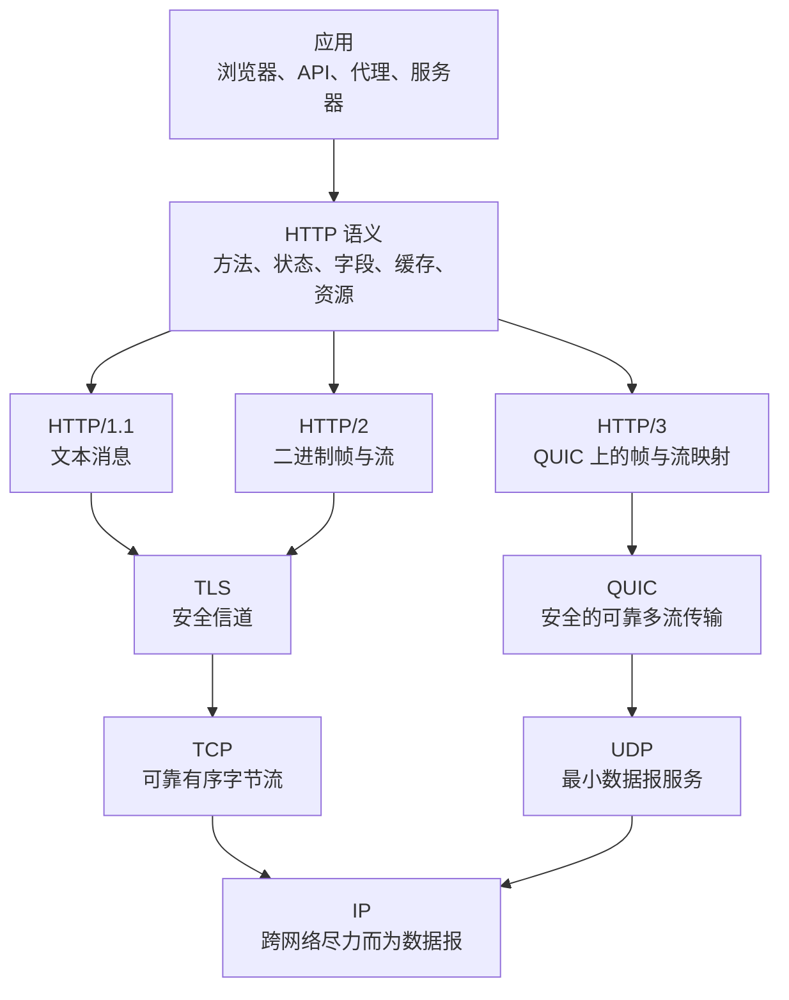

这张图回答“谁依赖谁”，不是要求实现必须由这些独立软件模块组成。HTTP/1.1 和 HTTP/2 也能在其他受约束环境中使用不同映射，但公开 Web 的典型 HTTPS 路径是 HTTP/1.1 或 HTTP/2 经 TLS/TCP，HTTP/3 经 QUIC/UDP。QUIC 使用 TLS 1.3 的握手机制，却不把 TLS Record 原样套在 QUIC 之下；TLS 握手、密钥派生和 QUIC 的 packet protection 被组合在同一个传输设计中。[RFC 9001：Using TLS to Secure QUIC](https://www.rfc-editor.org/rfc/rfc9001)

[RFC 9110：HTTP Semantics](https://www.rfc-editor.org/rfc/rfc9110)把 HTTP 语义从具体版本的报文格式中分离出来。HTTP/1.1、HTTP/2 和 HTTP/3 都表达方法、目标资源、字段、内容与响应状态；变化最大的是**如何建连、怎样分帧、如何并发以及丢包会阻塞谁**。所以版本升级通常不要求把 `GET`、`POST`、状态码或缓存概念重新发明一次。

### 1.1 四个容易混淆的“顺序”

- **应用顺序**：业务要求先登录再下单，属于应用状态机。
- **HTTP 消息顺序**：请求和响应如何关联，取决于 HTTP 版本的消息/流模型。
- **流内字节顺序**：TCP 连接或 QUIC 单条流如何向上层交付字节。
- **网络到达顺序**：IP packet 或 UDP datagram 可以乱序、重复或丢失。

一个协议可以在下层乱序的情况下向上层恢复有序；也可以故意保留消息独立性，让一条消息的丢失不妨碍另一条消息。后文所谓“队头阻塞”，必须说明发生在哪一种顺序边界。

## 2. 从“一个网络”到“网络的网络”

### 2.1 最初的问题不是网页慢，而是异构网络无法自然互通

早期分组网络可以在自身规则内传送数据，但不同网络可能拥有不同的帧格式、地址、包大小、带宽、时延和丢包特征。Internetworking 的目标是让端系统通过网关跨越这些差异，而应用不必知道每一段链路的细节。

1974 年的 [RFC 675：Specification of Internet Transmission Control Program](https://www.rfc-editor.org/rfc/rfc675)仍把较多 internetwork 与端到端传输职责放在同一个 TCP 设计中。随后职责被拆开：IP 负责把数据报跨网络送向目标主机，TCP 负责端到端可靠字节流；当应用只需要最小数据报复用时，则可使用 UDP。

这次拆分建立了一个长期稳定的腰部：

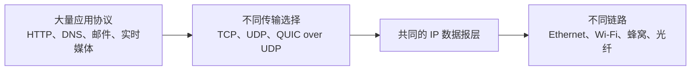

应用可以演进，链路也可以演进，只要中间仍能交换 IP 数据报。代价是 IP 的共同承诺必须足够小，不能把某种链路才有的低丢包、固定 MTU 或可靠广播假设强加给整个 Internet。

### 2.2 历史时间线：日期代表规范或计划，不代表全球同时升级

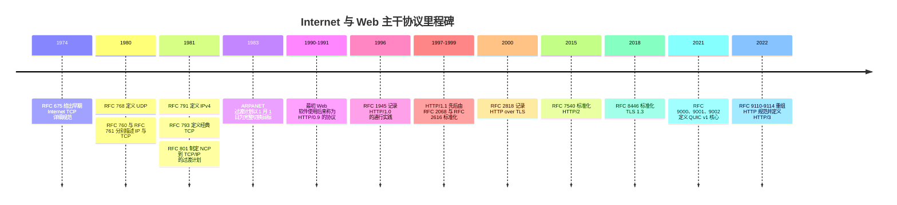

[RFC 801：NCP/TCP Transition Plan](https://www.rfc-editor.org/rfc/rfc801)明确把 1983 年 1 月 1 日写成 ARPANET 从 NCP 完整切换到 IP/TCP 的目标。它是一次有范围的迁移计划，不应被夸大成全球所有网络在同一天完成统一切换。

同理，RFC 发布时间通常意味着一次规范化里程碑，不一定是协议第一次出现。HTTP/1.0 的 [RFC 1945](https://www.rfc-editor.org/rfc/rfc1945)发表于 1996 年，但它明确说自己记录的是从 1990 年起已经使用的通行实践，而且该 RFC 是 Informational，不是当时才发明 HTTP/1.0。

## 3. IP：只承诺尽力送达，才可能承载不同上层选择

IP 的核心抽象是**数据报**：每个 packet 带源地址、目标地址等网络层信息，路由器逐跳选择下一站。IPv4 的 [RFC 791](https://www.rfc-editor.org/rfc/rfc791)和 Internet 主机要求 [RFC 1122](https://www.rfc-editor.org/rfc/rfc1122)都没有赋予 IP 端到端可靠交付保证。

“尽力而为”具体意味着上层必须准备面对：

- packet 丢失；
- 重复；
- 乱序；
- 路径变化；
- 不同链路 MTU；
- 时延和可用带宽大幅变化。

这不是一个遗漏，而是边界选择。路由器不需要保存每条应用连接的完整可靠性状态，端系统则可按应用需要选择 TCP、UDP 或其他传输。文件传输需要恢复丢失字节，实时语音可能宁可丢掉过期数据，也不愿为它等待重传。

IP 能把数据送到**主机接口**，却不知道应该交给哪个应用进程。TCP 与 UDP 的端口复用补上了主机内的端点标识；`源 IP、源端口、目标 IP、目标端口、传输协议`通常共同参与标识一条通信关系。

## 4. UDP 与 TCP：不是“快慢”，而是服务契约不同

### 4.1 UDP：保留数据报边界的最小运输封装

[RFC 768：User Datagram Protocol](https://www.rfc-editor.org/rfc/rfc768)的目标是以最少协议机制，让应用进程在 IP 上收发消息。UDP header 只有源端口、目标端口、长度和校验和四个字段，总计 8 字节。一次发送对应一个 datagram；若接收成功，消息边界仍然存在。

UDP 本身不提供：

- 建连握手；
- 到达保证；
- 重传；
- 去重；
- 有序交付；
- 接收方流量控制；
- 网络拥塞控制；
- 连接迁移或身份认证。

这份“没有”清单不等于使用 UDP 的应用都没有这些能力。DNS 可以在请求层实现超时与重试；实时媒体可以接受部分丢失；QUIC 则在 UDP 之上实现可靠流、丢包恢复、拥塞控制和加密。

也不能由此推出 UDP 可以任意高速发送。[RFC 8085：UDP Usage Guidelines](https://www.rfc-editor.org/rfc/rfc8085)指出，UDP 没有内建拥塞控制，因此在 Internet 上产生大量流量的应用或上层协议需要自己避免拥塞崩溃并兼顾与其他流量的公平性。QUIC 的拥塞控制正是在履行这项责任，而不是绕过它。

### 4.2 TCP：向应用提供可靠、有序、全双工的字节流

当前 TCP 基础规范是 [RFC 9293](https://www.rfc-editor.org/rfc/rfc9293)，它取代了 1981 年的 RFC 793 作为 TCP 主规范，同时吸收数十年的修正。TCP 通过连接状态、序列号、确认、重传、校验、接收窗口和拥塞控制，把下层可能丢失、乱序或重复的 packet 恢复为应用看到的有序字节流。

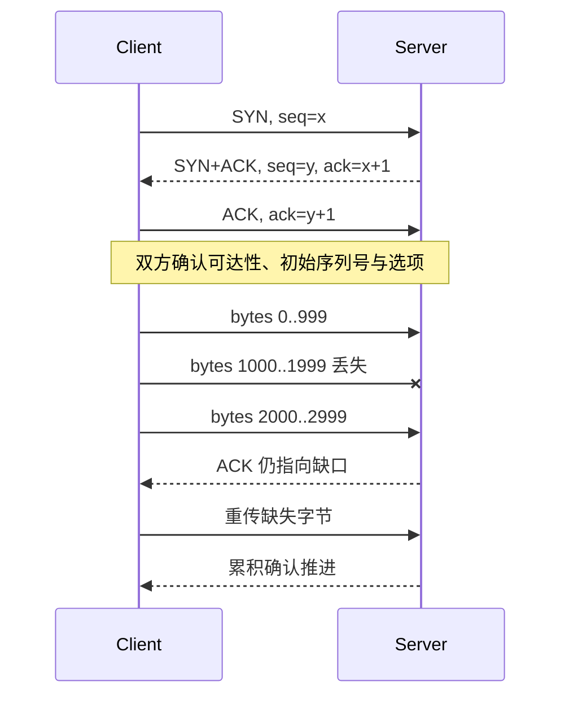

三次握手不只是“打招呼”。双方需要同步各自方向的初始序列号、确认对方能够收发，并协商 MSS、窗口扩大、SACK 等选项。两端随后独立发送与关闭各自方向，所以常见的优雅关闭会交换两组 FIN/ACK；但同时关闭、半关闭、超时和 RST 都会形成不同路径，“TCP 永远四次挥手”只是常见情形的口诀。

### 4.3 可靠性不等于“消息只执行一次”

TCP 保证的是：在连接没有失败且数据最终可交付的条件下，向应用提供无重复、按序的字节序列。它不提供：

- **消息边界**：两次 `write()` 可能合并，一次写入也可能分多次读取；
- **业务事务**：ACK 只说明对端 TCP 收到字节，不说明数据库已经提交；
- **exactly-once**：客户端超时后不知道服务器是在处理前、处理中还是提交后断线；
- **无限可靠**：重试耗尽、路径中断、进程崩溃时连接仍会失败。

因此 HTTP 必须自己定义消息边界，应用必须用幂等键、事务或查询状态处理不确定结果。把“TCP 可靠”直接推导成“支付请求重试安全”是跨层错误。

### 4.4 流量控制与拥塞控制保护的对象不同

- **流量控制**保护接收端：接收窗口 `rwnd` 告诉发送方还有多少缓冲能力。
- **拥塞控制**保护网络路径：拥塞窗口 `cwnd` 根据确认、丢包或 ECN 等信号限制在途数据。

发送方可发送的在途量大体受 `min(rwnd, cwnd)` 限制。现代 TCP 必须实现基本拥塞控制；[RFC 5681](https://www.rfc-editor.org/rfc/rfc5681)描述慢启动、拥塞避免、快速重传和快速恢复。算法会继续演进，TCP 的可靠字节流接口却可保持稳定。

### 4.5 选择不是二选一，而是确定责任放在哪里

| 维度 | UDP | TCP | QUIC over UDP |
| --- | --- | --- | --- |
| 上层看到的基本单位 | Datagram | Byte stream | 多条可靠有序 Stream；也可扩展 Datagram |
| 建连状态 | UDP 本身没有 | TCP 连接 | QUIC 连接并集成加密握手 |
| 内建重传与排序 | 无 | 整条连接字节序列 | 每条可靠流内部 |
| 消息边界 | 保留 Datagram 边界 | 不保留 | Stream 是字节流；HTTP/3 自行分帧 |
| 拥塞控制责任 | 应用或上层协议 | TCP | QUIC |
| 加密与认证 | 无 | TCP 本身无 | QUIC v1 强制结合 TLS 1.3 |
| 典型理由 | 自定义时效、消息或多播语义 | 通用可靠字节流与成熟部署 | 安全多流、连接迁移与可演进传输 |

真正的问题不是“UDP 和 TCP 谁更快”，而是应用是否愿意并且有能力承担可靠性、拥塞、公平性、安全、路径变化和中间设备兼容责任。

## 5. HTTP 的稳定内核：资源语义与传输表达分离

HTTP 是无状态的 request/response 应用协议。这里的“无状态”是说每个请求的语义原则上能够独立理解，协议不会自动替业务保存登录、购物车或工作流状态；Cookie、Token、数据库 Session 和应用上下文可以在 HTTP 之上建立有状态体验。

各主要版本共享的核心概念包括：

- **资源与 URI**：请求针对一个目标资源，响应携带其当前或计算所得的表示；
- **方法**：`GET`、`HEAD`、`POST`、`PUT`、`DELETE` 等表达操作语义；
- **状态码**：区分信息、成功、重定向、客户端错误与服务端错误；
- **字段**：描述内容、条件、缓存、认证、路由与协商；
- **表示**：资源本身不等于某次传输的 JSON、HTML 或图片字节；
- **缓存与条件请求**：允许复用响应，并用验证器确认是否仍有效；
- **代理与网关**：HTTP 天生允许中间节点转发、转换和缓存。

这解释了为什么 HTTP/2 与 HTTP/3 可以改变 wire format，却不改变 REST API 的方法和状态码。协议版本描述的是一次连接如何表达与交换 HTTP message，而不是网站业务版本。

还要区分三个经常被混用的单位：

| 单位 | 所属层次 | 示例 |
| --- | --- | --- |
| HTTP message | 应用语义 | 一个请求或一个响应 |
| HTTP frame | HTTP/2 或 HTTP/3 的连接内编码 | HEADERS、DATA、SETTINGS |
| TCP segment / QUIC packet / UDP datagram | 传输与网络承载 | 一次传输单元，可能只含消息的一部分 |

它们不是一一对应的。一个响应可能跨许多 frame，一个 frame 可能跨 packet；HTTP/2 的同一个 TCP segment 也可能包含多个流的 frame。

## 6. HTTP/0.9 与 HTTP/1.0：先让 Web 能表达不止一个 HTML 文件

### 6.1 HTTP/0.9：一条请求行，一段文档

W3C 保存的[原始 HTTP 协议说明](https://www.w3.org/Protocols/HTTP/AsImplemented)记录了后来称为 HTTP/0.9 的形式：客户端在 TCP 连接上发送类似 `GET /path` 的请求，服务器返回文档内容，没有状态行，也没有今天的 response fields。它适合最初的超文本获取，却无法自然表达：

- 内容类型和编码；
- 成功与失败状态；
- 重定向；
- 缓存元数据；
- 客户端能力与内容协商；
- 非 HTML 表示。

Tim Berners-Lee 1991 年的[“Why a new protocol?”设计说明](https://www.w3.org/Protocols/WhyHTTP.html)已经把格式协商、重定向和检索能力列为 HTTP 要解决的问题。也就是说，HTTP 从一开始就不是“只把文件拷贝过来”，而是希望为分布式信息系统建立可扩展接口。

### 6.2 HTTP/1.0：消息有了结构，但连接通常不能复用

HTTP/1.0 增加版本号、方法、状态码、header fields 与媒体类型，响应可以明确表示 `200 OK`、`404 Not Found` 和 `Content-Type`。它把协议从“取回 HTML”推进到可以传递多种资源表示的通用消息模型。[RFC 1945](https://www.rfc-editor.org/rfc/rfc1945)

典型 HTTP/1.0 交换是一条连接承载一个请求和一个响应，然后通过关闭连接标记响应结束。一个包含 HTML、CSS、JavaScript 和多张图片的页面会反复承担：

- TCP 握手；
- 新连接的拥塞窗口从较保守状态起步；
- 服务端 socket 与客户端连接资源；
- 若使用 TLS，还包括额外安全握手。

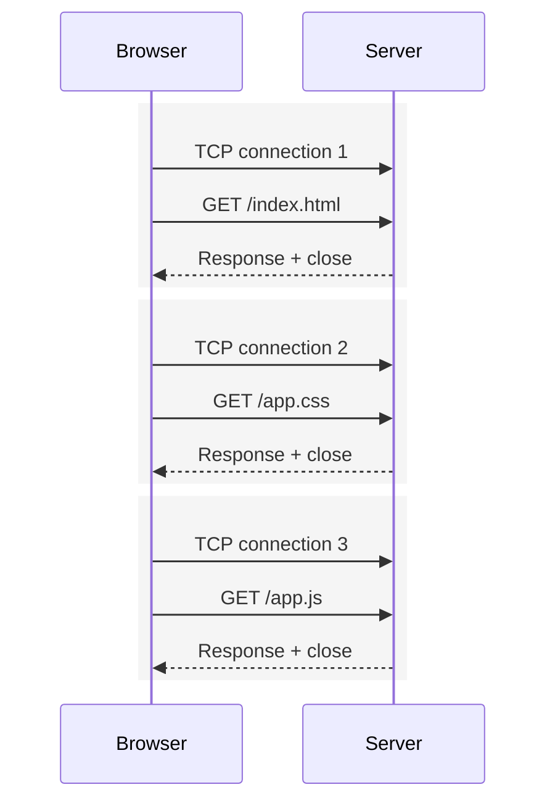

后来的 HTTP/1.0 实现曾通过 `Connection: keep-alive` 试验持久连接，但代理对 hop-by-hop 字段理解不一致会产生悬挂和错误转发。HTTP/1.1 才把持久连接及其边界规则纳入默认模型。[RFC 9112 附录 C.2.2](https://www.rfc-editor.org/rfc/rfc9112#appendix-C.2.2)

## 7. HTTP/1.1：复用连接，也把顺序和解析边界推到前台

HTTP/1.1 在保留文本消息兼容性的同时，重点改善 Internet 规模下的互操作、缓存、连接效率和虚拟主机。它在 1997 年由 RFC 2068 首次进入 Standards Track，1999 年由 RFC 2616 修订，2014 年拆分为 RFC 7230—7235，2022 年又被重组为 HTTP 语义 RFC 9110、缓存 RFC 9111 和消息语法 RFC 9112。[RFC 9110 的历史说明](https://www.rfc-editor.org/rfc/rfc9110#section-1.2)

### 7.1 持久连接：一次握手承载多个请求

HTTP/1.1 默认采用持久连接。响应不能再总靠关闭 TCP 表示结束，因此必须明确消息边界：

- `Content-Length` 表示已知长度；
- `Transfer-Encoding: chunked` 允许发送方在事先不知道总长度时逐块发送；
- 某些响应由方法或状态码决定没有 body；
- 只有在规则允许时才以连接关闭作为结束。

消息边界不仅影响正确性，也影响安全。若前置代理和后端服务器对 `Content-Length`、`Transfer-Encoding` 或非法空白的解析不同，攻击者可能让两端对“下一条请求从哪里开始”产生分歧，形成 request smuggling。[RFC 9112 第 11.2 节](https://www.rfc-editor.org/rfc/rfc9112#section-11.2)

HTTP/1.1 还要求请求携带 `Host`，从而让多个域名共享一个 IP/端口的入口。这里的 Host 是应用层路由信息；IP 路由把 packet 送到入口，HTTP server 或 reverse proxy 再选择虚拟主机。

### 7.2 pipelining：请求可以先发，响应仍必须排队

持久连接最简单的使用方式仍是：发一个请求，等响应，再发下一个。HTTP/1.1 pipelining 允许客户端不等待前一个响应就继续发送请求，但服务器必须按请求顺序发送相应响应。[RFC 9112 第 9.3.2 节](https://www.rfc-editor.org/rfc/rfc9112#section-9.3.2)

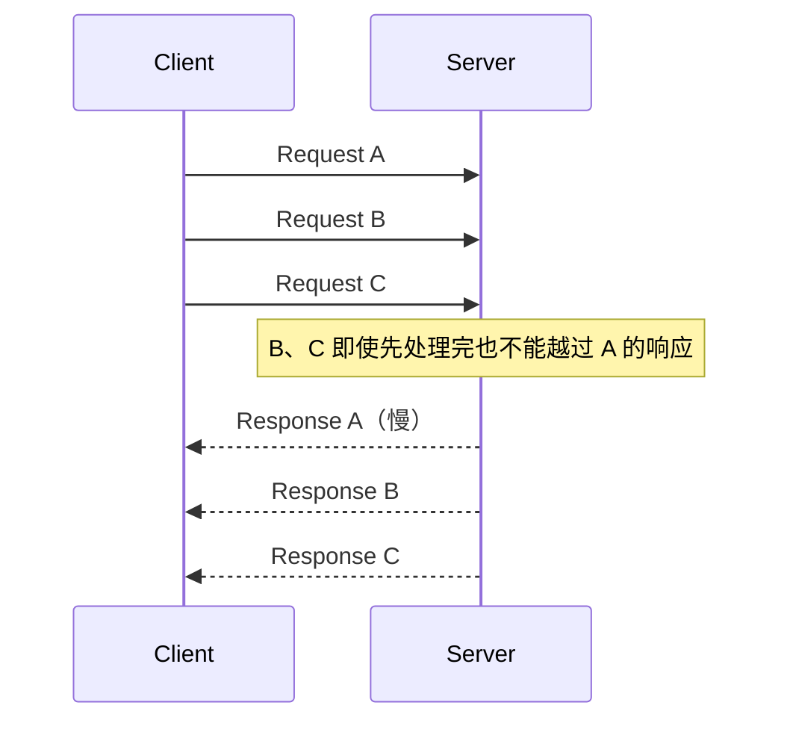

这是 **HTTP/1.1 响应顺序造成的队头阻塞**。为了获得并发，客户端常以多条 TCP 连接换取多条独立队列，但又产生新的代价：

- 每条连接分别握手和维护状态；
- 每条连接拥有独立拥塞控制，相互竞争路径容量；
- 连接数、文件描述符和 TLS 状态增加；
- 资源被分散在多个连接上。

旧时代的 domain sharding、资源合并和内联，都是在特定 HTTP/1.x 约束下形成的工程补偿。它们不是跨版本永远成立的优化；迁移到多路复用协议后，额外域名和连接反而可能增加 DNS、握手和调度成本。

### 7.3 HTTP/1.1 不只是 Keep-Alive

把 HTTP/1.1 概括成“支持长连接”会遗漏更持久的贡献：

- `Host` 支撑基于名称的虚拟主机；
- 分块传输支持动态流式响应；
- 更系统的缓存控制和条件请求改善一致性；
- Range 支持部分内容；
- 内容协商与验证器形成可组合语义；
- 更明确的代理、连接字段和失败恢复规则。

这些语义继续被 HTTP/2 与 HTTP/3 使用。被替换的是连接上的消息表达方式，不是 HTTP/1.1 创造的全部能力。

## 8. HTTPS 与 TLS：安全是一条正交演进线

### 8.1 HTTPS 不是 HTTP/1.5

HTTPS URI 表示客户端需要通过安全连接建立对目标资源的授权访问。历史上的 [RFC 2818：HTTP Over TLS](https://www.rfc-editor.org/rfc/rfc2818)描述 HTTP/TLS over TCP；当前语义整合在 [RFC 9110 第 4.2.2 节](https://www.rfc-editor.org/rfc/rfc9110#section-4.2.2)。

TLS 主要提供：

- **机密性**：没有会话密钥的路径观察者难以读取应用内容；
- **完整性**：篡改受保护记录会被检测；
- **端点认证**：公开 Web 通常由客户端验证服务器证书、主机名与信任链；客户端证书是可选机制；
- **密钥协商**：为当前连接派生会话密钥。

TLS 不会自动保证：

- 服务器应用没有漏洞；
- 登录用户具有正确业务权限；
- 数据库事务正确；
- 域名本身值得信任；
- endpoint 被攻陷后数据仍保密；
- IP 地址、packet 大小和时间模式等外层信息全部隐藏。

因此“有小锁”证明的是浏览器与证书所代表端点之间建立了受保护连接，不是网站业务可信度证明。

### 8.2 握手成本来自多层串联

一条全新的 HTTP/2 HTTPS 连接在发送普通应用请求前，通常先完成 TCP 建连，再完成 TLS 协商。TLS 1.3 将常规完整握手设计为客户端一轮往返后即可发送受保护应用数据，但 DNS、TCP、证书验证、丢包和服务器处理仍可能增加总延迟。[RFC 8446：TLS 1.3](https://www.rfc-editor.org/rfc/rfc8446)

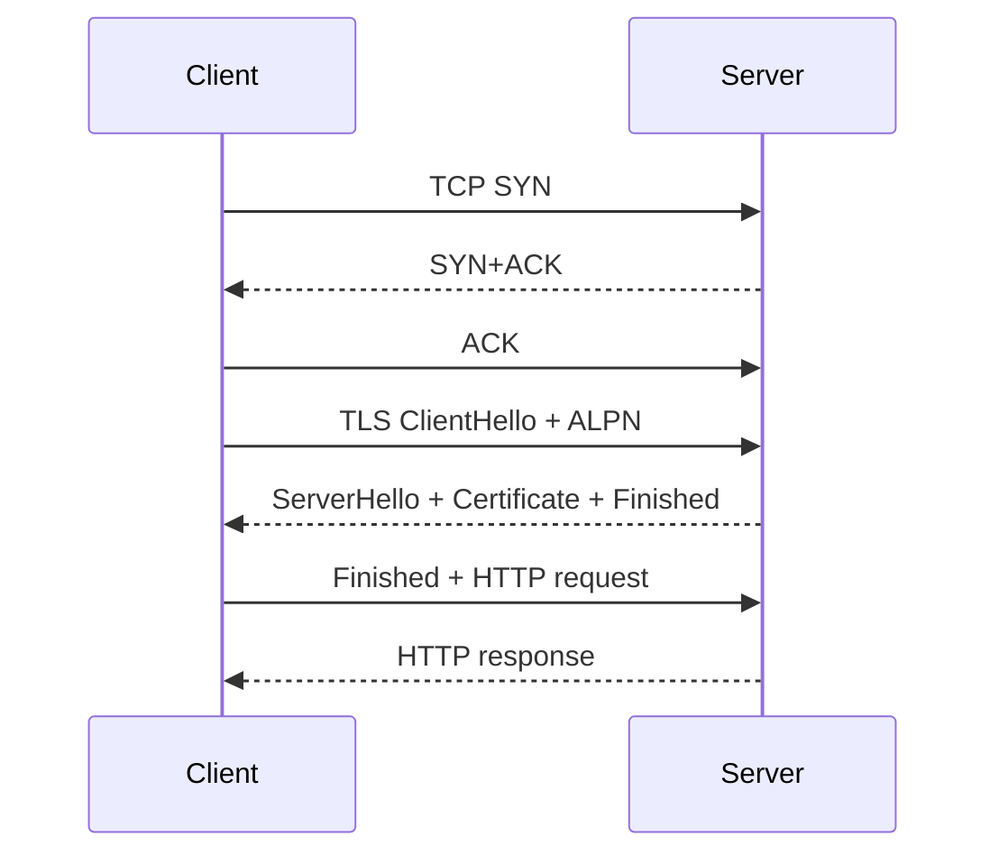

这是概念时序，不是固定 packet 数：TCP Fast Open、TLS resumption、ACK 合并、实现调度和网络丢包会改变线上形态。最重要的因果关系是 TCP 与 TLS 是两套顺序建立的状态机。

[RFC 7301：ALPN](https://www.rfc-editor.org/rfc/rfc7301)允许客户端在 TLS 握手中提出 `h2`、`http/1.1` 等应用协议，服务器选择双方共同支持的一种，避免建立加密连接后再额外探测协议。

### 8.3 0-RTT 是恢复优化，不是免费提前执行

TLS 1.3 和 QUIC 都能在恢复既有会话时使用 0-RTT early data：客户端基于先前获得的 ticket 与参数，在新握手完成前发送应用数据。它不是首次访问陌生服务器时凭空消除往返。

early data 可能被攻击者重放。服务器即使阻止同一数据在单个连接内重复，也无法在所有分布式节点和时间窗口中天然保证应用副作用只发生一次。RFC 8446 与 [RFC 9001 第 9.2 节](https://www.rfc-editor.org/rfc/rfc9001#section-9.2)都要求应用协议处理重放风险。因此支付、创建订单或修改状态等非幂等操作不能仅因“连接已加密”就安全地在 0-RTT 中执行。

## 9. HTTP/2：把并发请求变成一条连接里的多条流

HTTP/2 的目标不是改变 HTTP 业务语义，而是更高效地表达它。[RFC 9113](https://www.rfc-editor.org/rfc/rfc9113)定义二进制 framing layer：连接由 frame 构成，每次 request/response exchange 关联一条 stream，多条 stream 的 frame 可以交错传输。

### 9.1 frame、stream 与 connection

- **frame** 是最小协议单元，例如 HEADERS、DATA、SETTINGS、WINDOW_UPDATE；
- **stream** 是连接内有编号的双向 frame 序列，通常承载一次请求/响应；
- **connection** 保存 HPACK、SETTINGS、流量控制和所有活动 stream 的共同状态。

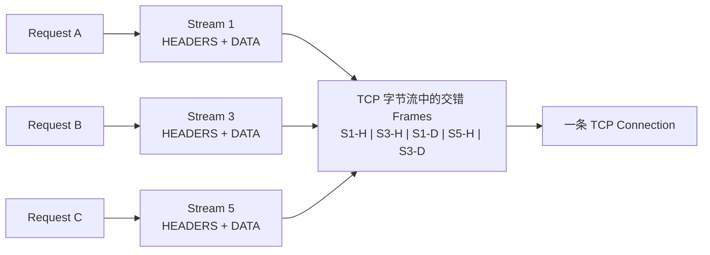

慢响应 A 不再要求 HTTP 层必须先完整发送 A，服务器可以先发送 B、C 的 frame。这样消除了 HTTP/1.1 响应排序形成的应用层队头阻塞，并减少为并发请求建立多条 TCP 连接的必要性。

### 9.2 HTTP/2 没有消除 TCP 队头阻塞

TCP 向上层只交付连续有序的字节。若一个 TCP segment 丢失，后续 segment 即使已经到达接收端，也必须等待缺口恢复后才能作为连续字节交给 HTTP/2 parser。TCP 不知道这些字节分别属于 stream 1、3 还是 5。

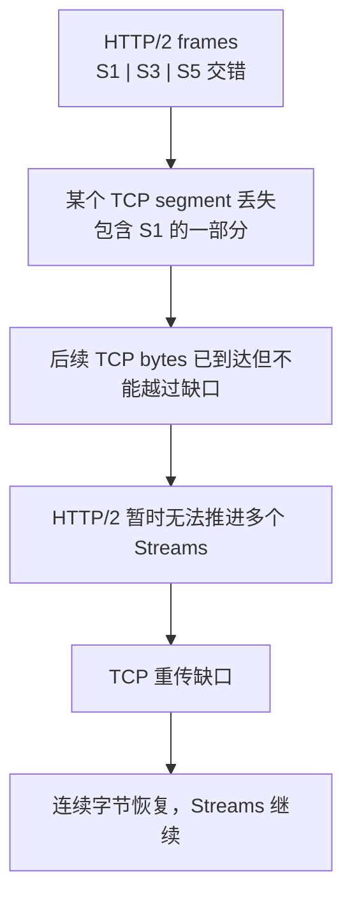

所以要精确区分：

- HTTP/2 **解决了** HTTP/1.1 的消息顺序队头阻塞；
- HTTP/2 **没有解决** TCP 的连接级有序交付队头阻塞。

在低丢包、已建立连接的环境中，单连接复用依然很有价值；在高 RTT 或有丢包的移动网络中，一次 packet loss 影响所有活动 stream 的问题会更明显。这里不能推导固定性能倍数，因为连接复用收益与丢包放大效应取决于网络和工作负载。

### 9.3 HPACK、流量控制和优先级都是状态

HTTP/2 用 HPACK 压缩重复 header fields。静态表与动态表能减少 Cookie、User-Agent 等重复字段的传输，却让编码器和解码器共享压缩状态；实现需要限制表大小，并避免把跨信任边界的秘密放入可被长度探测的压缩上下文。[RFC 7541：HPACK](https://www.rfc-editor.org/rfc/rfc7541)

HTTP/2 同时提供 connection-level 与 stream-level flow control。接收方通过 WINDOW_UPDATE 允许对端继续发送，这保护的是 HTTP/2 接收资源，不替代 TCP 拥塞控制。若实现只读取部分 stream、更新窗口不公平或优先级调度不当，多路复用仍可能发生应用层饥饿。

原始 RFC 7540 定义的 priority signaling scheme 在当前 RFC 9113 中已被弃用。Server Push 仍是协议中的可选交互模式，但它只是允许服务器猜测客户端将需要什么；错误猜测会浪费带宽、缓存与 CPU，不能从“少一次请求等待”推导出普遍更快。

## 10. QUIC：在 UDP 上建立可演进的安全多流传输

### 10.1 为什么不是等待操作系统里的 TCP 全面升级

TCP header 与行为长期被操作系统内核、NAT、防火墙、负载均衡器和其他 middlebox 观察甚至改写。新增 TCP option 或改变 wire behavior 不只要求两个 endpoint 更新，还可能被路径上的设备丢弃或错误处理。

QUIC 把 packet 放入 UDP datagram，利用现有网络普遍具备的 UDP 端口与复用接口，让大部分传输逻辑能在用户态随应用或库更新。[RFC 9000](https://www.rfc-editor.org/rfc/rfc9000)明确说明 QUIC 使用 UDP 是为了更容易部署于现有系统和网络。结论不是“UDP 比 TCP 更快”，而是：

> UDP 提供一个足够小、可部署的数据报底座；QUIC 自己重新承担可靠性、安全、拥塞控制和连接状态。

QUIC 还尽可能认证并加密 packet 内容，使中间设备难以依赖可变内部字段。这减少了路径对协议版本的隐式绑定，但也让传统基于 TCP sequence number 或明文字段的网络观测方法失效。

### 10.2 QUIC 的基本对象

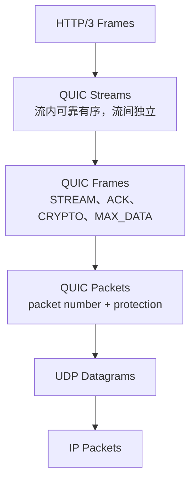

一条 QUIC connection 可以拥有多条单向或双向 stream。每条可靠 stream 向应用提供有序字节，但不同 stream 之间没有总排序要求。丢失包含 stream A 数据的 QUIC packet 时，接收端仍可把已经完整获得的 stream B 数据交给应用。

这并不意味着一个 QUIC packet 只含一条 stream。packet 可以装多个 frame；一个 stream frame 也可跨 packet。丢包后，发送方重新发送的是尚未确认的 frame 信息，不是按原样复刻同一个 packet number。QUIC packet number 不复用，使 loss detection 不必像 TCP 那样区分原始 segment 与同序列号重传。

### 10.3 QUIC 解决的队头阻塞有明确边界

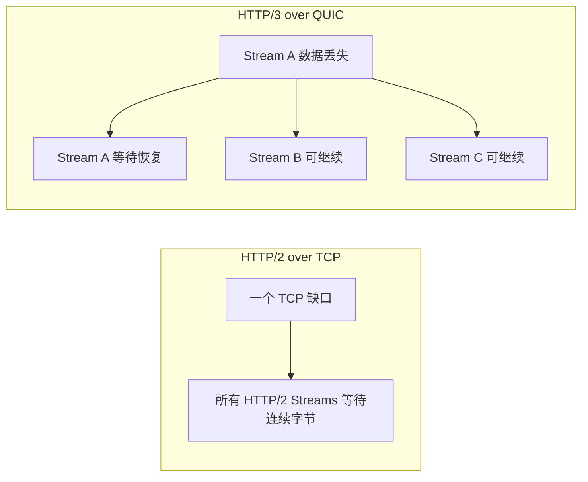

QUIC 消除的是**跨 stream 的传输层队头阻塞**，没有消除：

- 同一 stream 内的有序等待；
- QPACK 动态表引用可能引起的 field section 阻塞；
- connection-level flow control；
- 应用依赖关系，例如 JavaScript 必须等待关键 CSS；
- 服务器 CPU、数据库锁或上游 API 排队；
- 拥塞窗口限制整条路径的发送速率。

如果把所有大对象放进同一条 stream，QUIC 不会自动把它拆成独立可推进单元。协议能力必须由上层正确映射才能产生收益。

### 10.4 TLS、握手与 0-RTT 被纳入传输状态机

QUIC v1 使用 TLS 1.3 或更高版本的握手机制，并把 transport parameters 与密码学协商结合。相较“TCP 先握手、TLS 再握手”，QUIC 可以并行完成传输和安全参数协商；恢复连接时还可能使用 0-RTT。

但 QUIC 不是省略身份验证。首次连接仍需获得和验证服务器身份；0-RTT 仍依赖此前连接留下的 session ticket，并承担重放风险。服务器在验证客户端地址之前还受到 anti-amplification limit：通常不能向未验证地址发送超过所收字节一定倍数的数据，以减轻伪造源地址反射放大。

### 10.5 拥塞控制仍是连接和路径的共同约束

[RFC 9002：QUIC Loss Detection and Congestion Control](https://www.rfc-editor.org/rfc/rfc9002)给出与 TCP NewReno 相近的示例拥塞控制器，同时允许实现选择符合规范原则的其他算法。所有 stream 仍共享当前 path 的拥塞预算；“流彼此独立”不等于每条流拥有无限或完全隔离的带宽。

QUIC 的 ACK 可以表达 packet number range，loss recovery 能利用更明确的 packet number space；这些机制改善传输控制的可解释性，但不会改变带宽、RTT 和真实拥塞的物理限制。

### 10.6 Connection ID 让连接不完全绑定地址四元组

TCP 连接通常由 IP 地址与端口四元组识别；客户端从 Wi-Fi 切换到蜂窝网络时，本地地址变化往往使旧 TCP 连接失效。QUIC 使用 Connection ID 标识连接，使 QUIC v1 客户端可以在 NAT rebinding 或本地网络变化后验证新 path 并迁移已有连接。

连接迁移不是无缝网络的承诺：

- 新 path 仍需可达并验证；
- 拥塞控制需要适应新路径；
- server、load balancer 和 Connection ID 路由必须协作；
- 企业网络可能阻止 UDP；
- QUIC v1 的主动迁移能力主要由客户端使用。

### 10.7 新代价：部署、CPU、观测和 fallback

QUIC 把更多逻辑放入用户态并加密更多传输元数据，代价包括：

- 加密和 packet 处理对 CPU、内存与实现质量提出更高要求；
- 内核 TCP 时代成熟的 offload、调优和监控方法不能全部直接复用；
- load balancer 需要理解或稳定路由 Connection ID；
- UDP state 的 NAT/firewall timeout 可能不同于 TCP；
- 某些网络会限速或阻断 UDP；
- 必须保留 TCP-based HTTP fallback；
- 协议栈、证书、0-RTT、重试和路径迁移扩大测试状态空间。

[RFC 9308：Applicability of the QUIC Transport Protocol](https://www.rfc-editor.org/rfc/rfc9308)专门讨论 QUIC 的适用条件。标准能证明 fallback 与部署风险需要被设计，不能证明某个国家、运营商或企业网络的当前 UDP 可达率。

## 11. HTTP/3：让 HTTP 的流直接映射到 QUIC

HTTP/3 继续使用 HTTP 的方法、状态、字段和缓存语义，但把传输改为 QUIC。[RFC 9114](https://www.rfc-editor.org/rfc/rfc9114)的核心映射是：一次 request/response 使用一条 client-initiated bidirectional QUIC stream，连接级设置和控制信息使用独立的 unidirectional control stream。

### 11.1 HTTP/2 的哪些能力被下沉了

| 能力 | HTTP/2 over TCP | HTTP/3 over QUIC |
| --- | --- | --- |
| HTTP 语义 | HTTP 共同语义 | HTTP 共同语义 |
| 多路复用 | HTTP/2 自己定义 Stream | 主要使用 QUIC Stream |
| 可靠有序交付 | TCP 整条连接 | QUIC 每条可靠 Stream |
| 拥塞与丢包恢复 | TCP | QUIC |
| 安全握手 | 通常 TLS over TCP | QUIC 集成 TLS 1.3 |
| Header 压缩 | HPACK | QPACK |
| 连接迁移 | TCP 没有通用内建机制 | QUIC Connection ID 与 Path Validation |

HTTP/3 仍有自己的 HEADERS、DATA、SETTINGS 等 frame，但 stream 生命周期、stream-level flow control 和许多错误边界交给 QUIC。相同名称的 frame 也不意味着 HTTP/2 frame 与 HTTP/3 frame 能直接互换。

### 11.2 为什么 HPACK 要变成 QPACK

HPACK 动态表更新依赖连接上的全序。若原样放到彼此独立交付的 QUIC stream，一个请求的 HEADERS 可能先到，却引用了仍困在另一条丢包 stream 中的动态表更新，重新制造跨流阻塞。

[RFC 9204：QPACK](https://www.rfc-editor.org/rfc/rfc9204)把编码器指令、解码器反馈放入专用单向 stream，并允许编码器在压缩率与被阻塞 stream 数量之间取舍。QPACK **降低而非数学上消灭** header compression blocking；若 field section 引用了尚未到达的动态表条目，该 stream 仍需等待。

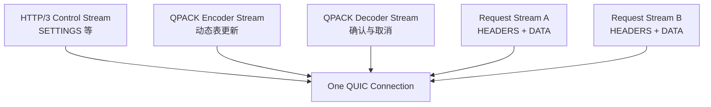

### 11.3 客户端怎样知道服务端支持 HTTP/3

一个 `https://` URL 本身没有写“使用 h3”。客户端可以依据已有信息尝试 HTTP/3，也可以先通过 TCP-based HTTP 获得 [Alt-Svc](https://www.rfc-editor.org/rfc/rfc7838) 广告；建立 QUIC 连接时通过 ALPN 选择 `h3`。

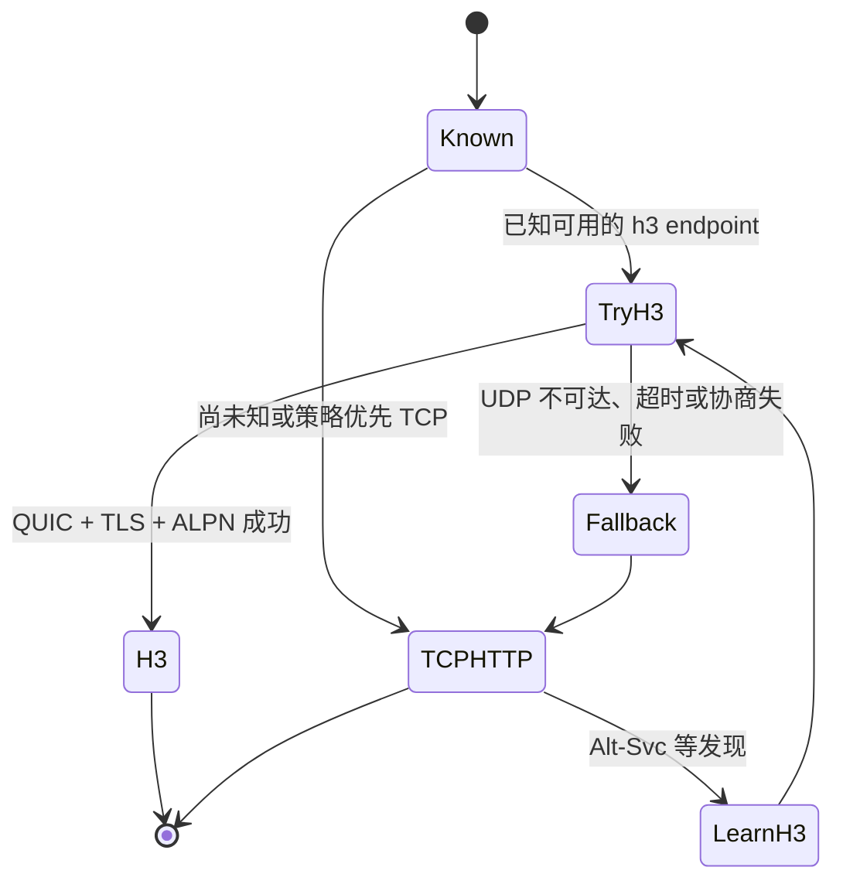

这条状态图解释了为什么 HTTP/3 部署必须与 HTTP/2 或 HTTP/1.1 共存。禁止 UDP/443 的网络不应让站点永久不可访问；客户端需要控制尝试延迟、缓存可用性信息并在适当条件下 fallback。现实实现可能并行竞速或采用更复杂策略，图只表达规范层的必要状态，不代表某个浏览器的内部算法。

## 12. 一次现代请求：把所有因果关系串起来

假设浏览器首次打开 `https://example.com/app`，没有可复用连接，也没有可用的 HTTP/3 历史信息。概念路径如下：

1. **名称解析**：DNS 把 hostname 解析为一个或多个地址；这一步不由 HTTP、TCP 或 QUIC 完成。
2. **选择路径与协议候选**：客户端根据地址、缓存的 Alt-Svc/策略和本地能力决定尝试 TCP-based HTTP 或 QUIC。
3. **建立传输与安全上下文**：
   - HTTP/1.1 或 HTTP/2：TCP handshake → TLS handshake → ALPN；
   - HTTP/3：QUIC 将 transport 与 TLS handshake 结合。
4. **验证 endpoint**：客户端验证证书与目标主机的关系。
5. **表达 HTTP request**：
   - HTTP/1.1 写入文本消息；
   - HTTP/2 编码为 HPACK fields 和二进制 frames；
   - HTTP/3 编码为 QPACK fields 和 QUIC streams 上的 frames。
6. **传输与拥塞控制**：TCP 或 QUIC 根据 ACK、RTT、loss/ECN 和窗口决定发送节奏。
7. **代理与 origin 处理**：CDN、reverse proxy 或 application server 解释 HTTP 语义；它们可能在每一跳使用不同 HTTP 版本。
8. **响应、缓存与渲染**：浏览器验证消息边界，应用缓存规则，再将表示交给 HTML、CSS、JavaScript 或其他消费者。

注意第 7 步：协议版本通常是**逐连接、逐跳**的。客户端到 CDN 可以是 HTTP/3，CDN 到 origin 可以是 HTTP/2 或 HTTP/1.1；客户端看到 h3 不证明整个后端链路都是 QUIC。

## 13. 最终比较：每一代解决什么，又留下什么

| 协议或组合 | 核心抽象 | 主要解决的问题 | 没有解决或新增的代价 |
| --- | --- | --- | --- |
| IP | 尽力而为 Datagram | 跨异构网络寻址与转发 | 不保证到达、顺序、唯一性和应用端点 |
| UDP | 带 Port 的 Datagram | 最小进程复用并保留消息边界 | 无可靠性、拥塞控制、安全与连接状态 |
| TCP | 可靠有序 Byte Stream | 丢包恢复、排序、流量控制、拥塞控制 | 无消息边界；连接握手；跨应用数据的统一顺序 |
| HTTP/0.9 | 极简文档获取 | 在 TCP 上请求超文本 | 无状态码、fields、内容类型等通用元数据 |
| HTTP/1.0 | 结构化 HTTP Message | 方法、状态、fields 和多种表示 | 典型每请求连接，复用与边界规则不足 |
| HTTP/1.1 | 持久文本连接 | 连接复用、虚拟主机、缓存、流式消息边界 | 无真正多路复用；pipelining 响应排序；解析歧义 |
| HTTPS/TLS | 受认证的安全信道 | 窃听、传输篡改与服务器身份认证 | 握手、证书与密钥管理；不保护 endpoint 内部 |
| HTTP/2 | 一条 TCP 上的 Frames/Streams | HTTP 多路复用与 field 压缩 | TCP loss 可阻塞全部 Streams；共享状态复杂 |
| QUIC | UDP 上的安全多流传输 | 流间丢包隔离、集成握手、连接迁移、用户态演进 | CPU、观测、middlebox、UDP 可达性与 fallback |
| HTTP/3 | HTTP over QUIC | 将 HTTP exchange 映射到独立 QUIC Streams | QPACK/控制流状态、部署复杂度；并非总是更快 |

### 13.1 “HTTP/3 更快”需要哪些前提

HTTP/3 可能在以下条件下更有优势：

- RTT 较高，减少串联握手等待更有价值；
- 连接可恢复或具备安全可用的 0-RTT；
- 多个并发 stream 中存在丢包，跨流隔离能减少连带停顿；
- 用户网络切换，连接迁移避免重建全部上层状态；
- 客户端、服务器和中间基础设施拥有成熟 QUIC 实现。

它也可能没有优势甚至更慢：

- UDP 尝试被阻断，先超时再 fallback；
- 网络低 RTT、低丢包且 TCP/TLS 连接早已复用；
- QUIC CPU、packet size、缓冲或调度实现不成熟；
- 请求瓶颈在服务器计算、数据库、缓存未命中或前端依赖图；
- 0-RTT 因请求副作用或安全策略不能使用。

所以正确的生产问题是“目标用户路径的成功率、握手、TTFB、loss recovery 和 fallback 如何”，不是“协议编号是否更大”。标准解释机制；真实收益必须按网络、设备、region、CDN/origin 拓扑和业务 workload 测量。

## 14. 仍然存在的边界与下一步

### 14.1 旧协议为什么不会消失

- UDP 的最小 datagram 契约适合 DNS、实时媒体、隧道以及作为 QUIC 底座；
- TCP 的 kernel 实现、工具、middlebox 兼容和通用 byte stream API 仍有巨大部署价值；
- HTTP/1.1 简单、可读、广泛可用，常用于代理到 origin、内部服务或 fallback；
- HTTP/2 在稳定 TCP 路径与成熟实现上仍能高效复用；
- HTTP/3 需要 UDP、QUIC 和端到端基础设施共同支持。

协议演进更像生态中的能力叠加与协商，而不是全网强制换代。

### 14.2 HTTP/3 没有覆盖所有实时与双向需求

WebSocket 在 HTTP 建连语义上建立长寿命双向 channel；[RFC 9221：QUIC DATAGRAM](https://www.rfc-editor.org/rfc/rfc9221)为 QUIC 增加受加密与拥塞控制约束、但不可靠的 datagram；[RFC 9298：Proxying UDP in HTTP](https://www.rfc-editor.org/rfc/rfc9298)则是 MASQUE 工作组定义的 UDP 代理方案。它们解决的是不同应用契约，不能统称“HTTP/4”。

[W3C WebTransport](https://www.w3.org/TR/webtransport/)尝试向 Web 应用暴露 session、多条 stream 与 datagram 能力。截至查证基线它仍处于 Candidate Recommendation，且依赖的 IETF 协议仍在演进，因此这里只把它当作 HTTP/3/QUIC 能力继续上移的方向，不把当前 API 或部署状态写成稳定终点。

### 14.3 不要把层次模型当成实现截图

QUIC 同时包含传统传输、安全会话和多流能力；TLS 处于应用协议与传输之间；proxy 会终止一条连接并创建另一条。分层的价值是回答：

1. 谁承诺什么？
2. 状态保存在哪里？
3. 丢包或失败会阻塞谁？
4. 安全边界在哪个 endpoint 终止？
5. 升级需要改变客户端、服务器还是网络路径？

只要这五个问题能答清，“QUIC 到底算 L4 还是 L7”就不再是最重要的争论。

## 15. 一条可复用的推理主线

把全文压缩成一条链：

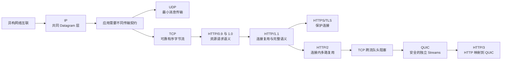

读这张图时，应始终在每条箭头上补一句：

> 旧方案暴露了什么约束，新方案把哪项责任移到哪里，又引入了什么新状态和失败模式？

这比背诵“UDP 快、TCP 稳、HTTP/2 多路复用、HTTP/3 用 QUIC”更接近协议设计的本质。

## 主要原始资料

- [RFC 675：Specification of Internet Transmission Control Program](https://www.rfc-editor.org/rfc/rfc675)
- [RFC 768：User Datagram Protocol](https://www.rfc-editor.org/rfc/rfc768)
- [RFC 791：Internet Protocol](https://www.rfc-editor.org/rfc/rfc791)
- [RFC 801：NCP/TCP Transition Plan](https://www.rfc-editor.org/rfc/rfc801)
- [RFC 1122：Requirements for Internet Hosts — Communication Layers](https://www.rfc-editor.org/rfc/rfc1122)
- [RFC 8085：UDP Usage Guidelines](https://www.rfc-editor.org/rfc/rfc8085)
- [RFC 9293：Transmission Control Protocol](https://www.rfc-editor.org/rfc/rfc9293)
- [RFC 5681：TCP Congestion Control](https://www.rfc-editor.org/rfc/rfc5681)
- [W3C：The Original HTTP as Defined in 1991](https://www.w3.org/Protocols/HTTP/AsImplemented)
- [W3C：HTTP — Why a New Protocol?](https://www.w3.org/Protocols/WhyHTTP.html)
- [RFC 1945：HTTP/1.0](https://www.rfc-editor.org/rfc/rfc1945)
- [RFC 9110：HTTP Semantics](https://www.rfc-editor.org/rfc/rfc9110)
- [RFC 9111：HTTP Caching](https://www.rfc-editor.org/rfc/rfc9111)
- [RFC 9112：HTTP/1.1](https://www.rfc-editor.org/rfc/rfc9112)
- [RFC 2818：HTTP Over TLS](https://www.rfc-editor.org/rfc/rfc2818)
- [RFC 8446：TLS 1.3](https://www.rfc-editor.org/rfc/rfc8446)
- [RFC 7301：TLS ALPN](https://www.rfc-editor.org/rfc/rfc7301)
- [RFC 9113：HTTP/2](https://www.rfc-editor.org/rfc/rfc9113)
- [RFC 7541：HPACK](https://www.rfc-editor.org/rfc/rfc7541)
- [RFC 9000：QUIC Transport](https://www.rfc-editor.org/rfc/rfc9000)
- [RFC 9001：Using TLS to Secure QUIC](https://www.rfc-editor.org/rfc/rfc9001)
- [RFC 9002：QUIC Loss Detection and Congestion Control](https://www.rfc-editor.org/rfc/rfc9002)
- [RFC 9308：Applicability of QUIC](https://www.rfc-editor.org/rfc/rfc9308)
- [RFC 9114：HTTP/3](https://www.rfc-editor.org/rfc/rfc9114)
- [RFC 9204：QPACK](https://www.rfc-editor.org/rfc/rfc9204)
- [RFC 7838：HTTP Alternative Services](https://www.rfc-editor.org/rfc/rfc7838)
- [RFC 9221：An Unreliable Datagram Extension to QUIC](https://www.rfc-editor.org/rfc/rfc9221)
- [RFC 9298：Proxying UDP in HTTP](https://www.rfc-editor.org/rfc/rfc9298)
- [W3C：WebTransport Candidate Recommendation](https://www.w3.org/TR/webtransport/)
