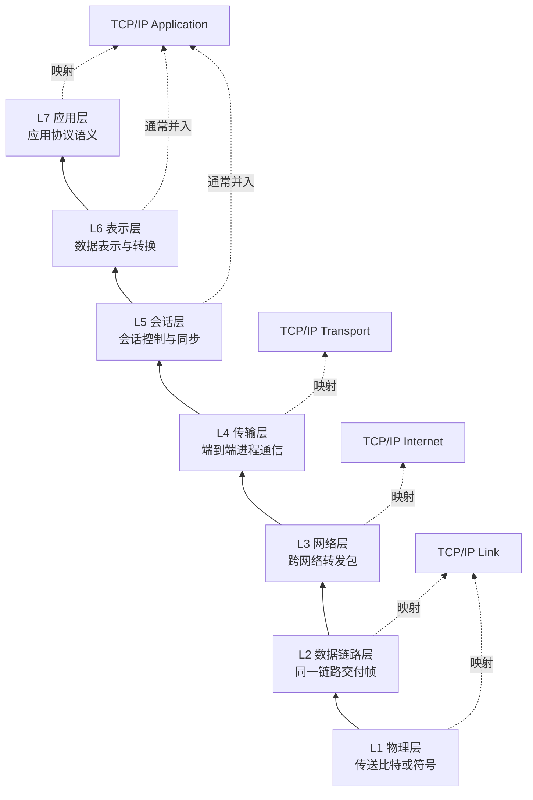
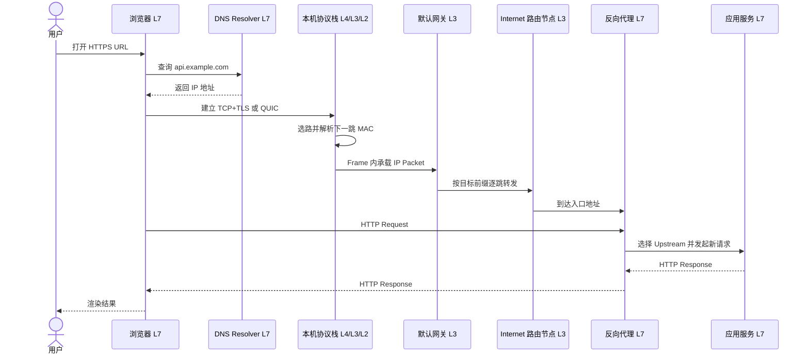
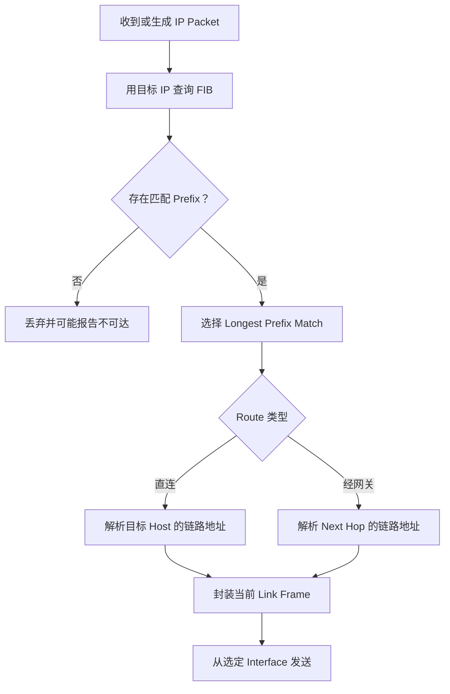
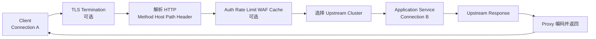
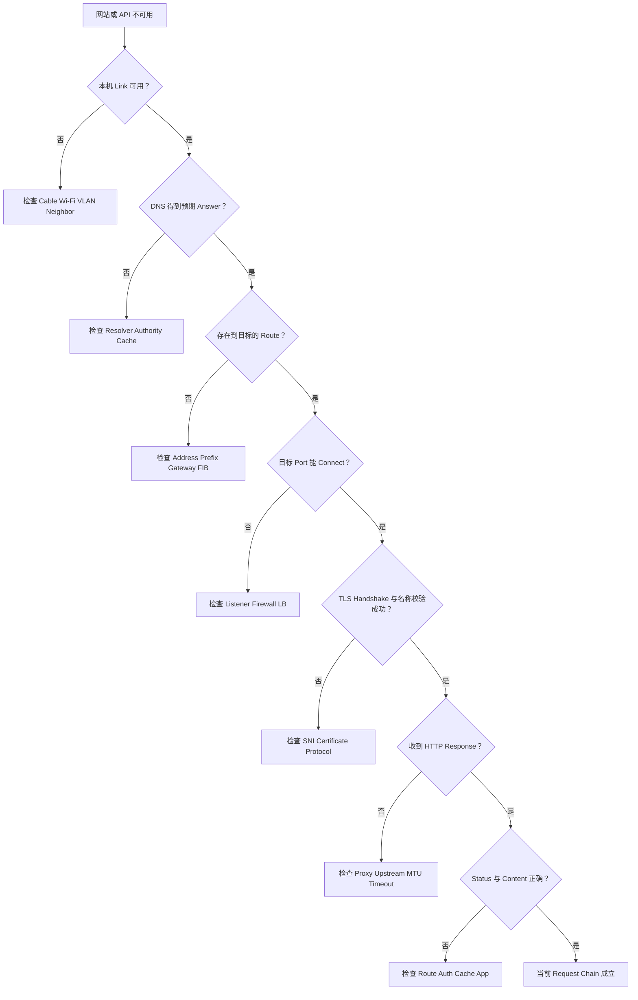

# 计算机网络分层：从 OSI 七层到 L3 路由与 L7 应用处理

> 查证基线：2026-09-13。本文用 ITU-T X.200 解释 OSI 参考模型，用 RFC 1122 的四层模型描述 Internet 协议族，并以 IPv6（RFC 8200）、现代 TCP（RFC 9293）、TLS 1.3（RFC 8446）、QUIC（RFC 9000/9001）和 HTTP Semantics（RFC 9110）核对协议语义。X.200、RFC 1122、ARP 与经典 DNS RFC 年代较早，但仍是稳定概念的原始材料；本文不借它们推断某个现代系统或设备的内部实现。

## 先建立一个不会被层数困住的模型

“七层分别是什么”只是入口。网络分层真正要回答四个问题：

1. **这一层接收什么信息？**
2. **它根据什么标识或状态作决定？**
3. **它给上一层提供什么能力？**
4. **失败时，证据停在哪个边界？**

OSI 七层为互联系统标准提供共同坐标。Internet 工程则更常采用 RFC 1122 的 Application、Transport、Internet、Link 四层模型。[ITU-T X.200：OSI Basic Reference Model](https://www.itu.int/rec/T-REC-X.200-199407-I/en)；[RFC 1122：Requirements for Internet Hosts](https://www.rfc-editor.org/rfc/rfc1122)

本文同时保留三种视角：

- **七层视角**区分职责；
- **TCP/IP 视角**解释真实 Internet 协议族；
- **L3/L4/L7 工程视角**判断路由器、负载均衡器、反向代理、API 网关和 WAF 能看到什么、能决定什么。

OSI 是参考模型，不是每次请求都会经过七个独立软件模块的截图。“三层设备”或“七层代理”通常描述它的**主要决策依据**，不表示它只触碰一层。



图从下向上读：上一层使用下一层提供的能力。右侧映射是常用解释，不是标准要求的一一等式。TLS、QUIC、VPN、隧道和代理会让边界进一步交叠。

## OSI 七层：每层干什么，出问题时像什么

PDU（Protocol Data Unit，协议数据单元）名称也是常用工程叫法，不是所有协议都必须使用相同术语。

| 层 | 核心职责 | 常见协议或技术 | 主要标识或数据单位 | 典型场景与故障 |
| --- | --- | --- | --- | --- |
| L7 应用层 | 定义请求、响应、命令和资源语义 | HTTP、DNS、SMTP、SSH | 域名、URI、方法、Header、状态码、资源记录 | DNS 返回错误地址；HTTP 返回 404/502；鉴权失败 |
| L6 表示层 | 协商或转换数据表示 | 字符编码、JSON/Protobuf、压缩、加密表示 | 编码、Schema、压缩格式、密文记录 | 乱码、反序列化失败、加密协商失败 |
| L5 会话层 | 管理对话、同步与恢复 | OSI Session Protocol；现代 SDK 的会话机制 | 会话标识、同步点、恢复状态 | 断线后不能恢复；会话与连接生命周期错配 |
| L4 传输层 | 端点进程通信、复用，以及协议定义的可靠性或顺序 | TCP、UDP；QUIC 在 UDP 上提供传输能力 | 端口、连接或流；TCP Segment、UDP Datagram | 连接拒绝、握手超时、丢包重传 |
| L3 网络层 | 使用逻辑地址跨网络转发，选择下一跳 | IPv4、IPv6、ICMP | IP、前缀、路由；IP Packet/Datagram | 无路由、错误网关、TTL 耗尽、MTU 黑洞 |
| L2 数据链路层 | 在一条链路或广播域内封装、寻址和交付帧 | Ethernet、Wi-Fi MAC、VLAN、PPP | MAC、VLAN、Frame | VLAN 错误、MAC 学习异常、邻居解析失败 |
| L1 物理层 | 把比特编码为电、光或无线信号 | Ethernet PHY、光纤、Wi-Fi Radio | Bit、Symbol、频率、电平 | 网线断开、光功率不足、无线干扰 |

### L1：让信号真正到达

L1 处理介质、连接器、调制、编码、时钟和信号质量。它不理解 IP 地址，更不知道 HTTP 请求路径。

**Case：** 笔记本 Wi-Fi 信号很弱并频繁掉线。上层可能表现为 DNS 超时、TCP 重传或页面加载失败，但根因可能是射频干扰。修 HTTP Header 不会修复物理信号。

最重要的边界是：上层超时不等于上层协议必然出错；它也可能只是下层没有稳定交付。

### L2：在当前链路找到下一站

L2 把上层包放入适合当前链路的帧，并用链路层地址交付。Ethernet Switch 通常依据 MAC 地址表转发帧；VLAN 可以把同一套交换设施划成多个二层广播域。

IPv4 的 ARP 把目标协议地址映射为 Ethernet 硬件地址；IPv6 Neighbor Discovery（ND）还承担链路层地址解析、Router Discovery 和邻居可达性维护。[RFC 826：ARP](https://www.rfc-editor.org/rfc/rfc826)；[RFC 4861：IPv6 Neighbor Discovery](https://www.rfc-editor.org/rfc/rfc4861)

**Case：** 主机已经选定默认网关 `192.168.1.1`，但必须先获得该网关在当前链路上的 MAC 地址，才能把 IP Packet 放进 Frame 交给它。这里解析的是**下一跳**，不是 Internet 终点服务器的 MAC。

ARP/ND 很难被塞进“纯 L2”或“纯 L3”的单一格子：它们服务于 L3 下一跳交付，却通过本地链路工作。这正说明层次是分析工具，不是硬隔板。

### L3：跨过多个网络

L3 给接口分配逻辑地址，并让 Router 依据目标前缀选择下一跳。IP 提供数据报交付基础；它不承诺应用数据一定到达、不重复或按序，也不识别应用进程。

**Case：** 目标 `10.20.30.8` 不在本机直连前缀内，本机把 Packet 交给默认网关。沿途 Router 会为每条链路更换 L2 Frame，但 IP 源和目标通常保持端到端意义；经过 NAT 时才可能被改写。

L3 是本文第一条主线，后文会深入 Routing Table、Longest Prefix Match、TTL/Hop Limit、ICMP、MTU 和 NAT。

### L4：把主机通信变成进程通信

IP 把 Packet 送到主机，Port 再帮助把数据交给进程或 Socket。现代 TCP 规范把 TCP 描述为可靠、有序的 Byte Stream，并用端口标识应用服务、复用不同流。[RFC 9293：Transmission Control Protocol](https://www.rfc-editor.org/rfc/rfc9293)

UDP 提供面向 Datagram 的复用与校验，不自行建立连接、重传或保证顺序；这不代表使用 UDP 的应用一定“不可靠”，因为 QUIC 等上层实现可以自行提供可靠传输。[RFC 768：User Datagram Protocol](https://www.rfc-editor.org/rfc/rfc768)；[RFC 9000：QUIC](https://www.rfc-editor.org/rfc/rfc9000)

**Case：** 服务器 IP 可达，但 `443` 没有进程监听。L3 Routing 可能正常，客户端仍会在 L4 收到 Connection Refused，或者被 Firewall 静默丢弃后超时。

### L5：管理对话，而不是负责路由

OSI Session Layer 负责建立和管理应用实体间的会话、对话控制、同步与恢复。在常见 TCP/IP 应用里，这些职责往往由应用协议、SDK 或 Runtime 承担，并不表现为独立、统一的“第五层报头”。

**Case：** 数据库连接断开后，客户端要判断事务是否已经提交、是否能安全重试。TCP 重连只恢复字节传输能力，不能替应用决定旧事务状态。

“Web Session”也不等于一条 TCP Connection：登录 Session 可以跨越许多 HTTP 请求和连接；一条 HTTP/2 或 HTTP/3 Connection 又可承载多个并发 Stream。

### L6：双方必须对数据有相同解释

OSI Presentation Layer 处理语法和表示转换。现代工程中的字符编码、序列化、压缩和加密承担相似职责，但通常分散在应用协议和库中。

**Case：** Server 成功返回字节，HTTP Status 也是 200，但 Client 按错误字符集解码而得到乱码。传输没有失败，失败的是表示约定。

TLS 常被教学材料放到 L5/L6 附近；但 TLS 1.3 实际为 Client/Server Application 提供安全信道，基础版本要求下层提供可靠、有序 Byte Stream。更准确的说法是“TLS 位于应用协议与可靠传输之间并提供表示保护”，而不是断言它天然、唯一等于 OSI L6。[RFC 8446：TLS 1.3](https://www.rfc-editor.org/rfc/rfc8446)

### L7：理解应用为什么交换这些字节

L7 定义请求和响应的应用语义。DNS 查询名称和 Resource Record；HTTP 定义 Method、Target URI、Header、Content 和 Status。HTTP 规范将其描述为跨连接交换 Message 的无状态请求/响应协议。[RFC 1034：DNS Concepts](https://www.rfc-editor.org/rfc/rfc1034)；[RFC 1035：DNS Implementation](https://www.rfc-editor.org/rfc/rfc1035)；[RFC 9110：HTTP Semantics](https://www.rfc-editor.org/rfc/rfc9110)

**Case：** `api.example.com` 与 `static.example.com` 解析到同一个 IP。L7 Proxy 可以读取 HTTP Host/`:authority` 和 Path，把请求送到不同 Backend；普通 L3 Router 只看到目标 IP，不能依据 `/orders` 与 `/users` 做 HTTP Routing。

## 一次 HTTPS 请求如何穿过这些层

假设用户打开 `https://api.example.com/orders`。以下时序省略 DNS Cache、Connection Reuse、CDN 和 Service Worker；它回答职责边界，不是某个 Browser 的逐函数调用图。



读图时要注意：

1. **DNS 查询本身也是网络请求。** 图把 Resolver 画成单个参与者，只为突出“名称先变成可路由地址”；真实解析可能命中多级 Cache，也可能继续查询多个 Name Server。
2. **本机先选路，再封装当前链路的 Frame。** 离开一条 L2 Link 后，Router 会为下一条 Link 重新封装。
3. **TCP+TLS 与 QUIC 是两条路径。** HTTP/1.1、HTTP/2 常运行在 TLS over TCP 上；HTTP/3 把 HTTP 语义映射到 QUIC，而 QUIC 包装在 UDP Datagram 中并集成 TLS 握手。[RFC 9114：HTTP/3](https://www.rfc-editor.org/rfc/rfc9114)；[RFC 9001：Using TLS to Secure QUIC](https://www.rfc-editor.org/rfc/rfc9001)
4. **Reverse Proxy 通常形成两个通信段。** Client 到 Proxy 是一段 Connection，Proxy 到 Upstream 是另一段；两段可以采用不同连接池、TLS 策略和协议版本。
5. **收到 HTTP Response 是强于 IP 可达的证据。** 它说明请求至少到达了能生成 HTTP Response 的组件，但不证明最终业务结果正确。

### 封装不是给数据永久贴标签

以 HTTP/2 over TLS over TCP 为例：

```text
HTTP Message / Frame
└── TLS Record
    └── TCP Segment
        └── IP Packet
            └── Ethernet 或 Wi-Fi Frame
                └── Bits / Symbols
```

接收端逐层移除当前层头部并验证规则，再把 Payload 交给上一层。Router 通常只需处理到 L3，然后为下一 Link 重建 L2 Frame；它不必解码 HTTP。

HTTP/3 不能照抄这棵树：HTTP/3 Frame 进入 QUIC Stream，QUIC Packet 进入 UDP Datagram，TLS 1.3 握手机制被 QUIC 集成，而不是简单出现独立 TLS Record 层。这是“协议职责可对应，报文结构却不必一一嵌套”的典型例子。

## 深入 L3：一个 IP Packet 下一步交给谁

### Address、Prefix 和 Next Hop 是三件事

- **IP Address**标识 Interface 或一组 Interface，提供逻辑寻址。
- **Prefix**描述地址范围，用于表达直连网络或可达 Route。
- **Next Hop**是当前节点应把 Packet 交给的下一个 Router，或者最后一跳上的目标 Host。

“目标与本机在同一 Subnet 就直接发，否则交给 Default Gateway”是良好近似，但实际 Host 会查询 Routing Table；Host Route、多个 NIC、更具体的 Static Route 和 Policy Routing 都可能覆盖简单判断。

IPv4 Router Requirements 将 Forwarding 描述为检查 FIB（Forwarding Information Base）并选择最佳 Route；多个 Prefix 匹配时，必须选择最具体的匹配，也就是 Longest Prefix Match。[RFC 1812：IPv4 Router Requirements](https://www.rfc-editor.org/rfc/rfc1812)

假设 Routing Table 中有：

| 目标 Prefix | Next Hop 或出口 | 含义 |
| --- | --- | --- |
| `10.20.30.0/24` | 直连 `eth1` | 256 个地址范围内的具体路由 |
| `10.20.0.0/16` | `192.168.1.2` | 较大的内部网络 |
| `0.0.0.0/0` | `192.168.1.1` | Default Route |

目标 `10.20.30.8` 同时匹配三条，`/24` 最具体，所以胜出。不是“第一行碰巧在上面”，而是 Longest Prefix Match 决定结果。



图只画常规 Unicast。ECMP、Policy Routing、VRF、Anycast、Tunnel 和 Firewall Rule 会增加输入与状态，但不会改变“先决定可达路径，再完成当前链路交付”的核心。

### 同网段 Case：IP 终点就是链路下一跳

Host A 是 `192.168.1.10/24`，Host B 是 `192.168.1.20/24`。A 的 Routing Table 把 `192.168.1.0/24` 标记为直连：

1. A 选择直连 Route；
2. A 用 ARP 查找 B 的 MAC；
3. A 发送目标 MAC 为 B 的 Ethernet Frame；
4. Switch 在 L2 Forward；
5. Frame 内的 IP Packet 目标仍是 B 的 IP。

Default Gateway 不参与。若 ARP 得不到回答，表现可能是“同网段 IP 不通”，即使 Default Route 完全正确。

### 跨网段 Case：IP 终点与链路下一跳不同

A 访问 `203.0.113.10` 时选择 Default Route：

1. IP Packet 的目标仍是 `203.0.113.10`；
2. 当前 Ethernet Frame 的目标 MAC 是 Default Gateway；
3. Gateway 移除当前 Frame 并查询自己的 FIB；
4. Gateway 降低 TTL，再为下一 Link 建立新 Frame；
5. 重复直到目标网络。

因此，跨 Internet 通信时，Sender 通常不需要也无法知道最终 Server 的 MAC。MAC 解决当前 Link Delivery，IP 解决跨网络寻址。

### TTL、Hop Limit 与 ICMP

IPv4 TTL 与 IPv6 Hop Limit 都在 Forward 时递减；数值耗尽时 Packet 被丢弃，从而限制 Routing Loop 的破坏范围。IPv6 明确规定 Forwarding Node 递减 Hop Limit，收到 0 或递减到 0 时丢弃。[RFC 8200：IPv6](https://www.rfc-editor.org/rfc/rfc8200)

ICMP 为 IP 提供错误报告与诊断控制，例如 Destination Unreachable、Time Exceeded 和 Packet Too Big。`ping` 常使用 ICMP Echo，但：

- Echo 成功只证明某条 ICMP 往返路径当时可用；
- Echo 被过滤不等于目标业务一定不可达；
- Echo 成功不证明 TCP 443、TLS、HTTP 或应用健康；
- `traceroute` 根据 TTL/Hop Limit 与返回消息推断部分路径，Load Balancing 和 Filtering 可能让结果不完整。

[RFC 792：ICMP for IPv4](https://www.rfc-editor.org/rfc/rfc792)；[RFC 4443：ICMPv6](https://www.rfc-editor.org/rfc/rfc4443)

### MTU：为什么小请求正常，大请求卡住

每条 Link 都有 MTU（Maximum Transmission Unit）。Path MTU 是沿途 Link MTU 的最小值。IPv4 Path MTU Discovery 可以设置 DF 并依赖 ICMP “Fragmentation Needed”消息降低发送大小；IPv6 Router 不负责对经过的 Packet 分片，Source 应根据 Packet Too Big 等反馈调整或在源端使用 Fragment Header。[RFC 1191：IPv4 PMTUD](https://www.rfc-editor.org/rfc/rfc1191)；[RFC 8201：IPv6 PMTUD](https://www.rfc-editor.org/rfc/rfc8201)

**Case：MTU Black Hole**

- TCP Handshake 和小 HTTP Request 成功；
- 较大 TLS Record 或 Response 开始丢失；
- Middlebox 又错误丢弃必要 ICMP 反馈；
- Sender 不能及时学到更小 PMTU；
- 最终出现 Retransmission、卡顿或 Timeout。

它很容易被误诊为“HTTPS 不稳定”或“Server 很慢”。真正证据要来自 Packet Size、Retransmission、ICMP/Packet Too Big 和 Path 配置，不能只看 Browser 最终 Timeout。

### NAT 改写地址，但不自动等于安全边界

Basic NAT 映射 IP Address；NAPT 还转换 TCP/UDP Port 等 Transport Identifier。传统 NAT 要让同一 Session 的双向 Traffic 经过保存 Mapping State 的转换节点。[RFC 3022：Traditional NAT](https://www.rfc-editor.org/rfc/rfc3022)

Routing 回答“往哪里转发”，NAT 回答“是否改写地址或端口”，Firewall 回答“是否允许”。家用 Gateway 可能同时实现三者，但职责仍应分开。

所以，不能从“使用 Private Address 并经过 NAT”推出“系统已有充分防护”。安全结论还需要明确 Filtering Rule、Inbound Exposure、State Table、应用漏洞和 Identity Boundary。

## 深入 L7：这些字节代表什么请求

### DNS 成功只是获得名称数据

DNS 的核心对象是树状 Domain Name Space 与 Resource Record。Resolver 向 Name Server 查询特定 Name 和 Record Type，结果可能来自 Authoritative Data 或 Cache。[RFC 1034：DNS Concepts](https://www.rfc-editor.org/rfc/rfc1034)

DNS 成功通常只说明“得到了一个 Answer”，不证明：

- Answer 指向的 Address 存在可用 Route；
- 目标 Port 正在 Listen；
- TLS Certificate 匹配 Name；
- HTTP Host/`:authority` 匹配正确 Virtual Host；
- Upstream Application 健康。

反过来，“直接访问 IP 能通、Domain 不能通”也不能立刻断言只有 DNS 故障。直接使用 IP 会同时改变 TLS Server Name、Certificate Validation 和 HTTP Host，测试条件已经不同。

### HTTP 把资源和行为放进 Message

HTTP Request 至少表达 Method 与 Request Target，还可以有 Header、Content 和 Trailer；Response 用 Status Code、Header 与 Content 表达结果。HTTP Intermediary 可以是 Proxy、Gateway 或 Tunnel，其中 Gateway，也就是常说的 Reverse Proxy，会对 Client 表现为 Origin，再把 Request 转给其他 Server。[RFC 9110：HTTP Messages and Intermediaries](https://www.rfc-editor.org/rfc/rfc9110)

这让 L7 组件可以：

- 按 Domain、Path、Method 或 Header 选择 Upstream；
- 校验 Identity、Permission、Quota 和 Request Size；
- 做 Cache、Compression、Rewrite 和 Content Negotiation；
- 记录按 Route、Tenant 或 Status Code 划分的 Metric；
- 在能看到 Plaintext 时执行 WAF Rule。

代价是 Protocol Parsing、更多 CPU/Memory、Connection Pool 与 Timeout State、配置复杂度，以及更大的安全和故障面。

### Reverse Proxy 不是把原连接继续转发



Connection A 与 Connection B 可以有不同：

- IP、Port 和 Protocol Version；
- TLS Certificate 和加密策略；
- Timeout、Retry 和 Connection Pool；
- Flow Control 与 Concurrency Limit；
- 故障和 Observability State。

NGINX 官方文档展示它可以把 Request 传给 HTTP 或其他协议的 Upstream、修改发往 Upstream 的 Header，并 Buffer Upstream Response；Envoy HTTP Filter 可以处理 Header、Body、Trailer，并参与 Routing、Rate Limiting 与 Statistics。[NGINX：Reverse Proxy](https://docs.nginx.com/nginx/admin-guide/web-server/reverse-proxy/)；[Envoy：HTTP Filters](https://www.envoyproxy.io/docs/envoy/latest/intro/arch_overview/http/http_filters)

所以 Client 连接 Proxy 成功，不代表 Proxy 连接 Upstream 成功。

### 502 与 504 是边界证据

RFC 9110 对两者定义很窄：

- **502 Bad Gateway**：作为 Gateway/Proxy 的 Server，为完成 Request 访问另一个 Server 时收到无效 Response。
- **504 Gateway Timeout**：作为 Gateway/Proxy 的 Server，没有及时从所需 Upstream 得到 Response。

Client 收到 502/504，至少表明某个 HTTP Gateway 已参与并生成 Response。下一步应检查 Gateway 到 Upstream 的边界，而不是从 Client 重新猜“是不是网线坏了”。

但 Status Code 不能单独裁决根因。Upstream DNS、Routing、Port、TLS、Protocol Mismatch、Connection Pool Exhaustion、Application Crash 或 Timeout Budget 都可能最终被 Proxy 映射为 502/504；具体映射要看实现、Log 和 Timeline。[RFC 9110：502](https://www.rfc-editor.org/rfc/rfc9110#section-15.6.3)；[RFC 9110：504](https://www.rfc-editor.org/rfc/rfc9110#section-15.6.5)

### Case：同一 IP 上的路径路由

入口 `203.0.113.20:443` 服务三个目标：

| HTTP 条件 | Upstream |
| --- | --- |
| `Host: api.example.com` 且 Path 为 `/users/*` | User Service |
| `Host: api.example.com` 且 Path 为 `/orders/*` | Order Service |
| `Host: static.example.com` | Static Service |

L3 看到的 Destination IP 相同，L4 看到的 Destination Port 也相同。只有解析 Application Message 的 L7 组件能直接依据这些 HTTP 条件选择 Upstream。

若 TLS 在 Proxy 终止，Proxy 能看到解密后的 HTTP；若 TLS 穿透到 Backend，普通 Middle Proxy 就不能直接读取加密后的 Method、Path 和 Header。是否具备 L7 能力，不只取决于设备名称，还取决于加密在哪里终止。

### TLS 与 QUIC：不要硬塞进固定格子

TLS 1.3 基础规范使用可靠、有序 Byte Stream，为上层 Application Protocol 建立 Secure Channel。QUIC 承载在 UDP Datagram 中，自行提供 Stream、Reliable Delivery、Congestion Control 和 Path Migration，并通过 RFC 9001 集成 TLS 1.3。

这意味着：

- 从**职责**看，TLS 承担表示保护、Identity Authentication 和安全会话能力；
- 从**实际栈**看，TLS over TCP 位于 Application Protocol 和 TCP 之间；
- 在 QUIC 中，TLS Handshake 与 QUIC Transport 紧密集成；
- “TLS 就是 OSI L6”“QUIC 就是普通 L4”都过于整齐。

分层应帮助追踪责任与证据，而不是强迫所有名词各占一个格子。

## 工程中的 L3、L4 与 L7

### 核心差异是决策输入

| 维度 | L3 Forwarding | L4 Forwarding/Load Balancing | L7 Proxy/Gateway |
| --- | --- | --- | --- |
| 主要输入 | Destination IP、Prefix、FIB | IP、Port、Protocol、Connection/Flow State，常见为 5-tuple | Domain、Method、Path、Header、Identity、应用内容 |
| 典型数据单位 | IP Packet | TCP Connection/Segment、UDP Datagram/Flow | HTTP Request/Response、DNS Message |
| 是否理解 HTTP | 否 | 通常否 | 是，前提是能访问明文或终止加密 |
| 是否通常终止应用连接 | 否 | 可能跟踪 Flow 或做 NAT，不必解析应用消息 | 通常终止 Client Protocol Leg，再建立 Upstream Leg |
| 能否按 URL Routing | 否 | 否 | 能 |
| 能否处理 Auth/WAF/Cache | 否 | 通常不能做内容级策略 | 能，但会增加 State 和复杂度 |
| 优势 | 协议通用、开销较低、覆盖所有上层协议 | 可按 Service Port 和 Flow 分配，较少依赖应用语义 | 控制精细、可观测性强、适合 HTTP/API |
| 主要风险 | Route Leak、Loop、Black Hole、错误 Prefix | State Table、Asymmetric Path、Health Check 误判 | Parser 漏洞、Retry 放大、Timeout Chain、配置漂移 |

这些是典型主要行为，不是硬限制：

- Policy-Based Routing 可以让 L3 决策读取更多 Field；
- L4 Load Balancer 可能执行 NAT、Connection Tracking 或 Direct Server Return；
- QUIC Connection ID 让部分 Load Balancing 超出传统 5-tuple；
- 一台设备可以串联 L3/L4/L7 多个模块；
- Stateful Firewall 和 Next-Generation Firewall 可能跨越多层。

Envoy Listener 文档就区分由 L3/L4 Network Filter 组成的 Connection-Level Filter Chain，以及在 HTTP Connection Manager 内运行的 HTTP-Level Filter。[Envoy：Listeners and Network Filters](https://www.envoyproxy.io/docs/envoy/latest/intro/arch_overview/listeners/listeners)

### Router 与三层交换机

二者都能按 IP Prefix Forward。工程名称常暗示 Hardware Form、Interface、Routing Feature 和部署位置差异，而不是“Router 用 L3、三层交换机用另一套 Network Layer”。

适合：

- 跨 VLAN 或 Subnet Routing；
- Data Center 内部 Prefix Forwarding；
- Internet Boundary Routing；
- 不需要理解每种 Application Protocol 的通用互联。

### L4 Load Balancer

L4 Load Balancer 常按 Source/Destination IP、Source/Destination Port 与 Protocol 识别 Flow，再把 Connection 或 Datagram 分配给 Backend。它适合：

- 代理非 HTTP TCP/UDP Service；
- 需要较少 Application Protocol Coupling；
- 入口只需按 Address、Port 和 Connection State 调度；
- TLS 需要在 Backend 端到端终止。

它能观察连接行为，却不能天然判断 HTTP `/orders` 是否健康。Health Check 若只探 TCP Accept，Application 可能已经不能处理 Request，却仍被判断为 Healthy。

### Reverse Proxy

Reverse Proxy 代表 Client 访问 Upstream，常负责 HTTP Routing、TLS Termination、Connection Pool、Header Handling 和 Cache。它适合：

- 一个入口承载多个 Domain 和 Path；
- 需要统一 TLS 与 HTTP Policy；
- 需要隐藏 Backend Topology；
- 需要按 HTTP Route 观测和治理 Traffic。

风险集中在 Timeout、Retry、Buffer、Connection Pool 和 Header Trust Boundary。若 Proxy 自动重试非 Idempotent Request，可能把一次 Client Operation 放大为多次业务 Side Effect。

### API Gateway

API Gateway 是面向 API Governance 的系统角色，常在 Reverse Proxy 能力之上组合：

- Authentication 与 Authorization；
- Quota、Rate Limit 和 Tenant Policy；
- API Version 与 Routing；
- Request/Response Transformation；
- Audit 与 Developer Management。

它不是“OSI L8”，也不表示所有能力必须放进一个 Process。真实系统可以把 Auth、Rate Limit、Routing 和业务 Policy 分散给多个 Service。

### WAF

Web Application Firewall（WAF）依据 Web/API Request 特征执行 Allow、Block 或 Challenge。要检查 Method、Path、Header、Cookie 或 Body，它必须在某处看到解密后的 Application Message。

WAF 不能替代 L3/L4 Control，也不能保证理解全部业务语义。Rule 可能 False Positive，Encoding、Protocol Difference 和 Parser Inconsistency 也会形成绕过面；它是补充控制，不是“有了 L7 防护就不需要其他层”。

### Service Mesh

Service Mesh 通常把服务间 Traffic Governance 放入 Sidecar 或 Node-Level Proxy 与 Control Plane。Data Plane 可能同时处理 L4 Connection 和 L7 HTTP/gRPC。

它解决 Service Identity、Policy、Telemetry、Retry 和 Traffic Split 等分布式问题，不会消除底层 IP Routing、DNS、MTU 或 Port 故障。额外 Proxy Hop 反而增加新的 Connection、Timeout 和 Certificate Boundary。

## 三个完整 Case：从症状追到责任层

### Case 1：`ping` 通，但网站打不开

已知：

- Domain 解析得到预期 IP；
- `ping` 有 Reply；
- Browser 连接 `https://example.com` Timeout。

能推出：

- 某条 ICMP Echo 往返路径当时可用；
- DNS 至少返回了 Answer。

不能推出：

- TCP 443 被允许；
- Service 正在 Listen；
- TLS Handshake 成功；
- HTTP Service 健康。

合理顺序：

1. 核对目标 IP，避免 Cache 或 Split DNS 误判；
2. 检查 TCP 443 能否 Connect；
3. 检查 TLS Server Name、Certificate Chain 和 Handshake Error；
4. 检查 HTTP Status、Response Header 与 Proxy Log；
5. 若只在大 Response 失败，再检查 MTU、Retransmission 和 ICMP。

核心教训：L3 的一条成功证据不能替代 L4–L7 验证。

### Case 2：Client 收到 502

```text
Client → Reverse Proxy → Upstream Service
```

收到结构正确的 502，通常说明：

- Client 至少到达一个 HTTP Gateway/Proxy；
- 该组件尝试处理 Request，并报告 Upstream Boundary 失败。

Proxy 到 Upstream 仍可能在任一层失败：

| 失败点 | 例子 |
| --- | --- |
| L7 Name 与配置 | Upstream DNS Name 错误、选错 Cluster |
| L3 | Proxy 所在网络没有到 Upstream Prefix 的 Route |
| L4 | Upstream Port 未监听、Connection Refused、Pool 异常 |
| TLS/表示边界 | Proxy 用 HTTPS 访问只支持 HTTP 的 Port，或 Certificate Validation 失败 |
| L7 | Upstream 返回 Proxy 无法接受的 Response |

502 是**定位起点**，不是 Root Cause 名称。应关联 Client Request ID、Proxy Access/Error Log、Upstream Log 和 Connection Timeline。

### Case 3：小请求正常，大请求或大响应卡住

一种可能路径：

1. 小 Packet 低于 Path MTU，正常通过；
2. 大数据触发更大的 IP Packet；
3. Tunnel、VPN 或 Cloud Network 降低可用 MTU；
4. 必要的 ICMP Too Big 反馈被丢弃；
5. Sender 持续 Retransmit 不能通过的大小；
6. L7 最终只看到 Timeout。

还需要排除：

- Proxy Body Size Limit；
- Application 读取或生成大 Body 很慢；
- L7 Buffer、Flow Control 和 Timeout；
- TCP Receive Window、Packet Loss 或 Congestion；
- HTTP/2、HTTP/3 Stream-Level Flow Control。

区分方法不是猜“在哪层”，而是收集分层证据：Response Status 与 Proxy Log、Transport Retransmission、Packet Size、ICMP、Interface 和 Tunnel MTU。

## 按层排障：每个工具证明什么



顺序不是绝对的，但能防止证据跳跃。每一步应记录 Target Name、Resolved Address、Time、Network Location 和 Request ID，否则不同测试可能没走同一条 Path。

| 工具或证据 | 主要观察层 | 能证明 | 不能单独证明 |
| --- | --- | --- | --- |
| Link 状态、Wi-Fi 指标 | L1/L2 | Local Interface 和介质的部分状态 | Gateway 以后可达 |
| `arp -an`、`ip neigh` | L2/L3 边界 | 本机 Neighbor Cache 与解析状态 | 远端 Server MAC 或端到端可达 |
| `ip route get`、`route -n get` | L3 | 本机对目标的 Route Selection | 沿途全部 Router 有正确 Route |
| `ping` | L3 Control | 某次 ICMP Echo Round Trip | TCP、TLS、HTTP 或业务健康 |
| `traceroute` | L3 Path 推断 | 部分 Hop Response 与 Latency | 完整真实 Path 或应用流量走同一路径 |
| `dig`、`nslookup` | L7 DNS | 指定 Resolver 返回的 DNS Data | 目标 Port 和 Application 可用 |
| `nc`、TCP Probe | L4 | 某 Port 的 Connection Behavior | TLS、HTTP 与业务语义正确 |
| `curl -v` | L4–L7 | Name、Connect、TLS、HTTP 的部分阶段 | Browser Cache、Service Worker 或 Rendering 正确 |
| Browser DevTools Network | L7 为主 | Browser 观察到的 Request、Response、Timing | Router FIB、逐包重传和全部 Proxy 内部状态 |
| `tcpdump`、Wireshark | L2–L7，受加密限制 | Capture Point 实际看到的 Packet/Frame 和时序 | 未经过 Capture Point 的流量或加密后的明文 |
| Proxy/App Log 与 Trace | L7/Application | 组件接收、Routing 和处理事件 | Client 到入口的完整底层 Path |

Chrome DevTools Network Panel 会在打开时记录 Browser Network Request，并提供 Request、Response 和 Timing 视图；它是 Browser-Side Evidence，不是 Router 或 Server Packet Capture。[Chrome DevTools：Network Reference](https://developer.chrome.com/docs/devtools/network/reference/)

### 症状与边界速查

| 症状 | 首先检查 | 仍需警惕 |
| --- | --- | --- |
| Interface Down、无 Carrier | L1/L2 | Driver 或 Virtual Interface |
| Neighbor `INCOMPLETE` | L2/L3 | VLAN、无线隔离、目标离线、错误 Prefix |
| `Network is unreachable` | 本机 L3 | 无匹配 Route 或 Interface 不可用 |
| `Connection refused` | L4 | Host 或 Middlebox 主动拒绝，常见为未监听 |
| TCP Connect Timeout | L3/L4 | Silent Drop、Route Black Hole、目标过载 |
| TLS Certificate Error | TLS/Name | 系统时间、Trust Chain、SNI、Proxy Interception |
| HTTP 401/403 | L7 Identity/Policy | 可能由 Proxy/WAF，而非业务 App 生成 |
| HTTP 404 | L7 Route/Resource | 先确认是谁生成 404 |
| HTTP 502 | Gateway 到 Upstream | DNS、L3、L4、TLS、Invalid Response |
| HTTP 504 | Gateway 等待 Upstream | Upstream 慢、Packet Loss、Timeout Budget |
| HTTP 200 但内容错误 | L7/业务 | Cache、错误 Routing、Data 或 Encoding |

## 常见误区：层不是答案

### “这是七层协议”不够准确

HTTP、DNS 是典型 Application-Layer Protocol；但“七层协议”不是一个单独协议名。“七层负载均衡”表示它依据 Application Semantics 决策。

### L7 不会替代 L3

API Gateway 再智能，请求也必须先通过 Link、IP Route 和 Transport 到达它。部署 L7 入口不会修复错误 CIDR、Default Route、MTU 或 Firewall。

### L3 可达不等于 Service 可用

IP Reachability 只是更上层通信的必要条件之一。Port、TLS、HTTP 和 Application Health 必须分别取证。

### Switch 不一定只做 L2

“Switch”描述设备形态和用途；三层交换机能够执行 IP Routing。判断层次要看它当前依据什么信息决策。

### Firewall 也不只属于一层

Packet Filter 可以主要看 L3/L4；Stateful Firewall 维护 Connection State；WAF 检查 L7 Message。只说“被防火墙拦了”不足以定位 Rule 与 Evidence。

### NAT 不是 Firewall 的同义词

NAT 转换 Address/Port；Firewall 执行 Allow/Deny Policy。产品常组合二者，但不能把地址隐藏当成完整安全策略。

### TLS 不应永远标成 L6

把 TLS 画在 Presentation Layer 能帮助理解“保护表示”，但真实 TLS over TCP 与 TLS-in-QUIC 结构不同。应同时说明职责类比和实际封装。

### 502/504 不等于应用代码报错

它们是 Gateway Context 的 Status Code。Root Cause 可能落在 Gateway 到 Upstream 之间的 DNS、Route、Port、TLS、Protocol 或 Application Processing。

## 选择 L3、L4 还是 L7 能力

先问“决策需要看到什么”：

```text
只需根据 Destination Prefix 把 Packet 送往 Next Hop
└── L3 Routing

需要根据 Address、Port、Protocol 和 Flow State 分配 Traffic
└── L4 Load Balancing / Stateful Filtering

需要理解 Domain、Method、Path、Header、Identity 或 Content
└── L7 Proxy / API Gateway / WAF
```

再问代价：

1. 是否要 Terminate TLS，谁拥有 Certificate 和 Plaintext？
2. 是否建立两段 Connection，Timeout 与 Retry 如何配合？
3. 是否产生 State Table、Connection Pool 和 Cache？
4. 配置错误会影响一个 Prefix、一个 Port，还是所有 API？
5. 能否关联 Client、Proxy 与 Upstream Log？
6. 更高层控制的价值是否足以覆盖 Parsing 与运维成本？

一个常见组合是：

```text
L3 Fabric
→ L4 Network Load Balancer
→ L7 Gateway / Reverse Proxy
→ Application Service
```

这不是固定最佳实践。小系统可能只需一个 Reverse Proxy；非 HTTP Service 可能只需 L4；端到端 TLS 场景可能让 Middle Layer 保持较少可见性。选择依据应是 Control Requirement 和 Failure Boundary，而不是层数越高越先进。

## 理论自检

### 1. 为什么访问远端 Server 不需要它的 MAC？

MAC 只负责当前 Link Delivery。本机把 Frame 发给当前 Next Hop；Router 每进入一条新 Link 就重建 L2 Encapsulation，IP Address 负责表达跨网络终点。

### 2. `ping` 成功后，为什么 HTTPS 仍可能失败？

`ping` 主要验证某次 ICMP Round Trip。TCP 443、TLS Name/Certificate、HTTP Routing、Proxy Upstream 和 Application Logic 仍可独立失败。

### 3. 为什么 L3 Router 不能按 URL Path 路由？

它的主要 Forwarding Input 是 IP Prefix/FIB。URL Path 属于 HTTP Message；若 Traffic 加密，Path 也不会以明文出现在中间 Link。

### 4. 收到 502 能排除什么，又不能排除什么？

它通常说明 Client 到某个 HTTP Gateway 的路径已经成立到足以收到 Response，但不能排除 Gateway 到 Upstream 的 DNS、L3、L4、TLS、Protocol 和应用响应问题。

### 5. TLS 究竟属于哪层？

按 OSI 职责类比，它承担部分表示保护与安全会话能力；看实际栈，TLS over TCP 位于应用协议与可靠传输之间，而 QUIC 集成 TLS Handshake。没有脱离上下文的唯一层号能完整描述它。

### 6. 为什么小 Packet 正常、大 Packet 失败值得检查 MTU？

Path 中的最小 MTU 可能低于 Sender 假设；若 Packet Too Big/Fragmentation Needed 反馈又被丢弃，Sender 无法正确调整，较大 Packet 持续失败，而小 Packet 仍能通过。

## 把整篇压缩成一条因果链

```text
Application 产生有语义的 Message
→ 表示与安全机制编码或保护
→ Transport 把数据交给远端 Process
→ IP 根据 Prefix 让 Packet 跨网络前进
→ 每条 Link 把 Packet 封装为本地 Frame
→ 物理介质传送 Bits
→ Receiver 逐层反向解释
```

L3 的核心问题是：

> **Destination IP 应经哪个 Interface 交给哪个 Next Hop？**

L7 的核心问题是：

> **这些数据表达什么 Request，应执行什么应用级 Policy 并交给哪个 Service？**

二者没有替代关系。L7 决策越复杂，越需要正确的 L3/L4 Connection；L3 Routing 再稳定，也无法替 Application 判断 HTTP Request 是否有权限、应命中哪个 Resource 或为什么 Upstream 返回 502。

## 主要来源与证据边界

### 分层与 Internet 模型

- [ITU-T X.200：OSI Basic Reference Model](https://www.itu.int/rec/T-REC-X.200-199407-I/en)：用于 OSI 参考模型的目的与七层结构；只承担稳定概念基线。
- [RFC 1122：Internet Hosts](https://www.rfc-editor.org/rfc/rfc1122)：用于 Internet 四层模型及 Application/Transport/Internet/Link 职责。

### L2/L3

- [RFC 826：ARP](https://www.rfc-editor.org/rfc/rfc826)：用于 IPv4 Protocol Address 到 Ethernet Hardware Address 的解析关系。
- [RFC 4861：IPv6 Neighbor Discovery](https://www.rfc-editor.org/rfc/rfc4861)：用于 IPv6 Address Resolution、Router Discovery 和 Neighbor Reachability。
- [RFC 1812：IPv4 Router Requirements](https://www.rfc-editor.org/rfc/rfc1812)：用于 FIB、Next Hop 与 Longest Prefix Match。
- [RFC 8200：IPv6](https://www.rfc-editor.org/rfc/rfc8200)：用于 IPv6 Header、Hop Limit、Router Forwarding 与 Fragmentation Boundary。
- [RFC 1191](https://www.rfc-editor.org/rfc/rfc1191)和 [RFC 8201](https://www.rfc-editor.org/rfc/rfc8201)：用于 IPv4/IPv6 Path MTU Discovery。
- [RFC 3022：Traditional NAT](https://www.rfc-editor.org/rfc/rfc3022)：用于 Basic NAT、NAPT 和传统 NAT State；不用于证明现代 Carrier-Grade NAT 或特定 Cloud NAT。

### L4、TLS 与 QUIC

- [RFC 9293：TCP](https://www.rfc-editor.org/rfc/rfc9293)：用于现代 TCP 基础规范、可靠有序 Byte Stream 和 Port Multiplexing。
- [RFC 768：UDP](https://www.rfc-editor.org/rfc/rfc768)：用于 UDP 基本 Datagram Semantics；不据此扩展到所有现代 UDP Application。
- [RFC 8446：TLS 1.3](https://www.rfc-editor.org/rfc/rfc8446)：用于 TLS Secure Channel、下层 Reliable Ordered Stream 与上层 Application Protocol 的关系。
- [RFC 9000：QUIC](https://www.rfc-editor.org/rfc/rfc9000)和 [RFC 9001：QUIC TLS](https://www.rfc-editor.org/rfc/rfc9001)：用于 QUIC over UDP、Stream、Reliable Delivery 与 TLS Integration。

### L7 与代理

- [RFC 1034](https://www.rfc-editor.org/rfc/rfc1034)和 [RFC 1035](https://www.rfc-editor.org/rfc/rfc1035)：用于 DNS Name Space、Resource Record、Resolver 和 Name Server 模型。
- [RFC 9110：HTTP Semantics](https://www.rfc-editor.org/rfc/rfc9110)：用于 HTTP Message、Intermediary、Gateway、502 与 504。
- [RFC 9114：HTTP/3](https://www.rfc-editor.org/rfc/rfc9114)：用于 HTTP Semantics 到 QUIC 的映射。
- [NGINX Reverse Proxy](https://docs.nginx.com/nginx/admin-guide/web-server/reverse-proxy/)和 [Envoy HTTP Filters](https://www.envoyproxy.io/docs/envoy/latest/intro/arch_overview/http/http_filters)：展示真实 Proxy 如何处理 Upstream、Header、Buffer、Route 与 Filter；实现文档不被提升为通用标准。
- [Chrome DevTools Network Reference](https://developer.chrome.com/docs/devtools/network/reference/)：说明 Browser-Side Network Panel 的观察范围，不作为底层 Packet Behavior 证据。

协议核心结论以标准原文核对；Proxy 能力同时参考 HTTP 标准和两个独立实现。本文没有创建实验环境，也没有在真实 Router、Switch、WAF、Service Mesh、IPv6 Network 或多 OS 上复现 Case，因此这些部分属于**来源核实与静态推演**，不是现场网络验收。Mermaid 只验证 Syntax、Rendering 与正文一致性，不证明 Production Network Behavior。
