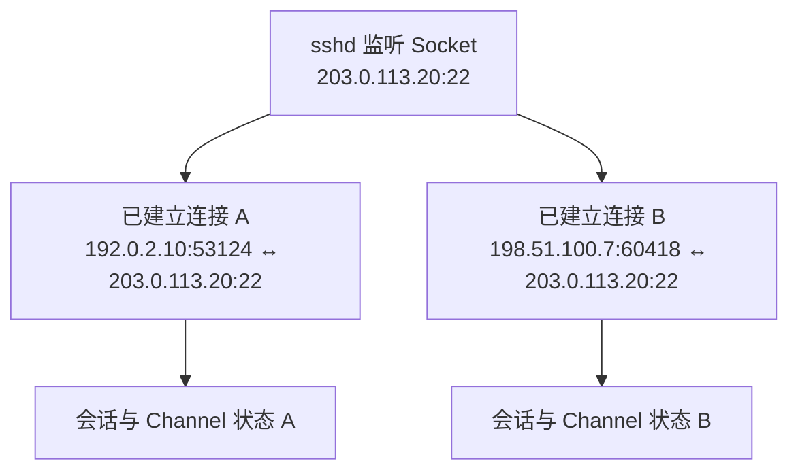
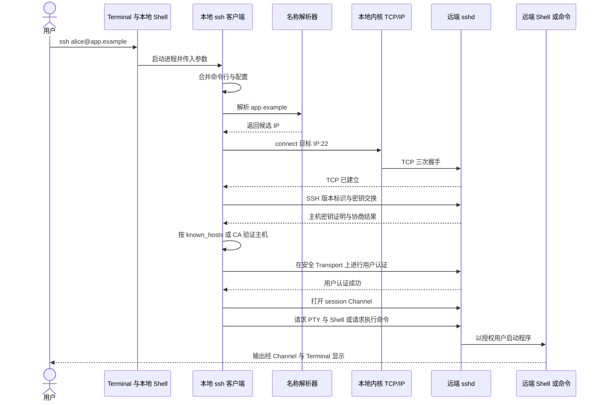
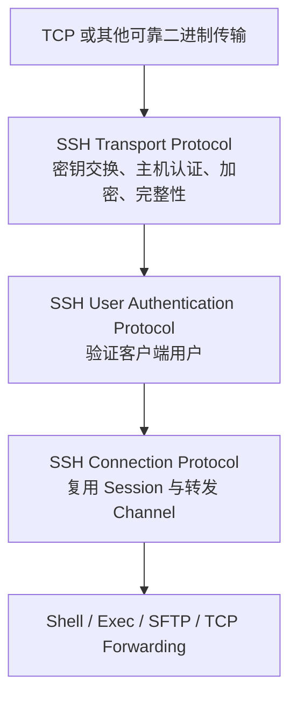
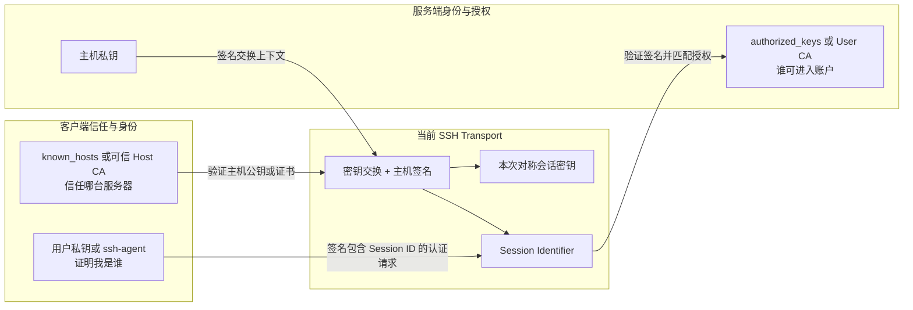
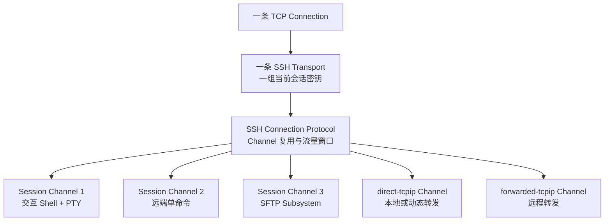
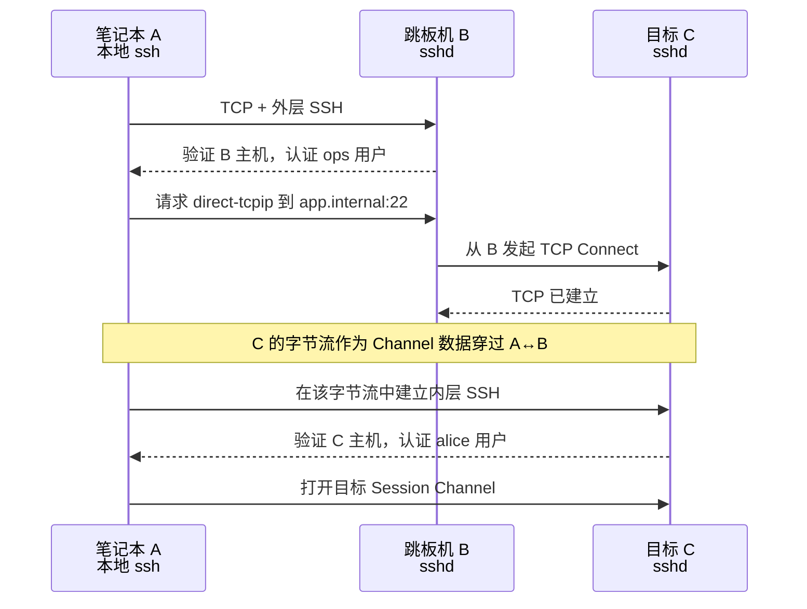
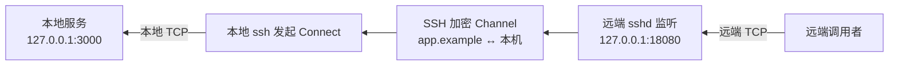
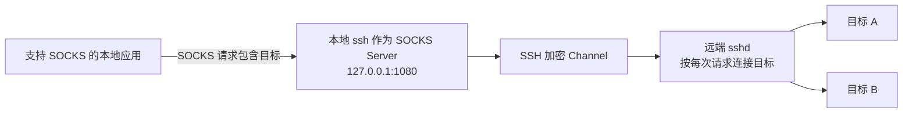
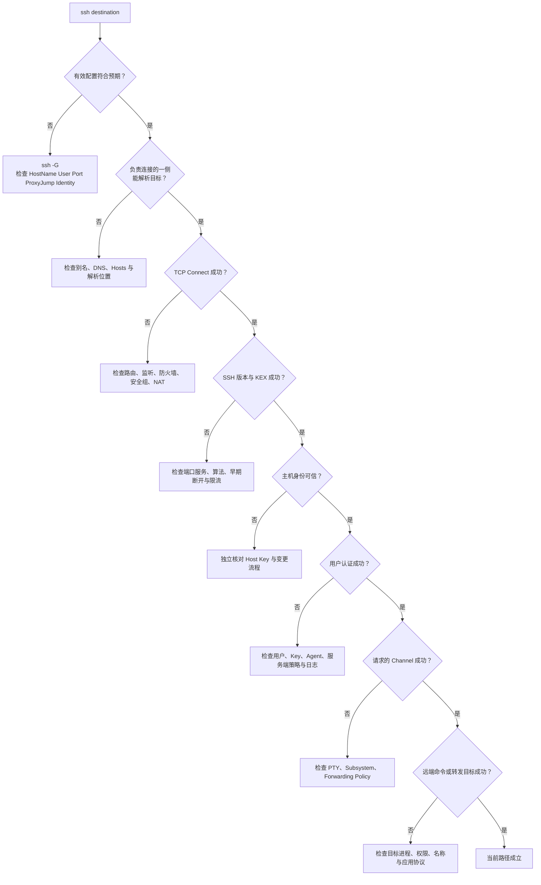

# SSH 连接：从 Socket、端口到隧道与跳板机

> 查证基线：2026-09-17。协议模型主要依据 SSH Architecture、Transport、User Authentication 与 Connection Protocol 四份 IETF RFC；实现行为以 OpenBSD-current 的 OpenSSH 手册和 OpenSSH 10.5（2026-08-11）发布资料为基线。本机只读验证使用 macOS 自带的 OpenSSH 9.7p1，因此本文会区分协议能力、上游当前行为和本机验证结果，不把三者混成一个版本结论。

很多人能够熟练复制 `ssh` 命令，却仍在按下回车前紧张。问题通常不是“少背了几个参数”，而是命令把多个独立过程压缩成了一个词：**连接**。

一次远程登录至少包含：本地 Shell 启动客户端进程、客户端解析配置和目标、操作系统建立 TCP 连接、SSH 验证服务器、服务器验证用户、双方创建加密连接，最后才在一条逻辑 Channel 中启动远端 Shell。跳板机和端口转发又会在这条路径里加入新的监听端点和 TCP 连接。

如果只记住本文的一件事，请记住这张“连接路线卡”：

```text
谁发起连接？
  → 连接到哪个地址与端口？
  → 谁在那里监听？
  → 名称在哪台机器上解析？
  → 中间建立了几段 TCP 和几层 SSH？
  → 谁验证谁的身份？
  → 哪一段字节受 SSH 保护？
```

这七个问题能解释直接登录、跳板机、`-L`、`-R`、`-D` 和大多数连接错误。本文使用 OpenSSH 作为具体实现，但核心模型来自 SSH v2 协议。

前置阅读不是必需的。需要补充网络分层时，可以参照[计算机网络分层](./network-layers-l3-l7.md)；想继续理解 TCP 的可靠字节流语义，可参照[互联网协议演进](./internet-protocol-evolution.md)；Terminal、Shell 与命令的区别见[跨平台命令行](../../operations/shell/cross-platform-command-line.md)。

## 一、终端里发生的不是“电脑连接电脑”

输入：

```bash
ssh alice@app.example
```

最先做事的不是网络，也不是远端服务器，而是当前 Shell。它把命令行解析成程序名与参数，找到 `ssh` 可执行文件并启动一个本地进程。Terminal 负责显示和按键交互；Shell 负责命令语言；`ssh` 进程才是 SSH 客户端。


图中真正跨网络流动的是字节。所谓“远程终端”是多层协作产生的体验，不是一根从键盘直通远端 Shell 的线。

| 组件 | 它真正负责什么 | 它不负责什么 |
| --- | --- | --- |
| Terminal | 收集按键、显示字符、维护窗口尺寸等终端状态 | 不执行 SSH 协议，不验证服务器 |
| 本地 Shell | 解析引号、变量和参数，启动 `ssh` 进程 | 不替 `ssh` 建立加密连接 |
| `ssh` 客户端 | 配置、主机认证、用户认证、Channel 与转发 | 不决定 Internet 中每台路由器如何转发 |
| 本地内核网络栈 | Socket、源地址、临时端口、TCP、IP 路由 | 不理解用户是否有权登录远端账户 |
| 远端 `sshd` | 监听、SSH 协议、认证、授权、启动会话或转发 | 不等于远端 Shell，也不等于被转发的数据库 |
| 远端 Shell/命令 | 解释或执行远端程序 | 不负责建立外层 SSH Transport |

OpenSSH 的 `sshd` 通常由系统启动并监听客户端连接；连接到来后由服务端进程处理密钥交换、加密、认证与命令执行。[OpenSSH `sshd(8)`](https://man.openbsd.org/sshd)

### “我现在在哪台机器上”要分三个问题

远程会话中常把三个位置混在一起：

1. **Terminal 在哪里？** 通常仍在你的笔记本上。
2. **`ssh` 客户端进程在哪里？** 直接连接和 ProxyJump 时通常也在笔记本上。
3. **当前 Shell 在哪里执行？** 登录成功后，交互 Shell 在目标主机上。

命令提示符能提供线索，却不是安全边界。更可靠的检查包括 `hostname`、`whoami`、`pwd` 和必要时的环境标识。特别是在跳板机上手动执行第二次 `ssh` 时，第一个远端 Shell 又启动了一个新的 SSH 客户端；此时“本地”一词会随观察对象改变。

## 二、IP 找主机，端口和 Socket 找进程

IP 地址让网络把 Packet 送向某个网络接口；TCP 端口帮助操作系统把到达的字节交给正确的 Socket 和进程。TCP 使用端口标识应用服务并复用不同 Flow。[RFC 9293：Transmission Control Protocol](https://www.rfc-editor.org/rfc/rfc9293)

一条常见 SSH TCP 连接可以写成：

```text
192.0.2.10:53124  →  203.0.113.20:22  / TCP
客户端地址:临时端口    服务端地址:监听端口
```

这里的 `53124` 只是示例。客户端通常让操作系统从可用的临时端口范围中选择源端口；它不是 SSH 的身份，也不需要在路由器上为每次连接手工配置。服务端的 `22` 是 SSH 注册和 OpenSSH 默认使用的端口，但管理员可以改为其他端口。[RFC 4253 第 4.1 节](https://www.rfc-editor.org/rfc/rfc4253#section-4.1)；[OpenSSH `ssh_config(5)` 的 `Port`](https://man.openbsd.org/ssh_config)

### 监听 Socket 与已建立 Socket 不是同一个东西

`sshd` 先创建监听 Socket，例如：

```text
0.0.0.0:22 LISTEN
[::]:22    LISTEN
```

当客户端连接到来时，服务端接受连接并得到一个已建立 Socket。一个监听 Socket 可以连续接受很多客户端，每条已建立连接都有自己的本地与远端端点。



### 绑定地址决定“谁有机会连”

| 监听地址 | 常见意义 | 外部机器能否连接 |
| --- | --- | --- |
| `127.0.0.1` | IPv4 Loopback，只在本机协议栈内 | 通常不能 |
| `::1` | IPv6 Loopback | 通常不能 |
| 某个具体网卡地址 | 只接受送到该地址的连接 | 取决于路由和防火墙 |
| `0.0.0.0` | IPv4 Wildcard，在所有合适 IPv4 本地地址监听 | 可能可以 |
| `::` | IPv6 Wildcard；是否同时接受 IPv4 取决于系统设置 | 可能可以 |

“监听在 `0.0.0.0`”不等于“全世界一定可达”。沿途路由、防火墙、云安全组和 NAT 仍可阻止连接。反过来，防火墙允许 TCP 22 也不等于 `sshd` 正在监听。

### NAT 改的是可见端点，不理解 SSH 身份

家庭路由器或云出口 NAT 可能把客户端源地址与源端口改写。服务端于是看到 NAT 出口，而不是客户端私网地址。SSH 用户认证不会因为 NAT 自动失效，因为它验证的是协议中的凭据；但基于源地址的防火墙规则、日志和 `authorized_keys` 的 `from=` 限制会受可见源地址影响。

## 三、直接 SSH 的完整建立顺序

把一次成功登录画成顺序，就能看到每一步依赖前一步，却提供不同证据：



### 第一步：先求出“有效配置”

OpenSSH 客户端依次读取：

1. 命令行参数；
2. 用户配置 `~/.ssh/config`；
3. 系统配置 `/etc/ssh/ssh_config`。

与很多配置系统不同，OpenSSH 对多数指令采用**首次取得的值生效**。因此更具体的 `Host` 段通常写在前面，通用 `Host *` 放在后面。[OpenSSH `ssh_config(5)`](https://man.openbsd.org/ssh_config)

`ssh -G destination` 可以输出 Host 与 Match 处理后的有效配置并退出。本文的本机验证使用 `-F /dev/null` 隔离个人配置，只确认了 `User`、`Port`、`ProxyJump`、`LocalForward` 与 `ExitOnForwardFailure` 的解析，没有连接任何主机。

### 第二步：名称解析不等于网络可达

直接连接中，客户端通常通过本机系统解析器把 `app.example` 变成一个或多个地址。成功得到地址只说明名称系统给出了答案，不说明目标路径、TCP 22 或 SSH 服务可用。

若输入的是配置别名：

```sshconfig
Host prod-app
    HostName 203.0.113.20
```

`prod-app` 是客户端配置选择器；真正连接的目标是 `HostName`。它甚至可以直接是 IP，不需要 DNS。后文会看到：使用跳板或转发时，**最终目标名称可能被送到另一台机器解析**，不能再机械地说“DNS 总在本机完成”。

### 第三步：路由和 TCP 只建立字节流

本机内核根据目标 IP 查询路由，选择出口接口、下一跳和源地址，再建立 TCP。成功完成 TCP 握手说明：在当时的网络路径与策略下，双方至少交换了建立连接所需的数据；它仍不证明主机密钥可信、用户有权限或远端 Shell 能启动。

### 第四步：SSH 在 TCP 字节流上建立自己的状态机

SSH Transport 通常运行在 TCP 上，双方先交换版本标识，再协商密钥交换、服务器主机密钥、加密和完整性算法。只有完成新的密钥启用后，后续认证与 Connection Protocol 数据才进入受保护的 SSH Transport。[RFC 4253：SSH Transport Layer Protocol](https://www.rfc-editor.org/rfc/rfc4253)

因此以下说法分别位于不同边界：

| 观察 | 最多能推出什么 |
| --- | --- |
| `ping` 有响应 | 某次 ICMP 往返成立 |
| TCP 22 Connect 成功 | 有端点接受或代理了 TCP 连接 |
| 收到 `SSH-2.0-...` 标识 | 对端表现为某个 SSH 实现或兼容服务 |
| 主机密钥验证成功 | 当前对端持有被信任主机身份对应的私钥 |
| 用户认证成功 | 服务端按当前策略接受了用户凭据 |
| Session Channel 与命令成功 | SSH Connection 还能建立所请求的远端程序 |

## 四、SSH 本身由三层协议组成

[RFC 4251](https://www.rfc-editor.org/rfc/rfc4251)把 SSH v2 分成三个主要部分：



这是一组依赖关系，不是说实现中一定有三个独立进程。

### Transport：先确认服务端，再保护通道

初始过程可以简化为：

1. TCP 建立；
2. 双方交换 `SSH-2.0-软件版本` 标识；
3. 双方发送各自支持且按偏好排序的算法集合；
4. 执行密钥交换，得到共享秘密和 Exchange Hash；
5. 服务端用主机私钥对交换结果作密码学证明；
6. 客户端把服务端公钥或证书与自己的信任资料比较；
7. 双方从密钥交换结果派生两个方向的加密与完整性密钥；
8. 启用新密钥，再进入用户认证。

初始版本标识和启用新密钥前的协商数据不是保密内容；密钥交换把协商上下文纳入认证，防止攻击者在不被发现的情况下替换关键参数。RFC 4253 定义的首次 Exchange Hash 还会成为本连接稳定的 Session Identifier，后续用户公钥签名会绑定它。[RFC 4253 第 7.2 节](https://www.rfc-editor.org/rfc/rfc4253#section-7.2)

### 算法协商不是“客户端挑一个看起来最强的”

客户端和服务端分别给出支持列表，协议按各类别的协商规则找到共同算法。当前 OpenSSH 的默认集合会随安全研究和兼容策略变化；2006 年 RFC 中的历史 Mandatory 算法不等于 2026 年应启用的默认算法。本文不复制一份很快过期的算法排行榜，需要检查本机支持项时使用：

```bash
ssh -Q kex
ssh -Q cipher
ssh -Q mac
ssh -Q key
```

上游发布记录显示当前版本为 OpenSSH 10.5；具体系统可能因发行版补丁和升级节奏停留在其他版本。[OpenSSH Release Notes](https://www.openssh.com/releasenotes.html)

### 主机密钥不是“这次连接的加密密码”

服务端主机密钥是较长期的身份密钥；密钥交换产生的会话密钥用于本次连接的数据保护。二者分工不同：

- 主机私钥让服务端证明“我持有这个主机身份”；
- 客户端必须事先知道、首次核验或通过 CA 信任对应公钥，才能把密码学证明绑定到真实主机；
- 会话密钥由本次密钥交换派生，用于高效保护数据；
- 重新密钥交换可以更新传输密钥，但首次 Session Identifier 保持稳定。

加密只能证明“数据没有被不知密钥的旁观者读懂或无痕改写”。如果用户把攻击者的主机密钥误当成目标主机，仍可能建立一条对攻击者加密得很好的连接。

### 首次连接提示是身份决策，不是欢迎弹窗

默认 `StrictHostKeyChecking ask` 会要求用户决定是否把新主机密钥加入 `known_hosts`；已知主机的密钥变化则会被拒绝。`accept-new` 可以自动接受从未见过的主机，但仍拒绝变化的主机密钥。[OpenSSH `ssh_config(5)` 的 `StrictHostKeyChecking`](https://man.openbsd.org/ssh_config)

首次信任通常被称为 Trust On First Use（TOFU）：第一次没有既有记录时，客户端无法仅凭同一条可能被攻击的网络路径确认指纹属于谁。更强的做法是通过独立渠道核对指纹，或由组织预置可信主机 CA。

## 五、把四类密钥分清，认证就不再神秘

SSH 对话中可能同时出现多种“Key”。它们不是同一个文件换了名字。

| 材料 | 通常由谁持有 | 作用 | 是否应跨网络发送私密部分 |
| --- | --- | --- | --- |
| 服务端主机私钥 | `sshd` 所在主机 | 证明服务端主机身份 | 否 |
| 服务端主机公钥/证书 | 客户端信任库、服务端 | 让客户端验证主机证明 | 可以 |
| 用户私钥 | 用户设备、安全密钥或 Agent | 为本次认证数据签名，证明用户持有私钥 | 否 |
| 用户公钥/证书 | 服务端账户或 CA 配置 | 判断哪个用户身份可被授权 | 可以 |
| 密钥交换临时材料 | 客户端与服务端进程 | 协商本次共享秘密 | 只发送协议规定的公开部分 |
| 对称会话密钥 | 双方当前 SSH Transport | 加密和保护连接数据 | 不直接发送，由交换结果派生 |



### `known_hosts` 与 `authorized_keys` 方向相反

| 文件 | 谁读取 | 保存什么 | 回答的问题 |
| --- | --- | --- | --- |
| 客户端 `~/.ssh/known_hosts` | `ssh` 客户端 | 主机名/地址到主机公钥或 CA 的信任关系 | “我连到的服务器是不是预期那台？” |
| 服务端用户的 `~/.ssh/authorized_keys` | `sshd` | 可进入该账户的用户公钥及限制 | “这个客户端身份能否成为该远端用户？” |

一个文件防止你把密码或会话交给错误服务器，另一个文件决定谁能进入远端账户。只配置 `authorized_keys` 并不能替代主机身份验证。

### 公钥认证发送的是签名，不是私钥

[RFC 4252 第 7 节](https://www.rfc-editor.org/rfc/rfc4252#section-7)定义了 `publickey` 方法。客户端可以先询问某个公钥是否可能被接受，再发送包含签名的认证请求。签名覆盖 Session Identifier、用户名、服务名、算法和公钥等数据：

1. 服务端检查该公钥是否被授权用于目标账户；
2. 服务端验证签名；
3. 因签名绑定当前 Session Identifier，旧连接中截获的签名不能直接当作新连接的证明；
4. 私钥始终留在客户端文件、安全硬件或 Agent 中。

“免密登录”是容易误导的叫法。更准确的是：**服务器不再要求账户密码，而是要求客户端证明持有被授权私钥**。私钥文件本身仍可由 Passphrase 加密，用户也可能需要解锁 Agent 或硬件密钥。

### 密码认证也发生在主机认证之后

密码认证会把密码放入已经建立的 SSH 安全 Transport 交给服务端验证；它不是把密码以明文直接放进 TCP。可是如果用户错误接受了攻击者的主机密钥，密码仍可能被错误服务器获得。这正是“先验证服务器，再向服务器证明用户身份”的顺序不能颠倒的原因。[RFC 4252：SSH Authentication Protocol](https://www.rfc-editor.org/rfc/rfc4252)

### `ssh-agent` 是签名服务，不是把私钥复制到每台机器

`ssh-agent` 是本地进程，通过 Unix Domain Socket 接收签名请求并持有用于公钥认证的私钥。客户端借助 `SSH_AUTH_SOCK` 找到它。[OpenSSH `ssh-agent(1)`](https://man.openbsd.org/ssh-agent)

Agent Forwarding 会让远端进程通过转发 Socket 请求本地 Agent 做签名。主机拿不到可直接导出的私钥材料，却可能在 Agent 可用期间借你的身份发起认证。OpenSSH 因此明确建议谨慎使用 Agent Forwarding，并指出 ProxyJump 往往是更安全的替代路径。[OpenSSH `ssh(1)` 的 `-A`](https://man.openbsd.org/ssh)

### SSH Certificate 不是 HTTPS Certificate

OpenSSH 可以让客户端或服务端只信任一个 CA 公钥，再验证由它签名的用户或主机证书。这适合集中管理身份和有效期，但 OpenSSH Certificate 使用自己的简化格式，不是 Web PKI 常见的 X.509 Certificate。[OpenSSH `ssh-keygen(1)` 的 Certificates](https://man.openbsd.org/ssh-keygen)

## 六、登录成功后：一条 Connection 里可以有很多 Channel

用户认证成功，并不等于 SSH 只剩下一根“终端线”。SSH Connection Protocol 会在同一条受保护 Transport 上复用多个逻辑 Channel。[RFC 4254](https://www.rfc-editor.org/rfc/rfc4254)把交互会话、命令执行、TCP 转发和 X11 转发都建模为 Channel 或 Channel 上的请求。



Channel 各有编号、窗口和生命周期。一个 Channel 被关闭，不必立即关闭整个 SSH Connection；反过来，底层 TCP 或 SSH Transport 断开会使其上的所有 Channel 一起失效。

### Session、PTY 与 Shell 是三个概念

[RFC 4254 第 6 节](https://www.rfc-editor.org/rfc/rfc4254#section-6)把 Session 定义为一次远程程序执行。程序可以是 Shell、系统命令、应用或 Subsystem；它可以申请 PTY，也可以不申请。

| 调用 | Session Channel | PTY | 远端程序 |
| --- | --- | --- | --- |
| `ssh host` | 有 | 交互时通常申请 | 登录 Shell |
| `ssh host uptime` | 有 | 默认通常不申请 | 由远端用户 Shell 执行命令 |
| `ssh -t host command` | 有 | 强制申请 | 命令 |
| `ssh -T host command` | 有 | 不申请 | 命令 |
| `sftp host` | 有 | 不需要 | SFTP Subsystem |
| `ssh -N -L ... host` | 不请求远端命令 Session | 不需要 | 只维持转发 |

PTY（Pseudo-Terminal）为交互程序提供终端语义，例如窗口尺寸、行规程、信号和 `TERM`。它不是加密层，也不是 Shell。没有 PTY 的 Channel 更接近透明字节流，适合脚本、二进制数据或只做转发。

### 本地 Shell 与远端 Shell 都可能解析字符

```bash
ssh app.example "printf '%s\n' \"$HOME\""
```

这类命令可能先被本地 Shell 处理引号和变量，再由 `ssh` 把剩余命令字符串交给远端，最后由远端用户 Shell 以 `-c` 方式执行。究竟在哪一端展开 `$HOME` 取决于本地引用方式。连接问题与命令引用问题应分开诊断：前者决定能否建立 Session，后者决定远端实际执行什么。

### Connection Multiplexing 再加一层复用

`ControlMaster` 可以让一个本地 Master `ssh` 进程在 Control Socket 上监听，后续客户端进程通过它复用已有网络连接，而不是重新完成 TCP、主机认证和用户认证。OpenSSH 明确把它描述为“多个 Session 共享一条 Network Connection”。[OpenSSH `ssh_config(5)` 的 `ControlMaster`](https://man.openbsd.org/ssh_config)

这解释了两个看似奇怪的现象：

- 新开终端后 SSH 几乎瞬间进入远端，因为它复用了既有 Master；
- 密钥、网络或策略刚改变，新的命令仍沿用旧 Connection 的状态。

可用 `ssh -O check alias` 检查 Master，必要时用 `ssh -O exit alias` 请求它退出。不要在不可信目录创建 Control Socket；能访问它的本地主体可能借用现有连接请求新 Channel。

## 七、跳板机：两段可达性，通常是两层 SSH

假设：

```text
笔记本 A  ──可达──>  跳板机 B  ──可达──>  内网目标 C
笔记本 A  ──不可直达────────────────────>  C
```

跳板机并不是把 A 的网卡“搬进内网”。它利用 B 同时具备的两种可达性：A 能到 B，B 能到 C。

### ProxyJump 的真实路径

```bash
ssh -J ops@bastion.example alice@app.internal
```

OpenSSH 把 `-J` 定义为 `ProxyJump` 的快捷形式：先建立到跳板机的 SSH 连接，再从跳板机建立到最终目标的 TCP 转发。[OpenSSH `ssh(1)` 的 `-J`](https://man.openbsd.org/ssh)；[OpenSSH `ssh_config(5)` 的 `ProxyJump`](https://man.openbsd.org/ssh_config)



这里有两套独立信任关系：

| 连接 | 主机身份 | 用户身份 | 网络来源 |
| --- | --- | --- | --- |
| A → B | A 验证 B 的 Host Key | B 验证 `ops` | B 看到 A 或其 NAT 地址 |
| A → C，经 B 转发 | A 验证 C 的 Host Key | C 验证 `alice` | C 通常看到来源是 B |

目标 C 的 SSH 握手仍由 A 上的客户端完成。B 负责转交内层 SSH 字节流，能够看到连接时间、目标地址、流量大小并能中断或篡改字节，但在 A 正确验证 C 的 Host Key 时，B 不能直接解密内层 Session 内容。若用户忽略 C 的主机密钥异常，B 或其他中间人仍可能诱导客户端连到错误目标。

### 最终目标名称通常从跳板一侧用于连接

ProxyJump 请求 B 打开到最终 `host:port` 的 TCP 转发。若目标是 `app.internal` 这类只有内网 DNS 能解析的名称，B 所在网络通常负责为实际 Connect 解析它；这正是 ProxyJump 能访问内网名称的常见原因。客户端仍在本地处理目标的 SSH 配置、Host Key 数据库与用户认证。

这个结论有边界：`CanonicalizeHostname`、自定义 `ProxyCommand`、显式 IP、多级跳板和本地名称重写都可能改变名称传递方式。排障时不要只问“DNS 正常吗”，而要问“**是哪台机器需要解析哪个名字**”。

### ProxyJump 与“登录 B 后再执行 ssh C”不同

```text
模式一：A 上的 ssh 通过 B 转发，直接与 C 建立内层 SSH
模式二：A 登录 B 的 Shell，再由 B 上的新 ssh 进程登录 C
```

| 维度 | ProxyJump | 在 B 的 Shell 中执行第二次 `ssh` |
| --- | --- | --- |
| 最终 SSH 客户端 | A 上 | B 上 |
| C 的 Host Key 信任库 | 通常在 A | 在 B |
| C 的用户私钥 | 可留在 A | 需存在 B、使用 Agent Forwarding 或另行提供 |
| B 能否接触目标会话明文 | 正确端到端验证时不能直接解密内层 SSH | B 承载客户端进程与终端数据，信任面更大 |
| 操作体验 | 一条本地命令与本地配置 | 先进入 B，再操作第二个客户端 |

因此，为了访问 C 而把用户私钥复制到 B 通常没有必要。ProxyJump 可以让私钥和目标 Host Key 判断都留在 A。

### 多级跳板只是重复相同模型

```bash
ssh -J edge.example,ops@middle.internal alice@app.deep.internal
```

每一级必须能到达下一级。不能把“从 A 看得到的域名”和“从上一跳看得到的地址”混为一谈。多跳失败时，从最外层开始确认：A→第一跳、第一跳→第二跳、最后一跳→目标；每段都分别检查名称、路由、监听与身份。

## 八、用一个模型理解 `-L`、`-R` 与 `-D`

普通 SSH TCP 转发没有把一个端口从机器上剪下来再贴到另一台机器。它反复执行同一个机制：

```text
某处创建监听 Socket
  → 接受一条 TCP 连接
  → 为它创建 SSH Channel
  → 在 SSH 另一端发起新的 TCP 连接
  → 双向复制字节
```

所以一次转发通常包含至少两段独立 TCP：应用到监听端口，以及 SSH 另一端到最终目标；中间由 SSH Channel 承载。

### 8.1 本地转发 `-L`：本地监听，远端连接目标

```bash
ssh -N -T \
  -L 127.0.0.1:15432:db.internal:5432 \
  alice@app.example
```

从左到右读：

```text
本机 127.0.0.1:15432 监听
  → 经 alice@app.example 这条 SSH
  → 由 app.example 一侧连接 db.internal:5432
```


应用以为自己在访问本机 `15432`。`ssh` 接受连接后，发送 `direct-tcpip` Channel 请求，其中包含目标 Host 与 Port；服务端从远端一侧建立到数据库的新连接。[RFC 4254 第 7.2 节](https://www.rfc-editor.org/rfc/rfc4254#section-7.2)；[OpenSSH `ssh(1)` 的 `-L`](https://man.openbsd.org/ssh)

关键推论：

- `db.internal` 通常由 SSH 服务端一侧解析和访问；
- `-L ...:localhost:5432` 中的目标 `localhost` 指 **SSH 服务端所在机器**；
- 本地应用到 `127.0.0.1:15432` 这一小段不经过外部网络；
- SSH 只保护本机到 `app.example`；`app.example` 到数据库是否另行加密取决于数据库协议。

### 8.2 远程转发 `-R`：远端监听，本地连接目标

```bash
ssh -N -T \
  -R 127.0.0.1:18080:127.0.0.1:3000 \
  alice@app.example
```

从左到右读：

```text
app.example 上的 127.0.0.1:18080 监听
  → 经 SSH 回到本机
  → 由本机连接 127.0.0.1:3000
```



远端监听接到连接后，服务端打开 `forwarded-tcpip` Channel；本地客户端再连接显式目标。[RFC 4254 第 7.2 节](https://www.rfc-editor.org/rfc/rfc4254#section-7.2)；[OpenSSH `ssh(1)` 的 `-R`](https://man.openbsd.org/ssh)

关键推论：

- 目标 `127.0.0.1:3000` 指 **客户端本机**；
- 默认情况下，OpenSSH 服务端把 Remote Forward 绑定到 Loopback；
- 要让其他机器访问远端转发端口，需要请求非 Loopback 地址，并且服务端 `GatewayPorts` 必须允许；
- “反向”描述的是监听和后续连接方向，不表示 TCP 可以无视防火墙从外网直接进入本机。

`GatewayPorts no` 是当前上游服务端默认值；它会把 Remote Forward 限制在远端 Loopback。`clientspecified` 才允许客户端选择非 Loopback 地址。[OpenSSH `sshd_config(5)` 的 `GatewayPorts`](https://man.openbsd.org/sshd_config)

### 8.3 动态转发 `-D`：本地监听 SOCKS，请求决定目标

```bash
ssh -N -T -D 127.0.0.1:1080 alice@app.example
```



`-D` 没有把固定目标写进命令。`ssh` 在本地充当 SOCKS4/5 Server，应用在每次连接时告诉它目标；远端一侧再连接该目标。[OpenSSH `ssh(1)` 的 `-D`](https://man.openbsd.org/ssh)

SOCKS5 请求可以携带 IP 地址，也可以携带 Domain Name。[RFC 1928：SOCKS Protocol Version 5](https://www.rfc-editor.org/rfc/rfc1928)因此 DNS 位置取决于应用行为：

- 应用先在本地解析并把 IP 放入 SOCKS 请求，DNS 已发生在本地；
- 应用把域名放进 SOCKS 请求，代理端才有机会从远端网络解析。

所以“用了 `-D`，DNS 一定走隧道”并不成立。还必须检查应用的 SOCKS 配置方式。

### 三种转发放在同一张表里

| 模式 | 监听在哪里 | 谁连接最终目标 | 目标名称通常在哪里解析 | 典型用途 |
| --- | --- | --- | --- | --- |
| `-L` Local Forward | 客户端侧 | SSH 服务端侧 | 服务端侧 | 本地访问远端/内网服务 |
| `-R` Remote Forward | SSH 服务端侧 | 客户端侧 | 客户端侧 | 远端访问客户端一侧服务 |
| `-D` Dynamic Forward | 客户端侧 | SSH 服务端侧 | 取决于 SOCKS 请求携带 IP 还是域名 | 让支持 SOCKS 的应用动态选目标 |

### 一个最容易犯错的词：`localhost`

`localhost` 永远是**执行那次 Connect 的机器自己**，不是“我的笔记本”的同义词。

| 写法 | 哪台机器解释目标 `localhost` |
| --- | --- |
| `-L 15432:localhost:5432 server` | `server` 一侧 |
| `-R 18080:localhost:3000 server` | 客户端一侧 |
| 直接在远端 Shell 执行 `curl localhost:8080` | 远端 Shell 所在主机 |

### 监听成功不等于最终目标可用

`ExitOnForwardFailure yes` 会让 `ssh` 在无法建立所请求的监听或转发设施时退出，例如端口已经占用。但 OpenSSH 明确说明，它**不检查未来经转发发起的连接能否抵达最终目标**。[OpenSSH `ssh_config(5)` 的 `ExitOnForwardFailure`](https://man.openbsd.org/ssh_config)

于是以下状态完全可能同时成立：

```text
本地 15432 已成功监听
SSH Connection 正常
但远端无法解析 db.internal，或 db.internal:5432 拒绝连接
```

故障只有在应用真正连接本地监听端口、SSH 尝试打开 Channel 时才出现。

### 每条应用连接通常对应一条新 Channel

监听端口不是只能服务一次。每当新的应用 TCP 连接到来，OpenSSH 通常在同一条 SSH Connection 上打开新的转发 Channel。SSH Connection 的带宽、延迟、拥塞和断线会影响其上所有 Channel，但每个 Channel 仍有独立的打开结果与流量窗口。

## 九、Tunnel、Proxy、NAT 与 VPN 不是同义词

“隧道”只说明一种封装关系：某类数据被另一条通信路径承载。它没有自动回答工作层次、地址空间、加密端点和访问控制。

| 机制 | 主要处理单位 | 应用是否需要感知 | 默认是否加密 | 关键边界 |
| --- | --- | --- | --- | --- |
| SSH `-L` / `-R` | 固定目标的 TCP 连接 | 应用只需连接转发端口 | SSH 两端之间加密 | SSH 端点到最终目标可能是另一段明文 TCP |
| SSH `-D` / SOCKS | 应用指定的 TCP 目标 | 应用需支持或配置 SOCKS | SSH 两端之间加密 | DNS 位置取决于 SOCKS 请求 |
| HTTP Proxy | HTTP 请求或 CONNECT Tunnel | 应用需配置 Proxy | 取决于客户端到 Proxy、CONNECT 内层协议 | Proxy 常能看到目标与部分应用语义 |
| Reverse Proxy | 服务入口与 Upstream 请求 | 客户端通常只知道入口 | 取决于每一段 TLS | 常形成客户端→Proxy、Proxy→Upstream 两段连接 |
| NAT/NAPT | IP 与端口映射 | 多数应用不显式感知 | 否 | 改写可见地址，不提供应用身份认证 |
| VPN | IP Packet、路由或虚拟接口 | 多数应用不逐个配置 | 取决于 VPN 协议 | 改变可达网段与路由范围 |

普通 `-L`、`-R`、`-D` 是 TCP/Application-Level Forwarding，不会自动接管整台机器的路由，也不能透明承载任意 UDP。OpenSSH 另有 `-w` 请求 TUN Device Forwarding，但它需要系统虚拟接口、权限、服务端 `PermitTunnel` 和额外路由配置；这已经是不同部署模型，不能拿来解释普通端口转发。[OpenSSH `ssh(1)` 的 `-w`](https://man.openbsd.org/ssh)

### 加密覆盖范围必须画到真正端点

以 `-L 15432:db.internal:5432 app.example` 为例：

```text
本地应用 ─本地 TCP─> 本地 ssh
          本机边界

本地 ssh ═══ SSH 加密 Transport ═══> app.example:sshd

app.example:sshd ─普通 TCP 或数据库 TLS─> db.internal:5432
```

SSH Tunnel 保护中间一段，不替数据库协议承诺端到端身份与加密。若 `app.example` 或它到数据库的网络不可信，仍应启用数据库自身 TLS 并验证数据库身份。

## 十、把路径写进可审阅的 SSH 配置

当命令包含用户、私钥、跳板和转发时，把稳定关系写入 `~/.ssh/config` 比依赖 Shell History 更容易审阅：

```sshconfig
Host prod-bastion
    HostName bastion.example
    User ops
    Port 22
    IdentityFile ~/.ssh/id_ed25519_ops
    IdentitiesOnly yes

Host prod-app
    HostName app.internal
    User deploy
    Port 22
    IdentityFile ~/.ssh/id_ed25519_prod
    IdentitiesOnly yes
    ProxyJump prod-bastion
    ServerAliveInterval 30
    ServerAliveCountMax 3

Host *
    StrictHostKeyChecking ask
```

之后：

```bash
ssh prod-app
```

### `Host` 是匹配名，`HostName` 是连接目标

`Host prod-app` 定义本地别名和匹配范围；`HostName app.internal` 才是实际目标。Host Key 查找、Control Path Token、日志和代理参数还可能使用原始名、替换后名称或 `HostKeyAlias`，因此复杂配置应通过 `ssh -G prod-app` 查看有效值，不靠肉眼猜测。

### “首次取得的值生效”决定配置顺序

```sshconfig
Host prod-app
    User deploy

Host *
    User default-user
```

连接 `prod-app` 时，`User deploy` 先被取得，后面的默认值不会覆盖它。`IdentityFile` 等少数指令可以累加多个值，不能把“首次值生效”机械推广到所有选项。以当前 `ssh_config(5)` 的具体条目为准。[OpenSSH `ssh_config(5)`](https://man.openbsd.org/ssh_config)

### `IdentitiesOnly` 控制“实际拿哪些身份去试”

即使写了 `IdentityFile`，默认情况下客户端仍可能使用 Agent 提供的其他身份。`IdentitiesOnly yes` 要求只使用已配置的 Identity/Certificate 范围，适合 Agent 中有很多 Key、不同环境必须严格分离身份的场景。[OpenSSH `ssh_config(5)` 的 `IdentitiesOnly`](https://man.openbsd.org/ssh_config)

它也解释了 `Too many authentication failures` 的一种常见来源：服务端在客户端试到正确 Key 之前，就因前面过多失败尝试而断开。

### Alive Message 是故障探测，不是让网络永远不断

`ServerAliveInterval` 会在一段时间没有收到服务端数据后，通过加密 Channel 请求响应；`ServerAliveCountMax` 控制连续无响应多少次后断开。它比 TCP Keepalive 更接近 SSH 协议端到端探测，但不能修复 Wi-Fi 中断、NAT 策略或服务端崩溃。[OpenSSH `ssh_config(5)` 的 `ServerAliveInterval`](https://man.openbsd.org/ssh_config)

### 转发专用连接显式写出意图

```bash
ssh -N -T \
  -o ExitOnForwardFailure=yes \
  -L 127.0.0.1:15432:db.internal:5432 \
  prod-app
```

- `-N`：不请求远端命令；
- `-T`：不申请 PTY；
- 显式 `127.0.0.1`：不把监听意外暴露给局域网；
- `ExitOnForwardFailure=yes`：初始监听建不起来就失败；
- 它仍不证明 `db.internal:5432` 在未来每次连接时可达。

## 十一、从错误反推状态机停在哪里

不要一看到失败就换 Key、改防火墙或重启服务器。先确定连接已经走到哪一层：



### 先确认有效配置，而不是先猜网络

```bash
ssh -G prod-app
```

重点看：

- `hostname`：最终目标名；
- `user` 与 `port`；
- `proxyjump` 或 `proxycommand`；
- `identityfile` 与 `identitiesonly`；
- `localforward`、`remoteforward`、`dynamicforward`；
- `canonicalizehostname` 和 `hostkeyalias`。

`ssh -G` 不建立网络连接，但会读取配置。输出可能包含本地用户名、路径和内部主机名，分享诊断日志前需要脱敏。

### 再让 `-vvv` 告诉你走到了哪个阶段

```bash
ssh -vvv prod-app
```

Verbose Log 常能看到：

1. 读取了哪些配置；
2. 最终连接哪个地址和端口；
3. 是否经过 ProxyJump；
4. TCP 何时建立；
5. KEX 与 Host Key 类型；
6. 查找了哪些 `known_hosts`；
7. 提供了哪些用户身份；
8. 服务端接受或拒绝了什么；
9. Channel 在哪里打开失败。

`-vvv` 仍不是 Packet Capture，也不会自动给出服务端拒绝策略的全部原因。它还可能暴露主机名、用户名、路径、指纹和网络拓扑，不应原样发布到公开 Issue。

### 常见错误不是根因名称，而是失败边界

| 症状或日志 | 已知停在哪一带 | 常见方向 | 不能直接推出 |
| --- | --- | --- | --- |
| `Could not resolve hostname` | 名称解析前后 | 拼写、`HostName`、DNS、解析位置 | 服务器宕机 |
| `Network is unreachable` / `No route to host` | 本地或当前跳点 L3 | 路由、接口、网关、策略 | SSH Key 错误 |
| `Connection timed out` | TCP 未在期限内完成 | Silent Drop、路径黑洞、安全组、目标过载 | 目标一定没开机 |
| `Connection refused` | 已抵达能主动拒绝的端点 | 无进程监听、端口错、Firewall Reject | DNS 一定正确指向预期主机 |
| `kex_exchange_identification` 后断开 | TCP 已到达，SSH 早期阶段失败 | 端口不是 SSH、服务端限流、Banner 前关闭 | 用户公钥一定有问题 |
| `REMOTE HOST IDENTIFICATION HAS CHANGED` | 对端提供的 Host Key 与信任记录冲突 | 合法轮换、重装、复用 IP 或 MITM | 可以安全删除记录后重试 |
| `Permission denied (publickey)` | SSH Transport 与主机认证通常已完成 | 用户名、授权 Key、签名、文件权限、策略 | 网络不通 |
| `Too many authentication failures` | 用户认证中 | Agent 身份过多、正确 Key 尚未尝试 | 所有 Key 都无效 |
| `administratively prohibited` | SSH 已建立，Channel 被策略拒绝 | `AllowTcpForwarding`、`PermitOpen`、Key 限制 | TCP 22 不通 |
| `open failed: connect failed` | 转发 Channel 已请求，另一端 Connect 失败 | 目标名、目标端口、路由或 Listener | SSH Tunnel 本身必然断开 |
| `remote port forwarding failed` | `-R` 的远端监听未建立 | 端口占用、权限、`GatewayPorts`、`PermitListen` | 本地目标服务异常 |
| `Broken pipe` | 既有连接不再正常传输 | 网络切换、NAT Idle Timeout、对端退出 | 最初认证失败 |

同一文案可能由不同版本、代理层或系统错误映射产生。表格用于定位下一份证据，不用于跳过验证直接下结论。

### 每个工具只证明一个边界

| 问题 | Linux 常用证据 | macOS 常用证据 | 能证明什么 |
| --- | --- | --- | --- |
| 名称得到什么地址 | `getent ahosts name`、`dig` | `dscacheutil -q host -a name name`、`dig` | 当前查询路径的解析结果 |
| 本机怎样选路 | `ip route get IP` | `route -n get IP` | 当前主机的出口、网关与源地址选择 |
| TCP 端口能否建立 | `nc -vz host 22` | `nc -vz host 22` | 到指定地址/端口的一次 TCP 行为 |
| 谁在本机监听 | `ss -lntp` | `lsof -nP -iTCP -sTCP:LISTEN` | 本机 Socket 与进程的部分映射 |
| SSH 有效配置 | `ssh -G alias` | `ssh -G alias` | 客户端配置求值，不验证网络 |
| SSH 阶段 | `ssh -vvv alias` | `ssh -vvv alias` | 客户端观察到的协议推进与失败 |
| 已记录的 Host Key | `ssh-keygen -F host` | `ssh-keygen -F host` | 本地信任库匹配，不证明当前远端身份 |
| 服务端为何拒绝 | `journalctl -u ssh`、`journalctl -u sshd` 或发行版日志 | 取决于服务端系统 | 服务端策略、认证与进程证据 |

通过跳板或转发时，网络工具必须在真正执行 Connect 的位置运行。例如 `-L` 的最终数据库可达性应从 SSH 服务端网络视角验证；只在笔记本上 `nc db.internal 5432` 可能测试了完全不同的路径。

### 不要用关闭身份验证来“验证网络”

以下做法会把定位问题变成安全问题：

- 遇到 Host Key 变化就直接删除 `known_hosts` 记录；
- 用 `StrictHostKeyChecking no` 掩盖主机身份冲突；
- 把私钥复制到跳板机以绕过配置问题；
- 为了让 `-R` 可用就把监听改成 `0.0.0.0`；
- 把所有防火墙规则临时放开，却没有记录原状态和暴露范围。

更稳妥的方法是保留失败现场，沿状态机收集最小证据，再修改真正阻塞的边界。

## 十二、安全的本质是控制信任与暴露范围

SSH 的加密很重要，但日常风险往往来自**信任了错误身份、把监听暴露得太宽、或让一把 Key 获得了远超任务所需的能力**。

### Host Key 变化需要解释，不需要条件反射

出现 Host Key 冲突时，至少存在几类可能：

- 管理员合法轮换了主机密钥；
- 服务器重装或被替换；
- 同一域名/IP 现在指向不同机器；
- `known_hosts` 中的名称、端口或别名映射变化；
- 连接被中间人劫持。

正确顺序是：暂停发送密码和敏感命令，通过控制台、管理员、配置管理系统或其他独立可信渠道获得新指纹；解释变更后，再精确更新对应记录。`ssh-keygen -R` 是编辑工具，不是判断“新 Key 是否可信”的证据。

### 私钥文件、Passphrase 与 Agent 保护不同故障

| 控制 | 主要降低什么风险 | 不自动解决什么 |
| --- | --- | --- |
| 私钥文件权限 | 其他本地普通用户直接读取文件 | 当前用户进程或恶意软件滥用 |
| 私钥 Passphrase | 私钥文件被复制后的离线使用 | Key 已加载到 Agent 时的在线签名请求 |
| `ssh-agent` | 减少反复读取和解锁私钥，提供签名接口 | 访问 Agent Socket 的恶意进程请求签名 |
| 硬件安全密钥 | 降低私钥可导出风险，可要求触摸/PIN | 用户确认错误目标或会话权限过宽 |
| Key 有效期/撤销 | 缩短泄漏身份长期有效窗口 | 已建立连接自动立即消失 |

### Agent Forwarding 扩大的是“可请求签名”的边界

Agent Forwarding 不把私钥文件复制给远端，但能访问转发 Agent Socket 的远端高权限主体，可能借 Agent 对新的认证请求签名。OpenSSH 10.5 甚至修复了一项与 Forwarded Agent Session Binding 和 Agent Locking 交互有关的安全问题，说明这不是只有理论意义的边界。[OpenSSH 10.5 Release Notes](https://www.openssh.com/releasenotes.html)

优先选择：

1. 用 ProxyJump 让最终 SSH 客户端和私钥留在本机；
2. 为不同目标使用范围受限的 Key；
3. 确需 Agent Forwarding 时限制目标、时间和跳板信任面；
4. 不把 `ForwardAgent yes` 作为全局默认。

### 显式 Loopback Bind 是低成本安全习惯

比较：

```bash
ssh -L 127.0.0.1:15432:db.internal:5432 prod-app
ssh -L 0.0.0.0:15432:db.internal:5432 prod-app
```

第一条只为本机应用提供入口；第二条可能让同网段乃至更大范围的其他机器，通过你的 SSH 身份访问数据库。能否真正访问还取决于本机防火墙和路由，但不应把它们当作弥补模糊 Bind 的理由。

Remote Forward 更需注意：服务端默认 `GatewayPorts no` 是限制，不是故障。若确实要对外暴露，应明确谁要访问、绑定哪个地址、远端防火墙如何限制，以及转发进程退出后如何确认监听已经消失。

### 一把能登录 Shell 的 Key 往往也能自建转发器

服务端可用：

- `AllowTcpForwarding` 区分 Local、Remote 或全部转发；
- `PermitOpen` 限制 Local Forward 可连接的目标；
- `PermitListen` 限制 Remote Forward 可监听的地址与端口；
- `DisableForwarding` 一次关闭 TCP、Agent、X11 与 StreamLocal Forwarding；
- `authorized_keys` 的 `restrict`、`command=`、`from=`、`permitopen=`、`permitlisten=` 让某一把 Key 权限更小。

[OpenSSH `sshd_config(5)`](https://man.openbsd.org/sshd_config)同时提醒：若用户仍拥有任意 Shell 执行能力，仅禁止内建 TCP Forwarding 并不能阻止其运行自己的转发程序。真正的最小权限需要把登录能力、可执行命令、文件访问和网络出口一起设计。

### “只允许备份”应写成能力约束

示意配置：

```text
restrict,command="/usr/local/bin/receive-backup" ssh-ed25519 AAAA...
```

当前 OpenSSH 的 `restrict` 会关闭端口、Agent、X11 Forwarding、PTY 和用户 RC；管理员再按需要显式开放少量能力。[OpenSSH `sshd(8)` 的 Authorized Keys Format](https://man.openbsd.org/sshd)

这不是可直接复制的生产配置：备份程序本身、参数处理、文件权限、日志、来源限制和 Key 轮换仍需独立审计。它表达的原则是：**Key 不是只有“有效/无效”，还应绑定允许做什么**。

### Root、密码和算法没有脱离环境的单一答案

“换端口就安全”“只要禁用密码就安全”“某个算法永远最好”都把多维风险压成一句口号。

- 改默认端口可减少噪声扫描，不替代认证和限流；
- 公钥认证降低口令猜测风险，但私钥保护和撤销仍是问题；
- 密码配合强主机验证、MFA 与限流可以属于某些受控方案；
- 直接 Root 登录扩大一次认证成功后的权限，应结合最小权限、审计和运维恢复方式决定；
- 算法默认值会演化，应优先升级实现并遵循当前策略，不从旧教程永久启用遗留算法。

## 十三、用同一张路线卡推演四个真实场景

### Case 1：笔记本直接登录公网 Linux

```bash
ssh -p 22 deploy@server.example
```

| 问题 | 本场景答案 |
| --- | --- |
| 谁发起连接 | 笔记本上的 `ssh` 进程 |
| 谁解析名称 | 笔记本系统解析器 |
| 谁监听 | `server.example` 对应主机的 `sshd`，TCP 22 |
| 有几段主要 TCP | 笔记本到服务器一段；NAT 可改写可见端点 |
| 谁验证谁 | 客户端验证服务器 Host Key；服务器验证 `deploy` |
| SSH 保护哪段 | 客户端到服务器 `sshd` |
| Shell 在哪里 | 服务器上，以 `deploy` 权限运行 |

如果 TCP 22 通但 Host Key 不匹配，网络层已经不是首要问题；如果用户认证成功但启动 Shell 失败，应查看账户状态、Shell、PTY/Command Policy 和服务端日志。

### Case 2：通过跳板机登录内网主机

```bash
ssh -J ops@bastion.example deploy@app.internal
```

| 问题 | 本场景答案 |
| --- | --- |
| 外层连接 | 笔记本 → `bastion.example:sshd` |
| 到目标的 TCP | 跳板机 → `app.internal:22` |
| 内层 SSH | 笔记本 SSH 客户端 ↔ `app.internal:sshd` |
| 目标名解析 | 默认转发路径中通常由跳板侧网络完成最终 Connect |
| 身份 | 分别验证 Bastion Host/User 与 Target Host/User |
| 目标看到的网络来源 | 通常是跳板机 |
| 是否需要 Agent Forwarding | 不需要 |

若外层成功、内层超时，应该从 Bastion 到 Target 的名称、路由、Firewall 和 Listener 入手，而不是重装笔记本的 Key。

### Case 3：从本机访问内网数据库

```bash
ssh -N -T \
  -o ExitOnForwardFailure=yes \
  -L 127.0.0.1:15432:db.internal:5432 \
  prod-app
```

应用连接：

```text
127.0.0.1:15432
```

完整路径：

```text
本地数据库客户端
  → 本地 ssh 监听 127.0.0.1:15432
  → SSH 到 prod-app
  → prod-app 一侧解析并连接 db.internal:5432
  → 数据库
```

若命令启动成功但数据库客户端失败，依次分辨：

1. 本地应用是否真的连接 `127.0.0.1:15432`；
2. 本地监听是否仍存在；
3. SSH 是否仍在线；
4. 服务端是否允许 `direct-tcpip`；
5. 服务端网络能否解析并连接 `db.internal:5432`；
6. 数据库协议、TLS 和账户是否接受连接。

### Case 4：让远端临时访问本机开发服务

本机开发服务仅监听 `127.0.0.1:3000`：

```bash
ssh -N -T \
  -o ExitOnForwardFailure=yes \
  -R 127.0.0.1:18080:127.0.0.1:3000 \
  prod-app
```

远端机器上的调用者访问：

```text
127.0.0.1:18080
```

完整路径：

```text
远端调用者
  → 远端 sshd 监听 127.0.0.1:18080
  → SSH 回到笔记本
  → 本地 ssh 连接本机 127.0.0.1:3000
  → 开发服务
```

这个写法故意把 Remote Forward 限制在远端 Loopback。若需求是让远端局域网其他机器访问，就已经改变了暴露范围，必须另行设计 `GatewayPorts`、Bind Address、Firewall 和应用认证，而不是只把 `127.0.0.1` 改成 `0.0.0.0`。

### `-D` 是“目标由应用逐次决定”的第五种思考题

```bash
ssh -N -T -D 127.0.0.1:1080 prod-app
```

它与 Case 3 的差异只有一处，却非常关键：Case 3 的最终数据库目标写死在 SSH 配置里；`-D` 由使用 SOCKS 的应用在每条连接中提交目标。因而权限、DNS 和审计都必须把应用的 SOCKS 行为考虑进去。

## 十四、连接前后都可以使用的检查卡

紧张通常来自“不知道按下回车会发生什么”。把命令先翻译成自然语言，未知就会缩小。

### 按下回车前

1. **我当前在哪台机器、哪个 Shell？**
2. **这条命令会在哪台机器启动 `ssh` 客户端？**
3. **最终 SSH Server 是谁，端口是多少？**
4. **是否有 `Host` 别名、`ProxyJump` 或 `ProxyCommand` 改写路径？**
5. **每个 `-L`、`-R`、`-D` 在哪里监听？绑定 Loopback 还是所有接口？**
6. **最终目标由哪台机器 Connect 和解析？**
7. **我要验证哪些 Host Key，又用哪个用户身份登录？**
8. **SSH 加密在哪台机器终止，终止后还有哪段网络？**
9. **命令只读、执行远端程序，还是会创建持续监听？**
10. **怎样退出，并怎样确认监听和 Master Connection 已消失？**

### 把命令从右向左再从左向右各读一次

```bash
ssh -J ops@bastion.example \
  -L 127.0.0.1:15432:db.internal:5432 \
  deploy@app.internal
```

先读 SSH 路径：

```text
本机以 ops 身份连接 Bastion
  → 让 Bastion 建立到 app.internal:22 的 TCP
  → 本机验证 app.internal，并以 deploy 身份认证
```

再读 Forwarding 路径：

```text
本机监听 127.0.0.1:15432
  → 数据进入到 app.internal 的内层 SSH
  → app.internal 一侧连接 db.internal:5432
```

这种拆法比记住“`-L` 是正向、`-R` 是反向”更可靠，因为它明确了每个监听和 Connect 的执行位置。

### 连接建立后

- 用 `hostname`、`whoami`、`pwd` 确认远端执行上下文；
- 用 `ssh -O check alias` 判断是否正在复用 Master；
- 用 `~#` 查看当前连接上的 Forwarded Connection；Escape 只有在 PTY 行首才按特殊命令解释；
- 用 `~.` 主动断开当前交互 SSH；
- 对后台转发，检查对应 `ssh` 进程与监听 Socket，不要仅关闭一个 Terminal Window 就假设它已经停止；
- 若使用 `ControlPersist`，普通 Session 退出后 Master 可能仍存在；
- 确认不再需要的临时 Remote Forward 已随 SSH Connection 消失。

## 结论：连接不是魔法，而是一组可逐段验证的承诺

直接 SSH 的核心链条是：

```text
配置与名称
  → IP 路由
  → TCP 字节流
  → SSH Transport 与主机身份
  → 用户认证
  → Connection Protocol Channel
  → Shell、命令或转发目标
```

跳板机没有消除网络边界，只是让拥有另一侧可达性的主机代为发起下一段连接。端口转发没有移动服务，只是在一端监听、用 SSH Channel 搬运字节，再从另一端新建连接。

因此，面对任何复杂命令，都可以回到四个最有力量的问题：

1. **谁监听？**
2. **谁 Connect？**
3. **谁认证谁？**
4. **加密到哪里结束？**

能回答这四个问题，就已经不再依赖命令带来的“运气感”。剩下的故障只是某个明确边界还缺证据。

## 查证、验证与适用边界

本文完成了以下验证：

- 以 [RFC 4251](https://www.rfc-editor.org/rfc/rfc4251)、[RFC 4252](https://www.rfc-editor.org/rfc/rfc4252)、[RFC 4253](https://www.rfc-editor.org/rfc/rfc4253) 和 [RFC 4254](https://www.rfc-editor.org/rfc/rfc4254)交叉核对 SSH 三层协议、认证签名、Session 与 TCP Forwarding Channel；
- 以当前 [OpenSSH `ssh(1)`](https://man.openbsd.org/ssh)、[`ssh_config(5)`](https://man.openbsd.org/ssh_config)、[`sshd_config(5)`](https://man.openbsd.org/sshd_config)、[`sshd(8)`](https://man.openbsd.org/sshd) 和 [`ssh-agent(1)`](https://man.openbsd.org/ssh-agent)核对命令、默认绑定、配置顺序、Agent 与权限控制；
- 查证 [OpenSSH 10.5 Release Notes](https://www.openssh.com/releasenotes.html)，用于标记上游当前版本与 Agent Forwarding 的现实安全边界；
- 使用本机 OpenSSH 9.7p1 和隔离配置实际运行 `ssh -V`、`ssh -Q protocol-version`、`ssh -F /dev/null -G`，确认本机只支持 SSH Protocol 2，并验证 `ProxyJump`、`LocalForward` 与 `ExitOnForwardFailure` 的配置展开；
- 没有连接或探测任何真实远程主机，没有读取用户 `~/.ssh/config`、私钥、Agent Key 列表或 `known_hosts`；
- 没有搭建多主机 Demo，因此 ProxyJump、跨主机转发、Firewall/NAT 和服务端日志行为属于规范与当前实现资料核实，不宣称已在真实多机网络复现；
- 图表将在仓库统一检查中实际解析和渲染，只有构建成功才视为通过 Mermaid 验证。

本文聚焦 OpenSSH。Windows OpenSSH、PuTTY、Dropbear、云厂商堡垒机和企业审计网关可能提供不同配置、代理或会话接管方式；应沿用本文的端点与信任模型，但不能假定其命令、默认值和明文可见范围与 OpenSSH 完全一致。
