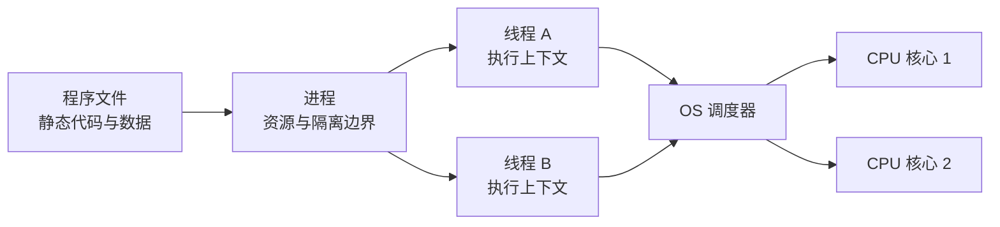
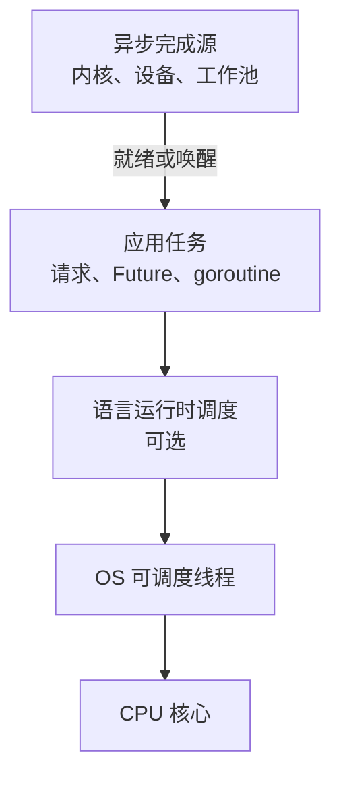
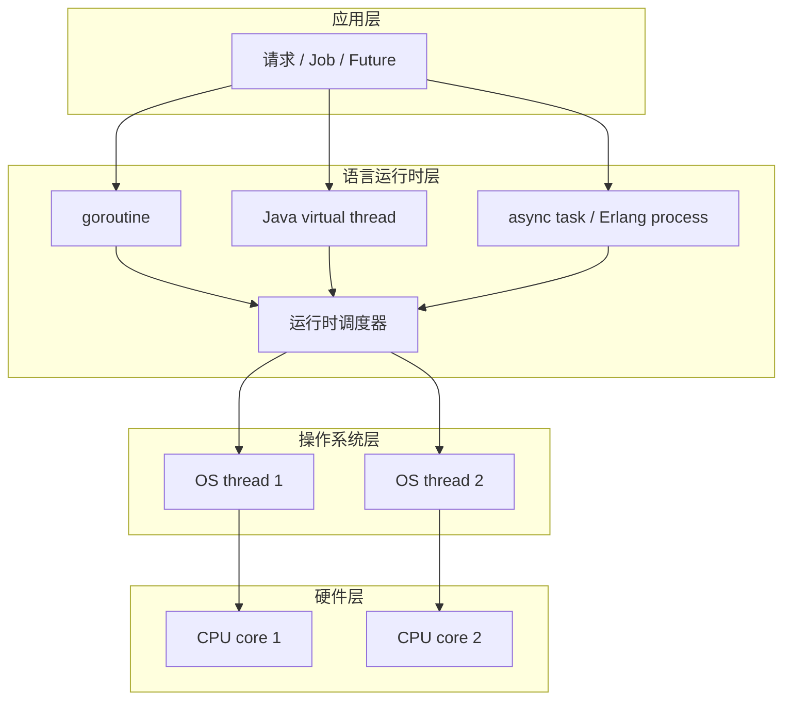
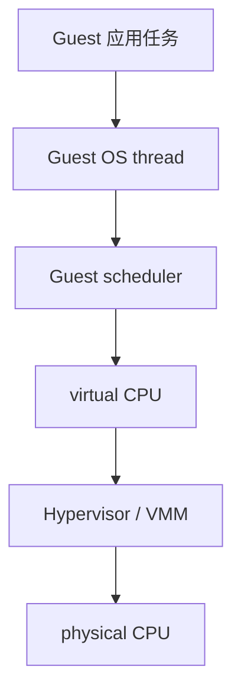
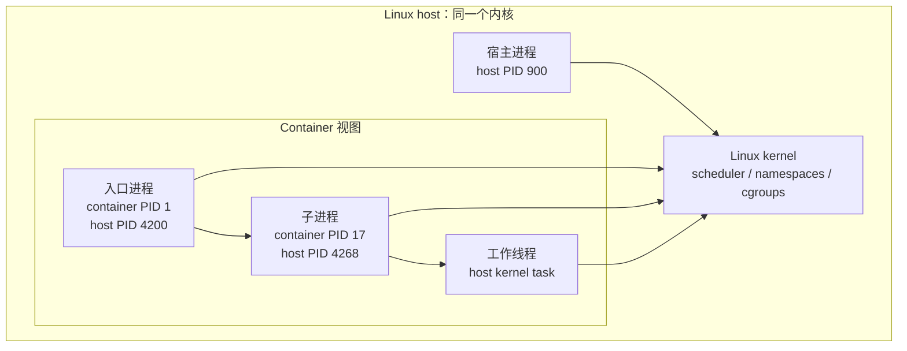
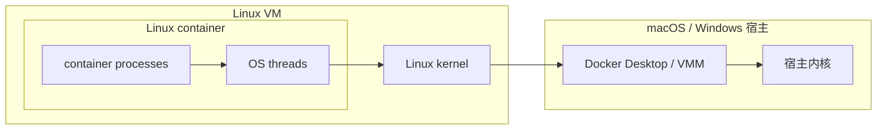

# 进程与线程：从执行与资源边界到语言、虚拟机与容器

> 查证基线：2026-09-07。本文以 POSIX.1-2024、近期 Linux man-pages、当前 Microsoft 与 Docker 文档为系统层基线；语言部分核对 Java SE 25、Python 3.14、Node.js 26、Rust 1.98 和当前 Go/Erlang 官方文档。Apple 的 Mach 概念指南是归档材料，因此只用来说明仍可由当前接口支持的稳定抽象，不据此推断当前调度器实现细节。

## 先记住一个模型，而不是两段定义

进程和线程最简洁、也最不容易失真的区别是：

> **进程主要定义资源、地址空间和故障的边界；线程主要定义这个边界内可被调度的执行流。**

一个程序文件只是静态的代码和数据。启动它以后，操作系统建立进程所需的虚拟地址空间、打开文件、权限身份等资源，再创建至少一条执行流。真正被安排到 CPU 上执行指令的，是线程或内核中与线程等价的可调度实体；“进程正在运行”是方便的简称，严格地说是进程中的某条线程正在运行。POSIX.1-2024 也把进程描述为系统资源以及一个或多个可调度线程的聚合；Windows 明确把线程定义为进程内可被调度执行的实体；Mach 则直接用 task 表示资源所有权单元，用 thread 表示 CPU 执行单元。[POSIX.1-2024 General Information](https://pubs.opengroup.org/onlinepubs/9799919799/functions/V2_chap02.html)；[Microsoft：About Processes and Threads](https://learn.microsoft.com/en-us/windows/win32/procthread/about-processes-and-threads)；[Apple：Mach Overview](https://developer.apple.com/library/archive/documentation/Darwin/Conceptual/KernelProgramming/Mach/Mach.html)



这张图回答的是“谁拥有资源、谁执行指令”。它还没有画语言运行时、容器和虚拟机；这些层会增加调度和隔离，却不会推翻这个底层模型。

但要立刻加上三条限定：

- **这是跨平台模型，不是统一的内核对象命名。** Linux 内核常把进程和线程都表示为 task，再用资源共享关系与线程组区分它们；Windows 则暴露明确的 process 和 thread 对象。
- **线程的栈虽然逻辑上私有，物理上仍映射在进程地址空间内。** 一个越界指针可以破坏别的线程的栈，所以“线程私有”不等于内存保护。
- **语言里的 thread、task、worker、goroutine 或 process 可能只是运行时对象。** 它们还要映射到 OS 线程，才可能真正占用 CPU。

后文所有差异都可以还原成五个问题：

1. 谁拥有地址空间和系统资源？
2. 谁保存可暂停、可恢复的执行状态？
3. 谁负责调度？
4. 谁共享内存、权限和故障域？
5. 当前观察的是语言运行时、容器、Guest OS，还是宿主机？

## CPU 不认识“业务任务”，只执行指令流

### 一条执行流至少需要什么

为了暂停一项工作、转去执行另一项工作，再从原位置恢复，系统至少要保存：

- 程序计数器或指令指针：下一条从哪里执行；
- 通用寄存器和状态寄存器：当前计算进行到哪一步；
- 栈指针以及调用栈：函数调用、局部变量和返回位置；
- 调度状态：是否可运行、阻塞、睡眠或等待；
- 线程局部状态：例如 thread-local storage（TLS）和部分信号状态。

这组“可恢复的执行现场”是线程的核心。一个进程可以拥有很多资源却暂时没有线程在 CPU 上执行；一个线程则必须依附于某个资源上下文，才能取指、读写内存和发起系统调用。

操作系统通常使用抢占式调度：线程运行一段时间后可能被更高优先级工作抢占，也会在等待 I/O、锁、定时器或缺页时主动离开 CPU。调度器选择的是可运行实体，不是源代码里的函数，也不是 HTTP 请求、Promise 或 goroutine 这些上层业务概念。

### 并发、并行和异步是三个维度

- **并发（concurrency）**：多个任务的生命周期重叠，系统能够在它们之间推进。
- **并行（parallelism）**：多个任务在同一时刻实际占用多个执行资源，例如多个 CPU 核心。
- **异步（asynchrony）**：发起操作后不原地等待，而是在完成时通过事件、回调、Future 或唤醒继续。

一个单线程事件循环可以并发处理许多网络连接，却不能同时在两个核心上执行两段 JavaScript；两个 OS 线程可能并行，但也可能因为只有一个核心而交替执行；异步 I/O 的完成可能由内核、设备或工作线程推动，并不等于调用者自动获得新线程。Go 官方文档也特别区分了“把程序组织为可独立推进的组成”与“在多个 CPU 上同时计算”。[Effective Go：Concurrency](https://go.dev/doc/effective_go#concurrency)



阅读性能图或线程 dump 时要沿这条链向下追问：现在堵住的是业务任务、运行时调度器、OS 线程，还是 CPU？只看其中一层，容易把排队误判为计算，把阻塞误判为 CPU 不足。

### 软件线程和硬件线程不是同一层

CPU 规格中的 hardware thread 或 logical processor 是硬件向操作系统暴露的执行位置；OS thread 是内核保存和调度的软件执行上下文。采用 simultaneous multithreading（SMT）的一个物理核心可以暴露多个 logical processors，但这些逻辑处理器会共享核心内的部分执行资源，不等于增加了同等数量的完整物理核心。OS 调度器把许多软件线程映射到这些逻辑处理器，语言 runtime 又可能把更多轻量任务映射到少量 OS threads。[Intel 64 and IA-32 Software Developer Manuals](https://www.intel.com/content/www/us/en/developer/articles/technical/intel-sdm.html)

所以“8 核 16 线程”的“线程”通常指 16 个硬件逻辑处理器；“Java 有 500 条线程”的“线程”指软件执行实体。两者同名，但一个描述硬件并行容量，一个描述等待被调度的状态。

## 进程和线程：到底共享什么

“线程共享内存、进程不共享内存”只够当第一层近似。更准确的对照如下。

| 维度 | 同一进程内的线程 | 不同进程 | 重要例外或边界 |
| --- | --- | --- | --- |
| 虚拟地址空间 | 默认共享 | 默认独立 | 进程可显式建立共享内存或映射同一文件 |
| 代码、全局变量、堆 | 默认共享 | 各自位于独立地址空间 | 写时复制页面在修改前可共享物理页 |
| 用户栈 | 每线程一份逻辑栈 | 每个线程各自有栈 | 线程栈仍位于同一进程地址空间，不受地址空间隔离 |
| 寄存器、指令位置 | 每线程独立 | 每线程独立 | 这是调度器暂停和恢复执行的核心状态 |
| 文件描述符或句柄 | 通常共享进程级表 | 默认独立，创建时可继承或显式传递 | Unix 文件描述符可能引用同一个 open file description，共享文件偏移 |
| 权限与身份 | 主要继承进程身份 | 可使用不同身份 | Windows 线程可进行 impersonation；各 OS 细节不同 |
| 信号与异常状态 | 一部分进程级、一部分线程级 | 默认分离 | POSIX 信号 disposition 是进程级，signal mask 是线程级 |
| 调度状态与优先级 | 每线程独立 | 仍落到各自线程 | 进程级优先级常作为线程调度参数的输入或上限 |
| 通信方式 | 直接读写共享对象，需要同步 | pipe、socket、消息、共享内存等 IPC | 共享内存把一部分进程通信重新变成共享状态问题 |
| 故障影响 | 内存破坏和致命本地故障通常危及整个进程 | 地址空间故障通常被限制在一个进程 | 外部数据、权限、内核漏洞和资源耗尽仍可跨边界影响其他工作 |

### 为什么线程通信方便，也更危险

两个线程可以直接访问同一对象，通信几乎不需要序列化。但“都能访问”不代表“同时访问是正确的”：

- `counter += 1` 往往是读、计算、写的组合，不是天然原子操作；
- CPU 缓存、编译器重排和乱序执行意味着“另一个线程最终会看见”不足以定义先后关系；
- 锁保护数据的同时也会引入竞争、死锁、优先级反转和尾延迟；
- 无锁算法减少阻塞，却增加内存顺序、ABA、回收安全等证明负担。

所以线程的优势不是“没有通信成本”，而是**可以在同一地址空间直接协作**；代价是共享可变状态必须有同步协议。锁、原子操作、channel 和不可变数据不是附属语法，而是在建立可验证的 happens-before 关系与所有权边界。

### 为什么进程隔离也不是一道绝对墙

进程的页表和虚拟地址空间建立了很强的默认内存边界，但进程仍可：

- 映射同一段 shared memory 或同一文件；
- 继承或传递文件描述符、socket 和操作系统句柄；
- 通过调试、注入或高权限接口读取其他进程；
- 竞争 CPU、内存、I/O、端口和内核全局资源；
- 通过数据库、文件和远程服务修改共同的外部状态。

因此，多进程通常能缩小一次内存错误或运行时崩溃的影响范围，却不能自动提供权限隔离、资源配额、数据一致性或安全沙箱。

## Linux：进程与线程是资源共享关系，而不是两种物种

### `clone()` 揭示了本质

Linux 的 `clone()`/`clone3()` 允许调用者分别决定是否共享虚拟地址空间、文件描述符表、信号处理表，并能把新 task 放入同一线程组或新的 namespace。`CLONE_VM` 让双方共享地址空间；`CLONE_FILES` 共享文件描述符表；`CLONE_SIGHAND` 共享信号 disposition；`CLONE_THREAD` 把新 task 放入调用者的线程组。创建 POSIX 线程时，这些关系以一组受约束的组合出现；创建普通子进程时，共享关系更少。[Linux `clone(2)`](https://man7.org/linux/man-pages/man2/clone.2.html)


这不是说 Linux 用户可以随意把任何组合都叫作线程。POSIX、glibc/NPTL 和 Linux 内核对线程语义施加了约束，例如 `CLONE_THREAD` 需要配合共享信号处理和地址空间。图的意义是：**“进程还是线程”背后真正变化的是共享哪些资源、属于哪个生命周期与标识组。**

### PID、TID 与 TGID

Linux 为每个 task 分配系统范围内唯一的 thread ID（TID）。同一 POSIX 进程的线程组成 thread group：

- thread group leader 的 TID 同时作为 thread group ID（TGID）；
- `getpid()` 对组内所有线程返回 TGID；
- `gettid()` 返回当前线程自己的 TID；
- `/proc/<tgid>/task/<tid>/` 暴露各线程的信息。

所以 `ps` 默认只显示 PID 时，很多线程并没有消失，只是视图按线程组折叠了。反过来，在显示每个 lightweight process（LWP）的工具里，同一个进程会出现许多行。

### 多线程进程中的 `fork()` 是危险边界

POSIX 规定，多线程进程调用 `fork()` 后，子进程只复制调用 `fork()` 的那条线程，地址空间却来自整个父进程的快照。这意味着互斥锁可能保留为“被另一个线程持有”的状态，但那条线程并不存在于子进程中。子进程在 `exec()` 前能安全调用的操作因此受到严格限制。[POSIX `fork()`](https://pubs.opengroup.org/onlinepubs/9799919799/functions/fork.html)

这也是“进程只是线程的容器”不够用的例子：进程级地址空间、线程级执行现场和库的同步状态，会在生命周期操作上发生复杂交互。

## Windows 与 macOS：模型相近，内核词汇不同

### Windows：资源对象与执行对象分得很明确

Windows process 包含虚拟地址空间、可执行代码、系统对象句柄、安全上下文、环境与优先级类等资源；thread 是进程内可被调度的实体，保存寄存器、用户栈、内核栈、thread environment block（TEB）、TLS、调度优先级等状态。一个进程从 primary thread 开始，可以继续创建其他线程。[Microsoft：About Processes and Threads](https://learn.microsoft.com/en-us/windows/win32/procthread/about-processes-and-threads)

Windows 还提供 Job Object，把多个进程作为一组管理和施加限制。它在“进程之上”增加资源与生命周期边界，但不是线程，也不是容器的同义词。

### macOS/Darwin：BSD process 建在 Mach task/thread 之上

Mach 把 task 定义为资源所有权单元：它拥有虚拟地址空间、port rights namespace 等；thread 是 task 内的控制流与 CPU 执行单元。Apple 的概念文档说明，macOS 的 BSD process 和 POSIX pthread 分别建立在 Mach task 与 Mach thread 之上。[Apple：Mach Overview](https://developer.apple.com/library/archive/documentation/Darwin/Conceptual/KernelProgramming/Mach/Mach.html)

这份 Apple 指南已归档，适合解释稳定对象关系，不适合证明当前 macOS 使用哪些具体调度算法或参数。那些细节必须回到目标 macOS 版本的 XNU 源码、接口和实机工具。

### 跨系统概念映射

| 想表达的概念 | POSIX | Linux 常见表示 | Windows | macOS/Darwin |
| --- | --- | --- | --- | --- |
| 资源与地址空间边界 | process | thread group 及共享资源结构 | process object | BSD process / Mach task |
| OS 可调度执行流 | thread | task，拥有 TID | thread object | Mach thread / pthread |
| 一组进程的资源控制 | 无单一统一对象 | cgroup、session、process group 等 | Job Object | process group、coalition 等，语义各异 |
| 用户态接口 | `fork`、`exec`、pthread | glibc 封装 Linux syscall | `CreateProcess`、`CreateThread` | POSIX/BSD API 与 Mach API |

表中每一列只能做“解释用途的近似映射”。例如 Linux cgroup 和 Windows Job Object 都能管理一组进程，却不具有完全相同的控制器、层级和安全语义。

## 语言运行时会在 OS 线程之上再抽象一次

看到一个语言 API 时，先不要问“它叫不叫线程”，而要问：**它最终按 1:1、M:1 还是 M:N 映射到 OS 线程？阻塞时是谁被阻塞？**



图中同时画出多种语言对象只是为了表示它们所处的层，不代表这些运行时共存于同一进程。运行时调度器通常只调度本语言对象；OS 调度器看见的是承载它们的 native threads。

### 原生线程：C、C++、Rust 与 Java platform thread

在现代 Linux、Windows 和 macOS 的常见实现中，POSIX pthread、C++ `std::thread`、Rust `std::thread` 和 Java platform thread 通常由一个 native OS thread 承载。Rust 标准库直接把 `std::thread` 描述为 native OS threads；Java 则明确区分传统的 platform thread 与运行时管理的 virtual thread。[Rust `std::thread`](https://doc.rust-lang.org/std/thread/)；[Java SE 25 `Thread`](https://docs.oracle.com/en/java/javase/25/docs/api/java.base/java/lang/Thread.html)

仍需保留标准边界：C++ 标准提供抽象线程，`native_handle()` 的类型和含义是 implementation-defined，不能从语言规范本身推导所有平台必定采用相同内核实现。

1:1 的好处是阻塞、抢占、调试和系统工具天然与 OS 对齐；代价是每条线程都需要内核调度对象和栈等资源，大量线程会增加内存、调度和诊断成本。

### M:N：Go goroutine 与 Java virtual thread

Go runtime 把大量 goroutine 多路复用到较少的 OS 线程上。goroutine 处于同一 Go 进程地址空间，初始栈较小且可增长；当一条 goroutine 因可识别的操作阻塞时，runtime 尽量让其他 goroutine 继续使用可运行的 OS 线程。[Effective Go：Goroutines](https://go.dev/doc/effective_go#goroutines)；[Go FAQ：Why goroutines instead of threads?](https://go.dev/doc/faq#goroutines)

Java virtual thread 在 JDK 21 成为正式特性。它仍是 `java.lang.Thread`，但不在整个生命周期独占某条 OS 线程；JDK 调度器把 virtual thread 临时 mount 到 platform thread（carrier）上运行。virtual thread 适合大量以等待为主的任务，不会减少 CPU 密集计算本身，也不应被当成无限并行资源。[OpenJDK JEP 444](https://openjdk.org/jeps/444)

版本差异很重要：JDK 24 的 JEP 491 消除了 `synchronized` 阻塞导致的 carrier pinning；Java SE 25 文档仍说明 native method 或 foreign function 可能让 virtual thread 无法卸载，从而占住 carrier。[Oracle：JDK 24 significant changes](https://docs.oracle.com/en/java/javase/25/migrate/significant-changes-jdk-24.html)；[Java SE 25 Virtual Threads](https://docs.oracle.com/en/java/javase/25/core/virtual-threads.html)

M:N 的本质是两级调度：runtime 决定哪个语言线程放到哪个 OS 线程，OS 再决定这条 native thread 何时占用 CPU。它降低了“每个并发任务都绑定一个内核线程”的成本，却引入新观察层和新失败模式，例如：

- runtime 不认识的长时间 native 阻塞可能占住 carrier；
- thread-local 大对象乘以海量虚拟线程仍会耗尽内存；
- 大量 runnable 的 CPU 任务不会因为虚拟线程更轻就得到更多核心；
- profiler 若只展示 OS 线程，可能隐藏语言级任务排队。

### Node.js：一条 JavaScript 事件循环不等于整个进程只有一条线程

典型 Node.js 进程在主 event loop 上执行 JavaScript callback，同时 libuv worker pool 会处理部分文件系统、DNS、密码学和压缩任务；V8、垃圾回收和其他内部组件也可能使用线程。`worker_threads` 则创建独立的 JavaScript execution thread，可以传递消息、转移 `ArrayBuffer`，也可以通过 `SharedArrayBuffer` 显式共享内存。[Node.js：Don’t Block the Event Loop](https://nodejs.org/en/learn/asynchronous-work/dont-block-the-event-loop)；[Node.js `worker_threads`](https://nodejs.org/api/worker_threads.html)

需要区分四个对象：

| Node.js 对象 | 是否新建独立 JavaScript 执行环境 | 是否独立 OS 进程 | 主要用途 |
| --- | --- | --- | --- |
| Promise / async task | 否，通常回到所属 event loop 执行 callback | 否 | 表达异步依赖与结果 |
| libuv worker-pool task | 不直接运行普通 JS callback | 否 | 承载特定阻塞或高成本 native 工作 |
| `worker_threads.Worker` | 是 | 否 | CPU 密集 JS、独立 event loop，可显式共享内存 |
| `child_process` | 是，通常有独立 V8 实例 | 是 | 进程隔离、执行外部程序、独立故障域 |

主事件循环上的长计算会阻止其他 callback 获得执行机会，即使操作系统仍有空闲核心。此时问题不是“Node 没有并发”，而是上层调度点被一段不可让出的工作占住。

浏览器也不应简单概括为“JavaScript 单线程”。HTML 标准为 Window、Worker、Worklet 等定义 agent 和 event loop，并明确指出 event loop 不必与实现线程一一对应；不同 agent 可以通过消息通信，满足条件时也能共享 `SharedArrayBuffer`。[WHATWG HTML：Event loops](https://html.spec.whatwg.org/multipage/webappapis.html#event-loops)；[WHATWG HTML：Web workers](https://html.spec.whatwg.org/multipage/workers.html)

### CPython：GIL 限制解释器执行，不会把 OS 线程变成假的

`threading.Thread` 在 CPython 中仍创建真实的 native threads，它们共享同一进程地址空间。默认启用 Global Interpreter Lock（GIL）的 CPython 在同一解释器内通常只允许一条线程执行 Python bytecode，但线程可以在等待 I/O 时并发推进；释放 GIL 的 native extension 也可能在多个核心上并行执行。[Python 3.14 `threading`](https://docs.python.org/3.14/library/threading.html)

因此，“Python 多线程不能并行”至少漏掉了三个条件：

1. 说的是 CPython，而不是 Python 语言的所有实现；
2. 说的是持有同一 GIL 执行 Python bytecode；
3. 不包括释放 GIL 的本地计算、多个解释器或 free-threaded build。

Python 3.13 起提供可禁用 GIL 的 free-threaded build；截至 Python 3.14，它仍不是默认构建，部分扩展可能重新启用 GIL，线程安全与单线程开销也有新的取舍。[Python 3.14：Free-threading HOWTO](https://docs.python.org/3.14/howto/free-threading-python.html)

`multiprocessing` 使用子进程绕开同一解释器 GIL，但要支付进程启动、序列化、数据复制或共享内存同步等成本。Python 3.14 还改变了 POSIX 平台的默认进程启动方式，因此旧教程里“multiprocessing 默认就是 fork”已不是通用当前结论。[Python 3.14 `multiprocessing`](https://docs.python.org/3.14/library/multiprocessing.html)

Python 3.14 新增的 `InterpreterPoolExecutor` 又展示了第三种组合：每个 worker 是同一 OS 进程中的一条线程，但每条线程运行独立 interpreter，并拥有自己的 GIL，因此可以执行多核 Python 代码。它不是普通共享解释器线程，也不是 OS 子进程；隔离的 runtime state 和不可直接共享的可变对象使它更接近“进程式协作”，而文件描述符和进程地址空间仍属于同一 OS process。[Python 3.14 `InterpreterPoolExecutor`](https://docs.python.org/3.14/library/concurrent.futures.html#interpreterpoolexecutor)

### Erlang process：同一个词，完全不同的一层

BEAM 中的 Erlang process 是轻量运行时实体，拥有独立 mailbox 与逻辑隔离的状态，由 Erlang scheduler threads 承载；它不是普通 OS 进程。一个 BEAM OS 进程中可以存在大量 Erlang processes，多条 scheduler threads 再利用多个核心。[Erlang/OTP 29：Processes](https://www.erlang.org/doc/system/ref_man_processes.html)；[Erlang/OTP：SMP Run-Time System](https://www.erlang.org/doc/system/eff_guide_processes.html#smp-run-time-system)

这说明名字不是判断依据。准确表达应带上层级：OS process、Erlang process、Java virtual thread、Node worker，而不是只说“进程”或“线程”。

### 语言对象到 OS 的映射总表

| 语言或运行时对象 | 典型映射 | OS 是否直接调度它 | 能否利用多核 | 首要边界 |
| --- | --- | --- | --- | --- |
| POSIX pthread | 1:1 native thread | 是 | 能 | 共享地址空间，需要同步 |
| Rust `std::thread` | 1:1 native thread | 是 | 能 | 所有权系统减少部分数据竞争，不消除死锁与逻辑竞态 |
| Java platform thread | 1:1 OS thread | 是 | 能 | 数量与阻塞成本受 OS thread 约束 |
| Java virtual thread | M:N 到 platform threads | 否 | 能，受 carrier 与核心数限制 | 适合等待密集任务，native pinning 与外部资源仍有限 |
| Go goroutine | M:N 到 OS threads | 否 | 能，受 runtime 与 `GOMAXPROCS` 等约束 | runtime 调度、阻塞识别、共享状态 |
| Node.js event-loop task | 多个 task 复用一条 event-loop thread | 否 | 单个 event loop 上的 JS 不能并行 | callback 公平性与阻塞 |
| Node.js Worker | 独立 JS thread | 间接，对应 native thread | 能 | 消息、转移或显式共享内存 |
| CPython `threading.Thread` | native thread | 是 | 取决于 GIL 状态与执行内容 | 默认 GIL、扩展行为、共享状态 |
| Python `InterpreterPoolExecutor` | 每个 worker 是 native thread + 独立 interpreter | OS 调度 worker thread | 能，每个 interpreter 有自己的 GIL | runtime state 隔离、数据交换与序列化 |
| Python `multiprocessing.Process` | OS process | 其内部线程由 OS 调度 | 能 | IPC、序列化、启动方式 |
| Erlang process | M:N 到 BEAM scheduler threads | 否 | 能 | mailbox、调度器与 runtime 故障域 |
| async task / coroutine | 由库或 runtime 决定 | 通常否 | 取决于 executor | cooperative yield、阻塞调用与取消 |

“典型映射”不是语言规范对所有实现的永久承诺。排障时仍应核对实际 runtime、版本和启动参数。

## 宿主 OS、虚拟机与 Docker：进程运行在哪一层

### 裸机：一层内核调度

在普通宿主 OS 上，应用进程属于该 OS 内核。内核创建地址空间和线程，将可运行线程安排到物理或逻辑 CPU。语言运行时可以在这之上增加一次用户态调度，但最终必须由宿主 OS 线程承载。

### 系统虚拟机：Guest OS 拥有自己的进程世界

系统虚拟机不是“给进程换一个目录”，而是给 Guest OS 提供虚拟 CPU、内存、中断和设备。Guest 内核建立自己的页表、PID 空间、进程、线程和调度器。Hypervisor 再把 virtual CPU（vCPU）映射或调度到物理 CPU；在 hosted VMM 中，vCPU 也可能由宿主线程承载。[Microsoft：Hyper-V Architecture](https://learn.microsoft.com/en-us/virtualization/hyper-v-on-windows/reference/hyper-v-architecture)

因此存在嵌套调度：



Guest OS 认为自己的线程正在某个 vCPU 上运行；宿主或 hypervisor 通常只直接调度 vCPU 对应的执行实体，看不到 Guest 线程的全部语义。于是可能出现“Guest 认为线程可运行，但 vCPU 暂时没有获得物理 CPU”的 steal/preemption；只看 Guest 内部指标不一定解释得了宿主争用。

### 原生 Linux Docker：容器是被隔离和约束的进程集合

在原生 Linux Docker Engine 上，容器没有自己的 Linux 内核。容器入口程序及其子进程仍由宿主 Linux 内核创建和调度；namespace 改变它们能看到的进程、网络、挂载点、主机名、用户等视图，cgroup 组织和约束 CPU、内存、I/O、进程数等资源。Docker 官方的入门定义直接把容器称为 isolated process，OCI Runtime Specification 的运行状态也以 container process 及其 PID 为核心。[Docker：What is a container?](https://docs.docker.com/get-started/docker-concepts/the-basics/what-is-a-container/)；[OCI Runtime Specification](https://specs.opencontainers.org/runtime-spec/runtime/)

PID namespace 说明了“同一进程、不同编号视图”：一个进程在自己所在的 PID namespace 以及各祖先 namespace 中可以有不同 PID；子 namespace 看不到祖先 namespace 的进程，祖先则能看到后代。[Linux `pid_namespaces(7)`](https://man7.org/linux/man-pages/man7/pid_namespaces.7.html)



虚线式的“容器边框”只是视图与约束的组合，不是调度器中的单个执行对象。由此可得：

- 容器可以有一个进程，也可以有一棵进程树；
- 容器本身不获得时间片，容器中的线程才被调度；
- PID 1 是 namespace 内的编号和生命周期角色，不代表它在宿主也叫 PID 1；
- cgroup 常以进程域管理资源，但 cgroup v2 对部分控制器也支持 thread mode，不能机械断言“资源限制永远只到进程粒度”。[Linux kernel：Control Group v2](https://www.kernel.org/doc/html/latest/admin-guide/cgroup-v2.html)

当 PID namespace 的 init 进程终止时，内核会终止该 namespace 中其余进程；Docker 也以入口进程退出作为容器停止的核心生命周期事件。让一个不能正确转发信号、回收子进程的普通应用直接承担 PID 1，可能导致优雅退出和 zombie 回收问题。[Linux `pid_namespaces(7)`](https://man7.org/linux/man-pages/man7/pid_namespaces.7.html)

### Docker Desktop：Linux 容器在隐藏的 Linux VM 里

在 macOS 或 Windows 上运行 Linux 容器时，宿主内核不是 Linux，不能直接提供 Linux namespace、cgroup 和 syscall ABI。Docker Desktop 因此在轻量 Linux VM 内运行 Docker Engine；容器进程属于这个 Linux Guest。宿主看到的通常是 Docker backend、VMM/VM 相关进程与转发连接，而不是一组原生 macOS/Windows Linux 进程。[Docker Desktop：Networking](https://docs.docker.com/desktop/features/networking/)



这解释了常见差异：

- 在原生 Linux 宿主上，宿主 `/proc` 能观察容器 task；
- 在 macOS 上，Activity Monitor 不会直接列出 Linux Guest 内每条容器线程；
- 文件挂载和端口发布需要跨 VM 边界转发，性能与权限语义不能机械等同于原生 Linux；
- 容器里看到的 CPU 和内存上限可能先受 cgroup 限制，再受 VM 分配限制，最后受宿主资源竞争影响。

### Windows container：process isolation 与 Hyper-V isolation

Windows containers 有两种重要运行边界：

- **process isolation**：容器与宿主共享内核，通过 namespace、资源控制等隔离；容器进程也能作为宿主进程被观察。
- **Hyper-V isolation**：每个容器位于高度优化的 VM 中，获得独立内核与硬件辅助隔离；宿主看到承载 VM 的进程，而不是容器内应用进程本身。

两种模式使用相同镜像与管理接口，却有不同的内核、可见性和安全边界。它们证明“由 Docker 启动”不能单独回答进程运行在哪里。[Microsoft：Windows Container Isolation Modes](https://learn.microsoft.com/en-us/virtualization/windowscontainers/manage-containers/hyperv-container)

### “VM”还可能指语言虚拟机

JVM、BEAM 和 V8 常被叫作 virtual machine，但它们通常是宿主 OS 中的用户态进程，负责字节码、JIT、GC 与语言任务调度；它们并不自动拥有独立 Guest kernel。系统 VM 与语言 VM 的共同点是提供抽象执行环境，关键区别是隔离层级：

| 对象 | 是否有独立内核 | 谁创建 OS 进程/线程 | 典型边界 |
| --- | --- | --- | --- |
| JVM / BEAM / V8 | 否 | 宿主或 Guest OS | 一个用户态 runtime 进程及其线程 |
| Docker container（原生 Linux） | 否 | 宿主 Linux 内核 | namespace + cgroup + 文件系统与安全配置 |
| 系统 VM | 是 | Guest 内核 | vCPU、Guest memory、虚拟设备和 Guest kernel |

## 隔离、通信和故障：真正需要选择的边界

从线程到进程、容器、VM，通常会逐步增加默认边界，但每层解决的问题不同。


图的方向不是“越右永远越好”，也不是严格的安全等级。容器配置可以主动打通宿主目录、网络、设备或高权限接口；VM 也会受 hypervisor 漏洞、共享管理面和外部数据系统影响。它表达的是每层**新增的默认机制**：

| 层级 | 新增的主要边界 | 仍未自动解决 |
| --- | --- | --- |
| 线程 | 独立栈、寄存器、调度状态 | 地址空间隔离、共享状态正确性 |
| 进程 | 独立地址空间、句柄/资源上下文、退出状态 | 资源配额、文件系统视图、宿主内核隔离 |
| 容器 | namespace、cgroup、root filesystem、安全配置 | 独立内核、绝对安全、数据备份与应用正确性 |
| VM | Guest kernel、vCPU、Guest memory、虚拟设备 | hypervisor/管理面安全、外部依赖和业务故障 |

### 故障传播不能只看“抛了异常”

- 一条 Java 或 JavaScript 任务抛出语言异常，可能只结束该任务；具体行为由 runtime 与异常处理策略决定。
- native code 的非法内存访问、`abort` 或某些未处理硬件异常，通常会结束整个 OS 进程，进程内所有线程一同消失。
- 一个 worker 进程崩溃时，其他进程通常仍能运行，但共享文件、数据库事务和上游请求可能已经受到影响。
- 容器入口进程退出通常让容器停止；restart policy 能重启实例，却不能修复数据损坏、死循环或无背压设计。
- Guest kernel panic 通常结束整个 VM 内的工作负载；宿主和其他 VM 是否受影响取决于 hypervisor 与共享基础设施。

“多进程更可靠”只有在监督、重试幂等性、状态恢复和资源限制同时存在时才可能成立。把同一错误输入广播到所有 worker，或让它们共享同一损坏状态，进程边界也无法提供业务级容错。

## 性能：不要背“进程重、线程轻”

这句口诀描述了常见方向，却隐藏了真正决定成本的因素。

### 创建成本

- native thread 需要内核调度实体、栈的虚拟地址范围、TLS 与 runtime 状态；
- 新进程需要新的地址空间与一组进程资源，但 Unix `fork()` 通常利用 copy-on-write，并不在调用瞬间复制所有物理内存；
- Windows `CreateProcess`、POSIX `fork` + `exec`、Python `spawn`/`forkserver` 的初始化路径不同；
- Java virtual thread、goroutine 和 async task 减少了每个任务绑定 native thread 的成本，但仍占用栈片段、队列节点、上下文对象和业务资源。

### 切换成本

线程或进程切换都要保存执行现场并运行调度器。切换到不同地址空间还可能切换页表上下文并影响 translation lookaside buffer（TLB），但现代 CPU 的地址空间标识等机制会改变实际代价。无论是否切换地址空间，工作集离开缓存、锁竞争和 NUMA 迁移都可能远比保存几个寄存器昂贵。

所以不能脱离 CPU、内核、工作集、切换原因和测量方法，声称“进程切换一定比线程慢 N 倍”。

### 内存成本

进程的虚拟地址空间大小不是它独占的物理内存。代码页、共享库、文件映射和 copy-on-write 页面可能共享物理页；线程栈也常先保留虚拟地址范围，再按需提交物理页。比较内存时至少要区分：

- virtual size：可寻址或保留的范围；
- resident set：当前驻留在物理内存的页面；
- proportional/shared set：共享页如何分摊；
- runtime heap、native heap、stack 和 page cache。

### 并发数量不是吞吐量

如果机器有 8 个可用核心，创建 10 万个持续计算的 runnable tasks 不会变出更多算力，只会增加排队、切换与缓存扰动。轻量任务真正擅长的是表达大量**大部分时间在等待**的并发工作，并让少量 native threads 保持有事可做。

性能问题应拆成：

```text
吞吐 / 延迟
  = 可用 CPU 与设备能力
  - 调度和切换
  - 同步与通信
  - 数据复制与序列化
  - 缓存和内存层级损失
  - 排队、背压与外部依赖等待
```

容器不是天然性能优化。原生 Linux 容器少了一层 Guest kernel 与虚拟硬件，通常比完整 VM 路径更短；但 cgroup throttling、overlay filesystem、网络转发、Docker Desktop VM 和资源超卖都可能成为实际瓶颈。

## 如何选择：从约束反推抽象

| 首要需求 | 优先考虑 | 获得什么 | 主要代价与检查点 |
| --- | --- | --- | --- |
| 同一进程内共享大量数据并并行计算 | native threads、受控线程池 | 低复制成本、直接共享 | 数据竞争、锁竞争、崩溃域相同 |
| 海量 I/O 等待且偏好同步代码 | Java virtual threads、goroutines 等 runtime task | 高并发表达与较低 per-task 成本 | runtime 阻塞边界、外部连接池、背压 |
| 单线程状态机处理大量连接 | event loop / async tasks | 避免每连接一线程 | 不能阻塞 event loop，CPU 工作需卸载 |
| 利用多核且绕开单解释器限制 | 多进程或多个隔离解释器 | 独立执行与部分故障隔离 | IPC、序列化、启动与内存成本 |
| 不可信组件或高风险 native code | 独立进程 + 最小权限/sandbox | 地址空间和权限边界 | 协议设计、监督与恢复 |
| 独立部署、文件系统与资源配额 | container | 可分发运行环境、namespace/cgroup | 共享内核、安全配置与持久化责任 |
| 需要不同内核或更强内核边界 | system VM | Guest kernel 与虚拟硬件边界 | 启动、内存、镜像与运维成本 |
| 跨机器扩展 | 进程/容器 + 网络协议 | 独立故障域与水平扩展 | 网络分区、一致性、可观测性 |

选择顺序可以化简为：

1. **先决定隔离和故障域**：一次内存破坏允许影响谁？
2. **再决定共享方式**：必须共享大对象，还是可以传消息？
3. **再判断等待与计算比例**：主要在等 I/O，还是持续占 CPU？
4. **再核对 runtime 约束**：GIL、event loop、carrier、native blocking 会怎样改变映射？
5. **最后用目标负载测量**：不要从抽象名称直接推断性能。

这些方案可以组合：一台 VM 运行多个 containers；每个 container 启动多个 worker processes；每个 process 内有 native threads；每条 native thread 又承载许多 goroutines 或 virtual threads。复杂系统真正的问题往往不是“进程还是线程”，而是**每一层的数量、背压和故障边界是否一致**。

## 排障：先确定自己正在观察哪一层

| 现象 | 首先检查的层 | 容易犯的错 |
| --- | --- | --- |
| CPU 只用到一个核心 | 语言 runtime、runnable OS threads、CPU quota | 仅凭“创建了很多 task”断言可以并行 |
| Node.js 延迟突然升高 | event-loop lag、callback 耗时、worker pool | 只看进程总线程数 |
| Python 有很多线程但 CPU 接近单核 | GIL 是否启用、代码是否释放 GIL、cgroup quota | 说成 OS 没有调度这些线程 |
| Java virtual threads 大量等待 | virtual-thread dump、carrier、外部连接池、native pinning | 只查看传统 OS thread dump |
| 容器里 PID 是 1，宿主上不是 | PID namespace 与宿主 PID | 认为存在两份进程 |
| Docker Desktop 宿主看不到容器进程 | Linux VM 边界 | 按原生 Linux Engine 的观察方式推断 macOS/Windows |
| VM 内 CPU 很忙但宿主总 CPU 不高 | Guest scheduler、vCPU 配额与 steal、宿主调度 | 把 Guest thread 直接等同宿主 thread |
| 内存数字互相对不上 | RSS、共享页、cgroup、VM 分配、宿主缓存 | 把 virtual size 当作独占物理内存 |

在原生 Linux 上，下面这些工具观察的对象不同：

```bash
# 按线程展开宿主进程视图；字段支持取决于 procps 版本
ps -eLo pid,tid,tgid,ppid,stat,psr,comm

# 一个线程组中的 task
ls /proc/<pid>/task

# 进程在线程数与 namespace PID 链
grep -E '^(Threads|NSpid):' /proc/<pid>/status

# 从 Docker 控制面看容器进程；输出仍受平台与 namespace 影响
docker top <container>
docker inspect --format '{{.State.Pid}}' <container>
```

这些命令是观察入口，不是跨平台契约。在 Docker Desktop、rootless container、远程 daemon、Kubernetes pod 或 Hyper-V isolation 下，命令所在的位置决定它能看到哪一层。

完整诊断通常需要把五类证据对齐：

1. 应用任务：请求、队列、Promise、goroutine、virtual thread；
2. runtime：event loop、GC、线程池、scheduler 和 blocking 状态；
3. OS：PID/TID、CPU、内存、锁、系统调用和 I/O wait；
4. 隔离层：namespace、cgroup、container 与 VM 配额；
5. 硬件与外部系统：核心、NUMA、存储、网络和依赖服务。

## 十个常见误解

### “一个程序就是一个进程”

程序是静态制品，同一个程序可以启动多个进程；一个进程也会加载许多程序模块和动态库。

### “进程之间绝不共享内存”

默认地址空间独立，但 shared memory、共享文件映射和 copy-on-write 都会共享物理页面或可见数据。区别在于共享必须显式建立并受 OS 映射保护，而不是任意指针天然互通。

### “线程一定比进程快”

“快”必须指定创建、通信、切换、吞吐还是故障恢复。共享内存可能省去复制，也可能因为锁和缓存争用更慢；进程 IPC 可能复制数据，也可能使用共享内存或零拷贝机制。

### “一个进程只能在一个 CPU 核心上运行”

同一进程的多条 native threads 可以同时在多个核心上运行。单线程进程在同一瞬间通常只能占一个逻辑处理器，但运行期间可以被迁移到不同核心。

### “JavaScript 或 Node.js 只有一个线程”

常见主 event loop 在一条线程上执行 JavaScript callback，但宿主、V8、libuv worker pool 与 `worker_threads` 可以使用其他线程。更准确的问题是“这段 JS 属于哪个 agent/event loop，是否被允许并行执行”。

### “Python 多线程永远不能并行”

默认 CPython 的同一 GIL 限制 Python bytecode 并行；I/O、释放 GIL 的 native code、多个进程、多个隔离解释器和 free-threaded build 都改变结论。

### “goroutine 和 virtual thread 就是更小的 OS thread”

它们是由语言 runtime 调度的执行单元，只有被 mount 或映射到 native thread 后才会运行。它们减少绑定 OS thread 的成本，不增加硬件核心，也不消除共享状态和外部资源限制。

### “容器就是轻量虚拟机”

原生 Linux 容器共享宿主内核，系统 VM 拥有 Guest kernel。Docker Desktop 又会把 Linux containers 放入一个 Linux VM，因此实际结构可能是两者嵌套，而不是二选一。

### “一个 Docker container 只能有一个进程”

容器有一个承担生命周期角色的入口进程，但可以包含子进程和许多线程。是否采用单进程应用模式是工程约定，不是内核限制。

### “VM 内线程由宿主 OS 直接调度”

Guest scheduler 先把 Guest threads 放到 vCPU；hypervisor 或宿主再安排 vCPU。宿主通常不知道 Guest thread 的完整语义，这也是嵌套调度与可观测性断层的来源。

## 最终压缩：五问与一条链

遇到任何语言、容器或虚拟化环境，只问五件事：

1. **资源归谁？** 地址空间、文件、socket、权限和环境属于哪个边界？
2. **现场归谁？** 寄存器、栈、程序计数器与 TLS 属于哪个执行单元？
3. **谁调度谁？** runtime 调度 task，Guest 调度 thread，hypervisor 调度 vCPU，还是宿主直接调度 native thread？
4. **故障影响谁？** 一次异常、内存破坏、OOM 或内核崩溃会结束 task、thread、process、container 还是 VM？
5. **工具站在哪层？** 当前 PID、线程数、CPU 与内存指标来自应用、container、Guest 还是 host？

然后沿一条链检查：

```text
业务任务
  → 语言运行时实体
  → OS 线程
  → Guest vCPU（如果存在系统 VM）
  → 物理 CPU
```

进程与线程的本质区别并没有因语言、Docker 或 VM 消失。变化的是：中间增加了多少层抽象，资源在哪一层共享，执行单元由谁调度，观察者能看到哪一层，以及故障在哪个边界被截住。

## 主要来源与证据边界

### 操作系统与标准

- [The Open Group：POSIX.1-2024 General Information](https://pubs.opengroup.org/onlinepubs/9799919799/functions/V2_chap02.html)：进程、线程和调度的标准模型。
- [The Open Group：`fork()`](https://pubs.opengroup.org/onlinepubs/9799919799/functions/fork.html)：多线程进程 fork 后的语义边界。
- [Linux man-pages：`clone(2)`](https://man7.org/linux/man-pages/man2/clone.2.html)：Linux task 的资源共享组合、TID 和线程组。
- [Linux man-pages：`pid_namespaces(7)`](https://man7.org/linux/man-pages/man7/pid_namespaces.7.html)：PID 可见性、嵌套与 namespace init。
- [Linux kernel：Control Group v2](https://www.kernel.org/doc/html/latest/admin-guide/cgroup-v2.html)：进程域和 thread mode 的资源控制语义。
- [Microsoft：About Processes and Threads](https://learn.microsoft.com/en-us/windows/win32/procthread/about-processes-and-threads)：Windows process/thread 所有权与调度状态。
- [Apple：Mach Overview](https://developer.apple.com/library/archive/documentation/Darwin/Conceptual/KernelProgramming/Mach/Mach.html)：Mach task/thread 概念。该材料已归档，本文没有用它证明当前调度实现。

### 语言与运行时

- [OpenJDK JEP 444：Virtual Threads](https://openjdk.org/jeps/444)与 [Java SE 25 `Thread`](https://docs.oracle.com/en/java/javase/25/docs/api/java.base/java/lang/Thread.html)：platform/virtual threads 及 carrier 模型。
- [Python 3.14 `threading`](https://docs.python.org/3.14/library/threading.html)、[free-threading HOWTO](https://docs.python.org/3.14/howto/free-threading-python.html)与 [`multiprocessing`](https://docs.python.org/3.14/library/multiprocessing.html)：GIL、free-threaded build 和多进程边界。
- [Python 3.14 `InterpreterPoolExecutor`](https://docs.python.org/3.14/library/concurrent.futures.html#interpreterpoolexecutor)：同一进程中独立 interpreter、worker thread 与 per-interpreter GIL 的组合边界。
- [Node.js：Event Loop 与 Worker Pool](https://nodejs.org/en/learn/asynchronous-work/dont-block-the-event-loop)及 [`worker_threads`](https://nodejs.org/api/worker_threads.html)：主事件循环、内部工作池和 JavaScript workers。
- [Go：Goroutines](https://go.dev/doc/effective_go#goroutines)：goroutine 到 OS threads 的多路复用。
- [Rust `std::thread`](https://doc.rust-lang.org/std/thread/)：Rust 标准库的 native-thread 模型。
- [WHATWG HTML：Event loops](https://html.spec.whatwg.org/multipage/webappapis.html#event-loops)：Web agent/event loop 与实现线程并非简单一一映射。
- [Erlang/OTP：Processes](https://www.erlang.org/doc/system/ref_man_processes.html)：语言级 process 与 OS process 的术语边界。

### 容器与虚拟化

- [Docker：What is a container?](https://docs.docker.com/get-started/docker-concepts/the-basics/what-is-a-container/)与 [Running containers](https://docs.docker.com/engine/containers/run/)：容器作为隔离进程及其宿主关系。
- [OCI Runtime Specification](https://specs.opencontainers.org/runtime-spec/runtime/)：container process、PID 和生命周期的规范边界。
- [Docker Desktop：Networking](https://docs.docker.com/desktop/features/networking/)：Docker Engine、Linux VM 与 macOS/Windows 宿主之间的当前结构。
- [Microsoft：Hyper-V Architecture](https://learn.microsoft.com/en-us/virtualization/hyper-v-on-windows/reference/hyper-v-architecture)：Guest、partition、vCPU 与 hypervisor 边界。
- [Microsoft：Windows Container Isolation Modes](https://learn.microsoft.com/en-us/virtualization/windowscontainers/manage-containers/hyperv-container)：process 与 Hyper-V isolation 的区别。

本文交叉验证了“资源所有权与执行单元”“语言任务到 OS thread 的映射”“原生容器共享内核”“系统 VM 拥有 Guest kernel”四组核心结论。本文没有执行跨 OS、Docker 或 hypervisor 的基准测试，因此所有性能结论都是机制层的条件化分析，不包含通用倍数，也不代表特定生产环境的实测结果。
